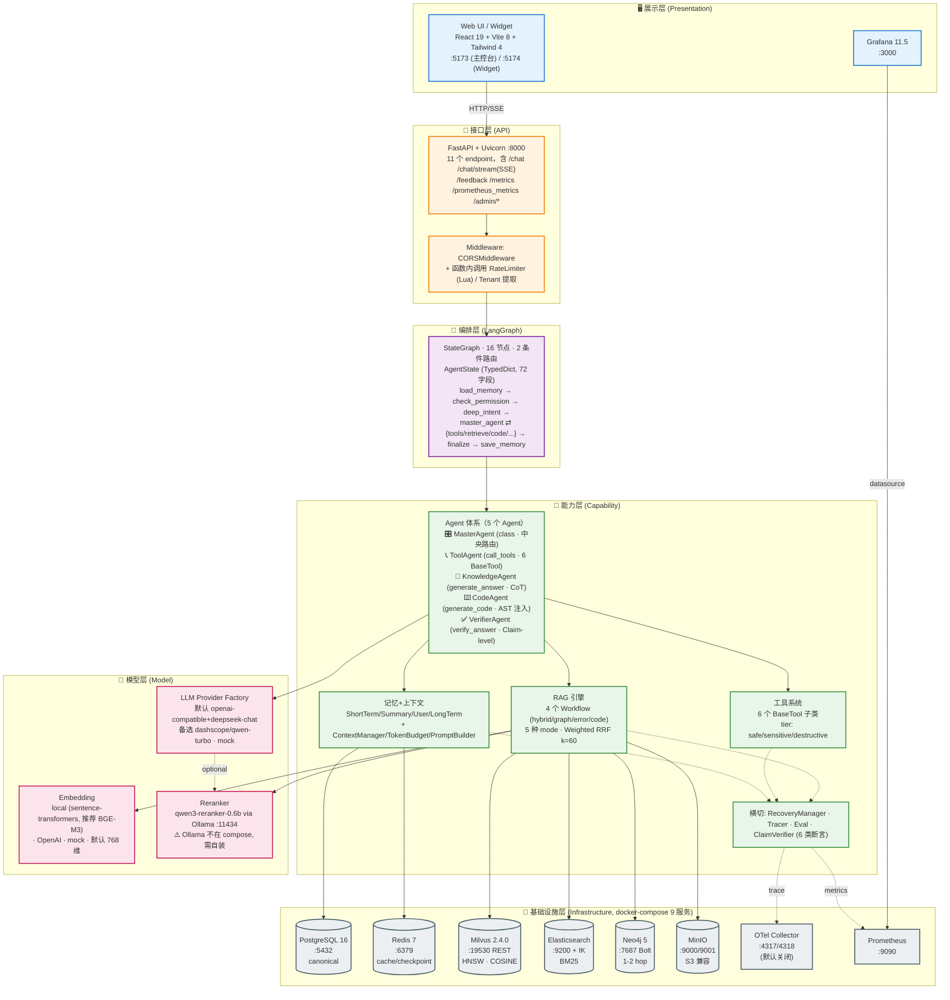
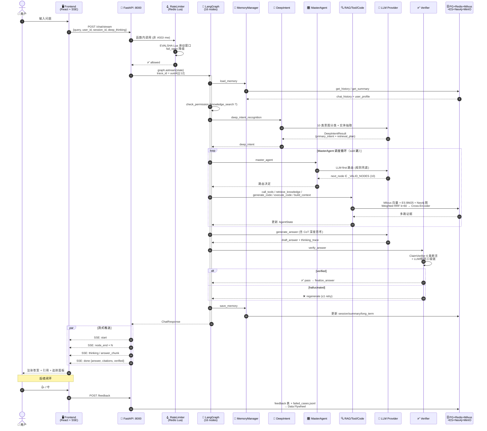
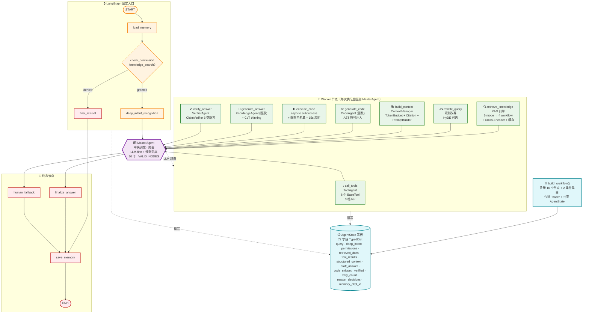
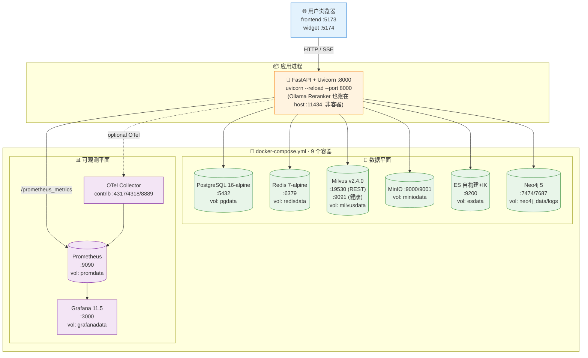
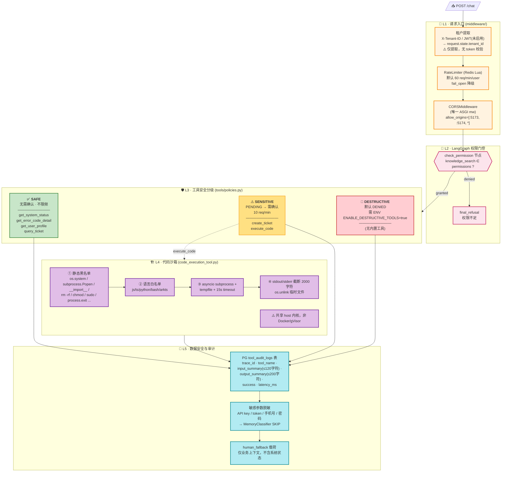

# 项目总览与系统架构

> 系统分层、请求生命周期、部署拓扑、项目定位与设计原则。

## ⚠️ 关键易误会点

### 易误会点 1：项目 = "向量库 + LLM"？

**错**。项目是 **5 Agent + 16 Node + 9 服务** 的完整 RAG 系统。

| 易被忽略的组件 | 实际位置 |
|---------------|---------|
| 工具系统 | 6 BaseTool + 3 tier |
| 记忆系统 | 4 层 (上下文/工作/短期/长期) |
| 可观测 | Tracer + Metrics + Eval |
| 降级链 | 5 级 |
| 灰度回滚 | Harness + ThresholdCalibrator |

### 易误会点 2：LangGraph StateGraph ≠ 简单 Workflow

| 概念 | 误解 | 实际 |
|------|------|------|
| 节点 (Node) | 16 个函数 | 16 个 Node 注册（可能共用函数）|
| 边 (Edge) | 静态 | 普通边 + 2 个条件边 |
| 状态 (State) | 简单 dict | 72 字段 TypedDict |
| 循环 | 不支持 | 支持（MasterAgent 调度循环）|
| Checkpoint | 没用 | 关键（state 持久化）|

### 易误会点 3：5 Agent = 5 个 Worker？

**错**。5 Agent = **1 Master + 4 Worker**。

| Agent | 类/函数 | 角色 |
|-------|---------|------|
| MasterAgent | class | 中央路由 |
| ToolAgent | call_tools | 工具调用 |
| KnowledgeAgent | generate_answer_async | 答案生成 |
| CodeAgent | generate_code | 代码生成 |
| VerifierAgent | verify_answer_async | 答案校验 |

> MasterAgent 不是平级 Node，是运行时调度器。

### 易误会点 4：9 个服务 = 必须全部跑

| 服务 | 必选 | 降级 |
|------|------|------|
| PostgreSQL 16 | ✅ | SQLite (dev) |
| Redis 7 | ✅ | 内存 |
| Milvus 2.4 | ⚠️ | ES + 关键词 |
| Elasticsearch | ⚠️ | Jaccard 内存 |
| Neo4j 5 | ❌ | 跳过 graph_first |
| MinIO | ❌ | 本地 FS |
| OTel Collector | ❌ | 关闭 |
| Prometheus | ⚠️ | 内存 |
| Grafana | ❌ | 关闭 |

> **Reranker 需外置 Ollama**（不在 compose）。

### 易误会点 5：80% Workflow + 20% Agent ≠ "主从架构"

| 维度 | 80% (Workflow) | 20% (Agent) |
|------|----------------|-------------|
| 内容 | LangGraph 16 节点 | Deep Intent / Tool / Verifier |
| 确定性 | 100% 固定 | 受控动态 |
| 面试话术 | "确定性主流程" | "3 处受控决策" |

### 易误会点 6：项目不是"自研 RAG 框架"

是用 LangGraph 编排 + 自研能力层。LangGraph 提供**状态机**，项目提供 **Agent / RAG / Tool / Memory / Eval 能力模块**。

### 易误会点 7：MasterAgent 路由 ≠ 自由 LLM 决策

LLM-first + **规则兜底**。LLM 输出非法 `next_node` → 直接降级到规则链。Mock 模式下 LLM 路径被跳过。

### 易误会点 8：Hub-and-Spoke ≠ Multi-Agent 对话

```
MasterAgent ←→ 5 个 Worker
```

**所有交互通过 AgentState 黑板**，没有 Worker-to-Worker 直接调用。Multi-Agent "对话"是另一种范式。

### 易误会点 9：项目 = "鸿蒙开发助手"？

不限于鸿蒙。**项目是 Agentic RAG 框架**，demo 数据是 HarmonyOS，但架构适用于：
- 任何企业内部知识库
- API 文档问答
- 错误诊断
- 代码生成

### 易误会点 10：max_graph_steps=18 ≠ 实际步数

是**上限**。典型请求 5-8 步完成。> 18 步才触发 `human_fallback`。

---

## 🔑 关键决策矩阵

### A. 5 个核心数字（项目规模）

| 数字 | 含义 |
|------|------|
| **5** | Agent 数 / RetrievalMode 数 |
| **10** | IntentCategory 数 |
| **16** | LangGraph Node 数 |
| **72** | AgentState 字段数 |
| **22** | Agent 决策评估用例数 |

### B. 6 层架构职责

| 层 | 职责 | 关键文件 |
|---|------|---------|
| 接口层 (API) | FastAPI + 中间件 | `app/main.py` `middleware/` |
| 编排层 (LangGraph) | 16 节点状态机 | `graph/workflow.py` |
| 能力层 (Capability) | 5 Agent + RAG + Tool + Memory | `agents/` `rag/` `tools/` `memory/` |
| 模型层 (Model) | LLM + Embedding + Rerank | `llm/` `rag/embedding_provider.py` |
| 基础设施 (Infra) | 9 个 docker 服务 | `deploy/docker-compose.yml` |
| 横切 (Cross) | Recovery/Tracer/Eval | `recovery/` `observability/` `evals/` |

### C. 5 个项目亮点

| 亮点 | 体现 |
|------|------|
| Agentic Hybrid RAG | 5 mode × 4 workflow × 3 召回 |
| Claim-level Verification | 6 类断言逐条对照源 |
| 5 级降级链 | 预先定义、非动态 |
| 16 节点 2 条件边 | LangGraph 显式状态机 |
| Harness 自动回滚 | 阈值校准 + 灰度 |

### D. 请求生命周期（端到端）

```
START
  → load_memory
  → check_permission
  → deep_intent_recognition
  → master_agent (loop ≤ 18 步)
      ├─ call_tools (按需)
      ├─ retrieve_knowledge
      │    └─ 5 mode → 4 workflow
      ├─ rewrite_query (重试)
      ├─ build_context
      ├─ generate_code (仅 code_generation)
      ├─ execute_code (沙箱)
      ├─ generate_answer
      ├─ verify_answer
      ├─ finalize_answer
      └─ human_fallback (兜底)
  → save_memory
END
```

### E. 5 大面试亮点（必背）

1. **Agentic Hybrid RAG**：5 mode × 4 workflow × 3 召回融合
2. **80/20 架构**：80% Workflow 固定，20% Agent 自主
3. **6 类断言 Claim-level 校验**：6 类 (factual/code/api/version/comparison/...)
4. **5 级降级链**：每个失败路径预先定义
5. **22 条 Agent 决策评估 + 8 条 Eval Gate**：CI 阻断回归


---

## 1. 系统技术架构

### 1.1 分层架构全景图

系统采用**六层分层架构**，每层职责清晰、边界明确，层与层之间通过接口/消息/事件解耦：



> 📌 **关键设计**：编排层 (LangGraph) 是核心枢纽，能力层通过统一的 `AgentState` 黑板通信；横切关注点（Recovery/Tracer/Eval）渗透所有能力模块。基础设施层全部支持降级（详见 §1.4）。


### 1.2 核心数据流 (Request Lifecycle)

一次完整的用户问答请求的生命周期，穿越全部六层架构：



> 📌 **关键约束**：单请求上限 — `request_timeout=60s` / `max_graph_steps=18` / `max_llm_calls_per_request=6`；任意节点异常 → RecoveryManager 9 种 FallbackType → 6 种 RecoveryAction → 最终升级到 `human_fallback`。


### 1.3 组件交互矩阵

展示核心组件之间的调用关系和数据流向：



**关键设计**：`MasterAgent` 不是和其他 Agent 平级的普通节点，而是运行时中央调度器。每个 Worker（call_tools / retrieve / build_context / generate_code / execute_code / generate_answer / verify_answer）执行完都会把结果写回 `AgentState`，然后回到 `MasterAgent` 由它决定下一跳。所有节点共享同一个 `AgentState` 黑板（TypedDict，72 字段），通过字段读写而非函数调用通信。

**外部依赖速查：**

| 组件 | 外部系统 |
|---|---|
| Retrieval | Milvus (REST) / Elasticsearch + IK / Neo4j Bolt / MinIO / GitHub & Stack Overflow |
| ToolExecutor | mock 数据（u001~u003 / TKT-* / AUTH_* / 等），生产可走 PG 适配器 |
| LLM 调用节点 | ProviderFactory → openai-compatible / dashscope / mock |
| 校验/精排 | Cross-Encoder via Ollama :11434（外置） |
| Trace & Metrics | JSONL → MetricsCollector → Prometheus → (可选) OTel Collector |


#### 1.3.1 各 Worker 阶段完成条件与 MasterAgent 路由决策

> **本节覆盖 5 个 Agent**：MasterAgent（中央路由）+ ToolAgent / KnowledgeAgent / CodeAgent / VerifierAgent（4 个 Worker）。

`MasterAgent` 的核心输入不是自然语言本身，而是 `AgentState` 这张黑板。每个 Worker（ToolAgent / Retrieval / ContextManager / CodeAgent / 代码执行 / KnowledgeAgent / VerifierAgent）执行完都会写入 `last_worker`、`last_agent_step` 和本节点产出的结构化字段，`MasterAgent` 根据这些字段判断“下一步缺什么数据”。下表按 5 个 Agent 各自的完成/失败条件列出 MasterAgent 的下一跳路由决策。

| 当前阶段 | MasterAgent 读取的关键字段 | 判断逻辑 | 下一步 |
|----------|----------------------------|----------|--------|
| Deep Intent 结束 | `deep_intent.primary_intent`、`confidence`、`needs_clarification`、`query` | 如果 `needs_clarification=true` 且置信度很低，说明用户目标不清晰；如果是 `error_diagnosis/project_debug` 或 query 命中工单、错误码、系统状态等关键词，说明需要工具数据；否则先检索知识证据 | `human_fallback` / `call_tools` / `retrieve_knowledge` |
| ToolAgent 结束 | `tool_results`、`tool_errors`、`retry_count.tool_call` | 工具成功后还需要文档证据支撑回答；工具失败但还有重试预算则重试；重试耗尽也继续走检索，避免工具失败直接中断 | `retrieve_knowledge` / `call_tools` |
| Retrieval Service 结束 | `retrieved_docs`、文档 `score`、`fallback_reason`、`retry_count.retrieve`、是否代码任务 | 有可用文档且分数大于 0，说明证据足够进入上下文构建；无证据且还能重试则改写 query；低分且重试耗尽，普通问答进入人工兜底，代码任务可继续用模板上下文 | `build_context` / `rewrite_query` / `human_fallback` |
| ContextManager 结束 | `structured_context`、`context_window`、是否 `code_generation`、`code_snippet` | 上下文已完成。如果是代码生成且还没有代码片段，先生成代码；否则生成普通答案 | `generate_code` / `generate_answer` |
| CodeAgent 结束 | `code_snippet`、`code_language` | 已生成代码后需要沙箱执行验证 | `execute_code` |
| 代码执行结束 | `code_verified`、`code_retry_attempted`、`code_execution_result` | 执行成功则生成最终解释；失败且没重试过则重新生成代码；失败且已重试则带免责声明结束 | `generate_answer` / `generate_code` / `finalize_answer` |
| KnowledgeAgent 结束 | `draft_answer`、`citations` | 有草稿答案后必须进入校验，而不是直接返回 | `verify_answer` |
| VerifierAgent 结束 | `verified`、`verification_reason`、`retry_count.verify` | 校验通过则结束；不通过且有重试预算则重建上下文再生成；重试耗尽进入人工兜底 | `finalize_answer` / `build_context` / `human_fallback` |

可以把它总结成一句面试话术：`MasterAgent` 判断“数据是否完整”不是靠主观感觉，而是看每个阶段的结构化完成条件。意图阶段要有 `deep_intent`，检索阶段要有可用 `retrieved_docs`，上下文阶段要有 `structured_context`，生成阶段要有 `draft_answer`，校验阶段要有 `verified=true`。任何阶段不满足完成条件，就走补数据、重试、降级或人工兜底。

#### 1.3.2 数据完整性的工程规则

项目里“完整”不是指所有数据都必须存在，而是“满足当前任务继续推进的最小闭包”。

| 数据类型 | 谁产生 | 完整标准 | 不完整时怎么处理 |
|----------|--------|----------|------------------|
| 意图数据 | `deep_intent_recognition` | 有 `primary_intent`、`retrieval_plan.mode`、`confidence`、必要实体和约束 | 低置信且需要澄清时进入 `human_fallback`；LLM 失败时用规则结果兜底 |
| 工具数据 | `ToolAgent` / `ToolExecutor` | 需要工具的场景里有 `tool_results`，失败原因进入 `tool_errors`，敏感工具进入 `pending_tool_confirmations` | 工具有错误先按 retry budget 重试；耗尽后继续检索，不让工具失败阻断知识回答 |
| 证据数据 | `retrieve_knowledge` | `retrieved_docs` 非空，并且至少一个文档 `score > 0`；必要时有外部检索或 GraphRAG 兜底结果 | 无证据先 `rewrite_query`；低分/无结果且重试耗尽则 `human_fallback` |
| 上下文数据 | `ContextManager` | 有 `structured_context`、`context_window`、`prompt_context`、`token_budget`，引用由 `CitationManager` 管理 | 重新构建上下文；代码任务可在证据弱时继续生成模板化代码说明 |
| 代码数据 | `CodeAgent` / `execute_code` | 有 `code_snippet`、`code_language`，执行后有 `code_execution_result` 和 `code_verified` | 执行失败且没重试过则再生成；失败两次后带风险提示结束 |
| 答案数据 | `KnowledgeAgent` | 有 `draft_answer`，必要时附 `citations` 和工具结果摘要 | 没草稿不能 finalize，必须继续生成或兜底 |
| 校验数据 | `VerifierAgent` | `verified=true` 才能正常 finalize；失败时有 `verification_reason` | 可恢复则回到 `build_context` 重新生成；不可恢复则 `human_fallback` |
| 记忆数据 | `save_memory` / `MemoryManager` | 请求结束后保存消息、摘要、长期记忆候选和 checkpoint | 写入失败不影响本次回答，但 trace/日志要记录，后续修复一致性 |

#### 1.3.3 各 Agent / Service 如何具体运作

| 组件 | 角色定位 | 输入 | 具体运作 | 输出 |
|------|----------|------|----------|------|
| `DeepIntentNode` | 查询理解器，不负责最终调度 | `query` | 先跑规则层识别候选意图和强信号，再抽取 API、组件、错误码、版本等实体；如果启用 LLM，就把规则结果和实体交给 LLM 分类器生成结构化 JSON；最后由 validator 校验并计算 confidence | `deep_intent`、`intent`、`query_analysis`、`retrieval_plan_config` |
| `MasterAgent` | 中央调度器 | 整个 `AgentState` | 优先尝试 LLM 路由，要求输出合法 `next_node`；LLM 不可用或输出非法时走规则链。规则链按 `last_agent_step` 判断刚完成哪个 worker，再检查对应数据是否完整 | `master_next`、`master_reason`、`master_decisions` |
| `ToolAgent` | 工具选择和执行入口 | `query`、`intent`、`user_id`、`permissions` | 根据 intent 和关键词选择工具，例如系统状态、错误码、工单、用户档案、代码执行；调用 `ToolExecutor` 前先过 registry、权限、tier 策略、熔断器；执行时有 timeout、retry 和审计日志 | `tool_results`、`tool_calls`、`tool_errors`、`pending_tool_confirmations` |
| `Retrieval Service` | 证据召回服务，不是独立 Agent | `query`、`deep_intent`、`retrieval_plan`、`entities` | 先查语义缓存；未命中时按 `mode` 分派到 `HybridRAGWorkflow`、`GraphFirstWorkflow`、`ErrorFirstWorkflow` 或 `CodeGenerationWorkflow`；若无证据，再用 `GraphRAGOrchestrator`、旧 Retriever 和外部检索兜底 | `retrieved_docs`、`retrieval_mode`、`reranked_results`、`selected_evidence`、`fallback_reason` |
| `ContextManager` | 上下文窗口构建器 | `query`、历史、摘要、用户画像、检索文档、工具结果 | 用 `TokenBudget` 分配预算，截断历史和文档；用 `CitationManager` 生成引用；用 `PromptBuilder` 生成 knowledge/verifier/router/code 等角色 prompt；最终合成 `context_window` | `structured_context`、`context_window`、`prompt_context`、`token_budget` |
| `KnowledgeAgent` | 答案生成器 | `query`、`retrieved_docs`、`structured_context`、工具结果 | 基于证据调用 LLM 生成回答；如果开启 deep thinking，会先生成简短分析轨迹；生成后追加工具结果摘要、代码执行结果和引用区 | `draft_answer`、`citations`、`thinking_trace` |
| `CodeAgent` | 代码生成能力模块 | `query`、`retrieved_docs`、`code_language` | 根据检索到的示例、API 文档和用户需求生成代码片段；生成后不直接返回，而是交给代码执行节点验证 | `code_snippet`、`code_language` |
| `Code Execution` | 沙箱验证节点 | `code_snippet`、`code_language` | 通过 `CodeExecutionTool` 执行代码，继承工具系统的安全策略；捕获 stdout、stderr、exit_code，并设置是否验证通过 | `code_execution_result`、`code_verified`、`code_retry_attempted` |
| `VerifierAgent` | 答案质量闸门 | `draft_answer`、`citations`、`retrieved_docs` | 优先做 claim-level verification，把答案拆成原子断言逐条对照证据；失败时再尝试 LLM 校验或规则兜底；生产环境下未通过会触发恢复逻辑 | `verified`、`verification_reason`、`need_human` |
| `RecoveryManager` | 失败恢复策略 | 当前 `AgentState` 和失败类型 | 根据失败类型写入 `fallback_reason`、`retry_count`、`retry_history`，判断是否还能重试或必须人工兜底 | recovery state patch |
| `MemoryManager` | 记忆读写中间层 | `session_id`、`user_id`、最终 state | 开始时加载短期历史、摘要、用户画像和长期记忆；结束时保存消息、更新摘要、分类长期记忆、保存 checkpoint | `chat_history`、`session_summary`、`memory_context`、`memory_ckpt_id` |

#### 1.3.4 端到端例子：API 迁移后白屏怎么排查

用户问：“API 12 上 Router 迁移 Navigation 后页面白屏怎么排查？”

1. `DeepIntentNode` 会识别出多意图：`migration`、`compatibility`、`project_debug`、`error_diagnosis`，实体包含 `API 12`、`Router`、`Navigation`、`白屏`。
2. `MasterAgent` 看到这是排障/迁移复合场景，会先判断是否需要工具。如果 query 命中错误码、系统状态、工单等工具信号，走 `call_tools`；否则先走 `retrieve_knowledge`。
3. `Retrieval Service` 根据 `retrieval_plan.mode` 可能走 `graph_first` 或 `error_first`，召回迁移关系、API 兼容说明、白屏排查文档和代码示例。
4. `MasterAgent` 检查 `retrieved_docs` 是否存在且分数有效。有效则进入 `build_context`；无效则 `rewrite_query` 后重试。
5. `ContextManager` 把迁移文档、错误排查证据、历史偏好、工具结果和引用组装进 `structured_context`。
6. `KnowledgeAgent` 生成排查步骤，说明 Router 到 Navigation 的迁移点、API 12 兼容风险、白屏定位顺序和代码检查项。
7. `VerifierAgent` 校验答案是否基于证据、有无引用错配。通过则 `finalize_answer`；不通过则回到 `build_context` 重新生成，重试耗尽则 `human_fallback`。

### 1.4 部署架构 (Deployment Topology)



> ⚠️ **不在 compose 中**：① **Ollama**（Reranker 依赖）— 用户需要在 host 单独装并启动 `:11434`；② **Jaeger / Tempo** — 项目未自带 trace 可视化后端，OTel traces 默认走 debug exporter。

**降级路径表**（任何外部服务挂掉，系统继续运行）：

| 服务 | 默认 | 降级目标 | 触发条件 |
|---|---|---|---|
| PostgreSQL | 持久化 | 内存 dict / mock 数据 | `allow_in_memory_fallback=true` |
| Redis | 缓存 + Lua 限流 | 内存 deque + fail_open 限流 | `fail_open_rate_limiter=true` |
| Milvus | HNSW 向量检索 | MemoryVectorStore（暴力余弦） | REST 健康检查失败 |
| Elasticsearch | BM25 + IK | 内存 Jaccard 关键词 | ES 连接失败 |
| Neo4j | 图谱 1-2 hop | 自动退回 `hybrid_only` 模式 | `ENABLE_GRAPH_RAG=false` 或 driver 异常 |
| MinIO | S3 对象存储 | 本地文件系统 | bucket 不可用 |
| Ollama Reranker | qwen3-reranker-0.6b | API Reranker → 规则排序（关键词+多样性） | HTTP 30s 超时 |
| OTel Collector | OTLP 上报 | JSONL `data/logs/events.jsonl` | `OTEL_ENABLED=0`（默认） |
| Prometheus | 抓取 :9090 | MetricsCollector 内存累计 | endpoint 不可达 |
| LLM Provider | openai-compatible | 备选 dashscope → mock | 连续超时/异常 |


### 1.5 安全架构



> 📌 **当前安全模型的边界**：① 无 JWT/OIDC 身份验证（TenantMiddleware 仅提取头，不校验签名）；② 代码沙箱用 subprocess 而非 Docker/gVisor，**与 host 共享内核**（生产建议外挂 Firecracker/gVisor 微 VM）；③ `/admin/*` 端点**无任何鉴权**，应部署在内网或加 reverse proxy。


### 1.6 关键技术决策记录 (ADR)

| 决策点 | 方案 | 备选方案 | 决策理由 |
|--------|------|----------|----------|
| **工作流引擎** | LangGraph StateGraph | LangChain Chain / 自研 DAG | LangGraph 原生支持条件分支+循环+状态持久化，社区活跃 |
| **向量数据库** | Milvus 2.4 Standalone | Chroma / pgvector / Weaviate | 企业级 HNSW 索引性能、元数据过滤、水平扩展能力；项目统一使用 Milvus 作为向量存储 |
| **全文检索** | Elasticsearch 8 + IK Analyzer | 纯内存检索 / Whoosh | BM25 专业全文检索、IK 中文分词质量高、索引持久化 |
| **图数据库** | Neo4j 5.x | NebulaGraph / ArangoDB | 生态成熟、Cypher 语法简洁、5.x 内存优化好、社区资源丰富 |
| **嵌入模型** | BGE-M3 (本地) | OpenAI text-embedding-3 / Cohere | 中英双语、本地零成本、支持 dense+sparse 混合 |
| **LLM 策略** | LLM-First + Rules-Fallback | 纯 LLM / 纯规则 | 保证非 LLM 场景下系统仍可用，LLM 失败时有确定性兜底 |
| **记忆存储** | Redis + PG + 内存三级 | 纯 Redis / 纯 PG | 多层写入保证数据不丢，任意层挂掉不影响系统 |
| **状态管理** | TypedDict (AgentState) | Pydantic BaseModel / dataclass | LangGraph 原生兼容，reducer 机制支持增量更新 |
| **前端框架** | React + Vite + Tailwind v4 | Next.js / Vue + Nuxt | 轻量 SPA，Vite HMR 开发体验好，shadcn/ui 组件丰富 |
| **可观测性** | JSONL + OpenTelemetry Collector + Prometheus 告警 🆕 | LangSmith / Grafana Stack | OTel Collector + Prometheus + Grafana 11.5；OTel 默认关闭，JSONL `data/logs/events.jsonl` 主链路；Jaeger/Tempo 未自带（如需可视化 trace 由用户外挂） |
| **评估体系** | RAGAS + Eval Gate CI + Agent决策评估集 🆕 | 纯人工评估 | CI自动阻断回归+22条Agent决策用例+8条Eval Gate用例 |
| **检索路由** | DeepIntent驱动工作流分派 🆕 | LLM 动态路由 | 10意图→5检索模式→4专业工作流自动分派，含5层回退链 |
| **重排序** | Cross-Encoder(qwen3-reranker-0.6b) 🆕 | API Reranker / 纯规则 | Ollama本地推理零成本+API回退+规则兜底，context_precision↑8%-15% |
| **语义缓存** | 双层缓存(SHA256+Embedding相似度) 🆕 | Redis / 无缓存 | 热门问题P95<50ms，LLM成本下降 |
| **图检索编排** | 意图感知工作流分派 + 5层回退链 🆕 | 全 LLM Agent 自主决策 | DeepIntent决定mode→4工作流自动执行→失败自动降级→完整trace |

---

---

## 2. 项目总览与设计哲学

### 2.1 核心定位

Enterprise Agentic RAG 是一个**企业级多智能体 RAG 问答系统**，核心目标是在企业内部知识库场景中提供**可靠、可观测、可恢复、可评估**的 AI 问答能力。

与简单的 "embedding + LLM" 方案不同，本项目从一开始就将**工程化交付治理**作为一等公民，实现了从 Agent 运行时到 CI/CD、质量门禁、灰度发布、回滚的完整闭环。

### 2.2 设计原则

本项目遵循以下核心设计原则：

| 原则 | 说明 | 实现方式 |
|------|------|----------|
| **优雅降级 (Graceful Degradation)** | 任何外部依赖不可用时系统不崩溃 | 全局 fallback 到内存 mock 实现；Ollama→API→规则三重rerank回退；5层检索回退链 |
| **防御性深度 (Defense in Depth)** | 多层校验，不信任任何单一环节 | 检索评分→Cross-Encoder精排→冲突检测→Claim-level校验→Human fallback |
| **可观测性优先 (Observability First)** | 每个关键操作都有追踪 | JSONL+OTel全链路追踪+Prometheus指标+8组告警规则+SSE流式推送 |
| **故障可恢复 (Recoverability)** | 失败可重试、可降级、可升级 | 分级恢复策略：重试→降级→人工兜底；EWMA+3σ自动回滚阈值校准 |
| **LLM 无关 (LLM-Agnostic)** | 不绑定特定 LLM 提供商 | 抽象 LLM Provider 层，支持 mock/openai/dashscope；LLM失败→规则兜底 |
| **渐进式复杂度 (Progressive Complexity)** | 简单场景走快速路径，复杂场景走增强路径 | 语义缓存快速命中→意图感知工作流→5层回退→外部搜索增强 |
| **可回滚性 (Rollback-Ready)** 🆕 | Prompt/检索/路由变更可安全上线 | Prompt Registry秒级回滚+自动回滚阈值+Eval Gate CI阻断回归 |

### 2.3 技术栈全景图

```mermaid
graph TB
    %% L1 Frontend
    subgraph FE["🖥️ L1 · 前端"]
        F1["React 19 + TypeScript 6<br/>Vite 8 · Tailwind 4 · lucide-react<br/>frontend :5173 (主控台)<br/>widget :5174 (浮动客服)"]
    end

    %% L2 API
    subgraph API["🚪 L2 · API 层"]
        A1["FastAPI + Uvicorn :8000<br/>(0.115+, hatchling)<br/>—————————<br/>11 个 endpoint：<br/>/chat · /chat/stream(SSE) · /feedback ·<br/>/health · /metrics · /prometheus_metrics ·<br/>/api/suggestions · /admin/{ingest,docs,upload,bad-cases}"]
    end

    %% L3 Orchestration
    subgraph ORC["🧠 L3 · 编排引擎"]
        O1["LangGraph >= 0.2.40<br/>StateGraph · 16 节点 · 2 条件路由<br/>AgentState (TypedDict, 72 字段)<br/>—————————<br/>MasterAgent (类) · DeepIntentNode · ClaimVerifier (类)<br/>+ 模块函数: knowledge / code / tool / verify"]
    end

    %% L4 Capability
    subgraph CAP["🤖 L4 · 能力层"]
        direction LR
        C1["<b>RAG 引擎</b><br/>4 个 Workflow<br/>(hybrid/graph/error/code)<br/>5 mode router<br/>Weighted RRF k=60<br/>SemanticCache 0.92/3600s"]
        C2["<b>记忆系统</b><br/>ShortTerm (Redis 24h)<br/>Summary (PG sessions)<br/>UserMemory (3 mock)<br/>LongTerm (PG+Milvus+Redis)<br/>CheckpointStore"]
        C3["<b>上下文</b><br/>ContextManager<br/>TokenBudget (4096)<br/>CitationManager<br/>PromptBuilder (4 角色)<br/>ConflictDetector"]
        C4["<b>工具系统</b><br/>6 个 BaseTool<br/>3 档 tier<br/>ToolExecutor<br/>+ circuit breaker<br/>+ PG 审计"]
        C5["<b>Recovery</b><br/>9 FallbackType<br/>6 RecoveryAction<br/>ThresholdCalibrator<br/>(EWMA α=0.3)"]
    end

    %% L5 Model
    subgraph MOD["🧬 L5 · 模型层"]
        M1["<b>LLM Provider</b><br/>openai-compatible (默认 deepseek-chat)<br/>dashscope (qwen-turbo) · mock<br/>无内置 Claude/智谱/Llama provider"]
        M2["<b>Embedding</b><br/>local (sentence-transformers)<br/>OpenAI · mock · 默认 768 维<br/>BGE-M3 通过 EMBEDDING_MODEL_PATH"]
        M3["<b>Reranker</b><br/>qwen3-reranker-0.6b-q8_0<br/>via Ollama :11434<br/>(host 自装, 非容器)"]
    end

    %% L6 Persistence
    subgraph PER["💾 L6 · 持久化 & 中间件"]
        P1["SQLAlchemy 2.0 async + asyncpg ≥0.30<br/>12 张表 · 裸 SQL migrations (非 Alembic)"]
        P2["Middleware: 仅 CORS 是 ASGI mw<br/>RateLimiter (Redis Lua) / TenantMiddleware<br/>(函数内调用，非 ASGI)"]
    end

    %% L7 Infrastructure
    subgraph INFRA["🐳 L7 · 基础设施 (docker-compose · 9 容器)"]
        direction LR
        I1["PostgreSQL 16-alpine :5432"]
        I2["Redis 7-alpine :6379"]
        I3["Milvus v2.4.0 :19530 (REST)"]
        I4["ES 自构建+IK :9200"]
        I5["Neo4j 5 :7474/7687"]
        I6["MinIO latest :9000/9001"]
        I7["OTel Collector contrib :4317/4318"]
        I8["Prometheus latest :9090"]
        I9["Grafana 11.5 :3000"]
    end

    %% 连线
    FE --> API --> ORC --> CAP --> MOD
    CAP --> PER --> INFRA
    MOD -.-> INFRA

    %% 样式
    classDef fe fill:#E3F2FD,stroke:#1976D2,stroke-width:2px
    classDef api fill:#FFF3E0,stroke:#F57C00,stroke-width:2px
    classDef orc fill:#F3E5F5,stroke:#7B1FA2,stroke-width:2px
    classDef cap fill:#E8F5E9,stroke:#388E3C,stroke-width:2px
    classDef mod fill:#FCE4EC,stroke:#C2185B,stroke-width:2px
    classDef per fill:#FFF9C4,stroke:#F9A825,stroke-width:2px
    classDef infra fill:#ECEFF1,stroke:#455A64,stroke-width:2px
    class F1 fe
    class A1 api
    class O1 orc
    class C1,C2,C3,C4,C5 cap
    class M1,M2,M3 mod
    class P1,P2 per
    class I1,I2,I3,I4,I5,I6,I7,I8,I9 infra
```




---

---

[返回总目录](../TECHNICAL_DEEP_DIVE.md)
