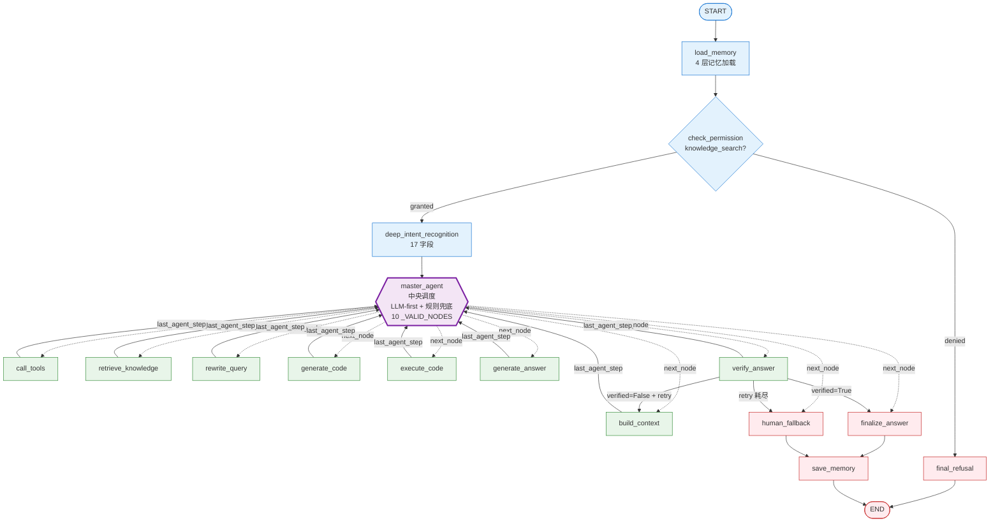
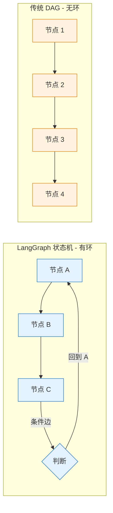
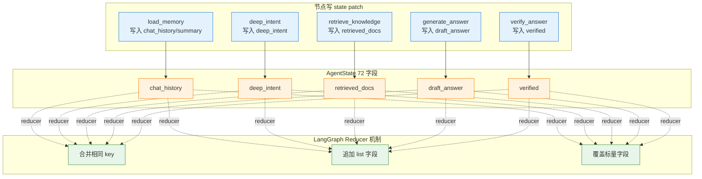

# LangGraph 工作流编排

> StateGraph、AgentState、条件路由、工作流编译与编排追问。

## ⚠️ 关键易误会点

### 易误会点 1：LangGraph = LangChain

**错**。LangGraph 是 LangChain 团队做的**独立编排库**，可以脱离 LangChain 使用。

| 维度 | LangGraph | LangChain |
|------|-----------|-----------|
| 形态 | 状态机编排 | 链式调用 |
| 核心 | StateGraph + Node | Chain + Agent |
| 循环 | ✅ 原生 | ❌ 弱支持 |
| Checkpoint | ✅ 内置 | ❌ 需自实现 |
| 项目使用 | ✅ 核心 | ⚠️ 间接 |

### 易误会点 2：StateGraph = Workflow

**部分对**。StateGraph 比 Workflow 强：
- 节点可循环（MasterAgent 调度循环）
- 条件边可基于 state 动态选择
- Checkpoint 持久化（不重启丢状态）
- 节点可并发（项目未用）

### 易误会点 3：AgentState = Pydantic

**错**。项目用 **TypedDict**，不是 Pydantic。

| 维度 | TypedDict | Pydantic |
|------|----------|----------|
| 校验 | 无（type hint） | 运行时校验 |
| 性能 | 快（无开销） | 较慢 |
| LangGraph | 原生 | 需 adapter |
| 项目使用 | ✅ 72 字段 | ❌ |

### 易误会点 4：条件边 = 动态路由

**部分对**。项目有 **2 个条件边**：
- `master_agent → {10 workers}`：基于 `last_agent_step`
- `verify_answer → {finalize / build_context / human_fallback}`：基于 `verified` + retry budget

其余都是**普通边**（固定主链路）。

### 易误会点 5：StateGraph checkpoint = 必用

**错**。Checkpoint 是**可选**：
- 默认在内存
- 生产可接 Redis/PostgreSQL
- 项目用 `MemoryManager` 自己管，**不依赖 LangGraph Checkpoint**

### 易误会点 6：节点失败 = StateGraph 异常

**错**。LangGraph 节点失败 → 走 RecoveryManager：
- retry 预算内 → 重试
- 耗尽 → regenerate / fallback
- 兜底 → human_fallback

StateGraph 不知道 RecoveryManager 的存在。

### 易误会点 7：MasterAgent 路由 = 节点循环

**对**。MasterAgent 调度的本质是**节点循环**：
```
master_agent 节点
  → 决定 next_node
  → add_conditional_edges 根据 next_node 跳转
  → 跳到目标 Worker
  → Worker 执行完回到 master_agent
  → 循环（≤18 步）
```

`graph_step_count` 字段专门计数。

### 易误会点 8：build_workflow() 编译一次

```python
# graph/workflow.py
def build_workflow() -> CompiledGraph:
    workflow = StateGraph(AgentState)
    # 16 个 add_node
    # 2 个 add_conditional_edges
    # N 个 add_edge
    return workflow.compile()
```

**编译一次，全局复用**。每次请求通过 `workflow.invoke(state)` 进入。**不是每次请求重新编译**。

### 易误会点 9：并行节点 = 性能银弹

**错**。项目**没有用 LangGraph 并行**：
- 节点有顺序依赖（如 `retrieve_knowledge` 后才能 `build_context`）
- 状态读写冲突（reducer 不友好）
- 收益不明确

### 易误会点 10：StateGraph = 完整 DAG

**错**。项目 StateGraph **有环**（MasterAgent 调度循环），不是纯 DAG。LangGraph 支持环，**这正是它强于 DAG 引擎的地方**。

---

## 🔑 关键决策矩阵

### A. 节点 vs 函数

| 角度 | Node | 函数 |
|------|------|------|
| 数量 | 16 | 16+（可能共用）|
| 注册 | `add_node` | 普通 def |
| 返回 | state patch (dict) | 任意 |
| 副作用 | 写 state / 调 LLM / 调工具 | 任意 |

### B. 边类型

| 类型 | 数量 | 例子 |
|------|------|------|
| 普通边 | ~14 | `load_memory → check_permission` |
| 条件边 | 2 | `master_agent → 10 workers` |
| 起点 | 1 | `START → load_memory` |
| 终点 | 1 | `save_memory → END` |

### C. State 字段数（72 个）

| 功能区 | 字段数 | 例子 |
|--------|--------|------|
| 输入/身份 | 5 | query, user_id, session_id |
| 路由/意图 | 8 | intent, deep_intent, master_next |
| 检索/RAG | 8 | retrieved_docs, retrieval_mode |
| 工具 | 8 | tool_results, tool_errors |
| 生成 | 6 | draft_answer, code_snippet |
| 校验 | 3 | verified, verification_reason |
| 记忆 | 5 | chat_history, session_summary |
| 上下文 | 4 | structured_context, token_budget |
| 恢复 | 5 | retry_count, fallback_reason |
| 可观测 | 5 | trace_id, node_events |
| 其他 | ~15 | DeepIntent 结构化字段 |

### D. 调度循环 vs DAG

| 维度 | 调度循环（项目） | DAG |
|------|----------------|-----|
| 灵活性 | 高 | 低 |
| 可重入 | ✅ | ❌ |
| 步数控制 | max_graph_steps | 节点数 |
| 死循环风险 | 需 last_agent_step 防 | 天然无 |
| 项目使用 | ✅ | ❌ |


---

## 3. 核心架构：LangGraph 多 Agent 工作流

### 3.1 为什么选择 LangGraph

LangGraph 是一个基于**有向图 (Directed Graph)** 的 Agent 编排框架，相比 LangChain 的线性 Chain，它天然支持：

- **条件分支**：根据中间结果动态选择下一步
- **循环/重试**：失败节点可以回到上游重新执行
- **状态持久化**：通过 State 对象在工作流中传递上下文
- **可观测**：每个节点的输入/输出/耗时都可通过装饰器追踪

本项目使用 LangGraph 的 `StateGraph` 构建了一个**16 节点 + 7 条件路由**的复杂工作流，每个节点都是纯 async 函数，不依赖外部 LLM API（LLM 调用被隔离在 Agent 层）。16 节点包括：load_memory、check_permission、deep_intent_recognition、master_agent、retrieve_knowledge、call_tools、rewrite_query、build_context、generate_code、execute_code、generate_answer、verify_answer、finalize_answer、human_fallback、final_refusal、save_memory。

### 3.2 统一状态对象：AgentState

`AgentState` 是整个工作流的**唯一真相来源 (Single Source of Truth)**，定义在 `graph/state.py`，使用 `TypedDict` 实现，包含约 70 个可选字段：

```python
class AgentState(TypedDict, total=False):
    # === 输入层 ===
    query: str                          # 用户原始问题
    user_id: str                        # 调用者标识
    session_id: str                     # 会话标识

    # === 权限层 ===
    user_role: str                      # admin / developer / basic
    permissions: list[str]              # 权限列表

    # === 路由层 ===
    intent: str                         # 分类意图
    complexity: str                     # 问题复杂度
    route: str                          # 路由决策 ("rag" | "tools")

    # === RAG 层 ===
    retrieved_docs: list[dict]          # 检索到的文档
    reranked_docs: list[dict]           # 重排序后的文档

    # === 工具层 ===
    tool_calls: list[dict]              # 工具调用记录
    tool_results: list[dict]            # 工具执行结果
    tool_errors: list[str]              # 工具错误信息
    pending_tool_confirmations: list    # 等待用户确认的敏感操作

    # === 生成与校验层 ===
    draft_answer: str                   # 草稿答案
    verified: bool                      # 是否通过校验
    verification_reason: str            # 校验失败原因
    final_answer: str                   # 最终答案
    citations: list[dict]               # 引用来源
    need_human: bool                    # 是否需要人工介入

    # === 记忆层 ===
    chat_history: list[dict]            # 对话历史
    session_summary: str                # 会话摘要
    user_profile: dict                  # 用户档案
    memory_ckpt_id: str                 # 检查点 ID

    # === 上下文管理层 ===
    structured_context: dict            # 结构化上下文
    context_window: str                 # 上下文窗口
    prompt_context: dict                # 各 Agent 的 prompt
    token_budget: dict                  # Token 预算信息

    # === 恢复层 ===
    fallback_reason: str                # 兜底原因
    recovery_action: str                # 恢复动作
    retry_count: dict[str, int]         # 各节点重试计数
    retry_history: list[dict]           # 重试历史
    human_fallback_payload: dict        # 人工兜底载荷
    recoverable: bool                   # 是否可恢复

    # === 可观测层 ===
    trace_id: str                       # 追踪 ID
    node_events: list[dict]             # 节点事件
    metrics_snapshot: dict              # 指标快照

    # === LangGraph 消息流 ===
    messages: Annotated[list, add_messages]  # 对话消息（自动追加）
```

**设计要点：**

- `total=False` 使得所有字段都是可选的，新节点可以渐进式填充状态
- `messages` 字段使用 `Annotated[list, add_messages]`，LangGraph 的 reducer 机制会自动将新消息追加到已有列表
- 状态对象的每个字段都有明确的**生产者节点**和**消费者节点**，形成清晰的数据流

### 3.3 完整工作流拓扑

```
                        ┌──────────────┐
                        │    START     │
                        └──────┬───────┘
                               │
                        ┌──────▼───────┐
                        │ load_memory  │  ← 加载会话历史、用户档案、检查点
                        └──────┬───────┘
                               │
                        ┌──────▼───────┐
                        │check_permission│ ← 权限校验
                        └──────┬───────┘
                               │
                    ┌──────────┼──────────┐
                    │ 权限不足  │          │ 权限通过
                    │           │          │
              ┌─────▼─────┐  ┌──▼──────────▼──┐
              │final_refusal│  │deep_intent_recognition │ ← 意图分类
              └─────┬─────┘  └──┬──────┬──────┘
                    │            │      │
                    │     ┌──────┘      └──────┐
                    │     │ 已知意图    未知意图 │
                    │     │                    │
                    │  ┌──▼──────┐    ┌───────▼──────┐
                    │  │ 路由判断 │    │human_fallback│ ← 人工兜底
                    │  └──┬───┬──┘    └───────┬──────┘
                    │     │   │               │
                    │     │   └─────────┐     │
                    │  ┌──▼──────┐ ┌───▼─────▼─┐
                    │  │retrieve │ │call_tools │ ← 工具执行(最多重试2次)
                    │  │knowledge│ └─────┬─────┘
                    │  └──┬───┬──┘       │
                    │     │   │          │
                    │     │   └──────────┘
                    │  ┌──▼──────────────▼──┐
                    │  │   build_context    │ ← 组装上下文+Token预算+引用
                    │  └────────┬───────────┘
                    │           │
                    │  ┌────────▼───────────┐
                    │  │  generate_answer   │ ← 生成草稿答案
                    │  └────────┬───────────┘
                    │           │
                    │  ┌────────▼───────────┐
                    │  │   verify_answer    │ ← 答案校验
                    │  └──┬──────┬──────┬───┘
                    │     │      │      │
                    │  ┌──┘  ┌──┘      └──┐
                    │  │通过 │未通过+重试 │未通过+耗尽
                    │  │     │           │
              ┌─────┐ │  ┌──▼──────┐ ┌──▼──────────┐
              │     │ │  │build_   │ │human_fallback│
              │     │ │  │context  │ │              │
              │     │ │  │(重新生成)│ └──────┬───────┘
              │     │ │  └─────────┘        │
              │  ┌──▼──▼──┐                 │
              │  │finalize │                 │
              │  │_answer  │                 │
              │  └──┬──────┘                 │
              │     │                        │
              └──┬──┴────────────────────────┘
                 │
          ┌──────▼───────┐
          │ save_memory  │  ← 保存对话、更新摘要、写检查点
          └──────┬───────┘
                 │
          ┌──────▼───────┐
          │     END      │
          └──────────────┘
```

### 3.4 路由决策逻辑

工作流中有 **7 个条件路由函数**，每个都基于当前 State 做出决策：

#### 权限门控 (`_after_permission`)

```python
def _after_permission(state) -> Literal["deep_intent_recognition", "final_refusal"]:
    # 用户必须有 knowledge_search 权限才能继续
    if "knowledge_search" not in state.get("permissions", []):
        return "final_refusal"    # → 礼貌拒绝
    return "deep_intent_recognition"      # → 意图分类
```

#### 意图路由 (`_after_classify`)

```python
def _after_classify(state) -> Literal["retrieve_knowledge", "call_tools", "human_fallback"]:
    intent = state.get("intent", "")
    if intent == "unknown":
        return "human_fallback"           # → 无法识别，人工兜底
    if state.get("route") == "tools":
        return "call_tools"               # → 排障/工单类，先调工具
    return "retrieve_knowledge"           # → 技术/政策类，检索知识库
```

#### 检索后路由 (`_after_retrieve`)

```python
def _after_retrieve(state) -> Literal["build_context", "call_tools", "rewrite_query", "human_fallback"]:
    docs = state.get("retrieved_docs", [])
    if docs and any(d.get("score", 0) > 0 for d in docs):
        return "build_context"            # → 有结果，构建上下文
    # 无结果：检查是否可以查询改写重试
    if _recovery.can_retry("retrieve", state.get("retry_count", {})):
        return "rewrite_query"            # → 改写查询重试
    return "human_fallback"               # → 重试耗尽，人工兜底
```

#### 校验后路由 (`_after_verify`)

```python
def _after_verify(state) -> Literal["finalize_answer", "build_context", "human_fallback"]:
    if state.get("verified", False):
        return "finalize_answer"          # → 校验通过，输出答案
    # 未通过：检查是否可以重新生成
    if _recovery.can_retry("verify", state.get("retry_count", {})):
        return "build_context"            # → 重新生成答案（回到上下文构建）
    return "human_fallback"               # → 重试耗尽，人工兜底
```

### 3.5 工作流编译

`build_workflow()` 函数将所有节点和边组装成可执行的图：

```python
def build_workflow() -> StateGraph:
    builder = StateGraph(AgentState)

    # 每个节点都用 tracer.traced_node() 包装，自动记录执行追踪
    builder.add_node("load_memory",       _tracer.traced_node("load_memory", load_memory))
    builder.add_node("check_permission",  _tracer.traced_node("check_permission", check_permission))
    # ... 共 16 个节点（详见 graph/workflow.py:1007-1023）

    # 定义边和条件边
    builder.add_edge(START, "load_memory")
    builder.add_conditional_edges("check_permission", _after_permission, {...})
    # ...

    graph = builder.compile()
    graph.name = "EnterpriseAgenticRAG"
    return graph
```

每个节点函数都返回一个 `dict[str, Any]`，LangGraph 会自动将这些返回值**合并**到全局 State 中，实现状态在节点间的传递。

---

#### 📋 面试题追加：Agent 工作流编排

| 题目 | 重要性 |
|------|--------|
| Agent 和 Workflow 的区别与选择 | S |
| 为什么你的项目用了 Agent 而不是纯 Workflow？ | S |
| Multi-Agent 何时必要以及协作模式 | A |
| 多Agent系统如何编排？遇到过死锁吗？ | S |
| 多Agent系统如何防止死锁和无限循环？ | S |
| Orchestrator Agent 的任务分配出了错怎么办？ | S |
| Multi-Agent 系统的延迟怎么控制？ | A |
| LangGraph、CrewAI、AutoGen 等 Agent 框架对比 | A |
| 你的项目中利用LangGraph编排多工具调用链路的优势？ | A |

##### Q1: Agent vs Workflow 的区别与选择 [S]

**面试说明：** 先说明本项目是 LangGraph 状态机 + MasterAgent 主从调度，不是自由聊天式多 Agent；重点讲稳定、可观测、可恢复。

**本项目答案（评分 9/10）：** 本项目采用 LangGraph StateGraph 作为状态机，`MasterAgent` 作为主控调度器。Workflow 负责节点执行、状态合并、trace、恢复回路；`MasterAgent` 负责根据 `deep_intent_recognition`、工具结果、检索质量、代码执行结果和校验结果决定下一步。核心设计哲学：确定性 Workflow 承载生产稳定性，Agent 决策只放在需要动态判断的路由点。

**项目区分：**
- **Workflow 部分**：load_memory → check_permission → deep_intent_recognition → master_agent → 各 worker/service → save_memory
- **Agent 部分**：`MasterAgent` 做主控调度（LLM优先+规则兜底）；`ToolAgent` 执行工具（安全策略+断路器）；`CodeAgent` 代码生成与沙箱执行（AST符号提取）；`KnowledgeAgent` 知识问答生成（证据融合+冲突标注）；`VerifierAgent` 做答案证据校验（Claim-level断言级）。
- **服务部分**：`Knowledge Retrieval Service` 负责 `retrieve_knowledge`、`rewrite_query`、GraphRAG、向量检索、关键词检索和图检索权重调度，它不是独立 Agent。

**满分答案（不涉及项目）：** Agent 和 Workflow 不是二元对立，而是光谱。选择标准：① 步骤确定性高的（如 FAQ 问答）→ Workflow；② 需要根据中间结果动态决策的（如多步工具调用）→ Agent；③ 实践中通常 80% Workflow + 20% Agent 混合架构。

##### Q2: 多Agent系统如何防止死锁和无限循环？[S]

**面试说明：** 先说明本项目是 LangGraph 状态机 + MasterAgent 主从调度，不是自由聊天式多 Agent；重点讲稳定、可观测、可恢复。

**本项目答案（评分 8/10）：** 项目是主从 Agent 架构，不是多 Agent 自由聊天协作。所有 worker 都必须回到 `MasterAgent`，由主控统一决定下一跳。通过以下机制防止异常：① 检索重试上限 1 次、工具调用重试上限 2 次、校验重试上限 1 次（§9.4）；② 重试耗尽 → human_fallback（§9.7）；③ LangGraph 状态机限制可达节点；④ `master_decisions` 记录每次路由，便于审计和排错。

**满分答案（多Agent系统）：** ① Orchestrator 全局超时（如 120s）→ 强制终止返回部分结果；② 环形依赖检测：维护 Agent 调用图，检测 A→B→C→A 环路；③ 最大跳数限制：任务经过的 Agent 跳数 ≤ N（通常 5-10）；④ 死信队列：超限任务转入人工介入队列。

##### Q3: Agentic RAG 与传统 RAG 的区别 [S]

**面试说明：** 先讲传统 RAG 是固定管道，Agentic RAG 是受控决策回路；再落到 Deep Intent、MasterAgent、检索和校验。

**本项目答案（评分 8/10）：** 本项目的 Agentic RAG 体现在：① `deep_intent_recognition` 给出主意图、实体、关键词和检索计划；② `MasterAgent` 动态路由到 ToolAgent、检索服务、AnswerAgent、VerifierAgent 或 human_fallback；③ 检索服务根据意图调整关键词/向量/图检索权重；④ VerifierAgent 校验后由 MasterAgent 决定 regenerate 还是 finalize；⑤ 检索失败时 query rewrite 重试。相比传统 RAG（query→embed→search→generate 线性流程），本项目引入了受控的多步决策回路。

**核心差异：** 传统 RAG = 固定管道（retrieve → generate）；Agentic RAG = 动态决策循环（deep intent → master route → [tools / retrieve ⇄ rewrite] → [answer ⇄ verify] → finalize）。

##### Q4: Multi-Agent 何时必要以及协作模式 [A]

**面试说明：** 先说明本项目是 LangGraph 状态机 + MasterAgent 主从调度，不是自由聊天式多 Agent；重点讲稳定、可观测、可恢复。

**本项目答案（v3.0 更新，评分 9/10）：** 本项目使用层级调度模式：`MasterAgent` 是主控（LLM优先+规则兜底），5 个 Worker 包括 `ToolAgent`、`CodeAgent`、`KnowledgeAgent`、`VerifierAgent`；RAG 是 `Knowledge Retrieval Service`（5层回退链+4意图感知工作流），不作为独立 Agent。各 worker 通过全局 `AgentState` 传递结果，不直接互相通信。选择此方案的理由：企业知识问答和开发者支持需要稳定、可观测、可恢复，不适合让多个 Agent 自由协商。

**满分答案（多Agent场景）：** Multi-Agent 必要性判断：① 任务天然可拆分（如一个 Agent 写代码、一个做 Code Review）；② 需要异质工具集（如一个 Agent 操作浏览器、一个操作数据库）；③ 需要辩论/反思机制（多个 Agent 交叉验证）。协作模式：顺序流水线（A→B→C）、层级调度（Orchestrator→Worker）、辩论/投票（多个 Agent 并行回答→取共识）。

##### Q5: 多Agent系统如何编排？遇到过死锁吗？[S]

**面试说明：** 先说明本项目是 LangGraph 状态机 + MasterAgent 主从调度，不是自由聊天式多 Agent；重点讲稳定、可观测、可恢复。

**本项目答案（评分 8/10）：** 本项目通过 LangGraph StateGraph 做运行时编排，worker 执行后统一回到 `MasterAgent`，由 `master_next` 决定下一跳。它不是自由通信式多 Agent，因此不会出现 A 等 B、B 等 A 的对等死锁。实际风险主要是恢复循环过长，项目通过 retry budget、human_fallback 和 trace 解决。

**满分答案：** 死锁主要出现在多 Agent 自由通信场景（A 等待 B 的结果、B 等待 A 的确认）。解决方案：① 全局超时（120s）→ 强制返回部分结果；② 环形依赖检测：维护 Agent 调用图，检测 A→B→C→A；③ 最大跳数限制 ≤ 10。

##### Q6: Orchestrator Agent 的任务分配出了错怎么办？[S]

**面试说明：** 先说明本项目是 LangGraph 状态机 + MasterAgent 主从调度，不是自由聊天式多 Agent；重点讲稳定、可观测、可恢复。

**本项目答案（评分 8/10）：** 项目现在有显式的 `MasterAgent`，它就是 Orchestrator。任务分配错误的防护：① `deep_intent_recognition` 提供结构化意图、实体、关键词和置信度；② MasterAgent 每次决策写入 `master_decisions`，可追踪 `from_worker/from_step/next_node/reason`；③ worker 输出不满足条件时回到 MasterAgent 重新决策；④ 重试耗尽进入 human_fallback。

**满分答案：** ① Orchestrator 自身也应有校验 Agent 检查分配结果；② 分配错误 → Worker 返回"N/A"信号 → Orchestrator 重新规划；③ 任务描述应包含"如果不能完成请明确回复"约束；④ 记录每次分配决策到 trace 中用于事后分析。

##### Q7: Multi-Agent 系统的延迟怎么控制？[A]

**面试说明：** 先说明本项目是 LangGraph 状态机 + MasterAgent 主从调度，不是自由聊天式多 Agent；重点讲稳定、可观测、可恢复。

**本项目答案（评分 8/10）：** 项目从三个层面控制延迟：① 检索层：关键词、向量、图检索可并行，总延迟接近 max(各路径)，不是 sum；② Deep Intent 先用规则和轻量分类，减少大模型路由成本；③ 主从架构避免 Agent 之间自由对话，worker 执行后只回到 MasterAgent，降低无效跳数。

**满分答案：** ① 并行化独立调用（同时调多个工具而非串行）；② 小模型先行（Router→小模型、Generator→大模型）；③ 流式输出（首个 token 延迟 < 2s）；④ 缓存热门问题的完整答案或中间结果（语义缓存）。

##### Q8: LangGraph、CrewAI、AutoGen 等 Agent 框架对比 [A]

**面试说明：** 先说明本项目是 LangGraph 状态机 + MasterAgent 主从调度，不是自由聊天式多 Agent；重点讲稳定、可观测、可恢复。

**本项目选 LangGraph 的原因（评分 8/10）：** StateGraph 的 TypedDict + Annotated reducer 机制天然适合多节点状态管理（§3.2）；条件路由函数提供确定性分支（§3.4）；Python 原生实现、社区活跃、LangChain 生态兼容。

**框架对比：**
| 维度 | LangGraph | CrewAI | AutoGen |
|------|-----------|--------|---------|
| 编排模型 | 状态图（DAG+条件分支） | 角色+任务+顺序/层级 | Agent 对话/聊天 |
| 状态管理 | TypedDict + Reducer（强） | 任务局部状态（弱） | 对话历史（中） |
| 多Agent模式 | 单图多节点 | 多角色协作 | Agent间自由对话 |
| 学习曲线 | 中（需理解图概念） | 低（角色+任务抽象） | 中 |
| 适用场景 | 生产级复杂 Workflow | 快速原型/简单协作 | 研究/开放式对话 |

**选择建议：** 确定性强的生产 Workflow → LangGraph；快速原型（3-5 个 Agent 的简单协作）→ CrewAI；需要 Agent 间自由辩论/协商 → AutoGen。

##### Q9: 项目中利用LangGraph编排多工具调用链路的优势？[A]

**面试说明：** 先说明本项目是 LangGraph 状态机 + MasterAgent 主从调度，不是自由聊天式多 Agent；重点讲稳定、可观测、可恢复。

**本项目答案（评分 8/10）：** ① StateGraph 的条件路由让工具选择逻辑与执行逻辑解耦（§3.4），新增工具只需注册到 ToolRegistry + 添加路由条件；② AgentState 贯穿所有节点（§3.2），工具执行结果自动注入 State，后续节点无需重新查询；③ `add_messages` reducer 自动累积消息历史，支持多轮工具调用；④ 编译期生成的可视化图可直接用于文档和调试。

**对比直接代码编排的优势：** 代码编排需手动管理调用顺序和错误处理，工具增多后复杂度 O(n²)；StateGraph 的声明式定义让"在什么条件下走什么路径"一目了然。

---

---

[返回总目录](../TECHNICAL_DEEP_DIVE.md)

## 流程图

#### 1. LangGraph 16 节点完整拓扑



#### 2. 状态机循环 vs DAG



#### 3. State 字段读写 + Reducer 合并


