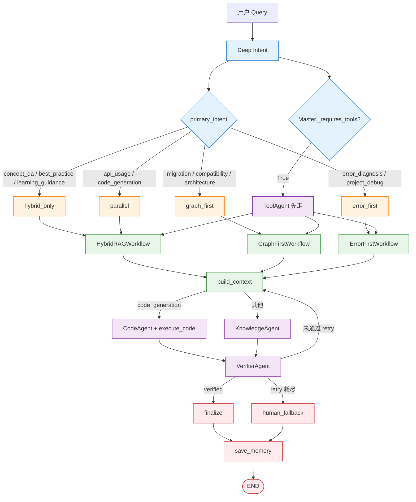
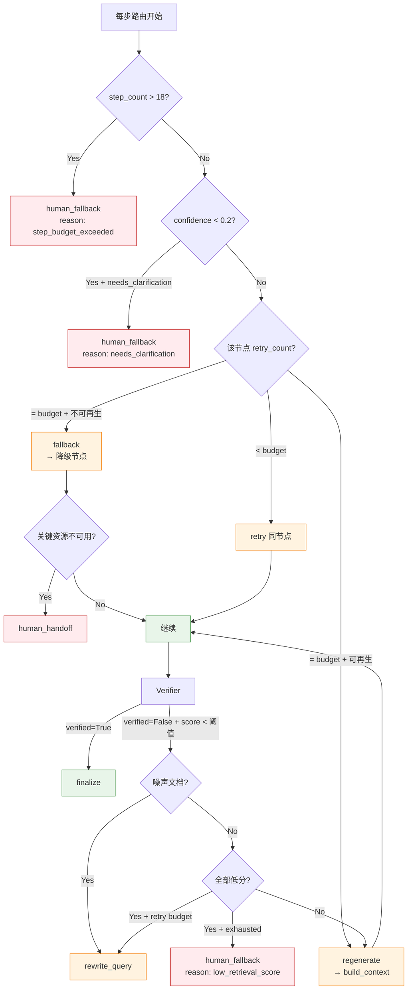

# Agent 体系与进阶设计

> Router、Knowledge、Tool、Verifier、Multi-Agent 协作、Agentic Coding 与 Agent 设计追问。


---

## 4. Agent 体系深度解析

### 4.0 Multi-Agent 架构总览 🆕

#### 架构模式：Master-Slave + Blackboard

项目采用 **主从（Master-Slave）+ 黑板（Blackboard）** 架构模式，基于 LangGraph StateGraph 实现 Hub-and-Spoke 星型拓扑。核心原则：**Agent 之间不直接通信**，所有交互通过共享 `AgentState` 黑板和 `MasterAgent` 中央路由完成。

```text
                         ┌──────────────────┐
                         │   MasterAgent     │
                         │  (中央路由调度器)   │
                         │ LLM优先+规则兜底    │
                         └───────┬──────────┘
                                 │
              ┌──────────────────┼──────────────────┐
              │                  │                  │
              ▼                  ▼                  ▼
    ┌─────────────┐    ┌─────────────┐    ┌─────────────┐
    │  ToolAgent  │    │ Knowledge   │    │  CodeAgent  │
    │  工具调用    │    │  知识问答    │    │  代码生成    │
    │  工单/状态   │    │  检索+生成   │    │  +沙箱执行   │
    │  安全策略    │    │  证据融合    │    │  AST提取    │
    └──────┬──────┘    └──────┬──────┘    └──────┬──────┘
           │                  │                  │
           └──────────────────┼──────────────────┘
                              │
                              ▼
                    ┌─────────────┐
                    │VerifierAgent│
                    │  答案校验    │
                    │ Claim-level │
                    │ 幻觉检测     │
                    └─────────────┘
```

#### 为什么选择主从架构

| 候选模式 | 判断 | 理由 |
|---------|------|------|
| 去中心化（Peer-to-Peer） | ❌ | 企业客服场景路径可预先穷举（文档问答/错误诊断/代码生成/工单），无需 Agent 自行协商 |
| 分层规划（Plan-and-Execute） | ❌ | LLM 从零规划不可靠，步骤多时容易偏离，需额外验证开销 |
| **主从（Master-Slave）** | ✅ | 中央路由保留确定性控制，Slave 各司其职，解耦且可独立测试 |
| **黑板模式（Blackboard）** | ✅ | 70+ 字段的 AgentState 天然是共享上下文，Agent 间零 RPC 通信 |

设计哲学：

> *"The workflow is still the runtime state machine, but business routing lives here so each worker can stay focused on its own task."*

Workflow 是**骨架**（确定性 DAG 拓扑），MasterAgent 是**大脑**（动态路由决策），Slave Agent 是**手脚**（专注执行）。

#### MasterAgent：双模路由

```python
class MasterAgent:
    async def decide(self, state) -> MasterDecision:
        llm_result = await self._llm_decide(state)   # 1️⃣ LLM 优先
        if llm_result is not None:
            return llm_result
        return self._rule_decide(state)               # 2️⃣ 规则兜底
```

**LLM 路由** — 把 State 中全部关键信号打包成 prompt 发给 LLM，输出 `{"next_node": "..", "reason": ".."}`：

```python
def _build_routing_prompt(self, state):
    # 注入的上下文信号:
    #   last_agent_step        ← 上个 Agent 做了什么
    #   primary_intent         ← 意图识别结果
    #   confidence             ← 置信度
    #   retrieved_docs count   ← 检索到了多少文档
    #   top scores             ← 检索质量
    #   tool_errors            ← 工具调用是否失败
    #   fallback_reason        ← 是否在降级路径中
    #   retry_count            ← 已重试次数
    #   verified               ← 上轮校验结果
    #   code_snippet present   ← 是否有代码待执行
    #   code_verified          ← 代码是否已验证
    #   code_retry_attempted   ← 是否已重试过代码修复
```

LLM 输出经过三层解析器（直接JSON→code fence→花括号匹配），最终通过 `_VALID_NODES` frozenset 校验防止 LLM 幻觉编造节点名。

**规则路由** — 确定性状态机，以 `_after_{last_step}()` 方法链实现。每个方法做三件事：**检查质量 → 判断重试弹性 → 选择下一个节点**。示意：

```
last_step == "recognize_intent"  → _after_deep_intent()
    ├─ 置信度<0.2且需澄清 → human_fallback
    ├─ 需要工具支持 → call_tools
    └─ 默认 → retrieve_knowledge

last_step == "retrieve"  → _after_retrieval_service()
    ├─ 检索质量过低且无重试额度 → human_fallback
    ├─ 有可用文档 → build_context
    ├─ 无文档但可重试 → rewrite_query
    └─ 重试耗尽 → human_fallback

last_step == "verify_answer"  → _after_verifier_agent()
    ├─ 校验通过 → finalize_answer
    └─ 校验失败且可重试 → build_context（重新生成）
```

#### Slave Agent 分工表

每个 Slave 有**独立的 Prompt、独立的工具集、独立的决策边界**：

| Agent | 文件 | 职责 | 核心能力 | 写入 State 的字段 |
|-------|------|------|---------|-----------------|
| **ToolAgent** | `tool_agent.py` | 外部工具编排 | 工单查询、系统状态、用户信息、错误码查询 | `tool_results`, `tool_errors`, `tool_calls` |
| **Knowledge** | `knowledge_agent.py` + `rag/` | 知识检索与生成 | 向量+关键词+图谱三路融合、语义缓存、意图感知工作流、Cross-Encoder精排、上下文构建 | `retrieved_docs`, `draft_answer`, `citations`, `structured_context` |
| **CodeAgent** | `code_agent.py` + `tools/code_execution_tool.py` | 代码生成与沙箱执行 | AST符号提取、LLM代码生成、六层安全沙箱、执行验证 | `code_snippet`, `code_verified`, `code_language`, `code_execution_result` |
| **VerifierAgent** | `verifier_agent.py` + `claim_verifier.py` | 答案事实核查 | Claim-level断言拆分(6种类型)、逐条对照源文档、幻觉检测、置信度打分 | `verified`, `verification_reason`, `claim_results` |

**为什么拆分而不是合并：** 如果把所有能力塞进一个 Agent——知识问答时可能误调工单查询、报错诊断时可能去检索文档而非错误库、代码生成时可能忘记沙箱验证。职责分离让每个 Agent 的 Prompt 更短更精确，工具集更聚焦。

#### 共享 State：黑板通信

所有 Agent 通过 `AgentState`（~70字段 TypedDict）共享上下文，不直接 RPC 调用：

```
AgentState 功能分区:
├── 输入层    query, user_id, session_id, trace_id
├── 权限层    user_permissions, permission_denied
├── 意图层    deep_intent, primary_intent, confidence, retrieval_mode
├── 路由层    master_next, master_reason, master_decisions,
│             last_worker, last_agent_step, graph_step_count
├── 检索层    retrieved_docs, reranked_docs, retrieval_backend
├── 工具层    tool_results, tool_errors, pending_confirmations
├── 代码层    code_snippet, code_verified, code_execution_result
├── 生成层    draft_answer, citations, structured_context
├── 校验层    verified, verification_reason, claim_results
├── 记忆层    chat_history, session_summary, user_profile, long_term_memories
├── 降级层    fallback_reason, recovery_action, retry_count, retry_history
├── 外部层    external_search_results, graph_query_results
└── 观测层    node_events, tool_events, retrieval_events, verification_events
```

**效果：** 新增 Agent 只需三件事 — State 加字段、MasterAgent 加路由分支、Workflow 加 add_node + add_edge。不触及已有 Agent。

#### 完整执行流程（16 节点串联）

```
START → load_memory → check_permission
                         ├─ 拒绝 → final_refusal → save_memory → END
                         └─ 通过 ↓
                       deep_intent_recognition → master_agent
                                                   │
    ┌──────────────────────────────────────────────┘
    │  Hub-and-Spoke 调度循环:
    │
    │  call_tools ──────────┐
    │  retrieve_knowledge   │  每个 Slave 执行完
    │  rewrite_query        │  都必须回到 MasterAgent
    │  build_context        │  由 Master 决策下一步
    │  generate_code        │
    │  execute_code ────────┤
    │  generate_answer      │
    │  verify_answer ───────┘
    │
    ├─ finalize_answer → save_memory → END
    └─ human_fallback  → save_memory → END

安全阀: max_graph_steps=18, max_llm_calls=6/请求
```

#### 关键设计决策

| 决策 | 做法 | 原因 |
|------|------|------|
| Agent 不直接通信 | 全部通过 State 黑板 | 解耦：新增 Agent 不触动已有代码 |
| Workflow 骨架 + Agent 决策 | DAG 拓扑定义"能去哪"，Master 定义"该去哪" | 分离关注点，Workflow 确定性保证稳定 |
| LLM 优先 + 规则兜底 | MasterAgent 双模路由 | LLM 灵活应对边缘 case，规则链保证永远有答案 |
| 步数硬限制 | `graph_step_count > 18` → human_fallback | 防无限循环，兜底安全 |
| `last_worker` + `last_agent_step` 锚点 | 每个 Slave 返回时写入身份标记 | MasterAgent 只需读这两个字段即可决策 |
| Mock 模式下跳过 LLM 路由 | `provider_name == "mock" → None` | 零依赖开发环境，直走规则链 |

### 4.1 Agent 设计模式：LLM-First, Rules-Fallback

本项目的 Agent 采用统一的 **LLM-First, Rules-Fallback** 双路径架构：

```
                    ┌─────────────┐
                    │  输入请求    │
                    └──────┬──────┘
                           │
                    ┌──────▼──────┐
                    │ LLM 可用？  │
                    └──┬──────┬──┘
                       │ 是   │ 否
                 ┌─────▼──┐ ┌─▼──────────┐
                 │ LLM 调用│ │ 规则/模板   │
                 └────┬───┘ │ 引擎       │
                      │     └─────┬──────┘
                 ┌────▼───┐       │
                 │ 成功？  │       │
                 └──┬──┬──┘       │
                    │是│否        │
              ┌─────▼┐┌▼─────────▼┐
              │返回  ││  返回规则  │
              │LLM   ││  结果     │
              │结果  ││           │
              └──────┘└───────────┘
```

这种设计的好处：
- **降级安全**：LLM 调用失败时不会返回错误，而是返回确定性规则结果
- **开发友好**：使用 Mock Provider 时可以完整运行所有路径
- **可对比**：可以收集 LLM 路径和规则路径的结果进行质量对比

### 4.2 Deep Intent（意图分类器）

**文件：** `agent/deep_intent/`（实际目录：`schema.py / rules.py / llm_classifier.py / entity_extractor.py / confidence.py / validator.py / node.py`）

**职责：** 将用户自然语言问题分类为 **10 种** 预定义意图（`schema.py:18-29` `IntentCategory` 枚举），并输出 **5 种检索模式** 之一（`RetrievalMode` 枚举）。

**10 种意图（`IntentCategory`）：**
- `concept_qa` — 概念定义/原理解释
- `api_usage` — API 用法/SDK 参数
- `code_generation` — 代码生成/示例
- `error_diagnosis` — 错误码/异常诊断
- `migration` — 迁移/废弃 API 替换
- `compatibility` — 版本/API Level 兼容
- `project_debug` — 项目构建/配置/排障
- `best_practice` — 最佳实践/性能/规范
- `architecture` — 架构/原理/调用链
- `learning_guidance` — 入门/学习路径

**5 种检索模式（`RetrievalMode`）：**
`hybrid_only / parallel / graph_first / error_first / code_first`

**LLM 路径（`llm_classifier.py`）：**
```python
def _classify_with_llm(provider, query: str) -> dict:
    prompt = (
        "你是一个企业级开发者助手的意图分类器。请将用户问题分类为以下 10 类之一：\n"
        "concept_qa, api_usage, code_generation, error_diagnosis, migration,\n"
        "compatibility, project_debug, best_practice, architecture, learning_guidance\n\n"
        f"用户问题: {query}\n\n请输出 DeepIntentResult JSON。"
    )
    resp = provider.generate(prompt, temperature=0.0, max_tokens=512)
    # validator.py 校验并纠正非法标签 + 归一化 confidence
```

**规则路径（`rules.py` 触发信号）：**
```python
# rules.py: rule_based_intent(query) → candidates + signals + suggested_mode
TRIGGER_SIGNALS = {
    "error_diagnosis": ["报错", "异常", "失败", "permission denied", "AUTH_", "401", "500"],
    "migration":       ["迁移", "升级", "替换", "废弃", "deprecated"],
    "compatibility":   ["API Level", "HarmonyOS NEXT", "兼容", "版本差异"],
    "code_generation": ["写一个", "生成", "示例代码", "代码片段"],
    "api_usage":       ["@ohos.", "接口", "SDK", "用法", "参数"],
    "project_debug":   ["构建失败", "编译错误", "DevEco", "签名"],
    # ... 共 10 类
}
```

**设计细节：**
- LLM 路径输出结构化 `DeepIntentResult`（含 primary_intent / secondary_intents / entities / retrieval_plan / confidence 等 17 字段）
- `temperature=0.0` 保证分类稳定
- `validator.py` 兜底：非法 intent 标签自动纠正到合法枚举；confidence 归一化到 [0, 1]
- LLM 失败时回退到 `rules.py` 的规则结果（fail-safe）
- 置信度由 7 个分量组成（`confidence.py:25-43`）：intent_signal_strength + entity_coverage + scenario_certainty + llm_rule_alignment + query_clarity + tool_coverage + llm_response_bonus

#### 4.2.1 10 意图 → 5 检索模式 → 5 Agent 路径 完整决策矩阵

> **易误解点**：10 IntentCategory / 5 RetrievalMode / 5 Agent 路径 是**三个正交维度**，不是 1-to-1-to-1 对应。

**10 意图 → 5 模式**（`rules.py:387-406` `_suggest_mode`）：

| IntentCategory | RetrievalMode | 映射理由 |
|---|---|---|
| `concept_qa` | `hybrid_only` | 概念解释需要语义+关键词互补 |
| `api_usage` | `parallel` | API 参数既要精确符号又要示例 |
| `code_generation` | `parallel` | 代码示例需要多路召回补齐 |
| `error_diagnosis` | **`error_first`** | 错误码/异常优先，关键词触发工具 |
| `migration` | **`graph_first`** | 迁移链路强依赖实体关系（图谱） |
| `compatibility` | **`graph_first`** | 版本/API Level 兼容靠图谱 1-2 hop |
| `project_debug` | **`error_first`** | 项目排障 = 错误诊断 + 配置问题 |
| `best_practice` | `hybrid_only` | 最佳实践是综合性知识 |
| `architecture` | **`graph_first`** | 架构/调用链就是图谱场景 |
| `learning_guidance` | `hybrid_only` | 学习路径偏综述 |

> **10 意图 → 5 模式 = 多对一**（10 个里只有 5 个不同值）。

**5 模式 → 4 Workflow**（`graph/nodes/retrieval.py:135-142` 全部走 RAG；v3.1 拆分后位置）：

| RetrievalMode | Workflow | 召回策略 |
|---|---|---|
| `hybrid_only` | `HybridRAGWorkflow` | Milvus + ES 并行，权重 0.5/0.5 |
| `parallel` | `HybridRAGWorkflow` | 同上，但可调权重 |
| `graph_first` | `GraphFirstWorkflow` | 向量 + ES + **Neo4j 1-2 hop 优先** |
| `error_first` | `ErrorFirstWorkflow` | 错误码/异常关键词强触发 |
| `code_first` | `CodeGenerationWorkflow` | 代码块抽取 + 向量 + ES |

> **5 mode 都进入 `retrieve_knowledge` 节点，全部走 RAG**。区别仅是召回策略权重 + 是否走图谱。

**什么时候走 Agent 而不是 RAG？**（`master_agent.py:357-369` `_requires_tools`）

```python
def _requires_tools(state) -> bool:
    primary = state["deep_intent"]["primary_intent"]
    if primary in {"error_diagnosis", "project_debug"}:   # 规则 1: 意图直接驱动
        return True
    tool_keywords = ("工单", "ticket", "tkt-", "系统状态", "错误码", 
                     "error code", "用户信息", "用户档案", ...)
    return any(kw in state["query"].lower() for kw in tool_keywords)  # 规则 2: 关键词触发
```

| 触发条件 | 调用工具 |
|---------|---------|
| `intent in {error_diagnosis, project_debug}` | 系统状态 + 错误码 + 工单 + 用户档案 |
| query 含 `工单 / ticket / TKT-xxx` | `QueryTicketTool` / `CreateTicketTool` |
| query 含 `错误码 / AUTH_xxx / SYS_xxx` | `GetErrorCodeDetailTool` |
| query 含 `系统状态 / 服务状态 / 健康检查` | `GetSystemStatusTool` |
| query 含 `我的信息 / 用户档案` | `GetUserProfileTool` |

**完整决策流程图：**



**3 个关键结论：**

1. **RAG 和 Agent 不是互斥，是顺序关系**：典型路径 `MasterAgent → ToolAgent（拿数据）→ retrieve_knowledge（拿证据）→ build_context → generate_answer → verify_answer → finalize`
2. **真正的"Agent 自主性"集中在 3 个节点**：Deep Intent / Master 路由 / Verifier 决策
3. **5 个 RetrievalMode 都走 RAG 是设计意图**：RAG 兜底保障 + Agent 增强体验。**不是"5 个 Agent 模式"**——5 Agent 和 5 RetrievalMode 是解耦的两套分类

#### 4.2.2 置信度 / 分数 / Agent 停止条件 完整逻辑

> 本节是项目里"什么时候停、什么时候降级"的核心定量规则。面试时被问"置信度怎么算""什么时候放弃"时直接引用。

##### A. Deep Intent 置信度公式（`confidence.py:24-112`）

7 个分量加权求和，clamp 到 [0.0, 1.0]：

| # | 分量 | 权重 | 触发条件 |
|---|------|------|---------|
| 1 | `intent_signal_strength` | **0.0-0.3** | 主意图信号数：≥5→0.3 / ≥3→0.25 / ≥2→0.2 / ≥1→0.15 / 0→0.05；候选 >3 减 0.05 |
| 2 | `entity_coverage` | **0.0-0.2** | 6 类实体（apis/components/errors/api_levels/versions/files）覆盖比例 + 迁移对 bonus |
| 3 | `scenario_certainty` | **0.0-0.15** | 检测到 scenario 加 0.15；仅有 hint 加 0.1 |
| 4 | `llm_rule_alignment` | **0.0-0.15** | LLM primary 在规则候选里 → 0.15；仅在 secondary → 0.08 |
| 5 | `query_clarity` | **0.0-0.1** | 不需澄清 → 0.1；每问 1 个澄清 -0.03 |
| 6 | `tool_coverage` | **0.0-0.1** | suggested_tools ≥3 → 0.1；≥1 → 0.05 |
| 7 | `llm_response_quality_bonus` | **0.0-0.05** | LLM 响应 >100 字 → 0.05；>50 字 → 0.03 |

**置信度阈值与动作**（`master_agent.py:282`）：

| confidence | 动作 | 代码 |
|-----------|------|------|
| **< 0.2** + `needs_clarification=True` | → `human_fallback` | `_after_deep_intent` |
| **< 0.5** | 走低权重检索策略（hybrid_only 而非 graph_first）| MasterAgent 兜底 |
| **≥ 0.7** | 高置信度，激进检索（code_first / graph_first）| 决策信任 LLM 路由 |

##### B. 检索质量分数与噪声判定（`verifier_agent.py:122`, `fallback_policy.py:144`）

```python
# 噪声文档判定
if (max_score / avg_score < 1.1 and max_score < 0.02):
    return "检索结果均为低相关度噪音，无法作为答案依据"

# 全部低分文档
if all(d.get("score", 0) < 0.1 for d in docs):
    # 触发 low_retrieval_score 兜底
    return "fallback_reason=low_retrieval_score"
```

**检索分数阈值**：

| 指标 | 阈值 | 含义 |
|------|------|------|
| `max_score < 0.02` | 全是噪音 | 重试 rewrite_query |
| `max_score / avg_score < 1.1` | 候选同质化 | 缺乏明显最优文档 |
| `all(doc.score < 0.1)` | 全部低分 | 触发 low_retrieval_score |

##### C. 路由步数预算（`config/settings.py:147`, `graph/nodes/master.py:102-110`）

```python
# 默认 18 步
max_graph_steps: int = field(default_factory=lambda: int(_env("MAX_GRAPH_STEPS", "18")))

# workflow.py
step_count = int(state.get("graph_step_count", 0)) + 1
if step_count > settings.app.max_graph_steps:
    # 强制 human_fallback
    master_next = "human_fallback"
    reason = f"graph step budget exceeded ({step_count}>{settings.app.max_graph_steps})"
```

**步数预算与触发**：

| 步数 | 状态 | 动作 |
|------|------|------|
| 1-15 | 正常 | 继续路由 |
| 16-18 | 临近预算 | 提示但不强制停止 |
| **> 18** | 强制 | `human_fallback`，记入 master_decisions |

##### D. Retry Budget（`recovery/recovery_manager.py`, `recovery/retry_policy.py`）

```python
# 默认每个节点的重试预算
RETRY_BUDGETS = {
    "tool_call": 2,        # 网络抖动常见
    "retrieve": 1,         # rewrite 后再试
    "build_context": 1,    # 改 chunk 选择
    "generate_code": 1,    # 沙箱失败可重生成
    "verify": 2,           # 同一证据多次校验
    "deep_intent": 0,      # 重试无意义，直接 fallback
}
```

**重试 → Regen → Fallback 触发链**：

| retry_count 状态 | 行为 | 下一跳 |
|----------------|------|--------|
| 0 → max | retry（同节点）| 回到原节点 |
| max 达到 | regenerate | 跳到 `build_context` |
| 关键资源不可用 | fallback | 跳到降级节点 |
| 全部耗尽 | human_handoff | 跳到 `human_fallback` |

##### E. RollbackThresholds（`recovery/threshold_calibrator.py:87-105`）

用于 Harness 发布/回滚决策，3 个分类共 7 个指标：

| 类别 | 指标 | 默认 | 告警 | 阻断 |
|------|------|------|------|------|
| 延迟 | p95_latency | 10s (warning) | 10s | 30s (critical) |
| 错误率 | error_rate | 10% (warning) | 10% | 25% (critical) |
| 质量 | verification_pass_rate_min | — | < 0.85 | — |
| 质量 | hallucination_rate_max | — | > 0.15 | — |
| 质量 | context_precision_min | — | < 0.70 | — |
| 元 | confidence | low (n<100) | medium (100-500) | high (≥500) |
| 元 | data_points | — | — | ≥ 30 触发自动校准 |

> 阈值**自动校准**：随生产数据积累从历史 P95 动态调整，但**永远不放松**（只紧不松）。

##### F. 完整停止条件决策图



### 4.3 Knowledge Agent（答案生成器）

**文件：** `agents/knowledge_agent.py`

**职责：** 基于检索到的文档生成答案文本和引用列表。

**LLM 路径：**
```python
def _generate_with_llm(provider, query, docs):
    # 将文档格式化为编号块
    parts = [f"[文档{i+1}] {d.get('source')}\n{d.get('content')}" for i, d in enumerate(docs)]

    prompt = (
        "你是一个企业知识库问答助手。请根据以下参考文档回答用户问题。"
        "在回答中使用 [1]、[2] 等标记引用来源。\n\n"
        f"参考文档:\n{chr(10).join(parts)}\n\n"
        f"用户问题: {query}\n\n请生成回答："
    )
    resp = provider.generate(prompt, temperature=0.3, max_tokens=2048)
```

**模板路径：**
```python
def _generate_template(query, retrieved_docs):
    # 直接拼接文档内容作为答案
    # 生成编号引用（去重同源文档）
    # 格式: "根据知识库检索结果，为您找到以下相关信息：\n\n{doc1}\n\n{doc2}\n\n---\n参考来源: [1] source_A (相关度: 0.85)"
```

**关键设计：**
- `temperature=0.3` 在准确性和表达灵活性之间取得平衡
- LLM prompt 中明确指令使用 `[1]`、`[2]` 标记引用（结构化引用）
- 工具执行结果作为额外段落追加到答案中
- 对同一来源的多个 chunk 去重引用

### 4.4 Tool Agent（工具编排器）

**文件：** `agents/tool_agent.py`

**职责：** 根据意图和查询内容选择并执行合适的工具。

**工具选择策略（双层匹配）：**

```
第一层：意图驱动
  troubleshooting → get_system_status + get_error_code_detail
  ticket_query    → query_ticket

第二层：关键词驱动（可与第一层叠加）
  查询含"系统状态"     → get_system_status（如未被意图层选中）
  查询含"工单"/"TKT"   → query_ticket（如未被意图层选中）
  查询含错误码模式      → get_error_code_detail（提取 AUTH_xxx 等）
```

**正则提取：**
```python
ticket_match = re.search(r"TKT-\d{3}", query)          # 提取工单号
error_match  = re.search(r"(AUTH_\d{3}|RATE_\d{3}|SYS_\d{3})", query)  # 提取错误码
```

**安全设计：**
- `create_ticket` 不会自动执行（需要用户确认）
- `query_ticket` 和 `get_user_profile` 自动注入 `user_id`
- 工具执行失败不影响主流程，错误被记录到 `tool_errors`

### 4.5 Verifier Agent（答案校验器）

**文件：** `agents/verifier_agent.py`

**职责：** 校验生成的答案是否基于检索文档、是否包含幻觉、引用是否正确。

**LLM 路径：**
```python
def _verify_with_llm(provider, answer, citations, docs):
    prompt = (
        "你是一个企业级答案校验器。请从以下维度判断草稿答案是否可靠：\n"
        "1. 答案是否基于提供的参考文档？\n"
        "2. 是否包含幻觉信息？\n"
        "3. 引用标记是否正确？\n"
        "4. 答案是否完整？\n\n"
        f"草稿答案:\n{answer}\n\n参考文档数: {len(docs)}, 引用数: {len(citations)}\n\n"
        '返回JSON: {"verified": true/false, "reason": "..."}'
    )
```

**规则引擎（fallback）：**
```python
def _verify_rules(draft, citations, docs):
    reasons = []
    if not docs:
        reasons.append("未检索到任何相关文档，答案缺乏依据")
    if not draft or not draft.strip():
        reasons.append("生成的答案为空")
    # 检查引用标记
    has_cit = any(m in draft for m in ("参考来源", "引用", "[1]", "citation"))
    if not has_cit and not citations:
        reasons.append("答案缺少引用来源，不可信")
    if len(draft.strip()) < 10:
        reasons.append("答案过短，可能未完整回答问题")

    verified = len(reasons) <= 1  # 最多容忍 1 个警告
    return verified, "; ".join(reasons) if reasons else "所有检查通过"
```

**校验策略关键点：**
- 容忍度设为 "≤1 个警告"：允许比如 "引用标记缺失但有引用数据" 这种可自动修复的情况
- 无文档时直接判定不通过（答案必须有依据）
- 空答案直接判定不通过
- LLM 校验失败时自动 fallback 到规则引擎

---

#### 📋 面试题追加：Agent 体系核心设计

| 题目 | 重要性 | 关联子章节 |
|------|--------|-----------|
| Agent 和 LLM 的区别 | S | §4.1 |
| ReAct 的核心思想以及和 CoT 的关系 | S | §4.4 |
| Agent Planning 常见策略与任务分解 | A | §4.4 |
| Agent 为什么经常失败？常见失败模式 | S | §9.5 |
| Agent 评测体系：任务成功率、工具调用与幻觉率 | S | §11 |
| Agent 权限、安全控制与 Guardrails | S | §8 |
| MCP 是什么？和 Function Calling 的关系 | S | §8 |

##### Q1: Agent 和 LLM 的区别 [S]

**面试说明：** 先讲 LLM 是生成能力，Agent 是带目标、状态、工具和反馈回路的执行系统；再结合本项目 MasterAgent 举例。

**本项目答案（评分 8/10）：**
- **LLM**：纯语言模型，输入文本 → 输出文本，无外部交互能力，无状态
- **Agent**：LLM + 工具调用 + 记忆系统 + 规划能力的综合体。本项目通过 LangGraph 执行状态机，通过 `MasterAgent` 调度 `ToolAgent`、`CodeAgent`、`KnowledgeAgent`、`VerifierAgent`；检索能力作为 `Knowledge Retrieval Service`（5层回退链+4意图感知工作流）提供证据，不单独定义为 Agent。所有 worker 共享全局 AgentState。
- 关键差异：Agent 能**感知环境**（读取 State）、**做出决策**（条件路由）、**执行动作**（Tool Calling）、**从反馈中学习**（verify→regenerate 循环）

**满分答案：** Agent = LLM（推理核心）+ Tools（外部行动能力）+ Memory（状态保持）+ Planning（任务分解与排序）。LLM 完成"理解与生成"，Agent 完成"感知-决策-执行-反馈"的完整闭环。

##### Q2: ReAct 核心思想 [S]

**面试说明：** 先用"思考-行动-观察"解释 ReAct，再说明生产中要限制循环次数、工具权限和失败兜底。

**本项目答案（评分 7/10）：** 项目未显式实现 ReAct 文本模式（Thought→Action→Observation），但 LangGraph 的 retrieve ⇄ rewrite 循环和 generate ⇄ verify 循环本质上体现了 ReAct 的"推理→行动→观察→调整"思想。Tool Agent 的双层匹配策略（意图驱动 + 关键词驱动）承担了"该调用哪个工具"的推理职责。

**满分答案（不涉及项目）：** ReAct = Reasoning（推理）+ Acting（行动）。每一轮：Thought（分析当前状态，决定下一步）→ Action（调用工具）→ Observation（观察工具返回结果）→ 循环直至能给出最终答案。与 CoT 的关系：CoT 是"纯思维链"（只在脑内推理），ReAct 是"思维链 + 外部行动"（推理与工具调用交织）。

##### Q3: MCP vs Function Calling [S]

**面试说明：** 先讲工具调用要解决"能不能调、调哪个、失败怎么办"；本项目用权限、安全策略、断路器和 trace 控制风险。

**本项目答案（评分 8/10）：** 项目当前**未实现 MCP 协议适配层**（`src/enterprise_agentic_rag/tools/` 目录无 `mcp_knowledge_search.py`），知识搜索能力是通过 `KnowledgeAgent` + `RAG Retrieval Service` 内部调用暴露的，FastAPI `/chat` 端点对外提供 REST 接口。如果要面向 Claude Desktop / Cursor 等外部 Agent 暴露，可在 `tools/adapters/` 下新增 MCP 适配器：基于 `mcp.server.fastmcp.FastMCP` 装饰已有的 `KnowledgeAgent.generate_answer` 与 `ToolExecutor` 即可。MCP 解决的核心问题：将企业知识能力标准化暴露给 Agent，同时不绕过租户隔离和权限边界。

**二者关系：**
- **Function Calling**：LLM 原生工具调用机制（模型输出 JSON 指定函数名和参数）——是"怎么调用"的协议
- **MCP（Model Context Protocol）**：标准化的工具描述和发现协议（定义工具的 schema、认证、传输方式）——是"如何发现和描述工具"的协议
- 它们不在同一层：MCP 定义工具接口标准，Function Calling 是调用机制，两者可配合使用

##### Q4: Agent Planning 常见策略与任务分解 [A]

**面试说明：** 先按 ReAct、Plan-and-Execute、Reflection 对比适用场景，再说明本项目更偏主从调度和确定性工作流。

**本项目答案（评分 7/10）：** 项目未显式实现 Planning 模块。隐式的"规划"体现在：Deep Intent 的意图分类（§4.2）决定了后续走 retrieve 路径还是 call_tools 路径；Tool Agent（§4.4）的双层匹配策略（意图驱动→工具类型 → 关键词驱动→具体参数）可视为轻量级 task decomposition。

**满分答案（不涉及项目）：** 主流 Planning 策略：① **ReAct 式逐步推理**（Thought→Action→Observation 循环，每步决定下一步）；② **Plan-and-Execute**（先一次性生成完整计划，再逐步执行，适合任务步骤可预测的场景）；③ **分层规划**（高层目标分解→低层子任务分配→并行执行，适合复杂任务）。选型建议：步骤少的任务用 ReAct（灵活），步骤多且可预测用 Plan-and-Execute（高效），需要并行加速用分层规划。

##### Q5: Agent 为什么经常失败？常见失败模式 [S]

**面试说明：** 先给结论，再按"为什么这样设计、解决了什么问题、代价是什么、还能怎么优化"四点回答。

**本项目答案（评分 8/10）：** 项目实际遇到的失败模式（§9.5）：① **工具选择错误**：意图分类不准 → 选错工具 → 上一层 Router 兜底；② **幻觉引用**：LLM 编造不存在的 chunk_id → Verifier 检测到引用缺失 → 触发 regenerate；③ **参数提取失败**：LLM 返回非标准 JSON → 正则提取兜底（§4.4）；④ **检索不足**：用户问太泛 → 查询改写重试（§9.6）。所有失败通过 RecoveryManager 三级兜底（重试→降级→人工，§9.1）。

**满分答案：** Agent 失败的 6 种模式：① Planning 失败（任务分解不完整/顺序错误）；② Tool 使用失败（选错工具/参数格式错误/工具超时）；③ 观察理解失败（误读工具返回结果）；④ 无限循环（ReAct loop 不收敛）；⑤ 幻觉引证（编造来源）；⑥ 上下文溢出（多轮后超出 token 限制）。治理策略：每层独立计数限次 + 全局超时 + 失败分类统计做持续改进。

##### Q6: Agent 评测体系 [S]

**面试说明：** 先讲 Agent 评测不只看答案，还要看路由、工具选择、步骤数、失败恢复和成本。

**本项目答案（评分 7/10）：** 项目的 Agent 评测分散在多个维度（§11）：RAG 评估器测检索（Recall/MRR），答案评估器测生成（Faithfulness/Relevance），在线反馈测用户满意度。但缺少专门的"Agent 端到端成功率"指标——即从 query 到最终回答的完整通过率（包括工具调用是否成功、校验是否通过）。

**满分答案（不涉及项目）：** Agent 评测需覆盖三个维度：① **任务成功率**（端到端完成任务的比例，按任务类型分组）；② **工具调用准确率**（选对工具+参数正确的比例）；③ **安全性指标**（幻觉率、危险操作拦截率、injection 攻击防御成功率）。评测方法：离线用 golden set 自动化 → 在线 A/B Test 看业务指标 → 人评抽样校准 LLM-as-Judge。

##### Q7: Agent 权限、安全控制与 Guardrails [S]

**面试说明：** 先讲企业 RAG 的安全重点是权限、数据边界和工具风险；本项目在权限门控、Prompt 注入防护和工具白名单上做分层控制。

**本项目答案（评分 9/10）：** 项目实现多层安全防护（§8.3-8.5）：① **工具安全分级**：Safe/Sensitive/Dangerous 三级（§8.3），不同等级不同审计强度+确认要求+频率限制；② **权限下推到存储层**：向量检索和关键词检索都带 tenant_id 过滤（§14.1）；③ **参数外部校验**：Tool Executor 在调用前校验参数（§8.4），不信任 LLM 输出的参数；④ **Guardrails**：Verifier Agent（§4.5）作为最后一道防线，规则检查+LLM-Judge 双重校验。

**满分答案：** Guardrails 应覆盖三阶段：① **输入 Guard**：敏感内容过滤 + Prompt 注入检测 + 越权意图识别；② **过程 Guard**：工具调用前参数校验 + 权限检查 + 操作审计；③ **输出 Guard**：事实性校验 + 敏感信息脱敏 + 格式合规检查。核心原则：不信任 LLM 的任何输出，所有外部操作必须经过独立的规则引擎审批。

---

---

## 26. Agent 进阶详细补充

### Q: ReAct vs Plan-and-Execute vs Reflection [S]

**面试说明：** 先用"思考-行动-观察"解释 ReAct，再说明生产中要限制循环次数、工具权限和失败兜底。

**满分答案：**

| 范式 | 核心流程 | 适用场景 | 局限 |
|------|---------|---------|------|
| **ReAct** | Thought→Action→Observation 循环 | 多步工具调用、动态决策 | 步骤数不确定，延迟不可控 |
| **Plan-and-Execute** | 先规划完整步骤列表 → 再逐步执行 | 步骤相对确定、可预先规划 | 中间出错需整体重规划 |
| **Plan-Execute-Replan** | Plan→Execute→检查中间结果→按需Replan | 复杂任务且中间结果影响后续 | 实现复杂 |
| **Reflection** | 生成→自我评估→修正→再生成 | 需要高质量输出的写作/代码 | 成本翻倍 |

**ReAct vs Reflection 核心区别：** ReAct 依赖外部环境反馈（工具调用结果），Reflection 依赖内部自我评估（LLM 自己判断质量）。两者可结合：ReAct 获取信息 → Reflection 优化输出质量。

### Q: Agent 常见失败模式与稳定性治理 [S]

**面试说明：** 先讲 Agent 失败常见在误路由、工具误用、循环和幻觉；治理靠边界、预算、校验和 trace。

**结合项目回答（评分 8/10）：** 项目通过重试机制（retrieve=1, tool_call=2, verify=1）、最大步数限制→human_fallback、重复调用检测、分级降级（LLM 不可用→Mock，Milvus 不可用→MemoryVectorStore）来治理。

**Agent 常见失败模式：** ① 循环死锁（解法：重复检测+强制步数上限）；② 工具选择错误（解法：优化 Tool Description+意图前置分类）；③ 过早终止（解法：Verifier 校验+信息完整性判断）；④ 参数幻觉（解法：参数 schema 校验+正则提取）；⑤ 上下文溢出（解法：中间结果摘要压缩）。

### Q: Multi-Agent 系统如何防止死锁和无限循环？[S]

**面试说明：** 先说明本项目是 LangGraph 状态机 + MasterAgent 主从调度，不是自由聊天式多 Agent；重点讲稳定、可观测、可恢复。

**满分答案：** ① Orchestrator 超时机制（120s 强制终止）；② Agent 间消息协议（Request/Response/Ack/Nack + timestamp+TTL）；③ 环形依赖检测（维护调用图检测 A→B→C→A）；④ 最大跳数限制 ≤ 10；⑤ 死信队列（超限任务转人工介入）。

---

---

## 27. Agentic Coding 与模型选型

### Q: Agentic Coding（Claude Code/Cursor）工作原理？[S]

**面试说明：** 先讲 CodeAgent 不只是生成代码，还要做符号提取、沙箱执行和结果校验；Harness 负责把交付链路工程化。

**满分答案：** 核心流程：① 代码库索引（embedding+向量检索+AST 分析→构建代码关系图）；② 任务理解（LLM 分解为子任务）；③ 工具调用（read/write/search/run_command）；④ 执行循环（读代码→理解→改→运行测试→读错误→修复→循环）；⑤ 上下文管理（只加载相关文件到 context window）。

Claude Code vs Cursor：Claude Code 是 CLI Agent（终端驱动，全量文件操作权限）；Cursor 是 IDE Agent（编辑器内嵌，受限于编辑器上下文）。相同点：都做代码库索引+RAG 检索相关上下文。

### Q: 模型选型时如何做定性定量对比？[B]

**面试说明：** 先讲模型层要平衡质量、延迟、成本和稳定性；本项目用 Provider 抽象、Mock 兜底和降级策略解耦。

**结合项目回答（评分 7/10）：** 项目通过 LLM Provider 抽象层（§12）支持多模型切换，但未做系统性的模型选型定量对比。

**满分答案：** ① 确定评测维度（准确性/延迟(p50,p99)/成本/长上下文/工具调用能力）；② 构建评测集 100-200 条标注标准答案；③ 同 Prompt 同评测集各模型各跑一遍；④ 统计分析 Win rate + 效果/成本比 + 延迟分布；⑤ 决策矩阵加权评分结合业务约束做最终选择。

---

---

## 28. Agent 延展问答

### Q: 你实际项目中用的是 Agent 还是 Workflow？[A]

**面试说明：** 先说明本项目是 LangGraph 状态机 + MasterAgent 主从调度，不是自由聊天式多 Agent；重点讲稳定、可观测、可恢复。

**本项目答案（评分 9/10）：** 项目是 Workflow + 主从 Agent 的混合架构。LangGraph 负责状态机、节点执行、trace 和恢复回路；`MasterAgent` 负责调度 `ToolAgent`、`AnswerAgent`、`VerifierAgent` 以及 `Knowledge Retrieval Service`。选择理由：企业知识问答主流程需要稳定可控，但工具调用、检索失败、代码生成、答案校验这些环节需要根据中间结果动态决策。生产实践中，这类"确定性状态机 + 受控 Agent 决策"的组合比自由多 Agent 更容易上线。

### Q: RAG Agent 是真正的 Agent 吗？[A]

**面试说明：** 先讲"召回质量决定 RAG 上限"，再说明关键词、向量、图检索的分工、融合、重排和回退链。

**本项目答案（评分 9/10）：** 当前项目里 RAG 不是独立 Agent，而是 `Knowledge Retrieval Service`。它负责证据召回、查询改写、GraphRAG、向量/关键词/图检索融合，以及根据 deep intent 调整检索权重。它没有自己的 ReAct 循环，也不独立决定任务终局；真正做调度决策的是 `MasterAgent`。

**判断标准：** 如果一个模块具备独立目标、能规划、能调用工具、能观察结果并反思下一步，才更适合叫 Agent。单纯检索、排序、融合、返回证据，更适合叫 service / subsystem。

### Q: 结合本项目，用户问答如何走链路？[A]

**面试说明：** 先给结论，再按"为什么这样设计、解决了什么问题、代价是什么、还能怎么优化"四点回答。

| 用户问题 | Deep Intent | MasterAgent 路由 | 检索/回答策略 |
|----------|-------------|------------------|---------------|
| "解释 ArkUI 生命周期" | `concept_qa` | retrieval_service → AnswerAgent → VerifierAgent | vector-heavy，语义召回为主 |
| "X API 怎么调用，给个示例" | `api_usage` / `code_generation` | retrieval_service → AnswerAgent/Code 能力 → execute_code → AnswerAgent | keyword-heavy，API 名、方法名、代码片段优先 |
| "这个错误码怎么排查？" | `error_diagnosis` | ToolAgent → retrieval_service → AnswerAgent | 工具状态和知识库证据结合 |
| "模块 A 迁移到 B 怎么做？" | `migration` / `architecture` | retrieval_service → AnswerAgent → VerifierAgent | graph-heavy，实体关系和迁移路径优先 |

### Q: 除了 ReAct 还有哪些 Agent 范式？[A]

**面试说明：** 先用"思考-行动-观察"解释 ReAct，再说明生产中要限制循环次数、工具权限和失败兜底。

| 范式 | 流程 | 适用场景 |
|------|------|---------|
| ReAct | Thought→Action→Observation | 多步工具调用 |
| Plan-and-Execute | 先规划→再执行 | 步骤可预先规划 |
| LATS | 蒙特卡洛树搜索+LLM评估 | 复杂推理需探索多路径 |
| Reflection | 生成→自我评估→修正 | 写作/代码需高质量 |

---

---

## 38. 专题：Agent 设计

### 38.1 为什么这么设计，解决了什么问题

项目采用**主从 Agent 架构**，而不是自由多 Agent 互聊。原因是企业知识问答更看重稳定性、可控性、可审计性。`MasterAgent` 统一调度（LLM 优先 + 规则兜底），运行时 worker 包括 `tool_agent`、`retrieval_service`、`answer_agent`、`verifier_agent`；其中 `CodeAgent` 和 `KnowledgeAgent` 是代码/答案生成能力模块，分别支撑 `generate_code` 和 `generate_answer` 节点。

**P1-P3 实施后的关键变化：**

- `last_slave_agent` → `last_worker` 全部重命名，消除历史兼容字段
- CodeAgent 能力已独立为 `agents/code_agent.py`，但 workflow 的 `last_worker` 当前仍记录为 `answer_agent`
- MasterAgent 已从纯规则决策升级为 **LLM 优先 + 规则兜底**
- 检索从单一路径升级为**意图感知 4 工作流并行分派**
- VerifierAgent 升级为 **Claim-level 断言级校验**

这样设计解决了职责重叠和不可控循环问题：意图识别只由 Deep Intent 做，路由只由 MasterAgent 做，RAG 只做证据，代码生成由 CodeAgent 能力支撑，答案校验由 VerifierAgent 做。

### 38.2 具体流程（更新）

```text
[38.2 具体流程（更新）]
  ↓
否
  ↓
是
  ↓
工具
  ↓
检索
  ↓
改写
  ↓
上下文
  ↓
生成
  ↓
代码
  ↓
校验
  ↓
完成
  ↓
低置信或重试耗尽
  ↓
load_memory
  ↓
check_permission
  ↓
权限通过?
  ↓
final_refusal
  ↓
deep_intent_recognition
  ↓
MasterAgent
  ↓
下一步
  ↓
call_tools
  ↓
ToolExecutor
  ↓
retrieve_knowledge
  ↓
4类检索 workflow
  ↓
rewrite_query
  ↓
build_context
  ↓
ContextManager
  ↓
generate_answer
  ↓
KnowledgeAgent
  ↓
generate_code
  ↓
execute_code
  ↓
verify_answer
  ↓
Claim-level fallback
  ↓
finalize_answer
  ↓
human_fallback
  ↓
save_memory
```

职责边界（更新）：

| 组件 | 是否 Agent | 职责 | 不做什么 | 升级内容 |
|------|------------|------|----------|----------|
| Deep Intent | Analyzer | 意图/实体/检索计划/置信度 | 不调度后续节点 | 10意图+5检索模式 |
| MasterAgent | 是 | 读取State，LLM+规则决定下一跳 | 不生成最终答案 | `last_worker` 重命名 |
| ToolAgent | 是 | 工具选择+安全校验+执行 | 不负责知识库召回 | — |
| Retrieval Service | Service | 检索/改写/融合/外部搜索/缓存 | 不独立规划终局 | 5层回退+4工作流 |
| AnswerAgent 节点 | 是/运行时 worker | 上下文构建、答案生成、代码生成/执行节点归属 | 不负责工具执行和检索 | trace 中记录为 `answer_agent` |
| CodeAgent 能力 | 能力模块 | 代码生成+AST提取，沙箱执行由 `CodeExecutionTool` 完成 | 不负责知识问答 | 文件为 `agents/code_agent.py` |
| KnowledgeAgent 能力 | 能力模块 | 基于证据生成答案和引用 | 不决定是否可信 | 文件为 `agents/knowledge_agent.py` |
| VerifierAgent | 是 | Claim-level断言逐条校验 | 不改写业务意图 | 6种断言类型 |

### 38.3 存在的缺点

> **实施状态更新 (2026-06-03)：** 核心模块已升级，但仍有运行时命名和能力边界可继续收敛。

- ✅ **已解决** — `last_slave_agent` 重命名：已全局替换为 `last_worker`，涉及 `state.py`、`workflow.py`（16处），消除了历史兼容字段名。
- ◐ **部分解决** — CodeAgent 独立化：`agents/code_agent.py` 已拆出代码生成能力，支持 AST 符号提取；沙箱执行由 `tools/code_execution_tool.py` 完成。当前 workflow trace 仍把 `generate_code` / `execute_code` 记录为 `answer_agent`，后续可改为 `code_agent`。
- ✅ **已解决** — MasterAgent 规则决策为主：MasterAgent 已实现 LLM 优先路由（`_llm_decide` 方法），规则兜底，支持 10 个下游节点分发。
- ◐ **部分解决** — 多 Agent 并行能力未充分利用：`retrieve_knowledge` 节点已根据 Deep Intent 的 `RetrievalMode` 分派到 4 个专业检索工作流，部分工作流内部并行执行多种检索方式；但主 Agent/worker 之间仍以串行回到 MasterAgent 为主。

### 38.4 可提升点

| 提升点 | 预期收益 | 可观察指标 | 实施状态 |
|--------|----------|------------|----------|
| `last_slave_agent` 重命名为 `last_worker` | 降低认知成本 | trace 字段语义一致 | ✅ 已实施 |
| CodeAgent 独立化 | 提升代码任务维护性 | code_task_success_rate 提升 10% | ◐ 能力模块已独立，trace 归属待改为 `code_agent` |
| MasterAgent 决策评估集 | 降低路由错误 | master_route_accuracy ≥ 0.92 | ✅ 已实施 (`evals/agent_decision_eval.py`, 22条用例) |
| 安全并行执行工具和检索 | 降低延迟 | p95_latency 下降 15%-25% | ◐ 检索内部已并行，工具/检索跨 worker 并行仍待评估 |

---

---

[返回总目录](../TECHNICAL_DEEP_DIVE.md)
