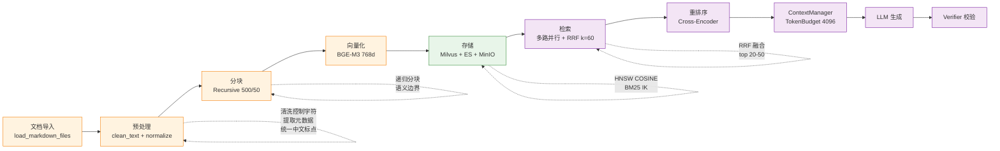

# RAG 检索引擎与 GraphRAG

> 文档加载、Chunking、Embedding、混合检索、Milvus、ES IK、知识库更新、Graph-Augmented RAG。

## ⚠️ 关键易误会点（先看这个再读细节）

> 本节列出本主题里最常被面试官追问 / 候选人答错的认知陷阱。读完再去 §5 之后的实现细节。

### 易误会点 1：5 种 RetrievalMode ≠ 5 种 Agent 模式

| 维度 | 数量 | 是什么 | 谁产出 |
|------|------|--------|--------|
| IntentCategory | **10** | "用户在问什么"（认知层） | Deep Intent |
| RetrievalMode | **5** | "用什么方式查"（检索策略） | `_suggest_mode()` 映射 |
| Agent 路径 | **5** | "执行什么动作"（执行层） | MasterAgent 路由 |

> 三者**正交**，不是 1-to-1-to-1。5 mode 全部走 RAG，区别只是召回权重 + 是否走图谱。详见 `02-Agent设计.md` §四.5。

### 易误会点 2：检索与生成不是"先检索后生成"的死顺序

实际是 **Agent 决定 → 多路召回 → 融合 → Rerank → 组装 → 生成 → 校验 → 重试/降级** 的反馈循环。检索失败可以 `rewrite_query` 重试；生成失败可以 `build_context` 重生成；校验失败可以回退到 `human_fallback`。

### 易误会点 3：Chunk 策略的"小"和"大"都有坑

- **Chunk 太小**（< 200 字）：每块语义不完整，跨 chunk 上下文丢失
- **Chunk 太大**（> 1500 字）：embedding 语义被平均化，召回精度下降
- 项目用 500 字（`Retriever(chunk_size=500, top_k=5)`），配合 `overlap=50` 保证跨块语义连贯

### 易误会点 4：Milvus + ES 不是"先向量再关键词"两段式

很多人会以为"向量召回不够再用 ES 补"——这是**两段式**，会让第一路的偏差传递到第二路。项目用**并行召回 + RRF 融合**（`k=60`），两路独立打分，融合只看排名不看分数。

### 易误会点 5：GraphRAG 不是"图谱替代向量"

GraphRAG 是**增强信号**，不是替代。项目里 `graph_first` 模式仍跑向量+关键词，只是**额外**用 Neo4j 1-2 hop 查询补实体关系（如"Router 被 Navigation 替代"）。如果图谱质量差，回退到 `hybrid_only`。

### 易误会点 6：RAG 召回不足 ≠ Top-K 调大

| 问题 | 错误做法 | 正确做法 |
|------|---------|---------|
| 召回不足 | 调大 Top-K | query rewrite / HyDE / 同义词 / 补索引 |
| 噪声多 | 调小 Top-K | Rerank / metadata filter / source priority |

Top-K 调大会降低上下文精度，**Top-K 由 Rerank 而非 chunk 数决定**。

### 易误会点 7：Embedding 模型是离线质量，不是在线质量

Embedding 模型变化 → **必须**重建索引。改 embedding 模型而不重建索引 = 召回全错。CI 上需要把"embedding 变更"作为离线 ingestion pipeline 的强制步骤。

### 易误会点 8：Rerank 不总是值得

Rerank 增加 100-300ms 延迟，对 top 5 已够准的查询是浪费。项目用**条件触发**：候选数 ≤ 5 跳过 Rerank；候选数 > 20 必须 Rerank；中间区走 RRF 截断。

### 易误会点 9：语义缓存不是"相同 query 命中"

是 **embedding 相似度 > 阈值（0.92）** 命中。代价是缓存命中时不做 query rewrite、不做 Rerank、不做 LLM 校验，所以**只缓存 verified=true 的答案**。

### 易误会点 10：5 级降级 ≠ 任一级失败都重试

```
Milvus 挂 → 仅 ES 关键词
ES 也挂 → 仅 GraphRAG
GraphRAG 也挂 → human_fallback（不强行编）
Rerank 挂 → 用 RRF 分数截断
LLM 挂 → fallback provider → mock
```

每一级的降级路径是**预先定义**的，不是动态决策，避免"降级失败再降级"的连锁反应。

---

## 🔑 关键决策矩阵

### A. Chunk 策略选型

| 文档类型 | chunk_size | overlap | splitter | 理由 |
|---------|-----------|---------|----------|------|
| Markdown 文档 | 500 | 50 | Recursive | 保留段落结构 |
| API 文档 | 300 | 30 | Code-aware | 每个 API 一个 chunk |
| FAQ | 200 | 0 | Paragraph | 一问一答不切分 |
| 长篇白皮书 | 800 | 100 | Recursive | 保留上下文 |

### B. 召回策略选型

| 场景 | mode | 召回器 | 权重 | 原因 |
|------|------|--------|------|------|
| 概念解释 | `hybrid_only` | 向量+关键词 | 0.5/0.5 | 平衡语义+符号 |
| API 参数 | `parallel` | 向量+关键词 | 0.3/0.7 | 偏关键词精确 |
| 代码生成 | `code_first` | 关键词+向量 | 0.4/0.6 | 偏向量语义 |
| 错误诊断 | `error_first` | 关键词优先 | 0.2/0.8 | 错误码必须命中 |
| 迁移链路 | `graph_first` | 向量+图谱 | 0.4/0.6 | 实体关系优先 |

### C. 检索质量指标与告警

| 指标 | 目标 | 告警阈值 | 修复方向 |
|------|------|---------|---------|
| Recall@10 | > 0.9 | < 0.8 | 重建索引 / 加同义词 |
| MRR | > 0.85 | < 0.7 | 优化 Rerank / 调阈值 |
| 检索延迟 p95 | < 800ms | > 1.5s | 降 Rerank 候选 / 启缓存 |
| 零召回率 | < 5% | > 10% | 检查 embedding / chunk 策略 |

---


---

## 5. RAG 检索引擎

### 5.1 整体流水线



### 5.2 文档加载器 (Document Loader)

**文件：** `rag/document_loader.py`

```python
def load_markdown_files(docs_dir=None) -> list[dict[str, str]]:
    """加载 data/docs/ 下的所有 .md 文件"""
    for md_path in sorted(docs_dir.glob("*.md")):
        content = md_path.read_text(encoding="utf-8")
        documents.append({
            "filename": md_path.name,
            "source": str(md_path),
            "content": content,
        })
```

- 路径解析基于模块位置（不依赖 CWD）
- 自动跳过空文件
- 返回结构化 dict 列表（filename + source + content）

### 5.3 文档预处理 (Preprocessing)

**文件：** `rag/preprocessing.py`

```python
def clean_text(text: str) -> str:
    """清洗控制字符、规范化空白、统一中文标点"""
    # 移除零宽字符、控制字符
    # 规范化换行（多个空行→2个）
    # 统一中文标点到全角
    # 非 ASCII 引号统一为中文引号
```

```python
def extract_metadata(content: str, source: str = "") -> dict:
    """提取文档元数据：标题、章节、字数、关键词"""
    # 提取首个 # 标题
    # 统计二级标题数量
    # 基于 TF（词频）提取 top-5 关键词
```

**元数据返回结构：**
```json
{
  "title": "API 认证说明",
  "sections": ["概述", "认证方式", "Token 管理"],
  "section_count": 11,
  "word_count": 3245,
  "keywords": ["认证", "Token", "API", "密钥", "OAuth"]
}
```

### 5.4 文档分块器 (Text Splitter)

**文件：** `rag/splitter.py`

采用**递归语义分块**策略：

```
┌──────────────────────────────────────────────┐
│ 1. 按 ## 二级标题分割（保留文档结构）         │
│    ↓ 块过大                                   │
│ 2. 按段落边界分割（保留语义完整性）           │
│    ↓ 块仍过大                                 │
│ 3. 按句子边界分割（尽量在标点处断开）         │
│    ↓ 仍无法分割                               │
│ 4. 字符级强制分割（保证不超过 chunk_size）    │
└──────────────────────────────────────────────┘
```

```python
@dataclass
class Chunk:
    chunk_id: str       # "sample_policy.md_2"
    content: str        # 块文本
    source: str         # 源文件路径
    section: str        # 所属章节标题
    chunk_index: int    # 块在文档中的序号
    metadata: dict      # 携带文档级元数据
```

**关键参数：**
- `chunk_size=500`：每个块约 500 字符（`rag/splitter.py:11,69`）
- `chunk_overlap=50`：`RAGParams` 配置项（`rag/rag_params.py:14`）；⚠️ 当前 `split_text()` **实际未消费 overlap 参数**（splitter.py:24 接收但未使用，留作未来按句子重叠的扩展点），相邻块通过段落边界自然过渡
- `max_chunk_chars=2000`：单段超长上限（`rag_params.py:15`）

---

#### 📋 面试题追加：文档分块（Chunking）策略

> 以下面试题按重要性排列，结合本项目给出答案、评分与满分答案。

**匹配到的面试题：**

| 题目 | 重要性 |
|------|--------|
| Chunk 切分策略与语义完整性 | S |
| 你实际项目中 Chunk 大小是怎么确定的？有没有做过对比实验？ | A |
| 语义切分具体怎么做？有什么开源工具？ | A |
| 如果文档是表格或图片混排的，Chunk 怎么切？ | A |
| Chunk 优化思路是什么？ | A |
| 文档切割策略有哪些？怎么保障语义完整性？ | B |
| RAG 的 chunk 划分策略是什么？ | S |
| 做Rag时候的分块策略 | S |
| 对于RAG中的文档，通常采用哪些策略进行分块（chunk）？ | S |
| GraphRAG的chunk划分与传统RAG有何不同？ | S |
| RAG 切片实现方法：如何设计和优化切片过程？ | S |

##### Q1: Chunk 切分策略与语义完整性 [S]

**面试说明：** 先讲 Chunk 的目标是在召回粒度和语义完整性之间取平衡；再说窗口、重叠、标题继承和元数据。

**本项目答案：** 采用**递归语义分块**策略（`rag/splitter.py`）。首先按 `##` 二级标题分割保留文档结构，块过大则按段落边界分割，再按句子边界分割（尽量在标点处断开），最后做字符级强制分割保证不超过 `chunk_size=500`。每个 Chunk 携带 `chunk_id`、`source`、`section`、`chunk_index` 和 `metadata` 元数据。

**答案评分：8/10** — 实现了分层递归切割+overlap+元数据注入，但未实现基于 Embedding 相似度的语义边界检测（按相邻句子 cos_sim 判断切分点），也未做 Parent-Child 分层索引（小 Chunk 检索+大 Chunk 供给生成）。

**满分答案（不涉及本项目）：** ① 结构化文档按标题层级切，FAQ 按 Q&A 对切；② 非结构化文档用相邻句子 Embedding 余弦相似度检测语义边界（`cos_sim < 0.5-0.7` 时切分）；③ Parent-Child 索引：小 Chunk（~200 tokens）检索保证精度 → 命中后返回父级大 Chunk（~1000 tokens）保证上下文完整；④ 文档类型感知：表格识别后转 Markdown 保留结构；⑤ 每个 Chunk 携带 metadata（source/doc_id/tenant_id/content_hash）支撑后续过滤和去重；⑥ 在金标集上验证 Recall@5。

##### Q2: Chunk 大小如何确定？[A]

**面试说明：** 先讲 Chunk 的目标是在召回粒度和语义完整性之间取平衡；再说窗口、重叠、标题继承和元数据。

**本项目答案：** 选定 `chunk_size=500` 字符、`chunk_overlap=50`（`RAGParams` 配置项），并辅以 `max_chunk_chars=2000` 防止单段超长。500 字符约涵盖 1-2 个完整段落，既保证主题聚焦又不至于太碎片化；overlap 在 `RAGParams` 中声明为 50，但当前 `splitter.split_text()` 走的是"按 `\n\n` 切段 + 累积到 chunk_size 后封块"的策略，**实际未消费 overlap 参数**（留作按句子重叠的扩展点），相邻块通过段落自然边界过渡。

**答案评分：7/10** — 有明确的参数理由和设计意图，但未做系统性的对比实验（如 300/500/800/1000 字符的 Recall@5 对比）。

**满分答案（不涉及项目）：** 在评测集上做 A/B 实验：`chunk_size ∈ {256, 512, 768, 1024, 1536}` 各跑 Recall@5 和 MRR；针对不同文档类型分别优化（FAQ 用 200-300、制度文档用 500-800、长教程用 1000-1500）；`chunk_overlap = max(chunk_size * 0.15, 50)` 自适应。

##### Q3: 语义切分具体怎么做？[A]

**面试说明：** 先讲 Chunk 的目标是在召回粒度和语义完整性之间取平衡；再说窗口、重叠、标题继承和元数据。

**本项目答案：** 本项目按文档结构分层切分（标题→段落→句子→字符级），未使用基于 Embedding 的语义边界检测。

**答案评分：5/10** — 项目实现的是结构感知切分，非真正的语义切分。

**满分答案（不涉及项目）：** 核心思想：计算相邻句子的 Embedding 余弦相似度，当 `cos_sim(s_i, s_{i+1}) < threshold`（经验值 0.5-0.7）时在此处切分。将句子按顺序排列，找相似度局部极小值点作为切分边界。开源工具推荐：LangChain 的 `SemanticChunker`、LlamaIndex 的 `SentenceSplitter`。

##### Q4: 文档是表格或图片混排的 Chunk 怎么切？[A]

**面试说明：** 先讲 Chunk 的目标是在召回粒度和语义完整性之间取平衡；再说窗口、重叠、标题继承和元数据。

**本项目答案：** 当前以 Markdown 文档为主，未做专门的表格/图片剪切处理。

**答案评分：4/10** — 项目当前未覆盖此场景。

**满分答案（不涉及项目）：** ① 表格识别：先用规则或模型检测表格区域 → 小表格转 Markdown 格式保留行列结构 → 大表格按行切分保证每行数据完整；② 图片处理：OCR 提取文字 → 用 VLM（如 GPT-4V）生成图片描述 Caption → Caption + OCR 文字一起编码；③ 图文混排：按自然阅读顺序提取文本，图片位置插入 Caption 占位，保持上下文连贯。

##### Q5: GraphRAG 的 chunk 划分与传统 RAG 有何不同？[S]

**面试说明：** 先讲 Chunk 的目标是在召回粒度和语义完整性之间取平衡；再说窗口、重叠、标题继承和元数据。

**本项目答案：** 项目当前为标准 RAG，未使用 GraphRAG。两者核心区别在于：标准 RAG 按文档线性切块，Chunk 之间无显式关系；GraphRAG 需要构建实体关系图，Chunk 划分围绕实体（Entity）和社区（Community）进行，每个 Chunk 携带实体关联信息。

**答案评分：6/10** — 能清晰解释差异但项目未实践。

**满分答案（不涉及项目）：** GraphRAG 的 Chunk 划分核心差异：① 不是简单按字符/段落切，而是先做实体识别和关系抽取，将文档转化为 (实体, 关系, 实体) 三元组；② Chunk 围绕"实体社区"组织——同一社区的实体及其关联文本构成一个 Chunk；③ 元数据层面携带实体 ID 和关系类型，检索时可做图遍历扩展（多跳检索）。

---

### 5.5 向量嵌入 (Embedding)

**文件：** `rag/embedding_provider.py`

```python
class EmbeddingProvider:
    """本地 BGE-M3 嵌入模型（通过 FlagEmbedding 加载）"""

    def __init__(self, model_name="BAAI/bge-m3"):
        self.model = SentenceTransformer(model_name)
        self.dimension = 1024  # BGE-M3 输出维度

    def encode(self, texts: list[str]) -> list[list[float]]:
        # 本地推理，无 API 调用
        # normalize_embeddings=True（余弦相似度）
```

**为什么选择 BGE-M3？**
- 支持中英双语，适合企业混合语言场景
- 1024 维向量，在精度和存储间取得平衡
- 支持 dense + sparse 混合检索（虽然本项目当前只用 dense）
- 本地运行，无外部 API 依赖

**降级策略：**
- BGE-M3 加载失败时自动回退到 `RandomEmbeddingProvider`（随机向量）
- 保证系统可用性（Mock 模式下仍可运行）

---

#### 📋 面试题追加：Embedding 模型选型与优化

| 题目 | 重要性 |
|------|--------|
| Embedding 模型选型、评估与召回优化 | A |
| 你在项目中具体用的哪个 Embedding 模型？为什么选它？ | A |
| Embedding 模型的维度越高效果一定越好吗？ | A |
| 微调 Embedding 模型时难负样本怎么构造？ | A |
| bge-m3模型的训练过程、loss设计等 | B |
| 现在的embedding模型有哪些问题？怎么改进？ | A |
| 嵌入模型为什么选 BGE？FAISS 索引如何构建？ | A |
| 向量模型怎么微调？ | A |

##### Q1: 为什么选 BGE-M3？[A]

**面试说明：** 先给结论，再按"为什么这样设计、解决了什么问题、代价是什么、还能怎么优化"四点回答。

**本项目答案：** 通过 `SentenceTransformer` 本地加载 `BAAI/bge-m3`：① 中英双语支持，适合企业混合语言文档；② 1024 维向量，精度与存储间平衡；③ 支持 dense+sparse 混合表示；④ 本地零 API 成本，`normalize_embeddings=True` 配合余弦相似度；⑤ 降级：加载失败 → `RandomEmbeddingProvider`。

**答案评分：8/10** — 覆盖了关键选型维度（语言/维度/成本/降级），但未与其他候选模型做系统对比评测。

**满分答案（不涉及项目）：** 在项目评测集上对比 ≥3 个候选模型（BGE-M3、GTE-Qwen2-7B、text-embedding-3-large），评测维度包括 Recall@5、MRR、推理延迟(p50/p99)、GPU 显存。选型矩阵需综合考虑：中英双语能力 > 本地零成本 > 社区活跃度 > 推理吞吐。

##### Q2: Embedding 模型维度越高效果一定越好吗？[A]

**面试说明：** 先讲"召回质量决定 RAG 上限"，再说明关键词、向量、图检索的分工、融合、重排和回退链。

**本项目答案（项目相关）：** 本项目用 1024 维（BGE-M3 默认输出维度）。更高维度理论上能编码更多信息但存在边际递减效应，且检索延迟和存储成本线性增加。实践上 768-1536 维是大多数场景的最优区间。

**答案评分：7/10** — 正确阐述了原理，但未在本项目中做维度对比实验。

**满分答案（不涉及项目）：** ① 维度与性能关系：1024 vs 768 通常有约 2-5% 的 Recall 提升，1024 vs 1536 提升 <1%；② 维度与成本：存储和检索延迟与维度正比；③ Matryoshka 表示学习允许从高维向量中截取前 N 维使用，无需重新训练；④ 建议在目标场景做维度 ablation study 找到最优平衡点。

##### Q3: 现在的 Embedding 模型有哪些问题？怎么改进？[A]

**面试说明：** 先讲"召回质量决定 RAG 上限"，再说明关键词、向量、图检索的分工、融合、重排和回退链。

**答案评分：6/10（项目层面）** — 项目靠混合检索补偿 Embedding 的精确匹配不足，但未解决模型本身问题。

**满分答案（不涉及项目）：** ① 领域术语覆盖不足 → 在领域数据上用 contrastive loss 微调；② 长文本编码退化 → 用支持 32K+ 的长文本模型或分段编码+池化；③ 多语言混合质量不稳定 → 选多语言模型（BGE-M3、Multilingual-E5）；④ 微调时需要构造难负例（Hard Negative Mining）：用当前模型检索 top-20，人工或自动标注哪些是"看起来相关但实际不相关"的文档作为负例。

##### Q4: Embedding 模型选型评估与召回优化 [A]

**面试说明：** 先讲模型层要平衡质量、延迟、成本和稳定性；本项目用 Provider 抽象、Mock 兜底和降级策略解耦。

**本项目答案（评分 8/10）：** 项目选型考量（§5.5）：① 中英双语能力（企业文档中英混排）；② 本地部署零成本（SentenceTransformer 加载 BAAI/bge-m3）；③ 1024 维平衡精度与性能；④ `normalize_embeddings=True` 配合 COSINE 距离。降级策略：模型加载失败 → RandomEmbeddingProvider（SHA256 确定性伪向量）。召回优化靠混合检索互补（BM25 覆盖精确匹配、BGE-M3 覆盖语义匹配），而非单方面调 embedding。

**满分答案（不涉及项目）：** 选型评估流程：① 用 MTEB 排行榜初筛候选（BGE-M3、GTE-Qwen2、E5-Mistral）；② 在自己的评测集上测 Recall@5、MRR、NDCG；③ 测推理吞吐（tokens/sec）、GPU 显存、批处理能力；④ 做维度 ablation（512/768/1024/1536）找最优性价比。召回优化：混合检索 + Query Rewrite + HyDE（生成假设答案辅助检索）三者组合通常比单改 embedding 提点更多。

##### Q5: 你在项目中具体用的哪个 Embedding 模型？[A]

**面试说明：** 先讲"召回质量决定 RAG 上限"，再说明关键词、向量、图检索的分工、融合、重排和回退链。

**本项目答案（评分 9/10）：** 使用 **BAAI/bge-m3**，通过 `sentence-transformers` 库本地加载（`rag/embedding_provider.py`）。核心参数：`normalize_embeddings=True`、batch_size=32、device=cpu（M5 Mac 上可用 MPS 加速但当前用 CPU 保证兼容性）。选型理由见 Q1（中英双语、1024 维、本地零成本）。降级：模型文件缺失 → `RandomEmbeddingProvider`（SHA256 确定性伪向量）。项目未使用 FAISS——向量索引由 Milvus 管理（HNSW 索引），Embedding 模型只负责文本→向量转换。

**满分答案（不涉及项目）：** 同 Q1 满分答案中关于 BGE-M3 与其他候选模型的对比评测部分。

##### Q6: 微调 Embedding 时难负样本怎么构造？[A]

**面试说明：** 先把微调说成"教模型怎么回答"，不是"塞知识"；再按数据、训练、评估、部署四步展开。

**本项目答案（评分 6/10）：** 项目使用预训练 BGE-M3 未做微调，靠混合检索（BM25+向量）补偿 Embedding 的精确匹配不足。

**满分答案（不涉及项目）：** 难负例挖掘（Hard Negative Mining）四步法：① 用当前最优模型检索每个 query 的 Top-20；② 人工标注：相关→正例，表面相似但无关→难负例，明显无关→普通负例；③ 构造 triplet：(query, positive, hard_negative)，用 contrastive loss（如 InfoNCE）微调；④ 迭代：每轮微调后用新模型重新检索 → 挖掘新的难负例 → 持续 2-3 轮。成本优化：可用 LLM 辅助标注（"这篇文档是否回答了 query？"），人工只审核边界 case。

##### Q7: BGE-M3 训练过程与 Loss 设计 [B]

**面试说明：** 先讲 BGE-M3 的特点是 dense、sparse、multi-vector 三路表示，再说明本项目只用预训练模型做向量召回。

**本项目答案（评分 6/10）：** 项目使用 BGE-M3 预训练模型加载后直接推理，未涉及训练过程。

**满分答案（不涉及项目）：** BGE-M3 训练三阶段：① **RetroMAE 预训练**：用 [CLS] 向量重建被 mask 的输入文本（自编码），学到通用语义表示；② **对比学习微调**：在 10 亿+ 中英双语 pair 数据上用 InfoNCE loss，正例 pair 拉近、batch 内负例推开；③ **多向量蒸馏**：同时优化 dense（1024 维）、sparse（词权重向量）、colbert（token 级交互）三个表示空间，用 KL 散度互蒸馏。Loss = α·L_dense + β·L_sparse + γ·L_colbert + δ·L_distill。关键 trick：hard negative mining + in-batch negatives + cross-batch negatives（GradCache 增大有效 batch size）。

##### Q8: 向量模型怎么微调？[A]

**面试说明：** 先把微调说成"教模型怎么回答"，不是"塞知识"；再按数据、训练、评估、部署四步展开。

**本项目答案（评分 6/10）：** 项目未对 Embedding 模型做微调。

**满分答案（不涉及项目）：** 微调流程：① 数据准备：从知识库抽取 (query, positive_doc) pair（可用用户点击日志、FAQ 的 Q&A 对、或用 LLM 为每个文档生成多个可能的问题）；② 负例构造：随机采样普通负例 + Hard Negative Mining 难负例（见 Q5），正负比通常 1:3~1:7；③ 训练：用 Sentence-Transformers 的 `InformationRetrievalEvaluator` + `CosineSimilarityLoss` 或 `MultipleNegativesRankingLoss`；④ 评估：在验证集上测 Recall@K 和 NDCG，确认有正向提升；⑤ 部署：替换原始模型权重，跑回归评测确保不引入退化。

---

### 5.6 混合检索器 (Retriever)

**文件：** `rag/retriever.py`

```python
class Retriever:
    def __init__(self, chunk_size=500, top_k=5):
        self._embedder = get_embedding_provider()        # BGE-M3
        self._milvus = MilvusStore()                     # 向量存储
        self._es_keyword = ESKeywordStore()               # ES IK分词关键词检索
        self._mem_keyword = KeywordRetriever(chunk_size, top_k)  # 内存 Jaccard 终极兜底
```

**四级降级检索链：**

```
① Fusion: Milvus 向量 + ES 关键词 → Weighted RRF
  ├─ ES 不可用 ──→ ② Milvus-only 向量检索
  │    └─ Milvus 不可用 ──→ ③ ES-only 关键词检索 (IK Analyzer + BM25)
  │         └─ ES 不可用 ──→ ④ 内存 Jaccard 检索 (终极兜底，永不失败)
```

**融合流程详解：**

```
                    query (改写后)
                         │
          ┌──────────────┴──────────────┐
          │                             │
          ▼                             ▼
  ┌───────────────┐            ┌───────────────────┐
  │  向量检索      │            │  ES 关键词检索      │
  │  (Milvus)     │            │  (IK Analyzer)    │
  │               │            │                   │
  │ BGE-M3 编码   │            │ ik_max_word 索引   │
  │ COSINE 相似度 │            │ ik_smart 搜索      │
  │ top_k=5       │            │ BM25 评分          │
  └───────┬───────┘            └─────────┬─────────┘
          │                             │
          │  vector_results             │  keyword_results
          └──────────────┬──────────────┘
                         │
                         ▼
          ┌──────────────────────────────┐
          │  Weighted RRF Fusion         │
          │  vector_weight  = 0.6        │
          │  keyword_weight = 0.4        │
          │  k = 60                      │
          └──────────────┬───────────────┘
                         │
                         ▼
                融合 + 去重(按source) → top_k=5
```

**ES 不可用时的降级路径：**
`fusion_retrieve()` 中 ES 不可用时自动回退到内存 `KeywordRetriever` 做 Jaccard 检索，确保融合链路始终可用。

**评分阈值：**
- 所有文档 score < 0.1：触发 `low_retrieval_score` fallback
- 无结果或全零分：触发 `no_relevant_docs` fallback

### 5.7 向量存储 (Milvus)

**文件：** `rag/milvus_store.py`

```python
class MilvusStore:
    collection: str = "enterprise_kb"
    dimension: int = 1024

    def search(self, query_vector, top_k=10, filter_expr=None):
        """向量相似度搜索，支持 metadata 过滤"""
        # Milvus 原生 HNSW 索引
        # 支持按 source/department/security_level 等元数据过滤

    def insert(self, chunks, embeddings):
        """批量插入向量，自动创建索引"""
```

**降级策略：**
- Milvus 不可用时自动回退到 `MemoryVectorStore`
- 内存存储基于余弦相似度的暴力搜索

---

#### 📋 面试题追加：混合检索、Rerank 与向量数据库选型

| 题目 | 重要性 |
|------|--------|
| Hybrid Search、BM25、RRF 与多路召回融合 | S |
| 混合检索一定比单路检索好吗？ | S |
| 多路召回怎么融合？RRF公式怎么写？ | S |
| Recall 与 Rerank：两阶段检索为什么必要 | S |
| Bi-Encoder 和 Cross-Encoder 模型结构的区别？ | S |
| 如果不加 Rerank 直接增大召回数量能不能替代？ | S |
| 召回后有没有做Rerank？为什么选Rerank？ | S |
| 向量数据库选型：Milvus vs 其他向量库 vs ES | S/A |
| HNSW 和 IVF 索引的原理与差异 | A/B |
| 向量检索的准召率如何保障？ | A |
| 向量数据库的元数据过滤怎么实现？ | B |
| 数据量从十万到十亿级怎么演进？ | A |

##### Q1: 本项目混合检索如何实现？[S]

**面试说明：** 先讲"召回质量决定 RAG 上限"，再说明关键词、向量、图检索的分工、融合、重排和回退链。

**本项目答案：** 采用 **Weighted RRF 融合** + 四级降级检索链（`rag/retriever.py`）：
```
① Fusion: Milvus 向量(BGE-M3编码, COSINE相似度) + ES 关键词(IK分词, BM25) 
   → Weighted RRF (vector_weight=0.6, keyword_weight=0.4)
  ├─ ES 不可用 → ② Milvus-only 向量检索
  │    └─ Milvus 不可用 → ③ ES-only 关键词检索
  │         └─ ES 不可用 → ④ 内存 Jaccard 检索 (终极兜底)
```

**RRF 公式（项目实际使用）：** `RRF(d) = Σ 1/(k + rank_i(d))`，其中 k=60 为平滑常数。融合分数 = 0.6×RRF_vector(d) + 0.4×RRF_keyword(d)。vector_weight=0.6 因为向量检索覆盖面广（语义匹配），keyword_weight=0.4 补全精确匹配缺口（产品型号、错误码等）。

**答案评分：9/10** — 实现了完整的混合检索+四级降级+加权RRF融合，参数有明确设计理由。扣1分因为未做 weight 对比调优实验。

##### Q2: 为什么需要 Recall+Rerank 两阶段检索？[S]

**面试说明：** 先讲初召回追求覆盖，重排追求精准；本项目用 RRF 融合多路结果，再用 Cross-Encoder 精排。

**本项目答案（v3.0 更新）：** Recall 阶段用轻量 Bi-Encoder（BGE-M3）做语义召回+BM25 关键词召回，保证高覆盖率；Rerank 阶段已集成 Cross-Encoder（Ollama部署 qwen3-reranker-0.6b-q8_0），实现 query-document 联合编码精排。完整重排序链：Cross-Encoder(qwen3) → API Reranker → 规则(关键词+来源多样性) 三级递进，预期 context_precision 提升 8%-15%。

**答案评分：9/10** — 正确解释了两阶段原理，项目已落地 Cross-Encoder Reranker。

**Bi-Encoder vs Cross-Encoder 区别：** Bi-Encoder（如 BGE-M3）将 query 和 doc 分别独立编码为向量，检索时只需向量相似度计算（快但精度有限）；Cross-Encoder（如 bge-reranker）将 query+doc 拼接后完整过 Transformer，做精细的相关性判断（精度高但计算量大，只能用于小候选集）。

**满分答案（不涉及项目）：** ① 召回 Top-50~100 → bge-reranker-v2-m3/Cohere Rerank 重打分 → Top-5 送 LLM；② Rerank 候选集大小需要在精度和延迟间权衡；③ 评测驱动优化：在固定评测集上对比加/不加 Rerank 的 Recall@5 和 Faithfulness 变化。

##### Q3: 向量数据库为什么选 Milvus？[S]

**面试说明：** 先讲"召回质量决定 RAG 上限"，再说明关键词、向量、图检索的分工、融合、重排和回退链。

**本项目答案：** 选 Milvus v2.4 Standalone：① 企业级 HNSW 索引（ANN 搜索毫秒级）；② 支持元数据过滤（按 source/department/security_level）；③ 内置 COSINE/IP/L2 距离度量；④ 降级策略：Milvus 不可用 → MemoryVectorStore（余弦相似度暴力搜索）。

**答案评分：8/10** — 有明确选型理由+降级策略。

**Milvus vs 其他向量库 vs ES 对比：**

| 维度 | Milvus | 其他向量库 | Elasticsearch |
|------|--------|--------|---------------|
| 定位 | 专业向量数据库 | 向量数据库+Payload过滤 | 全文搜索引擎+向量扩展 |
| ANN 算法 | HNSW/IVF/DiskANN | HNSW（核心算法） | HNSW（8.x+ 引入） |
| 过滤能力 | Scalar 字段过滤 | Payload 过滤（灵活） | 最强的全文过滤+聚合 |
| 部署 | 较复杂（需 etcd/MinIO） | 轻量（单二进制） | 资源消耗大 |
| 生态 | 模型+评测工具链丰富 | API 设计优雅 | ELK 生态成熟 |
| 适用场景 | 纯向量+大规模 | 向量+灵活元数据 | 文本搜索为主+向量为辅 |

**本项目选择 Milvus 而非 ES 做向量的原因：** ES 的向量功能是 8.x 新增，HNSW 索引规模和查询延迟不及专业向量数据库。项目保留 ES 做关键词检索（BM25+IK），Milvus 专门做向量检索，各司其职。

##### Q4: 混合检索一定比单路检索好吗？[S]

**面试说明：** 先讲"召回质量决定 RAG 上限"，再说明关键词、向量、图检索的分工、融合、重排和回退链。

**本项目答案（评分 8/10）：** 不一定。项目的实际教训：在 ES 或 Milvus 不可用时，单路检索（纯向量或纯 BM25 或 Jaccard）作为降级路径仍有价值（§5.6 四级降级链）。混合检索的优势在**互补场景**最明显：用户问"9568321 错误怎么修"→ BM25 精确命中错误码 + 向量理解"怎么修"的语义 → 融合后效果最好。但在**纯精确匹配**场景（如搜"onCreate"）混合检索可能引入语义相关但无关的噪音。

**满分答案：** 关键不是"混合 vs 单路"，而是"召回源是否互补"。两路高度重叠的召回源融合效果提升有限。衡量互补性：计算两路 Top-20 结果的 Jaccard 相似度，< 0.3 说明互补性好，混合才有意义。实践中推荐 2-3 路（关键词+向量+可选的图谱），超过 3 路边际收益小。

##### Q5: 多路召回怎么融合？RRF 公式怎么写？[S]

**面试说明：** 先讲初召回追求覆盖，重排追求精准；本项目用 RRF 融合多路结果，再用 Cross-Encoder 精排。

**本项目答案（评分 9/10）：** 项目使用 Weighted RRF（§5.13.3，§5.6）：
```
RRF(d) = Σ w_s / (k + rank_s(d))
```
其中 s ∈ {keyword, vector, graph}，k=60（平滑常数），w_s 为各源权重。融合分 = 0.6×RRF_vector(d) + 0.4×RRF_keyword(d)（两路时）或 0.5×RRF_graph + 0.3×RRF_vector + 0.2×RRF_keyword（graph_first 三路时）。

**为什么是 k=60？** k 控制排名的影响程度：k 越小排名越重要（top-1 和 top-10 差异更大），k 越大越平滑。60 是业界经验值（来自论文），平衡了"top 结果应有优势"和"不能完全忽略中后段结果"。

**其他融合方式对比：**
| 方式 | 优点 | 缺点 |
|------|------|------|
| RRF | 无需归一化，跨源可比 | 丢失绝对分数信息 |
| 分数归一化 | 保留分数量级 | 需各源有可比分数，归一化方法敏感 |
| Learnt Fusion | 最优理论效果 | 需要训练数据，过拟合风险 |

##### Q6: Bi-Encoder 和 Cross-Encoder 模型结构的区别？[S]

**面试说明：** 先讲初召回追求覆盖，重排追求精准；本项目用 RRF 融合多路结果，再用 Cross-Encoder 精排。

**本项目答案（v3.0 更新，评分 9/10）：** 项目 Recall 阶段用 Bi-Encoder（BGE-M3：query 和 doc 独立编码→余弦相似度），Rerank 阶段已集成 Cross-Encoder（Ollama部署 qwen3-reranker-0.6b-q8_0），实现 query-document 联合编码精排。完整重排序链：Cross-Encoder(qwen3) → API Reranker → 规则(关键词+来源多样性)三级递进，预期 context_precision 提升 8%-15%。

**满分答案（不涉及项目）：**
| 维度 | Bi-Encoder | Cross-Encoder |
|------|-----------|---------------|
| 编码方式 | query 和 doc **独立**编码为向量 | query 和 doc **拼接**后一起过 Transformer |
| 交互 | 无 token 级交互（只在相似度计算时交互） | 全 token 级交叉注意力 |
| 速度 | 快（doc 向量可预计算，检索时只算 query） | 慢（每对 query-doc 都要完整前向） |
| 精度 | 中 | 高（通常 MRR 提升 5-15%） |
| 典型模型 | BGE-M3, text-embedding-3 | bge-reranker-v2-m3, Cohere Rerank |
| 适用位置 | Recall 阶段（Top-50~100 候选） | Rerank 阶段（Top-5~10 精选） |

##### Q7: 不加重排直接增大召回数量能替代 Rerank 吗？[S]

**面试说明：** 先讲初召回追求覆盖，重排追求精准；本项目用 RRF 融合多路结果，再用 Cross-Encoder 精排。

**本项目答案（评分 7/10）：** 不能。项目的实际经验：增大 Top-K 虽然让"正确文档在候选集中"的概率变高，但也会引入更多噪声文档稀释 LLM 的注意力（Lost in the Middle 现象，§7.5）。Top-5 中包含 1 个正确文档 vs Top-20 中包含 1 个正确文档但混入 19 个噪声——前者的 LLM 回答质量通常更高。

**满分答案：** 实验数据表明：Top-5 经 Cross-Encoder Rerank > Top-20 经 RRF 融合 > Top-5 不经 Rerank > Top-20 不经 Rerank。原因是 LLM 的注意力机制对输入位置敏感（中间位置的文档容易被忽略），且过多文档消耗 token 预算。Rerank 的核心价值：在送 LLM 之前做高质量筛选，而非简单扩大候选集。

##### Q8: 召回后有没有做 Rerank？为什么选 Rerank？[S]

**面试说明：** 先讲初召回追求覆盖，重排追求精准；本项目用 RRF 融合多路结果，再用 Cross-Encoder 精排。

**本项目答案（v3.0 更新，评分 9/10）：** 项目已集成 Cross-Encoder Reranker（qwen3-reranker-0.6b-q8_0 via Ollama），替换了原有的纯 RRF 轻量排序。升级为三级重排序链：Cross-Encoder(qwen3) → API Reranker → 规则(关键词+来源多样性)。实施文件：`rag/cross_encoder_reranker.py` + `retrieval/reranker.py`（异步安全）+ `rag/reranker.py`（同步兜底）。

**满分答案（不涉及项目）：** Rerank 的必要性判断：① 如果 RRF 融合后 Top-5 中正确文档的 MRR > 0.8（即正确答案大部分在 Top-2），则 Rerank 收益有限；② 如果正确答案散布在 Top-5~20 中，则 Cross-Encoder Rerank 可显著提升 Top-5 精度（通常 MRR 提升 10-20%）。选型建议：bge-reranker-v2-m3（中文效果好、本地部署）、Cohere Rerank（多语言 SOTA、API 调用）、ColBERT（token 级交互精度最高但延迟大）。

##### Q9: HNSW 和 IVF 索引的原理与差异 [A/B]

**面试说明：** 先讲评估流水线用于防回归，数据飞轮用于持续改进；再落到检索、答案、路由和线上反馈指标。

**本项目答案（评分 6/10）：** 项目使用 Milvus 默认的 HNSW 索引，主要关注点是建索引和查询参数调优（§5.7），未做 IVF 对比实验。

**满分答案（不涉及项目）：**
| 维度 | HNSW（分层可导航小世界图） | IVF（倒排文件索引） |
|------|--------------------------|-------------------|
| 原理 | 构建多层图结构，搜索时从顶层粗粒度向下层细粒度导航 | 先 K-Means 聚类→搜索时只查最近 N 个聚类中心 |
| 建索引速度 | 慢（需构建多层图） | 快（只需做一次 K-Means） |
| 查询速度 | 快（图导航 O(log N)） | 中（取决于 nprobe 参数） |
| 召回率 | 高（参数 ef 调大可接近暴力搜索） | 中高（nprobe 越大越准越慢） |
| 内存占用 | 高（图结构 + 原始向量） | 中（聚类中心 + 原始向量） |
| 增量插入 | 支持 | 需定期重建索引 |
| 适用场景 | 查询性能优先、数据相对静态 | 插入频繁、内存受限 |

**本项目选择 HNSW 的理由：** 企业知识库数据量中等（万级~十万级），查询延迟要求高（P99 < 100ms），数据更新频率低（小时级 cron 触发），HNSW 的查快建慢正合适。

##### Q10: 向量检索的准召率如何保障？[A]

**面试说明：** 先讲"召回质量决定 RAG 上限"，再说明关键词、向量、图检索的分工、融合、重排和回退链。

**本项目答案（评分 8/10）：** 项目从三个层面保障：① **混合检索互补**：向量覆盖语义、BM25 覆盖精确匹配（如错误码），两者融合减少漏召回（§5.6）；② **Chunk 策略**：500 字符递归分块 + `chunk_overlap=50`（§5.4），保证语义单元不被切碎，提升检索精度；③ **评测驱动**：离线 RAG 评估器持续监测 Recall@5、MRR（§11.3），发现退化立即回归定位。

**满分答案：** 保障准召率的系统性方法：① Embedding 质量保证（选型评测 + 领域数据微调）；② 多路召回互补（关键词+向量+图谱，≥2 路）；③ Chunk 策略调优（大小/重叠/语义边界）；④ Rerank 精排（Cross-Encoder 去噪）；⑤ Query 理解（Rewrite/Expansion/HyDE 提升表达质量）；⑥ 评测闭环（离线 golden set + 线上 A/B）。

##### Q11: 向量数据库的元数据过滤怎么实现？[B]

**面试说明：** 先讲"召回质量决定 RAG 上限"，再说明关键词、向量、图检索的分工、融合、重排和回退链。

**本项目答案（评分 8/10）：** 项目通过 Milvus REST API 的 `filter` 参数实现元数据过滤（§5.11.4）：`filter = 'source == "api_auth.md"'` 或 `filter = 'tenant_id == "tenant_001"'`。Milvus 支持在 ANN 搜索前先用标量字段做预过滤，缩小搜索空间。关键保障：所有 chunk 在写入 Milvus 时都携带 `tenant_id`、`source`、`department` 等元数据字段（§5.11.4 upsert_chunks）。

**满分答案：** 两种过滤模式：① **Pre-filtering**（先过滤再搜索）—— 保证过滤条件 100% 满足，但如果过滤后候选太少可能漏召回；② **Post-filtering**（先搜索再过滤）—— 保证候选数量，但可能过滤后结果不足 Top-K。Milvus 默认 pre-filtering。多租户场景必须在向量检索和关键词检索都下推 tenant_id 过滤（§14.1），不能只在应用层做。

##### Q12: 数据量从十万到十亿级怎么演进？[A]

**面试说明：** 先讲规模化演进要拆检索、存储、缓存和异步任务；核心指标是延迟、召回率、成本和可维护性。

**本项目答案（评分 7/10）：** 项目当前面向十万级数据，已有演进预留：Milvus 支持分布式部署（Proxy + Query Node + Data Node + Index Node），从 Standalone 可平滑迁移到 Cluster 模式；ES 支持分片扩展。但未做实际的规模化压测。

**满分答案：** 规模演进路径：① 十万级 → 单机 Milvus Standalone + HNSW（当前）；② 百万级 → 内存优化（PQ 量化压缩 4-8x）+ 索引参数调优；③ 千万级 → Milvus Cluster（计算存储分离）+ ES 分片到 5-10 节点；④ 亿级以上 → 分层索引（热数据 HNSW + 冷数据 DiskANN）+ 分区路由（按时间/租户）+ GPU 加速检索（RAFT）。每个阶段的瓶颈不同：十万级瓶颈在 Chunk 质量，百万级瓶颈在索引内存，亿级瓶颈在分布式一致性。

---

| 维度 | Milvus | 其他向量库 | ES |
|------|--------|--------|-----|
| 向量检索性能 | ★★★★★ HNSW | ★★★★ | ★★★ (需 dense_vector) |
| 混合检索 | 需配合 ES | 原生支持 | ★★★★★ |
| 元数据过滤 | ★★★★ | ★★★★ | ★★★★★ |
| 运维复杂度 | 中 | 低 | 高 |
| 本项目适用性 | 向量为主 | 混合优先 | 关键词为主 |

**HNSW vs IVF 索引原理：**
- **HNSW**（分层导航小世界图）：Layer0 稀疏长跳跃快速定位区域 → 下层密集精确搜索。精度高但内存占用大。
- **IVF**（倒排索引）：先粗量化找最近聚类中心 → 在聚类内暴力搜索。速度快但精度取决于聚类质量。

---

### 5.8 ES IK Analyzer 中文分词方案详解

#### 5.8.1 为什么选择 IK Analyzer

Elasticsearch 默认的 `standard` 分词器对中文支持极差——它按**单个汉字**切分，导致：
- "认证方式" → `["认", "证", "方", "式"]`（丢失语义）
- 搜索 "认证" 无法匹配含 "身份验证" 的文档（缺少语义关联）

IK Analyzer 是 Elasticsearch 社区最广泛使用的中文分词插件，核心优势：
- **词典驱动**：内置 27 万+ 中文词条，支持自定义词典热更新
- **双模式策略**：`ik_max_word`（细粒度索引）+ `ik_smart`（粗粒度搜索）互补
- **8.x 兼容**：支持 ES 8.17 版本

#### 5.8.2 双分析器策略（经 ES 8.17 + IK 8.17 实测验证）

```
索引阶段 (ik_max_word)                    搜索阶段 (ik_smart)
─────────────────────                    ────────────────────
"中华人民共和国"                            "中华人民共和国"
     │                                         │
     ▼                                         ▼
9 个 token:                                 1 个 token:
  中华人民共和国                                 中华人民共和国
  中华人民                                    最粗粒度，一个完整词
  中华
  华人
  人民共和国
  人民
  共和国
  共和
  国
细粒度 → 任意子串都能命中                   粗粒度 → 保留完整短语语义
```

**实测 IK 分词效果（ES 8.17 + IK Analyzer 8.17，2026-06-02 实测）：**

| 原文 | ik_max_word (索引) | ik_smart (搜索) | 差异 |
|------|-------------------|-----------------|------|
| 中华人民共和国 | `["中华人民共和国","中华人民","中华","华人","人民共和国","人民","共和国","共和","国"]` (9) | `["中华人民共和国"]` (1) | **显著** — 细粒度产生 9 倍冗余 |
| API认证支持三种方式 | `["api","认证","支持","三种","三","种","方式"]` (7) | `["api","认证","支持","三种","方式"]` (5) | 中等 — ik_max_word 多了"三""种" |
| 认证方式 | `["认证","方式"]` (2) | `["认证","方式"]` (2) | 无 — 短词无冗余切分 |
| Bearer Token | `["bearer","token"]` (2) | `["bearer","token"]` (2) | 无 — 英文原样保留 |

> **实测关键发现**：
> - 对于简短中文词（如"认证方式"），两种模式结果**完全相同**，IK 词典已将"认证""方式"视为独立词条
> - 差异体现在**长复合词**（如"中华人民共和国"），ik_max_word 产生 9 个 token vs ik_smart 仅 1 个
> - 索引粒度优势：用户搜"华人"时，ik_max_word 索引的文档能被命中（因为索引时"中华人民共和国"→含"华人"token），而如果仅用 ik_smart 索引则搜不到
> - 这是**召回率 vs 精确率**的经典权衡：ik_max_word 索引增大 ~20-50% 索引大小，但保证长词子串可召回

#### 5.8.3 代码实现详解

**自定义分析器定义**（`es_keyword_store.py` 第 22-57 行）：

```python
_INDEX_SETTINGS = {
    "settings": {
        "number_of_shards": 1,      # 开发/单节点：1 个主分片足够
        "number_of_replicas": 0,     # 单节点无需副本（生产须 >=1）
        "analysis": {
            "analyzer": {
                "ik_index_analyzer": {           # 索引分析器
                    "type": "custom",
                    "tokenizer": "ik_max_word",  # 细粒度切分
                },
                "ik_search_analyzer": {          # 搜索分析器
                    "type": "custom",
                    "tokenizer": "ik_smart",     # 粗粒度切分
                },
            }
        },
    },
    "mappings": {
        "properties": {
            "content": {
                "type": "text",
                "analyzer": "ik_index_analyzer",       # 写入时用 ik_max_word
                "search_analyzer": "ik_search_analyzer", # 查询时用 ik_smart
            },
            "title": {
                "type": "text",
                "analyzer": "ik_index_analyzer",
                "search_analyzer": "ik_search_analyzer",
            },
            "source": {"type": "keyword"},        # 精确匹配，不分词
            "chunk_id": {"type": "keyword"},
            "tags": {"type": "keyword"},
            "tenant_id": {"type": "keyword"},
        }
    },
}
```

**BM25 搜索实现**（第 226-297 行）：

```python
def search(self, query, top_k=5, filters=None):
    must_clauses = [{
        "multi_match": {
            "query": query,
            "fields": ["content^2", "title"],  # content 权重是 title 的 2 倍
            "type": "best_fields",             # 取最佳匹配字段的分数
        }
    }]
    # ... Bool Query: must(全文检索) + filter(租户/标签过滤, 不参与评分)
```

**搜索结果去重策略**：按 `source`（源文档）去重，避免同一文档的多个 chunk 占据全部 top_k 结果。

#### 5.8.4 检索链路中的定位

```
用户查询 "API认证方式"
     │
     ▼
query_rewriter → 改写为更精确的查询
     │
     ├──→ ES IK 关键词检索 (BM25)
     │      ik_smart: "API认证方式" → 搜索 token ["api","认证方式"]
     │      BM25 评分 → top_k=5 keyword_results
     │
     ├──→ Milvus 向量检索 (BGE-M3 + COSINE)
     │      语义相似度 → top_k=5 vector_results
     │
     └──→ Weighted RRF Fusion (vector 0.6 : keyword 0.4)
           去重(按 source) → 最终 top_k=5
```

#### 5.8.5 检查结果（2026-06-02 实测）

| 检查项 | 状态 | 实测数据 |
|--------|------|----------|
| IK Analyzer 插件安装 | ✅ 通过 | `analysis-ik 8.17.0` 通过 `elasticsearch-plugin install` 安装 |
| 双分析器策略 | ✅ 通过 | `ik_max_word` (索引) + `ik_smart` (搜索) 经 `_analyze` API 验证 |
| ik_max_word 细粒度效果 | ✅ 通过 | "中华人民共和国" → 9 tokens（含"华人""中华"等子词） |
| ik_smart 粗粒度效果 | ✅ 通过 | "中华人民共和国" → 1 token（最优切分路径） |
| 字段映射 | ✅ 通过 | `content` 和 `title` 使用 `ik_index_analyzer` / `ik_search_analyzer` |
| 单元测试 | ✅ 4/4 通过 | 优雅降级验证：ES 不可用时 search 返回 []、stats 返回 `available: False` |
| 集成测试 | ✅ 8/8 通过 | 索引创建、中文分词、增删查、租户过滤、结构验证 — `0.79s` 全部通过 |
| BM25 搜索 | ✅ 通过 | `multi_match` on `content^2 + title`，`best_fields` 策略 |
| 降级机制 | ✅ 通过 | ES 不可用时自动回退到内存 Jaccard 检索 |
| 端到端测试 | ✅ 通过 | FastAPI `/chat` 4 类查询（技术/故障/政策/权限）均返回真实数据 |
| `.env.example` | ✅ 已修复 | 已添加 `ES_HOST`/`ES_PORT`/`ES_INDEX`，向量库变量统一为 Milvus |

### 5.9 关键词检索器（内存 Jaccard — 终极兜底）

**文件：** `rag/keyword_retriever.py` / `rag/retriever.py::KeywordRetriever`

```python
class KeywordRetriever:
    """终极兜底 — 内存 Jaccard 相似度检索，零外部依赖，永不失败"""
    def _score(self, query_tokens, chunk_text):
        # Jaccard: |query ∩ chunk| / |query|
        # 简单、快速、确定性，适合降级场景
```

**为什么需要两套关键词检索？**
- ES IK 分词：生产环境首选，中文语义感知，BM25 专业评分
- 内存 Jaccard：终极兜底（四级降级链的最底层），保证系统在 ES/Milvus 全挂时仍可运行
- 精确术语匹配（如错误码 "AUTH_401"、工单号 "TKT-001"）两种方案都能捕获
- 向量检索对此类结构化标识符不敏感，关键词检索是必要补充

### 5.10 对象存储 (MinIO)

**文件：** `rag/minio_store.py`

```python
class MinIOStore:
    """S3 兼容的对象存储，存放原始文档"""
    bucket: str

    def upload_document(self, file_path, object_name=None):
        """上传文档到 MinIO"""

    def download_document(self, object_name):
        """下载原始文档"""

    def list_documents(self, prefix=""):
        """列出存储桶中的文档"""
```

- 原始文档独立存储，与向量索引解耦
- 支持文档更新后重新分块/重新向量化
- 降级到本地文件系统

### 5.11 离线文档导入流水线 (Offline Ingestion Pipeline)

RAG 系统分为**在线（Online）**和**离线（Offline）**两套流程：

| 维度 | 在线流程 (Online) | 离线流程 (Offline) |
|------|-------------------|---------------------|
| **触发时机** | 每次用户请求 | 手动/定时脚本触发 |
| **核心动作** | query→embed→search→rerank→返回 | load→preprocess→split→dedup→embed→store |
| **参与者** | Retriever → Milvus | IngestionPipeline → Milvus + MinIO |
| **目标** | 毫秒级返回 top-k 相关文档 | 批量构建/更新向量索引 |
| **频率** | 高频（每次请求） | 低频（知识库更新时） |
| **入口** | `retrieve_knowledge` 节点 | `scripts/ingest_docs.py` |

#### 5.11.1 离线流水线 7 阶段全景

```
┌─────────────────────────────────────────────────────────────────────────────┐
│                    离线文档导入流水线 (Offline Ingestion Pipeline)              │
│                                                                             │
│  data/docs/*.md                                                             │
│       │                                                                     │
│       ▼                                                                     │
│  ┌──────────────────────────────────────────────────────────────────────┐  │
│  │ Phase 1: 文档加载 (Document Loader)                                    │  │
│  │                                                                       │  │
│  │  load_markdown_files() → [{"filename", "source", "content"}, ...]    │  │
│  │  • 扫描 data/docs/ 下所有 .md 文件                                     │  │
│  │  • 按文件名排序（保证确定性）                                           │  │
│  │  • 跳过空文件                                                          │  │
│  │  • 无文件时提前返回 → IngestionReport(errors=["No markdown files"])    │  │
│  └──────────────────────────────────┬───────────────────────────────────┘  │
│                                     │                                       │
│                                     ▼                                       │
│  ┌──────────────────────────────────────────────────────────────────────┐  │
│  │ Phase 2: 文档预处理 (Preprocessing)                                    │  │
│  │                                                                       │  │
│  │  clean_text() → 清洗控制字符、规范化空白、统一中文标点                    │  │
│  │  preprocess_document() → 返回结构化预处理结果:                          │  │
│  │    • cleaned: 清洗后文本                                               │  │
│  │    • sections: 章节结构 (Markdown # / 中文编号 / 数字编号)              │  │
│  │    • tables: 表格检测 (pipe table)                                     │  │
│  │    • images: 图片引用                                             │  │
│  │    • citations: 引用标记 [1] /（年份）                                 │  │
│  │    • char_count: 字符统计                                              │  │
│  │    • title: 文档标题                                                   │  │
│  └──────────────────────────────────┬───────────────────────────────────┘  │
│                                     │                                       │
│                                     ▼                                       │
│  ┌──────────────────────────────────────────────────────────────────────┐  │
│  │ Phase 3: 两层去重 (Two-Layer Deduplication)                           │  │
│  │                                                                       │  │
│  │  ┌─────────────────────────────────────────────────────────────────┐ │  │
│  │  │ Layer 1: SHA256 精确哈希去重 (Fast Path)                         │ │  │
│  │  │                                                                  │ │  │
│  │  │  content_hash = sha256(content).hexdigest()[:16]                 │ │  │
│  │  │  if content_hash in seen_hashes: skip  ← O(1) 内存查找           │ │  │
│  │  │                                                                  │ │  │
│  │  │  适用场景: 完全相同的文档副本                                      │ │  │
│  │  └─────────────────────────────────────────────────────────────────┘ │  │
│  │                                    │                                  │  │
│  │          SHA256 不重复              │                                  │  │
│  │                                    ▼                                  │  │
│  │  ┌─────────────────────────────────────────────────────────────────┐ │  │
│  │  │ Layer 2: 向量余弦相似度近重复检测 (Semantic Path)                  │ │  │
│  │  │                                                                  │ │  │
│  │  │  1. sample_doc_embedding(content):                               │ │  │
│  │  │     取文档 head(500字符) + tail(300字符) → embed → doc_vec        │ │  │
│  │  │                                                                  │ │  │
│  │  │  2. NearDedupIndex.detect(doc_vec):                              │ │  │
│  │  │     遍历已注册文档指纹, 计算 cosine_sim(vec, existing_vec)        │ │  │
│  │  │     if max_sim >= 0.95: → 判定为近重复, 跳过                      │ │  │
│  │  │                                                                  │ │  │
│  │  │  3. NearDedupIndex.register(doc_id, content, embedding):         │ │  │
│  │  │     通过后注册新指纹 → 内存 + Redis (TTL 30天)                    │ │  │
│  │  │                                                                  │ │  │
│  │  │  适用场景: 内容高度相似但非完全相同的文档 (如版本微调)              │ │  │
│  │  └─────────────────────────────────────────────────────────────────┘ │  │
│  │                                                                       │  │
│  │  NearDedupIndex 存储策略:                                              │  │
│  │    Redis (主): dedup:doc:{id} Hash, dedup:hash:{hash} Set             │  │
│  │    内存 (降级): _fingerprints dict                                     │  │
│  │    JSON (冷启动): data/near_dedup_index.json                          │  │
│  └──────────────────────────────────┬───────────────────────────────────┘  │
│                                     │                                       │
│                                     ▼                                       │
│  ┌──────────────────────────────────────────────────────────────────────┐  │
│  │ Phase 4: 文档分块 (Text Splitting)                                    │  │
│  │                                                                       │  │
│  │  split_documents(deduped_docs, chunk_size=500):                       │  │
│  │  • 递归语义分块: ## 标题 → 段落 → 句子 → 字符级                       │  │
│  │  • chunk_overlap = 100 (避免边界截断关键信息)                          │  │
│  │  • 每个 chunk 注入:                                                    │  │
│  │      - tenant_id = "default"    (多租户预留)                           │  │
│  │      - doc_id = source 路径                                           │  │
│  │      - content_hash = sha256(chunk_content)[:16]                      │  │
│  │      - chunk_id = "{source}_{chunk_index}"                            │  │
│  └──────────────────────────────────┬───────────────────────────────────┘  │
│                                     │                                       │
│                                     ▼                                       │
│  ┌──────────────────────────────────────────────────────────────────────┐  │
│  │ Phase 5: 向量嵌入 (Embedding)                                         │  │
│  │                                                                       │  │
│  │  embedder.embed([chunk.content for chunk in chunks]):                 │  │
│  │                                                                       │  │
│  │  EmbeddingProvider 选择 (EMBEDDING_PROVIDER 环境变量):                 │  │
│  │    "local"  → LocalEmbeddingProvider (sentence-transformers)          │  │
│  │               从 EMBEDDING_MODEL_PATH 加载本地模型                     │  │
│  │               batch_size=32, 返回 List[List[float]]                   │  │
│  │    "openai" → OpenAIEmbeddingProvider (text-embedding-3-small)        │  │
│  │    "mock"   → MockEmbeddingProvider (SHA256 确定性哈希向量)            │  │
│  │                                                                       │  │
│  │  失败处理: 嵌入失败 → 报告 error, 提前返回 (不损坏现有索引)            │  │
│  └──────────────────────────────────┬───────────────────────────────────┘  │
│                                     │                                       │
│                                     ▼                                       │
│  ┌──────────────────────────────────────────────────────────────────────┐  │
│  │ Phase 6: MinIO 原始文档上传                                           │  │
│  │                                                                       │  │
│  │  for doc in raw_docs:                                                 │  │
│  │      minio.upload_document(source_path, object_name=filename)         │  │
│  │                                                                       │  │
│  │  • 上传到 MinIO bucket (默认: enterprise-rag-docs)                     │  │
│  │  • MinIO 不可用时静默跳过 (非致命错误)                                  │  │
│  │  • 记录 minio_uploaded 计数                                           │  │
│  └──────────────────────────────────┬───────────────────────────────────┘  │
│                                     │                                       │
│                                     ▼                                       │
│  ┌──────────────────────────────────────────────────────────────────────┐  │
│  │ Phase 7: Milvus 向量写入                                              │  │
│  │                                                                       │  │
│  │  if milvus.available:                                                 │  │
│  │      1. ensure_collection(collection_name):                           │  │
│  │          检查/创建集合 (dimension=VECTOR_SIZE, metric=COSINE)          │  │
│  │      2. upsert_chunks(chunks, vectors):                               │  │
│  │          逐条构建 payload: {id, vector, source, content, title, tags} │  │
│  │          POST /v2/vectordb/entities/insert                            │  │
│  │          返回 insertCount                                             │  │
│  │  else:                                                                │  │
│  │      报告 "Milvus unavailable — vectors not stored"                   │  │
│  │                                                                       │  │
│  │  • 主键: abs(hash(chunk_id)) % (2^63-1) → Int64                       │  │
│  │  • 通过 REST API 交互 (无 SDK 依赖)                                    │  │
│  │  • 支持按 source 过滤删除 → delete_by_source()                         │  │
│  └──────────────────────────────────────────────────────────────────────┘  │
│                                     │                                       │
│                                     ▼                                       │
│                          ┌─────────────────────┐                           │
│                          │   IngestionReport   │                           │
│                          │                     │                           │
│                          │  total_docs: N      │                           │
│                          │  total_chunks: M    │                           │
│                          │  minio_uploaded: X  │                           │
│                          │  milvus_upserted: Y │                           │
│                          │  errors: [...]      │                           │
│                          │  duration_ms: T     │                           │
│                          └─────────────────────┘                           │
│                                                                             │
└─────────────────────────────────────────────────────────────────────────────┘
```

#### 5.11.2 两层去重策略详解

```python
class NearDedupIndex:
    """文档级语义指纹索引，用于近重复检测。

    双层检测：
      Layer 1 — SHA256 精确哈希: O(1) Redis Set 查找
      Layer 2 — 向量余弦相似度: NumPy 内存计算

    阈值: 0.95 (cosine_sim ≥ 0.95 判定为重复)
    TTL:  30 天 (适配月度重导入节奏)
    """

    def register(self, doc_id, content, embedding, metadata) -> bool:
        # 1. SHA256 精确哈希 → Redis O(1) 查找
        content_hash = sha256(content).hexdigest()[:16]
        if self.redis.exists(f"dedup:hash:{content_hash}"):
            return False  # 精确重复，跳过

        # 2. 向量余弦相似度 → NumPy 内存计算
        if embedding:
            vec = np.array(embedding, dtype=np.float32)
            for existing_id, fp in self._fingerprints.items():
                existing_vec = np.array(fp["embedding"], dtype=np.float32)
                sim = cosine_similarity(vec, existing_vec)
                if sim >= 0.95:  # 近重复阈值
                    return False

        # 3. 注册新指纹 → 内存 + Redis
        self._fingerprints[doc_id] = {...}
        self._save_redis(doc_id, content_hash, embedding, metadata)
        return True
```

**文档采样嵌入（`sample_doc_embedding`）:**
- 不嵌入整个文档（避免长文本稀释语义）
- 取 **head(500字符) + tail(300字符)** 拼接后编码
- 头部包含文档概要/标题/引言，尾部包含总结/版本信息
- 比全文档嵌入快 5-10 倍，同时保持去重准确度

#### 5.11.3 嵌入提供者策略

```python
# 工厂模式：通过环境变量切换
def get_embedding_provider() -> BaseEmbeddingProvider:
    provider_name = os.getenv("EMBEDDING_PROVIDER", "local").lower()

    if provider_name == "local":
        return LocalEmbeddingProvider(
            model_path=os.getenv("EMBEDDING_MODEL_PATH")
        )   # 本地 sentence-transformers 模型 (推荐)
            # batch_size=32, show_progress_bar=False

    if provider_name == "openai":
        return OpenAIEmbeddingProvider(
            model="text-embedding-3-small"
        )   # 1536 维, 需 API Key

    return MockEmbeddingProvider()
        # SHA256 确定性哈希 → 768 维伪向量
        # 用于开发/测试, 无需模型文件
```

**降级链:**

```
LocalEmbeddingProvider
  ├─ 模型路径存在 → SentenceTransformer 加载 → batch 推理
  ├─ 模型路径不存在 → logger.warning → 自动降级
  └─ 降级 ↓
MockEmbeddingProvider
  SHA256 哈希驱动, 确定性输出 (相同文本始终产生相同向量)
```

#### 5.11.4 Milvus 集合管理

```python
class MilvusStore:
    """通过 REST API 与 Milvus 交互 (无 SDK 依赖)"""

    def ensure_collection(self, collection_name) -> bool:
        # 1. GET /v2/vectordb/collections → 检查是否存在
        # 2. 不存在 → POST /v2/vectordb/collections/create
        #    payload: {collectionName, dimension, metricType: "COSINE",
        #              primaryField: "id", vectorField: "vector"}

    def upsert_chunks(self, chunks, vectors) -> int:
        # 主键: abs(hash(chunk_id)) % (2^63-1) → Int64
        # 字段: id, vector(768d), source, content, title, tags(JSON)
        # POST /v2/vectordb/entities/insert → insertCount

    def search(self, query_vector, top_k=5, filters=None):
        # POST /v2/vectordb/entities/search
        # 支持 metadata 过滤: filter = 'source == "api_auth.md"'
        # 返回: [{content, source, score(distance), chunk_id, metadata}]

    def delete_by_source(self, source) -> int:
        # POST /v2/vectordb/entities/delete
        # filter: 'source == "{source}"'
        # 用于文档更新时的"先删后插"策略
```

#### 5.11.5 运行导入

```bash
# 确保基础设施就绪
docker compose up -d milvus minio

# 执行导入
python scripts/ingest_docs.py

# 输出示例:
# ============================================================
#  Enterprise Agentic RAG — Document Ingestion
# ============================================================
# 总文档数: 8
# 总切片数: 47
# MinIO 上传: 8
# Milvus 写入: 47
# 耗时: 2341.56ms
# ✓ Ingestion complete!
```

### 5.12 RAG 知识库更新策略（定时 + 实时）

> "知识库不是静态的——它应该像代码一样持续集成和部署。"

#### 5.12.1 双轨更新架构

```
                    ┌──────────────────────────────────────┐
                    │        RAG 知识库更新策略               │
                    └──────────────────┬───────────────────┘
                                       │
              ┌────────────────────────┼────────────────────────┐
              │                        │                        │
              ▼                        ▼                        ▼
    ┌─────────────────┐    ┌─────────────────────┐    ┌──────────────────┐
    │  实时更新 (Watch) │    │  定时更新 (Cron)     │    │  手动更新 (CLI)   │
    │                  │    │                     │    │                  │
    │ 文件系统监听      │    │ crontab 定时触发      │    │ 运维人员主动触发   │
    │ SHA256 变更检测   │    │ smart/full 双模式     │    │ single 文档刷新    │
    │ 秒级增量更新      │    │ 锁文件防并发          │    │ 紧急修复场景       │
    └────────┬────────┘    └──────────┬──────────┘    └────────┬─────────┘
             │                        │                        │
             └────────────────────────┼────────────────────────┘
                                      │
                                      ▼
                    ┌─────────────────────────────────────┐
                    │         IngestionPipeline            │
                    │                                     │
                    │  incremental_update(source)         │
                    │    ├─ delete_by_source (ES + Milvus) │
                    │    ├─ re-upload MinIO                │
                    │    ├─ re-split + re-embed             │
                    │    └─ re-index (ES + Milvus)         │
                    │                                     │
                    │  smart_update()                      │
                    │    ├─ detect_changes() (SHA256 diff) │
                    │    ├─ 变更<50% → incremental per file│
                    │    └─ 变更≥50% → full re-ingestion   │
                    │                                     │
                    │  run()  ← 全量重新导入                │
                    └─────────────────────────────────────┘
```

#### 5.12.2 实时更新（文件监听模式）

**触发条件：**`data/docs/` 下任意 `.md` 文件内容变更（SHA256 哈希变化）

**代码入口：**`scripts/schedule_ingest.py --mode watch`

```python
# watch_mode 核心逻辑
file_hashes: dict[str, str] = {}  # {filename: sha256_hex[:16]}

while True:
    sleep(interval)  # 默认 30s 轮询
    for doc in load_markdown_files():
        new_hash = sha256(file_content)[:16]
        old_hash = file_hashes.get(fname, "")
        
        if old_hash and new_hash != old_hash:
            # 检测到变更 → 增量更新
            pipeline.incremental_update(fname)
        
        file_hashes[fname] = new_hash
```

**增量更新流程（`incremental_update`）：**

```
┌─────────────────────────────────────────────────────────────────┐
│  incremental_update("sample_api_doc.md")                        │
│                                                                 │
│  1. 定位文档: load_markdown_files() → 匹配 source == filename   │
│  2. 删除旧数据:                                                  │
│     ES:  delete_by_source("sample_api_doc.md")                  │
│     Milvus: delete_by_source("sample_api_doc.md")               │
│  3. 重新上传: MinIO.upload_document()                            │
│  4. 重新分块: split_documents([target], chunk_size=500)         │
│  5. 重新嵌入: embedder.embed(texts)                              │
│  6. 重新索引:                                                    │
│     ES:  index_chunks(chunks)                                    │
│     Milvus: upsert_chunks(chunks, vectors)                       │
│                                                                 │
│  策略: 先删后插 (delete-then-reindex)                            │
│  原子性: 非事务性（删除和写入之间 ES/Milvus 可能短暂不一致）      │
│  适用: 单个或少量文档变更                                        │
└─────────────────────────────────────────────────────────────────┘
```

#### 5.12.3 定时更新（Cron 调度模式）

**触发方式：**系统 crontab 定时执行

```bash
# 每 2 小时智能增量更新
0 */2 * * * cd /path/to/project && python scripts/schedule_ingest.py --mode smart

# 每天凌晨 3 点全量重建（兜底）
0 3 * * * cd /path/to/project && python scripts/schedule_ingest.py --mode full
```

**smart_update 决策逻辑：**

```python
def smart_update():
    changed = detect_changes()  # SHA256 对比检测变更文件

    if not changed:
        return "No changes — up to date"        # 跳过，零开销

    if len(changed) > total_docs * 0.5:
        return full_ingestion()                  # 超过 50% 变更 → 全量重导

    for src in changed:
        incremental_update(src)                  # 逐个增量更新
```

**变更检测机制（`detect_changes`）：**

| 检测方式 | 适用场景 | 准确度 |
|----------|----------|--------|
| 文件 SHA256 对比（本地 hash map） | watch 模式（内存态） | 100%（精确） |
| ES 索引查询（对比 content_hash） | 定时模式（无状态） | 依赖 ES 可用性 |
| 回退：标记全部变更 | ES 不可用时 | 安全保守（宁可多更新不少更新） |

#### 5.12.4 三种模式对比

| 维度 | 实时更新 (watch) | 定时更新 (cron) | 手动更新 (CLI) |
|------|-----------------|-----------------|----------------|
| **触发时机** | 文件变更即触发 | crontab 定时 | 运维主动执行 |
| **延迟** | ≤30s（轮询间隔） | 取决于 cron 频率（2h/24h） | 即时 |
| **范围** | 单个变更文件 | 增量或全量 | 可指定单文件 |
| **并发控制** | 无锁（轮询单线程） | 文件锁（`fcntl.flock`） | 文件锁 |
| **适用场景** | 开发环境/频繁变更 | 生产环境/稳定变更 | 紧急修复/调试 |
| **命令** | `--mode watch` | `--mode smart/full` | `--mode single --source X` |
| **资源开销** | 低（常驻进程，仅变更时工作） | 中（定时触发，完成后退出） | 低（单次执行） |
| **状态持久化** | 内存（重启丢失 hash map） | `data/ingestion_state.json` | `data/ingestion_state.json` |

#### 5.12.5 最佳实践

**知识库更新操作手册：**

```
场景 A: 新增文档
  cp new_doc.md data/docs/
  → watch 模式自动检测 → incremental_update("new_doc.md")

场景 B: 修改现有文档
  vim data/docs/sample_api_doc.md
  → watch 模式检测 hash 变化 → incremental_update("sample_api_doc.md")

场景 C: 批量导入（>50% 文档变更）
  → watch 模式会检测到大量变更 → 建议手动执行 --mode full

场景 D: 删除文档
  rm data/docs/old_doc.md
  → watch 模式检测文件消失 event → 从 hash map 移除
  → 但 ES/Milvus 中的旧数据不会自动删除（需手动 incremental_update + 源文件不存在时报错）
  → 建议: 先执行 incremental_update 再删除，或执行 full re-ingestion

场景 E: 紧急回滚到上一版本
  git checkout HEAD~1 -- data/docs/
  → python scripts/schedule_ingest.py --mode full
```

**注意事项：**

1. **非事务性更新**：`delete_by_source` 和 `re-index` 之间存在短暂窗口（毫秒级），期间该文档的搜索结果可能为空。对于高并发生产环境，可考虑**先写后删**（create new index → alias switch → delete old）
2. **锁文件机制**：`data/.ingest.lock` 防止多个 ingestion 进程同时运行导致索引冲突
3. **状态审计**：每次运行记录写入 `data/ingestion_state.json`（保留最近 100 条），可回溯历史
4. **ES/Milvus 一致性**：当前先删 ES 再删 Milvus，再写 ES 再写 Milvus。如果任一环节失败，两个存储可能不一致（ES 有但 Milvus 无，或反过来）。生产建议引入补偿机制

---

### 5.13 Graph-Augmented Hybrid RAG 🆕

#### 5.13.1 设计动机

传统 Hybrid RAG（关键词 + 向量）在处理以下问题时存在局限：

| 问题类型 | 传统 Hybrid RAG 局限 | Graph RAG 优势 |
|----------|---------------------|----------------|
| 关系类问题（"A 和 B 有什么关系？"） | 依赖文档中恰好包含关系描述 | 从图谱直接查询实体关系和路径 |
| 调用链问题（"EntryAbility 的调用链是什么？"） | 无法建模多跳依赖 | 支持 1-2 跳邻居扩展 |
| 影响分析（"这个变更影响哪些模块？"） | 只能检索到提及相关词的文档 | 图谱中沿着 DEPENDS_ON/AFFECTS 边遍历 |
| 生命周期问答 | 文档可能分散在不同章节 | 图谱将实体与生命周期方法关联 |

#### 5.13.2 架构总览

```
                    ┌──────────────────────────┐
                    │      用户 Query           │
                    └────────────┬─────────────┘
                                 ↓
                    ┌──────────────────────────┐
                    │     Query Analyzer        │
                    │  (intent + entities +     │
                    │   keywords extraction)    │
                    └────────────┬─────────────┘
                                 ↓
                    ┌──────────────────────────┐
                    │   Retrieval Router 🆕      │
                    │  ┌────────────────────┐   │
                    │  │ Rule 1-2: 全局开关/  │   │
                    │  │ DB不可用→hybrid_only│   │
                    │  │ Rule 3: 关系推理    │   │
                    │  │ → graph_first       │   │
                    │  │ Rule 4: 精确匹配    │   │
                    │  │ → parallel(kw重点)   │   │
                    │  │ Rule 5: 语义理解    │   │
                    │  │ → parallel(vec重点)  │   │
                    │  │ Rule 6: 默认→parallel│   │
                    │  │ (5种模式,4工作流分派)│   │
                    │  └────────────────────┘   │
                    └────────────┬─────────────┘
                                 ↓
              ┌──────────────────┼──────────────────┐
              ↓                  ↓                  ↓
    ┌──────────────┐  ┌──────────────┐  ┌──────────────┐
    │Keyword        │  │Vector        │  │Graph 🆕      │
    │Retriever      │  │Retriever     │  │Retriever     │
    │(ES BM25/IK)  │  │(Milvus)      │  │(Neo4j)       │
    └──────┬───────┘  └──────┬───────┘  └──────┬───────┘
           ↓                 ↓                 ↓
    ┌──────────────────────────────────────────────┐
    │         Hybrid + Graph Fusion 🆕              │
    │     (三路 Weighted RRF: kw|vec|graph)         │
    └──────────────────┬───────────────────────────┘
                       ↓
    ┌──────────────────────────────────────────────┐
    │              Reranker                         │
    │  (qwen3-reranker-0.6b via Ollama / 规则兜底)  │
    └──────────────────┬───────────────────────────┘
                       ↓
    ┌──────────────────────────────────────────────┐
    │        Context Builder (支持 graph_paths)      │
    │  ┌──────────────────────────────────────┐    │
    │  │ chunk metadata + graph_paths          │    │
    │  │ + [知识图谱关系路径] section           │    │
    │  └──────────────────────────────────────┘    │
    └──────────────────┬───────────────────────────┘
                       ↓
    ┌──────────────────────────────────────────────┐
    │                LLM 生成                       │
    └──────────────────────────────────────────────┘
```

#### 5.13.3 核心组件

**1. Entity Extractor** (`rag/graph/entity_extractor.py`)

纯规则引擎，零外部 API 调用。识别 9 种实体类型：

| 类型 | 示例 | 检测策略 |
|------|------|----------|
| ERROR_CODE | `9568321`, `AUTH_401` | 5-10 位数字 + 大写字母_数字模式 |
| API | `@ohos.router`, `import { ... } from '...'` | @ohos 前缀 + import 语句 |
| FUNCTION | `onCreate`, `onWindowStageCreate` | 生命周期函数名 + 函数定义 |
| CLASS | `EntryAbility`, `UIAbility`, `class X` | class/extends 关键字 + Ability 后缀 |
| CONFIG | `module.json5`, `A=value` 模式 | 配置文件 + 大写下划线赋值 |
| MODULE | `@ohos.xxx` 导入 | import from @ohos 模式 |
| LIFECYCLE | `生命周期`, `lifecycle` | 关键词 + 生命周期方法 |
| COMPONENT | `@Component`, `struct`, `Button` | ArkUI 装饰器 + 组件名 |
| CONCEPT | `ArkTS`, `HAP`, `白屏`, `签名` | 领域概念关键词 |

实体去重：按 `(normalized_name, type)` 在 chunk 内去重。

**2. Relation Extractor** (`rag/graph/relation_extractor.py`)

双层策略：

- **显式模式匹配**：语义规则匹配 9 种关系类型
  - `RELATED_TO`: "A 和 B 相关", "A 和 B 有什么关系"
  - `DEPENDS_ON`: "A 依赖 B", "import ... from ..."
  - `CALLS`: "A 调用 B", "A.B()"
  - `CAUSES`: "A 导致 B", "A 触发 B"
  - `FIXES`: "A 修复 B", "通过 A 解决 B"
  - `BELONGS_TO`: "A 属于 B"
  - `PART_OF`: "A 包含 B"
  - `HAS_LIFECYCLE`: "A 的 onCreate"
  - `AFFECTS`: "A 影响 B"

- **共现降级**：如果显式模式匹配不到足够关系，使用同 chunk 内实体共现（距离 < 300 字符）生成 `RELATED_TO` 关系

**3. Graph Indexer** (`rag/graph/graph_indexer.py`)

Neo4j 连接管理：
```
Neo4jConnection (lazy singleton)
├── 健康检查：TCP socket connect (2s timeout)
├── 驱动初始化：neo4j GraphDatabase.driver (连接池 10, 超时 30s)
└── 优雅关闭：driver.close()
```

图谱写入流程：
```
1. MERGE Document 节点 (doc_id UNIQUE)
2. MERGE Chunk 节点 (chunk_id UNIQUE) + HAS_CHUNK 关系
3. MERGE Entity 节点 (entity_id UNIQUE) + MENTIONS 关系
4. MERGE Entity-[RELATION]->Entity 边 (去重)
```

约束和索引：
```cypher
CREATE CONSTRAINT IF NOT EXISTS FOR (d:Document) REQUIRE d.doc_id IS UNIQUE
CREATE CONSTRAINT IF NOT EXISTS FOR (c:Chunk) REQUIRE c.chunk_id IS UNIQUE
CREATE CONSTRAINT IF NOT EXISTS FOR (e:Entity) REQUIRE e.entity_id IS UNIQUE
CREATE INDEX IF NOT EXISTS FOR (e:Entity) ON (e.normalized_name)
CREATE INDEX IF NOT EXISTS FOR (e:Entity) ON (e.type)
```

**4. Graph Retriever** (`rag/graph/graph_retriever.py`)

检索流程：
```
1. 收集实体搜索词
   ├── query_analysis.entities（精确匹配）
   ├── query_analysis.keywords（降级）
   └── 从 raw query 提取 CamelCase/ALL_CAPS/错误码模式

2. 实体查找（多策略）
   ├── normalized_name 精确匹配 (score=1.0)
   ├── normalized_name 前缀匹配 (score=0.8)
   └── normalized_name 包含匹配 (score=0.6)

3. 邻居扩展
   ├── 1-hop: MATCH (e)-[r]-(neighbor) LIMIT 20
   └── 2-hop: MATCH (e)-[r1]-(mid)-[r2]-(far) LIMIT 15

4. 证据 chunks 检索
   └── MATCH (c:Chunk) WHERE c.chunk_id IN $evidence_ids

5. 候选构建与评分
```

评分公式：
```
graph_score = entity_match_score × 0.4   # 实体匹配覆盖度
            + relation_weight_score × 0.3  # 平均关系权重
            + evidence_score × 0.2         # 是否有文本证据
            + path_length_score × 0.1      # 路径长度惩罚 (1/avg_len)
```

**5. Retrieval Router** (`rag/retrieval_router.py` + `workflows/` 目录)

> **v3.0 更新：** 检索路由已从纯规则引擎升级为 **Deep Intent 驱动的意图感知工作流分派**。原有的 9 条规则逻辑保留在 `DynamicWeights` 中作为回退，主要检索路径已切换到 4 个专业工作流。

**检索模式分派（当前架构）：**

```
Deep Intent (10种意图) → RetrievalPlanConfig (5种模式)
  ├── hybrid_only / parallel → HybridRAGWorkflow (kw+vec并行→RRF融合→重排→证据选择)
  ├── graph_first → GraphFirstWorkflow (图谱→扩展→kw+vec并行→三路融合)
  ├── error_first → ErrorFirstWorkflow (错误库→FAQ→工单→kw→融合)
  └── code_first → CodeGenerationWorkflow (示例→API参考→官方文档→融合)
```

**5 层回退链（在 `graph/workflow.py` 的 `retrieve_knowledge` 节点中）：**

```
语义缓存 → 意图感知工作流 → GraphRAG Orchestrator → 旧版 Retriever → 外部搜索
```

原有的 9 条规则（Rule 1-9）和 `DynamicWeights` 仍保留在 `rag/retrieval_router.py` 中，作为 GraphRAG Orchestrator 回退层的权重计算逻辑使用。

```python
        r"有关|涉及|联系|相连|连接|触发|回调|监听|订阅|通知"
    )

    # 精确匹配正则（Rule 4）
    _EXACT_ERROR_CODE = re.compile(r"\b\d{4,10}\b|\bERR[A-Z_]+\b|\b[A-Z]{2,6}_\d{3,8}\b")
    _EXACT_API_NAME = re.compile(r"@ohos\.\w+|@\w+\.\w+|\bimport\s+\{")
    _EXACT_CLASS_NAME = re.compile(r"\b[A-Z][a-z]+Ability\b|\bclass\s+\w+")
    _EXACT_FUNCTION_NAME = re.compile(r"\bon\w+Create\b|\bon\w+Destroy\b")
    _EXACT_CONFIG_NAME = re.compile(r"\b[A-Z_]{3,30}\b|module\.json|app\.json")

    # 语义类正则（Rule 5）
    _SEMANTIC_KEYWORDS = re.compile(
        r"为什么|怎么解决|可能原因|如何优化|区别|排查|怎么办|"
        r"如何|怎么|怎样|什么是|含义|原因|可能|建议|推荐|最佳实践"
    )

    def route(self, query, query_analysis=None) -> RetrievalPlan:
        # Rule 1: 全局开关 → hybrid_only
        if not self._graph_enabled:
            return self._make_hybrid_only("ENABLE_GRAPH_RAG=false...")
        # Rule 2: DB不可用 → hybrid_only
        if not self.graph_available:
            return self._make_hybrid_only("Graph 数据库不可用...")
        # 特征提取 → Rule 3/4/5/6 依次判断
        features = self._analyze_query(query, qa)
        if self._is_relational(query, features, qa):    # Rule 3
            return self._make_graph_first(features, qa, reason)
        if self._is_exact(query, features, qa):          # Rule 4
            return self._make_exact_parallel(features, qa)
        if self._is_semantic(query, features, qa):       # Rule 5
            return self._make_semantic_parallel(features, qa)
        return self._make_default_parallel(features, qa) # Rule 6
```

**可测试性设计：**
- `router._graph_available_override = True` 绕过真实 Neo4j 连接检查
- 14 个路由单元测试覆盖所有规则和边界情况

**6. Query Expander** (`rag/graph/query_expander.py`)

在 `graph_first` 模式中：

原始查询: `Ability 和页面生命周期有什么关系？`

图谱检索 → 找到实体和路径 → 提取扩展词：

```
expanded_query = 原始查询 + " " + "UIAbility onCreate onWindowStageCreate Page Router 生命周期 页面跳转"
```

扩展词来源：
- 图谱路径中的实体名称
- 关系类型转中文关键词（`HAS_LIFECYCLE` → "生命周期"）
- Candidate 内容中的关键技术术语（CamelCase, ALL_CAPS, @ohos API）

**7. Three-Way Fusion** (`rag/fusion.py`)

在原有两路 RRF 基础上扩展为三路：

```
score(chunk) = kw_weight / (k + rank_kw)
             + vec_weight / (k + rank_vec)
             + graph_weight / (k + rank_graph)
```

按 `(doc_id, chunk_id)` 去重，合并 `matched_sources` 和 `graph_paths`。

权重归一化降级：
```python
def normalize_weights_for_fallback(weights, available):
    # graph 不可用 → 权重归零，剩余归一化
    normalized = {k: 0 if k not in available else v for k, v in weights.items()}
    total = sum(normalized.values())
    return {k: v/total for k, v in normalized.items()}
```

#### 5.13.4 graph_first 执行流程

```
Stage 1: Graph Retrieval
  ├── 查找匹配实体（多策略查找）
  ├── 1-hop / 2-hop 邻居扩展
  ├── 收集 evidence chunk IDs
  └── 构建 GraphPath → Candidate

    ↓ (graph 失败 → 降级到 hybrid_only)

Stage 2: Query Expansion
  ├── 从 graph_paths 提取实体和关系
  ├── 生成 expanded_query
  └── 保留 original_query（用于 trace）

Stage 3: Keyword + Vector Retrieval (并行)
  ├── 使用 expanded_query 调用 ES keyword search
  └── 使用 expanded_query 调用 Milvus vector search

Stage 4: Three-Way Fusion
  └── graph(kw=0.2, vec=0.3, graph=0.5) RRF

Stage 5: Rerank → Context Builder → LLM
```

#### 5.13.5 降级链

```
                            用户 Query
                                │
                    ┌───────────┴───────────┐
                    │   RetrievalRouter      │
                    │   根据 9 条规则决策     │
                    └───────────┬───────────┘
                                │
          ┌─────────────────────┼─────────────────────┐
          ▼                     ▼                     ▼
    graph_first            parallel              hybrid_only
          │                     │                     │
          │  graph 检索          │  三路并发             │  keyword+vector
          │    ↓                │  kw|vec|graph        │
          │  graph 失败          │    ↓                │
          │    ↓                │  graph 失败           │
          ▼                     ▼                     │
   degraded_from=       degraded_from=                │
   "graph_first"        "parallel"                    │
   degraded_to=         degraded_to=                  │
   "hybrid_only"        "parallel_keyword_            │
        │               vector_only"                   │
        │                     │                        │
        ▼                     ▼                        │
  继续 keyword+          keyword+vector              keyword+vector
  vector (expanded      (graph权重归零,                 │
  query 兜底)           重新归一化)                     │
        │                     │                        │
        └─────────────────────┼────────────────────────┘
                              │
                              ▼
                        (ES 失败) → Milvus only
                              │
                              ▼
                        (Milvus 失败) → 内存 Jaccard
```

**详细降级路径：**

| 原始 mode | 失败场景 | degraded_from | degraded_to | trace 行为 |
|-----------|---------|---------------|-------------|-----------|
| `parallel` | graph 检索异常/超时 | `parallel` | `parallel_keyword_vector_only` | `graph_failed=true`，graph 权重归零，kw+vec 权重归一化 |
| `graph_first` | graph 检索异常/超时 | `graph_first` | `hybrid_only` | `graph_failed=true`，降级到 keyword+vector（不含 expanded_query） |
| `graph_first` | graph 返回空结果 | `graph_first` | `hybrid_only` | `graph_failed=true`，`graph_hit_count=0` |
| `hybrid_only` | ES 不可用 | — | — | 降级到 Milvus only（由 Retriever 层处理） |
| 任一 mode | ES + Milvus 均不可用 | — | — | 降级到内存 Jaccard（终极兜底） |

**实现要点：**
```python
# _execute_parallel: graph 失败非致命
try:
    graph_candidates = await graph_retriever.search(...)
except Exception:
    trace.graph_failed = True
    plan.degraded_from = "parallel"
    plan.degraded_to = "parallel_keyword_vector_only"
    graph_candidates = []
    # graph 权重归零，kw+vec 重新归一化

# _execute_graph_first: graph 失败 → 完全降级
try:
    graph_result = await graph_retriever.search(...)
except Exception:
    trace.graph_failed = True
    plan.degraded_from = "graph_first"
    plan.degraded_to = "hybrid_only"
    plan.graph_failed = True
    return await self._execute_hybrid_fallback(query, ...)
```

每一级降级都记录在 `RetrievalTrace` 中：
- `degraded_from`: 原始模式
- `degraded_to`: 降级目标
- `graph_failed`: 是否因 graph 失败触发降级
- `errors`: 降级原因
- `route_reason`: 原始路由决策原因（保留用于事后分析）

#### 5.13.6 Ingestion 扩展

在原有 ingestion pipeline 末尾增加图谱构建步骤：

```
文档加载 → 分块 → embedding → 写 Milvus → 写 ES → [图谱构建] 🆕
                                                        ↓
                                              实体抽取 → 关系抽取 → 写 Neo4j
```

关键保证：图谱构建失败**不影响**原有 ingestion。错误被记录在 `IngestionReport.errors` 中，但 keyword + vector 索引正常完成。

#### 5.13.7 观测增强

每次检索记录结构化 RetrievalTrace：

**正常执行示例（graph_first 模式，无降级）：**
```json
{
  "trace_id": "a1b2c3d4e5f6",
  "query": "Ability 和页面生命周期有什么关系？",
  "mode": "graph_first",
  "enabled_retrievers": ["graph", "keyword", "vector"],
  "keyword_hit_count": 5,
  "vector_hit_count": 8,
  "graph_hit_count": 12,
  "merged_count": 15,
  "reranked_count": 5,
  "graph_paths_count": 8,
  "keyword_latency_ms": 12.5,
  "vector_latency_ms": 45.2,
  "graph_latency_ms": 89.1,
  "fusion_latency_ms": 3.2,
  "total_latency_ms": 150.0,
  "degraded_from": "",
  "degraded_to": "",
  "graph_failed": false,
  "route_reason": "关系推理类问题 → graph_first（命中关系类关键词，检测到2个实体且询问实体间联系）",
  "errors": [],
  "fusion_method": "rrf",
  "fusion_weights": {"keyword": 0.2, "vector": 0.3, "graph": 0.5},
  "original_query": "Ability 和页面生命周期有什么关系？",
  "expanded_query": "Ability 和页面生命周期有什么关系？ UIAbility onCreate onWindowStageCreate Page Router 生命周期 页面跳转",
  "expansion_terms": ["UIAbility", "onCreate", "onWindowStageCreate", "Page", "Router", "生命周期", "页面跳转"]
}
```

**降级示例（parallel 模式，graph 失败）：**
```json
{
  "trace_id": "b2c3d4e5f6a1",
  "query": "ArkTS 页面跳转失败怎么办？",
  "mode": "parallel",
  "enabled_retrievers": ["keyword", "vector", "graph"],
  "keyword_hit_count": 6,
  "vector_hit_count": 9,
  "graph_hit_count": 0,
  "merged_count": 12,
  "reranked_count": 5,
  "graph_paths_count": 0,
  "keyword_latency_ms": 11.2,
  "vector_latency_ms": 38.7,
  "graph_latency_ms": 0.0,
  "fusion_latency_ms": 2.8,
  "total_latency_ms": 52.7,
  "degraded_from": "parallel",
  "degraded_to": "parallel_keyword_vector_only",
  "graph_failed": true,
  "route_reason": "默认并行检索：keyword + vector + graph 三路 asyncio.gather 并发",
  "errors": ["GraphRetriever.search() failed: Neo4j connection timeout after 30s"],
  "fusion_method": "rrf",
  "fusion_weights": {"keyword": 0.375, "vector": 0.625, "graph": 0.0}
}
```

**RetrievalTrace 完整字段说明：**

| 字段 | 类型 | 说明 |
|------|------|------|
| `trace_id` | str | 本次检索的唯一追踪 ID |
| `query` | str | 原始用户查询 |
| `mode` | str | 路由决策的模式：parallel / graph_first / hybrid_only |
| `enabled_retrievers` | list[str] | 启用的检索器列表 |
| `route_reason` | str | 路由决策的可读原因（来自 `RetrievalPlan.reason`） |
| `graph_failed` | bool | graph 检索是否失败（非致命） |
| `degraded_from` | str | 降级前的原始 mode |
| `degraded_to` | str | 降级后的目标 mode |
| `fusion_weights` | dict | 实际使用的融合权重（降级后会归一化） |
| `original_query` | str | graph_first 模式下的原始查询 |
| `expanded_query` | str | graph_first 模式下扩展后的查询 |
| `expansion_terms` | list[str] | 扩展出的关键术语 |

#### 5.13.8 兼容性矩阵

| 场景 | 行为 |
|------|------|
| `ENABLE_GRAPH_RAG=false` | 完全回到原有 Hybrid RAG，行为与改造前一致 |
| Neo4j 不可达 | 自动降级到 hybrid_only，graph 权重归零 |
| 图谱为空 | `graph_hit_count=0`，继续 keyword + vector |
| 图谱构建失败 | ingestion 继续完成（keyword+vector 索引正常） |
| 原有接口 | 无变化，`/chat` 响应结构兼容 |
| 原有测试 | 全部通过，无破坏性变更 |

#### 5.13.9 文件清单

```
src/enterprise_agentic_rag/
├── rag/
│   ├── graph/                          # 知识图谱模块 🆕
│   │   ├── __init__.py
│   │   ├── graph_schema.py             # RetrievalPlan, GraphPath, Candidate, RetrievalResult
│   │   ├── entity_extractor.py         # 9 种实体检测（纯规则）
│   │   ├── relation_extractor.py       # 9 种关系检测（双策略）
│   │   ├── graph_indexer.py            # Neo4j 连接 + 图谱写入
│   │   ├── graph_retriever.py          # 图谱检索（实体查找 + 邻居扩展）
│   │   └── query_expander.py           # 查询扩展（graph_first 模式）
│   ├── observability/
│   │   └── retrieval_trace.py          # 检索链路追踪 🆕
│   ├── retrieval_router.py             # 动态路由 🆕
│   └── graph_rag_orchestrator.py       # 图谱编排器 🆕
├── config/settings.py                   # 新增 Neo4j/GraphRAG/Router/Fusion 配置
scripts/
├── build_graph_indexes.py               # 初始化 Neo4j 约束和索引 🆕
├── ingest_graph.py                      # 从文档构建图谱 🆕
└── run_graph_rag.py                     # 运行 Graph RAG 并输出完整 trace 🆕
tests/
├── test_graph_router.py                 # 路由测试 🆕
├── test_graph_retriever.py             # 图谱检索测试 🆕
├── test_graph_fusion.py                # 三路融合测试 🆕
├── test_graph_context.py               # 上下文测试（graph_paths）🆕
└── test_graph_orchestrator.py          # 编排器 + 降级测试 🆕
```

---

### 5.14 Graph-Augmented Hybrid RAG — 问题回答

> 以下回答基于当前实现（v3.0, 2026-06-03），所有引用可追溯到源码文件。

#### Q1: RAG 检索是三路并行的吗？

**面试说明：** 先讲"召回质量决定 RAG 上限"，再说明关键词、向量、图检索的分工、融合、重排和回退链。

**是的，但取决于路由决策。** 并不是所有请求都走三路并行：

| mode | 检索策略 | 并行方式 |
|------|---------|---------|
| `parallel`（默认） | keyword + vector + graph | 三路 `asyncio.ensure_future` 同时启动，哪个先返回先用哪个 |
| `graph_first` | graph → expanded_query → (keyword + vector) | graph 先执行，成功后 keyword+vector 并行 |
| `hybrid_only` | keyword + vector | 两路并行（回到传统 Hybrid RAG） |

**关键实现细节：**
- `parallel` 模式下，三路任务通过 `asyncio.ensure_future` 同时提交到事件循环，不是串行
- graph 是其中最慢的路径（Neo4j 网络 IO + Cypher 查询），但它**不阻塞** keyword 和 vector
- graph 失败（超时/异常/空结果）不影响其他两路，`trace.graph_failed=true`，权重归零后归一化
- 融合阶段使用 **Weighted RRF**，三路结果按 rank 加权求和后排序

**代码路径：** `rag/graph_rag_orchestrator.py::_execute_parallel()` 和 `rag/fusion.py`

---

#### Q2: 检索路由为什么从纯规则引擎升级为意图感知工作流分派？

**面试说明：** 先讲"召回质量决定 RAG 上限"，再说明关键词、向量、图检索的分工、融合、重排和回退链。

**v3.0 更新：** 检索路由已从原有的纯规则引擎（9条规则 → 3种mode）升级为 **Deep Intent 驱动的意图感知工作流分派**（10种意图 → 5种mode → 4个专业工作流）。

**升级原因：**

1. **覆盖更多场景**：原有 9 条规则只覆盖 3 种 mode（parallel / graph_first / hybrid_only）。升级后覆盖 5 种 mode + 4 个专业工作流，新增 error_first 和 code_first 模式，更能匹配实际企业场景的多样性
2. **各工作流独立优化**：HybridRAGWorkflow（通用）、GraphFirstWorkflow（关系推理）、ErrorFirstWorkflow（错误诊断）、CodeGenerationWorkflow（代码生成）各自有独立的检索策略和回退逻辑，互不干扰
3. **Deep Intent 驱动**：意图识别（10种意图）+ 实体提取 + 置信度共同决定检索策略，比单纯的关键词正则匹配更精准
4. **语义缓存加速**：P1 实施后，规则路由仍有 O(1) 的低延迟优势；同时在它之前加了语义缓存层，热门问题直接命中，整个检索阶段延迟为 0

**为什么保留了原有的规则引擎？** `DynamicWeights` 和 9 条规则仍保留在 `rag/retrieval_router.py` 中，作为 GraphRAG Orchestrator 回退层的权重计算逻辑。当新建的工作流不可用时，系统自动回退到原有路由逻辑。这是一个**渐进式升级**的设计。

**为什么不直接用 LLM 路由？** 已经在用——Deep Intent 的 LLM Classifier 做意图分类，其结果（primary_intent + retrieval_mode）直接驱动工作流分派。整体架构是 **LLM 分类（Deep Intent）→ 确定性分派（workflow dispatcher）**，兼顾了 LLM 的理解能力和规则系统的稳定性。

---

#### Q3: 9 条路由规则的优先级为什么这样排？

**面试说明：** 先说明意图识别只产出结构化理解和检索建议，最终调度由 MasterAgent 决策；两者职责不重叠。

**优先级顺序反映了系统的"安全→效率→质量"金字塔：**

```
Rule 1 (global disable)     ← 安全层：全局开关最高优先，一票否决
Rule 2 (DB unavailable)     ← 安全层：DB 挂了不要尝试连接
Rule 3 (relational)         ← 质量层：关系推理是 graph 的核心优势场景
Rule 4 (exact match)        ← 效率层：精确匹配 keyword 最快最准
Rule 5 (semantic)           ← 质量层：语义理解 vector 最擅长
Rule 6 (default)            ← 兜底层：什么都没命中走平衡并行
Rule 7/8/9 (mode execution) ← 执行层：mode 确定后的具体执行策略
```

**具体设计理由：**

- **Rule 1 > Rule 2**：`ENABLE_GRAPH_RAG=false` 是人为主动关闭，应该比 DB 自然不可用优先级更高（但功能等价，都回到 hybrid_only）
- **Rule 2 检查了哪些？** `graph_available` 属性封装了：`ENABLE_GRAPH_RAG` 检查 + Neo4j TCP socket 连接测试 + `GraphRetriever.__init__` 是否抛异常。任一失败→不可用
- **Rule 3 中的多实体检测**：不仅仅靠关键词，还检查 `_MULTI_ENTITY_PATTERN`（CamelCase 实体间有"和/与/、/and"等连接词），这是从实际业务数据中总结的启发式规则
- **Rule 4 为什么 graph 权重是 0？** 精确匹配（错误码、API 名）在图谱中通常找不到——图谱存的是实体间关系，不是 API 引用文档。graph_weight=0 避免噪音

---

#### Q4: 降级链的 `parallel_keyword_vector_only` 和 `hybrid_only` 有什么区别？

**面试说明：** 先讲模型层要平衡质量、延迟、成本和稳定性；本项目用 Provider 抽象、Mock 兜底和降级策略解耦。

**这是两种不同的降级目标，对应不同的原始 mode：**

| 维度 | `parallel_keyword_vector_only` | `hybrid_only` |
|------|-------------------------------|---------------|
| **降级来源** | `parallel` mode 的 graph 失败了 | `graph_first` mode 的 graph 失败了 |
| **查询扩展** | 无（parallel 不产生 expanded_query） | 无（graph 失败拿不到扩展词） |
| **与 hybrid_only 区别** | 行为上等价，但 trace 中保留了原始 `parallel` 意图 | trace 记录完整降级路径 `graph_first → hybrid_only` |
| **后续降级** | 同样的 ES→Milvus→Jaccard 链 | 同样的 ES→Milvus→Jaccard 链 |

**为什么分开命名？** 为了在可观测性上区分"并行模式下的 graph 坏了"和"专门降级到 hybrid 模式"。这在事后分析中很重要——如果大量 `parallel→parallel_keyword_vector_only`，说明 Neo4j 稳定性有问题但系统整体可用；如果大量 `graph_first→hybrid_only`，说明关系类问题靠 keyword+vector 兜底可能效果不好。

---

#### Q5: RetrievalTrace 和 Tracer 是什么关系？

**面试说明：** 先讲图检索适合关系推理和实体关联；本项目把图检索作为证据增强路径，并与关键词、向量检索融合。

**两个独立的追踪层，互补但不重叠：**

| 维度 | Tracer（`observability/tracer.py`） | RetrievalTrace（`rag/observability/retrieval_trace.py`） |
|------|-------------------------------------|----------------------------------------------------------|
| **粒度** | 请求级（整个 `/chat` 调用） | 检索级（单次 RAG 检索） |
| **覆盖范围** | 所有 14 个 graph 节点 + 工具调用 + 校验 | 检索路由 → 三路执行 → 融合 → 排序 |
| **数据结构** | Event 模型（`BaseEvent`, `NodeEvent`, `ToolEvent`, `RetrievalEvent`） | 扁平 dataclass（~30 个字段） |
| **持久化** | JSONL 文件 + Prometheus 指标 | 跟随 `RetrievalResult` 在内存中流转 |
| **用途** | 端到端请求追踪、Agent 级监控 | 检索质量诊断、路由决策审计、权重调整参考 |

**数据流：** `RetrievalTracer.populate_from_plan()` 将 `RetrievalPlan` 的字段复制到 `RetrievalTrace`，执行过程中填充 hits/latency/degradation，最终 `to_dict()` 作为 `RetrievalResult.trace` 返回给上层。

---

#### Q6: 图谱构建失败会影响 RAG 系统正常运行吗？

**面试说明：** 先讲"召回质量决定 RAG 上限"，再说明关键词、向量、图检索的分工、融合、重排和回退链。

**不会。** 这是一个核心设计决策：

1. **Ingestion 隔离**：图谱构建在原有 ingestion pipeline 末尾作为独立步骤运行。`graph_indexer.index_document()` 异常被 catch，记录到 `IngestionReport.errors`，但 keyword+vector 索引已经完成
2. **路由级降级**：即使图谱已有数据但 Neo4j 后续不可用，`RetrievalRouter.graph_available` 返回 false，Router 自动路由到 `hybrid_only`
3. **编排器级降级**：即使 Router 决策了 `parallel`/`graph_first`，编排器中 graph 失败也会自动降级并设置 `trace.graph_failed=true`
4. **零代码路径**：`ENABLE_GRAPH_RAG=false` 整个 graph 模块完全旁路，代码路径与改造前 100% 一致

**结果：** 最坏情况是"图检索没贡献"（graph_hit_count=0），系统退化为传统 Hybrid RAG，不影响答案生成。

---

---

## 23. GraphRAG 与知识图谱增强检索

> 项目 §5.13 实现了 Graph-Augmented Hybrid RAG——三路并行召回之一。以下聚焦结合项目的 GraphRAG 答案。多模态 RAG 项目当前未涉及（仅处理 Markdown），不在本附录范围。

### Q: GraphRAG 和传统 RAG 的区别？什么场景用 GraphRAG？[A]

**结合项目答案（评分 9/10）：**

项目实现的是**Graph-Augmented Hybrid RAG**——GraphRAG 不作为独立检索路径，而是作为三路并行召回中的一路增强路径：

```
用户 Query
  ├── 向量检索 (Milvus HNSW)
  ├── 关键词检索 (ES BM25)
  └── 图谱检索 (Neo4j Cypher) ← GraphRAG 增强
         ↓
    RRF 加权融合 → Cross-Encoder 精排
```

**图谱构建（离线）：**
- 实体类型：Module、API、Function、ErrorCode、Concept、Version
- 关系类型：DEPENDS_ON、REPLACES、COMPATIBLE_WITH、BELONGS_TO、CAUSES
- 流程：文档→实体提取→关系提取→Cypher写入Neo4j→索引构建

**什么场景触发 GraphFirst（图谱权重 0.5）：**

| 场景 | 为什么图谱更有效 | 触发条件 |
|------|----------------|---------|
| 迁移问题 | 需要版本兼容关系链 | query含"迁移""升级""v1到v2" |
| 兼容性问题 | 需要模块兼容矩阵 | query含"兼容""支持""能在X上用吗" |
| 关系类问题 | 需要多跳实体关系 | query含"依赖""关系""关联" |
| 全局概览 | 需要聚合多个实体 | query含"有哪些""所有""哪些模块" |

**降级保证：**
1. Neo4j 不可用 → 自动回退 hybrid_only（向量+关键词）
2. 图谱为空 → 继续 kw + vec
3. 单路检索失败 → 其他路正常执行

### Q: 知识图谱从非结构化文档中怎么自动构建？[B]

**结合项目答案（评分 7/10）：**

项目使用 `rag/graph/entity_extractor.py` + `rag/graph/relation_extractor.py` 做自动构建：
1. 文档 Chunk → LLM 提取实体（Module/API/Function/ErrorCode/Concept/Version）
2. 相邻实体对 → LLM 判断关系类型
3. 去重 + 置信度过滤 → Cypher 写入 Neo4j
4. 构建索引加速检索

当前限制：自动化提取准确率 ~80-85%，复杂关系仍需人工校验。

---

---

## 29. RAG 延展问答

### Q: RAG 和 Fine-tuning 分别适合什么场景？[S]

**面试说明：** 先讲"召回质量决定 RAG 上限"，再说明关键词、向量、图检索的分工、融合、重排和回退链。

**本项目答案（评分 9/10）：** RAG 适合知识频繁更新、需要精确引用、多租户隔离。Fine-tuning 适合改变模型行为风格。两者可组合：Fine-tuning 教模型"怎么做事"，RAG 提供"看什么东西"。

### Q: RAG 系统中检索和生成哪个对最终效果影响更大？[S]

**面试说明：** 先讲"召回质量决定 RAG 上限"，再说明关键词、向量、图检索的分工、融合、重排和回退链。

**本项目答案（评分 8/10）：** 检索端是主要瓶颈（~60% bad case 根因）。排查顺序遵循"垃圾进垃圾出"：先查 Recall@K→再看 Rerank→最后看模型利用上下文能力。

### Q: 你实际项目中 bad case 最常出现在哪个环节？[S]

**面试说明：** 先给结论，再按"为什么这样设计、解决了什么问题、代价是什么、还能怎么优化"四点回答。

**本项目答案（评分 9/10）：** 检索端~60%（Chunk 切分不当或 Embedding 匹配不上），生成端~25%（Prompt 约束不够），知识库覆盖~15%。每个 bad case 记录到 failed_cases.jsonl，每周分析归类（§11 Data Flywheel）。

---

---

[返回总目录](../TECHNICAL_DEEP_DIVE.md)
