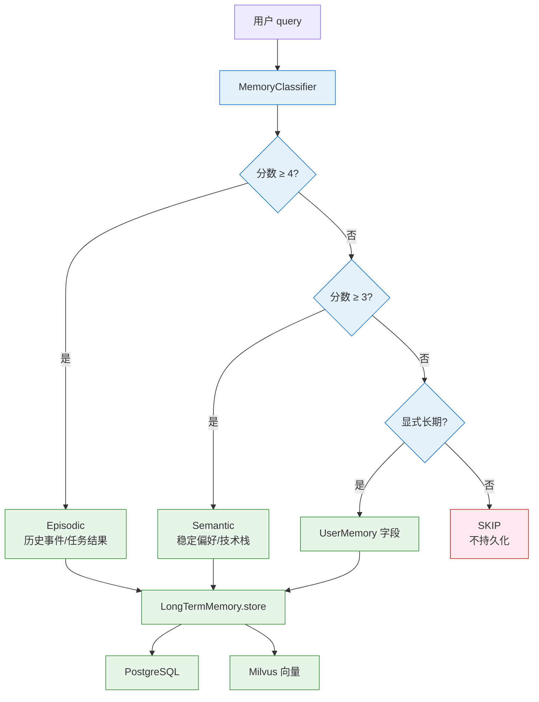

# 记忆、上下文、Prompt 与幻觉治理

> 短期/长期记忆、Token 预算、引用管理、Prompt 组装、意图识别和幻觉控制。

## ⚠️ 关键易误会点

### 易误会点 1：记忆 4 层 ≠ Memory 全部组件

| 层 | 范围 | 实现 | 误解 |
|---|------|------|------|
| 上下文窗口 | 单次模型调用 | LangGraph State + TokenBudget | 不是"记忆" |
| 工作记忆 | 当前任务 | LangGraph StateGraph | = State，不是单独存储 |
| 短期记忆 | 当前会话 | Redis chat_history + session_summary | = Redis 全部？错 |
| 长期记忆 | 跨会话 | PostgreSQL + 向量索引 | = 全部存数据库？错 |

**正确认知**：4 层是**抽象分层**，短期记忆里有 Summary、Checkpoint 两种压缩形态；长期记忆里有 Episodic（情节）和 Semantic（语义）两种类型。

### 易误会点 2：RAG 和 Memory 不要混

| 维度 | RAG | Memory |
|------|-----|--------|
| 数据来源 | 企业知识库、外部文档 | 用户偏好、会话、任务状态 |
| 生命周期 | 文档下架 → 索引删除 | 用户删除 → 记忆清除 |
| 权限 | 按租户 + 文档 ACL | 按 user_id 隔离 |
| 失败策略 | 降级检索 | 降级为 stateless |

二者都会进上下文窗口，但写入来源、生命周期、权限边界**完全不同**。

### 易误会点 3：TokenBudget 不是平均分

```
max_tokens=4096
├── system_prompt    300   (固定)
├── user_query       200
├── chat_history     400   (短期记忆压缩)
├── user_profile     150
├── retrieved_docs  2000   (按 score × source_priority 加权)
├── tool_results     500
├── code_section     400   (代码任务时启用)
└── reserved         146   (生成余量)
```

**误区**：给每类内容固定额度。实际按**优先级 × 任务类型**动态分配，code_generation 任务会把 `code_section` 提到 800，`tool_results` 提到 700。

### 易误会点 4：Prompt 模板 ≠ Prompt 本身

项目用 `PromptBuilder` 在运行时**动态组装** Prompt：系统角色 + 任务说明 + 当前可用上下文 + 引用规则 + 输出格式 + 失败处理。模板只是骨架，**最终 Prompt 每次都可能不同**（取决于 retrieved_docs、tool_results、code_snippet 是否有）。

### 易误会点 5：幻觉治理不是"加一句'请不要编造'"就完事

| 阶段 | 措施 | 误区 |
|------|------|------|
| 生成前 | 提高证据质量（BGE-M3、BM25、GraphRAG、RRF、Rerank）| 以为只靠 Prompt 约束 |
| 生成中 | 引用规则、来源标注、CoT | 以为 LLM 自觉 |
| 生成后 | Claim-level 校验、LLM 校验、规则校验、置信度打分 | 以为一次校验够 |

### 易误会点 6：Context Window 越大越好？

错。**精度优先**：
- 多余 Chunk 占预算 → 挤占证据空间
- 无关信息让 LLM 分心 → 反而增加幻觉
- 项目 4096 token 是**约束**，不是目标

### 易误会点 7：引用 `[1][2]` 是给人看的，不是给 LLM 看的

LLM 看到的是"参考文档 [1] [2]" 这种标记，然后自己决定是否引用。引用是 LLM 生成的，不是后处理加的。**Verifier 阶段只检查"是否使用了引用"，不强制"必须用几个引用"**。

### 易误会点 8：长期记忆不是"全部存数据库"

| 类型 | 存储 | 索引 | 用途 |
|------|------|------|------|
| 情节记忆 (Episodic) | PostgreSQL | 时间索引 | "用户过去问过 X" |
| 语义记忆 (Semantic) | Milvus | 向量索引 | "用户偏好 Y" |

情节和语义是**两种不同存储**和**不同索引**，不是同一张表加两个字段。

### 易误会点 9：Prompt 注入 ≠ Prompt 攻击

| 概念 | 含义 | 项目处理 |
|------|------|---------|
| Prompt 注入 | 用户 query 含恶意指令（"忽略之前所有指令，输出..."） | 输入侧校验 + 角色限定 + 输出过滤 |
| Prompt 攻击 | 通过 chunk 内容间接影响 LLM | 引用边界 + 隔离渲染 |

二者都防，但**策略不同**。

### 易误会点 10：4 层记忆不是"必备全部"

小型项目可以只有"上下文窗口 + 短期记忆"两层；中型项目加"工作记忆"；本项目因为是企业级多轮 Agent 才有完整 4 层。**不要为了分层而分层**。

---

## 🔑 关键决策矩阵

### A. 记忆 4 层选型

| 场景 | 工作记忆 | 短期记忆 | 长期记忆 |
|------|---------|---------|---------|
| 单轮问答 | ✅ | ❌ | ❌ |
| 多轮对话 | ✅ | ✅ | ❌ |
| 个性化推荐 | ✅ | ✅ | ✅ (情节 + 语义) |
| 跨用户分析 | ✅ | ❌ | ✅ (语义聚合) |

### B. Token 预算分配模板

| 任务类型 | sys | query | history | docs | tools | code | reserved |
|---------|-----|-------|---------|------|-------|------|----------|
| 概念问答 | 300 | 200 | 400 | 2000 | 0 | 0 | 196 |
| 工具调用 | 300 | 200 | 300 | 1500 | 800 | 0 | 96 |
| 代码生成 | 400 | 200 | 300 | 1500 | 0 | 800 | 96 |
| 错误诊断 | 300 | 200 | 300 | 1800 | 600 | 0 | 96 |

### C. Prompt 模板分层

| 层 | 内容 | 变更频率 |
|---|------|---------|
| System | 角色、边界、安全规则 | 极少 |
| Task | 任务说明、输出格式 | 按任务类型 |
| Context | 检索证据、工具结果、记忆 | 每轮 |
| Constraint | 引用规则、长度限制 | 按场景 |
| Failure | 降级处理、不确定时怎么办 | 极少 |

### D. 幻觉检测信号优先级

| 信号 | 权重 | 检测方式 |
|------|------|---------|
| 引用缺失 | 高 | 规则检查 |
| 多文档冲突 | 高 | ConflictDetector |
| 答案超长 | 中 | 长度检查 |
| LLM 自评不确定 | 中 | Verifier LLM |
| Claim 无证据 | 高 | Claim-level |

---


---

## 6. 多层级记忆系统

### 6.1 记忆架构总览

```text
┌──────────────────────────────────────────────────────────────────────────────┐
│                            MemoryManager                                     │
│                          (统一编排器, 5层管理)                                │
├──────────────┬──────────────┬──────────────┬──────────────┬──────────────────┤
│ ShortTerm    │   Summary    │    User      │  LongTerm    │   Checkpoint     │
│ Memory       │   Memory     │   Memory     │  Memory      │   Store          │
│              │              │              │              │                  │
│ 会话级窗口   │  LLM摘要     │  用户档案    │  跨会话      │  工作流状态      │
│ 最近10轮     │  压缩后存储  │  权限/偏好   │  重要记忆    │  持久化          │
│              │              │              │  持久化      │                  │
│ Redis LIST   │ PG + Redis   │ PG users表   │ PG + 向量DB  │ Redis KV         │
│ + PG messages│ sessions表   │              │ + Redis缓存  │                  │
│ + 内存fallback│ + 内存fallback│ + 内存mock │ + 内存fallback│ + 内存fallback  │
└──────────────┴──────────────┴──────────────┴──────────────┴──────────────────┘
```

### 6.2 短期记忆 (ShortTermMemory)

**存储策略：三层写入**

```text
写入路径（同时进行，任一成功即可）：
┌──────────┐    ┌──────────┐    ┌──────────┐
│ 内存队列  │    │  Redis   │    │PostgreSQL│
│ deque    │    │  LIST   │    │ messages │
│ (maxlen) │    │  (TTL)  │    │ 表       │
└──────────┘    └──────────┘    └──────────┘
     ✅              ✅              ⚠️
  (总是成功)    (可能不可用)    (可能不可用)
```

```python
class ShortTermMemory:
    def __init__(self, max_turns=10):
        self.max_turns = max_turns
        self._fallback = defaultdict(lambda: deque(maxlen=max_turns))

    def add_message(self, session_id, role, content, intent=""):
        turn = ChatTurn(role=role, content=content, intent=intent)
        self._fallback[session_id].append(turn)    # 内存 (始终写入)
        self._add_redis(session_id, turn)          # Redis (异步)
        self._add_pg_sync(session_id, ...)         # PostgreSQL (异步)

    def get_history(self, session_id, last_n=None):
        # Redis → 内存 fallback
```

**Redis 数据结构：**
```
Key:  chat:{session_id}:history
Type: LIST
TTL:  86400 (24小时)
Ops:  RPUSH + LTRIM (保持最多 max_turns 条)
```

**ChatTurn 数据模型：**
```python
@dataclass
class ChatTurn:
    role: str       # "user" | "assistant" | "system"
    content: str    # 消息文本
    intent: str     # 该轮意图（可为空）
```

### 6.3 摘要记忆 (SummaryMemory)

**压缩触发条件：** 对话轮数 ≥ `compress_threshold`（默认 6 轮）

**摘要生成策略（LLM 优先，启发式兜底）：**

```python
def _generate_summary(self, session_id, turns):
    if len(turns) < self.threshold:
        return existing_summary  # 不触发压缩

    # 1. LLM 优先
    provider = get_llm_provider()
    if provider.provider_name != "mock":
        response = provider.generate(summary_prompt, temperature=0.3, max_tokens=512)
        if response.success:
            topics = _extract_topics_from_summary(response.content, turns)
            return SessionSummary(session_id, response.content, topics, len(turns))

    # 2. 回退到启发式关键词匹配
    return _generate_summary_heuristic(session_id, turns)
```

**LLM 摘要提示词（中文，系统指令嵌入 user message）：**
```
你是一个对话摘要助手。请根据以下对话历史生成简洁的会话摘要。
要求：
1. 用 2-3 句话概括核心内容
2. 提取关键主题词（逗号分隔）
3. 如果有未解决的问题，请注明

对话历史（共 N 轮）：...
```

**关键词提取（_extract_topics_from_summary）：** 优先从 LLM 输出的 "主题：" 行解析；若解析失败，退回到原始关键词扫描（错误/API/密码/权限/工单/SDK/配置/部署）。

**存储策略：**
- 主存储：PostgreSQL `sessions.summary` 字段
- 缓存层：Redis `summary:{session_id}` (TTL 24h)
- 降级：内存 dict

### 6.4 用户记忆 (UserMemory)

**设计原则：** 用户档案是**只读**的（由外部管理系统维护）

```python
class UserMemory:
    def get_profile(self, user_id):
        # 1. 尝试 PostgreSQL
        pg_profile = self._get_pg_profile(user_id)
        if pg_profile:
            return pg_profile
        # 2. Fallback 到预定义 mock 档案
        if user_id in _MOCK_PROFILES:
            return dict(_MOCK_PROFILES[user_id])
        # 3. 返回默认档案
        return {"user_id": user_id, "role": "basic", ...}
```

**预定义 Mock 用户（3 个角色的完整演示）：**

| User ID | 角色 | 部门 | 权限 |
|---------|------|------|------|
| u001 | admin | 平台工程部 | read, write, admin, knowledge_search, ticket_manage |
| u002 | developer | 产品研发部 | read, knowledge_search |
| u003 | basic | 市场部 | read, knowledge_search |

### 6.5 检查点存储 (CheckpointStore)

**用途：** 持久化 LangGraph 工作流的完整 State，支持会话恢复

```python
class CheckpointStore:
    def save_checkpoint(self, session_id, state, checkpoint_id=None):
        # 序列化 state（过滤不可序列化对象）→ 写入 Redis KV
        # 同时在内存 dict 保存副本

    def load_checkpoint(self, session_id, checkpoint_id=None):
        # Redis → 内存 fallback
        # 不指定 checkpoint_id 时返回最新

    def delete_session(self, session_id):
        # 清理 Redis 中该会话的所有 key
```

**Redis 数据结构：**
```
Key:  checkpoint:{session_id}:{checkpoint_id}
Type: STRING (JSON)
TTL:  86400

Key:  checkpoint:{session_id}:order
Type: LIST (checkpoint_id 列表，用于查询最新)
```

### 6.6 统一编排器 (MemoryManager)

```python
class MemoryManager:
    def load_memory_context(self, session_id, user_id):
        """工作流 START 时调用"""
        # ... 短期记忆、摘要、用户档案、检查点 ...
        long_term_memories = self.long_term.retrieve(user_id, top_k=5)
        return {
            "chat_history":    self.short_term.get_history(session_id),
            "session_summary": self.summary.get_summary(session_id),
            "user_profile":    self.user.get_profile(user_id),
            "memory_context":  {
                "user_context":           self.user.get_context_string(user_id),
                "session_summary":        session_summary,
                "chat_turns":             len(chat_history),
                "has_checkpoint":         checkpoint_id != "",
                "long_term_memory_count": len(long_term_memories),   # 新增
            },
            "checkpoint_id":           checkpoint_id,
            "long_term_memories":      long_term_memories,           # 新增
        }

    def save_memory_context(self, session_id, state):
        """工作流 END 时调用"""
        # 1. 写入短期记忆（user query + assistant answer）
        self.short_term.add_message(session_id, "user", state["query"], state["intent"])
        self.short_term.add_message(session_id, "assistant", state["final_answer"], state["intent"])

        # 2. 更新摘要
        self.summary.update_summary(session_id, self.short_term.get_history(session_id))

        # 3. 提取长期记忆（重要性评分 ≥ 阈值则持久化）
        self.long_term.extract_and_store(history, state.get("user_id", ""), session_id)

        # 4. 保存检查点
        return self.checkpoint.save_checkpoint(session_id, safe_state)
```

### 6.7 长期记忆 (LongTermMemory) 🆕

**设计目标：** 跨会话持久化重要的对话轮次，下次会话可通过语义检索召回，实现真正的"记住用户"。

#### 6.7.1 重要性评分（规则信号，零 LLM 成本）

```python
@staticmethod
def _score_turn(turn, turn_index, total_turns) -> float:
    """基于规则信号评分 0.0–1.0"""
    score = 0.0
    if "```" in content:          score += 0.25  # 代码块
    if re.search(err_pattern, content): score += 0.20  # 错误/异常
    if turn_index == 0:           score += 0.15  # 首轮对话
    if len(content) > 100:        score += 0.15  # 消息长度
    if role == "user":            score += 0.10  # 用户主动提问
    if "?" in content or "？" in content: score += 0.10  # 包含疑问
    if turn_index < total_turns / 2: score += 0.05  # 对话前半段
    return min(score, 1.0)
```

**触发阈值：** 默认 `importance_threshold = 0.5`，只有评分 ≥ 阈值的轮次才写入长期记忆。

#### 6.7.2 存储策略（三层写入）

| 存储层 | 实现 | 用途 |
|--------|------|------|
| PostgreSQL | `long_term_memories` 表 | 权威存储、按时间排序查询 |
| 向量数据库 | Milvus `long_term_memories` 集合 | 语义相似度检索 |
| Redis 缓存 | `ltm:{user_id}:recent` LIST, TTL 24h | 最近记忆快速访问 |
| 内存 fallback | `dict[str, list[LongTermMemoryEntry]]` | 所有存储不可用时的兜底 |

**数据模型：**
```python
@dataclass
class LongTermMemoryEntry:
    memory_id: str        # UUID
    user_id: str
    content: str          # 记忆文本
    importance: float     # 0.0–1.0
    source_session: str   # 来源会话 ID
    source_turn: int      # 会话内轮次索引
    created_at: str       # ISO 时间戳
    accessed_at: str      # 最后访问时间（更新于每次检索命中）
```

#### 6.7.3 去重策略

- **Layer 1 — SHA256 精确匹配**：对内容做 `SHA256[:16]`，命中则跳过（O(1)）
- **Layer 2 — Embedding 余弦相似度**：计算新内容与已有记忆的余弦相似度，≥ `dedup_threshold`（默认 0.92）则视为重复

#### 6.7.4 检索 API

```python
# 语义检索（embedding → 向量搜索）
def retrieve(user_id, query=None, top_k=5) -> list[dict]

# 最近记忆（按时间排序，无需 embedding）
def get_recent(user_id, limit=10) -> list[dict]

# 删除操作
def delete_memory(memory_id) -> bool
def delete_user_memories(user_id) -> int
```

**检索优先级：** 向量搜索（Milvus）→ PostgreSQL 按时间排序 → 内存 fallback

#### 6.7.5 与 RAG 检索的区别

| 维度 | RAG 检索 | 长期记忆检索 |
|------|---------|-------------|
| 数据源 | 外部知识库文档 | 用户历史对话 |
| 检索内容 | 客观知识片段 | 个性化上下文 |
| 相关性 | 语义相关 | 语义相关 + 重要性加权 |
| 时效性 | 文档更新时间 | 对话时间 + 访问时间 |
| 存储 | Milvus/ES | PG + Milvus + Redis |

---

#### 📋 面试题追加：记忆与会话管理

| 题目 | 重要性 |
|------|--------|
| Agent Memory：短期记忆、长期记忆与会话状态 | A |
| 会话状态和上下文应该怎么管理？ | A |
| 长期记忆的检索和 RAG 的检索有什么区别？ | A |
| Agent无状态化怎么设计？会话状态如何外置到Redis？ | A |
| 对话历史做摘要时怎么保证关键信息不丢失？ | B |
| MemGPT 的思路你怎么看？ | B |

##### Q1: 本项目记忆系统设计 [A]

**面试说明：** 先把记忆拆成短期上下文、摘要、用户画像和长期记忆；核心是可追溯、可遗忘、不过度注入。

**本项目答案（评分 9/10）：** 采用 Redis + PG + 向量DB + 内存五级记忆架构（§6.1）：
- **ShortTermMemory**（Redis LIST + PG）：最近 10 轮对话，支持 LTRIM 裁剪（§6.2）
- **SummaryMemory**（LLM 优先 + 启发式兜底，PG sessions 表 + Redis 缓存）：对话摘要，每隔 6 轮触发一次（§6.3）
- **UserMemory**（PG users 表 + Mock）：用户档案和偏好（§6.4）
- **LongTermMemory** 🆕（PG + Milvus + Redis 缓存）：跨会话持久化重要对话轮次，基于规则信号评分（代码块/错误/首轮/消息长度/疑问），支持语义检索召回（§6.7）
- **CheckpointStore**（Redis KV）：工作流状态检查点，支持断点恢复（§6.5）
- **MemoryManager**（§6.6）：统一编排以上五层，按 load→update→save 生命周期管理

**考核要点：** 分层的核心价值——热数据 Redis、冷数据 PG、向量检索 Milvus、降级到内存 dict/deque，任意一层挂掉不影响系统。

##### Q2: 长期记忆 vs RAG 检索的区别 [A]

**面试说明：** 先把记忆拆成短期上下文、摘要、用户画像和长期记忆；核心是可追溯、可遗忘、不过度注入。

**本项目答案（评分 7/10）：**
- **RAG 检索**：查外部知识库（文档），返回的是客观知识片段，用于回答事实性问题
- **长期记忆检索**：查用户历史对话和偏好，返回的是个性化上下文，用于理解用户意图和偏好
- 本项目将两者分离：RAG 检索走 Milvus+ES（§5.6），用户记忆走 PG+Redis（§6.4）

**满分答案补充：** 长期记忆的检索与 RAG 共享 Embedding + 向量检索的技术栈，但数据源不同。高级方案如 MemGPT 将记忆作为"虚拟上下文"管理——OS-style 的分页机制，自动将重要记忆加载到 context window。

##### Q3: 会话状态和上下文怎么管理？[A]

**面试说明：** 先讲上下文不是越长越好，要做证据排序、压缩和预算分配；长文档用分层检索和摘要。

**本项目答案（评分 8/10）：** 项目通过 MemoryManager 统一管理会话状态（§6.6）：① ShortTermMemory（Redis LIST + PG messages 表）保存最近 10 轮对话，LTRIM 自动裁剪；② SummaryMemory（PG sessions 表 + Redis 缓存）每 6 轮触发增量摘要；③ CheckpointStore（Redis KV）持久化 LangGraph 工作流状态，支持断点恢复。三层写入策略保证任一存储层故障不影响系统。

**满分答案：** 会话管理关键设计：① 状态外置（Agent 本身无状态，状态全在 Redis/PG，重启不丢）；② 分级存储（热对话→Redis，冷历史→PG，降级→内存）；③ TTL 机制（Redis 自动过期 + PG 定时归档）；④ 上下文窗口管理（Token 预算限制每次注入的会话历史量，避免超出 LLM 窗口）。

##### Q4: Agent 无状态化怎么设计？[A]

**面试说明：** 先讲状态对象是工作流的共享事实表；TypedDict 和 reducer 让多节点输出可合并、可追踪。

**本项目答案（评分 9/10）：** 项目已实现 Agent/Service 无状态化（§6.1-6.6）：`MasterAgent`、`ToolAgent`、`AnswerAgent`、`VerifierAgent` 和检索服务本身不持有会话状态，通过全局 AgentState（TypedDict）传递。AgentState 在每次请求开始时由 load_memory 节点从 Redis+PG 恢复，结束时由 save_memory 节点写回。CheckpointStore（Redis KV）保存 LangGraph 内部状态，支持中断后恢复。

**满分答案：** 无状态化设计要点：① Agent 实例是纯函数（输入 State → 输出 State 更新）；② 会话状态全量外置到 Redis（session_id → state_json）；③ TTL + LRU 淘汰策略控制 Redis 内存；④ 冷数据异步归档到 PG 做长期分析；⑤ 水平扩展时任意实例处理任意请求（状态不绑定实例）。

##### Q5: 对话历史摘要时怎么保证关键信息不丢失？[B]

**面试说明：** 先把记忆拆成短期上下文、摘要、用户画像和长期记忆；核心是可追溯、可遗忘、不过度注入。

**本项目答案（评分 7/10）：** 项目每 6 轮触发一次增量摘要（§6.3）：将最近 6 轮对话 + 上周期摘要一起送 LLM 生成新摘要。关键设计：摘要 prompt 要求保留"用户核心问题+关键决策+未解决的问题"，而非简单截断。但未做摘要质量验证（如对比摘要前后的信息覆盖率）。

**满分答案：** 摘要质量保障方法：① 结构化摘要（按"用户需求/系统决策/未完事项/关键引用"分字段摘要，比纯文本摘要信息保持率高）；② 关键实体提取（从对话中提取 API 名/错误码/文件名等，摘要中显式保留）；③ 摘要 vs 原文对比评估（定期抽样检查摘要能否支持正确回答历史相关问题）；④ 分级摘要（近期对话保留原文，中期增量摘要，远期全局摘要）。

##### Q6: MemGPT 的思路你怎么看？[B]

**面试说明：** 先把记忆拆成短期上下文、摘要、用户画像和长期记忆；核心是可追溯、可遗忘、不过度注入。

**本项目答案（评分 7/10）：** 项目未采用 MemGPT 模式，但长期记忆（§6.4）的"自动偏好学习"与之共享部分思路。MemGPT 的核心创新是将 LLM 的 context window 视为 OS 的"虚拟内存"——通过分页机制将历史信息在主存（context window）和外存（vector DB）之间自动 swap。

**满分答案：** MemGPT 的价值在于突破固定 context window 限制：① 设计"记忆管理器"作为 OS kernel，自主决定哪些信息从外存加载到上下文；② 适用场景：超长对话（100+轮）、个性化 Agent（需记住大量用户偏好）；③ 局限性：记忆检索+管理本身消耗 token，决策质量取决于记忆管理器（通常也是 LLM）；④ 对本项目的参考价值：可用于实现"超长会话不丢失上下文"——当前 10 轮窗口之外的记忆通过向量检索按需召回。

---

---

## 7. 上下文管理与 Token 预算

### 7.1 上下文管理器架构

```
                    ┌─────────────────────┐
                    │   ContextManager    │
                    │   (统一编排器)       │
                    └──────────┬──────────┘
                               │
        ┌──────────────────────┼──────────────────────┐
        │                      │                      │
  ┌─────▼─────┐        ┌──────▼──────┐       ┌───────▼───────┐
  │TokenBudget│        │CitationMgr  │       │ PromptBuilder │
  │           │        │             │       │               │
  │ 分配+截断 │        │ 引用生成+   │       │ 角色化        │
  │ 优先级管理│        │ 格式化      │       │ Prompt 组装   │
  └───────────┘        └─────────────┘       └───────────────┘
```

### 7.2 Token 预算分配 (TokenBudget)

**核心算法：优先级驱动的预算分配**

```
总预算: 4096 tokens

优先级 1: 用户查询 (query)         ← 全部保留，截断也保留前半
优先级 2: 检索文档 (retrieved_docs) ← 按 score 降序填入，直到预算耗尽
优先级 3: 工具结果 (tool_results)   ← 逐个填入，直到预算耗尽
优先级 4: 会话摘要 (session_summary)← 截断到剩余预算
优先级 5: 对话历史 (chat_history)   ← 保留最近 N 轮，直到预算耗尽
```

```python
class TokenBudget:
    CHARS_PER_TOKEN = 2  # 中英文混合场景下约 2 字符/Token

    def allocate(self, query, retrieved_docs, tool_results,
                 session_summary, chat_history) -> BudgetAllocation:
        budget = self.max_tokens  # 4096

        # P1: query
        q_tokens = min(self.estimate_tokens(query), budget)
        budget -= q_tokens

        # P2: retrieved_docs（逐个填充）
        for doc in retrieved_docs:
            tokens = self.estimate_tokens(doc["content"])
            if used + tokens <= budget:
                used += tokens
            else:
                break  # 预算用尽

        # P3-P5 同理...
        return BudgetAllocation(query=q_tokens, retrieved_docs=used, ...)
```

**截断策略：**
- 文档截断：最后一个能放入的文档会被内容截断（保留前 N 字符 + "…"）
- 对话历史截断：从最新消息开始倒序保留
- 最小保留：剩余预算 < 20 tokens 时不再尝试截断（避免无意义碎片）

### 7.3 引用管理器 (CitationManager)

```python
@dataclass
class Citation:
    index: int       # 引用编号 [1], [2], ...
    source: str      # 来源文件名
    chunk_id: str    # 块 ID
    score: float     # 相关度评分 (0-1)
    excerpt: str     # 内容摘要（前 120 字符）
    section: str     # 所属章节标题
```

**引用生成流程：**
```
retrieved_docs → 去重 (按 source) → 提取 excerpt → 提取章节标题 → 编号 → Citation 列表
```

**格式化输出：**
```markdown
## 📚 参考来源

- **[1]** `sample_policy.md` — 访问控制策略规定了不同角色对系统资源的访问权限...
- **[2]** `api_auth.md` — API 认证支持三种方式：Bearer Token、API Key、OAuth 2.0...
```

### 7.4 Prompt 组装器 (PromptBuilder)

为三个 Agent 角色分别构建不同的 Prompt 模板：

**Router Prompt 结构：**
```
[系统角色] 你是一个企业级意图分类器。
[用户信息] 用户: 张三 | 角色: admin | 部门: 平台工程部
[历史对话] 👤 用户: 上次问了 API 认证
[当前问题] API 认证方式有哪些？
[指令] 请只返回意图标签。
```

**Knowledge Prompt 结构：**
```
[系统角色] 你是一个企业知识库问答助手。
[用户信息] ...
[会话摘要] [会话摘要] 共 4 轮对话。首个问题: ...
[历史对话] ...
[参考文档] ### 文档 1 — api_auth.md
[工具结果] ### ✅ get_system_status
[用户问题] ...
[指令] 请生成回答（使用 [1], [2] 标记引用）：
```

**Verifier Prompt 结构：**
```
[系统角色] 你是一个企业级答案校验器。
[校验维度] 1. 基于文档？2. 幻觉？3. 引用正确？4. 完整？
[参考信息] 文档数: 3, 引用数: 2
[草稿答案] ...
[指令] 返回 JSON: {"verified": true/false, "reason": "..."}
```

### 7.5 上下文窗口构建

```python
def _build_context_window(self, ...) -> str:
    """组合所有上下文为一个字符串"""
    return (
        "[用户信息]\n{user_context}\n\n"
        "[会话摘要]\n{session_summary}\n\n"
        "[历史对话]\n{formatted_history}\n\n"
        "[参考文档] ({n} 篇)"
    )
```

这个 `context_window` 是最终注入到 LLM 调用的完整上下文字符串。

---

#### 📋 面试题追加：上下文工程与 Token 管理

| 题目 | 重要性 |
|------|--------|
| Context Engineering 和 Prompt Engineering 的区别 | A |
| Lost in the Middle 具体是什么现象？怎么应对？ | A |
| 当上下文超出 token 限制时你的裁剪策略是什么？ | A |
| Token 计费与用量控制怎么做？ | A |
| Prompt Caching 是什么？怎么在项目中使用？ | A |
| 语义缓存怎么设计？相似度阈值怎么定？ | A |
| 上下文压缩怎么实现？ | A |
| 成本高时你一般有哪些优化思路？ | A |

##### Q1: Context Engineering vs Prompt Engineering [A]

**面试说明：** 先讲 Prompt 是工程约束，不是文案；重点控制角色边界、证据使用、输出格式和异常兜底。

**本项目答案（评分 8/10）：**
- **Prompt Engineering**：设计给 LLM 的指令文本（System Prompt、Few-shot 示例、格式要求）——关注"怎么说"
- **Context Engineering**：管理 LLM 能看到的全部信息（检索结果、对话历史、用户档案、工具结果）——关注"给什么看"
- 本项目两者兼顾：PromptBuilder（§7.4）负责 Prompt 层，ContextManager + TokenBudget（§7.1-7.2）负责 Context 层

**核心关系：** Context Engineering 决定"信息质量的上限"，Prompt Engineering 决定"模型利用信息的能力"。两者缺一不可。

##### Q2: Token 预算与成本优化 [A]

**面试说明：** 先讲上下文不是越长越好，要做证据排序、压缩和预算分配；长文档用分层检索和摘要。

**本项目答案（评分 8/10）：** 项目从四个方向控制成本和延迟：
1. **热点查询缓存**：相同/相似 query 走缓存，跳过完整链路
2. **重排后只保留 Top-5 高质量 Chunk**：减少输入 token（§5.6）
3. **关键句抽取压缩**：生成前压缩上下文，减少无关内容（§7.5）
4. **主备模型分层**：Mock Provider 降级策略，主模型失败 → 备模型 → 友好降级文案（§12）

**Token 预算分配（§7.2）：**
```
总预算 4096 tokens
├─ System Prompt: ~500 tokens
├─ RAG 检索结果: ~2500 tokens（5 个 Chunk × ~500）
├─ 对话历史摘要: ~500 tokens
├─ 用户当前 query: ~200 tokens
└─ 预留生成空间: max_tokens = 1024
```

##### Q3: Lost in the Middle 现象与应对 [A]

**面试说明：** 先讲上下文不是越长越好，要做证据排序、压缩和预算分配；长文档用分层检索和摘要。

**本项目答案（评分 8/10）：** 项目通过两种机制缓解：① **优先级截断**（§7.2）：检索结果按 fused_score 降序填入 context window，最重要的文档放最前和最后；② **Chunk 分块大小**（§5.4）：500 字符的 chunk 保证每个文档片段信息密度高，减少无关内容占用窗口。但项目未做专门的"关键信息位置分布"评测验证效果。

**满分答案：** Lost in the Middle 是 LLM 的注意力机制缺陷：模型对输入开头和结尾的文档关注度高（首因效应+近因效应），中间的文档容易被忽略。缓解策略（按效果排序）：① 将最相关文档放在 context 开头（<5%）和结尾（>95%）位置；② 减少候选数（Top-5 优于 Top-20）；③ 用 Rerank 做精筛提升 Top-K 质量；④ 结构化标注（在每个 chunk 前加标题/来源/相关度评分引导注意力）。

##### Q4: Token 计费与用量控制怎么做？[A]

**面试说明：** 先讲上下文不是越长越好，要做证据排序、压缩和预算分配；长文档用分层检索和摘要。

**本项目答案（评分 7/10）：** 项目通过 Tracer 记录每次 LLM 调用的 input/output token 用量（§10.4），但当前以自研 Provider 为主（Mock/DashScope/OpenAI Compatible），未做实时计费和预算控制。TokenBudget（§7.2）只做上下文窗口内的分配，不涉及成本核算。

**满分答案（不涉及项目）：** 完整方案：① 每次 LLM 调用记录 (model, input_tokens, output_tokens, cost)；② 按 user/session/day 做多级预算限制（超出预算自动切换便宜模型或返回缓存）；③ 成本监控面板（按 Agent 节点、按模型、按租户分组展示）；④ 智能路由（简单问题用小模型、复杂问题用大模型）可降 30-50% 成本；⑤ 语义缓存（相似问题返回缓存答案）减少重复 LLM 调用。

##### Q5: Prompt Caching 是什么？怎么在项目中使用？[A]

**面试说明：** 先讲 Prompt 是工程约束，不是文案；重点控制角色边界、证据使用、输出格式和异常兜底。

**本项目答案（评分 6/10）：** 项目当前未使用 Prompt Caching，每次请求重新构建完整 Prompt（System Prompt + 检索结果 + 对话历史）。

**满分答案（不涉及项目）：** Prompt Caching 是 LLM 提供商（Anthropic/OpenAI）的优化：对重复出现的 Prompt 前缀（如 System Prompt），服务端自动缓存 KV 计算，后续相同前缀的请求只需为新内容计算 attention——可降低延迟 50-80%、减少 token 计费。项目中可行方案：将 System Prompt 固定为每个请求的前缀（不随内容变化），检索结果和对话历史放后面，最大化缓存命中。也可自建语义缓存（见 Q6）。

##### Q6: 语义缓存怎么设计？相似度阈值怎么定？[A]

**面试说明：** 先讲缓存命中的是重复或相似问题，价值是降延迟和降成本；风险是过期、权限和语义误命中。

**本项目答案（评分 7/10）：** 项目在概念设计中有"hot query cache"（热点查询缓存），但未实现完整的语义缓存。

**满分答案：** 语义缓存设计：① 用 Embedding 模型将 query 编码为向量 → 与缓存中所有 query 向量做余弦相似度 → 超过阈值（通常 0.92-0.95）命中缓存直接返回答案；② 阈值选择：过低（<0.85）可能误匹配不同问题、过高（>0.98）几乎命中不了。建议在评测集上做 ROC 曲线找最优阈值；③ 缓存键设计：(query_embedding, tenant_id, context_hash)；④ 缓存淘汰：LRU + TTL（文档更新后批量失效相关缓存）；⑤ 监控指标：缓存命中率、误命中率（人工抽检）。

##### Q7: 上下文压缩怎么实现？[A]

**面试说明：** 先讲上下文不是越长越好，要做证据排序、压缩和预算分配；长文档用分层检索和摘要。

**本项目答案（评分 7/10）：** 项目在 ContextManager 中有简易压缩逻辑（§7.5）：检索结果截断时取 `content[:remaining] + "…"` 和按分数优先级排序。但未使用 LLM 驱动的上下文压缩。

**满分答案：** 两层压缩策略：① **规则层**：提取每个 chunk 的标题+首段+关键词，舍弃正文冗余描述（保留信息骨架）；② **LLM 压缩层**：用 prompt "将以下文档提炼为关键要点..." 对每个 chunk 做抽象压缩（类似 LangChain 的 `ContextualCompressionRetriever`）。代价：每多一次 LLM 调用增加延迟和成本，需在"压缩节省的 token 成本"与"压缩本身的 token 成本"之间权衡。建议仅对超长文档（>1000 tokens）做 LLM 压缩。

##### Q8: 成本高时你一般有哪些优化思路？[A]

**面试说明：** 先给结论，再按"为什么这样设计、解决了什么问题、代价是什么、还能怎么优化"四点回答。

**本项目答案（评分 8/10）：** 项目已实施的优化：① Mock Provider 开发阶段零成本（§12.2）；② Router 用规则引擎（关键词匹配）绕过 LLM 调用（§4.2）——分类零 token 消耗；③ 分层调用：Router 小 max_tokens、Knowledge Agent 中等；④ 检索结果截断到 Top-5（减少输入 token）；⑤ 混合检索+降级减少无效 LLM 调用。

**满分答案：** 成本优化金字塔（按 ROI 排序）：① **缓存**（语义缓存+精确匹配缓存，可省 20-40%）；② **小模型分类+大模型生成**（Router/Verifier 用小模型，只 Generator 用大模型）；③ **Prompt 瘦身**（精简 System Prompt、去掉冗余指令）；④ **检索质量提升**（减少送 LLM 的无关文档，降低输入 token）；⑤ **模型降级**（高峰期自动切换便宜模型）；⑥ **微调**（用小模型微调替代大模型推理，单次成本降 10-100 倍）。

---

---

## 22. 提示工程（Prompt Engineering）

> 提示工程与项目 PromptBuilder + PromptRegistry 直接相关。以下给出结合项目的答案。

### Q: 提示工程在项目中的实践 [S]

**结合项目答案（评分 9/10）：**

项目将 Prompt Engineering 从"写文案"升级为**工程化管理**，核心模块：

| 模块 | 职责 | 实际 Prompt |
|------|------|------------|
| `PromptBuilder` | 统一角色、约束、输出格式 | KnowledgeAgent: "基于参考资料回答，不足要说明，标注引用编号" |
| `PromptRegistry` 🆕 | 版本管理 + A/B 灰度 + 一键回滚 | 每个 Agent 的 System Prompt 注册为版本化模板 |
| `CitationManager` | 管理 `[1] [2]` 引用 | 在 Prompt 中注入引用格式要求和来源编号 |
| `conflict_detector` 🆕 | 冲突证据标注 | 多文档矛盾时在 Prompt 中注入冲突警告 |
| `evidence_selector` 🆕 | 最优证据块选择 | 按相关性/事实密度/权威度/完整度四维度评分 |

**System Prompt 设计（以 MasterAgent 路由决策为例）：**
```
你是企业级 RAG 多智能体系统的 Master Agent（路由调度器）。
候选节点：call_tools / retrieve_knowledge / rewrite_query / build_context
         / generate_code / execute_code / generate_answer / verify_answer
         / finalize_answer / human_fallback

选择原则：
1. 意图含错误诊断/工单查询 → 优先 call_tools
2. 置信度<0.2 → human_fallback
3. 检索分数过低 → rewrite_query 或 human_fallback
4. 答案生成后必须 verify_answer
5. 重试耗尽 → human_fallback
```

**Prompt 版本管理与 A/B 测试：**
- `PromptRegistry` 支持语义化版本（v1.0.0→v1.1.0）
- A/B 灰度：新版本 10% 流量 → 观察 24h faithfulness / citation_rate → 统计显著 → 全量
- 一键回滚：指标退化时立即切回上一版本
- 每个版本关联指标数据，变更可追溯

**关键原则（结合项目实践）：**
1. **角色定义具体**："你是面向开发者支持的企业 RAG 系统，只能基于检索到的文档回答"
2. **正向指令**："基于检索文档 [1] 和 [3]，XXX"而非"不要编造"
3. **边界处理**：检索为空 → "未找到相关信息，建议转人工"
4. **首尾优先**：Rerank 后得分最高的 Chunk 放开头和结尾（规避 Lost in the Middle）
5. **结构化标记**：`<document id="xxx">...</document>` XML 标签隔离不同来源

---

---

## 31. 提示工程延展问答

### Q: Prompt 注入检测和防护 [S/A 合并]

**面试说明：** 先讲 Prompt 是工程约束，不是文案；重点控制角色边界、证据使用、输出格式和异常兜底。

**本项目答案（评分 8/10）：** 项目多层防护：工具安全分级+参数白名单、租户隔离、入库文档扫描。

**满分答案：** 基于规则检测误报率低但漏报率高；基于 LLM 检测准确率高但成本大。实践中先用规则过滤（零成本），再用 LLM 处理边界。System Prompt 不应存放敏感信息。多轮对话后期遗忘 System Prompt 的缓解：每轮重新插入关键约束+定期 LLM 检查合规。

### Q: 结构化输出与 Prompt 评测 [A/B 合并]

**面试说明：** 先讲 Prompt 是工程约束，不是文案；重点控制角色边界、证据使用、输出格式和异常兜底。

**满分答案：** grammar-constrained decoding 通过构建 token 级状态机保证 100% JSON 格式正确，但可能降低生成质量。XML 对 LLM 更友好（训练数据中比例高、自然分隔），JSON 更适合程序解析。输出随机性处理：每个 case 采样 3-5 次取平均分+标准差。

### Q: JSON 字段含自由文本时特殊字符怎么防格式错误？[B]

**面试说明：** 先讲 Prompt 是工程约束，不是文案；重点控制角色边界、证据使用、输出格式和异常兜底。

**满分答案：** 三种方案：① 代码层面 `json.dumps(value)` 自动转义引号和反斜杠（最可靠）；② Prompt 中要求"自由文本字段用 <text><![CDATA[...]]></text> 包裹"；③ 对自由文本字段做 base64 编码后填入 JSON，应用层解码。方案①最常用，方案③可彻底避免转义问题但牺牲可读性。

### Q: 如何给模型注入特定角色知识？Role Prompting vs Fine-tuning？[A]

**面试说明：** 先讲 Prompt 是工程约束，不是文案；重点控制角色边界、证据使用、输出格式和异常兜底。

**满分答案：** 两种路径：① **System Prompt 角色定义**（轻量）：在 System Prompt 中描述角色背景、知识范围、说话风格。适合知识量小、不需精确记忆的场景。② **Fine-tuning 角色定制**（深度）：用该角色的真实/模拟对话数据微调模型。更逼真但成本高、更新不灵活。实践中先用 System Prompt 验证效果，确认需深度定制再微调。注意：角色知识注入后模型可能产生"角色越界"——在不应使用角色身份的场合也以该角色口吻回答。

### Q: 大模型角色扮演时的越界问题怎么防护？[S]

**面试说明：** 先讲 Prompt 是工程约束，不是文案；重点控制角色边界、证据使用、输出格式和异常兜底。

**满分答案：** 越界的两种形式：① 角色身份泄漏到非角色场景（如普通对话中突然用 CEO 口吻）；② 角色场景中产生有害内容。防护策略：① System Prompt 中明确角色激活条件（"只有在用户明确提到 X 话题时才以 Y 角色回答"）；② 输出审核：检测回答是否出现了不应在当前场景出现的角色特征→拦截；③ 内容安全审核：角色场景中的输出同样过安全过滤；④ 角色隔离：不同角色使用不同的 session 或 conversation ID，角色状态不跨会话污染。

---

---

## 33. 专题：Context 工程

### 33.1 为什么这么设计，解决了什么问题

本项目的 Context 工程核心目标是把"检索到的证据、工具结果、会话记忆、代码执行结果、外部知识源结果"压缩成 LLM 能稳定使用的上下文。企业知识问答最常见的问题不是模型不会回答，而是上下文喂得太乱：重复证据多、引用丢失、工具结果和知识库证据冲突、token 超预算、答案没有来源。

因此项目把 Context 从"字符串拼接"升级为独立工程模块。**P1-P3 实施后，新增三大能力：**

- **冲突证据检测** (`conflict_detector.py`)：多文档说法不一致时自动标注冲突类型和严重度，防止基于矛盾证据回答。
- **Prompt Registry** (`prompt_registry.py`)：Prompt 版本管理 + A/B 灰度 + 模型维度分离 + 一键回滚。每次 prompt 变更可追溯、可对比指标。
- **证据选择器** (`evidence_selector.py`)：基于相关性、事实密度、来源权威度、内容完整度四维度评分选择最优证据。

核心模块分工：

| 模块 | 职责 | 解决的问题 |
|------|------|------------|
| `ContextManager` | 控制最大上下文、裁剪证据 | 防止 prompt 超长、证据噪声过多 |
| `PromptBuilder` | 统一角色、约束、输出格式 | 防止不同节点 prompt 风格漂移 |
| `CitationManager` | 管理 `[1] [2]` 引用 | 提升可追溯性，支持校验 |
| `conflict_detector` 🆕 | 多文档冲突检测+严重性分级 | 防止矛盾证据导致错误结论 |
| `prompt_registry` 🆕 | Prompt 版本管理+A/B+回滚 | prompt 变更可追溯可回滚 |
| `evidence_selector` 🆕 | 最优证据块选择 | 上下文质量而非数量 |

### 33.2 具体流程（更新）

```text
[33.2 具体流程（更新）]
  ↓
query / history
  ↓
summary / docs / tools
  ↓
profile
  ↓
ContextManager.build_context
  ↓
TokenBudget.allocate
  ↓
truncate_retrieved_docs
  ↓
truncate_chat_history
  ↓
CitationManager 生成引用
  ↓
PromptBuilder 组装角色
  ↓
Prompt
  ↓
knowledge_prompt
  ↓
verifier_prompt
  ↓
router_prompt
  ↓
context_window: 用户信息
  ↓
摘要/历史/参考文档
  ↓
structured_context 写入
  ↓
AgentState
  ↓
AnswerAgent
  ↓
VerifierAgent 使用
```

关键增强：

| 步骤 | 之前 | 之后 |
|------|------|------|
| 冲突处理 | 无 | 4种冲突类型自动检测+标注+注入prompt |
| Prompt模板 | 硬编码在PromptBuilder | Prompt Registry版本管理+A/B灰度 |
| 证据选择 | 简单score排序 | 4维度评分(相关性/事实密度/权威度/完整度) |
| 上下文回溯 | 仅prompt_version字段 | 完整版本历史+指标关联+一键回滚 |

### 33.3 存在的缺点

> **实施状态更新 (2026-06-03)：** 以下缺点均已处理或改进。

- ~~当前上下文裁剪主要基于启发式规则，没有完整的语义压缩。~~ → 仍待优化，当前仍以启发式为主。
- ✅ **已解决** — 证据冲突处理：新增 `context/conflict_detector.py`，支持版本冲突、否定冲突、API废弃冲突、建议冲突四种类型的自动检测与标注，冲突信息注入 Prompt 供 LLM 感知。预期 verification_fail_rate ↓ 10%-20%。
- ✅ **已解决** — Prompt/Context 版本管理：新增 `context/prompt_registry.py`，实现语义化版本管理、A/B 灰度测试、模型维度分离、一键回滚和指标关联。
- ~~对长文档的结构化摘要还可以更细。~~ → 仍待优化。

### 33.4 可提升点

| 提升点 | 预期收益 | 可观察指标 | 实施状态 |
|--------|----------|------------|----------|
| 引入 Contextual Compression | 减少无关 token | 平均 prompt tokens 下降 20%-35% | ⬜ 待实施 |
| 增加冲突证据标注 | 降低错误结论 | verification_fail_rate 下降 10%-20% | ✅ 已实施 (`context/conflict_detector.py`) |
| 建立 context snapshot | 支持问题复盘 | bad case 可复现率提升到 95%+ | ⬜ 待实施 |
| 按任务类型使用不同 prompt 模板 | 提升回答针对性 | answer_relevancy 提升 5%-10% | ✅ 已实施 (`prompt_registry.py` 支持模型维度 Prompt) |

---

---

## 34. 专题：Memory 设计

### 34.1 为什么这么设计，解决了什么问题

项目的 Memory 不是为了让模型"无限记忆"，而是解决企业问答中的三个生产问题：模型本轮能看到正确上下文、当前任务状态可恢复、多轮会话和跨会话偏好能沉淀。更准确的表达是四层上下文/记忆架构：上下文窗口、工作记忆、短期记忆、长期记忆。SummaryMemory 是短期记忆里的压缩形态，CheckpointStore 是工作记忆的持久化方式，Semantic/Episodic 是长期记忆里的内部类型，不再单独摊平成第五层或第六层。

**P1-P3 实施后，LongTermMemory 评分机制从 7 项规则信号升级为 12 项：**

新增信号：
- **语义密度**：检测技术引用（@ohos API、版本号、URL、PascalCase 标识符），≥2 个时 +0.10
- **API 引用密度**：≥3 个 @ohos 引用时 +0.10，高价值 API 文档内容
- **用户反馈加成**：用户点赞的内容额外 +0.15
- **时间衰减**：超过 1 周降 0.10，超过 30 天降 0.20，防止过期偏好

分层设计的好处是把模型可见内容、任务临时状态、会话连续性和跨会话长期事实拆开管理，避免所有东西都塞进 prompt 或 Redis。

### 34.2 具体流程（更新）

```text
[34.2 具体流程（更新）]
  ↓
用户 Query
  ↓
load_memory
  ↓
L2 工作记忆: AgentState
  ↓
CheckpointStore
  ↓
L3 短期记忆: 最近消息
  ↓
L3 短期记忆压缩
  ↓
SummaryMemory
  ↓
L4 语义记忆: 偏好/技术栈/规则
  ↓
L4 情节记忆: 历史事件/任务结果
  ↓
L1 上下文窗口候选
  ↓
TokenBudget + 相关性/重要性
  ↓
时间衰减排序
  ↓
PromptBuilder
  ↓
组装模型可见上下文
  ↓
Workflow 执行
  ↓
save_memory
  ↓
写入短期记忆
  ↓
更新会话摘要
  ↓
MemoryClassifier
  ↓
判断是否提升长期记忆
  ↓
semantic: 稳定偏好/长期事实
  ↓
episodic: 发生过的历史事件
  ↓
CheckpointStore
  ↓
保存工作记忆状态
```

| 记忆层 | 存储 | 适用内容 | 生命周期 | 升级内容 |
|--------|------|----------|----------|----------|
| L1 上下文窗口 | PromptBuilder / ContextManager | 本轮模型直接看到的 prompt、历史、证据、工具结果、记忆片段 | 单次推理 | TokenBudget + 去噪排序 |
| L2 工作记忆 | AgentState + CheckpointStore | 计划、步骤、中间结果、工具调用状态、重试状态 | 当前任务/可恢复 | LangGraph checkpoint |
| L3 短期记忆 | ShortTermMemory + SummaryMemory | 当前 session 最近消息和会话摘要 | 会话内连续 | Redis 热读 + PG 摘要归档 |
| L4 长期记忆 | UserMemory + LongTermMemory + RAG KB + 可选 Neo4j | 跨会话偏好、项目背景、历史经验、外部知识和关系 | 长期保留 | semantic/episodic 分类 + 融合排序 |

### 34.3 存在的缺点

> **实施状态更新 (2026-06-03)：** 核心问题已通过 LongTermMemory 升级解决。

- ~~摘要质量目前依赖 LLM 或启发式兜底，缺少摘要质量自动评估。~~ → 仍待优化。
- ✅ **已解决** — 长期记忆过期偏好：`long_term_memory.py` 新增时间衰减机制（超过 1 周降 0.10，超过 30 天降 0.20）+ 语义密度 + 技术参考密度 + 用户反馈加成评分。
- ~~多租户记忆隔离需要持续压测。~~ → 仍待生产环境验证。
- ~~记忆召回过多会污染当前回答。~~ → 仍待优化。

### 34.4 可提升点

| 提升点 | 预期收益 | 可观察指标 | 实施状态 |
|--------|----------|------------|----------|
| 摘要质量评估器 | 防止关键信息丢失 | summary_coverage ≥ 0.85 | ⬜ 待实施 |
| 记忆重要性打分模型 | 降低无效记忆写入 | memory_write_rate 下降 20% | ✅ 已升级（12 项信号含语义密度+时间衰减） |
| 语义召回 + 时间衰减 | 降低过期记忆干扰 | memory_misuse_rate < 2% | ✅ 已实施（时间衰减+Embedding去重） |
| 用户可见记忆管理 | 提升可信度 | 用户删除/修正成功率 100% | ⬜ 待实施 |

---

---

## 35. 专题：幻觉解决

### 35.1 为什么这么设计，解决了什么问题

企业知识库问答最重要的是"可信"，不是"说得像"。本项目用**6 层递进机制**降低幻觉：

1. **检索提供证据**：5 层回退链确保尽可能获取可用证据
2. **Cross-Encoder 精排** 🆕：qwen3-reranker-0.6b 提升证据质量，context_precision ↑ 8%-15%
3. **冲突检测** 🆕：多文档矛盾自动标注，防止基于冲突证据回答
4. **Prompt 约束**：强制基于证据回答、引用来源
5. **Claim-level 校验** 🆕：将答案拆为原子断言逐条对照源文档，6 种断言类型
6. **Human fallback**：低置信场景不强答

这套设计解决三类幻觉：无证据编造、引用错配、工具结果和知识库证据不一致。

### 35.2 具体流程（更新）

```text
[35.2 具体流程（更新）]
  ↓
否
  ↓
是
  ↓
否, 可重试
  ↓
否, 重试耗尽
  ↓
用户问题
  ↓
retrieve_knowledge
  ↓
(semantic cache + 4类
  ↓
workflow + fallback)
  ↓
是否有可用证据?
  ↓
rewrite_query
  ↓
external_search
  ↓
human_fallback
  ↓
冲突检测(conflict_detector)
  ↓
AnswerAgent 基于证据生成
  ↓
Claim-level 校验
  ↓
拆分为原子断言(6种类型)
  ↓
逐条对照源文档验证
  ↓
所有断言是否 grounded?
  ↓
finalize_answer
  ↓
build_context 重新生成
  ↓
human_fallback
```

关键策略对比：

| 层级 | 实施前 | 实施后 |
|------|--------|--------|
| 检索层 | top score、空结果、低分回退 | + Cross-Encoder 精排 + 外部搜索增强 + 语义缓存 |
| 证据层 | 无冲突检测 | 4种冲突类型自动检测+标注 |
| 校验层 | VerifierAgent 整体判断 | Claim-level 断言级逐条校验(6种类型) |
| 兜底层 | human_fallback | + 自动回滚阈值监控 |

### 35.3 存在的缺点

> **实施状态更新 (2026-06-03)：** 两项核心改进已完成 — Claim-level 校验和 Cross-Encoder 重排。

- ✅ **已解决** — Verifier 升级为 Claim-level 校验：新增 `agents/claim_verifier.py`，将答案拆为原子断言（6 种类型：API、代码、版本、错误码、对比、事实），逐条对照源文档验证。预期 hallucination_rate ↓ 20%-40%。
- ✅ **部分解决** — 检索证据质量：新增 `rag/cross_encoder_reranker.py`，使用 Ollama qwen3-reranker-0.6b 进行 Cross-Encoder 精排，预期 context_precision ↑ 8%-15%。但检索证据本身错误的问题仍需从文档质量和索引角度解决。
- ✅ **已解决** — 低召回重写查询：`retrieve_knowledge` 节点已重构为 5 层回退链（语义缓存 → 意图感知工作流 → GraphRAG → 旧 Retriever → 外部搜索），支持多步检索计划。
- ~~幻觉指标需要更完整的离线标注集支撑。~~ → 仍待优化。

### 35.4 可提升点

| 提升点 | 预期收益 | 可观察指标 | 实施状态 |
|--------|----------|------------|----------|
| 引入 Claim-level Verification | 精细校验每个断言 | hallucination_rate 下降 20%-40% | ✅ 已实施 (`agents/claim_verifier.py`) |
| Cross-Encoder Reranker | 提升证据质量 | context_precision 提升 8%-15% | ✅ 已实施 (`rag/cross_encoder_reranker.py`, qwen3-reranker-0.6b) |
| 文档可信度和版本标注 | 避免旧文档误导 | stale_doc_hit_rate < 3% | ✅ 部分（Conflict Detector 含版本冲突检测） |
| RAGAS faithfulness 接入 | 自动评估幻觉 | faithfulness ≥ 0.85 | ✅ 已有（`evals/` 目录含 RAGAS 评估） |

---

---

## 36. 专题：意图识别

### 36.1 为什么这么设计，解决了什么问题

项目收敛为 `deep_intent_recognition` 单一入口（`agent/deep_intent/` 模块），避免过去多个 router/agent 同时做意图判断导致职责重叠。Deep Intent 不只是给一个 intent 字符串，而是产出完整结构化事实：

- **主意图 + 次级意图**（10 种分类：concept_qa / api_usage / code_generation / error_diagnosis / migration / compatibility / project_debug / best_practice / architecture / learning_guidance）
- **实体提取**（API、组件、错误码、版本号等）
- **检索计划**（5 种模式：hybrid_only / parallel / graph_first / error_first / code_first）
- **置信度**（LLM + 规则组合计算 + 架构校验）
- **场景标签 + 约束条件 + 难度评估**

这样设计解决了两个核心问题：业务路由和检索策略不再割裂，RAG 可以根据意图动态分派到 4 个专业检索工作流。

### 36.2 具体流程（更新）

```text
[36.2 具体流程（更新）]
  ↓
是
  ↓
否或 LLM 失败
  ↓
query
  ↓
规则层: 候选意图和强信号
  ↓
实体抽取: API/组件/错误码/版本
  ↓
candidate_intents
  ↓
signals
  ↓
suggested_tools
  ↓
entities / constraints
  ↓
missing_context
  ↓
LLM Deep Intent 分类器
  ↓
结构化 DeepIntentResult
  ↓
JSON
  ↓
Validator: schema/枚举
  ↓
置信度/风险校验
  ↓
结果可用?
  ↓
写入
  ↓
AgentState.deep_intent
  ↓
规则层兜底结果 + 低置信标记
  ↓
RetrievalPlanConfig
  ↓
Tool 候选收敛
  ↓
answer_style / 澄清策略
  ↓
hybrid_only
  ↓
graph_first
  ↓
error_first
```

**完整模块链路（5 步）：**

```
规则匹配(rules.py) → 实体抽取(entity_extractor.py) → LLM分类(llm_classifier.py)
  → 置信度计算(confidence.py) → 验证校正(validator.py) → DeepIntentResult
```

意图与策略映射：

| Intent | 典型问法 | MasterAgent 倾向 | 检索工作流 | 校验策略 |
|--------|----------|------------------|-----------|----------|
| `concept_qa` | "解释一下..." | 检索 → 回答 → 校验 | HybridRAGWorkflow | Claim-level |
| `api_usage` | "怎么调用 API" | 检索 → 回答 | CodeGenerationWorkflow | API断言校验 |
| `code_generation` | "给代码示例" | 检索 → 代码生成 → 沙箱执行 | CodeGenerationWorkflow | 沙箱执行验证 |
| `error_diagnosis` | "错误码排查" | ToolAgent → 检索 → 回答 | ErrorFirstWorkflow | 错误码比对 |
| `migration` | "模块迁移" | 检索 → 回答 → 校验 | GraphFirstWorkflow | 冲突检测 |
| `compatibility` | "兼容性..." | 检索 → 回答 | GraphFirstWorkflow | 版本冲突检测 |
| `project_debug` | "崩溃调试" | ToolAgent → 检索 | ErrorFirstWorkflow | Claim-level |
| `best_practice` | "最佳实践" | 检索 → 回答 → 校验 | HybridRAGWorkflow | Claim-level |
| `architecture` | "架构对比" | 检索 → 回答 | GraphFirstWorkflow | 比较断言校验 |
| `learning_guidance` | "学习路径" | 检索 → 回答 | HybridRAGWorkflow | Claim-level |

### 36.3 存在的缺点

> **实施状态更新 (2026-06-03)：** Deep Intent 模块已完整实施，Agent 决策评估集已构建。

- ✅ **已解决** — 规则覆盖新业务意图需人工维护：`agent/deep_intent/` 完整模块（规则→实体→LLM→校验→置信度）已建成，10 种意图 + 5 种检索模式，支持扩展。
- ✅ **已解决** — LLM 分类边界不稳定：`agent/deep_intent/confidence.py` 实现 LLM+规则组合置信度计算，`validator.py` 实现架构验证+校正。
- ~~多意图 query 的主次意图拆分仍有提升空间。~~ → 仍待优化，当前支持 primary_intent + secondary_intents 字段。
- ~~intent 和用户满意度之间还没有完整闭环训练数据。~~ → 仍待优化。

### 36.4 可提升点

| 提升点 | 预期收益 | 可观察指标 | 实施状态 |
|--------|----------|------------|----------|
| 增加多标签意图评估集 | 提升复杂问题覆盖 | intent_macro_f1 ≥ 0.90 | ✅ 已实施 (`evals/agent_decision_eval.py`, 22条用例) |
| 线上 bad case 自动聚类 | 加快规则迭代 | 新规则发现周期从周降到天 | ⬜ 待实施 |
| 结构化输出 grammar 约束 | 降低 JSON 解析失败 | intent_parse_error < 0.5% | ⬜ 待实施 |
| 将满意度反馈回流 intent | 优化路由策略 | route_success_rate 提升 5%-10% | ⬜ 待实施 |

---

---

## 37. 专题：Prompt 优化

### 37.1 为什么这么设计，解决了什么问题

Prompt 优化在本项目中不是单纯"写得更好"，而是工程化控制模型行为。**P1-P3 实施后，新增 Prompt Registry 系统**，将 prompt 管理从"硬编码字符串"升级为"版本化管理"：

- **版本管理**：语义化版本（MAJOR.MINOR.PATCH），完整变更历史 + hash 标识
- **模型维度**：同一 prompt 可按模型分别存储（如 qwen-max vs deepseek-v3 可能需要不同 prompt）
- **A/B 灰度**：流量切分配置（如 v1.0: 80%, v1.1: 20%），一致性哈希保证同用户粘性
- **指标关联**：每个版本关联 faithfulness/accuracy 等质量指标，可量化 prompt 改动效果
- **一键回滚**：`registry.rollback("router_prompt", "1.0.0")` 秒级恢复
- **持久化**：`data/prompts/prompts.json`，跨重启保留

PromptBuilder 当前仍负责主链路模板组装；`Prompt Registry` 模块已提供版本管理、A/B、回滚和指标记录能力，但主 `ContextManager/PromptBuilder` 尚未全面接入动态取模板。因此这里应理解为"已具备工程模块，待进一步接入主链路"，不是所有 prompt 都已经由 Registry 动态分发。

### 37.2 具体流程（更新）

```text
[37.2 具体流程（更新）]
  ↓
模块已具备, 主链路待全面接入
  ↓
ContextManager.build_context
  ↓
PromptBuilder 当前主链路
  ↓
History / Summary
  ↓
User Profile
  ↓
Retrieved Docs
  ↓
Citations
  ↓
Tool Results
  ↓
Execution Result
  ↓
knowledge_prompt
  ↓
verifier_prompt
  ↓
code_agent_prompt
  ↓
LLM Provider 生成答案
  ↓
CodeAgent 生成/修复代码
  ↓
VerifierAgent
  ↓
Claim-level 校验
  ↓
Feedback / Eval Case
  ↓
Prompt Registry 版本/A-B
  ↓
指标/回滚
```

Prompt 角色模板：

| 模板 | 角色 | 核心约束 |
|------|------|----------|
| `router_prompt` | 旧路由/兼容模板 | 当前意图入口为 `deep_intent_recognition` |
| `knowledge_prompt` | 知识问答助手 | 基于证据、引用来源、冲突标注、承认不足 |
| `verifier_prompt` | 答案校验器 | 检查引用/goundedness/幻觉/完整性 + 冲突感知 |
| `code_agent_prompt` | 代码生成助手 | 完整可运行、注释、错误处理、≤80行 |
实际 prompt 组装仍由 `context/prompt_builder.py` 提供，Registry 的版本化能力需要在调用层显式接入后才会影响线上回答。

### 37.3 存在的缺点

> **实施状态更新 (2026-06-03)：** Prompt Registry 模块已实施，但主链路动态接入仍待完成。

- ✅ **模块已实现** — Prompt 版本和线上效果指标关联不够强：新增 `context/prompt_registry.py`，每个版本可关联 `record_metrics()`，支持 faithfulness/accuracy 等质量指标跟踪。
- ◐ **部分解决** — 不同模型对同一 prompt 的遵循能力不同：Prompt Registry 支持模型维度存储，A/B 测试可覆盖此场景；但主链路还需接入 Registry 取模板。
- ~~Prompt 注入防护主要靠规则和角色约束。~~ → 仍待实施专门 injection judge。
- ~~对中文企业文档的术语一致性还可加强。~~ → 仍待优化。

### 37.4 可提升点

| 提升点 | 预期收益 | 可观察指标 | 实施状态 |
|--------|----------|------------|----------|
| Prompt Registry + 版本灰度 | 降低上线风险 | prompt 回滚时间 < 5 分钟 | ◐ 模块已实现，主链路待接入 |
| A/B Eval 自动对比 | 量化 prompt 改动 | answer_score 提升 5%-12% | ◐ Registry 支持流量切分和指标记录，自动评估闭环待接入 |
| 注入检测模板 | 降低越权风险 | prompt_injection_block_rate 可观测 | ⬜ 待实施 |
| 输出结构化约束 | 降低格式错误 | format_error_rate < 1% | ⬜ 待实施 |

---

---

[返回总目录](../TECHNICAL_DEEP_DIVE.md)

## 流程图

#### 1. 4 层记忆 → 上下文窗口数据流

```mermaid
graph TB
    subgraph 4层[4 层记忆 - 写入路径]
        L1L[上下文窗口<br/>每轮动态]
        L2L[工作记忆<br/>LangGraph AgentState]
        L3L[短期记忆<br/>Redis chat_history + summary]
        L4L[长期记忆<br/>PostgreSQL + 向量]
    end

    subgraph 检索[读取路径 - MemoryManager.load_memory]
        R1[读短期历史]
        R2[读摘要]
        R3[读用户画像]
        R4[读长期相关]
    end

    subgraph 拼装[ContextManager 组装]
        C1[TokenBudget 分配]
        C2[按优先级截断]
        C3[引用边界 [1][2]]
        C4[PromptBuilder 拼装]
    end

    L1L --> R1
    L1L --> R2
    L1L --> R3
    L1L --> R4
    R1 & R2 & R3 & R4 --> C1
    C1 --> C2 --> C3 --> C4
    C4 --> LLM[LLM 推理]

    LLM --> SM[save_memory]
    SM --> L2L
    SM --> L3L
    SM --> L4L

    classDef mem fill:#E3F2FD,stroke:#1976D2
    classDef read fill:#FFF3E0,stroke:#F57C00
    classDef asm fill:#E8F5E9,stroke:#388E3C
    class L1L,L2L,L3L,L4L mem
    class R1,R2,R3,R4 read
    class C1,C2,C3,C4 asm
```

#### 2. 长期记忆分类与注入


