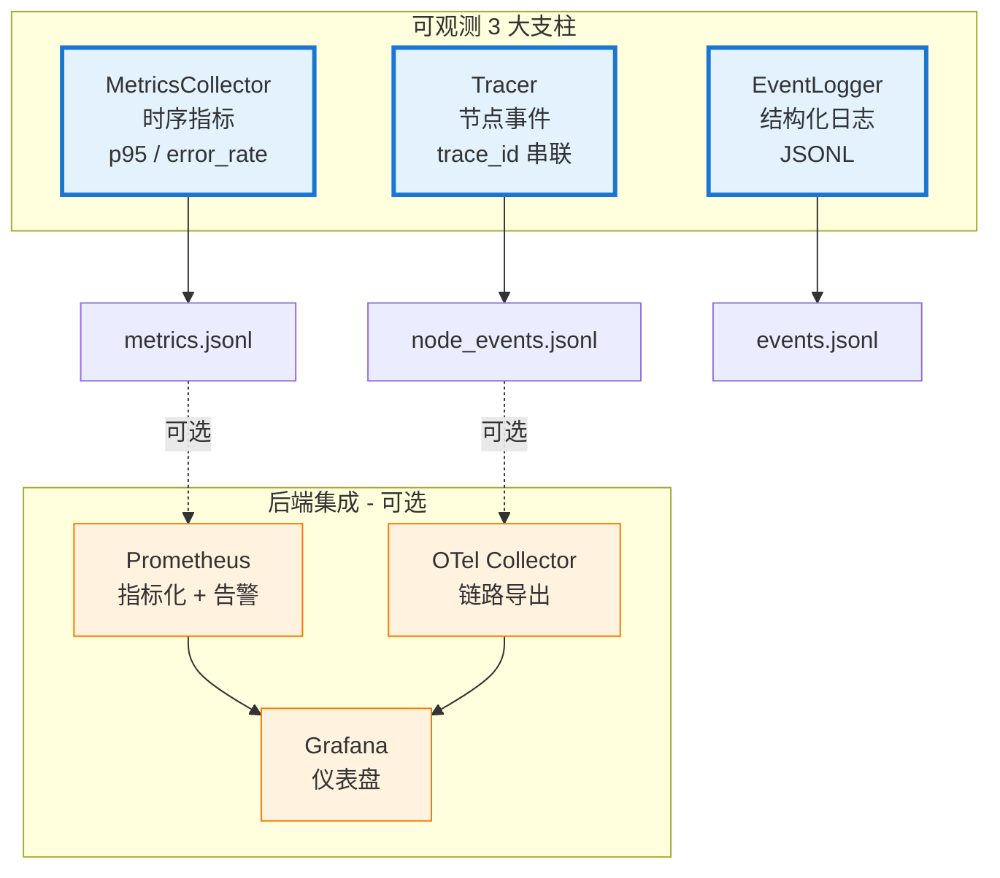
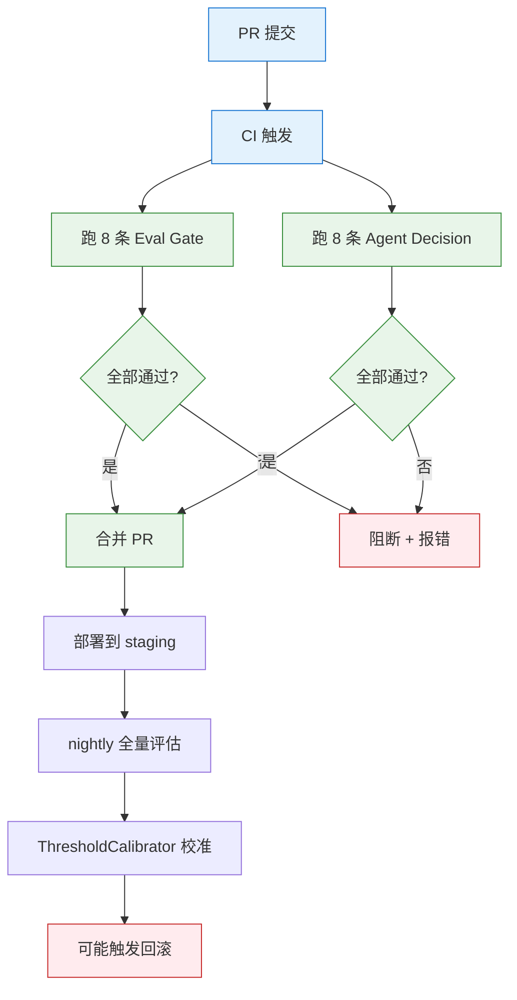
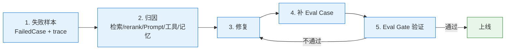

# 可观测性、评估与数据飞轮

> Tracing、指标、日志、离线/在线评估、失败沉淀与数据飞轮。

## ⚠️ 关键易误会点

### 易误会点 1：可观测性 ≠ 日志

| 维度 | 日志 | 可观测性 |
|------|------|---------|
| 目的 | 记录事件 | 理解系统行为 |
| 形态 | 文本行 | 结构化事件 + 指标 + 链路 |
| 查询 | grep | 维度过滤 + 时序聚合 |
| 告警 | 不擅长 | 核心能力 |
| 关联 | 无 | trace_id 串联 |

> 项目里 `observability/` 下 6 个文件 ≠ 6 个日志器；3 个核心：Tracer、MetricsCollector、EventLogger。

### 易误会点 2：Tracing 不是 OpenTelemetry 的专属

项目默认**不启用 OTel**（`deploy/docker-compose.yml` 中 `otel-collector` 默认注释），用自研 JSONL + Prometheus 方案。OTel 是可选导出器，**不是默认实现**。

### 易误会点 3：Metrics 指标 ≠ Prometheus 指标

项目用 `MetricsCollector` 中转，先存内存/JSONL，再**可选**导出到 Prometheus。Mock 模式下不依赖 Prometheus 也能跑。

### 易误会点 4：评估不是"用 LLM 打个分"

评估分 4 类，每类有不同方法：

| 类型 | 方法 | 项目实现 |
|------|------|---------|
| 离线自动评估 | 关键词/格式检查 + LLM-as-Judge | `evals/rag_eval.py` `evals/answer_eval.py` |
| 离线回归评估 | 8 条 Agent 决策用例 | `evals/agent_decision_eval.py` |
| 在线反馈评估 | 用户 thumbs + implicit signal | `evals/online_feedback.py` |
| 数据飞轮 | 失败沉淀 + 重新标注 + 复训 | `evals/async_evaluator.py` + `evals/dataset.py` |

### 易误会点 5：Data Flywheel ≠ 简单的失败收集

真正的飞轮是 **"失败 → 标注 → 入训练集 → 改进 → 减少新失败"** 的闭环，**不是"收集失败"**就完事。项目用 `dataset.py` 把失败 case 标注成训练样本，再喂给 LLM 做 in-context learning（不是 fine-tune）。

### 易误会点 6：评估集不是"越多越好"

8 条 Agent 决策用例 + 8 条 Eval Gate 用例 **足够**：
- 多了 CI 跑得慢
- 多了容易引入相关性（一条挂了带挂一片）
- 关键 case 必须**稳定可重现**（mock LLM 输出）

### 易误会点 7：Eval Gate 阻断 ≠ 全量评估

Eval Gate 是**门禁级检查**，只跑最关键的几个指标。**全量评估**在 nightly / weekly 跑。

### 易误会点 8：trace_id 不是"每次请求都新生成"

是 **session 级** trace_id，一次 session 内所有节点共享。子调用（如 Verifier 内的 LLM 调用）用 `span_id` 区分层级。

### 易误会点 9：告警阈值不是"出问题才定"

| 阈值类型 | 来源 | 调整方式 |
|---------|------|---------|
| Latency p95 | 业务 SLA 倒推 | 业务变更时调整 |
| Error rate | 历史 + 容忍带 | `ThresholdCalibrator` 自动校准 |
| Quality | 评估集基线 | 评估集更新时调整 |

### 易误会点 10：可观测性不是"看 dashboard"就完事

闭环：**检测异常 → 告警 → 定位 → 修复 → 验证 → 沉淀到知识库**。项目里有 `auto-failure-deposit` 把异常 case 写入 `dataset.py` 候选池。

---

## 🔑 关键决策矩阵

### A. 三大支柱选型

| 场景 | 优先 | 工具 |
|------|------|------|
| 定位慢节点 | Tracing | `Tracer` + `node_events` |
| 容量规划 | Metrics | `MetricsCollector` + Prometheus |
| 事故复盘 | Logging | `EventLogger` + JSONL |
| 用户反馈 | Feedback | `OnlineFeedback` + thumbs |

### B. 告警分级

| 等级 | 指标 | 响应 |
|------|------|------|
| P0 | p95 > 30s OR error > 25% | 立即回滚 + oncall |
| P1 | p95 > 10s OR error > 10% | 5 分钟内响应 |
| P2 | verification_pass_rate < 0.85 | 30 分钟内响应 |
| P3 | context_precision < 0.70 | 1 小时内响应 |

### C. 评估集组成

| 类别 | 数量 | 用途 |
|------|------|------|
| Agent 决策 | 8 | 验证 MasterAgent 路由 |
| Eval Gate | 8 | CI 阻断 |
| 答案质量 | ~50 | 回归 |
| RAG 召回 | ~30 | 索引变更后回归 |

### D. 飞轮触发条件

| 信号 | 飞轮动作 |
|------|---------|
| `verified=False` 连续 3 次同 query | 写入候选池 |
| 用户 thumbs down | 立即写入候选池 |
| `fallback_reason=low_retrieval_score` 占比 > 5% | 批量写入候选池 |
| 每周定时 | 抽样审核 + 标注 |


---

## 10. 可观测性体系

### 10.1 三大支柱

```text
┌──────────────────────────────────────────────────────────┐
│                    可观测性体系                            │
├─────────────────┬─────────────────┬──────────────────────┤
│    日志 (Logs)   │   指标 (Metrics) │   追踪 (Traces)      │
│                 │                 │                      │
│ JSONL 事件文件   │ Prometheus 指标 │ 请求级全链路追踪      │
│ 关键操作记录     │ 累计实时统计    │ 节点/工具/检索事件    │
│ 故障安全写入     │ /metrics 端点   │ trace_id 串联        │
└─────────────────┴─────────────────┴──────────────────────┘
```

### 10.2 事件体系

**事件类型定义：**
```python
class EventType:
    NODE_START    = "node_start"      # 节点开始执行
    NODE_END      = "node_end"        # 节点结束执行
    TOOL_CALL     = "tool_call"       # 工具调用
    RETRIEVAL     = "retrieval"       # 检索操作
    VERIFICATION  = "verification"    # 答案校验
    REQUEST_START = "request_start"   # 请求开始
    REQUEST_END   = "request_end"     # 请求结束
```

**统一事件结构：**
```python
@dataclass
class BaseEvent:
    trace_id: str       # 请求唯一追踪 ID
    session_id: str     # 会话 ID
    user_id: str        # 用户 ID
    event_type: str     # 事件类型
    timestamp: float    # Unix 时间戳

@dataclass
class NodeEvent(BaseEvent):
    node_name: str      # 节点名
    event_type: str     # "node_start" | "node_end"
    input_summary: str  # 输入摘要（截断到 120 字符，无敏感信息）
    output_summary: str # 输出摘要
    latency_ms: float   # 节点耗时
    success: bool       # 是否成功
    error: str          # 错误信息

@dataclass
class ToolEvent(BaseEvent):
    tool_name: str
    params: dict
    output: str         # 截断到 200 字符
    latency_ms: float
    success: bool
    error: str

@dataclass
class RetrievalEvent(BaseEvent):
    query: str
    num_docs: int
    top_score: float
    latency_ms: float
    success: bool

@dataclass
class VerificationEvent(BaseEvent):
    verified: bool
    reason: str
    latency_ms: float
```

### 10.3 事件日志器 (EventLogger)

```python
class EventLogger:
    def __init__(self, log_path="data/logs/events.jsonl"):
        self.log_path = Path(log_path)
        self.log_path.parent.mkdir(parents=True, exist_ok=True)

    def log_event(self, event: BaseEvent):
        """写入 JSONL，失败时静默忽略（不影响主流程）"""
        try:
            with open(self.log_path, "a") as f:
                f.write(json.dumps(asdict(event), ensure_ascii=False) + "\n")
        except Exception:
            pass  # 日志写入失败绝不抛出异常
```

**安全设计：**
- `input_summary` 自动截断到 120 字符
- 不记录完整 query 内容或文档正文
- 日志写入失败不阻塞主流程

### 10.4 追踪器 (Tracer)

```python
class Tracer:
    def __init__(self):
        self.metrics = MetricsCollector()
        self.logger = EventLogger()

    def new_trace(self, session_id, user_id) -> str:
        """生成新的 trace_id 并记录 request_start 事件"""
        trace_id = str(uuid.uuid4())[:12]
        # 记录 REQUEST_START 事件
        return trace_id

    def traced_node(self, node_name: str, func):
        """节点追踪装饰器

        自动记录：node_start 事件 → 执行 → node_end 事件
        异常时记录失败事件，不重新抛出
        """
        async def wrapper(state):
            t0 = time.time()
            # 记录 NODE_START
            try:
                result = await func(state)
                # 记录 NODE_END (success=True)
            except Exception as e:
                # 记录 NODE_END (success=False)
                result = {"error": str(e)}
            return result
        return wrapper

    def record_tool_event(self, state, tool_name, params, output, latency_ms, success, error):
        """记录工具调用事件 → JSONL + Metrics"""

    def record_retrieval_event(self, state, query, num_docs, top_score, latency_ms, success):
        """记录检索事件 → JSONL + Metrics"""

    def record_verification_event(self, state, verified, reason, latency_ms):
        """记录校验事件 → JSONL + Metrics"""
```

**追踪数据流：**
```
每个请求:
  trace_id = uuid4()[:12]
  │
  ├─ REQUEST_START event
  ├─ NODE_START/NODE_END × N  (每个节点一对)
  ├─ TOOL_CALL × M           (每次工具调用)
  ├─ RETRIEVAL × 1           (每次检索)
  ├─ VERIFICATION × 1        (每次校验)
  └─ REQUEST_END event
```

### 10.5 指标收集器 (MetricsCollector)

```python
class MetricsCollector:
    def __init__(self):
        self.total_requests = 0
        self.success_count = 0
        self.total_latency_ms = 0.0
        self.intent_distribution = defaultdict(int)
        self.retrieval_hits = 0
        self.retrieval_total = 0
        self.verification_passes = 0
        self.verification_total = 0
        self.tool_successes = 0
        self.tool_total = 0
        self.fallback_count = 0
        self.human_fallback_count = 0
        self.start_time = time.time()

    def record_request(self, intent, latency_ms, success, need_human, has_fallback):
        """记录一次请求的指标"""

    def record_retrieval(self, hit: bool):
        """记录检索命中"""

    def record_verification(self, passed: bool):
        """记录校验结果"""

    def record_tool_execution(self, success: bool):
        """记录工具执行"""

    def snapshot(self) -> dict:
        """生成指标快照"""
        total = self.total_requests
        return {
            "total_requests": total,
            "success_rate": round(self.success_count / max(total, 1), 2),
            "avg_latency_ms": round(self.total_latency_ms / max(total, 1), 2),
            "intent_distribution": dict(self.intent_distribution),
            "retrieval_hit_rate": round(self.retrieval_hits / max(self.retrieval_total, 1), 2),
            "verification_pass_rate": round(self.verification_passes / max(self.verification_total, 1), 2),
            "tool_success_rate": round(self.tool_successes / max(self.tool_total, 1), 2),
            "fallback_rate": round(self.fallback_count / max(total, 1), 2),
            "human_fallback_rate": round(self.human_fallback_count / max(total, 1), 2),
            "uptime_seconds": round(time.time() - self.start_time, 1),
        }
```

**Prometheus 指标（10 个）：**

| 指标名 | 类型 | 说明 |
|--------|------|------|
| `agent_requests_total` | Counter | 请求总数（按 intent 分区） |
| `agent_request_latency_seconds` | Histogram | 请求延迟分布 |
| `agent_fallback_total` | Counter | 兜底触发次数 |
| `agent_human_fallback_total` | Counter | 人工兜底次数 |
| `agent_tool_calls_total` | Counter | 工具调用次数（按 tool_name 分区） |
| `agent_tool_failures_total` | Counter | 工具失败次数 |
| `agent_retrieval_score` | Histogram | 检索评分分布 |
| `agent_verification_pass_total` | Counter | 校验通过次数 |
| `agent_llm_calls_total` | Counter | LLM 调用次数 |
| `agent_llm_failures_total` | Counter | LLM 调用失败次数 |

### 10.6 后端集成路径

```
当前 (Mock)                     生产 (推荐)
─────────────                   ────────────
EventLogger → JSONL 文件   →   OpenTelemetry Collector
MetricsCollector → 内存    →   Prometheus Counter/Histogram
Tracer → trace_id 串联     →   OTel SpanContext + Span Events
/metrics → JSON 端点       →   /prometheus_metrics (text/plain)
```

---

#### 📋 面试题追加：可观测性与 Tracing

| 题目 | 重要性 |
|------|--------|
| 大模型系统为什么特别强调日志、监控和 Tracing？ | S |
| 怎么监控 Agent 在线上的成功率和失败原因？ | S |
| Prompt 日志很长数据量很大存储成本怎么控制？ | A |
| LangSmith 和 Langfuse 的区别是什么？怎么选？ | B |

##### Q1: 为什么大模型系统特别强调可观测性？[S]

**面试说明：** 先讲可观测性回答三个问题：慢在哪、错在哪、为什么这么决策；本项目用 trace、指标和告警串起来。

**本项目答案（评分 8/10）：** 本项目每次请求都记录完整链路（§10.2-10.4）：node_events（每个节点的输入/输出/耗时）、trace_id 贯穿全链路、metrics_snapshot。核心原因：
1. **输出不确定**：同一输入不同输出 → 每次请求必须完整记录 Prompt/Response/参数
2. **链路长且黑盒**：RAG 检索→Rerank→生成→校验→兜底，任一环节出问题没有 Tracing 无从定位
3. **成本按 token 计**：需精确追踪用量

**排查流程：** RAG 的 bad case 要能回答"是没召回、召回了但没排上去、上下文太噪、Prompt 没约束住，还是模型接口失败"——没有日志和 Trace 只能靠猜。

**满分答案补充：** 推荐工具栈：开发阶段用 JSONL 日志（项目当前方案）；生产阶段集成 OpenTelemetry + Langfuse/LangSmith。Langfuse 开源可自部署（适合合规要求高），LangSmith 与 LangChain 生态集成最紧密但数据上云。

##### Q2: 怎么监控 Agent 在线上的成功率和失败原因？[S]

**面试说明：** 先讲线上问题要先定位到路由、检索、生成、校验或基础设施；再用 trace、指标和反馈闭环处理。

**本项目答案（v3.0 更新，评分 8/10）：** 项目通过以下机制监控（§10.4-10.5）：① **Prometheus 指标 + 8组告警规则模板**（如 `agent_requests_total`, `agent_fallback_total`, `agent_tool_failures_total`, `agent_verification_pass_total`），按 intent/tool_name 等维度记录；② **JSONL Node Event**：`traced_node` 记录每个 LangGraph 节点的 start/end、latency、success/error；③ **OpenTelemetry 集成模块**：`observability/otel_integration.py` 已提供 OTLP、FastAPI/httpx 自动埋点和 `traced_span` 工具，但应用入口和节点级 span 仍需显式接入；④ `/metrics` 和 `/prometheus_metrics` 同时提供 JSON/Prometheus 两种指标出口。

**满分答案：** 线上监控需覆盖四个维度：① **成功率**（端到端回答成功率、各节点通过率、校验通过率）；② **失败归因**（检索失败/LLM 失败/工具失败/校验失败 → 自动打标签）；③ **质量趋势**（点赞率、Bad Case 率、引用率、hallucination 检测命中率）；④ **成本/延迟**（P50/P99 延迟、token 消耗趋势）。告警规则：fallback_rate > 10% → P1、thumbs_down_rate 日环比 > 50% → P2。

##### Q3: Prompt 日志存储成本怎么控制？[A]

**面试说明：** 先讲 Prompt 是工程约束，不是文案；重点控制角色边界、证据使用、输出格式和异常兜底。

**本项目答案（评分 7/10）：** 项目当前 JSONL 日志做了基础优化：① `input_summary` 自动截断到 120 字符（§10.2）；② 不记录完整文档内容（仅 chunk_id + source_path）；③ 日志写入失败静默忽略不阻塞主流程。但未做日志 rotation 和压缩策略。

**满分答案：** 成本控制策略：① **分层存储**：热数据（7 天内）→ Redis/本地 SSD，温数据（30 天内）→ PG/廉价存储，冷数据（>30 天）→ 对象存储压缩归档；② **采样**：正常请求 5% 采样全量记录，失败请求 100% 记录；③ **结构化压缩**：不存完整 Prompt/Response，只存 (query_hash, chunk_ids, token_count, scores, trace_id) 等结构化摘要字段；④ **TTL 自动清理**：一般保留 30-90 天满足排查需求。

##### Q4: LangSmith vs Langfuse 的区别与选型？[B]

**面试说明：** 先讲可观测性回答三个问题：慢在哪、错在哪、为什么这么决策；本项目用 trace、指标和告警串起来。

**本项目答案（评分 7/10）：** 项目当前自研 JSONL + Prometheus（§10.6），未使用 LangSmith 或 Langfuse。预留了 OTel 集成路径用于未来迁移。

**满分答案：**
| 维度 | LangSmith | Langfuse |
|------|-----------|----------|
| 开发方 | LangChain 官方 | 独立开源项目 |
| 部署 | SaaS only（数据上云） | 开源自部署（Docker）+ Cloud 可选 |
| 生态绑定 | 深度绑定 LangChain/LangGraph | Provider 无关，支持任意 LLM 框架 |
| 核心功能 | Trace + Dataset + Playground + Hub | Trace + Prompt Mgmt + Eval + Playground |
| 合规性 | 数据上云，部分企业不适用 | 自部署满足数据不出境 |
| 定价 | 免费层+按量付费 | 开源免费 + Cloud 按量 |

**本项目建议：** 如果数据合规允许上云且深度使用 LangChain 生态 → LangSmith；如果要求数据不出境或需要自部署 → Langfuse。当前阶段自研 JSONL 够用，生产上线前切换到 Langfuse（与 LangGraph 不冲突，通过 OTel 集成）。

---

## 10.7 阈值与回滚决策（Harness 用）

> 配合 `recovery/threshold_calibrator.py` 使用。Harness 发布/灰度/回滚的自动决策依据。

### A. RollbackThresholds 默认值（`threshold_calibrator.py:87-105`）

```python
@dataclass
class RollbackThresholds:
    # 延迟阈值（秒）
    p95_latency_warning: float = 10.0
    p95_latency_critical: float = 30.0

    # 错误率阈值
    error_rate_warning: float = 0.10
    error_rate_critical: float = 0.25

    # 质量阈值
    verification_pass_rate_min: float = 0.85
    hallucination_rate_max: float = 0.15
    context_precision_min: float = 0.70

    # 校准元数据
    confidence: str = "low"  # low | medium | high
    data_points: int = 0
```

### B. 7 个指标 × 3 个置信级别

| 类别 | 指标 | 默认值 | n<100 (low) | 100-500 (medium) | ≥500 (high) |
|------|------|-------|-----------|-----------------|-----------|
| 延迟 | p95_latency_warning | 10s | 取 max(默认, P95历史) | 同上 | 同上 |
| 延迟 | p95_latency_critical | 30s | 取 max(默认, P99历史) | 同上 | 同上 |
| 错误率 | error_rate_warning | 0.10 | 取 min(默认, 历史+0.05) | min(默认, 历史+0.03) | min(默认, 历史+0.01) |
| 错误率 | error_rate_critical | 0.25 | min(默认, 历史+0.10) | min(默认, 历史+0.05) | min(默认, 历史+0.02) |
| 质量 | verification_pass_rate_min | 0.85 | max(默认, 历史-0.05) | max(默认, 历史-0.03) | max(默认, 历史-0.01) |
| 质量 | hallucination_rate_max | 0.15 | min(默认, 历史+0.05) | min(默认, 历史+0.03) | min(默认, 历史+0.01) |
| 质量 | context_precision_min | 0.70 | max(默认, 历史-0.05) | max(默认, 历史-0.03) | max(默认, 历史-0.01) |

### C. 校准原则

| 原则 | 说明 |
|------|------|
| **永远不放松** | 校准只紧不松，防止回滚阈值漂移 |
| **3 个置信级别** | 校准随数据点增加逐步缩紧（low → medium → high） |
| **最少 30 个数据点** | 触发自动校准的最小样本量 |
| **统计方法** | 延迟用 P95/P99，错误率用均值+容忍带，质量用绝对下限 |
| **持久化** | 默认 `data/harness/thresholds.json`，可由 `ROLLBACK_CALIBRATION_PATH` 覆盖 |

### D. 决策动作

| 指标 | 触发条件 | 动作 |
|------|---------|------|
| `p95_latency > warning` | 10s | 触发告警 + 标记需观察 |
| `p95_latency > critical` | 30s | **自动回滚** |
| `error_rate > warning` | 10% | 告警 |
| `error_rate > critical` | 25% | **自动回滚** |
| `verification_pass_rate < min` | 0.85 | 告警 + 暂停放量 |
| `hallucination_rate > max` | 0.15 | **自动回滚** |
| `context_precision < min` | 0.70 | 告警 + 暂停放量 |

> **关键工程点**：校准数据**不会自动回写代码**，需要人工 review + 走 CI 才能提升到 hard threshold。

---

---

## 11. 评估体系与 Data Flywheel

### 11.1 设计理念

> "评估不是一次性工作，而是持续改进的飞轮。"

```
线上运行 → 失败沉淀 → 失败分析 → 改进实施 → 回归验证 → 上线
  ↑                                                       ↓
  └──────────────────── 迭代循环 ──────────────────────────┘
```

### 11.2 离线评估体系

```python
class EvalDataset:
    """离线评估数据集管理"""
    def load_regression_cases(self) -> list[dict]:
        """加载 data/eval/regression_cases.jsonl"""
    def load_failed_cases(self) -> list[dict]:
        """加载 data/eval/failed_cases.jsonl"""
    def add_case(self, case: dict) -> None:
        """添加新的回归 case"""
```

**回归数据集格式：**
```json
{
  "query": "如何重置密码？",
  "expected_intent": "technical_question",
  "expected_sources": ["sample_faq.md"],
  "expected_answer_keywords": ["密码", "重置"],
  "user_role": "admin",
  "difficulty": "easy",
  "prompt_version": "v1"
}
```

### 11.3 RAG 评估器 (RAGEvaluator)

**文件：** `evals/rag_eval.py`

```python
class RAGEvaluator:
    def evaluate(self, dataset: EvalDataset) -> dict:
        """评估 RAG 检索质量"""
        results = {
            "hit_at_k": [],     # hit@1, hit@3, hit@5
            "recall_at_k": [],  # recall@1, recall@3, recall@5
            "mrr": 0.0,         # Mean Reciprocal Rank
            "avg_score": 0.0,   # 平均检索分
            "per_case": [],     # 每个 case 的详细结果
        }
        for case in dataset:
            retrieved = self.retriever.search(case["query"])
            # 计算 hit@k (预期来源是否在 top-k 中)
            # 计算 recall@k (预期来源被检索到的比例)
            # 计算 MRR (第一个相关文档的排名倒数)
```

**RAG 指标说明：**

| 指标 | 含义 | 计算方式 |
|------|------|----------|
| hit@k | top-k 结果中是否包含预期文档 | 布尔值取平均 |
| recall@k | 预期文档中有多少被检索到 | 检索到的预期数 / 总预期数 |
| MRR | 第一个相关文档的排名倒数 | 1/rank_of_first_relevant |
| avg_score | 检索结果的平均相关度评分 | mean(scores) |

### 11.4 答案评估器 (AnswerEvaluator)

**文件：** `evals/answer_eval.py`

```python
class AnswerEvaluator:
    def evaluate(self, dataset: EvalDataset, workflow) -> dict:
        """评估答案生成质量"""
        results = {
            "intent_accuracy": 0.0,        # 意图分类准确率
            "keyword_hit_rate": 0.0,       # 答案包含预期关键词的比例
            "citation_rate": 0.0,          # 答案包含引用的比例
            "groundedness": 0.0,           # 答案依据性
            "relevance": 0.0,              # 答案相关性
            "refusal_accuracy": 0.0,       # 拒绝正确率
            "per_case": [],
        }
```

**答案指标说明：**

| 指标 | 含义 | 评估方式 |
|------|------|----------|
| intent_accuracy | 意图分类是否正确 | 与 expected_intent 比较 |
| keyword_hit_rate | 答案包含预期关键词的比例 | 关键词匹配 |
| citation_rate | 答案含引用的比例 | 检查引用标记 |
| groundedness | 答案是否基于参考文档 | LLM-as-Judge |
| relevance | 答案是否与问题相关 | LLM-as-Judge |
| refusal_accuracy | 该拒绝时是否拒绝 | 检查拒绝场景 |

### 11.5 在线反馈系统

**文件：** `evals/online_feedback.py`

```python
class FeedbackHandler:
    async def handle_feedback(self, trace_id, session_id, thumbs_up,
                               feedback_text, user_id):
        """处理用户反馈"""
        # 1. 写入 PostgreSQL feedback 表
        await repo.insert_feedback(...)

        # 2. thumbs_down 时自动沉淀到 failed_cases
        if not thumbs_up:
            await self._write_failed_case({
                "trace_id": trace_id,
                "query": query_from_trace,
                "reason": feedback_text,
                "source": "feedback",
                "user_id": user_id,
            })
```

### 11.6 自动失败沉淀

以下条件**自动**将 case 写入 `data/eval/failed_cases.jsonl`：

| 触发条件 | 来源标记 | 说明 |
|----------|----------|------|
| `need_human == true` | `auto` | 系统无法自动回答 |
| `verified == false` | `auto` | 答案未通过校验 |
| `fallback_reason != ""` | `auto` | 触发了兜底机制 |
| 用户 `thumbs_down` | `feedback` | 用户主动标记不满意 |

### 11.7 Data Flywheel 操作指南

| 步骤 | 操作 | 命令/方法 | 产出 |
|------|------|-----------|------|
| 1. 失败沉淀 | 自动 | 系统自动写入 | 结构化失败记录 |
| 2. 失败分析 | 人工审查 | `python scripts/export_failed_cases.py` | 改进优先级列表 |
| 3. 转为 eval case | 手动 | 复制到 `regression_cases.jsonl` | 防回归 |
| 4. 补知识库 | 手动 | 补充 `data/docs/*.md` | 提升 hit@k |
| 5. 优化 Prompt | 手动 | 调整 `prompt_builder.py` | 提升答案质量 |
| 6. 优化 Routing | 手动 | 调整 `INTENT_KEYWORDS` | 提升意图准确率 |
| 7. Prompt 版本对比 | 手动 | 设 `prompt_version` 字段 | A/B 对比 |
| 8. 回归验证 | 自动 | `python -m enterprise_agentic_rag.evals.regression_eval` | 通过率报告 |
| 9. 回滚 | 手动 | 还原配置 | 保持稳定性 |

### 11.8 异步评估器

**文件：** `evals/async_evaluator.py`

```python
class AsyncEvaluator:
    """异步评估器，用于在线评估场景"""
    async def evaluate_async(self, trace_id, state):
        """异步运行完整评估套件"""
        tasks = [
            self._eval_intent(state),
            self._eval_retrieval(state),
            self._eval_answer(state),
        ]
        results = await asyncio.gather(*tasks, return_exceptions=True)
```

---

#### 📋 面试题追加：评估体系与评测

| 题目 | 重要性 |
|------|--------|
| 评测体系你是怎么搭建的？评测指标都有哪些？ | S |
| 评测集需要多大规模才够？怎么平衡标注成本和覆盖度？ | S |
| RAG系统如何评估？检索和生成分别用什么指标？ | A |
| LLM-as-Judge 的评分和人工评分一致性能到多少？ | A |
| 线上 A/B Test 和评测流水线应该怎么做？ | S |
| 如果离线评测提升了但线上 A/B 没有提升什么原因？ | S |
| 大模型评测集如何从零构建并持续迭代？ | S |
| Agent 应该怎么评测？ | S |

##### Q1: 本项目评测体系怎么搭建的？[S]

**面试说明：** 先讲评估流水线用于防回归，数据飞轮用于持续改进；再落到检索、答案、路由和线上反馈指标。

**本项目答案（评分 8/10）：** 项目实现了离线+在线双轨评估体系（§11.2-11.5）：
- **离线 RAG 评估器**（§11.3）：precision、recall、MRR、hit_rate（检索端）
- **答案评估器**（§11.4）：faithfulness（忠实度）、relevance（相关性）（生成端）
- **在线反馈**（§11.5）：用户点赞/点踩 → failed_cases.jsonl 自动沉淀
- **异步评估器**（§11.8）：回答返回后后台评估 → bad case 归类分析根因
- **Data Flywheel**（§11.7）：低质量样本 → 反推是切块/召回/重排/Prompt/知识库问题

**评分指标速查：**
| 维度 | 指标 | 说明 |
|------|------|------|
| 检索质量 | Recall@5, MRR, NDCG@5 | 正确答案是否在 Top-5 中 |
| 生成忠实度 | Faithfulness（LLM-as-Judge） | 回答是否基于检索文档 |
| 回答相关性 | Relevance（LLM-as-Judge） | 回答是否切题 |
| 用户满意度 | 点赞率, Bad case 率 | 线上真实反馈 |

##### Q2: 评测集多大规模才够？[S]

**面试说明：** 先讲评估流水线用于防回归，数据飞轮用于持续改进；再落到检索、答案、路由和线上反馈指标。

**本项目答案（评分 7/10）：** 项目通过 Data Flywheel 从线上日志沉淀 failed cases（§11.6），但未给出评测集的精确规模数字。

**满分答案：** 300-500 条覆盖主要业务场景（制度查询、流程指引、FAQ、数据指标、开放式提问），每类按线上流量比例分层抽样 + 已知 bad case 100% 收录 + 边界 case 人工构造。每两个月从线上补充新样本，剔除过时 case。自动化评测用 LLM-as-Judge（需先做 Cohen's Kappa > 0.7 人工一致性校验）。

##### Q3: 离线提升但线上没效果的原因？[S]

**面试说明：** 先讲线上问题要先定位到路由、检索、生成、校验或基础设施；再用 trace、指标和反馈闭环处理。

**评测集分布 ≠ 线上真实分布**：评测集的问题类型/长度/难度可能与线上不一致 → 优化了评测集擅长的场景但线上用户问的是其他类型。离线评测用的是技术指标（Recall/准确率），线上 A/B 看的是业务指标（留存/满意度）→ 两者不一定同步。线上噪声（网络抖动、知识库更新、用户集中在问某类之前未测试的问题）稀释了技术优化的效果。

**解决：** 根据线上数据反向更新评测集 → 确保离线评测与真实分布对齐。

##### Q4: RAG 系统如何评估？检索和生成分别用什么指标？[A]

**面试说明：** 先讲"召回质量决定 RAG 上限"，再说明关键词、向量、图检索的分工、融合、重排和回退链。

**本项目答案（评分 8/10）：** 项目按检索和生成两端独立评估（§11.3-11.4）：
- **检索端**：Recall@5（预期文档是否在 Top-5）、MRR（第一个相关文档的排名倒数）、NDCG@5（考虑相关度分级的排序质量）
- **生成端**：Faithfulness（答案是否基于文档→LLM-as-Judge 分解为原子陈述逐条检查）、Relevance（答案是否切题）、Citation Rate（答案含引用的比例）
- **用户体验端**：点赞率、Bad Case 率

**满分答案：** 检索与生成评估必须分开做——检索指标差但生成指标好说明 LLM 在"编造"；检索指标好但生成指标差说明 Prompt/模型需要优化。推荐指标组合：检索 ≥ 2 个（Recall@K + MRR），生成 ≥ 3 个（Faithfulness + Relevance + Groundedness），线上 ≥ 2 个（thumbs_up_rate + bad_case_rate）。

##### Q5: LLM-as-Judge 和人工评分一致性能到多少？[A]

**面试说明：** 先讲评估流水线用于防回归，数据飞轮用于持续改进；再落到检索、答案、路由和线上反馈指标。

**本项目答案（评分 7/10）：** 项目使用 LLM-as-Judge 做 Faithfulness 和 Relevance 评估（§11.4），但未做与人工评分的一致性校准。

**满分答案（不涉及项目）：** 一致性分两档：① **二分类判断**（是否符合/是否忠实）：与人工一致性可达 85-90%（Cohen's Kappa > 0.7）；② **多级评分**（1-5 分 Likert）：与人工一致性约 70-80%（Pearson r ≈ 0.75-0.85）。提升一致性的技巧：用高级模型（GPT-4o/Claude Opus）做 Judge 比用小模型准 10-15%；给出明确的评分 rubric（带示例）；对模糊 case 允许 Judge 返回"uncertain"而非强行打分；定期抽样 50-100 条人工对比校准。

##### Q6: 线上 A/B Test 和评测流水线怎么做？[S]

**面试说明：** 先讲线上问题要先定位到路由、检索、生成、校验或基础设施；再用 trace、指标和反馈闭环处理。

**本项目答案（评分 7/10）：** 项目在 Harness CI/CD 中有 Eval Gate（§16.2）和 Canary 发布流程，但 A/B Test 的具体实现未细化到技术细节。

**满分答案：** A/B Test 设计要点：① 分流机制（user_id hash % N 决定进入实验组，保证同一用户始终在同一组）；② 指标选择（业务指标为主——点赞率/留存/任务完成率；技术指标为辅——延迟/token 消耗）；③ 样本量估算（基于基线指标估算需要多少样本才能检测到预期提升，通常需要 1000-5000 请求/组）；④ 评测流水线 = 离线回归测试（每次 PR 触发）→ Staging 验证（人工抽检 20-50 条）→ Canary 发布（1% 流量，30min 观察）→ 全量上线。

##### Q7: 大模型评测集如何从零构建并持续迭代？[S]

**面试说明：** 先讲评估流水线用于防回归，数据飞轮用于持续改进；再落到检索、答案、路由和线上反馈指标。

**本项目答案（评分 8/10）：** 项目的 Data Flywheel 机制（§11.6-11.7）：① **冷启动**：人工构造 50-100 个核心场景的 (query, expected_sources, expected_keywords) 三元组；② **在线沉淀**：用户点赞率 < 阈值或点踩 → 自动写入 failed_cases.jsonl；③ **人工筛选**：定期从 failed_cases 中审查→真失败转回归 case→假失败（用户输入问题）丢弃；④ **迭代周期**：每两周补充一次评测集，剔除过时 case。

**满分答案：** 构建流程：① **种子集**：FAQ 文档直接提取 Q&A pair（50-100 条）；② **日志挖掘**：从线上日志聚类高频 query → 人工标注标准答案（200-300 条）；③ **难度分层**：简单（单文档答案）、中等（多文档综合）、困难（需推理/跨文档关联）；④ **坏例全覆盖**：所有已知 bad case 100% 收录；⑤ **持续维护**：每月 Review → 剔除"已失效"case → 补充新场景 → 确保评测集与实际分布对齐。

##### Q8: Agent 应该怎么评测？[S]

**面试说明：** 先讲 Agent 评测不只看答案，还要看路由、工具选择、步骤数、失败恢复和成本。

**本项目答案（评分 7/10）：** 项目对 Agent 的评测分散在多个评估器中（§11）：检索端测 RAG 质量、生成端测答案质量、工具调用端测成功率。但缺少统一的"端到端 Agent 成功率"指标。

**满分答案（不涉及项目）：** Agent 评测的三个层次：① **组件评测**（检索 Recall、工具调用成功率、校验通过率）——并行于现有评估；② **端到端评测**（完整 query→answer 的成功/失败二元判断 + 失败根因自动分类）；③ **行为评测**（Agent 是否做了不该做的事——不该调的工具、不该披露的信息、不该编造的事实）。评测方式：离线 golden set 自动化 + 在线 A/B Test 看业务指标 + 红队测试（adversarial 用例）。核心难点：Agent 的正确行为路径不止一条（同一问题可以走不同检索策略），评测需支持"路径不敏感但结果正确"的判定。

---

---

## 39. 专题：评估流水线和数据飞轮

### 39.1 为什么这么设计，解决了什么问题

RAG 系统上线后最大的问题是"好不好"难以靠人工感觉判断。项目设计离线评估、在线反馈、失败样本沉淀和回归评估，形成数据飞轮。**P1-P3 实施后新增：**

- **Eval Gate CI** (`.github/workflows/eval-gate.yml`)：每次 PR 自动运行 8 条评估用例，4 维度打分（faithfulness 40% + context_recall 30% + answer_relevancy 20% + intent_accuracy 10%），总分 < 阈值则阻断合并。
- **Agent 决策评估集** (`evals/agent_decision_eval.py`)：8 条用例覆盖全部 6 种意图，评估 MasterAgent 路由准确性（intent/routing/mode 三个维度）。

### 39.2 具体流程（更新）

```text
                  线上请求 (POST /chat or /chat/stream)
                         │
                         ▼
         ┌─────────────────────────────────────────┐
         │  Tracer (trace_id) + MetricsCollector   │
         │  /metrics (JSON)  +  /prometheus_metrics │
         └─────────────────────────────────────────┘
                         │
                         ▼
                  用户 Feedback (POST /feedback)
                         │
         ┌───────────────┴────────────────┐
         │                                │
   thumbs_down / 低评分            thumbs_up / 高评分
         │                                │
         ▼                                ▼
  FeedbackHandler 自动捕获        成功样本采样写 qa_logs
         │
         ▼
  data/eval/failed_cases.jsonl  +  PostgreSQL feedback / failed_cases
         │
         ▼
  人工评审 / 自动归因
         │
         ▼
补充到 Eval Dataset:
     • data/eval/regression_cases.jsonl  (8 条回归集)
     • evals/agent_decision_eval.py     (8 条决策集)
         │
         ▼
  本地修复 → 提交 PR
         │
         ▼
  ┌─────────────────────────────────────────────────┐
  │  Eval Gate CI (.github/workflows/eval-gate.yml) │
  │  scripts/run_eval_gate.py + 8 条内置用例         │
  │                                                  │
  │  overall = faithfulness    × 0.40                │
  │          + context_recall  × 0.30                │
  │          + answer_relevancy× 0.20                │
  │          + intent_accuracy × 0.10                │
  └─────────────────────────────────────────────────┘
         │
         ├─ overall < 0.70 ────► ❌ 阻断合并
         │
         └─ overall ≥ 0.70 ────► ✅ 灰度发布 (Canary 5%→100%)
```

核心指标体系：

| 指标 | 含义 | 建议目标 | 评估集 |
|------|------|----------|--------|
| intent_macro_f1 | 意图分类准确率 | ≥ 0.90 | Agent决策评估集(8条) |
| route_success_rate | MasterAgent路由准确率 | ≥ 0.92 | Agent决策评估集(8条) |
| faithfulness | 答案忠实度 | ≥ 0.85 | Eval Gate(8条) |
| context_recall | 上下文召回率 | ≥ 0.75 | Eval Gate(8条) |
| hallucination_rate | 幻觉率 | ≤ 8% | Claim-level校验输出 |
| regression_pass_rate | 回归通过率 | ≥ 0.90 | 全量评估集 |

### 39.3 存在的缺点

> **实施状态更新 (2026-06-03)：** Eval Gate CI 和 Agent 决策评估集已实施。

- 评测集规模和覆盖面仍偏小，难覆盖所有业务边界。（**部分改善**: Agent 决策评估集精简为 8 条用例，Eval Gate 维持 8 条用例）
- LLM Judge 评估存在波动，需要多次采样或规则兜底。
- 在线反馈有偏差，用户不一定主动点赞/点踩。
- 缺少完整的自动标注与人工审核工作台。

### 39.4 可提升点

| 提升点 | 预期收益 | 可观察指标 | 实施状态 |
|--------|----------|------------|----------|
| 引入 RAGAS 完整指标 | 更标准化评估 | faithfulness/context_recall 可自动出报表 | ✅ 已有 (`evals/` 目录) |
| Bad Case 自动聚类 | 快速发现系统性问题 | 每周人工分析时间下降 40% | ⬜ 待实施 |
| Eval Gate 接入 CI | 防止回归上线 | 线上事故率下降 | ✅ 已实施 (`.github/workflows/eval-gate.yml` + `scripts/run_eval_gate.py`) |
| 人工审核闭环 | 提升标注质量 | eval_label_consistency ≥ 0.9 | ⬜ 待实施 |

---

---

## 40. 专题：可观测性

### 40.1 为什么这么设计，解决了什么问题

多 Agent RAG 出问题时，用户只看到"答错了"，工程侧必须知道错在意图、检索、工具、上下文、生成、校验还是权限。**P1-P3 实施后，可观测性从开发级升级到生产级：**

- **OpenTelemetry** (`observability/otel_integration.py`)：OTLP gRPC 导出（默认 `http://localhost:4317`）+ FastAPI/HTTPX 自动埋点。**OTel 默认关闭**（`OTEL_ENABLED=0`），开启后导出到 docker-compose 内置的 **OTel Collector**（端口 4317/4318），再由 Collector 转发到 **Prometheus**（指标，端口 8889）+ debug exporter（traces）。⚠️ 项目未自带 Jaeger/Tempo，traces 默认只走 debug exporter；如需可视化，需用户自部署 Jaeger 并改 Collector pipeline。JSONL `data/logs/events.jsonl` 作为 OTel 不可用时的兜底。
- **Prometheus 告警** (`prometheus_alerts.py` + `deploy/prometheus/alerts.yml`)：8 组告警规则覆盖延迟/错误率/检索质量/校验/系统。

三大支柱：

| 支柱 | 实施前 | 实施后 |
|------|--------|--------|
| 日志 | JSONL 文件（查询能力弱） | JSONL 主链路 + OTel 模块可接入 |
| 指标 | MetricsCollector 内存累计 | Prometheus 指标 + 8组告警规则模板 |
| 追踪 | 前端 Trace Panel（单请求） | OTel SDK/工具已提供，节点级 OTel 接入待完善 |

### 40.2 具体流程（更新）

```text
POST /chat  or  POST /chat/stream
        │
        ▼
new_trace_id = uuid4()[:12]  (Tracer.new_trace)
        │
        ▼
LangGraph workflow → 每个节点用 _tracer.traced_node() 包装
        │
        ├──► EventLogger.write_jsonl()  → data/logs/events.jsonl
        │
        ├──► MetricsCollector.record()  → 内存累计
        │    └─► /metrics (JSON snapshot)
        │    └─► /prometheus_metrics (text/plain, Prometheus 抓取)
        │
        └──► OTel (默认关闭, OTEL_ENABLED=0)
             └─► OTLP gRPC :4317 → OTel Collector → Prometheus (metrics)
                 ⚠️ traces 仅走 debug exporter；Jaeger/Tempo 需用户自接
        │
        ▼
Bad Case 分析
        │
        ▼
SLO 监控 + 8 组 Prometheus 告警规则 (deploy/prometheus/alerts.yml)
        │
        ▼
前端 Trace Panel (SSE node_end 事件实时推送)
```

8 组告警规则：

| 告警组 | 关键规则 | 严重度 |
|--------|---------|--------|
| `enterprise_rag_latency` | P95 > 10s (warning), > 30s (critical) | warning/critical |
| `enterprise_rag_errors` | 错误率 > 10% (warning), > 25% (critical) | warning/critical |
| `enterprise_rag_retrieval` | 检索质量 < 0.05, 空文档率 > 20%, 兜底率 > 25% | warning |
| `enterprise_rag_verification` | 校验通过率 < 85%, 幻觉率 > 15% | warning/critical |
| `enterprise_rag_system` | 服务下线, 内存 > 20GB, 缓存命中率 < 30% | critical/warning/info |

建议观测字段：

| 类别 | 字段 |
|------|------|
| 请求 | trace_id、session_id、user_id、tenant_id、query_hash |
| 意图 | primary_intent、confidence、entities、keywords |
| 检索 | retrieval_mode、top_score、num_docs、latency_ms、degraded_to |
| Agent | master_next、master_reason、from_worker、from_step |
| 答案 | verified、verification_reason、citation_count |
| 失败 | fallback_reason、recoverable、retry_count、tool_errors |

### 40.3 存在的缺点

> **实施状态更新 (2026-06-03)：** Prometheus 指标与告警规则已实施；OpenTelemetry 集成模块已提供，但应用入口和 LangGraph 节点级 span 仍需显式接入。

- ◐ **部分解决** — JSONL 日志生产查询能力弱：新增 `observability/otel_integration.py`，支持 OTLP 导出、FastAPI/httpx 自动埋点和 `traced_span` 工具；当前 `app/main.py` 尚未显式调用 `instrument_app(app)`，LangGraph 节点仍主要通过 JSONL `traced_node` 记录。
- ◐ **部分解决** — 缺少分布式 trace 后端：OpenTelemetry SDK 集成模块存在，但"所有 LangGraph 节点作为 OTel Span"仍是待接入项。
- ~~指标和业务结果之间的关联还不够强。~~ → 仍待优化。
- ~~前端 trace 面板适合单请求排查，不适合批量趋势分析。~~ → 仍待优化，Prometheus + Grafana 可部分解决。

### 40.4 可提升点

| 提升点 | 预期收益 | 可观察指标 | 实施状态 |
|--------|----------|------------|----------|
| 接入 OpenTelemetry | 跨服务链路追踪 | trace 查询时间下降 | ◐ 模块已实现，应用入口/节点 span 待接入 |
| Prometheus 指标化 | 支持告警 | p95_latency、error_rate 实时可见 | ✅ 已实施 (`observability/metrics.py`, `observability/prometheus_alerts.py`, `deploy/prometheus/alerts.yml`) |
| Retrieval Dashboard | 定位检索问题 | no_doc_rate、low_score_rate 可分 intent 查看 | ⬜ 待实施 |
| 用户反馈关联 trace | 快速复盘 | feedback_to_trace 命中率 100% | ⬜ 待实施 |

---

---

### v3.2 简化说明

**主要变更**：
- 4 个独立 Workflow 类 → 1 个 BaseRAGWorkflow（通过 mode 参数区分模式）
- 5-tier 降级链 → 3-tier（语义缓存命中 → BaseRAGWorkflow → 失败返回空证据）
- 检索层现在由 RetrievalAgent 代理（agents/retrieval_agent.py），但内部仍是确定性检索逻辑
- IntentCategory 10 → 6；RetrievalMode 5 → 3；AgentState 72 → ~30；eval cases 22 → 8
- CodeAgent 拆分为 CodeGenerator（prompt utility）+ CodeExecutor（agent）

---

[返回总目录](../TECHNICAL_DEEP_DIVE.md)

## 流程图

#### 1. 可观测 3 大支柱（Tracer / Metrics / Logger）



#### 2. Eval Gate 8 条 + Agent Decision 8 条 CI 流程



#### 3. Data Flywheel 5 步闭环


