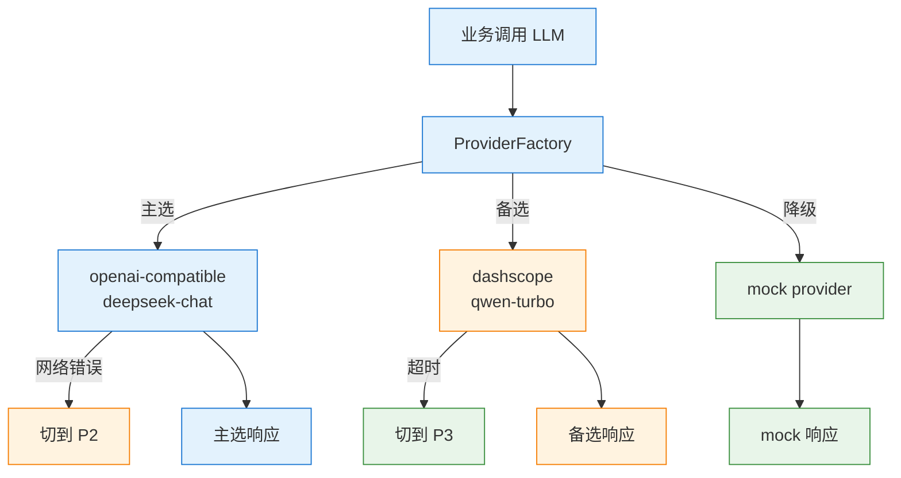
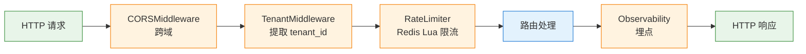

# 模型、配置、中间件与前端

> Provider 抽象、配置体系、API 中间件、React 前端架构。

## ⚠️ 关键易误会点

### 易误会点 1：Provider Factory ≠ 多 LLM 自动切换

| 概念 | 含义 | 项目实现 |
|------|------|---------|
| Provider 抽象 | 统一 LLM 接口 | `LLMProvider` 基类（`llm/base.py`）|
| Provider Factory | 选哪个 Provider | `llm/provider_factory.py` |
| Fallback | 失败切换 | `Mock → OpenAI → DashScope` 链式降级 |
| Load Balancing | 流量分摊 | ❌ 未实现 |

> 项目的"多 Provider"是**降级链**（按顺序试），不是**负载均衡**（按权重分）。

### 易误会点 2：openai_provider 不是只给 OpenAI 用

`openai_provider.py` 实际是 **OpenAI-compatible 客户端**，所有走 OpenAI 协议的 LLM（DeepSeek、月之暗面、本地 vLLM）都用它。

### 易误会点 3：mock_provider 不是"测试专用"

Mock Provider 在以下场景**生产可用**：
- LLM Provider 全部不可用时降级
- 本地开发零依赖
- CI 评估（保证可重现）

### 易误会点 4：Middleware ≠ LangGraph Middleware

项目里的"中间件"分两层：
- **FastAPI Middleware**：`CORSMiddleware` 跨域
- **函数级中间件**：`RateLimiter` (Redis Lua) / `Tenant` 提取

LangGraph 也有 Middleware 概念（拦截节点），**项目未使用** LangGraph Middleware。

### 易误会点 5：Tenant 隔离 ≠ 用户登录

| 层级 | 实现 | 颗粒度 |
|------|------|--------|
| 租户 (Tenant) | `X-Tenant-ID` header / JWT claim | 组织级 |
| 用户 (User) | `X-User-ID` | 个人级 |
| 角色 (Role) | admin / developer / basic | 权限级 |

`TenantMiddleware` 在 `request.state.tenant_id` 注入，**所有 RAG 检索和工具调用都按 tenant_id 过滤**。

### 易误会点 6：Rate Limiter 不是"防 DDoS"

是**租户级配额控制**：
- 每个 tenant 每分钟 N 次
- 超过 → 429 + Retry-After
- 防止"一个租户占用所有 LLM 配额"

### 易误会点 7：Configuration ≠ 环境变量

`config/settings.py` 用了**分层配置**：
- 默认值（代码内）
- 环境变量（覆盖默认）
- .env 文件（本地开发）
- 配置文件（生产）

### 易误会点 8：React 前端 ≠ 完整 UI 项目

`frontend/` 目录是**可独立部署的 widget**，不是完整产品 UI。设计为可嵌入到其他官网右下角客服入口。

### 易误会点 9：API 11 个 endpoint ≠ 11 个独立接口

| 分类 | 数量 | 端点 |
|------|------|------|
| 核心对话 | 3 | `/chat` / `/chat/stream` (SSE) / `/feedback` |
| 可观测 | 2 | `/metrics` / `/prometheus_metrics` |
| 管理 | 4 | `/admin/*` (用户/知识库/工具) |
| 健康 | 1 | `/health` |
| 静态 | 1 | `/` (前端 widget) |

> `/chat/stream` 是 **SSE 长连接**，不是 WebSocket；不是任意客户端都能用。

### 易误会点 10：模型选型不是"越大越好"

不同节点用不同模型：
- 路由决策：可小（qwen-turbo / mock）
- Deep Intent 分类：可小（结构化输出）
- 答案生成：要大（deepseek-chat / qwen-max）
- Verifier 校验：要稳（temperature=0.0）

> 项目用 `ProviderFactory` 让**每个节点可独立配模型**，不是全用同一个。

---

## 🔑 关键决策矩阵

### A. Provider 选型

| 场景 | Provider | 理由 |
|------|----------|------|
| 生产 | openai-compatible (deepseek-chat) | 性价比高、中文好 |
| 备选 | dashscope (qwen-turbo) | 国产、稳定性 |
| 降级 | mock | 零依赖 |
| 评估 | mock | 可重现 |

### B. 中间件链顺序

```
请求进入
  → CORSMiddleware（跨域）
  → TenantMiddleware（提取 tenant_id）
  → RateLimiter（限流）
  → 路由处理
  → ObservabilityMiddleware（埋点）
  → 响应
```

### C. 配置优先级（高到低）

| 优先级 | 来源 | 用途 |
|--------|------|------|
| 1 | 环境变量 | 生产 |
| 2 | .env 文件 | 本地开发 |
| 3 | config/settings.py 默认 | 兜底 |

### D. SSE vs WebSocket

| 维度 | SSE (`/chat/stream`) | WebSocket |
|------|----------------------|-----------|
| 协议 | HTTP | 独立 |
| 方向 | 服务器→客户端 | 双向 |
| 适用 | 单次响应流式 | 长连接交互 |
| 项目使用 | ✅ | ❌ |

### E. 路由决策模型 vs 答案生成模型

| 节点 | 推荐模型 | 温度 | 原因 |
|------|---------|------|------|
| MasterAgent 路由 | qwen-turbo / mock | 0.0 | 需要稳定结构化 |
| Deep Intent | qwen-turbo | 0.0 | 同上 |
| 答案生成 | deepseek-chat | 0.3 | 需要表达力 |
| Verifier | qwen-turbo | 0.0 | 严格判断 |
| 摘要 | qwen-turbo | 0.0 | 保留信息 |


---

## 12. LLM Provider 抽象层

### 12.1 设计目标

- **Provider 无关**：上层代码不依赖具体 LLM 提供商
- **统一接口**：所有 Provider 实现相同的 `generate()` 方法
- **自动降级**：真实 LLM 调用失败时自动 fallback 到 Mock
- **配置驱动**：通过环境变量切换 Provider

### 12.2 Provider 基类

**文件：** `llm/base.py`

```python
@dataclass
class LLMResponse:
    success: bool
    content: str
    error: str = ""
    model: str = ""
    usage: dict = field(default_factory=dict)  # {prompt_tokens, completion_tokens}

class BaseLLMProvider(ABC):
    def __init__(self, model: str = "", api_key: str = "", base_url: str = ""):
        self.model = model
        self.api_key = api_key
        self.base_url = base_url
        self.provider_name = "base"

    @abstractmethod
    async def generate(self, prompt: str, temperature: float = 0.0,
                       max_tokens: int = 2048, **kwargs) -> LLMResponse:
        ...
```

### 12.3 Mock Provider

**文件：** `llm/mock_provider.py`

```python
class MockProvider(BaseLLMProvider):
    """Mock LLM Provider — 无需 API key，返回确定性响应"""
    provider_name = "mock"

    async def generate(self, prompt, temperature=0.0, max_tokens=2048, **kwargs):
        # 对 prompt 长度进行简单判断，返回合理的 mock 响应
        return LLMResponse(
            success=True,
            content="[Mock] 这是一个模拟的 LLM 响应。",
            model="mock-v1",
        )
```

Mock Provider 使得系统可以在**零配置**情况下完整运行，所有 Agent 路径都走规则/template fallback。

### 12.4 OpenAI Compatible Provider

**文件：** `llm/openai_provider.py`

```python
class OpenAICompatibleProvider(BaseLLMProvider):
    """兼容 OpenAI API 的 Provider (OpenAI / vLLM / Ollama / 等)"""
    provider_name = "openai-compatible"

    async def generate(self, prompt, temperature=0.0, max_tokens=2048, **kwargs):
        client = AsyncOpenAI(api_key=self.api_key, base_url=self.base_url)
        response = await client.chat.completions.create(
            model=self.model,
            messages=[{"role": "user", "content": prompt}],
            temperature=temperature,
            max_tokens=max_tokens,
        )
        return LLMResponse(
            success=True,
            content=response.choices[0].message.content,
            model=self.model,
            usage={"prompt_tokens": response.usage.prompt_tokens,
                   "completion_tokens": response.usage.completion_tokens},
        )
```

**错误处理：**
```python
except Exception as e:
    logger.warning(f"OpenAI call failed: {e}, falling back to mock")
    mock = MockProvider()
    return await mock.generate(prompt, temperature, max_tokens)
```

### 12.5 DashScope Provider

**文件：** `llm/dashscope_provider.py`

```python
class DashScopeProvider(BaseLLMProvider):
    """阿里云 DashScope (通义千问) Provider"""
    provider_name = "dashscope"

    async def generate(self, prompt, temperature=0.0, max_tokens=2048, **kwargs):
        import dashscope
        response = await dashscope.Generation.call(
            model=self.model,
            prompt=prompt,
            temperature=temperature,
            max_tokens=max_tokens,
            api_key=self.api_key,
        )
        return LLMResponse(
            success=True,
            content=response.output.text,
            model=self.model,
        )
```

### 12.6 Provider 工厂

**文件：** `llm/provider_factory.py`

```python
def get_llm_provider() -> BaseLLMProvider:
    """根据 LLM_PROVIDER 环境变量创建对应的 Provider

    实际默认值（见 .env.example）：
      LLM_PROVIDER=mock        # 开发期零依赖
      LLM_MODEL=mock
      LLM_TIMEOUT_SECONDS=30
      LLM_MAX_RETRIES=2

    切到真实 LLM 时需自行覆盖：
      • openai-compatible → LLM_MODEL=deepseek-chat (provider 内置默认)
      • dashscope         → LLM_MODEL=qwen-turbo    (provider 内置默认)
    """
    provider_name = os.getenv("LLM_PROVIDER", "openai-compatible")  # factory 默认

    if provider_name == "mock":
        return MockProvider()

    elif provider_name == "openai-compatible":
        return OpenAICompatibleProvider(
            model=os.getenv("LLM_MODEL", "deepseek-chat"),  # provider 内置默认
            api_key=os.getenv("LLM_API_KEY", ""),
            base_url=os.getenv("LLM_BASE_URL", "https://api.openai.com/v1"),
        )

    elif provider_name == "dashscope":
        return DashScopeProvider(
            model=os.getenv("LLM_MODEL", "qwen-turbo"),
            api_key=os.getenv("LLM_API_KEY", ""),
        )

    raise ValueError(f"Unknown LLM provider: {provider_name}")
```

**使用方式：**
```python
# 在 Agent 代码中
from enterprise_agentic_rag.llm.provider_factory import get_llm_provider
provider = get_llm_provider()
response = await provider.generate(prompt, temperature=0.0)
```

---

#### 📋 面试题追加：模型路由与 Provider 选型

| 题目 | 重要性 |
|------|--------|
| 如何设计一个 LLM Gateway Router（模型路由、fallback、负载均衡）？ | A |
| 模型路由的分类器怎么训练？准确率要到多少才划算？ | A |
| 不同 Provider 的 tool calling 格式差异怎么做统一抽象？ | S |
| Fallback 切换时已经流式输出了一部分怎么办？ | B |

##### Q1: LLM Gateway Router 设计 [A]

**面试说明：** 先说明意图识别只产出结构化理解和检索建议，最终调度由 MasterAgent 决策；两者职责不重叠。

**本项目答案（评分 8/10）：** Provider 抽象层（§12.1-12.6）实现了统一接口：
- `MockProvider`：零依赖，返回确定性 mock 响应（开发/测试用）
- `OpenAICompatibleProvider`：支持 OpenAI/vLLM/Ollama（AsyncOpenAI client）
- `DashScopeProvider`：通义千问（dashscope.Generation SDK）
- `ProviderFactory`：根据 `LLM_PROVIDER` 环境变量动态选择，自动降级（真实→Mock）

**不足：** 当前未实现基于成本的智能路由（全部请求走同一个 Provider），也未实现同级别模型间的热切换（只做了主→备降级）。

**满分答案（不涉及项目）：** 完整的 LLM Gateway 应包含：① 统一接口层（屏蔽不同 Provider 的 API 差异）；② 智能路由（基于任务类型/成本/延迟/模型能力选最优模型）；③ 容灾 fallback（主模型→同级备选→降级模型→缓存兜底）；④ 负载均衡（按 pending token 数加权分发，避免 round robin）；⑤ Token 用量追踪和计费。

##### Q2: 模型路由的分类器怎么训练？准确率要多少？[A]

**面试说明：** 先说明意图识别只产出结构化理解和检索建议，最终调度由 MasterAgent 决策；两者职责不重叠。

**本项目答案（评分 7/10）：** 项目未实现模型级路由（所有请求走同一个 Provider），但意图分类 Deep Intent（§4.2）本质上是一个"任务路由器"——根据意图将请求分发到不同处理路径。Router 用关键词匹配规则做确定性分类（零延迟），LLM 仅用于规则匹配不到的边界 case。

**满分答案（不涉及项目）：** 模型路由分类器设计：① 输入特征（query 长度、领域关键词、历史复杂度、预估 token 数）；② 输出（目标模型 tier：small/medium/large）；③ 训练数据来源（人工标注 500-1000 条 query→合适模型 + 从线上日志提取"用小模型能答对"和"小模型答不对需大模型"的 case）；④ 准确率要求：路由到小模型且答对的比例 ≥ 95%（即误路由率 < 5%，因为误路由到大模型的成本代价远小于误路由到小模型导致答错）。

##### Q3: 不同 Provider 的 tool calling 格式差异怎么做统一抽象？[S]

**面试说明：** 先讲模型层要平衡质量、延迟、成本和稳定性；本项目用 Provider 抽象、Mock 兜底和降级策略解耦。

**本项目答案（评分 8/10）：** 项目通过 ProviderFactory + ToolRegistry 做双层抽象（§12.6 + §8.1）：① Provider 层：BaseLLMProvider 定义统一 `generate()` 接口，各 Provider 内部处理格式差异（如 DashScope 的参数名与 OpenAI 不同）；② Tool 层：所有工具注册到 ToolRegistry，Tool Agent 以 tool_name 而非具体参数格式做匹配，Tool Executor（§8.4）负责将 tool_name + 参数转为具体调用。

**满分答案：** 统一抽象三层架构：① **Function Definition 层**：用 OpenAI 格式的 JSON Schema 作为内部标准，其他 Provider 做 transform（如 Anthropic 的 tool_use block ↔ OpenAI function_call）；② **参数序列化层**：统一的参数类型系统（string/number/boolean/object/array），每个 Provider 实现自己的 `_serialize_params()`；③ **响应解析层**：统一的 `ToolCallResult` 数据类，各 Provider 的响应都解析为此格式后返回上层。

##### Q4: Fallback 切换时已流式输出了一部分怎么办？[B]

**面试说明：** 先讲模型层要平衡质量、延迟、成本和稳定性；本项目用 Provider 抽象、Mock 兜底和降级策略解耦。

**本项目答案（评分 8/10）：** 项目已支持流式输出（SSE 增量推送）。Fallback 策略：① **Buffer 机制**：stream endpoint 通过 LangGraph `astream()` 实时推送 state_update，前端逐 token 累积显示；② **前端处理**：SSE 流式推送 `thinking`/`answer_chunk` 增量事件，前端实时渲染；③ **降级文案**：若生成中断（如超时），后端发送 `error` 事件 → 前端显示"回答生成中断，请重试"；④ **超时保护**：整体请求 60s 超时（`request_timeout_seconds`），LLM 调用最多 6 次/请求。

**满分答案（不涉及项目）：** 流式场景下 Fallback 策略：① **Buffer 机制**：在内存中缓存已输出的所有 token，fallback 时把缓存内容作为 context 传给备选模型（"以下是之前的模型已生成的内容，请从断点继续"）；② **前端处理**：后端返回 `{"status": "fallback", "buffer": [...], "new_stream": "..."}`，前端无缝衔接；③ **降级文案**：如果 fallback 也无法继续流式输出，返回完整降级回答 + 前台显示"回答生成中断，已为您提供备选答案"；④ **超时保护**：主模型超时（如 30s）→ 无论输出多少都截断切换到备选模型。

---

---

## 13. 配置管理

### 13.1 设计原则

- **环境变量驱动**：所有配置通过环境变量读取
- **默认值安全**：无 `.env` 文件时使用安全的开发默认值
- **服务自检**：支持检测 Docker 服务是否可用
- **优雅降级**：服务不可用时自动切换到内存实现

### 13.2 配置结构

**文件：** `src/enterprise_agentic_rag/config/settings.py`

```python
@dataclass
class Settings:
    # 14 个配置组 — 全部通过环境变量读取，有安全默认值
    postgres: PostgresSettings       # host, port, database, user, password
    redis: RedisSettings             # host, port, password
    milvus: MilvusSettings           # host, port, collection
    elasticsearch: ElasticsearchSettings  # host, port, index
    minio: MinIOSettings             # endpoint, access_key, secret_key, bucket, secure
    neo4j: Neo4jSettings             # uri, user, password, database
    graph_rag: GraphRAGSettings      # enabled, engine, graph_depth, graph_top_k
    router: RouterSettings           # dynamic_router, default_mode, 4 enable flags
    fusion: FusionSettings           # graph_fusion, graph_weight, fusion_method, rrf_k
    docker: DockerSettings           # use_local_images, force_pull
    otel: OTelSettings               # endpoint, service_name, enabled
    prometheus: PrometheusSettings   # enabled, port
    grafana: GrafanaSettings         # port, admin_user, admin_password
    app: AppSettings                 # log_level, max_retries, retrieval_k

    def check_services(self) -> dict[str, bool]:
        """通过 TCP 连接检测 6 个 Docker 服务可用性"""
        # 检测 postgres:5432, redis:6379, milvus:19530, minio:9000,
        #   elasticsearch:9200, neo4j:7687
        return {"postgres": True/False, "redis": True/False, ...}
```

### 13.3 环境变量映射

| 环境变量 | 默认值 | 说明 |
|----------|--------|------|
| `LLM_PROVIDER` | `mock` | LLM 提供商 (mock/openai-compatible/dashscope) |
| `LLM_MODEL` | `mock` | LLM 模型名 |
| `LLM_API_KEY` | — | LLM API 密钥 |
| `LLM_BASE_URL` | — | OpenAI-compatible API 地址 |
| `LLM_TIMEOUT_SECONDS` | `30` | LLM 调用超时 |
| `LLM_MAX_RETRIES` | `2` | LLM 调用最大重试 |
| `EMBEDDING_PROVIDER` | `local` | 嵌入模型提供商 |
| `EMBEDDING_MODEL` | `mock-embedding` | 嵌入模型名 |
| `EMBEDDING_DIMENSIONS` | `768` | 嵌入向量维度 |
| `POSTGRES_HOST` | `localhost` | PostgreSQL 地址 |
| `POSTGRES_PORT` | `5432` | PostgreSQL 端口 |
| `POSTGRES_DB` | `enterprise_rag` | 数据库名 |
| `POSTGRES_USER` | `rag_user` | 数据库用户 |
| `POSTGRES_PASSWORD` | — | 数据库密码 |
| `REDIS_HOST` | `localhost` | Redis 地址 |
| `REDIS_PORT` | `6379` | Redis 端口 |
| `REDIS_PASSWORD` | — | Redis 密码 |
| `MILVUS_HOST` | `localhost` | Milvus 地址 |
| `MILVUS_PORT` | `19530` | Milvus 端口 |
| `MILVUS_COLLECTION` | `enterprise_kb` | Milvus 集合名 |
| `ES_HOST` | `localhost` | Elasticsearch 地址 |
| `ES_PORT` | `9200` | Elasticsearch 端口 |
| `ES_INDEX` | `enterprise_kb` | ES 索引名 |
| `MINIO_ENDPOINT` | `localhost:9000` | MinIO 端点 |
| `MINIO_ACCESS_KEY` | — | MinIO 访问密钥 |
| `MINIO_SECRET_KEY` | — | MinIO 密钥 |
| `MINIO_BUCKET` | `enterprise-rag-docs` | MinIO 存储桶 |
| `NEO4J_URI` | `bolt://localhost:7687` | Neo4j 连接 URI |
| `NEO4J_USER` | `neo4j` | Neo4j 用户名 |
| `NEO4J_PASSWORD` | `password` | Neo4j 密码 |
| `NEO4J_DATABASE` | `neo4j` | Neo4j 数据库名 |
| `ENABLE_GRAPH_RAG` | `true` | Graph RAG 总开关 |
| `GRAPH_ENGINE` | `neo4j` | 图谱引擎 |
| `GRAPH_DEPTH` | `2` | 图谱遍历深度 |
| `GRAPH_TOP_K` | `30` | 图谱检索返回数 |
| `ENABLE_DYNAMIC_ROUTER` | `true` | 动态路由开关 |
| `DEFAULT_RETRIEVAL_MODE` | `parallel` | 默认检索模式 |
| `ENABLE_GRAPH_FUSION` | `true` | 图谱融合开关 |
| `GRAPH_WEIGHT_DEFAULT` | `0.2` | 图谱权重 |
| `FUSION_METHOD` | `rrf` | 融合方法 |
| `RRF_K` | `60` | RRF 参数 |
| `OTEL_ENABLED` | `false` | OpenTelemetry 开关 |
| `PROMETHEUS_ENABLED` | `false` | Prometheus 开关 |
| `LOG_LEVEL` | `INFO` | 日志级别 |
| `MAX_RETRIES` | `3` | 最大重试次数 |
| `RETRIEVAL_K` | `5` | 检索返回文档数 |
| `MAX_TOKENS_CONTEXT` | `8192` | 上下文窗口 Token 上限 |
| `MAX_TOKENS_RESPONSE` | `2048` | 响应 Token 上限 |

---

---

## 14. 中间件系统

### 14.1 租户隔离中间件

**文件：** `src/enterprise_agentic_rag/middleware/tenant.py`

```python
class TenantMiddleware:
    """从请求头提取租户信息并注入到 request.state"""
    async def __call__(self, request, call_next):
        tenant_id = request.headers.get("X-Tenant-ID", "default")
        request.state.tenant_id = tenant_id
        response = await call_next(request)
        return response
```

### 14.2 速率限制中间件

**文件：** `src/enterprise_agentic_rag/middleware/rate_limiter.py`

```python
class RateLimiter:
    """基于 Redis Lua 原子脚本的滑动窗口速率限制"""

    DEFAULT_MAX_PER_MINUTE = 60
    DEFAULT_WINDOW_SECONDS = 60

    def __init__(self, redis_url: str | None = None,
                 max_per_minute: int = 60, window_seconds: int = 60):
        self.max_per_minute = max_per_minute
        self.window = window_seconds
        self._pool = redis.ConnectionPool.from_url(
            redis_url, max_connections=5,
            socket_keepalive=True, health_check_interval=30,
        )
        # 启动时一次性 SCRIPT LOAD，后续用 EVALSHA 原子调用
        self._script_sha = self._load_lua()

    async def check(self, user_id: str) -> bool:
        """单次 EVALSHA 完成 ZREMRANGEBYSCORE + ZCARD + ZADD + EXPIRE，避免竞态"""
        key = f"rate_limit:{user_id}"
        try:
            allowed = await self._redis.evalsha(
                self._script_sha, 1, key,
                int(time.time() * 1000), self.window * 1000, self.max_per_minute,
            )
            return bool(allowed)
        except RedisError:
            # fail_open_rate_limiter=true 时降级为内存 dict (dev)
            # 否则返回 False 拒绝请求 (prod)
            return self._fallback_check(user_id)
```

> 实际 Lua 脚本（`rate_limiter.py`）：单次调用内完成"清理过期 → ZCARD → 判断 → ZADD → EXPIRE"。⚠️ 注意 09 文档 §43.2.1 给出的是这段 Lua 的完整实现。

**降级策略：** Redis 不可用时由 `RuntimeSettings.fail_open_rate_limiter` 控制行为——dev 环境降级为进程内 dict（不阻塞），prod 环境直接返回 False 拒绝请求。

---

---

## 15. 前端架构

### 15.1 技术栈

```
React 19 + TypeScript + Vite 8 + Tailwind CSS v4 + lucide-react
```

### 15.2 组件架构 — 开发者控制台（frontend/）

```
App.tsx
  └── ChatLayout.tsx (三栏布局)
        ├── 左侧栏 (240px)
        │     ├── 会话信息 (session_id, user_id)
        │     ├── 演示问题列表 (点击预填充)
        │     └── SystemStatusBadge (健康检查, 30s 轮询)
        │
        ├── 中间聊天区 (flex-1)
        │     ├── 顶部: MetricsMiniBar (请求数/命中率/校验率/兜底率)
        │     ├── 头部: 系统能力标签 (LangGraph/Multi-Agent/等)
        │     ├── 消息列表:
        │     │     └── ChatMessage
        │     │           ├── intent badge (意图标签)
        │     │           ├── verification badge (校验结果)
        │     │           ├── human fallback badge (人工兜底提示)
        │     │           ├── 消息文本
        │     │           ├── CitationList (引用来源)
        │     │           ├── ToolResultPanel (工具执行结果)
        │     │           └── FeedbackButtons (👍👎)
        │     └── ChatInput (文本输入 + 发送)
        │
        └── 右侧面板 (340px, 7 个 Tab)
              ├── [追踪] AgentTracePanel (10 节点时间线)
              ├── [证据] RAGEvidencePanel (检索到的文档)
              ├── [工具] ToolCallsPanel (工具调用详情)
              ├── [兜底] FallbackPanel (兜底原因+恢复动作+重试历史)
              ├── [指标] MetricsPanel (完整指标面板)
              ├── [上传] FileUpload (文档上传)
              └── [警报] BadCasePanel (失败案例监控)
```

### 15.3 组件架构 — 智能客服 Widget（widget/） 🆕

```
App.tsx
  ├── mode=page → ChatWidget (全页智能客服)
  │     ├── Header (品牌 + 在线状态)
  │     ├── WelcomeScreen (问候语 + 推荐问题网格)
  │     │     └── 调用 /api/suggestions 加载推荐问题
  │     ├── ChatMessageBubble (用户右侧蓝色 + AI 左侧卡片)
  │     │     ├── DeepThinking (折叠 CoT 推理面板)
  │     │     ├── 回答正文 (whitespace-pre-wrap)
  │     │     ├── 引用来源 (蓝色标签)
  │     │     ├── FeedbackButtons (复制/👍/👎)
  │     │     └── AI 免责声明
  │     └── ChatInput (ContentEditable + 深度思考开关 + 发送)
  │
  └── mode=embedded → FloatingWidget (浮动挂件)
        ├── 浮动按钮 (橙色圆形, 右下角, 未读气泡)
        └── 侧滑面板 (400×600px, ChatWidget embedded 模式)

Widget 与开发者控制台的区别:
| 维度 | 开发者控制台 (frontend/) | 智能客服 Widget (widget/) |
|------|------------------------|--------------------------|
| 用户 | 内部开发者/运维 | 终端用户（如网站访问者） |
| 界面 | 三栏 + 7 Tab 面板 | 单列聊天 + 欢迎页 |
| 核心操作 | 查看 Trace/证据/指标 | 提问 + 看回答 + 点反馈 |
| 交互方式 | 文本输入框 | ContentEditable + Enter 发送 |
| 深度思考 | 无（仅指标面板） | CoT 折叠面板 + SSE thinking 事件 |
| 推荐问题 | 硬编码 Demo 列表 | /api/suggestions 动态加载 |
| 部署形态 | 独立 SPA | SPA + 可嵌入浮动挂件 |
```

#### Widget 数据流 (SSE)

```
用户输入 → ChatInput.onSend()
  → streamChat(query, userId, sessionId, deepThinking)
  → POST /chat/stream (SSE)
        │
        ├── {type: "start"}           → 显示在线状态
        ├── {type: "thinking"}        → DeepThinking 组件累积推理链
        ├── {type: "answer_chunk"}    → ChatMessage 逐步追加文本
        ├── {type: "node_end"}        → 内部追踪（非可视化）
        ├── {type: "done"}            → 完成标记 + citations + 完整 thinking
        ├── {type: "error"}           → 错误提示
        └── {type: "end"}             → 流关闭
  → 用户反馈 → sendFeedback() → POST /feedback
```

### 15.4 数据流（开发者控制台）

```
用户输入 → ChatInput → sendChatMessage() → POST /chat
                                              │
                    ┌─────────────────────────┘
                    ▼
              ChatResponse (JSON)
                    │
        ┌───────────┼───────────┐
        ▼           ▼           ▼
   消息列表    追踪面板    指标面板
  (ChatMessage) (AgentTrace) (Metrics)
        │
        ▼
   用户反馈 → sendFeedback() → POST /feedback
```

### 15.5 API 层

```typescript
// api/chat.ts
export async function sendChatMessage(request: ChatRequest): Promise<ChatResponse> {
  const res = await fetch("/chat", {
    method: "POST",
    headers: { "Content-Type": "application/json" },
    body: JSON.stringify(request),
  });
  return res.json();
}

// api/feedback.ts
export async function sendFeedback(request: FeedbackRequest): Promise<FeedbackResponse> {
  const res = await fetch("/feedback", {
    method: "POST",
    headers: { "Content-Type": "application/json" },
    body: JSON.stringify(request),
  });
  return res.json();
}

// api/metrics.ts
export async function getMetrics(): Promise<MetricsSnapshot> {
  const res = await fetch("/metrics");
  return res.json();
}
```

### 15.6 核心类型定义

```typescript
interface ChatRequest {
  query: string;
  session_id: string;
  user_id: string;
}

interface ChatResponse {
  final_answer: string;
  trace_id: string;
  intent: string;
  verified: boolean;
  verification_reason: string;
  citations: Citation[];
  tool_results: ToolResult[];
  tool_errors: string[];
  need_human: boolean;
  fallback_reason: string;
  recovery_action: string;
  recoverable: boolean;
  retry_count: Record<string, number>;
  retry_history: RetryEntry[];
  metrics_snapshot: MetricsSnapshot;
}
```

---

#### 📋 面试题追加：流式输出与前端

| 题目 | 重要性 |
|------|--------|
| Streaming 输出：SSE、WebSocket 与断流重连 | S |
| SSE 和 HTTP/2 Server Push 有什么区别？ | A |
| WebSocket 和 SSE 的区别？各自适用场景？ | S |
| 移动端网络不稳定时流式输出体验怎么优化？ | B |

##### Q1: Streaming 输出：SSE vs WebSocket [S]

**面试说明：** 先讲流式输出解决首包延迟，SSE 适合服务端单向推送；再说明中途失败要给状态事件和兜底收尾。

**本项目答案（评分 9/10）：** 项目通过 FastAPI + SSE（Server-Sent Events）实现流式输出。选择 SSE 的理由：
- 单向推送（服务端 → 客户端推 token），对话场景的主要需求
- 基于标准 HTTP，浏览器原生 `EventSource` API 支持
- 与现有 Nginx/HTTP 基础设施兼容性好
- 用户的"停止生成"可通过单独 HTTP 请求实现

**SSE 事件类型：**

| 事件 | 方向 | 说明 |
|------|------|------|
| `start` | S→C | 请求已接收，携带 trace_id |
| `node_end` | S→C | 工作流节点完成（节点名、延迟、成功/失败） |
| `thinking` | S→C | 深度思考推理链片段（仅 deep_thinking=true） |
| `answer_chunk` | S→C | 回答文本增量流式推送 |
| `done` | S→C | 处理完成，含完整答案、引用、校验结果、完整 CoT |
| `error` | S→C | 超时或异常 |
| `end` | S→C | 流终止 |

**SSE vs WebSocket 选型：**
| 维度 | SSE | WebSocket |
|------|-----|-----------|
| 通信模式 | 单向（服务端→客户端） | 全双工 |
| 协议 | HTTP/1.1 或 HTTP/2 | 独立 ws:// 协议 |
| 实现复杂度 | 低 | 中（需维护连接状态） |
| 断线重连 | 浏览器自动重连 | 需手动实现 |
| 适用场景 | 对话 token 推送 | 实时双向交互（协同编辑） |

**满分答案补充：** 流式输出的核心注意事项——① 中间代理（Nginx/CDN）的超时配置需调整（`proxy_read_timeout` 设大）；② 断流重连：中断超过 3s → 前端显示"回答中断，请重试"按钮；③ 错误处理：生成中途失败 → 发送 error event → 前端追加中断标记；④ Markdown 实时渲染：增量解析可能遇到不完整语法，需用缓冲区处理。

##### Q2: SSE 和 HTTP/2 Server Push 区别？[A]

**面试说明：** 先讲流式输出解决首包延迟，SSE 适合服务端单向推送；再说明中途失败要给状态事件和兜底收尾。

**本项目答案（评分 6/10）：** 项目使用 SSE（基于 HTTP/1.1 长连接），未涉及 HTTP/2 Server Push。

**满分答案（不涉及项目）：**
| 维度 | SSE | HTTP/2 Server Push |
|------|-----|-------------------|
| 方向 | 服务端→客户端单向推送 | 服务端主动推送资源给客户端 |
| 触发条件 | 客户端显式建立 EventSource 连接 | 服务端在响应中声明需推送的资源 |
| 用途 | 实时数据流（对话 token、股票行情） | 静态资源预加载（CSS/JS/图片） |
| 客户端控制 | 客户端主动发起+关闭 | 客户端可拒绝（RST_STREAM）但无法阻止推送 |
| 浏览器支持 | 全部支持 EventSource API | 被 Chrome 移除（2022），已不推荐 |

**核心差异：** SSE 是应用层的数据流协议（持续推送业务数据），HTTP/2 Server Push 是传输层的资源优化机制（预加载依赖资源）。两者层级不同，不可互相替代。HTTP/2 Server Push 已被 Chrome 废弃，SSE 仍是流式输出的主流方案。

##### Q3: WebSocket 和 SSE 的区别？各自适用场景？[S]

**面试说明：** 先讲流式输出解决首包延迟，SSE 适合服务端单向推送；再说明中途失败要给状态事件和兜底收尾。

**本项目答案（评分 8/10）：** 项目选用 SSE 做对话 token 推送（§15.4），理由：单向性（服务端→客户端）匹配 AI 生成场景；基于 HTTP 协议（无需额外端口/代理配置）；浏览器原生自动重连。

**满分答案：**
| 维度 | SSE | WebSocket |
|------|-----|-----------|
| 通信模式 | 单向（服务端→客户端） | 全双工 |
| 协议 | HTTP/1.1 或 HTTP/2 | 独立 ws:// 或 wss:// 协议 |
| 实现复杂度 | 低（标准 EventSource API） | 中（需心跳保活+重连逻辑） |
| 断线重连 | 浏览器自动（3s 默认间隔） | 需手动实现 |
| 二进制数据 | 仅文本（或 base64 编码） | 原生支持二进制 |
| Nginx 配置 | 需关缓冲（`proxy_buffering off`） | 需升级连接（`Upgrade` header） |
| 适用场景 | AI 对话 token 推送、通知推送、日志流 | 实时协作编辑、游戏、双向聊天 |

**选择建议：** 只需要服务端推送 → SSE（更简单）；需要双向实时通信 → WebSocket。AI 对话场景中用户输入走 HTTP POST，模型输出走 SSE，双向需求被拆分为两个单向通道——比单个 WebSocket 更易于调试和监控。

##### Q4: 移动端网络不稳定时流式输出体验优化？[B]

**面试说明：** 先讲流式输出解决首包延迟，SSE 适合服务端单向推送；再说明中途失败要给状态事件和兜底收尾。

**本项目答案（评分 7/10）：** 项目前端是 Web 应用（React SPA），当前针对桌面浏览器优化，未专门做移动端弱网优化。

**满分答案（不涉及项目）：** 移动端优化策略：① **渐进式 token 显示**：收到一个 token 立即渲染，不等完整句子（降低感知延迟）；② **断流重连 with resume**：SSE 断连后重连时带上 `Last-Event-ID` header，服务端从上次中断处继续推送（而非重新生成）；③ **离线兜底**：SSE 断开后前端本地展示缓存的部分回答 + "网络不稳定，正在重连..." 提示；④ **自适应流控**：检测到高丢包率 → 降低推送频率（攒 5-10 个 token 一起发）；⑤ **超时降级**：弱网超过 10s 未收到新 token → 自动切换到"非流式模式"→ 一次性请求完整回答。

---

---

[返回总目录](../TECHNICAL_DEEP_DIVE.md)

## 流程图

#### 1. Provider 抽象 + 降级链



#### 2. FastAPI 中间件链


