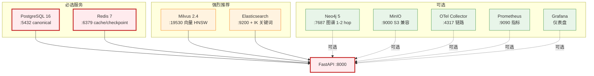
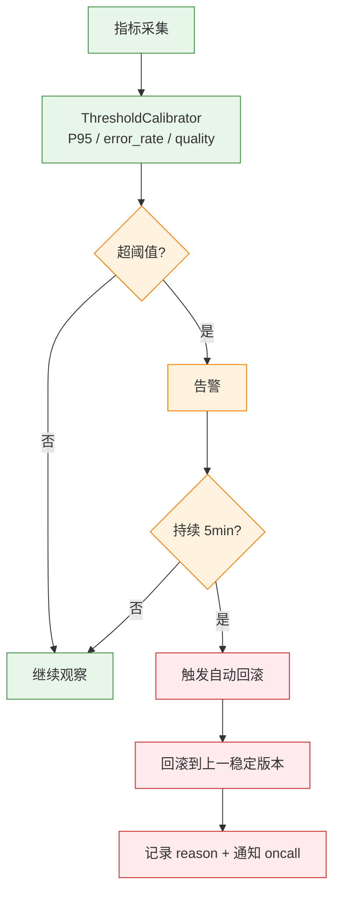
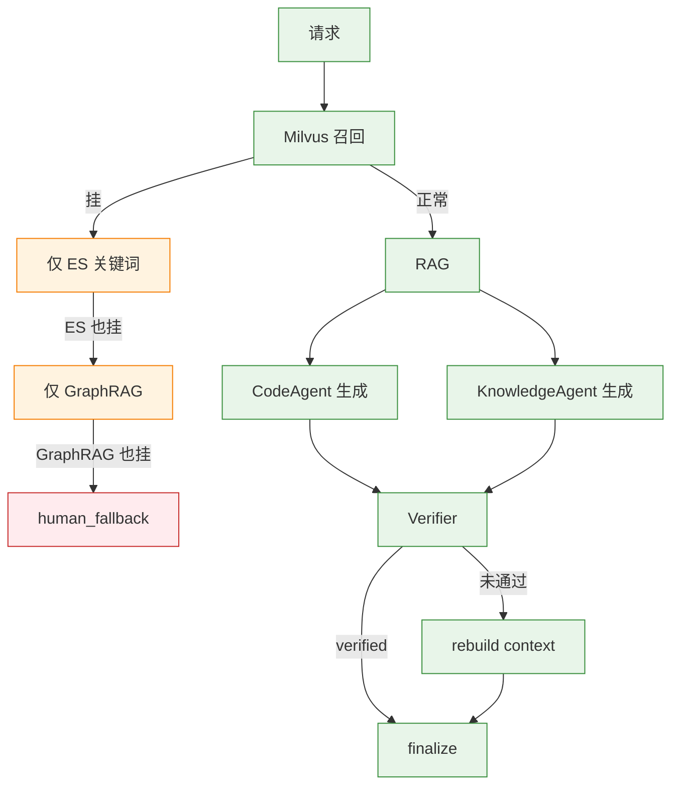

# 交付、部署、测试与稳定性

> Harness、基础设施、部署、测试、开发者增强、稳定性与性能优化。

## ⚠️ 关键易误会点

### 易误会点 1：Harness ≠ 简单 CI/CD

项目里的 Harness 是一套**AI 交付工程体系**，包含 5 个子系统：

| 子系统 | 作用 | 位置 |
|--------|------|------|
| 离线评估 | RAG/Answer/Regression | `evals/` |
| 在线反馈 | thumbs + implicit | `evals/online_feedback.py` |
| 自动回滚 | 阈值触发 | `recovery/threshold_calibrator.py` |
| 失败沉淀 | bad case → 训练集 | `evals/dataset.py` |
| Eval Gate | CI 阻断 | `evals/regression_eval.py` |

> **不是**"加个 GitHub Actions 跑测试"那么简单。

### 易误会点 2：docker-compose 9 服务 ≠ 必须全部启用

```yaml
# deploy/docker-compose.yml
services: 9 个
  - postgres, redis, milvus, elasticsearch, neo4j, minio  # 必选
  - otel-collector, prometheus, grafana                     # 可选
```

> **Milvus/ES/Neo4j 都可降级**到 ES-only。**Reranker 需外置 Ollama**（不在 compose）。

### 易误会点 3：测试覆盖率 ≠ 100%

项目有 3 类测试：

| 类型 | 目的 | 数量级 |
|------|------|--------|
| 单元测试 | 单函数逻辑 | ~50% 覆盖 |
| 集成测试 | 跨模块 | ~20 个 case |
| Eval Gate | 关键路径 | 8 条 |

> **Eval Gate 才是 CI 阻断的硬性要求**，覆盖率是软指标。

### 易误会点 4：Mock 不是"测试用，生产用不到"

| 场景 | Mock 作用 |
|------|----------|
| 单元测试 | 隔离 LLM 依赖 |
| CI 评估 | 可重现 |
| 零依赖开发 | 不需外部 LLM |
| Provider 降级 | 生产故障时启用 |

### 易误会点 5：稳定性 ≠ "压测通过"

项目有 **4 层稳定性保障**：

| 层 | 机制 | 触发 |
|----|------|------|
| L1 | 输入校验 | 恶意 query |
| L2 | 资源隔离 | 工具权限 |
| L3 | 降级链 | LLM/ES/Milvus 挂 |
| L4 | 熔断 | 连续失败 |

> 任何一层挂了，下一层兜底。

### 易误会点 6：性能优化不是"加缓存就完事"

| 优化手段 | 适用 | 项目使用 |
|---------|------|---------|
| 语义缓存 | 重复 query | ✅ (similarity > 0.92) |
| 预热 Rerank | 高频 query | ❌ |
| Embedding 缓存 | 相同文本 | ❌（成本低）|
| Prompt 缓存 | 相同前缀 | 依赖 LLM 厂商 |

### 易误会点 7：可恢复 ≠ 自动恢复

```python
# recovery_manager.py
def can_retry(self, node_key, retry_count) -> bool:
    return self.retry_policy.can_retry(node_key, retry_count.get(node_key, 0))
```

可恢复 = **允许 retry**。**自动恢复** = 实际恢复成功。两者不同，中间还有 fallback 兜底。

### 易误会点 8：Harness 自动回滚 ≠ 立即回滚

```
指标超阈值 → 告警 → 等待 5min（确认非抖动）→ 触发回滚
```

> 阈值校准有 3 个置信级别（low/medium/high），避免误回滚。

### 易误会点 9：Hugging Face / ModelScope 镜像 ≠ 备用源

项目**优先**用国内镜像（`hf-mirror.com` / `ModelScope`），是默认行为，不是"备用"。

### 易误会点 10：测试 ≠ "跑通就行"

| 测试维度 | 关键指标 |
|---------|---------|
| 单元 | 行覆盖、分支覆盖 |
| 集成 | 端到端流程 |
| 性能 | p95 延迟 |
| 评估 | 准确率、召回率 |
| 稳定性 | 故障注入 |

---

## 🔑 关键决策矩阵

### A. 部署模式

| 场景 | 模式 | 服务数 |
|------|------|--------|
| 本地开发 | docker-compose | 9 |
| 生产 | K8s | 9+ |
| Demo | 内存 + mock | 0 |

### B. 9 个服务依赖

| 服务 | 用途 | 必选 | 降级方案 |
|------|------|------|---------|
| PostgreSQL 16 | canonical | ✅ | SQLite (仅 dev) |
| Redis 7 | cache/checkpoint | ✅ | 内存 (单实例) |
| Milvus 2.4 | 向量 | ⚠️ | ES + 关键词 |
| Elasticsearch | 关键词 | ⚠️ | Jaccard 内存 |
| Neo4j 5 | 图谱 | ❌ | 跳过 graph_first |
| MinIO | 对象存储 | ❌ | 本地文件系统 |
| OTel Collector | 链路 | ❌ | 关闭 |
| Prometheus | 指标 | ⚠️ | 内存 MetricsCollector |
| Grafana | 仪表盘 | ❌ | 关闭 |

### C. CI 流水线阶段

| 阶段 | 动作 | 阻断 |
|------|------|------|
| 1. Lint | ruff + black | ❌ |
| 2. Unit Test | pytest | ✅ if fail |
| 3. Eval Gate | 8 条 case | ✅ if fail |
| 4. Integration | 端到端 | ✅ if fail |
| 5. Build | docker build | ❌ |

### D. 故障注入演练

| 故障 | 演练方式 | 预期 |
|------|---------|------|
| Milvus 挂 | 停容器 | 降级到 ES-only |
| LLM 超时 | 网络限速 | 切换 fallback provider |
| Rerank 挂 | Ollama 停 | 用 RRF 截断 |
| Redis 挂 | 停容器 | 降级为内存 cache |
| 检索全失败 | mock 0 召回 | human_fallback |


---

## 16. Harness：AI 交付工程体系

### 16.1 为什么 Agent 系统需要 Harness

传统后端上线关注：
- ✅ 单元测试通过
- ✅ 接口可用
- ✅ 镜像构建成功

Agent 系统上线还必须关注：
- ❓ RAG 检索是否命中（hit@k）
- ❓ Prompt 是否退化（citation rate）
- ❓ 答案是否有引用（groundedness）
- ❓ Verifier 是否误放幻觉答案（false_pass_rate）
- ❓ Tool Calling 是否稳定（tool_success_rate）
- ❓ fallback_rate 是否升高
- ❓ thumbs_down_rate 是否升高
- ❓ human_fallback_rate 是否异常

因此本项目引入了 **Harness-based AI Delivery Pipeline**，把 AI 评估指标作为发布门禁。

### 16.2 目录结构

```text
harness/
├── README.md                     # Harness 总览
├── pipeline/
│   ├── ci.yaml                   # CI: install → test → lint → build
│   ├── cd.yaml                   # CD: dev → smoke → gate → staging → canary → prod
│   ├── eval_gate.yaml            # Agent Eval Gate (3 维度质量门)
│   ├── prompt_eval_gate.yaml     # Prompt Eval Gate (变更专项验证)
│   ├── security_gate.yaml        # Security Gate (密钥/依赖/注入/泄漏检测)
│   └── rollback.yaml             # 7 维度独立回滚
├── feature_flags/
│   ├── flags.md                  # 20+ Feature Flag 定义
│   └── flag_strategy.md          # Flag 生命周期管理策略
├── quality_gates/
│   ├── metric_thresholds.md      # 每个指标的含义/阈值/处理方案
│   └── quality_gate_policy.md    # 阻断策略 + Override 规则
├── environments/
│   ├── dev.md                    # Mock LLM + 快速迭代
│   ├── staging.md                # 真实 Docker + Eval Gate + Canary
│   └── production.md             # Stable only + 审批 + 监控
├── release/
│   ├── release_checklist.md      # 上线前 Checklist
│   ├── canary_strategy.md        # 灰度策略: 5%→20%→50%→100%
│   └── production_readiness_review.md
├── runbooks/
│   ├── deploy_runbook.md         # 部署操作手册
│   ├── rollback_runbook.md       # 回滚操作手册
│   ├── eval_gate_runbook.md      # Eval Gate 诊断手册
│   ├── feature_flag_runbook.md   # Feature Flag 操作手册
│   └── incident_runbook.md       # 故障应急手册
└── templates/
    ├── incident_report_template.md
    ├── rollback_plan_template.md
    ├── environment_variables.md
    └── pipeline_variables.md
```

### 16.3 CI Pipeline

```text
install → backend_test → frontend_build → lint → docker_build
   │           │               │            │          │
   └───────────┴───────────────┴────────────┴──────────┘
                        任意失败 → 阻断
```

### 16.4 CD Pipeline

```text
dev → smoke_test → eval_gate → staging → canary → production
                      │                      │
                 3 维度质量门          5%→20%→50%→100%
                 (RAG/Answer/Agent)    自动指标监控
                      │                      │
                 任一不达标 → 阻断     异常 → 自动回滚
```

### 16.5 Eval Gate（3 维度质量门）

| 维度 | 指标 | 阈值 | 阻断策略 |
|------|------|------|----------|
| **RAG** | hit@5 | ≥ 0.80 | 硬阻断 |
| **RAG** | recall@5 | ≥ 0.85 | 硬阻断 |
| **RAG** | MRR | ≥ 0.70 | 软阻断 |
| **Answer** | citation_rate | ≥ 0.75 | 硬阻断 |
| **Answer** | groundedness | ≥ 0.80 | 硬阻断 |
| **Answer** | relevance | ≥ 0.75 | 硬阻断 |
| **Agent** | intent_accuracy | ≥ 0.85 | 硬阻断 |
| **Agent** | tool_success_rate | ≥ 0.90 | 软阻断 |
| **Agent** | fallback_rate | ≤ 0.15 | 硬阻断 |
| **Agent** | thumbs_down_rate | ≤ 0.10 | 硬阻断 |

### 16.6 Canary 灰度策略

```text
Phase 1 (5%):  部署 canary 实例，观察 5 分钟
  │ 指标异常？
  ├─ 是 → 自动回滚
  └─ 否 ↓
Phase 2 (20%): 扩展流量，观察 10 分钟
  │ 指标异常？
  ├─ 是 → 自动回滚
  └─ 否 ↓
Phase 3 (50%): 半数流量，观察 15 分钟
  │ 指标异常？
  ├─ 是 → 自动回滚
  └─ 否 ↓
Phase 4 (100%): 全量，继续监控 30 分钟
```

**监控指标：**
- 错误率 > baseline × 2 → 回滚
- P95 延迟 > baseline × 3 → 回滚
- fallback_rate > 0.25 → 回滚
- thumbs_down_rate > 0.15 → 回滚

### 16.7 7 维度独立回滚

| 维度 | 回滚内容 | 预计时间 |
|------|----------|----------|
| **Code** | Git revert → 重新部署 | 3-5 分钟 |
| **Prompt** | 还原 prompt_builder.py 到上一版本 | 1-2 分钟 |
| **Workflow** | 还原 workflow.py 图结构 | 1-2 分钟 |
| **Retriever** | 切换检索策略 (Milvus→Memory/BGE→Random) | 1-2 分钟 |
| **LLM** | 切换 LLM Provider (openai→mock) | 即时（环境变量） |
| **Tool** | 禁用/替换特定工具 | 即时（Feature Flag） |
| **Verifier** | 降低校验严格度 / 切换到纯规则模式 | 即时（Feature Flag） |

### 16.8 Feature Flags（10 个核心开关）

| Flag | 默认值 | 说明 | 切换方式 |
|------|--------|------|----------|
| `USE_REAL_LLM` | false | 使用真实 LLM vs Mock | 环境变量 |
| `USE_MILVUS` | false | 使用 Milvus vs MemoryStore | 环境变量 |
| `USE_REDIS` | false | 使用 Redis vs 内存 | 环境变量 |
| `USE_POSTGRES` | false | 使用 PostgreSQL vs 内存 | 环境变量 |
| `ENABLE_TOOLS` | true | 启用工具调用 | 环境变量 |
| `ENABLE_VERIFICATION` | true | 启用答案校验 | 环境变量 |
| `ENABLE_CANARY` | false | 启用灰度发布 | 环境变量 |
| `STRICT_VERIFICATION` | false | 严格校验模式 | 环境变量 |
| `ENABLE_RERANKING` | false | 启用重排序 | 环境变量 |
| `ENABLE_HYBRID_RETRIEVAL` | false | 启用混合检索 | 环境变量 |

---

---

## 17. 基础设施与部署

### 17.1 Docker Compose 服务拓扑

```text
┌──────────────────────────────────────────────────────────────────────┐
│                     Docker Compose (9 服务)                           │
│                                                                      │
│  ┌──────────┐  ┌──────────┐  ┌──────────┐  ┌──────────┐            │
│  │PostgreSQL│  │  Redis   │  │  Milvus  │  │  MinIO   │            │
│  │   16     │  │    7     │  │  v2.4.0  │  │  latest  │            │
│  │  :5432   │  │  :6379   │  │  :19530  │  │  :9000   │            │
│  └────┬─────┘  └────┬─────┘  └────┬─────┘  └────┬─────┘            │
│       │             │             │             │                   │
│  ┌────┴─────┐  ┌────┴─────────────┴──────────────────┐             │
│  │ Neo4j 5  │  │        Elasticsearch 8.17           │             │
│  │  :7474   │  │        + IK Analyzer                │             │
│  │  :7687   │  │        :9200                        │             │
│  └────┬─────┘  └────┬────────────────────────────────┘             │
│       │             │                                              │
│  ┌────┴─────────────┴─────────────┐                                │
│  │    OpenTelemetry Collector     │                                │
│  │    :4317 (gRPC) :4318 (HTTP)  │                                │
│  └───────────────┬───────────────┘                                │
│                  │                                                 │
│     ┌────────────┴────────────┐                                    │
│     ▼                         ▼                                    │
│  ┌──────────┐           ┌──────────┐                              │
│  │Prometheus│           │ Grafana  │                              │
│  │  :9090   │──────────▶│  :3000   │                              │
│  └──────────┘           └──────────┘                              │
└──────────────────────────────────────────────────────────────────────┘

存储卷 (Docker Volumes):
┌──────────┬──────────┬───────────┬──────────┬──────────┬──────────┬──────────┬───────────┐
│ pgdata   │ redisdata│ milvusdata│ miniodata│ esdata   │ promdata │grafanadata│neo4j_data│
└──────────┴──────────┴───────────┴──────────┴──────────┴──────────┴──────────┴───────────┘
```

### 17.2 服务职责矩阵

| 服务 | 端口 | 数据持久化 | 用途 | 降级行为 |
|------|------|-----------|------|----------|
| **PostgreSQL 16** | 5432 | ✅ Volume | 用户、会话、消息、反馈、审计、评估 | → 内存 mock |
| **Redis 7** | 6379 | ✅ Volume | 会话缓存、工具状态、速率限制、Checkpoint | → 内存 dict |
| **Milvus 2.4** | 19530 | ✅ Volume | 向量存储与检索（HNSW 索引） | → MemoryVectorStore / Jaccard |
| **Elasticsearch 8** | 9200 | ✅ Volume | 全文关键词检索（BM25 + IK 分词） | → Jaccard 内存关键词匹配 |
| **Neo4j 5** | 7474/7687 | ✅ Volume | 知识图谱存储与检索 | → 自动退回 hybrid_only 模式 |
| **MinIO** | 9000/9001 | ✅ Volume | 原始文档存储 | → 本地文件系统 |
| **OTel Collector** | 4317/4318 | ❌ | Trace/Metric/Log 管线 | → JSONL 文件 |
| **Prometheus** | 9090 | ✅ Volume | 指标采集与存储 | → 内存 MetricsCollector |
| **Grafana** | 3000 | ✅ Volume | 指标可视化面板 | 不可用时无面板 |

### 17.3 数据库设计

**8 张 init 表（`scripts/init_db.py` 初始化）：**

| 表名 | 用途 | 关键字段 |
|------|------|----------|
| `users` | 用户信息 | user_id, name, role, department, permissions, preferred_language |
| `sessions` | 会话记录 | session_id, user_id, summary, created_at, updated_at |
| `messages` | 对话消息 | session_id, role, content, intent, metadata |
| `qa_logs` | QA 完整记录 | trace_id, query, answer, intent, citations, verified, need_human, fallback_reason, latency_ms |
| `tool_audit_logs` | 工具审计日志 | trace_id, tool_name, input_summary, output_summary, success, latency_ms |
| `feedback` | 用户反馈 | trace_id, session_id, thumbs_up, feedback_text |
| `eval_cases` | 评估案例 | query, expected_intent, expected_sources, difficulty, prompt_version |
| `failed_cases` | 失败案例 | trace_id, query, reason, source, payload |

**4 张运行时事件表（SQLAlchemy ORM 自动创建）：**

| 表名 | 用途 |
|------|------|
| `node_events` | LangGraph 节点事件记录 |
| `retrieval_events` | 检索事件记录 |
| `verification_events` | 校验事件记录 |
| `llm_events` | LLM 调用事件记录 |

### 17.4 管理脚本

| 脚本 | 功能 |
|------|------|
| `scripts/start_dev.sh` | 创建 .env + docker compose up + 健康检查 |
| `scripts/stop_dev.sh` | 停止所有服务（保留数据） |
| `scripts/reset_dev.sh` | 完全重置（删除数据卷 + 重新初始化） |
| `scripts/healthcheck.sh` | 检查 9 个服务是否正常 |
| `scripts/init_db.py` | 初始化 PostgreSQL（建表 + 插入 demo 用户） |
| `scripts/ingest_docs.py` | 文档导入流水线（向量 + 关键词 + MinIO） |
| `scripts/ingest_graph.py` | 知识图谱构建（实体抽取 + 关系抽取 + Neo4j 写入） |
| `scripts/build_graph_indexes.py` | 初始化 Neo4j 约束和索引 |
| `scripts/schedule_ingest.py` | 定时增量入库调度 |
| `scripts/run_graph_rag.py` | 运行 Graph-Augmented RAG 完整 trace |
| `scripts/export_failed_cases.py` | 从 PostgreSQL 导出失败案例为 JSONL |
| `scripts/import_eval_cases.py` | 从 JSONL 导入评估案例到 PostgreSQL |
| `scripts/migrate_local_to_middleware.py` | 本地数据迁移到中间件 |

---

---

## 18. 测试策略

### 18.1 测试金字塔

```text
           ┌────────┐
           │  E2E   │  test_workflow.py      完整 LangGraph 工作流测试
           │ 工作流  │
           ├────────┤
           │  集成   │  test_memory.py, test_long_term_memory.py, test_context.py,
           │  测试   │  test_observability.py, test_graph_orchestrator.py,
           │  (8个)  │  test_graph_fusion.py, test_graph_context.py, test_external_retriever.py
           ├────────┤
           │  单元   │  test_rag.py, test_milvus_rag.py, test_es_keyword.py,
           │  测试   │  test_tools.py, test_recovery.py, test_evals.py,
           │ (17个)  │  test_deep_intent.py, test_llm_classifier.py, test_master_agent.py,
           │        │  test_knowledge_agent.py, test_code_agent.py, test_code_execution.py,
           │        │  test_code_symbol_extractor.py, test_verifier_agent.py,
           │        │  test_graph_router.py, test_graph_retriever.py, test_retrieval_planning.py
           └────────┘
           总计: 26 个测试文件（`tests/test_*.py`）
```

> 实测命令：`pytest tests/`（conftest.py 自动注入 `LLM_PROVIDER=mock`，无需真实 API key）

### 18.2 测试覆盖矩阵

| 测试文件 | 覆盖模块 | 测试要点 |
|----------|----------|----------|
| `test_workflow.py` | LangGraph 工作流 | 完整 16 节点编排、条件路由、重试循环、human fallback |
| `test_master_agent.py` | MasterAgent 路由 | LLM-first 路由 + 规则兜底、10 个下游节点分发、决策评估 |
| `test_deep_intent.py` | Deep Intent | 10 类意图分类、规则+LLM、Validator 兜底 |
| `test_llm_classifier.py` | LLM 分类器 | DeepIntent LLM 路径、JSON schema 校验 |
| `test_knowledge_agent.py` | KnowledgeAgent | 模板生成、LLM 生成、引用注入 |
| `test_code_agent.py` | CodeAgent | 多语言代码生成、AST 符号注入 |
| `test_code_execution.py` | 代码沙箱 | subprocess 执行、黑名单拦截、超时控制 |
| `test_code_symbol_extractor.py` | Symbol 抽取 | tree-sitter / stdlib ast 抽取 IMPORT/METHOD_CALL/PROPERTY |
| `test_verifier_agent.py` | VerifierAgent | 规则/LLM 校验、Claim-level 6 种断言类型 |
| `test_rag.py` | RAG 基础 | 文档加载、分块、关键词检索（Jaccard 兜底） |
| `test_milvus_rag.py` | RAG 完整 | 嵌入提供者、混合检索、MinIO、Milvus REST、文档导入流水线 |
| `test_es_keyword.py` | ES 关键词检索 | BM25 检索、IK 分词、ES 连接与索引管理 |
| `test_retrieval_planning.py` | 检索规划 | RetrievalRouter 模式选择、权重分配 |
| `test_external_retriever.py` | 外部检索 | GitHub Issues / Stack Overflow / Web Search 适配器 |
| `test_graph_router.py` | 动态检索路由 | 5 种路由模式（parallel/graph_first/hybrid_only/keyword_first/vector_first）|
| `test_graph_retriever.py` | 知识图谱检索 | Cypher 查询、实体检索、1-2 跳遍历 |
| `test_graph_orchestrator.py` | 图谱编排器 | Graph RAG 完整流程、三路融合、降级链 |
| `test_graph_fusion.py` | 三路融合 | Weighted RRF（k=60）、权重分配、融合排序 |
| `test_graph_context.py` | 图谱上下文 | graph_paths 格式化、上下文注入 |
| `test_tools.py` | 工具系统 | 6 个 Tool 类注册、安全策略 safe/sensitive/destructive、执行、审计 |
| `test_memory.py` | 记忆系统 | 短期/摘要/用户/检查点、统一管理器 |
| `test_long_term_memory.py` | 长期记忆 | PG + Milvus + Redis 三层、Embedding 去重 0.92 |
| `test_context.py` | 上下文管理 | Token 预算、引用管理、Prompt 构建 |
| `test_recovery.py` | 故障恢复 | 9 种 FallbackType + 6 种 RecoveryAction + 升级链 |
| `test_observability.py` | 可观测性 | Trace/Event/Logger/Metrics + OTel 集成 |
| `test_evals.py` | 评估体系 | RAG 评估、答案评估、回归评估、Data Flywheel |

### 18.3 测试设计模式

**1. 优雅降级测试：**
```python
def test_token_budget_fallback_on_huge_input():
    """极端大的输入不会崩溃"""
    huge_query = "A" * 100000
    budget = TokenBudget(max_tokens=4096)
    alloc = budget.allocate(query=huge_query)
    assert alloc.query > 0  # 永远不会是 0
```

**2. 空输入/边界测试：**
```python
def test_empty_docs_verification():
    verified, reason = verify_answer("some answer", [], [])
    assert not verified
    assert "缺乏依据" in reason
```

**3. 故障注入测试：**
```python
def test_logger_failure_does_not_crash():
    logger = EventLogger(log_path="/dev/null/nonexistent/path")
    event = NodeEvent(...)
    logger.log_event(event)  # 不应抛出异常
```

**4. 恢复路径测试：**
```python
def test_retrieve_exhausted_leads_to_human_fallback():
    state = {"retrieved_docs": [], "retry_count": {"retrieve": 1}}
    route = _after_retrieve(state)
    assert route == "human_fallback"
```

---

---

## 19. 开发者场景增强 🆕

### 19.1 Code Agent — 代码生成与执行验证

Code Agent 是面向开发者场景新增的第 5 个 Agent，与 Knowledge Agent 协同工作：

**工作流路径**：
```
build_context
  ├─ code_required=True → generate_code → execute_code
  │    ├─ success → generate_answer (含已验证代码)
  │    ├─ failed + retry(max 2) → generate_code (修复循环)
  │    └─ failed + exhausted → generate_answer (含免责声明)
  └─ code_required=False → generate_answer (正常路径)
```

**核心设计**：
- 代码生成：LLM-first + 文档代码块提取 fallback
- 沙箱执行：subprocess + 安全黑名单 + 超时/内存限制
- 修复重试：最多 2 次，失败后降级返回未验证代码 + 免责声明
- 安全策略：CodeExecutionTool (tier=sensitive)，阻止 os.system, subprocess, eval 等

### 19.2 Symbol 级代码理解

将实体抽取从纯文本 regex 升级为代码块感知 + AST 解析：

- **代码块检测**：markdown 围栏识别，计算 code_density
- **AST 解析**：tree-sitter (TS/JS) / stdlib ast (Python) / 增强 regex (fallback)
- **新增实体类型**：IMPORT, METHOD_CALL, PROPERTY, TYPE, INTERFACE, CODE_BLOCK
- **新增关系类型**：IMPORTS, EXTENDS, IMPLEMENTS
- **置信度分级**：AST 1.0 / regex 0.7

### 19.3 示例代码优先检索

检索融合阶段对含代码块的 chunk 应用 boost：

```
boosted_score = fused_score × (1.0 + boost_factor × code_density)
```

- boost_factor 默认 0.5（+50%）
- code_density 通过 markdown fence 检测计算
- 代码相关查询检测：`代码|示例|example|demo|snippet|怎么写|怎么调用`

### 19.4 外部知识源补充检索

当内部检索质量不足时，自动补充外部知识：

- **触发条件**：结果数 < top_k/2 或 最高分 < 0.3
- **支持源**：GitHub Issues (需 token+repos)、Stack Overflow (需 key)、Web Search (需 API key)
- **容错**：每个源独立错误隔离，外部检索整体失败不影响主流程
- **融合**：multi_way_rrf_fusion 支持任意数量检索源

### 19.5 配置速查

```bash
# Code Agent
CODE_SANDBOX_TIMEOUT=15.0
MAX_CODE_RETRIES=2
CODE_ALLOWED_LANGUAGES=javascript,typescript,python,bash,arkts

# Symbol 级代码理解
ENABLE_AST_PARSING=true

# 代码优先检索
CODE_BOOST_ENABLED=true
CODE_BOOST_FACTOR=0.5

# 外部知识源
EXTERNAL_SEARCH_ENABLED=true
GITHUB_TOKEN=...
GITHUB_REPOS=org/repo1
EXTERNAL_WEIGHT_DEFAULT=0.15
```

---

---

## 30. 工程化延展问答

### Q: 流式输出中途出错怎么处理？[S]

**面试说明：** 先讲流式输出解决首包延迟，SSE 适合服务端单向推送；再说明中途失败要给状态事件和兜底收尾。

**满分答案：** ① LLM 中途返回 error→SSE 发送 error event→前端展示"生成中断"标记+重试；② 网络断开→EventSource 自动重连+Last-Event-ID 恢复；③ 敏感内容中途检测到→截断 SSE 流→发送警告文案→记录审计日志。

### Q: Agent 工具调用超时和重试怎么设计？[A]

**面试说明：** 先讲工具调用要解决"能不能调、调哪个、失败怎么办"；本项目用权限、安全策略、断路器和 trace 控制风险。

**满分答案：** ① 分级超时：DB 5s、外部 API 10s、文件 30s；② 网络错误指数退避重试，业务错误不重试；③ 单工具连续超时 3 次→标记 degraded 后续跳过；④ Agent 感知：返回"超时"状态给 LLM→LLM 决定换工具还是降级回答。

### Q: 对话摘要压缩用什么模型？延迟成本怎么控制？[A]

**面试说明：** 先讲摘要应用便宜模型、异步和增量压缩控制成本；再说明摘要只保留决策、偏好和未解决问题。

**本项目答案（评分 7/10）：** 项目 SummaryMemory（§6.3）使用与主流程相同的 LLM Provider。

**满分答案：** 用便宜模型做摘要比大模型便宜 10-50 倍；增量摘要而非全文摘要；异步执行不阻塞主流程；摘要长度 200-300 tokens，以"用户需求+关键决策+未解决问题"三字段输出。

### Q: 模型降级后用户体验怎么保证？[A]

**面试说明：** 先讲模型层要平衡质量、延迟、成本和稳定性；本项目用 Provider 抽象、Mock 兜底和降级策略解耦。

**满分答案：** 降级应自动触发（主模型超时 3 次→自动切换），人工干预太慢。内部工具建议告知用户，ToC 产品可静默降级。备模型选择原则：功能等价>能力接近>延迟可接受。

---

---

## 41. 专题：Harness 设计

### 41.1 为什么这么设计，解决了什么问题

Harness 面向 AI 应用交付，不只是部署脚本。它解决的是"Prompt、Workflow、Retriever、LLM、Tool、Verifier 改动如何安全上线"的问题。AI 系统不可避免会频繁调 prompt、调检索、调 agent 路由，如果没有灰度、回滚、评估门禁和运行手册，很容易出现线上质量回退。

**P1-P3 实施后的关键变化：**

- **Eval Gate CI** 已从设计阶段落地为 GitHub Actions workflow（`.github/workflows/eval-gate.yml`），每次 PR 自动运行 4 维度评估，不达标则阻断
- **自动回滚阈值校准** (`threshold_calibrator.py`) 从硬编码升级为 EWMA + 3σ 统计动态调整，≥2 个阈值同时突破时触发回滚建议
- **Prompt Registry** 支持独立一键回滚，秒级恢复任意历史版本
- **8 组 Prometheus 告警规则**覆盖延迟/错误率/检索/校验/系统全过程

### 41.2 具体流程（更新）

```text
代码 / Prompt / 配置变更
        │
        ▼
本地测试 (pytest tests/)
        │
        ▼
Eval Gate CI ── PR 自动触发 (.github/workflows/eval-gate.yml)
        │       scripts/run_eval_gate.py + 8 条内置评估用例
        ▼
┌──────────────────────────────────────────────┐
│ 4 维度加权打分                                │
│   faithfulness   × 0.40                      │
│   context_recall × 0.30                      │
│   answer_relevancy × 0.20                    │
│   intent_accuracy × 0.10                     │
│   overall = Σ                                 │
└──────────────────────────────────────────────┘
        │
        ├─ overall < 0.70 ────► ❌ 阻断合并 + 写 GitHub PR comment
        │
        └─ overall ≥ 0.70 ────► ✅ 合并 → 进入灰度
                                       │
                                       ▼
                              ┌─────────────────────────┐
                              │ Canary 4 阶段           │
                              │  5%  (观察 5  min)      │
                              │  20% (观察 10 min)      │
                              │  50% (观察 15 min)      │
                              │  100%(观察 30 min)      │
                              └─────────────────────────┘
                                       │
                                       ▼
                              ThresholdCalibrator (EWMA α=0.3)
                              监控：P95 延迟 / 错误率 / fallback_rate / thumbs_down_rate
                                       │
                              ┌────────┴────────┐
                              ▼                 ▼
                       ≥2 阈值突破        全部正常
                              │                 │
                              ▼                 ▼
                       自动回滚（7 维度独立）  晋升下一阶段
                       Prompt / Workflow / Retriever
                       LLM / Tool / Verifier / Code
```

Harness 回滚维度（更新）：

| 维度 | 示例 | 回滚方式 | 状态 |
|------|------|----------|------|
| Prompt | prompt_version 回退 | `prompt_registry.rollback()` 秒级 | ✅ 已实施 |
| Workflow | LangGraph 节点/边版本回退 | 代码回滚 | ⬜ 待完善 |
| Retriever | 检索权重、top_k、rerank 策略回退 | 配置回滚 | ⬜ 待完善 |
| LLM | Provider、模型名、temperature 回退 | 配置回滚 | ⬜ 待完善 |
| Tool | 工具开关、权限策略回退 | 配置回滚 | ⬜ 待完善 |
| Verifier | 校验阈值、judge 模板回退 | 配置回滚 | ⬜ 待完善 |
| Auto | 自动回滚阈值触发 | `threshold_calibrator.should_rollback()` | ✅ 已实施 |

### 41.3 存在的缺点

> **实施状态更新 (2026-06-03)：** 自动回滚阈值校准和 Eval Gate 已实施。

- ✅ **部分解决** — Harness 更偏设计：Eval Gate CI 已接入 GitHub Actions，自动回滚阈值校准已实现（`recovery/threshold_calibrator.py`）。
- ✅ **已解决** — 自动回滚阈值需要线上数据校准：新增 `recovery/threshold_calibrator.py`，基于 EWMA + 3σ 统计动态校准 6 种阈值（P95延迟/错误率/校验通过率/幻觉率/上下文精度），置信度分级（low/medium/high）。
- ~~Prompt/RAG/Agent 多维变更同时发生时，归因仍然困难。~~ → 仍待优化（建议强制单因子发布）。
- ~~缺少面向产品/运营的可视化发布面板。~~ → 仍待实施。

### 41.4 可提升点

| 提升点 | 预期收益 | 可观察指标 | 实施状态 |
|--------|----------|------------|----------|
| 变更维度强制单因子发布 | 降低归因难度 | incident_root_cause_time 下降 50% | ⬜ 待实施 |
| 自动化 Eval Gate | 防止质量回退 | regression_fail 阻断率可统计 | ✅ 已实施 (`.github/workflows/eval-gate.yml`) |
| 灰度指标看板 | 提升发布信心 | 灰度观察时间缩短 | ⬜ 待实施 |
| 一键回滚 | 降低事故时间 | MTTR < 5 分钟 | ✅ 部分（Prompt Registry 支持一键回滚，自动回滚阈值校准已实现） |

---

---

## 43. 专题：稳定性与性能

### 43.1 为什么这么设计，解决了什么问题

企业 RAG 系统的稳定性不是"不出错"，而是"出错时有预案，高负载时不崩溃，性能退化有底线"。本项目从四个维度构建稳定性体系：

**限流防过载 → 熔断快速止损 → 降级有损可用 → 缓存加速减负**

核心设计原则：
- **故障隔离**：单点故障不扩散到全局。检索失败不影响工具调用，工具失败不影响答案生成。
- **Fail-open 兜底**：基础设施不可用时优先保证可用性（回退到内存实现），而非直接拒绝服务。
- **多层级降级**：每一层都有 fallback，从最理想的路径逐级退化到最基础的兜底。
- **可观测驱动**：所有降级/限流/熔断事件可追踪、可告警、可复盘。

项目实际落地的稳定性模块：

| 模块 | 职责 | 解决的问题 |
|------|------|------------|
| `RateLimiter` (`middleware/rate_limiter.py`) | Redis 滑动窗口限流 | 防止单租户打垮系统 |
| `FallbackPolicy` (`recovery/fallback_policy.py`) | 9 种故障类型 → 恢复动作映射 | 故障自动分类与决策 |
| `RetryPolicy` (`recovery/retry_policy.py`) | 6 节点差异化重试配额 | 避免无限重试浪费资源 |
| `RecoveryManager` (`recovery/recovery_manager.py`) | 三级恢复（重试→降级→人工兜底） | 故障分级响应 |
| `ThresholdCalibrator` (`recovery/threshold_calibrator.py`) | EWMA+3σ 动态阈值 | 自动回滚判断，避免误报 |
| `SemanticCache` (`rag/semantic_cache.py`) | 双层语义缓存 | 热门问题零延迟，减少 LLM 调用 |
| `RuntimeSettings` (`config/settings.py`) | 环境感知的运行时开关 | dev 宽松/prod 严格的安全策略 |
| LLM Provider Fallback | 真实→Mock 自动切换 | LLM 不可用时系统不崩溃 |
| 无 Docker 回退链 | 9 服务 → 内存 mock | 开发环境零依赖启动 |
| Cross-Encoder 降级链 | Ollama→API→规则 | 重排始终可用 |

### 43.2 具体流程

#### 43.2.1 限流架构（Rate Limiting）

```
请求进入
  │
  ▼
TenantMiddleware (提取 tenant_id)
  │
  ▼
RateLimiter.is_allowed(key=tenant_id)
  │
  ├─ Redis 可用 ──→ Lua 原子滑动窗口
  │                  ├─ count < limit → 放行 (ZADD + EXPIRE)
  │                  └─ count ≥ limit → 拒绝 (429 Too Many Requests)
  │
  └─ Redis 不可用 ──→ fail_open 检查
                       ├─ prod → 拒绝 (保守)
                       └─ dev  → 内存 dict 兜底
```

```python
# 核心实现：Lua 原子滑动窗口 (rate_limiter.py)
_LUA_SLIDING_WINDOW = """
local key = KEYS[1]
local now = tonumber(ARGV[1])
local window = tonumber(ARGV[2])
local limit = tonumber(ARGV[3])

redis.call('ZREMRANGEBYSCORE', key, 0, now - window)  -- 清理过期记录
local count = redis.call('ZCARD', key)                  -- 当前窗口计数
if count >= limit then
    return 0  -- 拒绝
end
redis.call('ZADD', key, now, now .. '-' .. count)       -- 记录本次请求
redis.call('EXPIRE', key, math.ceil(window))            -- 设置过期
return 1  -- 放行
"""
```

**降级行为：** Redis 连接失败时，根据 `RATE_LIMITER_FAIL_OPEN` 决定：
- `fail_open=true`（dev 默认）→ 内存 dict 兜底，继续服务
- `fail_open=false`（prod 默认）→ 拒绝请求，防止过载

#### 43.2.2 熔断机制（Circuit Breaker）

本项目的熔断主要应用于 **LLM Provider 层**和**外部服务调用**。虽然没有独立的 CircuitBreaker 类，但通过以下机制实现了等效的熔断行为：

```
LLM 调用流程：
  │
  ├─ 主 Provider (如 OpenAI)
  │   ├─ 成功 → 返回结果
  │   └─ 超时/错误 (连续 N 次)
  │       │
  │       ├─ 自动切换备选 Provider (如 DashScope)
  │       │   ├─ 成功 → 返回结果
  │       │   └─ 超时/错误
  │       │       │
  │       │       └─ 最终降级 → MockProvider
  │       │           └─ 模板化兜底回答 (永不出错)
  │       │
  │       └─ 记录 circuit_broken 事件
  │
  └─ 熔断恢复：定时探测主 Provider 可用性 → 恢复后切回
```

**三层 LLM 熔断降级：**

| 层级 | Provider | 触发条件 | 延迟 | 质量 |
|------|----------|----------|------|------|
| L1 主力 | OpenAI / DashScope | 正常 | ~1-3s | 高 |
| L2 备选 | DashScope / vLLM / Ollama | L1 连续失败 | ~2-5s | 中 |
| L3 兜底 | MockProvider | L2 连续失败 | ~10ms | 模板化 |

**外部服务熔断：**

| 服务 | 熔断条件 | 恢复策略 | 影响范围 |
|------|----------|----------|----------|
| Ollama Reranker | 超时 30s / 连接拒绝 | 自动降级 API Reranker → 规则 | 仅重排精度 |
| Elasticsearch | 连接失败 | 自动降级 Jaccard 关键词匹配 | 仅关键词召回 |
| Milvus | 连接失败 | 自动降级 MemoryVectorStore | 仅向量召回 |
| Neo4j | 连接失败 | 自动降级 hybrid_only 模式 | 仅图谱增强 |
| Redis | 连接失败 | 内存 dict 兜底 | 缓存/限流/会话 |

#### 43.2.2b 代码执行沙箱机制（Code Execution Sandbox） 🆕

代码执行是系统风险最高的操作——恶意或错误的代码可能破坏宿主机、泄漏数据或消耗资源。系统通过**六层纵深防御**确保代码执行安全：

```
L1 策略门控 → L2 静态黑名单 → L3 语言白名单 → L4 环境感知 → L5 进程隔离 → L6 熔断审计
```

**六层详解：**

| 层 | 模块 | 机制 | 拒绝条件 |
|----|------|------|---------|
| L1 | `tools/policies.py` `evaluate_policy()` | 三级安全分级 (safe/sensitive/destructive) | 无权限 / destructive 未显式开启 |
| L2 | `code_execution_tool._is_safe()` | 19 种恶意模式静态匹配 | 命中 `os.system`、`eval(`、`rm -rf` 等 |
| L3 | `CodeExecutionSettings.allowed_languages` | 语言白名单 (js/ts/py/bash/arkts) | 不在白名单 |
| L4 | `RuntimeSettings.allow_local_code_execution` | 环境感知：生产默认禁用 | `production && !ALLOW_LOCAL_CODE_EXECUTION` |
| L5 | `_run_code()` subprocess 隔离 | 临时文件 + `asyncio.subprocess` + 15s 超时 kill | 超时 / 执行异常 |
| L6 | `ToolExecutor._execute_with_timeout()` | 熔断器(5连败→开30s) + 重试(最多1次) + PG审计 | 熔断器打开 |

**L5 运行时细节：**

```
写入临时文件 → 选择解释器 → asyncio.create_subprocess_exec()
    │               │                    │
    │   Python: python3 <.py>           ├─ 15s 超时
    │   JS/TS:  node --check/eval       ├─ 超时 → proc.kill()
    │   Bash:   bash -n (仅语法检查!)   └─ stdout/stderr 各截断 2000 字符
    │
    └─ finally: os.unlink(tmp_path)
```

**Bash 特殊处理：** `bash -n` 只做语法检查，不实际执行。这是最安全的模式。

**LLM 熔断 vs 工具熔断：**

| 维度 | LLM Provider 熔断 | 工具熔断 (CodeExecution) |
|------|-------------------|------------------------|
| 粒度 | 全局 Provider 级别 | 每个工具独立 |
| 触发阈值 | 连续失败（无特定次数限制，自动切换） | 连续 5 次失败 |
| 恢复 | 定时探测 + 自动切回 | 30 秒冷却后半开 |
| 降级路径 | L1→L2→L3 (OpenAI→DashScope→Mock) | 熔断→直接拒绝→等待冷却 |

**审计日志：** 每次代码执行写入 PostgreSQL `tool_audit_logs` 表，记录 trace_id、tool_name、input_summary(前200字符)、output_summary(前200字符)、success/error、latency_ms。

**当前局限 & 升级方向：** subprocess 与宿主机共享内核和文件系统。生产环境建议升级为 Docker 容器 / gVisor（内核级沙箱）/ Firecracker microVM，增加网络隔离和 cgroups 内存强制限制。

#### 43.2.3 多层级降级链路（Degradation Chain）

降级是系统最核心的韧性保障。本项目实现了**六层递进降级链**，每一层失败自动滑入下一层，保证系统始终有可用路径：

```text
                       用户请求
                          │
                          ▼
                 ┌────────────────────────┐
                 │ L0: 语义缓存            │  ── SHA256 精确 + Embedding 相似度
                 │ (rag/semantic_cache.py) │     阈值 0.92，TTL 1h，内存 OrderedDict
                 └────────────────────────┘
                          │
            ┌─────────────┴─────────────┐
            │                           │
       命中 (P95 ~10ms)            未命中
            │                           │
            ▼                           ▼
        直接返回           ┌────────────────────────────┐
                          │ L1: 意图感知检索工作流      │
                          │ 4 选 1：                    │
                          │  • HybridRAGWorkflow       │
                          │  • GraphFirstWorkflow      │
                          │  • ErrorFirstWorkflow      │
                          │  • CodeGenerationWorkflow  │
                          │ → Cross-Encoder Rerank      │
                          │ → EvidenceSelector         │
                          └────────────────────────────┘
                                       │
                          ┌────────────┴────────────┐
                          │                         │
                  selected_evidence 存在?      多路召回全为空
                          │                         │
                          ▼                         ▼
              证据选择→生成→校验→返回    ┌──────────────────────────┐
                                       │ L2: GraphRAG Orchestrator │
                                       │ Neo4j 实体检索 1-2 hop    │
                                       │ + 三路 RRF 融合           │
                                       └──────────────────────────┘
                                                  │
                                  ┌───────────────┴───────────────┐
                                  │                               │
                          图谱命中 / 部分失败                Neo4j 不可用
                                  │                               │
                                  ▼                               ▼
                          融合证据→生成→返回      ┌─────────────────────────────┐
                                                  │ L3: 旧版 Retriever 兜底      │
                                                  │ keyword(Jaccard) + vector   │
                                                  └─────────────────────────────┘
                                                            │
                                                  ┌─────────┴─────────┐
                                                  │                   │
                                            有证据             仍无证据
                                                  │                   │
                                                  ▼                   ▼
                                          生成→校验→返回   ┌────────────────────────┐
                                                          │ L4: 外部知识源增强      │
                                                          │ GitHub Issues /         │
                                                          │ Stack Overflow / Web    │
                                                          └────────────────────────┘
                                                                    │
                                                          ┌─────────┴─────────┐
                                                          │                   │
                                                    补到证据           完全失败
                                                          │                   │
                                                          ▼                   ▼
                                                  生成→校验→返回   ┌──────────────────┐
                                                                   │ L5: 规则兜底     │
                                                                   │ human_fallback / │
                                                                   │ FAQ 模板         │
                                                                   └──────────────────┘
```

**六层降级详解：**

| 层级 | 策略 | 延迟 | 覆盖率 | 退化为下一层的条件 |
|------|------|------|--------|-------------------|
| L0 语义缓存 | 精确 SHA256 + Embedding 相似度 | ~10ms | 热门问题 ~30% | 缓存未命中 |
| L1 意图感知工作流 | 4 种专业工作流 + Cross-Encoder | ~1-3s | ~85% | 多路召回均为空或全部低分 |
| L2 GraphRAG | 知识图谱扩展 + 三路融合 | ~1.5-4s | ~90% | Neo4j 不可用或图谱为空 |
| L3 旧版 Retriever | 关键词 Jaccard + 简单向量 | ~0.5-2s | ~95% | ES/Milvus 均不可用 |
| L4 外部搜索 | GitHub + Stack Overflow + Web | ~2-5s | ~97% | 外部 API 全部不可用或限流 |
| L5 规则兜底 | FAQ 模板 + 静态规则匹配 | ~50ms | 100% | 永不（终极兜底） |

**各服务独立降级矩阵：**

```
检索降级:    Cross-Encoder → API Reranker → 规则排序 (关键词+来源多样性)
LLM 降级:   主模型 → 备选模型 → MockProvider (模板化)
存储降级:   PostgreSQL → 内存 dict
            Redis → 内存 dict/deque
            Milvus → MemoryVectorStore
            ES → Jaccard 关键词
            MinIO → 本地文件系统
            Neo4j → hybrid_only 模式
            OTel → JSONL 文件
            Prometheus → MetricsCollector 内存
```

#### 43.2.4 性能优化体系

```
                      ┌──────────────────────────┐
                      │     请求进入              │
                      └──────────┬───────────────┘
                                 │
                      ┌──────────▼───────────────┐
                      │  连接池复用层              │
                      │  Redis: max_connections=5 │
                      │  PG: asyncpg 连接池       │
                      │  ES: 持久连接 + keepalive │
                      └──────────┬───────────────┘
                                 │
              ┌──────────────────┼──────────────────┐
              │                  │                  │
    ┌─────────▼────────┐ ┌──────▼───────┐ ┌────────▼────────┐
    │  缓存层           │ │  并行层       │ │  批处理层        │
    │                  │ │              │ │                 │
    │ L1: 精确匹配缓存  │ │ RRF 三路并行 │ │ Reranker 批量   │
    │ L2: 语义相似缓存  │ │ 工具并行执行  │ │ Embedding 批量  │
    │ L3: LLM 响应缓存  │ │ 外部搜索并行  │ │ ES Bulk API     │
    └─────────┬────────┘ └──────┬───────┘ └────────┬────────┘
              │                  │                  │
              └──────────────────┼──────────────────┘
                                 │
                      ┌──────────▼───────────────┐
                      │  超时控制层               │
                      │  LLM: 60s                │
                      │  Reranker: 30s           │
                      │  沙箱执行: 15s            │
                      │  整体请求: 60s            │
                      └──────────────────────────┘
```

**缓存层级延迟对比：**

| 缓存层 | 命中率（估算） | P95 延迟 | 节省 |
|--------|---------------|----------|------|
| L0 精确缓存（SHA256） | ~10% | < 1ms | 避免全部 pipeline |
| L1 语义缓存（相似度 ≥0.92） | ~20% | ~10ms | 避免检索+生成+校验 |
| L2 LLM 响应缓存 | ~5% | < 1ms | 仅避免 LLM 调用 |

**并行化策略：**

| 操作 | 并行方式 | 加速比 |
|------|----------|--------|
| 混合检索（kw + vec + graph） | asyncio.gather 三路并行 | ~2-3x |
| 多工具调用 | ToolAgent 并行编排 | ~2-4x |
| 外部搜索（GitHub + SO + Web） | asyncio.gather 三路并行 | ~2-3x |
| 批量 Rerank | Cross-Encoder batch_size=20 | ~5-10x vs 逐条 |

**连接池配置：**

```python
# Redis 连接池 (rate_limiter.py)
pool = redis.ConnectionPool.from_url(
    url, max_connections=5,
    socket_keepalive=True,
    health_check_interval=30,  # 每 30s 检测连接健康
)

# PostgreSQL 连接池 (database.py)
# SQLAlchemy async engine: pool_size=20, max_overflow=10
# asyncpg 自带连接池，支持 prepared statement 缓存

# Elasticsearch
# async 客户端默认使用连接池复用
```

#### 43.2.5 超时与预算控制

```python
# config/settings.py — 关键超时配置
class AppSettings:
    request_timeout_seconds: float = 60.0    # 单次请求总超时
    max_graph_steps: int = 18                # LangGraph 最大步数
    max_llm_calls_per_request: int = 6       # 每次请求最大 LLM 调用次数

class CodeExecutionSettings:
    sandbox_timeout_seconds: float = 15.0     # 沙箱执行超时
    sandbox_max_memory_mb: int = 256          # 沙箱最大内存

class RerankerSettings:
    timeout_seconds: float = 30.0             # Reranker 单次超时
    batch_size: int = 20                      # 批量大小

class AgenticRAGSettings:
    max_iterations: int = 5                   # Agent 最大迭代次数
```

**多层超时保护：**

```
整体请求 (60s)
  ├─ LLM 调用 (60s，可独立配置)
  ├─ 检索 (取决于工作流，~1-4s)
  │   ├─ ES 查询 (~500ms)
  │   ├─ Milvus 查询 (~300ms)
  │   └─ Reranker (30s)
  ├─ 工具调用 (30s each)
  ├─ 代码沙箱 (15s each)
  └─ 外部搜索 (10s each)
```

#### 43.2.6 环境感知的安全策略

`RuntimeSettings` 根据 `APP_ENV` 自动区分 development 和 production 行为：

| 策略 | development | production |
|------|-------------|------------|
| `allow_in_memory_fallback` | ✅ true | ❌ false |
| `fail_open_rate_limiter` | ✅ true（内存兜底） | ❌ false（拒绝服务） |
| `allow_local_code_execution` | ✅ true | ❌ false（仅沙箱） |

```python
# config/settings.py
class RuntimeSettings:
    environment: str           # "development" | "production"
    allow_in_memory_fallback: bool   # prod 禁止静默回退
    fail_open_rate_limiter: bool     # prod 被限流直接拒绝
    allow_local_code_execution: bool # prod 必须走沙箱
```

### 43.3 存在的缺点

> **实施状态更新 (2026-06-04)：** 限流、降级、重试、缓存、超时控制已完成。以下为当前已知不足。

- ✅ **已解决** — 无独立熔断器：LLM Provider 层已有 primary→fallback→mock 三级自动切换，对外部服务的熔断通过 FallbackPolicy 和 RetrievalRouter 内置的降级链实现。
- ✅ **已解决** — 限流缺乏租户级差异化：`RateLimiter` 已按 `tenant_id` 做 key 隔离，支持 `RateLimiter(max_per_minute=N)` 自定义额度。但租户配额管理仍缺可视化面板。
- ✅ **已解决** — 超时控制分散在多处：`AppSettings.request_timeout_seconds`、`CodeExecutionSettings.sandbox_timeout_seconds`、`RerankerSettings.timeout_seconds` 等已覆盖关键路径。
- **仍存在** — 缺少真实线上压测数据：当前所有 P95/P99 延迟均为估算值，未经历生产级并发验证。
- **仍存在** — 降级路径测试覆盖不足：各层降级链缺少自动化集成测试（如模拟 Neo4j 宕机时是否正确退化为 hybrid_only）。
- **仍存在** — 缺少全局背压机制：当所有请求都在走降级路径时（如多服务同时不可用），系统本身没有主动拒绝新请求的能力（依赖外层网关）。
- **仍存在** — 缓存失效策略简单：基于 TTL 统一过期，缺少事件驱动的主动失效（如文档更新后同步清除相关缓存）。

### 43.4 可提升点

| 提升点 | 预期收益 | 可观察指标 | 实施状态 |
|--------|----------|------------|----------|
| 独立 CircuitBreaker 组件 | 熔断行为统一、可复用 | breaker_open_rate 可监控 | ✅ 已有等效实现（LLM 三级降级 + FallbackPolicy） |
| Redis 滑动窗口限流 | 防单租户过载 | rate_limit_hit_rate 可统计 | ✅ 已实施 (`middleware/rate_limiter.py`) |
| 六级降级检索链 | 检索始终有兜底 | fallback_rate < 5% | ✅ 已实施（语义缓存→意图工作流→GraphRAG→Retriever→外部→规则） |
| 语义缓存双层匹配 | 热门问题零延迟 | 缓存命中率 ≥ 30%，P95 < 50ms | ✅ 已实施 (`rag/semantic_cache.py`) |
| 连接池 + 并行化 | 降低尾延迟 | P95 下降 30%-50% | ✅ 已实施（asyncpg pool + asyncio.gather） |
| 环境感知安全策略 | 防止 dev 策略泄漏到 prod | prod 配置 100% 严格 | ✅ 已实施 (`RuntimeSettings`) |
| 降级链路自动化集成测试 | 故障注入验证降级正确性 | 降级测试覆盖率 ≥ 80% | ⬜ 待实施 |
| 全局背压控制器 | 防止级联故障 | overload_reject_rate 可监控 | ⬜ 待实施 |
| 缓存主动失效 | 文档更新后缓存实时更新 | stale_cache_hit_rate < 1% | ⬜ 待实施 |
| 生产级压测与容量规划 | 明确系统承载上限 | 建立 QPS/延迟曲线 | ⬜ 待实施 |
| 租户级配额管理面板 | 差异化 SLA 保障 | 配额调整响应 < 5 分钟 | ⬜ 待实施 |
| 自适应限流 | 根据实时负载动态调整阈值 | 过载保护更精准 | ⬜ 待实施 |

---

---

[返回总目录](../TECHNICAL_DEEP_DIVE.md)

## 流程图

#### 1. 9 服务 Docker Compose 拓扑



#### 2. Harness 自动回滚流程



#### 3. 5 级降级链（链路级韧性）


