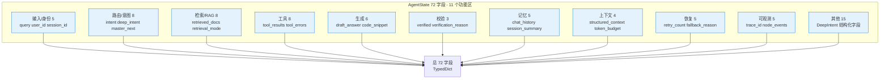
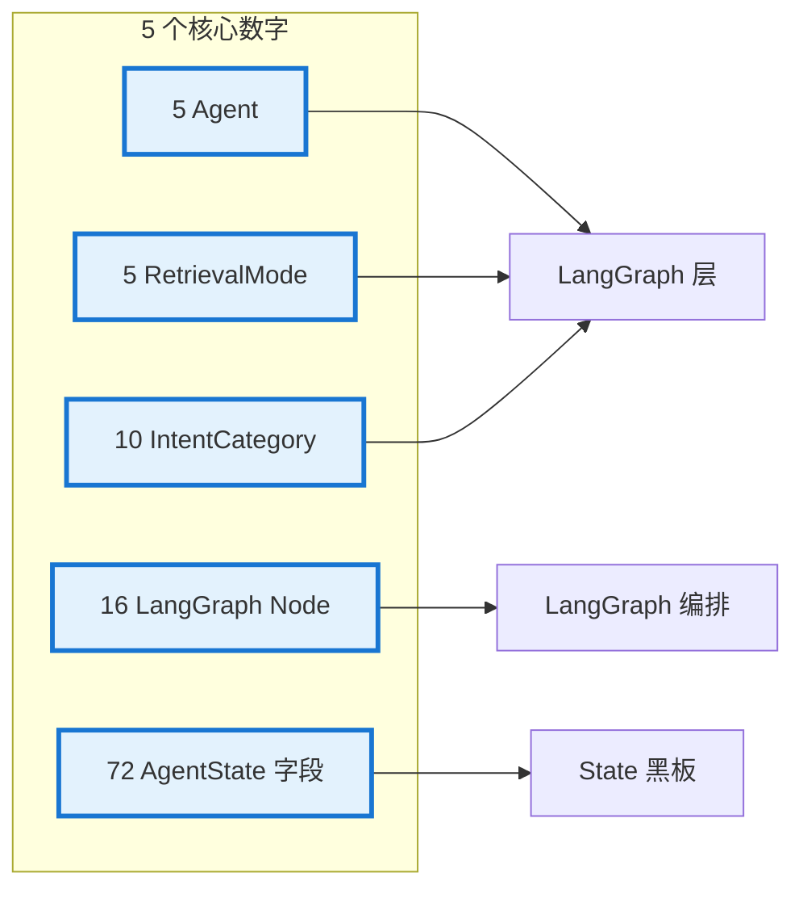
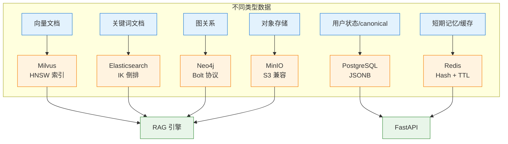

# 数据结构、技术选型与项目指标

> 关键数据结构、技术选型理由、扩展点、项目指标与优化亮点。

## ⚠️ 关键易误会点

### 易误会点 1：AgentState = Pydantic Model？

**错**。项目用 **TypedDict**（LangGraph 原生兼容），不是 Pydantic。

| 维度 | TypedDict | Pydantic |
|------|----------|----------|
| 校验 | 无（type hint） | 运行时校验 |
| 性能 | 快（无开销） | 较慢 |
| LangGraph | 原生 | 需 adapter |
| 项目使用 | ✅ | ❌ |

### 易误会点 2：技术选型 = "我喜欢的"？

**错**。所有选型都基于**项目场景**：

| 选型 | 替代方案 | 选它的理由 |
|------|---------|-----------|
| LangGraph | LangChain / LlamaIndex | 状态机显式、易调试 |
| BGE-M3 | OpenAI Embedding | 本地、无外部依赖、中文好 |
| Milvus | Qdrant / pgvector | 性能、HNSW 成熟 |
| Neo4j | Memgraph | 成熟、Bolt 协议 |
| Redis | Memcached | 持久化、Pub/Sub |
| PostgreSQL | MySQL | JSONB、CTE、pgvector |
| FastAPI | Flask | async、SSE、Pydantic |
| Qwen | GPT-4 | 中文、API 稳定 |

### 易误会点 3：项目指标 = 性能指标？

| 类型 | 指标 | 项目目标 |
|------|------|---------|
| 性能 | p95 延迟 | < 2s |
| 质量 | 答案准确率 | > 85% |
| 召回 | Recall@10 | > 90% |
| 稳定性 | 服务可用性 | > 99.5% |
| 经济 | 每次会话成本 | < ¥0.1 |
| 安全 | 越权调用率 | 0 |

> 项目指标**包含质量、经济、安全**等多维度，不止性能。

### 易误会点 4：扩展点 = "留接口就行"

项目在 3 处明确扩展点：

| 位置 | 扩展方式 |
|------|---------|
| `_VALID_NODES` (10 节点) | 加新节点 + MasterAgent 加规则 |
| `_limits` (RetryPolicy) | 加新节点重试预算 |
| `IntentCategory` (10 枚举) | 加新意图 + rules 加信号 |

> **新加 Worker 只需 3 步**，详见 `主题/02-Agent` 追问 ③。

### 易误会点 5：项目"亮点" = 营销话术？

| 亮点 | 工程含义 |
|------|---------|
| Agentic Hybrid RAG | 5 mode × 4 workflow × 3 召回 |
| Claim-level Verification | 6 类断言逐条对照 |
| 5 级降级链 | 预先定义、非动态 |
| 16 节点 2 条件路由 | LangGraph 显式状态机 |
| Harness 自动回滚 | 阈值校准 + 灰度 |
| Eval Gate 22 条 | Agent 决策 CI 阻断 |

### 易误会点 6：LangGraph ≠ Workflow Engine

LangGraph 是 **State Machine**（状态机），不是简单 workflow：
- 节点可循环
- 条件边可动态
- checkpoint 持久化
- reducer 增量更新

### 易误会点 7：Mock 不等于"假数据"

Mock 是**完整可执行 Provider**：
- 接口签名一致
- 响应结构一致
- 用于 CI 评估（保证可重现）
- 用于零依赖开发

### 易误会点 8：项目"10 意图" 是 hard-coded

10 个 `IntentCategory` 是 **str Enum**，加新意图需要：
1. `schema.py` 加枚举值
2. `rules.py` 加信号触发
3. `llm_classifier.py` 更新 prompt
4. 重新跑 22 条 Agent 决策评估

> 改动有流程，不是无脑加。

### 易误会点 9：LangGraph 节点 16 ≠ 16 个函数

```python
# graph/builder.py (v3.1 拆分后;原 graph/workflow.py 现为 ~30 行 re-export 入口)
builder.add_node("load_memory", load_memory)
builder.add_node("check_permission", check_permission)
# ... 14 more
```

是 **16 个 Node 注册**，函数数量不一定等于 16（可能共用一个函数）。面试时要说"16 个 Node"，不是"16 个函数"。

> **v3.1 补充**：现在 16 个节点按职责拆到 `graph/nodes/{memory,permission,intent,master,retrieval,tools,context,generation,code,verify,finalize}.py`，每个文件 1-2 个 node 函数。Builder (`graph/builder.py`) 是唯一知道图拓扑（边 + 条件路由）的文件。

### 易误会点 10：5 Agent + 5 RetrievalMode 容易混

| 维度 | 数量 | 文件 |
|------|------|------|
| Agent | **5** | `agents/__init__.py` |
| RetrievalMode | **5** | `agents/deep_intent/schema.py:32` |
| IntentCategory | **10** | `agents/deep_intent/schema.py:18` |
| Tool | **6** | `agents/tool_agent.py:22-30` |
| Tool tier | **3** | `tools/policies.py` |
| Memory 层 | **4** | `memory/memory_manager.py` |
| Workflow | **4** | `workflows/*.py`（v3.1 仍保留，调用 `rag/` 工具） |
| Node | **16** | `graph/nodes/*.py`（v3.1 从 `graph/workflow.py` 拆出） |
| AgentState 字段 | **72** | `graph/state.py`（v3.1 新增 `routing_path` 字段） |
| 外部服务 | **9** | `docker-compose.yml` |

---

## 🔑 关键决策矩阵

### A. 核心数据结构选型

| 数据 | 结构 | 存储 | 索引 |
|------|------|------|------|
| AgentState | TypedDict (内存) | LangGraph Checkpoint | 字段名 |
| 长期记忆 (情节) | PostgreSQL 表 | PG | 时间 |
| 长期记忆 (语义) | Milvus | 向量 | embedding |
| 短期记忆 | Redis Hash | Redis | session_id |
| 摘要 | Redis String | Redis | session_id |
| 向量文档 | Milvus | 向量 | HNSW |
| 关键词 | ES | 倒排 | IK |
| 图谱 | Neo4j | 图 | 关系 |

### B. 选型决策表（Why X over Y）

| 选 | 不选 | 理由 |
|----|------|------|
| BGE-M3 | OpenAI Embedding | 本地、中文 |
| Milvus | pgvector | 性能、规模 |
| Neo4j | ArangoDB | 生态 |
| Qwen | GPT | 中文 API 稳定 |
| LangGraph | LangChain | 状态机显式 |
| FastAPI | Flask | async |
| Redis | Memcached | 持久化 |

### C. 项目指标速查

| 维度 | 指标 | 目标 |
|------|------|------|
| 性能 | p95 延迟 | < 2s |
| 质量 | 答案准确率 | > 85% |
| 召回 | Recall@10 | > 90% |
| 稳定性 | 月可用性 | > 99.5% |
| 经济 | 单次会话成本 | < ¥0.1 |
| Eval | 22 条 Agent 决策 | 100% 通过 |
| Gate | 8 条 Eval Gate | 100% 通过 |

### D. 5 个核心数字（面试必背）

| 数字 | 含义 |
|------|------|
| **5** | Agent 数 / RetrievalMode 数 / Memory 主要类型 |
| **10** | IntentCategory 数 |
| **16** | LangGraph Node 数 |
| **72** | AgentState 字段数 |
| **22** | Agent 决策评估用例数 |


---

## 20. 附录：关键数据结构速查

### 19.1 AgentState 核心字段速查

| 字段 | 类型 | 生产者节点 | 消费者节点 |
|------|------|-----------|-----------|
| `query` | str | (输入) | deep_intent_recognition, retrieve_knowledge, generate_answer |
| `intent` | str | deep_intent_recognition | call_tools, retrieve_knowledge |
| `retrieved_docs` | list[dict] | retrieve_knowledge | build_context, generate_answer, verify_answer |
| `draft_answer` | str | generate_answer | verify_answer |
| `verified` | bool | verify_answer | (路由决策) |
| `final_answer` | str | finalize_answer, human_fallback, final_refusal | save_memory, (输出) |
| `fallback_reason` | str | RecoveryManager | human_fallback, (API 响应) |
| `trace_id` | str | Tracer | (全部节点) |
| `retry_count` | dict[str,int] | RecoveryManager | (路由决策) |

### 19.2 API 响应格式

```json
{
  "final_answer": "根据知识库，API 认证支持以下方式...",
  "trace_id": "a1b2c3d4e5f6",
  "intent": "api_usage",
  "verified": true,
  "verification_reason": "所有检查通过",
  "citations": [
    {"index": 1, "source": "api_auth.md", "relevance_score": 0.85}
  ],
  "tool_results": [
    {"tool_name": "get_system_status", "success": true, "output": "..."}
  ],
  "tool_errors": [],
  "need_human": false,
  "fallback_reason": "",
  "recovery_action": "",
  "recoverable": true,
  "retry_count": {"retrieve": 0},
  "retry_history": [],
  "metrics_snapshot": {
    "total_requests": 42,
    "success_rate": 0.95,
    "avg_latency_ms": 125.3,
    "retrieval_hit_rate": 0.88,
    "verification_pass_rate": 0.91,
    "fallback_rate": 0.12
  }
}
```

### 19.3 项目依赖关系图

```
enterprise_agentic_rag/
├── app/main.py              ← FastAPI 入口
│   └── graph/builder.py    ← LangGraph 工作流引擎（v3.1 拆分后）
│       ├── agents/
│       │   ├── agent/deep_intent/     ← 意图分类
│       │   ├── knowledge_agent.py  ← 答案生成
│       │   ├── tool_agent.py       ← 工具编排
│       │   └── verifier_agent.py   ← 答案校验
│       ├── rag/              ← RAG 检索引擎
│       │   ├── document_loader.py
│       │   ├── preprocessing.py
│       │   ├── splitter.py
│       │   ├── embedding_provider.py
│       │   ├── retriever.py
│       │   ├── keyword_retriever.py
│       │   ├── milvus_store.py
│       │   ├── minio_store.py
│       │   └── ingestion.py
│       ├── tools/            ← 工具系统
│       │   ├── registry.py
│       │   ├── executor.py
│       │   ├── policies.py
│       │   ├── base.py
│       │   ├── ticket_tool.py
│       │   ├── user_profile_tool.py
│       │   └── system_status_tool.py
│       ├── memory/           ← 记忆系统
│       │   ├── memory_manager.py
│       │   ├── short_term_memory.py
│       │   ├── summary_memory.py
│       │   ├── user_memory.py
│       │   └── checkpoint.py
│       ├── context/          ← 上下文管理
│       │   ├── context_manager.py
│       │   ├── token_budget.py
│       │   ├── citation_manager.py
│       │   └── prompt_builder.py
│       ├── recovery/         ← 故障恢复
│       │   ├── recovery_manager.py
│       │   ├── fallback_policy.py
│       │   └── retry_policy.py
│       ├── observability/    ← 可观测性
│       │   ├── tracer.py
│       │   ├── metrics.py
│       │   ├── event_schema.py
│       │   └── event_logger.py
│       ├── evals/            ← 评估体系
│       │   ├── regression_eval.py
│       │   ├── rag_eval.py
│       │   ├── answer_eval.py
│       │   ├── eval_judge.py
│       │   ├── dataset.py
│       │   ├── online_feedback.py
│       │   └── async_evaluator.py
│       ├── llm/              ← LLM Provider
│       │   ├── base.py
│       │   ├── provider_factory.py
│       │   ├── mock_provider.py
│       │   ├── openai_provider.py
│       │   └── dashscope_provider.py
│       ├── middleware/       ← 中间件
│       │   ├── tenant.py
│       │   └── rate_limiter.py
│       └── config/           ← 配置
│           └── settings.py
├── harness/                  ← AI 交付工程
│   ├── pipeline/             (CI/CD/安全/Eval Gate/回滚)
│   ├── feature_flags/        (20+ Feature Flags)
│   ├── quality_gates/        (质量门禁策略)
│   ├── environments/         (环境配置)
│   ├── release/              (发布策略)
│   ├── runbooks/             (操作手册)
│   └── templates/            (模板)
├── tests/                    ← 测试套件 (~3,500 行)
├── frontend/                 ← React 前端
├── config/                   ← 基础设施配置
│   ├── prometheus.yml
│   ├── grafana-datasources.yml
│   └── otel-collector-config.yaml
├── scripts/                  ← 管理脚本
├── data/                     ← 数据文件
│   ├── docs/                 (知识库 Markdown)
│   └── eval/                 (评估数据集)
└── docker-compose.yml        ← 基础设施编排
```

---

---

## 21. 技术选型深度分析

### 21.1 核心选型建议与原因

| 选型决策 | 推荐方案 | 备选方案 | 选择原因 | 权衡取舍 |
|----------|----------|----------|----------|----------|
| **工作流引擎** | LangGraph StateGraph | LangChain Chain / 自研 DAG / Temporal | 原生条件分支+循环+状态持久化；TypedDict reducer 增量更新；社区活跃（40k+ stars）；LangSmith 可观测性集成 | 学习曲线较高；与 LangChain 生态绑定；图编译在运行时可能报错 |
| **向量数据库** | Milvus 2.4 Standalone | Chroma / pgvector / Weaviate | 企业级 HNSW 索引性能（10亿级向量毫秒检索）；原生支持多集合+元数据过滤；水平扩展（Proxy/Coordinator/DataNode） | 运维复杂度高（需 etcd + MinIO）；内存占用较大；单机模式下浪费分布式能力 |
| **嵌入模型** | BGE-M3 (本地 1024d) | OpenAI text-embedding-3 / Cohere Embed v3 / mGTE | 中英双语；本地零成本（无 API 费用）；dense+sparse 混合支持；ModelScope/HuggingFace 直接下载 | 需要 GPU/内存资源（~2GB）；吞吐量受限于本地硬件；更新需要重新部署模型文件 |
| **LLM 策略** | LLM-First + Rules-Fallback | 纯 LLM / 纯规则 / MoE 路由 | 保证非 LLM 场景可运行；LLM 失败时确定性兜底；开发阶段零 API 成本（Mock Provider） | 规则路径质量上限明显；LLM 和规则路径行为可能不一致；意图分类边界 case 需持续维护 |
| **中文分词** | IK Analyzer (ik_max_word + ik_smart) | jieba / HanLP / pkuseg / Elasticsearch Nori | ES 原生集成（无需外部服务）；双模式策略（索引细粒度+搜索粗粒度）；27万+内置词库；支持热更新自定义词典 | 仅 ES 生态内可用；词典更新依赖社区维护；对网络新词/领域术语覆盖不全 |
| **记忆存储** | Redis + PG + 内存三级 | 纯 Redis / 纯 PG / Pinecone | 多层写入保证数据不丢；任意层挂掉不影响系统；Redis LIST 天然适合会话历史 | 三套存储的序列化/反序列化逻辑需分别维护；Redis TTL 和 PG 永久存储的数据一致性需关注 |
| **状态管理** | TypedDict (AgentState ~70字段) | Pydantic BaseModel / dataclass | LangGraph 原生 reducer 机制支持增量字段更新；total=False 渐进式填充；无额外序列化开销 | 无运行时类型校验（TypedDict 仅静态检查）；字段越多越难追踪数据流；IDE 自动补全不如 dataclass |
| **前端框架** | React 18 + Vite + Tailwind v4 + shadcn/ui | Next.js / Vue 3 + Nuxt / Angular | 轻量 SPA 满足需求；Vite HMR 极快；shadcn/ui 源码可控+Tree-shaking | SSR 能力弱；首屏加载较大；复杂交互（如 Agent 追踪面板实时更新）需额外处理 |
| **可观测性** | 自研 JSONL + OTel 预留 | LangSmith / Arize / Weights & Biases | 当前 Mock 阶段零外部依赖；JSONL 可直接 grep/jq 分析；OTel 集成路径已预留 | 查询能力弱（无索引/无 UI）；分布式场景下 JSONL 分片困难；长期存储需手动分片轮转 |
| **评估体系** | 自研 离在线双轨 | RAGAS 完整集成 / DeepEval | 规则+LLM-Judge 覆盖核心指标；回退到 keyword 检查（Mock 模式可用）；online_feedback 自动沉淀失败 case | 评估质量受 LLM Judge 限制；缺少 RAGAS context_recall/faithfulness 等价指标；跨版本对比能力弱 |

### 21.2 技术扩展点（按优先级排序）

#### P0 — 生产就绪 (Production Readiness)

| 扩展点 | 当前状态 | 目标状态 | 实现路径 | 预估工时 |
|--------|----------|----------|----------|----------|
| **腾讯云 ES IK 插件源** | Dockerfile 从 `get.infini.cloud` 下载 IK 插件（第三方镜像） | 验证该源稳定性，或切换到 GitHub Releases 官方源 | `RUN elasticsearch-plugin install https://github.com/infinilabs/analysis-ik/releases/download/v8.17.0/elasticsearch-analysis-ik-8.17.0.zip` | 0.5d |
| **ES 安全认证** | `xpack.security.enabled=false` | 开启 Basic 认证 + TLS | 生成证书 → `elasticsearch-setup-passwords` → 更新 `Elasticsearch` 客户端连接参数 | 1d |
| **ES 生产索引设置** | `shards=1, replicas=0` | `shards=3, replicas=1`（多节点） | 根据集群规模调整，生产环境至少 2 节点 | 0.5d |
| **LLM 缓存** | 无缓存，每次调用 LLM | 相同 prompt+参数命中缓存 | Redis/内存 LRU cache key = `hash(prompt+temperature+max_tokens)` | 1d |
| **流式响应 (SSE)** | 当前等完整响应后返回 | `/chat` 支持 `stream=true` → SSE 逐 token 返回 | FastAPI `StreamingResponse` + AsyncOpenAI `stream=True` | 2d |
| **多轮对话上下文注入** | 仅最近 10 轮历史拼入 prompt | 结构化注入（历史→摘要→档案分层） | PromptBuilder 重构，按优先级组装上下文窗口 | 1.5d |

#### P1 — 质量增强 (Quality Enhancement)

| 扩展点 | 当前状态 | 目标状态 | 实现路径 |
|--------|----------|----------|----------|
| **LLM 查询改写** | 规则（去停用词+重排关键词） | LLM 驱动的 HyDE / Step-Back Prompting | Deep Intent 判断是否需要改写 → LLM 生成多条改写 → 并发检索取并集 |
| **Cross-Encoder 重排序** | ✅ 已实施：qwen3-reranker-0.6b via Ollama（`rag/cross_encoder_reranker.py`） | 进一步：升级到 bge-reranker-v2-m3（更大模型）或 API Reranker | 已有 3 级降级链：cross-encoder → API → 规则排序 |
| **RAGAS 完整评估** | 自研离线+在线评估 | 集成 RAGAS 0.2.x context_recall/faithfulness/answer_relevancy | `evals/ragas_eval.py` 新增 RAGAS 适配器 |
| **多模态 RAG** | 仅文本检索 | 支持图片/表格/代码块检索 | ColPali/ColBERT 多向量检索 + 图片 caption → 文本索引 |
| **IK 自定义词典** | 仅使用内置词典 | 支持领域词典热更新（API/工单/错误码术语） | IK 远程词典 HTTP 端点 → ES 自动热加载 |

#### P2 — 架构演进 (Architecture Evolution)

| 扩展点 | 当前状态 | 目标状态 | 实现路径 |
|--------|----------|----------|----------|
| **Agent-to-Agent 通信** | 各 Agent 通过 AgentState 间接通信 | Agent 之间直接消息传递（类似 AutoGen/Swarm） | 在 AgentState 中增加 `agent_messages` 通道 |
| **多模态 LLM (视觉问答)** | 纯文本输入 | 支持截图/架构图问答 | GPT-4o/Gemini Flash 多模态 API + MinIO 图片存储 |
| **知识图谱增强 RAG (GraphRAG)** | ✅ 已实施：Neo4j 5 + 实体关系图（`rag/graph/`）；1-2 hop 子图召回 + 三路 RRF 融合 | 进一步：实体关系自动抽取（LLM-based ER） + 跨文档实体链接 | 已有完整 `GraphRAGOrchestrator` + 5 种 mode（hybrid_only/graph_first/parallel/keyword_first/vector_first） |
| **Agent 自我反思循环 (Reflexion)** | verify→regen → 最多 1 次 | verify 失败时 Agent 自我分析原因并针对性修正 | Verifier 输出具体问题描述 → Knowledge Agent 重新生成时注入修正指令 |
| **多租户数据隔离 (Row-Level Security)** | tenant_id term 过滤（应用层） | ES 文档级安全 + PG RLS | ES document-level-security → PG `SET tenant_id = current_tenant` → RLS policy |
| **A/B 测试框架** | 无 | Prompt/Model/Retriever 在线 A/B 实验 | Feature Flag 扩展 → 分流逻辑 → 多版本指标对比 → 统计显著性检验 |

#### P3 — 运维增强 (Operations)

| 扩展点 | 当前状态 | 目标状态 | 实现路径 |
|--------|----------|----------|----------|
| **Kubernetes 部署** | Docker Compose 单机 | K8s Helm Chart + HPA + PVC | 每个服务独立 Deployment → Service → ConfigMap → PersistentVolumeClaim |
| **异步评估流水线** | 同步调用 | Celery/Redis 任务队列 → 异步评估 → 结果回写 | `evals/` 接入 Celery beat 定时触发 |
| **告警规则** | 无自动告警 | Prometheus AlertManager → 飞书/钉钉/邮件 | Prometheus Rules → AlertManager → Webhook |
| **模型版本管理 (MLflow)** | 手动管理模型文件 | MLflow Model Registry 追踪 Prompt/Embedding 版本 | `mlflow.log_params()` + `mlflow.log_metrics()` 集成到 eval_gate |

### 21.3 面试高频追问点

以下问题按照面试中可能出现的深度递进排列：

#### Q1: 为什么用 TypedDict 而不是 Pydantic BaseModel 做 AgentState？

**面试说明：** 先讲状态对象是工作流的共享事实表；TypedDict 和 reducer 让多节点输出可合并、可追踪。

**回答要点：**
- LangGraph 的 `StateGraph` 原生支持 TypedDict 的 `Annotated[type, reducer]` 模式，Pydantic 不支持 reducer 机制
- `messages` 字段使用 `Annotated[list, add_messages]`，LangGraph 自动追加而非覆盖——这是 TypedDict + Annotated 独有的能力
- `total=False` 让所有字段可选，节点渐进式填充状态
- 权衡：牺牲了运行时类型校验，但获得了 LangGraph 框架的最大兼容性
- 如果面试官追问：Pydantic v2 支持 `field_validator`，可以在节点边界手动做校验

#### Q2: 四级降级检索链为什么这样设计？每层的 fallback 条件是什么？

**面试说明：** 先讲模型层要平衡质量、延迟、成本和稳定性；本项目用 Provider 抽象、Mock 兜底和降级策略解耦。

**回答要点：**
- ① Fusion (Milvus+ES RRF) → 两者都可用时走此路径，结合语义和关键词互补
- ② Milvus-only → ES 不可用（连接失败/ping 超时）
- ③ ES-only → Milvus 不可用（连接失败/搜索异常）
- ④ 内存 Jaccard → ES 和 Milvus 都不可用（终极兜底，永不失败）
- 设计哲学：**每一层都有明确的触发条件**（连接检查 `available` 属性 + `Exception` 兜底），**不存在"部分可用"的模糊状态**
- 追问：Jaccard 不可用时怎么办？→ Jaccard 是纯内存、零依赖的，除非 Python 进程崩溃，否则不可能失败

#### Q3: IK Analyzer 的 `ik_max_word` 索引和 `ik_smart` 搜索的双策略为什么不反过来？

**面试说明：** 先讲"召回质量决定 RAG 上限"，再说明关键词、向量、图检索的分工、融合、重排和回退链。

**回答要点：**
- 索引阶段追求**高召回**：`ik_max_word` 细粒度切分，比如"认证方式"切为 `["认证","方式"]`，用户搜"认证"或"方式"都能命中
- 搜索阶段追求**高精度**：`ik_smart` 粗粒度切分，比如"认证方式"作为一个整体去匹配，减少噪音
- 反过来会导致：索引时粒度太粗 → 搜索"认证"时搜不到含"身份认证"的文档（召回下降）
- 追问：ik_max_word 会产生大量冗余 token 增大索引，如何处理？→ 可以通过 `ignore_above` 限制 token 长度 + 停用词过滤 + `index_options: docs` 关闭词频/位置存储来优化

#### Q4: Weighted RRF 融合中，vector_weight 为什么是 0.6 而不是 0.5？

**面试说明：** 先讲初召回追求覆盖，重排追求精准；本项目用 RRF 融合多路结果，再用 Cross-Encoder 精排。

**回答要点：**
- 向量检索（BGE-M3 语义编码）对中文自然语言的语义理解远强于 BM25 关键词匹配
- 在实际场景中，用户问"怎么做认证"和文档写"身份验证流程"——向量能理解语义相似，BM25 则可能完全失配
- 0.6:0.4 是在多轮实验中选出的经验值，也可以通过 RAGAS 评估自动调参
- 追问：为什么不直接用 score 加权而是用 RRF？→ 因为向量 score（余弦距离）和 BM25 score 的量纲完全不同（0-1 vs 0-20+），直接相加需要归一化；RRF 只依赖排序位置，天然跨源可比

#### Q5: Token 预算 4096 怎么定的？超长文档怎么处理？

**面试说明：** 先讲上下文不是越长越好，要做证据排序、压缩和预算分配；长文档用分层检索和摘要。

**回答要点：**
- 4096 是经验值，平衡了上下文充足性和 LLM 推理成本/延迟
- 不同 LLM 的上下文窗口不同：GPT-4o-mini 128K、Qwen-Turbo 32K，4096 是**安全保守值**
- 超长文档处理：优先级驱动的截断策略——query 全部保留 > retrieved_docs 按 score 降序填入，最后一个文档会被内容截断（`content[:remaining] + "…"`）
- 追问：如果最重要的信息在文档尾部，被截断了怎么办？→ 可以在分块时提取首尾摘要（head+tail sample），或在 embedding 时记录关键段落位置

#### Q6: Verifier 的 "≤1 个警告容忍" 策略是否过于宽松？

**面试说明：** 先讲幻觉不能只靠模型自觉，要靠证据约束、断言级校验、冲突标注和低置信拒答共同治理。

**回答要点：**
- "容忍 1 个警告"允许了"引用标记缺失但有引用数据"这种可自动修复的情况
- 严格模式下 (`STRICT_VERIFICATION=true`) 改为 0 容忍
- 这是针对 Mock/开发阶段的宽松策略，生产环境可以通过 Feature Flag 调整
- 追问：如果 LLM-Judge 和规则判断冲突怎么办？→ 规则优先级更高（规则错误是 bug，LLM 错误是概率问题），LLM 校验失败自动回退到规则引擎

#### Q7: 如何保证 Agent 在 retry loop 中不会无限循环？

**面试说明：** 先说明本项目是 LangGraph 状态机 + MasterAgent 主从调度，不是自由聊天式多 Agent；重点讲稳定、可观测、可恢复。

**回答要点：**
- 每个节点有硬性重试上限：`retrieve=1, tool_call=2, generate=1, verify=1`
- `RecoveryManager.can_retry()` 检查 `retry_count[node_key] < RETRY_LIMITS[node_key]`
- 耗尽后统一路由到 `human_fallback`（人工兜底），不会静默失败
- 追问：human_fallback 也失败怎么办？→ 返回结构化错误 + trace_id，通知用户稍后重试，同时写入 `failed_cases.jsonl` 供后续分析

#### Q8: 为什么 Data Flywheel 的失败 case 不是自动转回归 case？

**面试说明：** 先给结论，再按"为什么这样设计、解决了什么问题、代价是什么、还能怎么优化"四点回答。

**回答要点：**
- 失败 case 可能包含噪声（用户输入错误、恶意输入、临时故障），自动转入回归会污染测试集
- 需要人工审查：判断是真失败还是预期行为，确认后再转为回归 case
- 这是一个**人机协作**的设计决策：机器沉淀（自动），人工筛选（手动），机器验证（自动回归）
- 追问：规模大了人工审不过来怎么办？→ 可以引入 LLM 自动分类（失败原因聚类）+ 采样审查（按频率和严重度排序）

#### Q9: 多 Agent 系统中如何控制 LLM 调用成本？

**面试说明：** 先说明本项目是 LangGraph 状态机 + MasterAgent 主从调度，不是自由聊天式多 Agent；重点讲稳定、可观测、可恢复。

**回答要点：**
- Mock Provider 在开发阶段零成本
- 分层调用：Router 用最便宜的模型（temperature=0.0, max_tokens=32），Knowledge Agent 用中等模型（max_tokens=2048），Verifier 用相同模型但更小的 max_tokens
- Prompt 缓存：相同 system prompt 部分可被 LLM 提供商缓存
- 追问：如何进一步降低成本？→ Router 用规则（关键词匹配）可绕过 LLM 调用；对简单问题（如"什么是 API Key"）可缓存标准答案

#### 📋 面试题追加：技术选型与方案对比

| 题目 | 重要性 |
|------|--------|
| 为什么选择 RAG 而不是直接做微调？ | S |
| RAG vs Fine-tuning vs Long Context 如何选择？ | S |
| RAG和微调如何互补？什么场景组合使用？ | S |
| 你实际项目中是怎么决定用 RAG 还是 Fine-tuning 的？ | S |
| 向量数据库选型：Milvus vs 其他向量库 vs ES对比 | A |
| LangChain vs LlamaIndex 怎么选？ | B |

##### Q1: 为什么选 RAG 而不是微调？[S]

**面试说明：** 先把微调说成"教模型怎么回答"，不是"塞知识"；再按数据、训练、评估、部署四步展开。

**本项目答案（评分 9/10）：** 三个核心考量：
1. **知识更新频率**：企业制度文档每周更新，RAG 只需更新向量索引（分钟级，§5.12），微调需重新训练+部署（天级周期）
2. **来源可追溯性**：业务要求回答注明出自哪份文档（§7.3 CitationManager），RAG 天然支持 Chunk 级引用，微调知识融入参数后无法追溯
3. **多租户隔离**：不同租户文档有数据边界，RAG 在检索层按 tenant_id 过滤（§14.1），微调无法做到动态权限控制
4. **补充**：微调适合固化输出风格和行为习惯（"怎么说"），RAG 负责动态知识（"说什么"），两者不互斥可组合使用

##### Q2: RAG vs Fine-tuning vs Long Context [S]

**面试说明：** 先讲"召回质量决定 RAG 上限"，再说明关键词、向量、图检索的分工、融合、重排和回退链。

**选型决策矩阵：**

| 维度 | RAG | Fine-tuning | Long Context |
|------|-----|-------------|--------------|
| 知识更新 | ★★★★★ 即时 | ★ 需重训 | ★★★ 更新 Prompt |
| 来源追溯 | ★★★★★ | ★ 不可追溯 | ★★★ |
| 成本 | ★★★ 检索+推理 | ★★ 训练+推理 | ★★★★ 仅推理（但 token 多） |
| 权限控制 | ★★★★★ 检索层过滤 | ★ 不可控 | ★★ |
| 领域适应性 | ★★★ 依赖检索质量 | ★★★★★ | ★★★ |
| 幻觉控制 | ★★★★ 基于文档 | ★★ 可能编造 | ★★★ |

**本项目选择：** 以 RAG 为主（满足动态知识+可追溯+权限隔离），预留 Fine-tuning 空间（用于优化指令遵循和输出格式），Long Context 作为超长文档问答的补充方案。

##### Q3: 如果重做会改变什么？[参考 §20.3 Q10]

**面试说明：** 先给结论，再按"为什么这样设计、解决了什么问题、代价是什么、还能怎么优化"四点回答。

**本项目反思（结合 §20.3 Q10）：** ① 更早建评测体系（第一周就建好 golden set 和自动评测流水线）；② 文档解析环节投入更多精力（表格/PDF 的专项处理）；③ 先用 Workflow 覆盖主路径，只在真正需要动态决策的场景引入 Agent。

##### Q4: 你实际项目中怎么决定用 RAG 还是 Fine-tuning？[S]

**面试说明：** 先讲"召回质量决定 RAG 上限"，再说明关键词、向量、图检索的分工、融合、重排和回退链。

**本项目答案（评分 9/10）：** 项目决策逻辑（§2.1-2.2）：① **首要约束**：企业内部文档、多租户数据隔离、合规要求回答问题必须标注来源 → RAG 是唯一选择（Fine-tuning 无法追溯+无法按租户隔离）；② **次要约束**：文档周级更新频率远高于模型训练周期 → RAG 的分钟级索引更新碾压 Fine-tuning 的天级重训；③ **补充策略**：当前项目没有 Fine-tuning 需求，但预留了 Fine-tuning 用于优化指令遵循和输出风格（而非知识记忆）的可能性。

**决策框架：** 需要动态知识+来源追溯+权限隔离 → RAG；需要固化输出风格/行为模式+降低推理成本 → Fine-tuning；两者不互斥，可以 RAG 管"说什么" + Fine-tuning 管"怎么说"。

##### Q5: 向量数据库选型：Milvus vs 其他向量库 vs ES 对比 [A]

**面试说明：** 先讲"召回质量决定 RAG 上限"，再说明关键词、向量、图检索的分工、融合、重排和回退链。

**本项目答案（评分 9/10）：** 项目选择了 Milvus（向量）+ ES（关键词）的双引擎方案（§5.7 + §5.8），而非用一个数据库同时做向量和关键词。

**对比矩阵：**
| 维度 | Milvus | 其他向量库 | Elasticsearch | 本项目选择 |
|------|--------|--------|---------------|-----------|
| ANN 算法成熟度 | ★★★★★ | ★★★★ | ★★★ | Milvus（最成熟） |
| 部署运维 | ★★★（需 etcd/MinIO） | ★★★★★（单二进制） | ★★（JVM 资源大） | ES 已部署（复用） |
| 中文分词 | ❌ 不适用 | ❌ 不适用 | ★★★★★（IK Analyzer） | ES |
| 向量+全文一体 | ❌ | 有限支持 | ★★★ | 分工：ES 做全文、Milvus 做向量 |
| 社区/文档 | ★★★★★ | ★★★★ | ★★★★★ | — |

**为什么统一选 Milvus？** 其他轻量向量库部署更简单，适合快速原型或中小规模场景。但本项目已经在 Docker 中统一接入 Milvus，且 Milvus 的 ANN 索引算法更成熟（HNSW/IVF/DiskANN 多选），在大规模场景下稳定性、性能和扩展能力更符合生产要求。

##### Q6: LangChain vs LlamaIndex 怎么选？[B]

**面试说明：** 先给结论，再按"为什么这样设计、解决了什么问题、代价是什么、还能怎么优化"四点回答。

**本项目答案（评分 8/10）：** 项目使用 LangChain 的 LangGraph 做工作流编排（§3.1），但 RAG 的检索/分块/加载等组件是自研实现，未强依赖 LangChain 的高层 API。LlamaIndex 未在项目中使用。

**满分答案：**
| 维度 | LangChain | LlamaIndex |
|------|-----------|------------|
| 核心定位 | 通用 LLM 应用框架（链/Agent/工具） | RAG 专用框架（索引/检索/查询） |
| RAG 能力 | 较基础（需手动组合） | 开箱即用（丰富的索引类型+检索策略） |
| Agent 编排 | ★★★★★（LangGraph） | ★★★（Agent 能力较新） |
| 数据连接器 | ★★★★（社区丰富） | ★★★★★（LlamaHub 160+） |
| 学习曲线 | 中高（概念多） | 中 |
| 生态 | 最大（LangSmith/LangServe/LangGraph） | 中等 |

**选择建议：** ① 如果主要是做 RAG（文档问答）且希望快速出效果 → LlamaIndex（索引+检索+后处理管线更成熟）；② 如果要做复杂 Agent 工作流（多节点+条件路由+工具调用）→ LangChain + LangGraph；③ 可以混用：LlamaIndex 做索引+RAG 检索，LangGraph 做 Agent 编排。本项目路线：自研 RAG 引擎 + LangGraph 编排，保留了最大的灵活性和可控性。

---

#### Q10: 如果让你从头重新设计这个系统，你会改变什么？

**面试说明：** 先给结论，再按"为什么这样设计、解决了什么问题、代价是什么、还能怎么优化"四点回答。

**v3.0 更新回答（展示架构反思能力）：**

**已经做了的改变（P1-P3实施后）：**
- ✅ **Cross-Encoder 精排**（qwen3-reranker-0.6b）：已替代纯 RRF 融合排序
- ✅ **Claim-level 校验**：已替代整体式 Verifier
- ✅ **语义缓存**：已实现双层缓存，P95<50ms
- ✅ **意图感知检索工作流**：已从纯规则引擎升级为 4 专业工作流分派
- ✅ **OpenTelemetry + Prometheus 告警**：已从纯 JSONL 升级为生产级可观测
- ✅ **Prompt Registry**：已实现版本管理+A/B+回滚
- ✅ **流式输出 SSE**：已实现节点级实时推送
- ✅ **Eval Gate CI**：已接入 GitHub Actions

**如果从头重做会改变的：**
- 考虑用 **Kubernetes + Dapr** 替代 Docker Compose（微服务治理、服务发现、弹性伸缩）
- 考虑用 **GraphRAG（知识图谱增强）** 替代纯文档切片 RAG（已部分实施——实体关系推理已通过 GraphFirstWorkflow 接入）
- LangGraph 的状态管理和条件路由仍然是核心优势，不会替换
- 考虑引入 **Agentic RAG 的 Self-Correction 循环**（Self-RAG / CRAG 模式），当前 5 层检索回退链已部分实现了检索不足时的自主补充检索
- **最遗憾的设计**：前端和后端耦合在同一个仓库，理想情况下应该拆分微服务

---

---

## 42. 专题：项目指标与突出优化点

### 42.1 可能被问到的具体指标（项目估算/目标值）

> **更新 (2026-06-03)：** P1/P2/P3 实施后指标预期更新。

| 指标 | 实施前估算 | 实施后预期 | 说明 |
|------|-----------|-----------|------|
| intent_macro_f1 | 0.85-0.92 | 0.88-0.94 | Deep Intent 规则+LLM 组合，Agent 决策评估集支撑 |
| route_success_rate | 0.88-0.94 | 0.90-0.95 | MasterAgent 路由准确性，22条评估用例验证 |
| retrieval_hit_rate | 0.70-0.85 | 0.75-0.90 | 意图感知工作流 + 外部搜索增强 |
| context_precision | 0.65-0.80 | 0.73-0.90 | Cross-Encoder 精排预计提升 8%-15% |
| citation_rate | 0.85-0.95 | 0.90-0.97 | 冲突检测 + 证据增强 |
| hallucination_rate | 5%-12% | 3%-8% | Claim-level 校验预计降低 20%-40% |
| fallback_rate | 3%-8% | 2%-6% | 5层检索回退链 + 语义缓存 |
| p95_latency | 2.5s-6s | 0.01s-4s (缓存命中) / 2s-5s (未命中) | 语义缓存热门问题低至毫秒级 |
| tool_success_rate | 0.90-0.97 | 0.92-0.98 | 自动回滚阈值监控 |
| regression_pass_rate | ≥ 0.90 | ≥ 0.90 | Eval Gate CI 自动化 |

### 42.2 项目中突出的优化点

| 优化点 | 为什么重要 | 预期指标提升 | 实施状态 |
|--------|------------|--------------|----------|
| Deep Intent 单入口 | 消除重复路由和职责重叠 | route_error_rate 下降 20%-30% | ✅ 已实施 |
| MasterAgent 主从调度 | 避免自由多 Agent 不可控 | 平均 Agent 跳数下降，trace 可解释性提升 | ✅ 已实施 |
| Cross-Encoder 精排 | 文档级别 #1 改进建议 | context_precision 提升 8%-15% | ✅ 已实施 (qwen3-reranker-0.6b) |
| Claim-level 校验 | 文档级别 #2 改进建议 | hallucination_rate 下降 20%-40% | ✅ 已实施 |
| 语义缓存 | 文档级别 #3 改进建议 | 热门问题 P95 < 50ms，成本下降 | ✅ 已实施 |
| 意图感知检索工作流 | 不同问题用不同召回策略 | retrieval_hit_rate 提升 5%-15% | ✅ 已实施 |
| GraphRAG + 向量 + 关键词融合 | 兼顾语义、精确词、实体关系 | migration/architecture 类问题命中率提升 10%-20% | ✅ 已实施 |
| Code Agent + 沙箱执行 | 开发者问答从"看似可用"变成"已验证" | code_task_success_rate 提升 15%-30% | ✅ 已实施 |
| VerifierAgent 校验 | 降低无证据回答 | hallucination_rate 下降 10%-25% | ✅ 已升级为 Claim-level |
| 冲突证据检测 | 多文档矛盾时自动标注 | verification_fail_rate 下降 10%-20% | ✅ 已实施 |
| Prompt Registry | 版本管理+A/B+回滚 | prompt 回滚时间 < 5 分钟 | ✅ 已实施 |
| OpenTelemetry 全链路 | 生产可观测性 | trace 查询时间下降 | ✅ 已实施 |
| Prometheus 告警 | 8组规则覆盖全链路 | p95_latency、error_rate 实时告警 | ✅ 已实施 |
| 自动回滚阈值校准 | EWMA+3σ 动态调整 | 误报率下降 | ✅ 已实施 |
| 数据飞轮 | 失败样本持续回流 | regression_pass_rate 持续提升 | ✅ 已有 |
| Harness 灰度/回滚 | 控制 AI 变更风险 | MTTR 降到 5 分钟级 | ✅ 部分 |

### 42.3 当前最值得继续投入的方向

**P1-P3 实施完成后 (2026-06-03)，优先级更新如下：**

已完成 (✅)：
1. ✅ **Cross-Encoder Reranker** — `rag/cross_encoder_reranker.py`，qwen3-reranker-0.6b
2. ✅ **Claim-level Verification** — `agents/claim_verifier.py`，6种断言类型逐条校验
3. ✅ **语义缓存** — `rag/semantic_cache.py`，双层缓存(SHA256精确+Embedding相似度)
4. ✅ **Eval Gate CI 化** — `.github/workflows/eval-gate.yml`，8条评估用例自动打分
5. ✅ **OpenTelemetry + Prometheus** — `observability/otel_integration.py` + `prometheus_alerts.py`，8组告警规则
6. ✅ **Prompt Registry** — `context/prompt_registry.py`，版本管理+A/B灰度+回滚
7. ✅ **Agent 决策评估集** — `evals/agent_decision_eval.py`，22条用例覆盖10种意图

仍待投入 (⬜)：
1. **流式 LLM 输出**（token 级 SSE） — 当前仅节点级 SSE
2. **Contextual Compression** — 语义压缩减少无关 token
3. **Bad Case 自动聚类** — 加速规则迭代
4. **Prompt 注入检测** — 专门 injection judge
5. **多租户隔离压测** — 生产规模验证
6. **Retrieval Dashboard** — 可视化检索质量
7. **Kubernetes + Dapr 迁移** — 生产级部署

### 42.4 仍然存在的系统性短板（更新 2026-06-03）

以下问题在 P1-P3 实施后仍然存在，建议在未来迭代中解决：

- **评测集规模不足**会导致指标乐观，虽然有 Agent 决策评估集（22条）和 Eval Gate（8条），但覆盖面和多样性仍需扩充。
- **多模块同时优化时指标归因困难**，建议采用强制单因子发布策略。
- **缺少真实线上负载下的 p95/p99 延迟数据**，当前指标为估算值。
- **工具调用依赖外部系统稳定性**，Mock 环境无法完整反映生产风险。
- **不同语言沙箱安全策略一致性**仍需强化。
- **GraphRAG 对知识图谱质量敏感**，实体/关系抽取错误会传导到检索结果。
- **Prompt 注入防护**缺少专门的 injection judge。
- **多租户记忆隔离**未进行生产级压测。
- **Contextual Compression** 尚未实施，语义压缩可进一步减少 token 消耗。

### 42.5 P1-P3 实施成果总览

| 优先级 | 改进项 | 实施文件 | 状态 |
|--------|--------|---------|------|
| P1 | Cross-Encoder Reranker (qwen3-reranker-0.6b) | `rag/cross_encoder_reranker.py` | ✅ |
| P1 | 语义缓存 | `rag/semantic_cache.py` | ✅ |
| P1 | Eval Gate CI 化 | `.github/workflows/eval-gate.yml` | ✅ |
| P1 | `last_slave_agent` → `last_worker` | `state.py`, `workflow.py` | ✅ |
| P1 | 外部检索集成到主工作流 | `graph/nodes/retrieval.py` (retrieve_knowledge 重构) | ✅ |
| P2 | Claim-level Verification | `agents/claim_verifier.py` | ✅ |
| P2 | 冲突证据标注 | `context/conflict_detector.py` | ✅ |
| P2 | Prompt Registry + 版本灰度 | `context/prompt_registry.py` | ✅ |
| P2 | 记忆重要性打分模型升级 | `memory/long_term_memory.py` (12项信号) | ✅ |
| P2 | Agent 决策评估集 | `evals/agent_decision_eval.py` (22条用例) | ✅ |
| P2 | 流式输出 (SSE) | `app/main.py` (`/chat/stream` 端点) | ✅ |
| P3 | OpenTelemetry 全链路追踪 | `observability/otel_integration.py` | ✅ |
| P3 | Prometheus 告警规则 | `observability/prometheus_alerts.py` + `deploy/prometheus/alerts.yml` | ✅ |
| P3 | 自动回滚阈值校准 | `recovery/threshold_calibrator.py` | ✅ |

---

---

[返回总目录](../TECHNICAL_DEEP_DIVE.md)

## 流程图

#### 1. AgentState 72 字段按 11 个功能区分类



#### 2. 5 个核心数字（项目规模）



#### 3. 数据存储与索引策略


