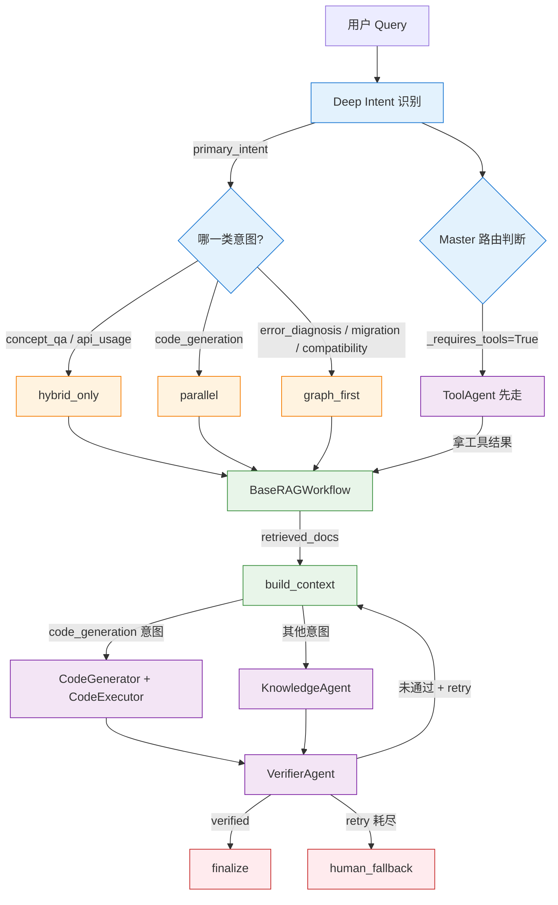
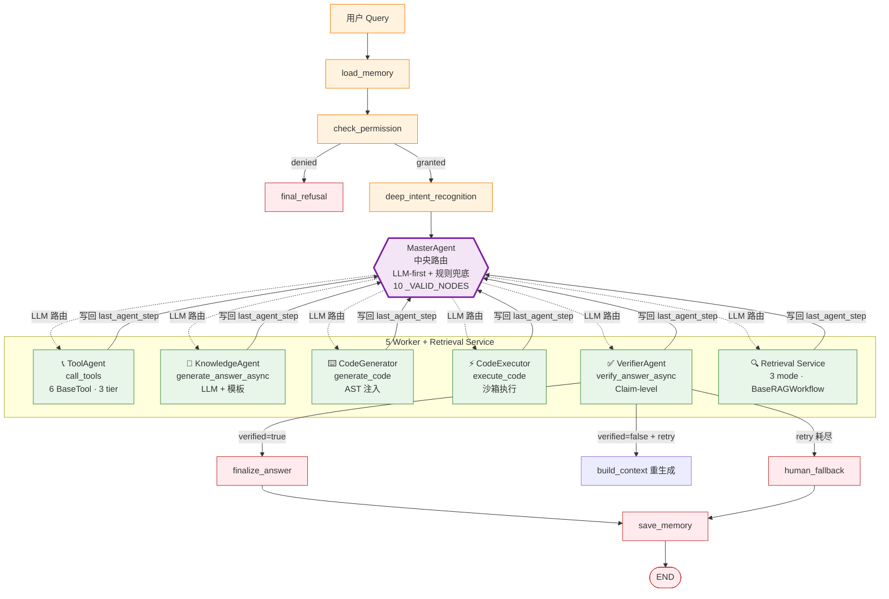
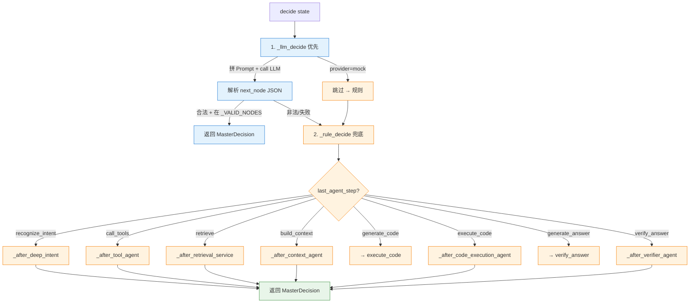
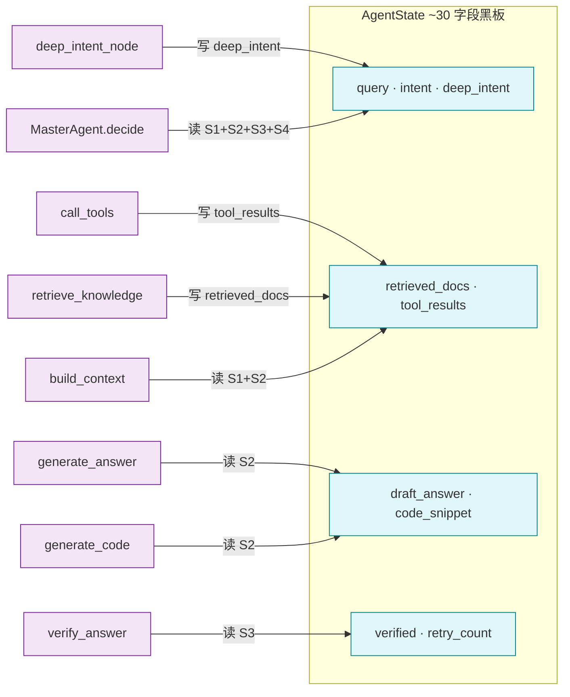

# Agent 设计

> 本主题文件存放在 `technical_deep_dive/主题/`，允许题目与其他主题重复。

## 结合项目的详细说明

项目的 Agent 设计采用 **"80% Workflow + 20% Agent"** 的混合架构。核心判断是：企业级问答系统不能完全交给自由 Agent 自主循环，否则容易出现不可控分支、重复工具调用、成本失控和难以复现的问题；但也不能是纯固定流水线，因为用户问题类型差异很大，需要根据意图动态选择检索、工具、校验和降级策略。因此项目用 LangGraph StateGraph 固定主流程，用 **MasterAgent + 4 个 Worker Agent** 在关键节点做动态决策。

### 一、整体架构原则：Hub-and-Spoke

```
                  ┌────────────────────┐
                  │   MasterAgent      │
                  │  (中央路由调度)      │
                  │  LLM-first + 兜底   │
                  └─────────┬──────────┘
                            │
        ┌──────────┬────────┼────────┬──────────┐
        │          │        │        │          │
▼          ▼        ▼        ▼          ▼
    ToolAgent  Knowledge CodeAgent  Verify   Retrieval
    (6 工具)   (LLM生成) (AST注入)  (Claim)  (3 mode)
```

- **Agent 之间不直接通信**，全部通过 `AgentState` 黑板读写
- 每个 Worker 执行完必须**回到 MasterAgent**，由 Master 决定下一跳
- Worker 不感知其他 Worker 的存在，只看 State

### 二、6 个 Agent 一览

| # | Agent | 实现形式 | 入口 | 核心职责 | 不允许做的事 |
|---|-------|---------|------|---------|------------|
| 1 | `MasterAgent` | class | `MasterAgent.decide(state)` | 中央路由、LLM-first + 规则兜底 | 不生成最终答案 |
| 2 | `ToolAgent` | async 函数 | `call_tools(query, intent, user_id, perms)` | 6 个 BaseTool 编排、tier 策略、权限检查 | 不绕过 PolicyEngine |
| 3 | `KnowledgeAgent` | async 函数 | `generate_answer_async(query, docs)` | 基于 RAG 证据生成最终答案、CoT thinking | 不越权调工具 |
| 4 | `CodeGenerator` | 同步函数 | `generate_code(query, docs, language)` | AST 符号提取 + LLM/模板生成代码（prompt utility） | 不直接执行 |
| 5 | `CodeExecutor` | async 函数 | `execute_code(code_snippet, language)` | 沙箱执行 CodeGenerator 生成的代码 | 不生成代码 |
| 6 | `VerifierAgent` | async 函数 | `verify_answer_async(draft, citations, docs)` | Claim-level 断言校验 → LLM → 规则 | 不修改业务数据 |

> `CodeAgent` 拆分为 CodeGenerator（prompt utility）和 CodeExecutor（agent）。
> 详见 `src/enterprise_agentic_rag/agents/__init__.py` 的 6 个统一导出。

### 三、LangGraph 三要素：State / Node / Edge

#### State（~30 字段 TypedDict）

`AgentState` 是全局黑板，按功能区划分：

| 功能区 | 字段示例 | 数量 |
|--------|---------|------|
| 输入/身份 | `query`, `user_id`, `session_id`, `user_role`, `permissions` | 5 |
| 路由/意图 | `intent`, `deep_intent`, `master_next`, `master_decisions`, `last_agent_step` | 5 |
| 检索/RAG | `retrieved_docs`, `reranked_docs`, `retrieval_mode`, `graph_paths` | 5 |
| 工具 | `tool_results`, `tool_errors`, `pending_tool_confirmations` | 4 |
| 生成 | `draft_answer`, `code_snippet`, `final_answer`, `citations` | 5 |
| 校验 | `verified`, `verification_reason`, `need_human` | 3 |
| 记忆 | `chat_history`, `session_summary`, `user_profile`, `memory_ckpt_id` | 4 |
| 上下文 | `structured_context`, `context_window`, `token_budget` | 3 |
| 恢复 | `retry_count`, `retry_history`, `recoverable`, `fallback_reason` | 4 |
| 可观测 | `trace_id`, `node_events`, `tool_events`, `metrics_snapshot` | 4 |

**为什么用 TypedDict 而不是 Pydantic？**
- LangGraph 原生兼容，reducer 机制支持增量更新
- 性能更好（无运行时校验开销）
- 序列化为 JSON 方便 checkpointing

#### Node（16 个）

每个 Node 都是 `async def name(state) -> dict[str, Any]`，只写 patch（部分更新）：

| 节点 | last_worker | last_agent_step | 触发条件 |
|------|------------|----------------|---------|
| `load_memory` | `memory_manager` | `load_memory` | START 入口 |
| `check_permission` | `permission_tool` | `check_permission` | 每次必走 |
| `deep_intent_recognition` | `intent_analyzer` | `recognize_intent` | 权限通过后 |
| `master_agent` | `master_agent` | `decide_next` | 路由中心，循环触发 |
| `call_tools` | `tool_agent` | `call_tools` | Master 决定需要工具 |
| `retrieve_knowledge` | `retrieval_service` | `retrieve` | Master 决定检索 |
| `rewrite_query` | `retrieval_service` | `rewrite_query` | 检索分数低 + 有重试预算 |
| `build_context` | `context_manager` | `build_context` | 检索有可用证据 |
| `generate_code` | `code_agent` | `generate_code` | code_generation 意图 |
| `execute_code` | `code_agent` | `execute_code` | 代码已生成 |
| `generate_answer` | `knowledge_agent` | `generate_answer` | 上下文已构建 |
| `verify_answer` | `verifier_agent` | `verify_answer` | 答案生成后必走 |
| `finalize_answer` | `verifier_agent` | `finalize_answer` | 验证通过 |
| `human_fallback` | `verifier_agent` | `human_fallback` | 重试耗尽 / 澄清需求 |
| `final_refusal` | `permission_tool` | `final_refusal` | 权限拒绝 |
| `save_memory` | `memory_manager` | `save_memory` | END 前 |

> **last_worker 字段**用于 tracing/observability，每个 worker 写明自己身份，便于 trace 反查。

#### Edge（2 种）

- **普通边**：稳定主链路（`load_memory → check_permission → deep_intent → master_agent`）
- **条件边**：根据 State 决定下一跳，如 `master_agent` 根据 `last_agent_step` 分派到 10 个 worker

### 四、MasterAgent 路由决策

```
master_agent_node(state)
  └─> MasterAgent.decide(state)
        ├─> _llm_decide(state)        # 优先：拼 Prompt 给 LLM 输出 next_node
        │     └─> 解析 JSON → _VALID_NODES 校验
        │           ├─> 合法 → MasterDecision
        │           └─> 非法/失败 → 降级
        └─> _rule_decide(state)         # 兜底：按 last_agent_step 规则链
              ├─> last_step=recognize_intent → _after_deep_intent
              ├─> last_step=call_tools → _after_tool_agent
              ├─> last_step=retrieve → _after_retrieval_service
              ├─> last_step=build_context → _after_context_agent
              ├─> last_step=generate_code → execute_code
              ├─> last_step=execute_code → _after_code_execution_agent
              ├─> last_step=generate_answer → verify_answer
              └─> last_step=verify_answer → _after_verifier_agent
```

10 个 `_VALID_NODES`：`call_tools` / `retrieve_knowledge` / `rewrite_query` / `build_context` / `generate_code` / `execute_code` / `generate_answer` / `verify_answer` / `finalize_answer` / `human_fallback`

### 四.5、6 意图 → 3 模式 → 6 Agent 路径完整决策矩阵

> **这是本项目最容易被误解的点**：6 IntentCategory（认知层） / 3 RetrievalMode（检索策略层） / 6 Agent 路径（执行层）是**三个正交维度**，不是 1-to-1-to-1 对应。

#### 1. 概念区分

| 概念 | 数量 | 是什么 | 谁产出 |
|------|------|--------|--------|
| **IntentCategory** | 6 种 | "用户在问什么"（认知层） | Deep Intent（规则 + LLM） |
| **RetrievalMode** | 3 种 | "用什么方式去查"（检索策略层） | `_suggest_mode()` 映射 |
| **Agent 路径** | 6 条 | "执行什么动作"（执行层） | MasterAgent 路由 |

#### 2. 6 意图 → 3 检索模式（源码 `rules.py`）

```python
def _suggest_mode(result: RuleIntentResult) -> str:
    primary = result.candidate_intents[0] if result.candidate_intents else ""
    if primary == "error_diagnosis":                    return "graph_first"
    elif primary in ("migration", "compatibility"):      return "graph_first"
    elif primary == "code_generation":                   return "parallel"
    elif primary in ("concept_qa", "api_usage"):         return "hybrid_only"
    else:                                               return "hybrid_only"
```

| IntentCategory | RetrievalMode | 映射理由 |
|---|---|
| `concept_qa` | `hybrid_only` | 概念解释需要语义+关键词互补 |
| `api_usage` | `hybrid_only` | API 参数既要精确符号（关键词）又要示例（向量） |
| `code_generation` | `parallel` | 代码示例需要多路召回补齐 |
| `error_diagnosis` | **`graph_first`** | 错误码/异常优先，关键词触发工具（图谱增强） |
| `migration` | **`graph_first`** | 迁移链路强依赖实体关系（图谱） |
| `compatibility` | **`graph_first`** | 版本/API Level 兼容靠图谱 1-2 hop |

> **6 意图 → 3 模式 = 多对一**：6 个意图只映射到 3 个不同 mode。

#### 3. 3 RetrievalMode → BaseRAGWorkflow（mode 参数）

```python
# src/enterprise_agentic_rag/graph/nodes/retrieval.py
async def retrieve_knowledge(state):
    """Dispatch to BaseRAGWorkflow with mode parameter."""
    mode = state.get("retrieval_mode", "hybrid_only")
    workflow = BaseRAGWorkflow(mode=mode)  # hybrid_only / parallel / graph_first
```

| RetrievalMode | BaseRAGWorkflow mode | 召回策略 |
|---|---|---|
| `hybrid_only` | `hybrid_only` | Milvus + ES 并行，权重 0.5/0.5 |
| `parallel` | `parallel` | 同上，但可调权重（默认 0.5/0.5） |
| `graph_first` | `graph_first` | 向量 + ES + **Neo4j 1-2 hop 优先** |

> **3 个 mode 都进入 `retrieve_knowledge` 节点，全部走 RAG**。区别只是"召回策略权重 + 是否走图谱"。

#### 4. 关键问题：什么时候走 Agent（不是 RAG）？

源码 `master_agent.py:357-369`：

```python
@classmethod
def _requires_tools(cls, state) -> bool:
    primary = cls._primary_intent(state)
    if primary in {"error_diagnosis", "project_debug"}:
        return True
    tool_keywords = ("工单", "ticket", "tkt-", "系统状态", "服务状态", 
                     "健康检查", "运行状态", "错误码", "error code",
                     "用户信息", "用户档案", "我的信息", "个人信息")
    return any(kw in cls._query_text(state) for kw in tool_keywords)
```

**走 ToolAgent 的 3 类触发**：

| 触发条件 | 调用工具 |
|---------|---------|
| `intent in {error_diagnosis, project_debug}` | 系统状态 + 错误码 + 工单 + 用户档案 |
| query 含 `工单 / ticket / TKT-xxx` | `QueryTicketTool` / `CreateTicketTool` |
| query 含 `错误码 / error code / AUTH_xxx / SYS_xxx` | `GetErrorCodeDetailTool` + `GetSystemStatusTool` |
| query 含 `系统状态 / 服务状态 / 健康检查` | `GetSystemStatusTool` |
| query 含 `我的信息 / 用户档案` | `GetUserProfileTool` |

#### 5. 完整决策流程 mermaid



#### 6. 4 个关键结论

**(1) RAG 和 Agent 不是互斥，是顺序关系**

典型路径：**MasterAgent → ToolAgent（拿数据）→ retrieve_knowledge（拿证据）→ build_context → generate_answer → verify_answer → finalize**

> 比如"我的工单 TKT-001 现在什么状态"：MasterAgent 看到 query 含 `TKT-` 关键字 → `call_tools`（ToolAgent 调 `QueryTicketTool`）→ 拿结果 → `retrieve_knowledge`（hybrid_only 补常见问题）→ `build_context` → `generate_answer` → `verify_answer` → `finalize`

**(2) 什么时候走 Agent 真正"自主"？**

| 位置 | 自主性 | 触发 |
|------|--------|------|
| **Deep Intent** | LLM 自决 → 10 意图之一 | 每次必走 |
| **MasterAgent.decide** | LLM-first + 规则兜底 → 10 _VALID_NODES 之一 | 每次路由 |
| **ToolAgent** | 关键词/意图 → 6 工具选择 + 参数抽取 | 仅当 `_requires_tools=True` |
| **CodeAgent** | LLM 生成 vs 模板兜底 | 仅 `code_generation` 意图 |
| **VerifierAgent** | Claim-level → LLM → 规则 三级校验 | 答案生成后必走 |
| **KnowledgeAgent** | LLM-first vs 模板兜底 | 答案生成时 |

> **真正的"Agent 自主性"集中在 3 个节点：Deep Intent / Master 路由 / Verifier 决策**。其他都是受控执行。

**(3) 3 个 RetrievalMode 都走 RAG 的设计意图**

不是"用 RAG 替代 Agent"，而是"用 RAG 兜底保障，用 Agent 增强体验"：
- RAG 保证：哪怕 Agent 决策错误，至少能基于检索证据给出可信答案
- Agent 在 RAG 之上做：判断要不要先调工具、要工具拿什么、要不要生成代码、答案可信吗

**(4) 面试反例澄清**

❌ **错误理解**："项目有 6 个 Agent 模式"——只有 3 个 **RetrievalMode**，不是 6 个 Agent 模式
✅ **正确理解**：项目有 **6 个 Agent**（Master/Tool/Knowledge/CodeGenerator/CodeExecutor/Verifier）+ **3 个 RetrievalMode**（hybrid_only/parallel/graph_first），两者解耦

### 五、Worker Agent 详细职责

#### 5.0、6 Agent 内部结构速查表

> 用于面试时被问"每个 agent 内部具体怎么实现",用这张表 30 秒讲清。

| Agent | 文件 / 形式 | 行数 | 核心入口 | 内部方法 | 关键数据结构 | 关键依赖 |
|---|---|---|---|---|---|---|
| **MasterAgent** | `agents/master_agent.py` · class | 446 | `MasterAgent.decide(state) → MasterDecision` | `_llm_decide` / `_rule_decide` / `_build_routing_prompt` / `_validate_decision` / 6 个 `_after_xxx` 决定函数 | `MasterDecision(next_node, reason, routing_path)` frozen dataclass;`routing_path ∈ {"llm", "rule", "rule_direct"}` | `RecoveryManager`, `LLMProvider` |
| **ToolAgent** | `agents/tool_agent.py` · async function | 167 | `call_tools(query, intent, user_id, perms) → (results, calls, errors, pending)` | `_select_tools(query, intent)` 选工具; 调 `BaseTool.execute` | 全局 `ToolRegistry` 单例;每个工具 3 档 tier(safe/sensitive/destructive) | `ToolRegistry`, 6 个 `BaseTool` 子类, `permission_tool` |
| **KnowledgeAgent** | `agents/knowledge_agent.py` · async + sync | 103 | `generate_answer_async(query, docs) → (answer, citations)` | `generate_answer` (sync fallback); `_generate_template` / `_generate_with_llm_async` | 拼 prompt:system_role + docs + chat_history + user_profile | `LLMProvider`, `context_manager.build_context` |
| **CodeGenerator** ⚙️ | `prompts/code_prompts.py` · sync function (非 agent,prompt utility) | 363 | `generate_code(query, docs, language) → dict` | `_detect_language`; `_generate_template`; `_generate_with_llm`; `_extract_symbols_from_docs`(AST 解析); `_format_symbols_for_prompt` | 把 docs 里的 import/function/class/method_call AST 符号抽出来喂给 LLM | `LLMProvider`, `rag.graph.code_symbol_extractor` |
| **CodeExecutor** | `agents/code_executor.py` · class | 110 | `CodeExecutor().run(code, language) → ExecutionResult` | `_is_retryable(error)` 静态方法:SyntaxError/TypeError 可重试,NameError 不重试 | `max_retries: int = 2` 实例属性;ExecutionResult 状态封装 | `get_code_execution_tool()` 沙箱 |
| **VerifierAgent** | `agents/verifier_agent.py` · async + sync | 229 | `verify_answer_async(draft, citations, docs) → (verified, reason)` | `verify_answer` (sync); `_verify_rules`(2 类规则:claim 断言 + citation 匹配); `_verify_with_llm_async` | 优先级 链:规则 → LLM → 规则;v3.2 后规则从 6 类砍到 2 类 | `LLMProvider` |
| **RetrievalAgent** 🆕 | `agents/retrieval_agent.py` · class | 376 | `RetrievalAgent().run(state) → state_patch` | `_try_cache` / `_cache_result` / `_retrieve_with_retry` / `_resolve_mode` / `_assemble_result` / `_is_retryable` / `_evaluate_failure` / `_record_event` | 工作记忆 `_events: list[RetrievalEvent]`;`retrieval_path ∈ {"cache_hit", "workflow", "fail"}`; 3-tier 降级(cached → workflow → fail) | `BaseRAGWorkflow`, `SemanticCache`, `Tracer`, `RecoveryManager` |

> ⚙️ CodeGenerator 不是 agent —— 跟 KnowledgeAgent 同级,是 prompt utility(降级自原 CodeAgent)。
> 🆕 RetrievalAgent 是 v3.2 新增,把 RAG 层封装为 Agent 抽象,内部仍 deterministic。

**Agent 内部实现的 4 个共性模式**:

1. **接口统一**:除 `CodeGenerator`(prompt utility)外,所有 Agent 暴露 `async def run(state) -> state_patch`,LangGraph 节点调它时只关心 patch 增量。
2. **降级三级化**:LLM 调用 → 规则 → mock/template。`MasterAgent._llm_decide` 失败时回 `_rule_decide`;`CodeExecutor._is_retryable` 失败时直接返 fail;`RetrievalAgent` 三级降级(cached → workflow → fail)。
3. **可观测必装**:每个 Agent 都通过 `tracer.record_xxx_event` 写事件;`MasterAgent` 用 `routing_path` 标注 LLM/rule 路径;`RetrievalAgent` 用 `retrieval_path` 标注 cache/workflow 路径。
4. **状态自管**:除 MasterAgent 持有 `RecoveryManager`、RetrievalAgent 持有 `Cache+Workflow+Tracer`、CodeExecutor 持有 `max_retries` 外,其他 Agent(Tool/Knowledge/Verifier)都是**无状态函数**——纯函数式 + LangGraph state 中转。

#### 1. ToolAgent
```python
async def call_tools(query, intent, user_id, user_permissions) -> tuple[results, calls, errors, pending]
```
- **选择工具**：基于 intent + 关键词匹配（`troubleshooting` → 系统状态 + 错误码；`ticket_query` → 工单查询）
- **6 个 BaseTool**：`QueryTicketTool` / `CreateTicketTool` / `GetUserProfileTool` / `GetSystemStatusTool` / `GetErrorCodeDetailTool` / `CodeExecutionTool`
- **3 档 tier**：`safe`（直接执行）/ `sensitive`（需用户确认）/ `destructive`（禁用）
- **执行前检查**：schema 校验、权限、tier 策略、熔断器
- **执行时**：timeout、retry、审计日志
- **执行后**：result 写入 `tool_results`，error 写入 `tool_errors`，待确认写入 `pending_tool_confirmations`

#### 2. KnowledgeAgent
```python
async def generate_answer_async(query, retrieved_docs) -> tuple[answer, citations]
```
- **LLM-first**：拼 Prompt（系统角色 + 证据 + 用户问题），生成带 `[1][2]` 引用标记的答案
- **模板兜底**：LLM 失败 / mock provider → `_generate_template` 拼接 chunks
- **CoT thinking**（可选）：先输出简短分析轨迹，再生成答案
- **输出**：`draft_answer` + `citations` + `thinking_trace`

#### 3. CodeGenerator
```python
def generate_code(query, retrieved_docs, language) -> dict
```
- **AST 符号提取**：从 retrieved docs 里抽 import/function/class/method_call 注入 Prompt
- **语言检测**：python/typescript/javascript/bash（默认 typescript）
- **LLM-first**：拼 Prompt（含符号表 + 文档片段），生成 ≤ 80 行代码
- **模板兜底**：`_make_template_snippet` 提供占位符代码（标 `success=False`）
- **不执行**：只生成代码片段

#### 3b. CodeExecutor
```python
async def execute_code(code_snippet, language) -> dict
```
- **沙箱执行**：接收 CodeGenerator 生成的代码片段，用 CodeExecutionTool 沙箱执行
- **结果收集**：stdout/stderr/exit_code 写入 `tool_results`
- **不生成代码**：只执行已生成的 snippet

#### 4. VerifierAgent
```python
async def verify_answer_async(draft, citations, docs) -> tuple[verified, reason]
```
- **优先级 1：Claim-level**：把答案拆成原子断言（6 类：factual/code/api/version/comparison/...），逐条对照 docs
- **优先级 2：LLM 校验**：拼冲突上下文 + Prompt，LLM 输出 `{"verified": bool, "reason": str}`
- **优先级 3：规则兜底**：引用检查、长度检查、噪音文档检查、冲突标记
- **生产环境**：`is_production=True` 时未通过直接返回失败，触发 recovery

### 六、Agent 之间的"协作"伪代码

```python
# 实际是 LangGraph StateGraph，Agent 之间没有直接调用，全部通过 state
async def workflow_turn(state):
    # 1. MasterAgent 决定下一步
    decision = await master_agent.decide(state)
    state["master_next"] = decision.next_node
    state["master_reason"] = decision.reason

    # 2. 根据 master_next 分派到具体 Worker
    if decision.next_node == "call_tools":
        results, calls, errors, pending = await call_tools(
            state["query"], state["intent"], state["user_id"], state["permissions"]
        )
        return {"tool_results": results, "tool_errors": errors, ...}

    elif decision.next_node == "retrieve_knowledge":
        docs = await retriever.retrieve(state)
        return {"retrieved_docs": docs, "last_agent_step": "retrieve", ...}

    elif decision.next_node == "generate_answer":
        answer, citations = await generate_answer_async(state["query"], state["retrieved_docs"])
        return {"draft_answer": answer, "citations": citations, "last_agent_step": "generate_answer", ...}

    # 3. 回到 master_agent 继续路由
    # ... （实际由 LangGraph edge 处理）
```

### 七、为什么不是纯 Agent？

纯 Agent 的问题是自由度太高，容易在"想一想、查一查、再想一想"里循环，尤其是工具失败或检索低置信时，模型可能不断尝试无效路径。

| 风险 | 项目对策 |
|------|---------|
| 死循环 | `max_graph_steps=10`（默认），超出强制 `human_fallback` |
| 工具滥用 | tier 策略 + 熔断器 + audit log |
| 成本失控 | 各节点 timeout + retry budget |
| 难以复现 | State checkpoint + trace 记录每步决策 |
| 默默退化 | Agent Decision Eval 评估集 + CI gate |

### 八、为什么不是纯 Workflow？

纯 Workflow 对复杂问题不够灵活。比如"API 12 上 Router 迁移 Navigation 后页面白屏怎么排查"，它同时是迁移、兼容、项目调试和错误诊断。如果固定走普通 RAG，可能只召回迁移文档；如果固定走工具，可能缺少官方文档依据。

因此 Deep Intent 输出 primary/secondary intents、scenario、entities、constraints 和 retrieval plan，让流程在固定骨架上有动态路由能力。

### 九、记忆系统的 4 层划分

| 层 | 范围 | 实现 | 写入触发 |
|---|------|------|---------|
| 上下文窗口 | 单次模型调用 | LangGraph State + TokenBudget | 每次 turn |
| 工作记忆 | 当前任务 | LangGraph StateGraph | 节点 patch |
| 短期记忆 | 当前会话 | Redis chat_history + session_summary | 每 turn 结束 |
| 长期记忆 | 跨会话 | PostgreSQL + 向量索引 | 摘要触发 / 显式保存 |

**长期记忆内部细分**：
- **情节记忆 (Episodic)**：用户过去问过什么、做过什么、得到过什么结果
- **语义记忆 (Semantic)**：稳定偏好、角色背景、业务规则

### 十、稳定性机制（3 道闸门）

1. **权限与工具策略**：`ToolExecutor` 执行前 schema 校验 + 权限检查 + 危险操作拦截（`create_ticket` 走 `sensitive` tier 需用户确认）
2. **RecoveryManager**：根据失败节点、错误类型、重试次数决定 `retry` / `regenerate` / `fallback` / `human_handoff`
3. **可观测**：`Tracer` 记录节点事件 → JSONL → Prometheus → Grafana（监控延迟、失败率、检索质量、验证失败率）
4. **评估闭环**：`Agent Decision Eval` 用 8 条固定测试集评估 intent accuracy / routing accuracy / retrieval mode accuracy，CI gate 阻断回归

### 十一、面试话术（收束句）

> 这个项目的 Agent 不是"让大模型自己跑"，而是 **"用 LangGraph 固定可控主流程，用 MasterAgent + 4 个 Worker 在关键点做受约束决策"**，兼顾可靠性、可解释性和灵活性。Agent 之间通过 AgentState 黑板通信，而不是自然语言对话，因此行为可观测、可测试、可回放。


### 具体设计和追问点

如果面试官追问"Agent 到底自主在哪里"，可以回答：项目没有让 Agent 自由决定所有事情，而是在**三个位置**保留自主性：
1. **Deep Intent**（`agents/deep_intent/`）：决定问题属于知识问答 / 工具调用 / 排障 / 迁移 / 代码生成
2. **Tool Agent**：在受限工具集合中选择工具和参数
3. **Verifier/Recovery**：根据校验结果决定重试、重生成、降级或人工兜底

其余主流程由 LangGraph 固定，保证可控。

| 组件 | 职责 | 不让它做什么 |
|---|---|---|
| MasterAgent | 意图识别、路由、失败分发 | 不直接生成最终答案 |
| Knowledge Agent | 基于 RAG 证据生成答案 | 不越权调用工具 |
| Tool Agent | 选择工具、生成参数、解释工具结果 | 不绕过 PolicyEngine |
| Code Agent | 生成代码片段 + AST 符号注入 | 不直接执行 |
| Verifier Agent | 检查事实、引用、格式、安全 | 不直接修改业务数据 |
| RecoveryManager | 控制 retry / fallback / human handoff | 不无限循环 |

**追问 ①：AgentState 怎么保证一致性？**
- TypedDict + `total=False`（所有字段可选）
- 各节点只写 patch（dict 返回值），LangGraph reducer 自动合并
- 写冲突时：靠顺序（后写覆盖）和字段隔离（不同节点写不同字段）

**追问 ②：MasterAgent 路由错了怎么办？**
- 路由错了 → 下游节点会通过 `last_agent_step` + 字段缺失被发现
- 例如路由到 `generate_answer` 但 `retrieved_docs` 为空 → generate_answer 走模板兜底 + Verifier 标"无证据" → 触发 retry
- `Agent Decision Eval` 8 条用例评估 routing accuracy，CI gate 阻断回归

**追问 ③：6 个 Agent 怎么扩展？**
新增一个 Worker 只需 3 步：
1. `AgentState` 加字段（Worker 的输入输出）
2. `MasterAgent._rule_decide` 加分支 + `_VALID_NODES` 加新值
3. BaseRAGWorkflow 加 `add_node` + `add_edge`

不需要改其他 Worker 的代码。已有项目示例：加 CodeExecutor 时只动了这 3 处，其他 Agent 无感知。

**追问 ④：ReAct vs 本项目架构？**
- ReAct：单 Agent 内 Thought → Action → Observation 循环，自由度高
- 本项目：6 个 Agent 分工明确，主流程固定，仅 Deep Intent / Tool / Verifier 内部有受控 ReAct 痕迹
- 选择理由：企业场景对稳定性、可解释性要求 > 自由度，ReAct 容易陷入无效循环
- 详见 `RAG 检索引擎与 GraphRAG` 文档关于 Agent 范式的对比

**追问 ⑤：Multi-Agent 不怕 Agent 间协议漂移吗？**
- 项目用 AgentState 黑板代替 Agent 间 RPC 调用
- 所有数据通过字段类型契约（TypedDict）约束
- 新增字段 = 改契约，影响面可视化（grep 找引用方）
- 这比"两个 Agent 用自然语言约定协议"稳定得多

---
### v3.2 简化说明

**主要变更**：
- 4 个独立 Workflow 类 → 1 个 BaseRAGWorkflow（通过 mode 参数区分模式）
- 5-tier 降级链 → 3-tier（语义缓存命中 → BaseRAGWorkflow → 失败返回空证据）
- 检索层现在由 RetrievalAgent 代理（agents/retrieval_agent.py），但内部仍是确定性检索逻辑
- IntentCategory 10 → 6；RetrievalMode 5 → 3；AgentState 72 → ~30；eval cases 22 → 8
- CodeAgent 拆分为 CodeGenerator（prompt utility）+ CodeExecutor（agent）


### 流程图

#### 1. 6 Agent Hub-and-Spoke 拓扑



#### 2. MasterAgent 内部双模路由



#### 3. 状态机 + 黑板数据流



## 匹配到的题目（64 道）

### 1. Agent 评估体系包含哪些核心维度？如何量化衡量Planning能力与Hallucination Rate )？ [来源:01_RAG核心链路.md | 重要性:S]

**结合项目回答评分：** 10/10（匹配置信度 100/100）

**结合项目的回答：**

结合项目回答：项目采用 80% Workflow + 20% Agent 的混合架构。LangGraph StateGraph 定义 16 个节点和条件边，保证主流程可控；Router/Deep Intent、Knowledge Agent、Tool Agent、Verifier Agent 在关键节点做动态决策。这样既能避免纯 Agent 的不可控和死循环，又保留了根据中间结果选择检索策略、工具调用、答案校验和失败恢复的灵活性。

**完美答案：**

Agent评估比单纯的RAG评估复杂得多，因为Agent涉及多步推理、工具调用、动态决策，失败可能在任何中间环节发生。

**核心评估维度：**

维度一：任务完成率（Task Success Rate）。最顶层的指标——Agent最终是否达成了用户的目标。对于有确定答案的任务（如"查一下合同A的签署日期"），对比实际输出与标准答案是否一致。对于开放式任务（如"帮我写一份项目总结"），用人机评估判断是否满足需求。任务完成率是所有评估的基础——Plan再好、工具用得再对，最终没完成任务就是失败。

维度二：Planning能力。评估Agent分解任务、规划执行步骤的能力：
- 步骤合理性：分解的子任务是否覆盖了原始任务的所有必要方面，是否存在多余或遗漏的步骤
- 工具选择正确性：每一步选择的工具是否是最合适的（如该用搜索的时候有没有用搜索、该用计算器的时候有没有用计算器）
- 执行顺序最优性：子任务的执行顺序是否高效（如先做过滤再搜索vs先搜索再过滤）
- 错误恢复能力：中途出错后是否能识别问题并调整策略，而不是重复无效操作或直接放弃

维度三：Tool Use准确性。Agent调用工具的质量：
- 调用格式正确率：输出是否符合工具要求的JSON Schema/函数签名
- 参数准确率：工具参数值是否合理（如检索query是否有意义、文件路径是否正确）
- 结果利用能力：获取工具返回后是否正确理解并利用结果推进任务

维度四：安全性。包括幻觉率、有害输出检测、权限越界检测等。

**Planning能力的量化衡量：**

- 步骤效率比 = 最优步骤数 / 实际执行步骤数。最优步骤数由人工标注（或专家Agent标注）确定，比值越接近1说明Planning越高效
- 工具调用成功率 = 成功执行的工具调用次数 / 总工具调用次数
- 任务拆解覆盖率 = 覆盖的必需要素 / 所有必需要素（需人工标注每个任务的必需要素列表）
- Replan触发准确率 = Agent在遇到错误时正确触发重新规划的次数 / 应该触发重新规划的次数

**Hallucination Rate的量化衡量：**

与RAG场景类似但更复杂——Agent的幻觉可能出现在中间推理步骤、工具调用的参数、以及最终回答中。衡量方法：
- 声明拆解：将Agent的最终输出和关键中间步骤拆解为独立的factual claims
- 证据溯源：对每个claim，在Agent的上下文（检索结果、工具返回、前置推理）中查找支撑证据
- 幻觉判定：找不到证据支撑的claim标记为幻觉
- Hallucination Rate = 幻觉声明数 / 总声明数

Agent幻觉的难点在于：有时Agent的推理链中某一步是"合理推断"，严格说是幻觉但逻辑上是合理的。需要定义评判标准（严格匹配 vs 合理推断），不同场景容忍度不同。

**评估的实施方式：**

离线Benchmark评估：构建覆盖不同任务类型（信息查询、推理分析、多步操作）的测试集，每个案例标注标准答案、预期步骤、关键中间状态。自动化运行Agent后在Benchmark上统计各维度指标。

在线监控：采样线上流量，异步评估任务完成率、工具调用成功率、用户行为信号（任务中断率、追问率、满意度评分）。

Human-in-the-loop抽检：每周人工抽检20~50条Agent执行全过程（含中间步骤），做详细质量审计。

---

---

### 2. Agentic RAG 是什么？与传统 RAG 有什么区别？ [来源:01_RAG核心链路.md | 重要性:S]

**结合项目回答评分：** 10/10（匹配置信度 100/100）

**结合项目的回答：**

结合项目回答：项目采用 80% Workflow + 20% Agent 的混合架构。LangGraph StateGraph 定义 16 个节点和条件边，保证主流程可控；Router/Deep Intent、Knowledge Agent、Tool Agent、Verifier Agent 在关键节点做动态决策。这样既能避免纯 Agent 的不可控和死循环，又保留了根据中间结果选择检索策略、工具调用、答案校验和失败恢复的灵活性。

**完美答案：**

Agentic RAG 是把 Agent 能力引入 RAG 系统，让系统具备自主决策、多步推理和工具调用的能力，而不是像传统 RAG 那样走一个固定的"检索→生成"流水线。传统 RAG 是被动式的一问一答，Agentic RAG 能主动判断是否需要检索、检索什么、检索几次、是否需要调用其他工具，实现更复杂的信息获取和推理。

---

---

### 3. Agent生产事故如何排查？ [来源:01_RAG核心链路.md | 重要性:A]

**结合项目回答评分：** 10/10（匹配置信度 100/100）

**结合项目的回答：**

结合项目回答：项目采用 80% Workflow + 20% Agent 的混合架构。LangGraph StateGraph 定义 16 个节点和条件边，保证主流程可控；Router/Deep Intent、Knowledge Agent、Tool Agent、Verifier Agent 在关键节点做动态决策。这样既能避免纯 Agent 的不可控和死循环，又保留了根据中间结果选择检索策略、工具调用、答案校验和失败恢复的灵活性。

**完美答案：**

**排障金字塔```
   L1 用户报告：用户反馈"Agent不回复了/回复很慢/回复错误"
   → L2 链路追踪：分布式Trace ID串联全链路（API网关→Agent服务→LLM→工具调用→返回）
   → L3 定位根因：
       - API超时？→检查LLM provider状态/token限制/网络延迟
       - 字符编码？→Emoji/特殊字符导致JSON解析失败→加异常捕获+fallback
       - 死循环？→ReAct步数监控>20步报警→强制终止并返回现有结果
       - 工具异常？→工具返回状态码/报错日志→定位工具侧问题
   → L4 修复+回归测试：修复后在staging环境回归后再上线
   ```

   **关键工具链OpenTelemetry(分布式Trace)+Prometheus(指标)+ELK(日志)+Grafana(看板)。

---

---

### 4. RAG延迟优化方案：从Embedding到生成的每个阶段如何降延迟？ [来源:01_RAG核心链路.md | 重要性:A]

**结合项目回答评分：** 10/10（匹配置信度 100/100）

**结合项目的回答：**

结合项目回答：Embedding 层使用 BGE-M3，理由是中英双语、1024 维表达能力、dense/sparse/ColBERT 多表示能力和本地部署成本可控。工程上封装为 EmbeddingProvider，模型不可用时降级到 Mock/RandomEmbeddingProvider；召回优化还依赖 BM25 精确匹配、Milvus 语义召回和 RRF 融合。

**完美答案：**

| 阶段 | 原始延迟 | 优化手段 | 优化后 |
   |------|---------|---------|--------|
   | Query Embedding | 50ms | ONNX Runtime + FP16→INT8量化 | 15ms |
   | BM25检索 | 10ms | ES优化索引分片 | 5ms |
   | 向量检索(HNSW) | 20ms | ef参数调优+减少候选数 | 8ms |
   | Rerank | 100ms | Cross-Encoder(qwen3-reranker-0.6b via Ollama)+批量推理(batch_size=20) | 30ms |
   | LLM首Token | 500ms | Prompt Caching + 量化推理 | 200ms |
   | LLM生成(200t) | 2000ms | 流式SSE(边生成边展示) | 感知延迟→200ms |
   | **总计** | **~2680ms** | | **感知~500ms** |

   **关键认知用户感知延迟≠实际总延迟。SSE流式输出让用户看到首token就开始消费内容，心理上接受了等待。

---

---

### 5. 如果数据量从十万级增长到十亿级，你的向量数据库方案怎么演进？ [来源:01_RAG核心链路.md | 重要性:A]

**结合项目回答评分：** 8/10（匹配置信度 75/100）

**结合项目的回答：**

结合项目回答：向量数据库选择 Milvus，是因为项目需要服务化、多集合管理、元数据过滤、多租户扩展。Milvus 存 BGE-M3 向量，配合 HNSW 做 ANN 检索；tenant、文档类型、时间等字段作为 metadata filter。规模上来后可按租户或业务域分 collection/partition。

**完美答案：**

十万到百万级单节点 HNSW 完全够，内存撑住、延迟在几十毫秒内。到千万级，我会从单节点 HNSW 迁移到分布式部署，按业务维度做水平分片（sharding），每个分片存储一部分数据，查询时并发查所有分片再合并结果。同时引入 IVF+PQ 做索引压缩，减少单节点内存压力。到亿级甚至十亿级，就要做分层架构了。通常引入一个粗粒度筛选层——先用轻量的磁盘索引（如 DiskANN 或 IVF+SQ）快速筛出候选子集，再对候选做精细的 HNSW 或 Cross-Encoder 精排。存储层也可能需要分层，热数据（近期频繁查询的）放内存，冷数据放 SSD 甚至对象存储。这个阶段，选型上 Milvus 的分布式架构（coordinator + data node + index node）会比较合适，它原生支持这些分级策略。

---

---

### 6. 70-2. Agent 评测数据集怎么构建和持续迭代？从零到生产级的建设路径 [来源:02_Agent核心原理.md | 重要性:S]

**结合项目回答评分：** 9/10（匹配置信度 85/100）

**结合项目的回答：**

结合项目回答：项目采用 80% Workflow + 20% Agent 的混合架构。LangGraph StateGraph 定义 16 个节点和条件边，保证主流程可控；Router/Deep Intent、Knowledge Agent、Tool Agent、Verifier Agent 在关键节点做动态决策。这样既能避免纯 Agent 的不可控和死循环，又保留了根据中间结果选择检索策略、工具调用、答案校验和失败恢复的灵活性。

**完美答案：**

评测数据集不是一次性造完就固定不变的，而是要建立"采集→标注→分层→迭代"的持续流水线。从种子集起步（50-100 个典型场景），通过线上日志采样和主动挖掘持续扩充，配合分层管理（核心回归集、场景专项集、压力测试集），形成可迭代的评测基础设施。

---

---

### 7. 70-3. Agent 评测如何集成到 CI/CD 流水线？什么该跑、什么不该跑？ [来源:02_Agent核心原理.md | 重要性:S]

**结合项目回答评分：** 10/10（匹配置信度 100/100）

**结合项目的回答：**

结合项目回答：项目采用 80% Workflow + 20% Agent 的混合架构。LangGraph StateGraph 定义 16 个节点和条件边，保证主流程可控；Router/Deep Intent、Knowledge Agent、Tool Agent、Verifier Agent 在关键节点做动态决策。这样既能避免纯 Agent 的不可控和死循环，又保留了根据中间结果选择检索策略、工具调用、答案校验和失败恢复的灵活性。

**完美答案：**

不是所有评测都适合在 CI 中跑——Agent 的端到端评测耗时长、成本高，全量跑会让 CI 变成瓶颈。关键是分层触发：每次 PR 跑轻量级检查（核心回归集 50 条，10 分钟内完成）；每日定时跑全量回归；发版前跑完整验证。同时要设置评测预算门禁，防止评测本身成为成本黑洞。

---

---

### 8. 70-5. 线上 Agent 质量如何持续监控？怎么区分"偶发波动"和"真实退化"？ [来源:02_Agent核心原理.md | 重要性:A]

**结合项目回答评分：** 9/10（匹配置信度 86/100）

**结合项目的回答：**

结合项目回答：项目采用 80% Workflow + 20% Agent 的混合架构。LangGraph StateGraph 定义 16 个节点和条件边，保证主流程可控；Router/Deep Intent、Knowledge Agent、Tool Agent、Verifier Agent 在关键节点做动态决策。这样既能避免纯 Agent 的不可控和死循环，又保留了根据中间结果选择检索策略、工具调用、答案校验和失败恢复的灵活性。

**完美答案：**

线上监控需要五个维度的质量信号：任务完成率（隐式信号推断）、工具调用成功率、用户显式反馈（点赞/点踩）、隐式行为信号（中途退出等）、LLM-as-Judge 自动抽样评估。区分偶发波动和真实退化用统计过程控制（SPC）——看连续采样点是否持续偏离基线，而不是看单点值。设黄色告警线（连续 3 个点低于均值-1σ）和红色告警线（连续 5 个点低于均值-2σ）。

---

---

### 9. Agent 为什么经常失败？常见的失败模式有哪些？ [来源:02_Agent核心原理.md | 重要性:S]

**结合项目回答评分：** 10/10（匹配置信度 100/100）

**结合项目的回答：**

结合项目回答：项目采用 80% Workflow + 20% Agent 的混合架构。LangGraph StateGraph 定义 16 个节点和条件边，保证主流程可控；Router/Deep Intent、Knowledge Agent、Tool Agent、Verifier Agent 在关键节点做动态决策。这样既能避免纯 Agent 的不可控和死循环，又保留了根据中间结果选择检索策略、工具调用、答案校验和失败恢复的灵活性。

**完美答案：**

Agent 失败的根源是 LLM 的推理和决策能力不够可靠。常见失败模式包括：工具选择错误（该调 A 调了 B）、参数生成错误（调对了工具但参数不对）、陷入循环（反复执行无效操作）、过早终止（信息还不够就急着给答案）、规划偏差（步骤拆分不合理）、以及错误累积（前面步骤的小错误在后面被放大）。**本质上这些都源于 LLM 的判断力有限，而 Agent 把多个判断串联起来，可靠性按乘法递减**。

---

---

### 10. Agent 做了错误的检索决策怎么办？有没有 fallback 机制？ [来源:02_Agent核心原理.md | 重要性:A]

**结合项目回答评分：** 10/10（匹配置信度 100/100）

**结合项目的回答：**

结合项目回答：项目采用 80% Workflow + 20% Agent 的混合架构。LangGraph StateGraph 定义 16 个节点和条件边，保证主流程可控；Router/Deep Intent、Knowledge Agent、Tool Agent、Verifier Agent 在关键节点做动态决策。这样既能避免纯 Agent 的不可控和死循环，又保留了根据中间结果选择检索策略、工具调用、答案校验和失败恢复的灵活性。

**完美答案：**

必须有。Agent 错误决策最常见的有两种：选错了知识库（该查产品文档的结果去查了 FAQ），或者做了一次没有必要的检索，召回了噪声文档导致生成质量下降。我的分层防护是这样：第一层是决策前的约束——在 Agent 的 system prompt 中明确各知识库的覆盖范围和适用场景，降低选错的概率。第二层是检索后的质量检查——检索回来的文档用 Rerank 模型对原始 query 打分，如果最高分都低于一个阈值（比如 0.3），说明这次检索可能方向不对，触发 fallback。fallback 策略有几种：用原始 query 再做一轮传统 RAG 检索兜底；或者让 Agent 重新思考并选其他知识库；如果连续两次检索质量都不高，就直接告诉用户"未能找到相关信息，请提供更多细节"。第三层是最终回答的自检——生成回答后让同个 LLM 做一轮"这个回答是基于上下文还是我编的"判断，如果发现编造成分太多就降级为"能力范围内的谨慎回答"。

---

---

### 11. Agent 常见失败模式与稳定性治理 [来源:02_Agent核心原理.md | 重要性:S]

**结合项目回答评分：** 10/10（匹配置信度 100/100）

**结合项目的回答：**

结合项目回答：项目采用 80% Workflow + 20% Agent 的混合架构。LangGraph StateGraph 定义 16 个节点和条件边，保证主流程可控；Router/Deep Intent、Knowledge Agent、Tool Agent、Verifier Agent 在关键节点做动态决策。这样既能避免纯 Agent 的不可控和死循环，又保留了根据中间结果选择检索策略、工具调用、答案校验和失败恢复的灵活性。

**完美答案：**

Agent 失败的根源是 LLM 的推理和决策能力不够可靠。常见失败模式包括：工具选择错误（该调 A 调了 B）、参数生成错误（调对了工具但参数不对）、陷入循环（反复执行无效操作）、过早终止（信息还不够就急着给答案）、规划偏差（步骤拆分不合理）、以及错误累积（前面步骤的小错误在后面被放大）。本质上这些都源于 LLM 的判断力有限，而 Agent 把多个判断串联起来，可靠性按乘法递减。

---

---

### 12. Agent 应该怎么评测？ [来源:02_Agent核心原理.md | 重要性:S]

**结合项目回答评分：** 10/10（匹配置信度 100/100）

**结合项目的回答：**

结合项目回答：项目采用 80% Workflow + 20% Agent 的混合架构。LangGraph StateGraph 定义 16 个节点和条件边，保证主流程可控；Router/Deep Intent、Knowledge Agent、Tool Agent、Verifier Agent 在关键节点做动态决策。这样既能避免纯 Agent 的不可控和死循环，又保留了根据中间结果选择检索策略、工具调用、答案校验和失败恢复的灵活性。

**完美答案：**

Agent 评测比普通 LLM 评测复杂得多，因为需要评估的不只是最终输出的质量，还有决策过程的合理性、工具使用的正确性、以及端到端的任务完成率。核心指标包括任务成功率（task completion rate）、步骤效率（完成任务用了多少步）、工具调用准确率、以及延迟和成本。评测方法包括人工评测、基于 benchmark 的自动评测（如 WebArena、SWE-bench）、以及 LLM-as-Judge。

---

---

### 13. Agent 权限、安全控制与 Guardrails [来源:02_Agent核心原理.md | 重要性:S]

**结合项目回答评分：** 10/10（匹配置信度 100/100）

**结合项目的回答：**

结合项目回答：项目采用 80% Workflow + 20% Agent 的混合架构。LangGraph StateGraph 定义 16 个节点和条件边，保证主流程可控；Router/Deep Intent、Knowledge Agent、Tool Agent、Verifier Agent 在关键节点做动态决策。这样既能避免纯 Agent 的不可控和死循环，又保留了根据中间结果选择检索策略、工具调用、答案校验和失败恢复的灵活性。

**完美答案：**

Agent 的安全控制核心在于"最小权限原则"——Agent 能做什么、不能做什么必须被严格限定。具体包括：工具级别的权限控制（Agent 只能调用被授权的工具）、参数级别的约束（限制参数范围，如只能查询不能删除）、操作审批机制（高风险操作需要人工确认）、输入输出过滤（防止 Prompt 注入和敏感信息泄露）、以及完整的审计日志。

---

---

### 14. Agent 的 A/B 测试怎么做？和传统 A/B 有什么不同？ [来源:02_Agent核心原理.md | 重要性:A]

**结合项目回答评分：** 10/10（匹配置信度 100/100）

**结合项目的回答：**

结合项目回答：项目采用 80% Workflow + 20% Agent 的混合架构。LangGraph StateGraph 定义 16 个节点和条件边，保证主流程可控；Router/Deep Intent、Knowledge Agent、Tool Agent、Verifier Agent 在关键节点做动态决策。这样既能避免纯 Agent 的不可控和死循环，又保留了根据中间结果选择检索策略、工具调用、答案校验和失败恢复的灵活性。

**完美答案：**

Agent A/B 测试和传统 A/B 测试有两个核心差异。第一是"测量什么"不同。传统 A/B 测点击率、转化率这些比较直接的用户行为指标。Agent A/B 还需要测任务完成率、步骤效率、延迟、用户满意度这些 Agent 特有的指标。而且用户满意度很难直接从点击行为推断——你可能需要采样人工评估。第二是"波动性"不同。传统系统的 A/B 测试中，同一组用户行为相对稳定。Agent 的核心组件是 LLM，即使在相同的参数下，输出也是概率性的——今天和明天的成功率可能因为非确定性的推理路径而波动 5-10 个百分点。所以 Agent A/B 需要更长的观测期和更大的样本量才能获得统计显著性。我的做法是分层 A/B——先在小流量上跑 Agent V2（比如 5%），观测至少一周，重点看任务完成率有没有显著的负向变化（因为改善了某方面可能意外恶化了另一方面），确认没有大问题再逐步放量。

---

---

### 15. Agent 的 Guardrails 怎么设计？输入输出分别怎么防护？ [来源:02_Agent核心原理.md | 重要性:S]

**结合项目回答评分：** 10/10（匹配置信度 100/100）

**结合项目的回答：**

结合项目回答：项目采用 80% Workflow + 20% Agent 的混合架构。LangGraph StateGraph 定义 16 个节点和条件边，保证主流程可控；Router/Deep Intent、Knowledge Agent、Tool Agent、Verifier Agent 在关键节点做动态决策。这样既能避免纯 Agent 的不可控和死循环，又保留了根据中间结果选择检索策略、工具调用、答案校验和失败恢复的灵活性。

**完美答案：**

Agent Guardrails 是在 Agent 的输入端和输出端设置的安全防线。输入端防护包括：用户输入的意图分类（拦截恶意或超范围请求）、Prompt 注入检测、敏感信息过滤。输出端防护包括：工具调用合规性检查（参数是否越权）、生成内容的安全审核（有害内容、敏感信息泄露检测）、以及对高风险操作的拦截和人工审批。Guardrails 的原则是"在代码层做硬约束，不依赖 LLM 自身的判断"。

---

---

### 16. Agent 的决策路径你们是怎么做 tracing 和调试的？ [来源:02_Agent核心原理.md | 重要性:A]

**结合项目回答评分：** 10/10（匹配置信度 100/100）

**结合项目的回答：**

结合项目回答：项目采用 80% Workflow + 20% Agent 的混合架构。LangGraph StateGraph 定义 16 个节点和条件边，保证主流程可控；Router/Deep Intent、Knowledge Agent、Tool Agent、Verifier Agent 在关键节点做动态决策。这样既能避免纯 Agent 的不可控和死循环，又保留了根据中间结果选择检索策略、工具调用、答案校验和失败恢复的灵活性。

**完美答案：**

我们做了全链路日志，每次 Agent 请求都记录完整的决策轨迹：用户原始问题 → 每一轮的推理过程和工具选择 → 工具调用的入参和出参 → 是否继续执行还是终止 → 最终回答。本质上是把 Agent 的"思考过程"全部落到了日志里。

调试的时候，我会拿一个 bad case，直接看它的决策链。比如用户问"年假怎么申请"，Agent 第一步选了数据库查询工具而不是文档检索——这就错了，年假申请流程应该是文档里查的。然后我就能定位是工具描述写得不够清晰导致选错了，还是用户 query 本身有问题导致 Agent 误判了意图。

我们还做了一个可视化的 tracing 面板，把决策链画成流程图——每一步显示 Agent 的 reasoning、选了哪个工具、入参是什么、出参是什么。这个面板在我们排查线上问题的时候特别有用，比看纯日志高效得多。技术上用的是 LangSmith 的 tracing 能力，但做了一层封装让日志格式和我们的内部系统对齐。

---

---

### 17. Agent 系统如何做权限与安全控制？ [来源:02_Agent核心原理.md | 重要性:S]

**结合项目回答评分：** 10/10（匹配置信度 100/100）

**结合项目的回答：**

结合项目回答：项目采用 80% Workflow + 20% Agent 的混合架构。LangGraph StateGraph 定义 16 个节点和条件边，保证主流程可控；Router/Deep Intent、Knowledge Agent、Tool Agent、Verifier Agent 在关键节点做动态决策。这样既能避免纯 Agent 的不可控和死循环，又保留了根据中间结果选择检索策略、工具调用、答案校验和失败恢复的灵活性。

**完美答案：**

Agent 的安全控制核心在于"最小权限原则"——**Agent 能做什么、不能做什么必须被严格限定**。具体包括：工具级别的权限控制（Agent 只能调用被授权的工具）、参数级别的约束（限制参数范围，如只能查询不能删除）、操作审批机制（高风险操作需要人工确认）、输入输出过滤（防止 Prompt 注入和敏感信息泄露）、以及完整的审计日志。

---

---

### 18. Agentic Coding（如 Claude Code、Cursor）的工作原理是什么？和普通代码补全有什么区别？ [来源:02_Agent核心原理.md | 重要性:S]

**结合项目回答评分：** 10/10（匹配置信度 92/100）

**结合项目的回答：**

结合项目回答：项目采用 80% Workflow + 20% Agent 的混合架构。LangGraph StateGraph 定义 16 个节点和条件边，保证主流程可控；Router/Deep Intent、Knowledge Agent、Tool Agent、Verifier Agent 在关键节点做动态决策。这样既能避免纯 Agent 的不可控和死循环，又保留了根据中间结果选择检索策略、工具调用、答案校验和失败恢复的灵活性。

**完美答案：**

Agentic Coding 是指让 AI 以 Agent 方式自主完成编程任务——**理解需求、规划实现方案、编写代码、执行测试、根据结果修改代码、处理文件系统操作等**。普通代码补全（如 Copilot 的行内补全）只是在当前光标位置预测接下来的几行代码。**核心区别在于自主性和完整性——**代码补全是"你写代码它帮你补"，Agentic Coding 是"你说需求它帮你做"****。

---

---

### 19. Agentic RAG 和 Multi-Agent RAG 有什么区别？ [来源:02_Agent核心原理.md | 重要性:S]

**结合项目回答评分：** 10/10（匹配置信度 100/100）

**结合项目的回答：**

结合项目回答：项目采用 80% Workflow + 20% Agent 的混合架构。LangGraph StateGraph 定义 16 个节点和条件边，保证主流程可控；Router/Deep Intent、Knowledge Agent、Tool Agent、Verifier Agent 在关键节点做动态决策。这样既能避免纯 Agent 的不可控和死循环，又保留了根据中间结果选择检索策略、工具调用、答案校验和失败恢复的灵活性。

**完美答案：**

Agentic RAG 是单个 Agent 自主决策检索策略——一个大脑控制所有决策。Multi-Agent RAG 是多个 Agent 分工协作，每个 Agent 可能有不同的角色、不同的知识库访问权限、不同的工具集。比如一个"查询规划 Agent"负责分析问题并分配任务，一个"文档检索 Agent"负责从知识库检索，一个"数据查询 Agent"负责查结构化数据库，一个"综合生成 Agent"负责汇总各方的结果生成最终回答。Multi-Agent 的优势是专业化——每个 Agent 的职责单一、Prompt 简单、不容易出错。劣势是复杂度高——Agent 之间的通信协议、任务分配、结果合并、以及整体编排（是顺序的流水线还是并行的协作），都需要精心设计，调试也更困难。对于大多数场景，单 Agent 已经足够灵活了；只有当你发现单 Agent 容易因为"角色太多"而顾此失彼时（比如同时要检索文档、查数据库、做计算），才需要考虑 Multi-Agent 拆分。

---

---

### 20. Agentic RAG 的延迟怎么控制？用户能接受等多久？ [来源:02_Agent核心原理.md | 重要性:S]

**结合项目回答评分：** 10/10（匹配置信度 100/100）

**结合项目的回答：**

结合项目回答：项目采用 80% Workflow + 20% Agent 的混合架构。LangGraph StateGraph 定义 16 个节点和条件边，保证主流程可控；Router/Deep Intent、Knowledge Agent、Tool Agent、Verifier Agent 在关键节点做动态决策。这样既能避免纯 Agent 的不可控和死循环，又保留了根据中间结果选择检索策略、工具调用、答案校验和失败恢复的灵活性。

**完美答案：**

Agentic RAG 的延迟确实是个挑战，因为多了多次 LLM 调用和工具调用。我的控制策略分几个层面。首先设定硬上限——最大迭代轮数一般设 3 轮，超过就强制输出当前已有的最佳答案。单轮超时也要设（比如一次 LLM 调用 10 秒超时）。其次做请求分流——用户问题进来先做一个快速分类，简单问题（寒暄、常识、单次检索就能回答的）直接走传统 RAG 快捷路径，只有复杂问题才进入 Agent 循环。这个分类可以用一个很快的小模型或者规则做，延迟在 200ms 以内。关于用户接受度，对于客服场景，3-5 秒以内用户基本能接受；如果是企业内部的效率工具，5-10 秒也还可以。关键是做好 streaming 和状态反馈——用户在等的过程中看到"正在查询知识库..."、"正在分析..."这些中间状态，感受会比干等着黑屏好很多。我也会做 P95 延迟监控，如果 P95 超过 8 秒就要排查是否有异常长链。

---

---

### 21. Agent合规风险如何控制？在金融场景下的安全边界？ [来源:02_Agent核心原理.md | 重要性:S]

**结合项目回答评分：** 10/10（匹配置信度 100/100）

**结合项目的回答：**

结合项目回答：项目采用 80% Workflow + 20% Agent 的混合架构。LangGraph StateGraph 定义 16 个节点和条件边，保证主流程可控；Router/Deep Intent、Knowledge Agent、Tool Agent、Verifier Agent 在关键节点做动态决策。这样既能避免纯 Agent 的不可控和死循环，又保留了根据中间结果选择检索策略、工具调用、答案校验和失败恢复的灵活性。

**完美答案：**

| 风险 | 控制措施 |
    |------|---------|
    | 投资建议合规 | Agent不提供"推荐买入/卖出"，只提供客观信息 |
    | 数据隐私 | PII数据脱敏，不存储用户身份证/卡号 |
    | 操作权限 | 查询类操作开放，资金类操作需二次确认+人工授权 |
    | 审计追溯 | 每笔Agent操作记录(谁+何时+做了什么+结果) |
    | 合规话术 | 输出内容经过合规过滤器，敏感词自动屏蔽 |

---

---

### 22. Agent工具调用流程？检索策略怎么选？ [来源:02_Agent核心原理.md | 重要性:A]

**结合项目回答评分：** 10/10（匹配置信度 100/100）

**结合项目的回答：**

结合项目回答：项目采用 80% Workflow + 20% Agent 的混合架构。LangGraph StateGraph 定义 16 个节点和条件边，保证主流程可控；Router/Deep Intent、Knowledge Agent、Tool Agent、Verifier Agent 在关键节点做动态决策。这样既能避免纯 Agent 的不可控和死循环，又保留了根据中间结果选择检索策略、工具调用、答案校验和失败恢复的灵活性。

**完美答案：**

**工具调用流程用户Query→LLM分析→决定调用哪个Function→生成JSON参数→执行→结果注入上下文→LLM基于结果生成最终回答。

   **检索策略选择单步简单查询→直接用RAG向量检索；多步推理(数据依赖)→Function Call分步调用；需要比较多个数据源→并行调用；依赖外部API(天气/股票)→Function Call封装API。

---

---

### 23. Agent无状态化怎么设计？会话状态如何外置到Redis？ [来源:02_Agent核心原理.md | 重要性:A]

**结合项目回答评分：** 10/10（匹配置信度 100/100）

**结合项目的回答：**

结合项目回答：项目采用 80% Workflow + 20% Agent 的混合架构。LangGraph StateGraph 定义 16 个节点和条件边，保证主流程可控；Router/Deep Intent、Knowledge Agent、Tool Agent、Verifier Agent 在关键节点做动态决策。这样既能避免纯 Agent 的不可控和死循环，又保留了根据中间结果选择检索策略、工具调用、答案校验和失败恢复的灵活性。

**完美答案：**

```python
   # 请求进来时从Redis恢复会话
   session = redis.hgetall(f"agent:session:{session_id}")
   messages = json.loads(session.get('messages', '[]'))
   context = json.loads(session.get('context', '{}'))

   # Agent执行后将状态写回Redis
   redis.hset(f"agent:session:{session_id}", mapping={
       'messages': json.dumps(messages),
       'context': json.dumps(context),
       'updated_at': datetime.now().isoformat()
   })
   redis.expire(f"agent:session:{session_id}", 1800)
   ```
   **优势任意Agent实例挂了，下一个实例从Redis恢复继续——用户无感知。关键：Redis需哨兵/集群保证高可用，否则Redis挂了全系统不可用。

---

---

### 24. Agent记忆系统怎么设计？ [来源:02_Agent核心原理.md | 重要性:A]

**结合项目回答评分：** 10/10（匹配置信度 100/100）

**结合项目的回答：**

结合项目回答：项目的记忆系统按四层设计。第一层是上下文窗口，由 ContextManager/PromptBuilder/TokenBudget 组装模型当前能看到的 prompt、历史消息、检索片段、工具结果和记忆片段；第二层是工作记忆，用 LangGraph AgentState 和 CheckpointStore 保存计划、步骤、中间结果、工具调用状态和重试状态；第三层是短期记忆，用 ShortTermMemory 保存当前会话最近消息，并用 SummaryMemory 压缩长会话；第四层是长期记忆，用 UserMemory、LongTermMemory、RAG 知识库和可选 Neo4j 保存跨会话偏好、项目背景、历史经验、外部知识和关系。长期记忆内部再分情节记忆和语义记忆：情节记忆记过去发生过什么，语义记忆记稳定知识、偏好和业务规则。

**完美答案：**

**四层记忆/上下文架构：**

| 层 | 存什么 | 项目实现 | 例子 |
|---|---|---|---|
| 上下文窗口 | 模型当前能直接看到的 prompt、历史消息、检索片段、工具结果、记忆片段 | ContextManager / PromptBuilder / TokenBudget | 本轮问题、最近消息、Top-K 文档、工具返回结果 |
| 工作记忆 | 当前任务执行过程中的临时状态：计划、步骤、中间结果、工具调用状态、重试状态 | LangGraph AgentState + CheckpointStore | retrieve 已执行、verify 第 1 次失败、下一步 regenerate |
| 短期记忆 | 当前会话内的多轮对话历史和会话摘要 | ShortTermMemory(Redis/PG) + SummaryMemory | 最近 N 轮对话、当前 session 的阶段性摘要 |
| 长期记忆 | 跨会话持久保存的用户偏好、项目背景、历史经验、外部知识和关系 | UserMemory + LongTermMemory + RAG 知识库 + 可选 Neo4j | 用户偏好中文回答、项目技术栈、上次做过鸿蒙 RAG 项目 |

长期记忆内部再分两类：情节记忆记"过去发生过什么"，例如用户上次问过 LangGraph、做过鸿蒙 RAG 项目、某次任务的结果；语义记忆记"稳定知识和偏好"，例如用户偏好中文回答、项目技术栈、领域知识、业务规则。

写入不是所有内容都长期保存：当前消息默认进入短期记忆；会话变长后用 SummaryMemory 压缩；只有稳定偏好、长期事实或有复用价值的历史事件，才通过 MemoryClassifier 提升到长期记忆。读取时先组装上下文窗口，再按 query 检索长期记忆，并用相关性、重要性、时间衰减做融合排序，避免无关历史污染 Prompt。

---

---

### 25. LangGraph 的状态图概念具体怎么用？ [来源:02_Agent核心原理.md | 重要性:A]

**结合项目回答评分：** 10/10（匹配置信度 93/100）

**结合项目的回答：**

结合项目回答：项目采用 80% Workflow + 20% Agent 的混合架构。LangGraph StateGraph 定义 16 个节点和条件边，保证主流程可控；Router/Deep Intent、Knowledge Agent、Tool Agent、Verifier Agent 在关键节点做动态决策。这样既能避免纯 Agent 的不可控和死循环，又保留了根据中间结果选择检索策略、工具调用、答案校验和失败恢复的灵活性。

**完美答案：**

用 LangGraph 的核心工作是定义 State（状态图的状态对象）、Nodes（节点函数）和 Edges（连接节点的边）。State 是一个 TypedDict 或 Pydantic 模型，定义了整个流程中会用到和传递的数据。比如一个问答 Agent 的 State 包含 messages（对话历史）、documents（检索到的文档）、final_answer（最终回答）等字段。Nodes 就是普通的 Python 函数，接收 State 作为输入，返回更新 State 的字典。比如 retrieve_node 负责根据用户问题检索文档，把结果放进 documents 字段；answer_node 负责基于文档生成最终回答，写入 final_answer。Edges 有三种类型：普通边（固定流转，A 之后一定到 B）、条件边（根据节点输出决定去哪里，比如调用 add_conditional_edges，传入一个根据 State 内容返回下一个节点名的函数）、以及工具边（ToolNode 自动处理工具的调用和结果注入）。你把节点和边组合成一个 StateGraph，然后用 compile() 编译成可执行的 app，每次调用 app.invoke(initial_state) 就会按图执行。开发体验上，我觉得最重要的是先画好状态流转的草图再写代码——状态图的核心设计应该在白板上完成而不是在代码中摸索。

---

---

### 26. LangGraph、CrewAI、AutoGen 等 Agent 框架对比 [来源:02_Agent核心原理.md | 重要性:A]

**结合项目回答评分：** 10/10（匹配置信度 100/100）

**结合项目的回答：**

结合项目回答：项目采用 80% Workflow + 20% Agent 的混合架构。LangGraph StateGraph 定义 16 个节点和条件边，保证主流程可控；Router/Deep Intent、Knowledge Agent、Tool Agent、Verifier Agent 在关键节点做动态决策。这样既能避免纯 Agent 的不可控和死循环，又保留了根据中间结果选择检索策略、工具调用、答案校验和失败恢复的灵活性。

**完美答案：**

LangGraph 是 LangChain 生态下的状态图框架，通过定义节点和边来构建 Agent 工作流，支持条件分支、循环、持久化状态，适合需要精细控制 Agent 流程的场景。CrewAI 主打多智能体协作，通过定义 Agent 角色和任务来组织多 Agent 团队，API 简单易上手。AutoGen（微软）专注于多 Agent 对话，Agent 之间通过消息传递协作，适合研究和原型探索。选择标准主要看：需不需要精细的流程控制（LangGraph）、重点是不是多 Agent 协作（CrewAI）、还是做研究原型（AutoGen）。

---

---

### 27. MCP 集成是怎么做的？为什么要有 MCP？ [来源:02_Agent核心原理.md | 重要性:A]

**结合项目回答评分：** 10/10（匹配置信度 100/100）

**结合项目的回答：**

结合项目回答：工具调用由 ToolRegistry、ToolAgent、ToolExecutor 和 PolicyEngine 分层完成。LLM 或规则先决定工具名和参数，Executor 执行前做 schema 校验、权限检查和安全分级，敏感工具需要确认，危险工具拒绝或沙箱隔离。工具失败不会无限循环，LangGraph 节点有重试上限，失败后进入 RecoveryManager 的重试、降级或人工兜底。

**完美答案：**

> 这道题展示 Agent 接入能力和对 2025 年协议趋势的认知。

不是替代 HTTP API，而是**在现有 API 之上加了一层标准化工具暴露**。HTTP API 给业务系统调用，MCP 给 Agent 客户端调用（如 Claude Desktop）。

> ⚠️ **示例说明**：本节出现的 `IntelliLens-MCP` 是 MCP 协议讲解时虚构的示例项目名，**本项目当前未实现 MCP Server**（`src/enterprise_agentic_rag/tools/` 目录下无 `mcp_*.py`）。如要落地，可在 `tools/adapters/` 新增 `mcp_adapter.py` 装饰 `KnowledgeAgent.generate_answer`。

```
┌─────────────────────────────────────┐
│         IntelliLens-MCP              │
│                                      │
│  ┌──────────┐    ┌────────────────┐ │
│  │ HTTP API │    │  MCP Server    │ │
│  │/api/v1/* │    │  (FastMCP)     │ │
│  │ 业务系统  │    │  Agent 客户端   │ │
│  └──────────┘    └────────────────┘ │
│         │               │           │
│         └───────┬───────┘           │
│                 ↓                   │
│          共享核心 RAG 引擎            │
└─────────────────────────────────────┘
```

```python
from mcp.server.fastmcp import FastMCP

mcp = FastMCP("IntelliLens-MCP")

@mcp.tool()
async def search_enterprise_knowledge(
    query: str,
    tenant_id: str,
    top_k: int = 5
) -> str:
    """
    搜索企业知识库，返回相关文档内容。

    Args:
        query: 用户的自然语言查询
        tenant_id: 租户ID（必填，隔离不同企业的知识库）
        top_k: 返回的文档数量，默认5
    """
    # 调用共享的 RAG 引擎（和 HTTP API 同一套代码）
    results = await rag_engine.search(
        query=query,
        tenant_id=tenant_id,
        top_k=top_k
    )
    return format_results(results)
```

- MCP 客户端（如 Claude Desktop）可能被配置连接到多个企业的 IntelliLens-MCP 实例
- 每个 tool 调用必须明确指定 tenant_id，不能依赖"连接级别"的隐式租户
- 这是纵深防御在 MCP 层的体现——即使 MCP 客户端配置错误，也不会跨租户返回数据

**面试话术：** "MCP 集成是让 RAG 系统从'被调用的服务'升级为'Agent 的工具'。核心设计决策是 MCP Server 和 HTTP API 共享同一套 RAG 引擎——只是暴露方式不同。MCP Tool 强制要求 tenant_id 参数，确保安全隔离在 Agent 接入层也不松懈。"

---

---

### 28. Multi-Agent 系统的延迟怎么控制？ [来源:02_Agent核心原理.md | 重要性:A]

**结合项目回答评分：** 10/10（匹配置信度 100/100）

**结合项目的回答：**

结合项目回答：项目采用 80% Workflow + 20% Agent 的混合架构。LangGraph StateGraph 定义 16 个节点和条件边，保证主流程可控；Router/Deep Intent、Knowledge Agent、Tool Agent、Verifier Agent 在关键节点做动态决策。这样既能避免纯 Agent 的不可控和死循环，又保留了根据中间结果选择检索策略、工具调用、答案校验和失败恢复的灵活性。

**完美答案：**

Multi-Agent 系统的延迟挑战比单 Agent 大得多——每个 Agent 的调用会增加端到端延迟，串行调用更是加法效应。控制策略主要有几个。第一，最大化并行度——把可以并行的 Agent 调用尽量并行化。比如前面说的评估系统中三个评估 Agent 可以同时运行，这就把串行 3X 变成了 1X（加上汇总时间）。第二，混合模型策略——不是所有 Agent 都需要用最强最慢的模型。简单的任务（如意图分类、简单格式转换）用小模型甚至传统分类器；复杂推理再用大模型。第三，设置超时和早停——比异步调用更关键的是，如果某个 Agent 在预期时间内没有完成，不无限等待，设置合理的超时后就用已有结果做 fallback。第四，流式输出——Orchestrator 可以在收集到部分 Worker 结果时就开始流式输出给用户，而不是等所有 Worker 都完成后一次性输出。这能显著改善用户的感知延迟。第五，对需要深度串行的场景，考虑是否可以降级为单 Agent——有时候一个 Agent 多迭代几次反而比多个 Agent 传一圈更快。

---

---

### 29. Orchestrator Agent 的任务分配出了错怎么办？ [来源:02_Agent核心原理.md | 重要性:S]

**结合项目回答评分：** 10/10（匹配置信度 95/100）

**结合项目的回答：**

结合项目回答：项目采用 80% Workflow + 20% Agent 的混合架构。LangGraph StateGraph 定义 16 个节点和条件边，保证主流程可控；Router/Deep Intent、Knowledge Agent、Tool Agent、Verifier Agent 在关键节点做动态决策。这样既能避免纯 Agent 的不可控和死循环，又保留了根据中间结果选择检索策略、工具调用、答案校验和失败恢复的灵活性。

**完美答案：**

这确实是主从式架构的薄弱点——Orchestrator 是单点，它的决策质量决定了整个系统的上限。应对策略有几层。第一层是"任务分配校验"——在 Orchestrator 生成分配方案后，用一个简单的规则或小模型检查：分配给每个 Worker 的任务是否在其能力范围内？是否有 Worker 被分配了空任务或被遗漏？任务之间是否有明显的依赖冲突？第二层是 Worker 的自我保护——Worker Agent 在收到任务时先做一个"我能不能做"的判断。如果收到的任务明显超出自己的能力（比如给文档分析 Agent 分配了代码编写的任务），Worker 应该主动反馈"这个任务不在我的能力范围内"，而不是硬着头皮做然后产出一个质量差的结果。第三层是 fallback——如果 Orchestrator 连续分配错误（比如 Worker 连续两次反馈任务不合理），就降级到更简单直接的策略（比如把所有评估 Agen 都跑一个通用版本然后取平均值），或者直接交给用户判断。核心思路是不要让 Orchestrator 有"绝对权威"，Worker 应该有质疑和反馈能力，形成一定的制衡。

---

---

### 30. Parallel Tool Calling 什么时候有用？有什么限制？ [来源:02_Agent核心原理.md | 重要性:S]

**结合项目回答评分：** 9/10（匹配置信度 86/100）

**结合项目的回答：**

结合项目回答：工具调用由 ToolRegistry、ToolAgent、ToolExecutor 和 PolicyEngine 分层完成。LLM 或规则先决定工具名和参数，Executor 执行前做 schema 校验、权限检查和安全分级，敏感工具需要确认，危险工具拒绝或沙箱隔离。工具失败不会无限循环，LangGraph 节点有重试上限，失败后进入 RecoveryManager 的重试、降级或人工兜底。

**完美答案：**

Parallel Tool Calling 的核心价值是减少延迟——当多个工具调用之间没有依赖关系时，可以同时发起而不是串行等待。典型的例子是"对比北京和上海的天气"——这两个查询完全独立，并行调用比串行快一倍。或者"搜索关于新能源的三个方向"——三个搜索可以并行。限制主要有几个。第一是依赖关系——如果工具 B 的参数依赖工具 A 的返回结果，那就没法并行。第二是 token 消耗——一次生成多个工具调用，每个调用参数都在消耗 token，可能导致响应变慢。第三是准确性——同时生成多个调用时，LLM 有时会"搞混"——把该给工具 A 的参数传给了工具 B。第四是某些 LLM 平台对并行调用数量有限制（比如 OpenAI 早期版本最多并行 10 个）。我的经验是并行调用在信息收集类的场景中最有效（多个独立搜索、多个独立查询），在操作执行类的场景中要谨慎（多个文件写入、多个 API 修改可能有副作用）。

---

---

### 31. Plan-then-Execute 和 ReAct 在具体什么场景下各自更好？ [来源:02_Agent核心原理.md | 重要性:A]

**结合项目回答评分：** 10/10（匹配置信度 99/100）

**结合项目的回答：**

结合项目回答：项目采用 80% Workflow + 20% Agent 的混合架构。LangGraph StateGraph 定义 16 个节点和条件边，保证主流程可控；Router/Deep Intent、Knowledge Agent、Tool Agent、Verifier Agent 在关键节点做动态决策。这样既能避免纯 Agent 的不可控和死循环，又保留了根据中间结果选择检索策略、工具调用、答案校验和失败恢复的灵活性。

**完美答案：**

Plan-then-Execute 适合目标明确、步骤可预见的任务。比如"帮我写一份关于电动车市场的研报"——这个任务的顶层结构是可以提前规划的：先收集行业数据、再收集主要公司信息、再做对比分析、最后写报告。这种情况下先做规划能让 Agent 有方向感，不会在收集信息阶段漫无目的地搜索。ReAct 更适合探索性强、不确定性高的任务。比如"帮我排查一下线上服务的延迟问题"——你不知道问题在哪，可能要看日志、查数据库、对比不同时间段的指标，某一步的结果决定了下一步去哪看。这种场景下预先做完整计划毫无意义，因为大部分计划都会在执行中失效。我的选择标准很简单：如果你自己面对这个任务能在心里列出一个大概步骤清单，那就适合 Plan-then-Execute；如果你自己也说不清具体要怎么做、只能"先看看再说"，那就适合 ReAct。

---

---

### 32. RAG + Agent混合架构如何设计？各自承担什么角色？ [来源:02_Agent核心原理.md | 重要性:A]

**结合项目回答评分：** 10/10（匹配置信度 100/100）

**结合项目的回答：**

结合项目回答：项目采用 80% Workflow + 20% Agent 的混合架构。LangGraph StateGraph 定义 16 个节点和条件边，保证主流程可控；Router/Deep Intent、Knowledge Agent、Tool Agent、Verifier Agent 在关键节点做动态决策。这样既能避免纯 Agent 的不可控和死循环，又保留了根据中间结果选择检索策略、工具调用、答案校验和失败恢复的灵活性。

**完美答案：**

**分工原则Agent负责"怎么做"（规划+决策+编排），RAG负责"用什么信息做"（知识检索+事实支撑）。

   ```
   用户："帮我对比这款鞋在其他平台的价格"
   → Agent拆解任务：[识别鞋款→确定比价平台列表→逐个平台搜价→对比整理]
   → 每个子任务调用RAG检索(电商平台API文档+比价规则+历史价格走势)
   → Agent整合所有结果→"这双鞋在得物¥899，某平台¥949，便宜5.5%"
   ```

---

---

### 33. ReAct vs Plan-Execute-Replan 使用场景和区别？ [来源:02_Agent核心原理.md | 重要性:S]

**结合项目回答评分：** 10/10（匹配置信度 98/100）

**结合项目的回答：**

结合项目回答：项目采用 80% Workflow + 20% Agent 的混合架构。LangGraph StateGraph 定义 16 个节点和条件边，保证主流程可控；Router/Deep Intent、Knowledge Agent、Tool Agent、Verifier Agent 在关键节点做动态决策。这样既能避免纯 Agent 的不可控和死循环，又保留了根据中间结果选择检索策略、工具调用、答案校验和失败恢复的灵活性。

**完美答案：**

| 维度 | ReAct | Plan-Execute-Replan |
   |------|-------|---------------------|
   | 规划时机 | 每步都重新思考 | 先Plan→执行→完成后重新Plan |
   | 灵活性 | 高（实时调整） | 中（仅在执行完一个Plan后调整） |
   | Token效率 | 低（每步都有推理Token） | 高（批量执行阶段无推理Token） |
   | 适用 | 探索性任务 | 步骤可预见的确定性任务 |

   **面试话术"Plan-Execute-Replan是ReAct的工程优化版——大部分步骤不需要每步都重新思考，一次规划好批量执行即可。只有在批量执行完成后发现偏差才重新规划。这在token消耗和效率上远优于原始ReAct。"

---

---

### 34. ReAct 的核心思想以及和 CoT/Plan-and-Execute 的区别 [来源:02_Agent核心原理.md | 重要性:S]

**结合项目回答评分：** 10/10（匹配置信度 100/100）

**结合项目的回答：**

结合项目回答：项目采用 80% Workflow + 20% Agent 的混合架构。LangGraph StateGraph 定义 16 个节点和条件边，保证主流程可控；Router/Deep Intent、Knowledge Agent、Tool Agent、Verifier Agent 在关键节点做动态决策。这样既能避免纯 Agent 的不可控和死循环，又保留了根据中间结果选择检索策略、工具调用、答案校验和失败恢复的灵活性。

**完美答案：**

这些方法都是在解决同一个问题：如何让模型在复杂任务上"想得更好"。ReAct 把推理（Thought）和行动（Action）交织在一起，让模型能利用外部工具；Tree-of-Thought 把推理从线性链扩展成树状搜索，探索多条推理路径后剪枝选最优；Self-Consistency 是多次采样取多数投票，属于推理链的集成学习。三者的复杂度和成本递增，适用场景不同。

---

---

### 35. ReAct 的核心思想是什么？和 CoT 有什么关系？ [来源:02_Agent核心原理.md | 重要性:S]

**结合项目回答评分：** 10/10（匹配置信度 100/100）

**结合项目的回答：**

结合项目回答：项目采用 80% Workflow + 20% Agent 的混合架构。LangGraph StateGraph 定义 16 个节点和条件边，保证主流程可控；Router/Deep Intent、Knowledge Agent、Tool Agent、Verifier Agent 在关键节点做动态决策。这样既能避免纯 Agent 的不可控和死循环，又保留了根据中间结果选择检索策略、工具调用、答案校验和失败恢复的灵活性。

**完美答案：**

ReAct（Reasoning + Acting）是一种让 LLM 交替进行"推理"和"行动"的 Agent 范式。每一步 LLM 先输出 Thought（推理过程），再输出 Action（调用什么工具），然后接收 Observation（工具返回结果），再进入下一轮。CoT（Chain of Thought）只有推理没有行动——**模型一路想到底然后直接给答案**；ReAct 在推理过程中穿插了和外部世界的交互，能获取新信息来修正推理方向。

---

---

### 36. ReAct框架原理？和Plan-and-Execute的区别？ [来源:02_Agent核心原理.md | 重要性:S]

**结合项目回答评分：** 10/10（匹配置信度 99/100）

**结合项目的回答：**

结合项目回答：项目采用 80% Workflow + 20% Agent 的混合架构。LangGraph StateGraph 定义 16 个节点和条件边，保证主流程可控；Router/Deep Intent、Knowledge Agent、Tool Agent、Verifier Agent 在关键节点做动态决策。这样既能避免纯 Agent 的不可控和死循环，又保留了根据中间结果选择检索策略、工具调用、答案校验和失败恢复的灵活性。

**完美答案：**

**ReAct = Reasoning + Acting 交替循环**。
   ```
   用户："帮我查苹果Q3营收并和微软对比"
   → Thought: 需要分别查两家数据
   → Action: search("Apple Q3 2024 revenue") → Obs: $94.9B
   → Thought: 苹果拿到了，再查微软
   → Action: search("Microsoft Q3 2024 revenue") → Obs: $65.6B
   → Thought: 数据齐全，可以对比
   → Action: respond("苹果$94.9B vs 微软$65.6B，高44%")
   ```
   **核心优势每步观察后可以调整——如果搜索发现数据未发布，能立即转向搜索发布时间。

   **Plan-and-Execute先一次规划所有步骤→再逐步执行。优点：Token消耗低（只规划一次），适合步骤可预见的确定性任务。缺点：计划有误则全盘输。

---

---

### 37. SWE-bench 上目前最好的 Agent 成功率是多少？瓶颈在哪？ [来源:02_Agent核心原理.md | 重要性:A]

**结合项目回答评分：** 10/10（匹配置信度 100/100）

**结合项目的回答：**

结合项目回答：项目采用 80% Workflow + 20% Agent 的混合架构。LangGraph StateGraph 定义 16 个节点和条件边，保证主流程可控；Router/Deep Intent、Knowledge Agent、Tool Agent、Verifier Agent 在关键节点做动态决策。这样既能避免纯 Agent 的不可控和死循环，又保留了根据中间结果选择检索策略、工具调用、答案校验和失败恢复的灵活性。

**完美答案：**

截至 2025 年中，SWE-bench Verified（经过验证、去除了有问题的测试用例的版本）上，最好的 Agent 系统成功率大约在 40%-50% 区间。不同团队的系统（Devin、Factory、Amazon Q Developer、OpenHands 等）各有差异，但整体上还没有突破 50% 大关。核心瓶颈我观察有几个。第一是"代码库理解"——SWE-bench 的 issue 往往需要理解跨文件、跨模块的复杂业务逻辑，Agent 需要在几万到几十万行代码中找到正确的位置来修改。第二是"定位准确度"——Agent 经常能找到相关文件，但改错了代码位置或改动了不该动的地方导致测试失败。第三是"隐式知识"——很多 issue 的修复依赖于对代码规范和项目约定（coding convention）的理解，这些在代码中不会显式写出来，Agent 缺乏这部分知识。第四是"多步骤修改的协调"——有的 issue 需要在多处协同修改，Agent 改了 A 处漏了 B 处。总的来说，瓶颈不在于"写代码"本身，而在于"理解应该怎么改、改哪里"。

---

---

### 38. Structured Output 结构化输出在 Agent 中为什么重要？怎么保证输出格式？ [来源:02_Agent核心原理.md | 重要性:A]

**结合项目回答评分：** 10/10（匹配置信度 100/100）

**结合项目的回答：**

结合项目回答：项目采用 80% Workflow + 20% Agent 的混合架构。LangGraph StateGraph 定义 16 个节点和条件边，保证主流程可控；Router/Deep Intent、Knowledge Agent、Tool Agent、Verifier Agent 在关键节点做动态决策。这样既能避免纯 Agent 的不可控和死循环，又保留了根据中间结果选择检索策略、工具调用、答案校验和失败恢复的灵活性。

**完美答案：**

结构化输出在 Agent 中至关重要，因为 Agent 的输出不是给人看的自然语言，而是要被代码解析和执行的——**工具调用的函数名和参数、任务规划的步骤列表、决策的分类标签等，都需要严格的格式才能被下游系统正确处理**。保证输出格式的方法包括：API 层面的 JSON Mode / Structured Output 约束、Prompt 中明确指定格式和示例、输出后解析+校验+重试、以及使用 Pydantic 等 schema 验证工具。

---

---

### 39. agent和llm的区别 [来源:02_Agent核心原理.md | 重要性:S]

**结合项目回答评分：** 10/10（匹配置信度 100/100）

**结合项目的回答：**

结合项目回答：项目采用 80% Workflow + 20% Agent 的混合架构。LangGraph StateGraph 定义 16 个节点和条件边，保证主流程可控；Router/Deep Intent、Knowledge Agent、Tool Agent、Verifier Agent 在关键节点做动态决策。这样既能避免纯 Agent 的不可控和死循环，又保留了根据中间结果选择检索策略、工具调用、答案校验和失败恢复的灵活性。

**完美答案：**

**结论先行：** LLM 是一个文本输入-输出的基础模型，Agent 则是在 LLM 之上增加了规划能力、工具使用、记忆管理和自主行动循环的智能体系统。LLM 是"大脑"，Agent 是"有手有脚有记忆的人"。

#### 本质区别

LLM（大语言模型）的本质是一个条件概率模型——给定输入文本，预测下一个 token。它的核心能力是文本理解与生成，但有两个根本局限：一是知识截止于训练数据的时间点，无法获取实时信息；二是无法执行任何外部操作（不能搜索、不能调 API、不能操作数据库）。

Agent（智能体）在 LLM 的基础上叠加了四个关键能力模块：

1. **规划能力（Planning）Agent 能将复杂任务分解为子任务，决定先做什么后做什么。这是通过 Prompt（如 ReAct、Plan-and-Execute）引导 LLM 自主拆解步骤实现的。

2. **工具使用（Tool Use）Agent 通过 Function Calling 机制调用外部工具——搜索引擎、数据库、计算器、API 接口等。LLM 只负责生成工具调用意图和参数，实际执行在应用层。

3. **记忆系统（Memory）Agent 的记忆不是模型隐式记住，而是外置的四层上下文管理：上下文窗口、工作记忆、短期记忆和长期记忆。长期记忆再分情节记忆（过去发生过什么）和语义记忆（稳定知识、偏好和规则）。

4. **自主行动循环（Agentic Loop）Agent 不是"一问一答"，而是遵循"感知用户输入 -> 规划子任务 -> 调用工具获取信息 -> 观察结果 -> 判断是否继续 -> 最终回答"的循环，直到任务完成。

#### 工程层面的差异

| 维度 | LLM | Agent |
|------|-----|-------|
| 输入输出 | 文本进，文本出 | 感知-决策-行动-观察循环 |
| 能力边界 | 仅限模型参数内的知识 | 可调用外部工具拓展能力 |
| 架构复杂度 | 单一模型调用 | 需要编排框架、工具接口、记忆管理 |
| 延迟特征 | 确定（单次推理） | 不确定（取决于工具调用次数） |
| 稳定性 | 仅依赖模型质量 | 多步决策的可靠性按乘法递减 |
| 安全边界 | 输入输出过滤 | 需要工具级、参数级、操作级多层权限控制 |

#### 面试加分点

可以补充一个直观的比喻：LLM 像是一位读了全世界上所有书的专家，但他被锁在一个没有窗户和网络的房间里——你问什么他都能基于已有知识回答，但他不能查最新信息、不能验证自己的答案、不能执行任何操作。Agent 是给这位专家配上了手机（搜索工具）、电脑（计算能力）、钥匙（API 访问）和一个记事本（记忆），他能走出房间主动获取信息、调用外部资源、记住上下文，来完成更复杂的任务。

核心要记住的公式：**Agent = LLM + Planning + Tool Use + Memory + Loop**。面试官问这道题通常是在试探你是否理解这一层抽象——不是"Agent 和 LLM 哪个更好"，而是"Agent 解决了 LLM 的哪些局限性"。

---

---

### 40. 上下文工程最关键的工作是什么？渐进式披露与RAG的关系？ [来源:02_Agent核心原理.md | 重要性:A]

**结合项目回答评分：** 10/10（匹配置信度 100/100）

**结合项目的回答：**

结合项目回答：上下文管理由 ContextManager、TokenBudget、CitationManager 和 PromptBuilder 完成。Token 预算按优先级分配：用户问题最高，其次是检索文档、工具结果、会话摘要和历史消息；Prompt 组装时优先放高分、高置信来源，并给每个 Chunk 明确编号和边界。

**完美答案：**

**上下文工程的核心** = 在有限的上下文窗口中，精准注入Agent完成任务所需的最相关信息。

   **渐进式披露** = 先给Agent全局地图（项目结构摘要），Agent按需检索具体内容（通过RAG检索相关文件），用过的内容可随时替换。这本质上是一个"动态RAG"——Agent自主决定何时检索、检索什么、何时丢弃。

   **类比一般RAG是"在进来之前就决定了给什么上下文"；渐进式披露是"Agent在执行过程中动态决定拉什么上下文"。

---

---

### 41. 你在项目中遇到过 Agent 失败的案例吗？怎么解决的？ [来源:02_Agent核心原理.md | 重要性:S]

**结合项目回答评分：** 10/10（匹配置信度 100/100）

**结合项目的回答：**

结合项目回答：项目采用 80% Workflow + 20% Agent 的混合架构。LangGraph StateGraph 定义 16 个节点和条件边，保证主流程可控；Router/Deep Intent、Knowledge Agent、Tool Agent、Verifier Agent 在关键节点做动态决策。这样既能避免纯 Agent 的不可控和死循环，又保留了根据中间结果选择检索策略、工具调用、答案校验和失败恢复的灵活性。

**完美答案：**

遇到过不少。印象比较深的一个是知识库问答 Agent 的"过早终止"问题。用户问了一个需要跨多个文档综合信息的问题——比如"这三个产品的退货政策有什么区别"。Agent 搜到第一个产品的退货政策后就开始总结了，完全没去查另外两个。原因是 Prompt 中没有强调"确保覆盖所有子问题再回答"，而且 LLM 有很强的"尽快完成任务"的倾向。解决方案不是只改 Prompt，而是做了三件事：一是在 Prompt 中明确加入"回答前请自检：是否覆盖了所有被提到的实体/产品/维度"；二是做了一个轻量级的规则检查——如果用户问题中包含多个并列概念（如"A、B、C"），Agent 必须至少对每个概念都做过检索才能开始回答；三是增加了步骤数下限——对于检测到多实体问题，设置最少搜索步数，防止一步就结束。这个案例让我学到的是：不要指望 LLM 自己"够谨慎"，要在工程侧通过约束和检查来保证行为的合理性。

---

---

### 42. 你实际项目中用了什么 Agent 框架？为什么选它？ [来源:02_Agent核心原理.md | 重要性:A]

**结合项目回答评分：** 10/10（匹配置信度 100/100）

**结合项目的回答：**

结合项目回答：项目采用 80% Workflow + 20% Agent 的混合架构。LangGraph StateGraph 定义 16 个节点和条件边，保证主流程可控；Router/Deep Intent、Knowledge Agent、Tool Agent、Verifier Agent 在关键节点做动态决策。这样既能避免纯 Agent 的不可控和死循环，又保留了根据中间结果选择检索策略、工具调用、答案校验和失败恢复的灵活性。

**完美答案：**

我之前的一个项目用了 LangGraph。选择的理由很实际——我需要一个"可控的 Agent"而不是"完全自由的 Agent"。业务场景是对内部技术文档做智能问答，里面涉及文档检索、内容总结、引用对比等多个环节。如果完全用 ReAct 自由循环，Agent 有时候会跳过某些必要环节，有时候又在一个环节上打转。LangGraph 的状态图让我能"画出"这个过程——节点 A 负责理解问题和检索文档，节点 B 负责摘取相关内容，节点 C 负责综合回答，每个节点的行为是确定的，但节点内部可以灵活调用工具。LLM 只需要在几个关键判断点上做选择（比如"检索结果是否充分？不够就回到 A 重新检索，够了就进入 C"），而不是决定整个流程。这种"有轨 Agent"的模式在生产环境中更容易调试和迭代。当然团队里有人熟悉 LangChain 生态也是一个因素——上手成本比较低。如果是简单场景我会直接用原生 SDK 写循环，LangGraph 的价值在控制复杂度超过一定阈值后才体现出来。

---

---

### 43. 你怎么定义 Agent 任务的"成功"？有灰度的情况怎么处理？ [来源:02_Agent核心原理.md | 重要性:S]

**结合项目回答评分：** 10/10（匹配置信度 99/100）

**结合项目的回答：**

结合项目回答：项目采用 80% Workflow + 20% Agent 的混合架构。LangGraph StateGraph 定义 16 个节点和条件边，保证主流程可控；Router/Deep Intent、Knowledge Agent、Tool Agent、Verifier Agent 在关键节点做动态决策。这样既能避免纯 Agent 的不可控和死循环，又保留了根据中间结果选择检索策略、工具调用、答案校验和失败恢复的灵活性。

**完美答案：**

我不把成功定义为二元的"成功/失败"，而是分几个等级。第一级是"完全成功"——Agent 独立完成了任务，结果正确且过程合理。第二级是"部分成功"——结果大致正确但遗漏了一些细节，或者结果正确但执行过程效率很低（比如用了 15 步完成了一个 3 步就能搞定的任务）。第三级是"需要辅助"——Agent 给出了部分正确答案但需要用户补充信息或纠正一两个步骤才能完成。第四级是"失败"——完全错误或无法完成任务。对于灰度情况，在评测中我不会简单地把"部分成功"算作成功或失败，而是分开统计——看完全成功率和"有效输出率"（至少部分有用）两个指标。对于业务来说，"有效输出率"往往比完全成功率更重要——一个能在 80% 的情况下提供至少部分有用信息的 Agent，对用户的帮助远大于一个只有 20% 完全成功率但其余完全无用的 Agent。

---

---

### 44. 你有实际做过 Multi-Agent 系统吗？用的什么框架？ [来源:02_Agent核心原理.md | 重要性:A]

**结合项目回答评分：** 10/10（匹配置信度 100/100）

**结合项目的回答：**

结合项目回答：项目采用 80% Workflow + 20% Agent 的混合架构。LangGraph StateGraph 定义 16 个节点和条件边，保证主流程可控；Router/Deep Intent、Knowledge Agent、Tool Agent、Verifier Agent 在关键节点做动态决策。这样既能避免纯 Agent 的不可控和死循环，又保留了根据中间结果选择检索策略、工具调用、答案校验和失败恢复的灵活性。

**完美答案：**

做过一个内部用的小型 Multi-Agent 系统，当时用的是 LangGraph。背景是：我们需要一个工具来自动化地对内部技术方案做多角度评估。用单 Agent 做的话，system prompt 又长又冲突——又要它从成本角度分析、又要从安全角度分析、又要从可维护性角度分析，模型很容易在评估时"失焦"，各个维度的深度都不够。所以我拆成了三个 Agent：一个"成本评估 Agent"、一个"安全评估 Agent"、一个"可维护性评估 Agent"，每个 Agent 有自己的 prompt 和评估标准。加一个 Orchestrator Agent 负责接收方案文档→分发给三个评估 Agent →收集结果→综合成最终报告。这样拆分后每个 Agent 的 Prompt 很聚焦（不到 200 token），评估的深度和一致性明显比单 Agent 版本好。之所以选 LangGraph 而不是 CrewAI，是因为我需要精细控制评估流程——三个评估是可以完全并行的，但综合报告必须在它们都完成之后，LangGraph 的状态图表达这种依赖关系非常直观。

---

---

### 45. 你的项目中利用LangGraph来编排多工具调用链路。与纯Prompt工程方法相比，这种框架带来了哪些核心优势？ [来源:02_Agent核心原理.md | 重要性:A]

**结合项目回答评分：** 10/10（匹配置信度 100/100）

**结合项目的回答：**

结合项目回答：项目采用 80% Workflow + 20% Agent 的混合架构。LangGraph StateGraph 定义 16 个节点和条件边，保证主流程可控；Router/Deep Intent、Knowledge Agent、Tool Agent、Verifier Agent 在关键节点做动态决策。这样既能避免纯 Agent 的不可控和死循环，又保留了根据中间结果选择检索策略、工具调用、答案校验和失败恢复的灵活性。

**完美答案：**

**核心结论：** LangGraph 等编排框架的核心优势不是"更智能"，而是"更可控"。纯 Prompt 方法只能通过自然语言建议 LLM 的行为——"请先检索再回答"、"如果检索结果不足请重新搜索"——但 LLM 可能忽略这些建议。框架通过状态图将 Agent 的执行路径硬约束为开发者预定义的拓扑结构，LLM 只能在这个结构内做决策。

**具体对比：**

| 维度 | 纯 Prompt 工程 | LangGraph 等编排框架 |
|------|---------------|---------------------|
| 流程控制 | 软约束（建议式），LLM 可忽略 | 硬约束（图结构），LLM 在节点内决策 |
| 分支逻辑 | 依赖 LLM 理解 Prompt 中的条件 | 用条件边在代码层面实现，确定性强 |
| 步骤跳过 | LLM 可能"偷懒"跳过必要步骤 | 节点必须执行才能沿边前进 |
| 循环控制 | 靠 Prompt 约束，易无限循环 | 最大步数和重复检测在框架层实现 |
| 状态管理 | 依赖上下文窗口内文本传递 | 显式 State 对象，跨节点持久化 |
| 可调试性 | 只能看最终输出和中间文本 | 每个节点的输入输出可独立检查 |
| Human-in-the-Loop | 只能在 Prompt 中"请求确认" | 框架层支持在任意节点暂停等待 |

**三个核心优势详解：**

1. **确定性保障。** 比如一个 RAG 场景中，"检索→判断→回答或重检索"这个循环，纯 Prompt 可能让 LLM 跳过"判断"直接回答。LangGraph 的状态图保证了"判断"节点必须执行，且根据判断结果决定走"回答"边还是"重检索"边。

2. **错误隔离。** 框架能区分"LLM 推理失败"和"工具执行失败"——前者可以在框架层重试或降级，后者可以在工具执行节点做异常处理。纯 Prompt 很难做这种细粒度的错误分类处理。

3. **生产可观测性。** 状态图的每个节点天然是 tracing 的锚点——可以看到请求在每个节点花了多少时间、LLM 的决策是什么、状态如何变化。这在排查线上问题时比在纯 Prompt 的文本流中找线索高效得多。

**但也必须说明局限：** 如果你的场景简单（1-2 个工具调用、不需要复杂分支），直接用 Prompt + 原生 SDK 写循环更轻量。框架的价值在复杂度超过一定阈值后才体现——"用不用框架"和"用哪个框架"是两个独立的问题。

---

---

### 46. 你说你们构建了车载Agent平台Agent链路是怎么调度的多轮对话怎么做状态维护？ [来源:02_Agent核心原理.md | 重要性:S]

**结合项目回答评分：** 10/10（匹配置信度 100/100）

**结合项目的回答：**

结合项目回答：项目采用 80% Workflow + 20% Agent 的混合架构。LangGraph StateGraph 定义 16 个节点和条件边，保证主流程可控；Router/Deep Intent、Knowledge Agent、Tool Agent、Verifier Agent 在关键节点做动态决策。这样既能避免纯 Agent 的不可控和死循环，又保留了根据中间结果选择检索策略、工具调用、答案校验和失败恢复的灵活性。

**完美答案：**

车载 Agent 的链路调度重点是"分级 + 优先级 + 安全"。简单高频意图直接路由到技能处理器，不需要复杂 Agent 推理。需要多步操作的才进入 ReAct 循环。优先级上安全级任务可以抢占一切，交互级和资讯级按队列处理。

多轮对话状态维护不用 LLM 隐形记忆，而是维护一个结构化的 DialogueState 对象——意图、已确认槽位、待填槽位、澄清次数、上下文摘要都在这个对象里。每轮对话后更新状态，待填槽位为空就执行，否则继续追问。上下文管理是按"最近保留+历史压缩"的方式，控制在有限 token 内。

---

---

### 47. 在 Agent 系统里，ReAct 和纯 Function Calling 相比有什么优缺点？ [来源:02_Agent核心原理.md | 重要性:S]

**结合项目回答评分：** 10/10（匹配置信度 100/100）

**结合项目的回答：**

结合项目回答：项目采用 80% Workflow + 20% Agent 的混合架构。LangGraph StateGraph 定义 16 个节点和条件边，保证主流程可控；Router/Deep Intent、Knowledge Agent、Tool Agent、Verifier Agent 在关键节点做动态决策。这样既能避免纯 Agent 的不可控和死循环，又保留了根据中间结果选择检索策略、工具调用、答案校验和失败恢复的灵活性。

**完美答案：**

ReAct 本质是一种 Prompting 模式，Function Calling 是 API 机制，它们不在同一层——但确实可以对比"用 ReAct 模式（Thought-Action-Observation 循环）构建的 Agent"和"直接给模型 Function Calling 让模型自己决定什么时候调用"的区别。

ReAct 的优势：高透明度。每一步都有显式的"思考"输出——你可以看到模型为什么选择这个工具、预期得到什么结果、如何基于结果调整策略。这在调试 Agent 行为时价值巨大——你不需要猜"模型到底在想什么"，直接看 Thought 就行。对于复杂多步任务（先搜索文档 A，根据 A 的结果再搜索 B，最后综合两个信息给出答案），显式的推理步骤让整个流程更可控。纯 Function Calling 的优势：简洁和效率。没有中间的"思考"步骤，模型直接判断要不要调、调哪个、什么参数，省掉一个 round-trip 的 token 和延迟。对于简单的工具调用（"把这段文字翻译成英文 → 调翻译 API → 返回结果"），多一个 Thought 步骤就是多余的。

我的经验是：工具调用链少于 2 步的简单场景，纯 Function Calling 更高效；需要多步推理和工具组合的复杂场景，ReAct 模式更可靠，虽然多了 token 成本但换来了准确性和可调试性。

---

---

### 48. 在Modular Agent中，多步规划是如何实现的？ [来源:02_Agent核心原理.md | 重要性:S]

**结合项目回答评分：** 10/10（匹配置信度 94/100）

**结合项目的回答：**

结合项目回答：项目采用 80% Workflow + 20% Agent 的混合架构。LangGraph StateGraph 定义 16 个节点和条件边，保证主流程可控；Router/Deep Intent、Knowledge Agent、Tool Agent、Verifier Agent 在关键节点做动态决策。这样既能避免纯 Agent 的不可控和死循环，又保留了根据中间结果选择检索策略、工具调用、答案校验和失败恢复的灵活性。

**完美答案：**

**结论先行：** Modular Agent 的多步规划通过"顶层 Planner + 专项 Executor + 共享记忆"三层架构实现。Planner 负责将复杂任务分解为子任务并动态调度，Executor 模块各自负责一个专门领域的执行，模块间通过共享记忆进行信息交换和状态同步。

#### Modular Agent 的核心架构

Modular Agent（模块化智能体）的思想源于"分而治之"——不依赖单一强大的 LLM 处理所有事情，而是将系统拆分为多个专业模块，每个模块聚焦一个子领域。

**三层架构：**

1. **Planner（规划层）接收用户的高级任务描述，将复杂任务分解为可执行的子任务序列。Planner 的职责不是"执行"，而是"编排"——确定需要哪些模块参与、各模块的调用顺序、模块间的数据依赖关系、以及在什么条件下触发哪些模块。

2. **Executor（执行层）一组专业化的执行模块，每个模块有独立的 system prompt、工具集和知识范围。例如：文档检索模块（只负责从知识库检索、不做推理）、数据分析模块（只负责处理结构化数据和计算）、代码生成模块（只负责写代码）、通信模块（只负责和用户交互）。

3. **Shared Memory（共享记忆层）所有模块可以读写的一个共享状态空间，包含原始任务描述、已完成子任务的结果、当前执行进度、以及跨模块需要传递的中间数据。

#### 多步规划的具体实现

**步骤一：任务分解。** Planner 收到任务后，生成一个执行计划。这个计划不是简单的步骤列表，而是一个有依赖关系的有向无环图（DAG）：
```
任务: "帮我分析上季度销售数据并写一份报告"
├── SubTask-1: 查询数据库获取销售数据 → Executor: 数据库模块
├── SubTask-2: 计算环比增长率 → Executor: 分析模块（依赖 SubTask-1）
├── SubTask-3: 搜索行业基准数据 → Executor: 检索模块（可并行）
├── SubTask-4: 生成对比分析 → Executor: 分析模块（依赖 SubTask-2+3）
└── SubTask-5: 撰写最终报告 → Executor: 生成模块（依赖 SubTask-4）
```

**步骤二：并行调度。** Planner 识别出没有依赖关系的子任务（如上例中的 SubTask-1 和 SubTask-3），并行调度给不同的 Executor 执行，减少端到端延迟。

**步骤三：状态同步与重规划。** 每个 Executor 完成子任务后，将结果写入共享记忆。Planner 持续监控执行进度，如果某个子任务失败或返回的结果不符合预期（比如数据库查询返回空），立即触发重规划——调整后续子任务或替换执行策略。

**步骤四：结果聚合。** 所有子任务完成后，Planner（或专门的聚合模块）从共享记忆中读取所有子任务结果，进行汇总、冲突消解、一致性检查，生成最终输出。

#### 关键技术点

**模块间通信协议。** 每个 Executor 的输入输出需要标准化——统一使用结构化的消息格式（JSON Schema），包含子任务 ID、输入参数、输出结果、执行状态（成功/失败/部分成功）、以及错误信息。标准化格式让 Planner 能程序化地处理 Executor 的返回，而不需要自然语言理解。

---

---

### 49. 多Agent协同如何保证异步任务执行稳定性？ [来源:02_Agent核心原理.md | 重要性:S]

**结合项目回答评分：** 7/10（匹配置信度 68/100）

**结合项目的回答：**

结合项目回答：项目采用 80% Workflow + 20% Agent 的混合架构。LangGraph StateGraph 定义 16 个节点和条件边，保证主流程可控；Router/Deep Intent、Knowledge Agent、Tool Agent、Verifier Agent 在关键节点做动态决策。这样既能避免纯 Agent 的不可控和死循环，又保留了根据中间结果选择检索策略、工具调用、答案校验和失败恢复的灵活性。

**完美答案：**

四件套：①幂等性设计（相同任务重复执行结果一致）②超时+重试机制（3次+指数退避）③任务状态持久化（Redis/DB记录pending→running→done/failed）④死信队列（失败任务进入DLQ，人工排查后重新消费）。

---

---

### 50. 多Agent系统如何编排？遇到过死锁吗？ [来源:02_Agent核心原理.md | 重要性:S]

**结合项目回答评分：** 10/10（匹配置信度 100/100）

**结合项目的回答：**

结合项目回答：项目采用 80% Workflow + 20% Agent 的混合架构。LangGraph StateGraph 定义 16 个节点和条件边，保证主流程可控；Router/Deep Intent、Knowledge Agent、Tool Agent、Verifier Agent 在关键节点做动态决策。这样既能避免纯 Agent 的不可控和死循环，又保留了根据中间结果选择检索策略、工具调用、答案校验和失败恢复的灵活性。

**完美答案：**

**三种编排架构- **顺序编排（Pipeline）A完成→B处理→C生成，适合有固定流程的任务（如文档审核：提取→分类→总结）
   - **集中协调（Orchestrator）一个主Agent分配子任务给Worker Agent，收集结果后综合回答。适合多子问题并行
   - **自由协作（Chat）Agent之间直接对话协商，适合探索性任务但容易死锁

   **死锁经典场景Agent A等B的查询结果，B在等A的用户身份确认，两者互相等待。

   **死锁解决方案```
   1. 超时机制：每个子Agent调用设max_timeout(如30s)，超时后返回错误+已有partial结果
   2. 最大轮次限制：全局对话轮次硬上限（如20轮），超过则终止+汇聚已有结果
   3. 依赖链检测：Orchestrator构建子任务DAG，避免循环依赖
   4. 层级降级：Agent-1无响应→Agent-1-backup接手→都失败→人类接管
   ```

   **面试话术"多Agent编排我倾向用Orchestrator模式——一个主Agent做任务规划，Worker并行执行。死锁防御靠三件套：超时+最大轮次+DAG依赖检测。生产环境一定要在Orchestrator层加全局超时保护，防止整个对话无限循环。"

---

---

### 51. 多Agent系统如何防止死锁和无限循环？ [来源:02_Agent核心原理.md | 重要性:S]

**结合项目回答评分：** 10/10（匹配置信度 100/100）

**结合项目的回答：**

结合项目回答：项目采用 80% Workflow + 20% Agent 的混合架构。LangGraph StateGraph 定义 16 个节点和条件边，保证主流程可控；Router/Deep Intent、Knowledge Agent、Tool Agent、Verifier Agent 在关键节点做动态决策。这样既能避免纯 Agent 的不可控和死循环，又保留了根据中间结果选择检索策略、工具调用、答案校验和失败恢复的灵活性。

**完美答案：**

三件套防御：①全局超时（整个对话上限60s或20轮）→超过任一限制立即终止+返回已有结果；②依赖DAG检测→Orchestrator构建子任务DAG防止循环依赖；③步数计数器→ReAct步数>20步强制终止。

---

---

### 52. 如果 Agent 在沙箱环境中执行了有害代码，怎么检测和阻止？ [来源:02_Agent核心原理.md | 重要性:A]

**结合项目回答评分：** 10/10（匹配置信度 100/100）

**结合项目的回答：**

结合项目回答：项目采用 80% Workflow + 20% Agent 的混合架构。LangGraph StateGraph 定义 16 个节点和条件边，保证主流程可控；Router/Deep Intent、Knowledge Agent、Tool Agent、Verifier Agent 在关键节点做动态决策。这样既能避免纯 Agent 的不可控和死循环，又保留了根据中间结果选择检索策略、工具调用、答案校验和失败恢复的灵活性。

**完美答案：**

沙箱安全通常分几层防线。第一层是沙箱本身的能力限制——用 Docker 或 gVisor 等容器运行时做进程隔离、文件系统只读挂载或使用临时卷、网络访问限制（禁止外网连接或只开白名单域名）、CPU 和内存限额、以及执行时间上限。这些是"被动防御"，即使 Agent 生成恶意代码也无法突破沙箱边界。第二层是代码执行前的静态检测——在执行 Agent 生成的代码之前，用规则或 AST 分析扫描危险模式：是否包含 system()、subprocess、os.remove()、网络连接、文件写入敏感路径等调用。检测到危险模式直接拒绝执行并告知 Agent。第三层是运行时监控——沙箱内运行一个轻量级监控进程，实时检测异常行为：是否有进程在扫描端口、是否有大量文件操作、是否有提权尝试。检测到异常直接 kill 容器。第四层是审计——所有在沙箱中执行过的代码和命令完整记录日志，以备事后分析。沙箱安全的铁则是"永远假设代码是恶意的"——不能依赖 Agent 的自觉或 Prompt 约束。

---

---

### 53. 常见 Agent 框架对比：LangGraph、CrewAI、AutoGen 各有什么特点？ [来源:02_Agent核心原理.md | 重要性:A]

**结合项目回答评分：** 10/10（匹配置信度 100/100）

**结合项目的回答：**

结合项目回答：项目采用 80% Workflow + 20% Agent 的混合架构。LangGraph StateGraph 定义 16 个节点和条件边，保证主流程可控；Router/Deep Intent、Knowledge Agent、Tool Agent、Verifier Agent 在关键节点做动态决策。这样既能避免纯 Agent 的不可控和死循环，又保留了根据中间结果选择检索策略、工具调用、答案校验和失败恢复的灵活性。

**完美答案：**

LangGraph 是 LangChain 生态下的状态图框架，通过定义节点和边来构建 Agent 工作流，支持条件分支、循环、持久化状态，适合需要精细控制 Agent 流程的场景。CrewAI 主打多智能体协作，通过定义 Agent 角色和任务来组织多 Agent 团队，API 简单易上手。AutoGen（微软）专注于多 Agent 对话，Agent 之间通过消息传递协作，适合研究和原型探索。选择标准主要看：需不需要精细的流程控制（LangGraph）、**重点是不是多 Agent 协作（CrewAI）、还是做研究原型（AutoGen）**。

---

---

### 54. 怎么监控 Agent 在线上的成功率和失败原因？ [来源:02_Agent核心原理.md | 重要性:S]

**结合项目回答评分：** 9/10（匹配置信度 84/100）

**结合项目的回答：**

结合项目回答：项目采用 80% Workflow + 20% Agent 的混合架构。LangGraph StateGraph 定义 16 个节点和条件边，保证主流程可控；Router/Deep Intent、Knowledge Agent、Tool Agent、Verifier Agent 在关键节点做动态决策。这样既能避免纯 Agent 的不可控和死循环，又保留了根据中间结果选择检索策略、工具调用、答案校验和失败恢复的灵活性。

**完美答案：**

线上监控要覆盖几个维度。任务完成率是最核心的——但"完成"的定义需要有操作性的判断标准。如果是检索问答类任务，可以通过用户行为信号来判断：用户是否在几秒内关闭了对话（可能不满意）、用户是否继续问或抱怨（明显不满意）、用户是否给了正面反馈。如果是操作执行类任务（如创建工单），直接检查操作是否真的执行成功即可。工具调用链的追踪是诊断的关键——记录每一步的 Thought、Action、参数、Observation 是成功还是失败。通过这些日志可以事后分析失败的原因分布（工具选错了还是参数问题还是循环还是过早终止）。成本和延迟监控也不能少——token 消耗、端到端延迟的 P50/P90/P99、工具调用次数分布。异常检测——如果某一类任务的失败率突然飙升，或者某个工具的调用量异常增长（可能被注入攻击），要能自动告警。LangSmith、LangFuse 这类工具能做 tracing，但业务层面的成功判断通常需要定制。

---

---

### 55. 结构化输出在 Agent 中为什么重要 [来源:02_Agent核心原理.md | 重要性:A]

**结合项目回答评分：** 10/10（匹配置信度 100/100）

**结合项目的回答：**

结合项目回答：项目采用 80% Workflow + 20% Agent 的混合架构。LangGraph StateGraph 定义 16 个节点和条件边，保证主流程可控；Router/Deep Intent、Knowledge Agent、Tool Agent、Verifier Agent 在关键节点做动态决策。这样既能避免纯 Agent 的不可控和死循环，又保留了根据中间结果选择检索策略、工具调用、答案校验和失败恢复的灵活性。

**完美答案：**

结构化输出在 Agent 中至关重要，因为 Agent 的输出不是给人看的自然语言，而是要被代码解析和执行的——工具调用的函数名和参数、任务规划的步骤列表、决策的分类标签等，都需要严格的格式才能被下游系统正确处理。保证输出格式的方法包括：API 层面的 JSON Mode / Structured Output 约束、Prompt 中明确指定格式和示例、输出后解析+校验+重试、以及使用 Pydantic 等 schema 验证工具。

---

---

### 56. 讲一下智能体React 和Reflection范式的区别 [来源:02_Agent核心原理.md | 重要性:S]

**结合项目回答评分：** 10/10（匹配置信度 100/100）

**结合项目的回答：**

结合项目回答：项目采用 80% Workflow + 20% Agent 的混合架构。LangGraph StateGraph 定义 16 个节点和条件边，保证主流程可控；Router/Deep Intent、Knowledge Agent、Tool Agent、Verifier Agent 在关键节点做动态决策。这样既能避免纯 Agent 的不可控和死循环，又保留了根据中间结果选择检索策略、工具调用、答案校验和失败恢复的灵活性。

**完美答案：**

**结论先行：** ReAct 是 Thought-Action-Observation 的交替循环，让 Agent 边推理边行动。Reflection 是在 ReAct 完成一次完整执行后增加自我反思阶段——Agent 审视自己的输出质量、识别问题并进行修正。简言之：**Reflection = ReAct + Self-Critique + Refinement**。

#### ReAct 范式

ReAct（Reasoning + Acting）的核心循环是：

```
Thought: 我需要先查一下苹果Q3的营收数据
Action: search("Apple Q3 2024 revenue")
Observation: 苹果Q3营收$94.9B
Thought: 数据拿到了，还需要查微软的做对比
Action: search("Microsoft Q3 2024 revenue")
Observation: 微软Q3营收$65.6B
Thought: 两个数据都有了，可以对比回答
Action: respond("苹果$94.9B vs 微软$65.6B，高出44%")
```

ReAct 每一步根据最新观察动态决策下一步。核心优势是透明和灵活——每一步的推理和行动都可追踪，能根据中间结果实时调整策略。局限是**缺乏自我审视能力**——如果某一步走偏了（比如搜了不相关的信息），ReAct 不会主动意识到偏差，而是基于错误信息继续推进。

#### Reflection 范式的核心创新

Reflection（又名 Self-Refine）在 ReAct 的基础上增加了**自我反思迭代**的能力。它不是一步到位的循环，而是"先做一遍，再审视一遍，再改进"：

**阶段一（执行阶段 = ReAct）：** Agent 按照 ReAct 模式完成一次完整的任务执行，生成初始输出。

**阶段二（反思阶段）：** Agent 被赋予一个"裁判"角色，对自己的初始输出进行多维度评价——回答是否完整？逻辑是否自洽？是否有事实错误？有没有遗漏关键信息？

**阶段三（改进阶段）：** Agent 基于反思结果重新执行或局部修正。
```
第一轮: Agent 生成初始回答 → "苹果营收$94.9B，微软$65.6B"
反思: "这个回答只给了数据但没有分析差距原因，不够深入"
第二轮: Agent 补充搜索市场分析 → 更新回答加入原因分析
反思: "现在回答完整了，可以输出"
```

#### 两种范式的核心对比

| 维度 | ReAct | Reflection |
|------|-------|------------|
| 决策模式 | 线性推进（一步接一步） | 循环迭代（执行-反思-改进） |
| 自我纠错 | 无，依赖推理链自然纠错 | 有显式的自我评价和修正 |
| Token 成本 | 较低（单一推理链） | 较高（需要额外的反思和改进调用） |
| 延迟 | 较低 | 较高（可能需要多轮迭代） |
| 适用场景 | 步骤明确、不需要回溯的任务 | 需要高质量输出的复杂任务，答案有评判标准 |
| 典型框架 | LangChain ReAct Agent | Reflexion（Shinn et al.）、Self-Refine（Madaan et al.） |

#### 适用场景对比

---

---

### 57. 跨境汇款场景下Agent超时/失败如何应对并保证资金安全？ [来源:02_Agent核心原理.md | 重要性:S]

**结合项目回答评分：** 7/10（匹配置信度 66/100）

**结合项目的回答：**

结合项目回答：项目采用 80% Workflow + 20% Agent 的混合架构。LangGraph StateGraph 定义 16 个节点和条件边，保证主流程可控；Router/Deep Intent、Knowledge Agent、Tool Agent、Verifier Agent 在关键节点做动态决策。这样既能避免纯 Agent 的不可控和死循环，又保留了根据中间结果选择检索策略、工具调用、答案校验和失败恢复的灵活性。

**完美答案：**

**四层安全保障①**幂等性Token每次请求带唯一idempotency_key，重复请求不重复扣款 ②**两阶段提交先预授权→确认收款方信息正确→再正式扣款 ③**超时自动回滚任一环节超时→触发SAGA补偿事务→撤销已完成步骤 ④**人工兜底异常状态转人工审核，确保每一笔资金操作有据可查。

---

---

### 58. WebSocket 和 SSE 的区别？各自适用场景？ [来源:03_大模型应用工程化.md | 重要性:S]

**结合项目回答评分：** 10/10（匹配置信度 100/100）

**结合项目的回答：**

结合项目回答：前后端交互以 FastAPI REST/SSE 为主，聊天回答适合 SSE：服务端持续推送 token/事件，浏览器实现简单，断线可重连；WebSocket 更适合双向实时协作或多人状态同步。工程上要记录 trace、处理客户端断开，并在最终事件返回引用、指标和错误状态。

**完美答案：**

| 维度 | WebSocket | SSE |
   |------|-----------|-----|
   | 通信方向 | 全双工（双向） | 单向（服务端→客户端） |
   | 协议 | ws://（独立协议，HTTP升级而来） | 标准HTTP协议 |
   | 断线重连 | 需手动实现 | 浏览器内置自动重连 |
   | 适用 | 实时聊天、在线协作 | LLM流式生成、消息推送 |

   **选择Agent对话（用户发消息+Agent回复）→WebSocket；RAG流式生成（只推送给用户）→SSE更简单。

---

---

### 59. 高并发下RAG检索如何保证P99延迟<50ms？ [来源:03_大模型应用工程化.md | 重要性:A]

**结合项目回答评分：** 10/10（匹配置信度 98/100）

**结合项目的回答：**

结合项目回答：在线检索是 Agentic Hybrid RAG。Deep Intent/检索路由判断问题类型后，调用 Milvus 向量检索、Elasticsearch BM25/IK 中文分词检索和可选 GraphRAG；结果用 RRF 融合，再进入 Rerank 和上下文构建。检索失败有降级链：Graph 失败不影响向量+关键词，Milvus 不可用可退到 ES/内存关键词兜底。

**完美答案：**

高并发下 RAG 检索保证 P99 延迟 <50ms 是一个硬工程指标，需要在多个层面做优化。

**一、多级缓存体系**

第一级：本地 Caffeine 缓存。把高频热点 FAQ 的查询-结果对预加载到服务本地内存（Caffeine/Guava Cache），命中时直接从内存返回，延迟 <1ms。适用于"最近最少使用"淘汰策略，缓存大小根据内存预算设定。冷启动时需要从 Redis 或数据库中预热。

第二级：Redis 语义缓存。查询先做 Embedding 向量化，然后在 Redis 中做向量相似度检索（Redis Stack 支持 KNN 向量查询）。如果相似度 > 0.95（几乎一样的问法），直接返回缓存的答案，延迟 <5ms。如果 0.85-0.95 之间（同义改写），返回缓存答案并标注"以下为相似问题参考"。

第三级：Embedding 热点缓存。对于高频查询词，将其 Embedding 向量也缓存起来，避免每次查询都调 Embedding 服务。这是容易被忽略但效果显著的优化——Embedding 调用本身可能占 10-20ms。

**二、向量检索并行化**

向量检索的延迟主要来自 ANN 索引的搜索过程。优化手段：

分片并发检索：将向量库按分片（Shard）部署，每个分片存储不同子集的向量。查询时向所有分片并发发请求，每个分片返回各自 Top-K 结果，然后合并排序取全局 Top-K。并发检索的总延迟 = 最慢分片的延迟，远小于单独用一个大索引的延迟。

关键词检索（BM25）与向量检索并行：在 ES 上做 BM25 检索和 Milvus 上做向量检索同时发出，两边结果都拿到后再做 RRF 融合。串行的话是 向量延迟 + ES延迟，并行的话是 max(向量延迟, ES延迟)。

**三、索引优化**

HNSW 参数调优是向量检索性能的关键。HNSW 有两个核心参数：M（每个节点的最大连接数）和 ef_construction（构建时的搜索深度）。

M 越大，检索精度越高但内存占用越大、检索越慢。适当降低 M 可以减少每次检索的计算量。ef（检索时的搜索深度）对延迟影响最大——ef 越大精度越高但越慢。在 P99 延迟敏感的场景下，适当降低 ef 值牺牲极少量的召回率（通常 <1%）换取延迟的大幅下降。这需要压测找到精度和延迟的最优平衡点。

**四、预计算**

对高频查询预计算搜索结果。通过分析查询日志，识别 Top-N 高频查询（可能覆盖 30-50% 的流量），在非高峰期提前跑一遍这些查询的完整检索流程，把结果写入缓存。线上请求命中预计算缓存时直接返回，完全跳过检索阶段。

**五、Rerank 降级**

如果整体检索+重排的延迟超过 50ms 阈值，跳过 Rerank 步骤，直接用向量检索的排序结果作为最终结果。虽然质量略有损失，但保证了延迟目标的达成。降级时要记录日志，后续分析和优化。

**六、压测验证**

用真实 query 分布做压测，找到 P99 延迟的拐点——在什么并发数下延迟开始指数上升。如果 P99 >50ms，优先定位是哪个阶段拖后腿（向量检索、关键词检索、融合排序、还是重排），然后针对性地优化那个阶段。

---

---

### 60. 为什么你的项目用了 Agent，而不是纯 Workflow？ [来源:04_项目面试与场景题.md | 重要性:S]

**结合项目回答评分：** 10/10（匹配置信度 100/100）

**结合项目的回答：**

结合项目回答：项目采用 80% Workflow + 20% Agent 的混合架构。LangGraph StateGraph 定义 16 个节点和条件边，保证主流程可控；Router/Deep Intent、Knowledge Agent、Tool Agent、Verifier Agent 在关键节点做动态决策。这样既能避免纯 Agent 的不可控和死循环，又保留了根据中间结果选择检索策略、工具调用、答案校验和失败恢复的灵活性。

**完美答案：**

这道题和上一道类似，考的是技术选型的判断力。回答要围绕你的项目场景说明：哪些任务的步骤是不确定的、需要根据中间结果动态决策（所以需要 Agent），哪些部分用的是固定流程（没有全用 Agent）。好的回答不是 "Agent 比 Workflow 先进所以选了 Agent"，而是 "我们的场景中有些环节必须动态决策、Workflow 覆盖不了，所以在这些环节引入了 Agent 能力"。

---

---

### 61. 线上延迟高时你通常怎么优化？ [来源:04_项目面试与场景题.md | 重要性:A]

**结合项目回答评分：** 10/10（匹配置信度 100/100）

**结合项目的回答：**

结合项目回答：模型层通过 Provider 抽象屏蔽 OpenAI-compatible/vLLM/Ollama、DashScope 和 MockProvider 的差异，ProviderFactory 根据环境变量选择并支持真实模型失败后降级到 Mock。成本和延迟优化靠规则优先 Router、检索 Top-K 截断、TokenBudget、缓存、Provider fallback 和分层模型调用。

**完美答案：**

线上延迟优化要先定位瓶颈在哪个环节——**是 Prefill 太慢（Prompt 太长）、Decode 太慢（模型太大或带宽不够）、检索太慢（向量库或 Rerank 耗时高）、还是系统层面的问题（排队、网络 IO、CPU 预处理）**。然后对症下药：Prompt 太长可以裁剪上下文或用 Prompt Caching；Decode 慢可以量化模型或换更小的模型；检索慢可以优化索引或减少 Rerank 候选集；系统层面可以优化调度、加缓存、做异步处理。

---

---

### 62. Agent部署运维指标有哪些？ [来源:05_大模型基础.md | 重要性:A]

**结合项目回答评分：** 10/10（匹配置信度 98/100）

**结合项目的回答：**

结合项目回答：项目采用 80% Workflow + 20% Agent 的混合架构。LangGraph StateGraph 定义 16 个节点和条件边，保证主流程可控；Router/Deep Intent、Knowledge Agent、Tool Agent、Verifier Agent 在关键节点做动态决策。这样既能避免纯 Agent 的不可控和死循环，又保留了根据中间结果选择检索策略、工具调用、答案校验和失败恢复的灵活性。

**完美答案：**

| 维度 | 指标 | 目标值 |
   |------|------|--------|
   | **可用性** | 服务可用率、P99延迟、错误率 | 99.9% uptime, P99<5s, 错误率<1% |
   | **响应时间** | 端到端延迟、首Token时间(TTFT) | TTFT<1s, 端到端<10s |
   | **成本** | 每对话平均Token消耗、LLM API费用 | 根据模型不同，$0.001-0.05/对话 |
   | **质量** | Faithfulness评分、用户满意度、人工抽检正确率 | Faithfulness>0.85 |
   | **吞吐** | 并发数、QPS | 取决于部署资源 |

---

---

### 63. 讲实习中的部署优化 [来源:05_大模型基础.md | 重要性:A]

**结合项目回答评分：** 7/10（匹配置信度 71/100）

**结合项目的回答：**

结合项目回答：系统按六层架构部署：FastAPI 接入、LangGraph 编排、RAG/Agent 能力层、LLM Provider 层、Milvus/ES/Redis/PostgreSQL/MinIO/Neo4j 数据层，以及 Prometheus/Grafana/OTel 可观测层。高并发重点是无状态 API 水平扩展、检索并行、缓存、索引分片、Provider 降级和 Eval Gate 防回归。

**完美答案：**

**1) 部署优化的几个层次（由浅入深）```
Level 1 — 应用层优化（最容易，收益大）
  - 输入压缩：Prompt裁剪、历史对话摘要、关键句提取
  - 输出缓存：相同/相似query命中缓存直接返回（语义缓存）
  - 请求超时+降级：主模型超时→切换到备用小模型
  - 并发控制：限流、排队、优先级调度

Level 2 — 框架层优化（中等难度，需要理解推理框架）
  - 推理框架选择：vLLM vs TGI vs TensorRT-LLM
  - PagedAttention + Continuous Batching
  - Prefix Caching：相同前缀复用KV Cache
  - 投机解码(Speculative Decoding)：小模型快速草稿+大模型验证

Level 3 — 算子/系统层优化（最难，需要CUDA/系统知识）
  - FlashAttention：IO-aware的attention实现，减少HBM读写
  - Kernel Fusion：将多个CUDA kernel合并为一个
  - 量化：AWQ/GPTQ (INT4), FP8推理
  - Tensor Parallelism：多卡张量并行

面试策略：从Level 1开始讲你亲手做过的，Level 2展示你了解，Level 3诚实说在学
```

**2) RAG场景的延迟优化（项目实践）```
RAG链路延迟拆解（典型场景）：
  Query Embedding:    ~20ms
  向量检索(ANN):      ~10ms
  关键词检索(BM25):   ~5ms
  融合排序:           ~5ms
  重排(Reranker):     ~50ms（最耗时）
  上下文拼接:         ~2ms
  LLM生成首Token:     ~500-1000ms（最大头）

优化措施：
  ① 缓存：热点query的检索结果缓存（命中率通常30-50%）
  ② 并行：向量检索和关键词检索并行执行
  ③ 精简：重排后只保留Top-3/5文档片段（而不是Top-10）
  ④ 压缩：上下文关键句提取，减少输入token 20-40%
  ⑤ 分层模型：简单问题用小模型，复杂问题用大模型
```

**3) 显存规划与管理```
GPU显存分配（以24GB A10部署Qwen2.5-7B为例）：
  模型权重(FP16)：    ~14GB
  KV Cache预留：      ~6GB（支持batch=8, seq_len=2048）
  框架开销：          ~2GB（CUDA context、中间激活等）
  总计：              ~22GB — 接近上限

优化手段：
  - 量化到INT4(AWQ)：权重从14GB→约4GB，空出10GB给更大batch或更长的序列
  - 限制max_model_len：如果业务场景不需要8192 tokens，限制到4096可节省一半KV Cache
  - gpu_memory_utilization：vLLM默认0.9，适当降低到0.85留buffer
```

**4) 灰度发布与监控```
发布流程：
  5% 流量 → 观察30分钟 → 关键指标无异常
  30% 流量 → 观察2小时 → 稳定
  100% 流量 → 持续监控24小时

---

---

### 64. ReAct、Tree-of-Thought、Self-Consistency 等推理增强方法的原理与对比 [来源:06_提示工程.md | 重要性:S]

**结合项目回答评分：** 10/10（匹配置信度 100/100）

**结合项目的回答：**

结合项目回答：项目采用 80% Workflow + 20% Agent 的混合架构。LangGraph StateGraph 定义 16 个节点和条件边，保证主流程可控；Router/Deep Intent、Knowledge Agent、Tool Agent、Verifier Agent 在关键节点做动态决策。这样既能避免纯 Agent 的不可控和死循环，又保留了根据中间结果选择检索策略、工具调用、答案校验和失败恢复的灵活性。

**完美答案：**

这些方法都是在解决同一个问题：如何让模型在复杂任务上"想得更好"。ReAct 把推理（Thought）和行动（Action）交织在一起，让模型能利用外部工具；Tree-of-Thought 把推理从线性链扩展成树状搜索，探索多条推理路径后剪枝选最优；Self-Consistency 是多次采样取多数投票，属于推理链的集成学习。三者的复杂度和成本递增，适用场景不同。

---

---

[返回主题索引](README.md) | [返回总目录](../../TECHNICAL_DEEP_DIVE.md)
