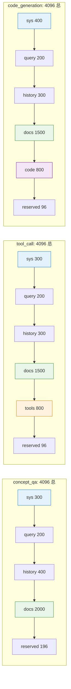
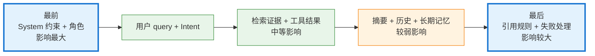

# Context 工程

> 本主题文件存放在 `technical_deep_dive/主题/`，允许题目与其他主题重复。

## 结合项目的详细说明

项目里的 Context Engineering 是整个系统的"装配线"：它决定模型这一轮到底看见什么、按什么顺序看见、每类信息占多少 token、哪些信息被压缩或丢弃。RAG 只是 Context Engineering 的一个子模块，负责外部知识注入；真正的上下文还包括系统指令、用户问题、对话历史、会话摘要、长期记忆、工具结果、检索证据、引用约束和输出格式要求。

### 一、Context Engineering ≠ RAG

| 概念 | 答什么问题 |
|------|---------|
| RAG | "找什么资料" |
| Context Engineering | "最终给模型看什么" |

**Context Engineering 包括 9 个职责**：
1. 来源治理（哪些内容进入）
2. 预算分配（每类多少 token）
3. 去重压缩（长内容裁剪）
4. 证据边界（来源标注）
5. 记忆选择（4 层中选哪些）
6. 工具结果摘要（截断 + 关键字段）
7. 引用校验（CitationManager）
8. 冲突处理（ConflictDetector）
9. Prompt 组装（PromptBuilder）

### 二、9 类上下文来源

```
1. System / Developer 指令
2. User Query
3. Short-term chat history
4. Session Summary
5. Long-term semantic/episodic memory
6. Retrieved documents from RAG
7. Tool results
8. Citation metadata
9. Verifier feedback / retry instructions
```

### 三、ContextManager 装配流程（8 步）

```
build_context 节点
  → 输入: query / history / summary / docs / tools / profile
  → TokenBudget.allocate (按任务类型分预算)
  → truncate_retrieved_docs (按 score × source_priority 加权截断)
  → truncate_chat_history (近 3 轮完整 + 之前摘要)
  → CitationManager 生成 citations (每个 chunk [1][2][3] 编号)
  → PromptBuilder 生成 role-specific prompts:
       - knowledge_prompt
       - verifier_prompt
       - router_prompt
       - code_prompt
  → context_window 拼装 (按优先级顺序)
  → 写入 structured_context
```

### 四、TokenBudget 分配（按任务类型动态）

| 任务类型 | sys | query | history | docs | tools | code | reserved |
|---------|-----|-------|---------|------|-------|------|----------|
| 概念问答 | 300 | 200 | 400 | 2000 | 0 | 0 | 196 |
| 工具调用 | 300 | 200 | 300 | 1500 | 800 | 0 | 96 |
| 代码生成 | 400 | 200 | 300 | 1500 | 0 | 800 | 96 |
| 错误诊断 | 300 | 200 | 300 | 1800 | 600 | 0 | 96 |

> **不是平均分**，是按**任务类型 × 优先级**动态分配。

### 五、上下文排序（影响模型注意力）

按位置影响（模型对首尾更敏感）：

1. **System 边界 + 角色**（最前）
2. **任务说明 + 输出格式**
3. **用户 query + Deep Intent 结果**
4. **高置信检索证据 + 工具结果**
5. **会话摘要 + 最近历史**
6. **长期记忆片段（按相关性）**
7. **引用规则 + 失败处理**（最后）

> **关键工程点**：系统约束放最前，避免被用户输入覆盖。

### 六、压缩的两种对象（不要混）

| 对象 | 方法 | 目的 |
|------|------|------|
| 对话历史 | SummaryMemory 压缩 | 保留任务进展、已确认结论、待办 |
| 检索 Chunk | 关键句抽取 + Top-K | 保留与 query 相关的事实 |

**对话历史压缩 ≠ 检索结果压缩**，目标不同。

### 七、长期记忆注入策略

| 类型 | 注入策略 |
|------|---------|
| 语义记忆（用户偏好、技术栈、业务规则）| 高置信候选，必注入 |
| 情节记忆（过去问过什么、做过什么）| 仅当 query 相关时注入 |

**用相关性 × 重要性 × 时间衰减** 排序，避免过旧历史污染。

### 八、多轮 Query Rewrite

```
用户: "它上次有什么问题？"
  → 改写: "[TKT-001] 这个工单之前有什么问题？"
  → 检索: 用改写后的 query
  → 注入: 仅"近 3 轮完整历史"，不注入全部
```

**改写只服务检索，不代表要把全部历史塞给模型**。

### 九、冲突处理（`context/conflict_detector.py`）

| 冲突类型 | 处理 |
|---------|------|
| 工具结果 vs RAG 文档 | 工具结果优先 + 标注时间和来源 |
| 长期记忆 vs 用户当前表达 | **用户当前表达优先** + 更新长期记忆 |
| 两个文档版本冲突 | 更匹配 query 约束的优先 |

### 十、CitationManager 引用管理

```python
class CitationManager:
    def add_citations(self, chunks: list[dict]) -> list[dict]:
        # 每个 chunk 加 [1][2][3] 编号
        # 输出到 Prompt 时附在每个 chunk 末尾
        # Verifier 用同一编号校验答案引用
```

**引用是 LLM 生成的，不是后处理加的**。Verifier 只检查"是否使用了引用"。

### 十一、PromptBuilder 4 类角色 Prompt

| 角色 Prompt | 用途 | 节点 |
|-------------|------|------|
| `router_prompt` | MasterAgent 路由 | master_agent_node |
| `knowledge_prompt` | KnowledgeAgent 生成 | generate_answer |
| `verifier_prompt` | VerifierAgent 校验 | verify_answer |
| `code_prompt` | CodeGenerator 生成 | generate_code |

**每个角色 Prompt 独立**，`PromptBuilder` 动态拼装。

### 十二、Context 失败处理

| 失败 | 处理 |
|------|------|
| Token 超限 | 截断最不重要的（chat history → summary）|
| 检索为空 | 仍构建 context（让 LLM 回答"无证据"）|
| Tool 失败 | 跳过 tool 段，继续生成 |
| Conflict 不解 | Verifier 标"未解冲突"，触发重新生成 |


### 具体设计和追问点

如果面试官追问"上下文窗口里具体放什么顺序"，可以按优先级回答：系统约束和安全规则最前；然后是用户当前问题和 Deep Intent 结果；再是高质量检索证据和工具结果；之后是会话摘要、最近历史、语义记忆和相关情节记忆；最后是输出格式和引用要求。

**追问 ①：Lost in the Middle 怎么应对？**
- 把最重要证据放**最前**或**最后**（模型对首尾更敏感）
- 不重要的放中间（背景、补充）
- TokenBudget 强制**短窗口**

**追问 ②：上下文窗口越长越好？**
- ❌ 错。4096 是**约束**不是目标
- 多余 Chunk 占预算 → 挤占证据空间
- 无关信息让 LLM 分心 → 增加幻觉

**追问 ③：检索 Chunk 怎么压缩？**
- 关键句抽取（保留事实句）
- 同源去重（near_dedup）
- 引用边界（`[1]` 标记）

**追问 ④：对话历史压缩成什么？**
- SummaryMemory：阶段性目标 + 已确认结论 + 待办 + 关键约束
- **不是简单截断前 N 轮**

**追问 ⑤：长期记忆怎么排序？**
- 相关性（embedding 相似度）
- 重要性（重要度评分）
- 时间衰减（旧的降权）
- 3 个加权

**追问 ⑥：TokenBudget 怎么算？**
- 用 `tiktoken` (OpenAI) 或对应模型 tokenizer
- 跨模型 token 估算偏差 < 5%
- 留 10% 作为生成余量

**追问 ⑦：Context 和 Prompt 什么关系？**
- Context 负责**选材**（哪些内容进）
- Prompt 负责**编排**（按什么结构组织）
- 两者是 Context Engineering 的两个子任务

**追问 ⑧：多轮对话历史怎么注入？**
- 近 3 轮**完整保留**（保持连贯）
- 更早的**摘要注入**（用 SummaryMemory）
- 用户 query 含指代词时**改写**（query_rewriter）

**追问 ⑨：为什么用 [1][2] 而不是 [source_1]？**
- 短编号省 token
- LLM 容易生成（`[1]` 比 `[source_1_path_xxx]` 简单）
- Verifier 也容易校验

**追问 ⑩：Context 复用怎么做？**
- **没有**完整复用（每次请求独立）
- 部分复用：query rewrite 缓存 + retrieved_docs 缓存
- 完全复用：语义缓存（`rag/semantic_cache.py`，仅 verified=true）

---
### v3.2 简化说明

**主要变更**：
- 4 个独立 Workflow 类 → 1 个 BaseRAGWorkflow（通过 mode 参数区分模式）
- 5-tier 降级链 → 3-tier（语义缓存命中 → BaseRAGWorkflow → 失败返回空证据）
- 检索层现在由 RetrievalAgent 代理（agents/retrieval_agent.py），但内部仍是确定性检索逻辑
- IntentCategory 10 → 6；RetrievalMode 5 → 3；AgentState 72 → ~30；eval cases 22 → 8
- CodeAgent 拆分为 CodeGenerator（prompt utility）+ CodeExecutor（agent）


### 流程图

#### 1. ContextManager 装配流程（8 步）

```mermaid
graph TB
    A[build_context 节点触发] --> B[输入 state: query/history/summary/docs/tools/profile]
    B --> C{任务类型?}
    C -->|code_generation| D1[TokenBudget: code 段 800]
    C -->|tool_call| D2[TokenBudget: tools 段 800]
    C -->|concept_qa| D3[TokenBudget: docs 段 2000]
    C -->|error_diagnosis| D4[TokenBudget: tools 段 600]

    D1 & D2 & D3 & D4 --> E[truncate_retrieved_docs<br/>按 score × priority 加权]
    E --> F[truncate_chat_history<br/>近 3 完整 + 之前摘要]
    F --> G[CitationManager.add_citations<br/>每个 chunk 编号 [1][2][3]]
    G --> H[PromptBuilder.build_role_prompts<br/>knowledge/verifier/router/code]
    H --> I[context_window 拼装<br/>按优先级排序]
    I --> J[写 structured_context 进 AgentState]
    J --> K[下游节点使用]

    classDef io fill:#E3F2FD,stroke:#1976D2
    classDef process fill:#FFF3E0,stroke:#F57C00
    classDef gen fill:#E8F5E9,stroke:#388E3C
    class A,B,K io
    class C,D1,D2,D3,D4,E,F process
    class G,H,I,J gen
```

#### 2. TokenBudget 按任务类型分配



#### 3. 上下文位置对模型注意力的影响



## 匹配到的题目（40 道）

### 1. "Lost in the Middle" 具体是什么现象？怎么应对？ [来源:01_RAG核心链路.md | 重要性:A]

**结合项目回答评分：** 7/10（匹配置信度 69/100）

**结合项目的回答：**

结合项目回答：上下文管理由 ContextManager、TokenBudget、CitationManager 和 PromptBuilder 完成。Token 预算按优先级分配：用户问题最高，其次是检索文档、工具结果、会话摘要和历史消息；Prompt 组装时优先放高分、高置信来源，并给每个 Chunk 明确编号和边界。

**完美答案：**

Lost in the Middle" 是 Stanford 和 Meta 在 2023 年的一篇论文中发现的现象：当 LLM 处理长上下文时，它对开头和结尾位置的信息关注度最高，对中间位置的信息关注度显著下降。实验中他们让模型根据上下文回答多文档问题，正确答案放在不同位置时准确率呈明显的 U 型曲线——开头最高、结尾次之、中间最低。这不只是注意力机制的问题，还和模型在预训练阶段的训练数据分布有关（训练数据中重要信息倾向出现在开头和结尾）。应对方案有几个：一是把最相关的文档排在开头或结尾，通过 Rerank 确保排序合理；二是减少上下文总量，宁可少放高质量文档也不堆数量；三是用结构化提示让模型主动扫描全部文档——比如在 Prompt 中明确要求"请逐一检查每条参考资料后作答"；四是设置重叠区，关键文档同时出现在开头和中间位置，增加被注意到的概率。

---

---

### 2. "Lost in the Middle" 的实验结论具体是什么？在实际项目中验证过吗？ [来源:01_RAG核心链路.md | 重要性:A]

**结合项目回答评分：** 10/10（匹配置信度 100/100）

**结合项目的回答：**

结合项目回答：上下文管理由 ContextManager、TokenBudget、CitationManager 和 PromptBuilder 完成。Token 预算按优先级分配：用户问题最高，其次是检索文档、工具结果、会话摘要和历史消息；Prompt 组装时优先放高分、高置信来源，并给每个 Chunk 明确编号和边界。

**完美答案：**

论文的核心结论是：在多文档问答任务中，当正确答案所在的文档处于上下文中间位置时，模型的多文档问答准确率显著低于正确答案在开头或结尾。具体来说，准确率呈 U 型曲线——开头位置最高、结尾位置次之、中间最低，差距可以达到 10%-20%。这种效应随着上下文长度增长而加剧——上下文越长，中间的"塌陷"越深。在 RAG 场景下单文档定位任务也有类似衰减，但没那么极端。我自己在项目中验证过这个现象：我把同一个正确 Chunk 放在 Prompt 的第 2、5、8 位置（共 10 条 Chunk），用 GPT-4 回答问题，确实发现放在第 5 位时模型更倾向于忽略它而基于其他 Chunk 作答。所以我现在固定把 Rerank 分数最高的 2 条 Chunk 放开头、第 3-5 位的 Chunk 放结尾，中间位放低分候选。这个调整很小，但对准确率的提升在 3%-5% 是有的。

---

---

### 3. Chunk 优化思路是什么？ [来源:01_RAG核心链路.md | 重要性:A]

**结合项目回答评分：** 10/10（匹配置信度 100/100）

**结合项目的回答：**

结合项目回答：Chunking 是检索质量核心。Markdown/技术文档按标题层级和段落语义切，通用文本用递归切分加 overlap，FAQ/代码类内容按天然结构切。Chunk 写入时带来源、章节路径、页码、文档类型等元数据，后续用于过滤和引用；优化靠 Recall@K、MRR 和 bad case，而不是拍脑袋调 chunk_size。

**完美答案：**

不是调参数，而是从四个维度系统优化：

   | 维度 | 优化手段 | 效果 |
   |------|---------|------|
   | **粒度** | 根据文档类型适配：FAQ用小Chunk(256t)追求精确，报告用中Chunk(512t)平衡，法律条款用文档结构切分保完整性 | Recall改善最明显 |
   | **重叠** | 10%窗口重叠，保证语义边界信息不丢失 | 减少检索"信息缺口" |
   | **元数据** | 每个Chunk带来源信息：文档标题、章节路径、页码、时间戳。检索时可精确过滤 | 多租户、时效性场景关键 |
   | **多粒度索引** | L1小Chunk精确召回→L2中Chunk提供上下文→L3大Chunk兜底 | 精度+覆盖面双提升 |

   **面试话术"Chunk优化不是调大小参数那么简单，而是一个系统工程：粒度适配文档类型、重叠保上下文、元数据做过滤、多粒度索引做检索漏斗。做完后必须在金标集上验证Recall@5，用数据说话。"

---

---

### 4. Claude Code / Cursor 上下文压缩怎么实现？ [来源:01_RAG核心链路.md | 重要性:A]

**结合项目回答评分：** 10/10（匹配置信度 100/100）

**结合项目的回答：**

结合项目回答：上下文管理由 ContextManager、TokenBudget、CitationManager 和 PromptBuilder 完成。Token 预算按优先级分配：用户问题最高，其次是检索文档、工具结果、会话摘要和历史消息；Prompt 组装时优先放高分、高置信来源，并给每个 Chunk 明确编号和边界。

**完美答案：**

**核心问题项目有1000个文件，LLM上下文窗口只有200K tokens，不可能全塞进去。

   **解决方案——分层压缩```
   L1 项目结构摘要（永远保留）：目录树 + 关键模块描述（~500 tokens）
   L2 当前任务相关文件（全量）：正在编辑的文件全文 + 依赖链文件关键段（~50K tokens）
   L3 历史对话摘要（压缩）：每5轮对话LLM压缩成结构化摘要（~2K tokens）
   L4 代码变更摘要（增量注入）：变更历史摘要（~1K tokens）
   ```

   **渐进式披露Agent先看L1决定找什么→需要具体文件时再去L2检索→不再需要的从上下文移除。关键不是"塞得越多越好"，而是"只在需要时才加载"。

   **面试话术"上下文压缩的精髓是'分层缓存+按需加载'——不是压缩算法本身，而是决定'什么时候加载什么'的策略。这跟RAG的检索思想是一致的：不要把整个知识库塞进Prompt，检索最相关的注入。"

---

---

### 5. IVF和HNSW的差异？ [来源:01_RAG核心链路.md | 重要性:A]

**结合项目回答评分：** 7/10（匹配置信度 63/100）

**结合项目的回答：**

结合项目回答：向量数据库选择 Milvus，是因为项目需要服务化、多集合管理、元数据过滤、多租户扩展。Milvus 存 BGE-M3 向量，配合 HNSW 做 ANN 检索；tenant、文档类型、时间等字段作为 metadata filter。规模上来后可按租户或业务域分 collection/partition。

**完美答案：**

**1) 算法本质差异**

IVF（Inverted File Index，倒排文件索引）基于空间划分思想。核心思路是先对全量向量做K-means聚类，将向量空间划分为nlist个区域（每个区域一个聚类中心/centroid），构建倒排表（每个聚类中心→该区域内的所有向量列表）。检索时，先计算query向量与所有聚类中心的距离，选择最近的nprobe个聚类，然后只在这nprobe个聚类的倒排列表中做精确距离比较。本质上是"先用聚类粗定位、缩小搜索范围、再在局部精确搜索"。

HNSW（Hierarchical Navigable Small World，层级可导航小世界图）基于图搜索思想。核心思路是构建一个多层的近邻图：最底层（Layer 0）包含所有节点，每个节点与其最近邻节点之间建边（类似于六度分隔的小世界网络）；上层是下层的稀疏子集（通过指数衰减概率决定节点是否进入上一层），每层都是近似近邻图。检索时，从最顶层随机入口点开始贪心搜索（每步移动到离query更近的邻居），找到该层最优点后下降到下一层继续搜索，最底层结束。本质上是"从粗到细的多层图跳跃+贪心邻居遍历"。

**2) 构建复杂度对比**

HNSW构建：对每个插入点，需要在每一层搜索其最近邻并建边。复杂度O(N·logN·M)，其中N是数据量、M是每节点最大连接数（默认16~64）。构建过程自然支持增量插入（新增节点直接在图各层搜索后建边），但批量构建质量通常优于增量构建。

IVF构建：K-means聚类复杂度O(N·k·iter)，其中k=nlist（聚类数）、iter是K-means迭代次数。k-means本身是迭代优化，聚类质量取决于初始化和迭代轮数。构建完成后新增节点只需分配到最近聚类中心（O(k)），增量成本很低。但新增大量节点后聚类结构可能退化，需要定期重新聚类。

**3) 内存对比**

HNSW：全内存结构。除了存所有原始向量外，还要存每层图的所有边。M=32时每个节点平均存约32×4字节=128字节的边信息（每个边存邻居ID和层级），加上向量本身（1024维FP16=2KB/条）。百万元规模下内存消耗在GB级别。不适合做磁盘索引。

IVF：可以存原始向量也可以存量化后的向量。IVF+PQ（乘积量化）组合可以将向量压缩到原来1/8~1/16，千万级向量可能只需要几百MB到几GB内存。适合内存受限场景。但PQ压缩会损失精度。

**4) 精度对比**

在nprobe和efSearch足够大（接近暴力搜索范围）时，两者都能达到接近100%召回率。但在实际参数下（有限搜索范围）：
- HNSW在同等搜索开销下通常精度更高，尤其在高召回（Recall>95%）场景下优势明显，因为图结构保证了搜索路径天然向目标方向收敛
- IVF在低召回场景（Recall<90%）下速度快但到了高召回场景下需要增大nprobe（搜索更多聚类），精度-速度trade-off比HNSW更陡峭
- HNSW对高维向量的搜索效果通常优于IVF，因为高维空间下聚类的区分度天然变差（维度诅咒）

**5) 选择决策树**

```
全内存(内存充足)?
 ├─ 是 → 需要最高精度? → HNSW(efConstruction=200-500, M=32-64)
 └─ 否 → 内存受限? → IVF+PQ(节省内存但精度会降)
           └─ 需要稳定低延迟? → IVFFlat(nlist调大可降延迟，但训练慢)
```

---

---

### 6. Long Context 常见思路有哪些？在业务里如何做"能看长文本但不太贵"的折中（摘要／分段／滑窗等）? [来源:01_RAG核心链路.md | 重要性:A]

**结合项目回答评分：** 8/10（匹配置信度 74/100）

**结合项目的回答：**

结合项目回答：上下文管理由 ContextManager、TokenBudget、CitationManager 和 PromptBuilder 完成。Token 预算按优先级分配：用户问题最高，其次是检索文档、工具结果、会话摘要和历史消息；Prompt 组装时优先放高分、高置信来源，并给每个 Chunk 明确编号和边界。

**完美答案：**

回答时按"定义/目标 -> 核心机制 -> 工程落地 -> 指标与风险"展开。先给结论，再说明为什么这样设计，最后结合项目补充延迟、成本、稳定性、评测和安全边界。

---

---

### 7. Long Context 模型（如 Gemini 1.5 的 1M token）在实际使用中效果怎么样？ [来源:01_RAG核心链路.md | 重要性:A]

**结合项目回答评分：** 10/10（匹配置信度 92/100）

**结合项目的回答：**

结合项目回答：上下文管理由 ContextManager、TokenBudget、CitationManager 和 PromptBuilder 完成。Token 预算按优先级分配：用户问题最高，其次是检索文档、工具结果、会话摘要和历史消息；Prompt 组装时优先放高分、高置信来源，并给每个 Chunk 明确编号和边界。

**完美答案：**

我测试过 Gemini 1.5 Pro 的长上下文能力，坦白说感觉是"能用但还没到理想状态"。做 Needle-in-a-Haystack 测试（在长文档中藏一个事实然后问相关问题），在 128K 以内准确率很高，接近 100%；到了 500K 以上准确率开始下降；到了 1M 附近，如果"needle"是非常具体的事实（如一个数字或日期），模型有时找不到或者找到后没有正确运用。另外延迟是很大的实际阻碍——塞满 1M token 的 Prefill 可能需要几十秒甚至更长，对在线服务来说基本不可用。还有一个隐性问题是成本——每次请求消耗 1M token 的输入，API 费用很高。所以我的结论是：Long Context 适合离线或准离线的长文档分析任务（半天跑一次的报告分析、文档审查），但不适合做实时 RAG 的替代方案。它不是 RAG 的"接班人"，更像是 RAG 在特定场景下的"合作伙伴"——RAG 做粗筛，Long Context 做深度分析。

---

---

### 8. Prompt 组装时文档放的顺序对效果有影响吗？ [来源:01_RAG核心链路.md | 重要性:S]

**结合项目回答评分：** 10/10（匹配置信度 100/100）

**结合项目的回答：**

结合项目回答：上下文管理由 ContextManager、TokenBudget、CitationManager 和 PromptBuilder 完成。Token 预算按优先级分配：用户问题最高，其次是检索文档、工具结果、会话摘要和历史消息；Prompt 组装时优先放高分、高置信来源，并给每个 Chunk 明确编号和边界。

**完美答案：**

有影响，而且影响不小。这个现象在业界被称为"Lost in the Middle"——LLM 在处理长上下文时，对开头和结尾位置的文档关注度最高，中间部分容易被忽略。所以我的做法是把 Rerank 分数最高的文档放在 Prompt 的开头位置，次相关的放在结尾，排在后面的放中间。这样做的好处是最关键的信息占据了模型注意力最强的位置。除此之外，我还会在每条 Chunk 前后加明确的分隔标记（如 "【参考资料 1】" 开头、"【结束】" 结尾），并在 Prompt 的指令部分明确告诉模型"优先参考排在前面的资料"，这样模型能更清楚地识别每条 Chunk 的边界和优先级。

---

---

### 9. RAG 切片实现方法：如何设计和优化切片过程？ [来源:01_RAG核心链路.md | 重要性:S]

**结合项目回答评分：** 10/10（匹配置信度 100/100）

**结合项目的回答：**

结合项目回答：Chunking 是检索质量核心。Markdown/技术文档按标题层级和段落语义切，通用文本用递归切分加 overlap，FAQ/代码类内容按天然结构切。Chunk 写入时带来源、章节路径、页码、文档类型等元数据，后续用于过滤和引用；优化靠 Recall@K、MRR 和 bad case，而不是拍脑袋调 chunk_size。

**完美答案：**

切片的实现不是简单地调一个 chunk_size 参数，而是一个需要根据文档类型和业务场景系统设计的工程问题。

**设计阶段——选什么策略、怎么切：**

第一步是文档类型识别。不同文档适合完全不同的切法：纯文本适合按自然段/标题层级语义切分，合同条款适合按"第X条"的规则切分，FAQ适合按Q&A对切分，代码适合按函数/类边界切分，表格需要保留行列结构整表处理。我的做法是在文档解析阶段打上类型标签，后续走不同的切分管线。

第二步是粒度选择。Chunk太大导致主题混杂、Embedding模糊、检索精度下降；Chunk太小导致上下文断裂、信息不完整。需要找到"一个Chunk能独立表达一个完整语义"的平衡点。对于中文企业文档，我通常从512 token起步，但这不是绝对值，而是按文档实际内容密度调整。

第三步是overlap设置。即使语义切分也会在边界处丢失关联信息。overlap通常设为chunk大小的10%~20%，目的是让边界处的关键句子不至于因为被切断而无法独立被检索命中。

第四步是元数据注入。每个Chunk必须携带来源文档名、章节路径、页码、文档类型等元数据，用于检索时的元数据过滤和生成时的来源引用。

**优化阶段——怎么验证和迭代：**

最重要的是建立评测闭环。构建一个覆盖不同文档类型的金标评测集（50~100条query），每次调整切片策略后在评测集上跑Recall@5和MRR。典型的迭代路径：先做baseline（比如固定512 token字符切），然后逐一验证语义切分→调整粒度→加overlap→Parent-Child分层，每步看指标变化。同时收集线上bad case反向分析——召回错误是因为chunk被切断、chunk太大、还是知识库根本没覆盖。优化到最后不是"哪种策略最好"，而是"哪种策略在你的数据和场景下Recall最高"。

**进阶设计——Parent-Child分层和多粒度索引：**

对于需要精确检索同时又要充足上下文的场景，可以采用Parent-Child分层：检索时用小Chunk（精确匹配），返回时把包含该小Chunk的更大上下文（Parent Chunk）送给LLM。多粒度索引则是同时维护L1小Chunk（精确召回）、L2中Chunk（上下文）、L3大Chunk（兜底），检索时像漏斗一样逐级筛选。

---

---

### 10. 为什么做上下文压缩？怎么做的？ [来源:01_RAG核心链路.md | 重要性:A]

**结合项目回答评分：** 10/10（匹配置信度 100/100）

**结合项目的回答：**

结合项目回答：上下文管理由 ContextManager、TokenBudget、CitationManager 和 PromptBuilder 完成。Token 预算按优先级分配：用户问题最高，其次是检索文档、工具结果、会话摘要和历史消息；Prompt 组装时优先放高分、高置信来源，并给每个 Chunk 明确编号和边界。

**完美答案：**

> 这道题体现 RAG 工程化中的"逆向思维"——不是把什么都塞给大模型。

Rerank 只解决了"20个候选文档中选前5个"的问题。但这 5 个 Chunk 直接拼接仍然可能很大（5 × 512 tokens = 2560 tokens），包含大量和 query 无关的句子。直接全部塞给 LLM 有三个问题：
1. **Token 成本增加**（每多 1000 token 输入 ≈ $0.005-0.01）
2. **信息噪声**（无关句子稀释了关键信息）
3. **引用不精确**（回答中说"根据文档显示..."但用户不知道是哪个文档哪个段落）

```python
# src/engine/query_engine.py — 核心逻辑
def compress_context(chunks, query, max_sentences_per_doc=3):
    """
    Step 1: 按标点切句（中英文标点）
    Step 2: 从 query 抽取关键词 + 中文 bigram
    Step 3: 对每个句子按关键词命中数打分
    Step 4: 每个文档只保留得分最高的 N 个关键句
    Step 5: 加上 [文档1] source=合同管理规范 引用编号
    """
    compressed = []
    for i, chunk in enumerate(chunks):
        sentences = split_sentences(chunk.text)  # 中文"。"，英文"."
        keywords = extract_keywords(query)       # 关键词 + bigram
        scored = [(s, score_sentence(s, keywords)) for s in sentences]
        top_sentences = sorted(scored, key=lambda x: x[1], reverse=True)[:max_sentences_per_doc]
        compressed.append(f"[文档{i+1}] source={chunk.metadata['source']}\n" +
                         '\n'.join(s for s, _ in top_sentences))
    return '\n\n'.join(compressed)
```

| | 压缩前 | 压缩后 |
|---|--------|--------|
| Context 长度 | 2560 tokens | ~800 tokens（节省 69%） |
| 无关句子比例 | ~60% | <10% |
| 引用可解释性 | "根据文档..." | "[文档2] 第3.2条 明确规定..." |
| 生成延迟 | 基准 | 相近（LLM输入短了，生成反而更快） |

**面试话术：** "上下文压缩的思路来自一个简单反问——你是宁愿花 token 在无关信息上，还是花少量计算把关键句抽出来？答案是后者。参考了字节 RAG 实践中对检索结果的摘要压缩思想，通过关键句打分和文档编号引用，同时降低了 token 成本、减少了幻觉、提升了引用的可解释性。"

---

---

### 11. 为什么压缩前 70%？最开始的几轮对话明确需求不是很重要吗？ [来源:01_RAG核心链路.md | 重要性:S]

**结合项目回答评分：** 10/10（匹配置信度 95/100）

**结合项目的回答：**

结合项目回答：这题可以落到项目的工程化闭环：FastAPI + LangGraph + RAG + 工具 + 记忆 + 评估闭环；关键能力都有可观测和降级路径；面试时映射到 Milvus/ES 混合检索、Provider 抽象、TokenBudget、Verifier、Data Flywheel 等项目实现。

**完美答案：**

**理解这道题的核心：** 面试官在问"你压缩了70%，那多轮对话前期用户描述的需求信息不是丢了吗？"这实际上暴露了一个关键区分——压缩的70%到底是什么内容。

**压缩的是检索结果，不是对话历史：**

上下文压缩的目标是检索返回的Chunk内容，而不是用户的对话历史。这两者在RAG的Prompt组装中是两条独立的通道：

通道一——对话历史：包含用户的原始问题和之前几轮对话的完整内容。这条通道不参与压缩。它的作用是为LLM提供完整的对话背景，让模型理解"用户在问什么"。通常保留最近N轮（3~5轮）的完整对话，确保前后文连贯。对话历史的长短通过轮数N来控制，而不是通过压缩。

通道二——检索结果：从知识库中检索到的相关Chunk内容。这条通道参与压缩。因为检索到的Chunk通常很长且包含大量与当前query非直接相关的句子，不压缩直接注入会浪费大量token。

**为什么对话历史不需要像Chunk一样压缩：**

对话历史本身已经通过Query Rewrite机制间接保留。多轮对话中，Rewrite模型会把前面几轮的关键信息（实体、约束条件、上下文）融入到改写后的当前query中。比如第1轮问"帮我查一下合同A的付款条款"，第2轮问"那合同B呢"——Rewrite会把"那合同B呢"改写为"合同B的付款条款"，前一轮的"付款条款"语义已经被继承到改写后的query中，不需要把第1轮的全部历史原文再注入Prompt。

同时，保留最近几轮原始对话作为上下文背景仍然是必要的——模型需要知道用户在聊什么话题、前面已经解决了什么问题、当前处于对话的哪个阶段。但这个量通常很小（几轮对话不过几百tokens），远小于检索Chunk的量（几轮检索5个Chunk就是1500+ tokens）。

**70%的压缩率怎么来的：**

在典型场景下，Rerank后的5个Chunk平均每个有400 tokens，总计2000 tokens。经过关键句抽取（每个Chunk保留2~3个与query直接相关的句子），压缩后约600~700 tokens，节省约65%~70%。这个70%是针对Chunk的，对话历史和系统Prompt不在压缩范围内。总体Prompt的节约比例大约是30%~50%，取决于对话历史长度和Chunk数量的比例。

---

---

### 12. 了解上下文压缩机制吗？ [来源:01_RAG核心链路.md | 重要性:A]

**结合项目回答评分：** 10/10（匹配置信度 100/100）

**结合项目的回答：**

结合项目回答：上下文管理由 ContextManager、TokenBudget、CitationManager 和 PromptBuilder 完成。Token 预算按优先级分配：用户问题最高，其次是检索文档、工具结果、会话摘要和历史消息；Prompt 组装时优先放高分、高置信来源，并给每个 Chunk 明确编号和边界。

**完美答案：**

**为什么需要上下文压缩：**

Rerank解决了"20个候选Chunk中选哪些喂给LLM"的问题，但选了5个Chunk直接拼接仍然存在问题。首先，每个Chunk通常有300~512 tokens，5个Chunk就是1500~2560 tokens，其中大量句子与当前query并非直接相关——一个Chunk可能前半段讲"产品概述"（相关），后半段讲"历史版本"（不相关），全部塞进去浪费token。其次，无关内容成为噪声，稀释了关键信息的注意力（Lost in Middle效应加剧）。第三，大块文本拼接导致LLM难以精确回溯"这段信息来自哪个具体位置"，降低了引用的可解释性。

**三种主流压缩方式：**

方式一：关键句抽取（Sentence-level Filtering）。核心思路是把压缩粒度从Chunk级降到句子级。对Rerank后的Top-K Chunk中的每个句子，用轻量级相关性打分（基于query关键词命中、或者用轻量Cross-Encoder给每个句子打分），每个Chunk只保留得分最高的2~3个关键句。保留的句子拼接时加上`[文档1]`来源标记。优点是实现简单、可解释性强、token节省通常50%~70%；缺点是关键词打分的规则较粗糙，复杂语义下可能漏掉重要句子。

方式二：摘要压缩（Summarization-based Compression）。用轻量LLM（如Qwen2-1.5B或API小模型）对每个Chunk做单行摘要，只保留与原始query最相关的一个要点。摘要后的结果比关键句更精炼，但多了一次LLM调用（增加延迟和成本）。适合对token成本极其敏感或上下文窗口很紧张的场景。

方式三：结构化压缩（Structured Compression）。将多条检索结果按"来源+编号+要点"的格式重新组织。例如：将3个Chunk压缩为`[来源1-合同管理规范] 第3.2条: 报销上限5000元；[来源2-财务制度] 第5.1条: 需部门经理审批`。这种格式LLM非常熟悉（类似结构化文档的摘要），信息密度极高。

**压缩效果的量化和权衡：**

一个典型benchmark：5个Chunk原始拼接2560 tokens→关键句抽取压缩后~800 tokens（节省69%），生成质量在大部分场景下不降反升（因为噪声少了），延迟相近（少了token但多了压缩步骤）。不是所有场景都适合压缩——对于简单事实查询（答案就在某一个Chunk的第一句话），压缩可能过度导致信息丢失。最佳实践是：根据query复杂度动态决定是否压缩以及压缩程度。

---

---

### 13. 什么是大模型的幻觉，如何减轻幻觉问题 [来源:01_RAG核心链路.md | 重要性:S]

**结合项目回答评分：** 10/10（匹配置信度 98/100）

**结合项目的回答：**

结合项目回答：幻觉治理靠检索约束、引用、校验和评估闭环。PromptBuilder 要求基于上下文回答，CitationManager 生成来源引用；Verifier Agent 检查答案是否有依据、引用是否存在，不通过就 regenerate 或 fallback；线上 bad case 进入 Data Flywheel，反向优化切分、检索、Prompt 和知识库覆盖。

**完美答案：**

**幻觉的定义和分类：**

大模型幻觉（Hallucination）指模型生成的内容与客观事实不符、缺乏依据、或与提供的上下文矛盾。分为三类：事实性幻觉——模型编造了不存在的实体、事件、数据（如"2025年某公司营收为XX亿"但实际没有）；忠实性幻觉——模型虽然给出了上下文但输出与上下文不一致（如上下文写"A>B"但回答"B>A"）；逻辑性幻觉——推理链中存在逻辑断裂但表面上看起来很合理。

**幻觉的根本原因：**

训练数据层面——预训练数据中存在错误信息、过时信息或偏见，模型学到了这些。模型架构层面——Transformer的生成本质上是概率采样而非事实核查，Softmax输出的是"最可能的下一个token"而非"最正确的下一个token"。解码策略层面——温度采样和top-p带来的随机性使得同一问题可能得到不同答案。RLHF层面——过度优化让模型倾向于"总是给答案"而非"不知道时拒绝"，因为训练中拒绝回答的样本往往获得较低的奖励。

**减轻方案：**

第一道防线：RAG注入外部知识。检索真实、最新的文档作为生成依据，将模型从"凭记忆编造"转为"基于材料回答"。这是目前最有效的方式，但前提是检索质量要到位。

第二道防线：Prompt工程设计。明确指令"仅基于上下文回答"、"信息不足时回答无法确认"、"引用原文证据"；结构化输出要求"先摘录原文→再给出答案"。

第三道防线：上下文优化。压缩噪声、排序优化（高分在前避免Lost in Middle）、控制总量（宁精勿杂）。

第四道防线：输出验证。LLM-as-Judge自检+关键事实正则匹配验证。

第五道防线：微调行为模式。通过SFT训练模型"基于上下文回答"、"不知道时说不知道"的行为习惯，降低模型依赖参数知识编造答案的倾向。

---

---

### 14. 图片怎么输入模型的，一张图片有多少token？ [来源:01_RAG核心链路.md | 重要性:A]

**结合项目回答评分：** 8/10（匹配置信度 73/100）

**结合项目的回答：**

结合项目回答：上下文管理由 ContextManager、TokenBudget、CitationManager 和 PromptBuilder 完成。Token 预算按优先级分配：用户问题最高，其次是检索文档、工具结果、会话摘要和历史消息；Prompt 组装时优先放高分、高置信来源，并给每个 Chunk 明确编号和边界。

**完美答案：**

**一、图片输入VLM的处理流程**

第一步：图像分patch和编码。输入图片先被resize到固定尺寸（如224×224、336×336或动态分辨率），然后按固定大小（如14×14或16×16像素）切分为不重叠的patch。每个patch通过Vision Encoder（通常是ViT架构或CLIP/SigLIP的视觉分支）编码为一个特征向量。例如224×224的图按16×16切分为(224/16)×(224/16)=196个patch，加上一个CLS token（全局表示），共197个视觉token。

第二步：通过Projector映射到LLM空间。Vision Encoder输出的是视觉特征空间的向量，维度与LLM的embedding空间不同。需要一个Projector（通常是MLP层或Cross-Attention模块）将这些视觉特征向量线性/非线性映射到LLM的token embedding空间。映射后，每个patch的向量与LLM的文本token embedding维度一致，可以"混排"输入Transformer。

第三步：图片token与文本token拼接送入LLM。最终输入序列可能是：`[<image>] [patch_1] [patch_2] ... [patch_N] [</image>] [文本token_1] [文本token_2] ...`。其中特殊token `<image>` 和 `</image>` 标记图片的起止位置，模型在自注意力中能处理图片patch tokens和文本tokens之间的交互。

**二、一张图片有多少token**

取决于模型的具体设计：

- LLaVA风格（ViT-L/14 + 2层MLP projector）：224×224→14×14切分→(224/14)²=256个patch tokens（+CLS token），约257个视觉token。336×336→(336/14)²=576个patch tokens。
- Qwen2-VL（支持动态分辨率）：使用Naive Dynamic Resolution策略，图片被resize到多个候选分辨率后按14×14切patch。典型情况下，一张1080P的截图可能产生2000~4000个视觉token。
- GPT-4V/4o：官方未公开具体token映射规则，但根据计费可反推——一张高清图通常消耗几百到几千token不等。粗略估算：低分辨率图片（~512×512）约800~1700 token，高分辨率图片（~1024×1024）约2000~4000 token。

**token消耗的实践经验：**

图片的token消耗远高于文本——1张中等分辨率的图片（~500 visual tokens）相当于300~500个英文单词的文本量，但信息密度远高于同量文本。在VLM API调用中，图片token是主要成本。优化建议：优先降低图片分辨率至信息的最低必要水平（如果是检查颜色，不需要4K原图）、多图场景控制图片数量（超过3张图后边际信息增益递减）、对于纯文字图片优先OCR提取文字用文本输入而非图片输入。

---

---

### 15. 大模型幻觉（Hallucination）解决方案：如何缓解模型幻觉问题，稳定输出？ [来源:01_RAG核心链路.md | 重要性:S]

**结合项目回答评分：** 10/10（匹配置信度 100/100）

**结合项目的回答：**

结合项目回答：幻觉治理靠检索约束、引用、校验和评估闭环。PromptBuilder 要求基于上下文回答，CitationManager 生成来源引用；Verifier Agent 检查答案是否有依据、引用是否存在，不通过就 regenerate 或 fallback；线上 bad case 进入 Data Flywheel，反向优化切分、检索、Prompt 和知识库覆盖。

**完美答案：**

RAG系统下的幻觉治理不是一个技术点，而是一个分层防御体系。

**第一层：检索质量保障（源头治理）**

幻觉最常见根源是检索没召回正确文档——模型基于不相关的上下文或自身参数知识编造答案。从根本上降低幻觉的前提是检索质量到位。具体手段：优化Chunk策略确保信息完整性、选对Embedding模型确保语义匹配精度、Hybrid Search互补精确匹配和语义匹配、Rerank精排保证Top结果高相关、Query Rewrite消除指代和术语问题。检索端的Recall@5如果没有做到85%+，生成端的幻觉治理就是舍本逐末。

**第二层：生成约束（Prompt层）**

即使检索到了正确信息，模型也可能忽略上下文而基于自身参数知识回答。Prompt层面的关键约束包括：
- 明确指令："请仅基于以下参考资料回答。如果参考资料中没有相关信息，请明确回答'根据现有资料，我无法回答此问题'"
- 先引用再回答：要求模型在回答中标注每条信息的来源编号，引用原文关键句，这强迫模型"对齐"到上下文
- 禁止推断："请不要做超出原文内容的推断或猜测。如果原文没有明确说明，请不要补充"
- 自我检查：在回答末尾要求模型自检"以上回答中的所有事实是否都能在参考资料中找到依据？"

**第三层：上下文优化（信噪比治理）**

上下文太长、噪声太多会加剧Lost in Middle效应和误导风险。手段：关键句压缩去掉不相关句子（每个Chunk只保留与query最相关的2~3句）、按Rerank分数排序（最高分放开头/结尾，避免埋在中间）、控制上下文总量（简单查询3个Chunk，复杂查询最多8个）、设置Rerank分数阈值（低于阈值的Chunk直接丢弃）。

**第四层：事后验证（自动化评估）**

生成答案后做自动化校验，作为上线前的最后一道防线：
- Faithfulness检查：用LLM-as-Judge将回答拆为独立声明，逐条检查是否在检索到的上下文中找到依据。任一声明无依据→标记为潜在幻觉
- 关键事实二次校验：对涉及数字、日期、金额、人名等关键事实，从原文中做字符串级别的精确匹配验证
- 一致性检查：同一问题在不同上下文下多次查询，回答是否一致

**第五层：知识库质量治理（数据层）**

如果知识库本身有错误、过时或自相矛盾的信息，模型"忠实引用"反而产生幻觉。治理手段：文档入库前做质量审核（自动+人工）、定期检查文档时效性（标注过期时间）、冲突检测（同一实体在多个文档中有矛盾信息时报警）。

**稳定输出的额外保障：**

- 拒绝回答机制：Faithfulness检查不过关时，不回传可能错误的答案，改为"无法确认"的标准化回复
- Fallback策略：Retrieval失败或生成置信度低时，降级为精确搜索或人工转接
- 输出格式约束：用JSON Schema或正则约束输出格式，防止格式漂移引发下游解析错误

---

---

### 16. 如何处理问题输入不标准的情况？混合检索的权重怎么配置？ [来源:01_RAG核心链路.md | 重要性:S]

**结合项目回答评分：** 10/10（匹配置信度 100/100）

**结合项目的回答：**

结合项目回答：在线检索是 Agentic Hybrid RAG。Deep Intent/检索路由判断问题类型后，调用 Milvus 向量检索、Elasticsearch BM25/IK 中文分词检索和可选 GraphRAG；结果用 RRF 融合，再进入 Rerank 和上下文构建。检索失败有降级链：Graph 失败不影响向量+关键词，Milvus 不可用可退到 ES/内存关键词兜底。

**完美答案：**

按链路回答：文档解析、chunk、embedding、入库、query rewrite、hybrid search、rerank、上下文组装、生成与引用。核心判断是先保证召回正确文档，再优化 rerank 和生成；排查 bad case 时记录 query、检索结果、分数、最终 prompt 和答案，用 Recall@K、MRR、NDCG 与 faithfulness 做量化。

---

---

### 17. 如何平衡块的大小与信息完整性？GraphRAG适用于解决哪些传统RAG难以处理的问题场景？ [来源:01_RAG核心链路.md | 重要性:A]

**结合项目回答评分：** 10/10（匹配置信度 100/100）

**结合项目的回答：**

结合项目回答：GraphRAG 是混合检索的一路增强信号。传统 RAG 负责快速找语义相关 Chunk，GraphRAG 负责实体关系、多跳依赖和全局结构理解；Neo4j 或图检索失败是非致命的，RetrievalRouter 会降级到 hybrid_only 或 keyword_vector_only。

**完美答案：**

**第一部分：Chunk大小与信息完整性的平衡**

Chunk大小是一个经典的trade-off——Chunk太小（如128 tokens），Embedding编码精度高、检索精准但单个Chunk可能缺乏完整的上下文信息（一个句子"该指标上升了15%"缺了主语和时间，单独看不懂）；Chunk太大（如1024 tokens），上下文完整但Embedding变模糊（一个Chunk包含了多个主题的混杂信息）、检索精度下降。

平衡策略不是找一个"最优大小"，而是用Parent-Child分层解决根本矛盾：检索时用小Chunk（如256 token的子片段），确保检索精度——每个小Chunk主题单一、Embedding区分度高；返回给LLM时用包含该小Chunk的Parent Chunk（如整个段落或章节），确保上下文完整。这样在同一套系统中，检索和生成各取所需——检索要精准用小的，生成要完整用大的。

其他补充策略：语义切分保证每个Chunk主题完整（在语义转折点断开，避免混入无关信息）、Overlap在边界处保留10%~20%重叠防止关键信息被切断、多粒度索引让系统根据query复杂度动态选择Chunk粒度（简单query小Chunk、复杂query大Chunk）。

**第二部分：GraphRAG解决的传统RAG难以处理的问题**

传统RAG本质上是"文档片段匹配"——把query向量和Chunk向量做相似度检索，拿最匹配的几个片段给LLM回答。这种"片段级"检索在以下三类问题上力不从心：

问题一：跨文档多跳推理。传统RAG一次检索只能拿到"和query最像的片段"，但如果答案需要串联多个文档中的信息——比如"合同A引用的法规B的最新修订版是什么"——这需要先从合同A中找到引用的法规B、再从法规库中找到B的最新版本，两次检索之间存在依赖关系。传统RAG的"一跳"无法处理这种链式推理。GraphRAG通过知识图谱的实体-关系-实体路径遍历，天然支持多跳——在图谱上从"合同A"节点沿"引用"边走到"法规B"节点，再沿"版本"边走到"最新修订版"节点。

问题二：全局性总结和分析。传统RAG能告诉你"搜索返回的结果中有什么"，但无法告诉你"整个知识库的整体情况是怎样的"。比如问"公司所有产品的共同技术特点是什么"，传统RAG最多召回8个Chunk、每个讲一个产品、LLM从这8个片段中勉强归纳；但如果有100个产品，这8个Chunk的采样根本无法代表全局。GraphRAG通过Community Detection将实体聚类、为每个社区生成摘要，提供了"俯瞰"整张图的宏观视角。

问题三：实体密集型知识的精确关联。法律、医药、金融等领域的知识以实体和关系为核心——法条之间的引用、药物和靶点的作用、公司和供应商之间的交易。传统RAG的向量相似度在这种场景下像是"用模糊匹配找精准关系"，效果不稳定。GraphRAG用图结构精确存储和查询这些关系，从"这段文字像不像你的问题"升级为"这个实体和那个实体有没有直接边"。

**面试总结：** Chunk大小不要盲调，用Parent-Child分层从根本上解耦检索精度和上下文完整性的矛盾。GraphRAG上不上的判断标准是query类型——如果关系推理型query占比显著且影响核心业务，值得投入；否则先把传统RAG做好。

---

---

### 18. 如何构建评估体系来验证一个RAG系统是否真正Work？ [来源:01_RAG核心链路.md | 重要性:A]

**结合项目回答评分：** 10/10（匹配置信度 100/100）

**结合项目的回答：**

结合项目回答：这题可以落到项目的工程化闭环：FastAPI + LangGraph + RAG + 工具 + 记忆 + 评估闭环；关键能力都有可观测和降级路径；面试时映射到 Milvus/ES 混合检索、Provider 抽象、TokenBudget、Verifier、Data Flywheel 等项目实现。

**完美答案：**

按链路回答：文档解析、chunk、embedding、入库、query rewrite、hybrid search、rerank、上下文组装、生成与引用。核心判断是先保证召回正确文档，再优化 rerank 和生成；排查 bad case 时记录 query、检索结果、分数、最终 prompt 和答案，用 Recall@K、MRR、NDCG 与 faithfulness 做量化。

---

---

### 19. 对于RAG中的文档，通常采用哪些策略进行分块（chunk）？ [来源:01_RAG核心链路.md | 重要性:S]

**结合项目回答评分：** 10/10（匹配置信度 100/100）

**结合项目的回答：**

结合项目回答：Chunking 是检索质量核心。Markdown/技术文档按标题层级和段落语义切，通用文本用递归切分加 overlap，FAQ/代码类内容按天然结构切。Chunk 写入时带来源、章节路径、页码、文档类型等元数据，后续用于过滤和引用；优化靠 Recall@K、MRR 和 bad case，而不是拍脑袋调 chunk_size。

**完美答案：**

这道题侧重策略枚举和横向对比，有助于面试时展示你对各种方案的全面了解。

| 策略 | 原理 | 优点 | 缺点 | 适用场景 |
|------|------|------|------|---------|
| 固定大小切分 | 按固定字符/token数切 | 实现简单、速度快、可预测 | 无视语义，常截断句子 | 快速原型、baseline |
| 递归字符切分 | 按\\n\\n→。→，优先级递归切 | 比固定大小智能，保留基本语义单元 | 不理解深层结构 | 通用文本、LangChain默认方案 |
| 语义切分 | 相邻句Embedding相似度断点处切 | 语义连贯、Embedding质量高 | 计算开销大、对非叙述内容效果差 | 长文档、叙述性文本 |
| 句子窗口 | 每个Chunk少量句子+返回时带上下文窗口 | 检索精度高 | 需要额外上下文拼接逻辑 | 精确检索场景 |
| 按标题层级切分 | 利用Markdown H1/H2/H3结构 | 结构信息完整、自然 | 只适用结构化文档 | 技术文档、产品手册 |
| 按规则切分 | 文档特定规则（合同条款号、FAQ Q&A对） | 领域效果最优 | 通用性差，需定制度高 | 合同、FAQ、法规 |
| Page-based | 每页一个Chunk | 文档结构完整 | 内容密度不一致 | PDF、ColPali方案 |
| Parent-Child分层 | 小Chunk检索+大Chunk返回 | 精度和上下文兼顾 | 存储和实现复杂 | 中大型RAG系统 |
| 多粒度索引 | 同时维护多粒度索引 | 覆盖所有query需求 | 存储成本高、维护复杂 | 高质量生产系统 |

**选择建议的优先级：**

第1优先：看文档有没有可利用的结构——有标题层级用标题切、有条款号用规则切，这是信息损失最小的方式。

第2优先：如果文档没有明确结构（如纯叙述文本），用语义切分，在语义断点处切分保留完整性。

第3优先：如果语义切分计算成本太高或效果不好，回退到递归字符切分，至少能保留句子边界。

第4优先：如果对精度要求很高但对成本不敏感，上Parent-Child或多粒度索引。

**最终判断标准：** 不管你选哪种策略，最终都要在评测集上验证。我见过很多项目纠结选什么策略，但真正应该纠结的是——你的评测集够不够好、指标够不够稳定。策略没有绝对好坏，只有适不适合你的数据和场景。

---

---

### 20. 现在的embedding模型有哪些问题？怎么改进？ [来源:01_RAG核心链路.md | 重要性:A]

**结合项目回答评分：** 10/10（匹配置信度 100/100）

**结合项目的回答：**

结合项目回答：Embedding 层使用 BGE-M3，理由是中英双语、1024 维表达能力、dense/sparse/ColBERT 多表示能力和本地部署成本可控。工程上封装为 EmbeddingProvider，模型不可用时降级到 Mock/RandomEmbeddingProvider；召回优化还依赖 BM25 精确匹配、Milvus 语义召回和 RRF 融合。

**完美答案：**

**问题一：长度衰减问题。** 大多数Embedding模型在512 token以内编码质量很好，但超过512 token后编码精度明显下降。即使模型号称支持8192 token输入，实际在长文本上的检索精度也远不如短文本。原因是训练时大多用短文本对，长文本-长文本的训练数据稀缺。改进方向：训练时混合不同长度的样本，做长度感知的对比学习；工程侧用Parent-Child分层（用小Chunk检索、大Chunk返回），不依赖单个Embedding编码超长文本。

**问题二：精确信息丢失。** Embedding把一段文本压缩成固定维度向量，这个压缩过程天然有损。产品型号、错误码、日期、金额、电话号码这类精确信息在向量编码中容易被"模糊化"——向量检索可能把"E40012"和"E40013"这两个完全不同的错误码当成相似。改进方向：引入Hybrid Search，用BM25/Sparse Embedding做精确关键词匹配，弥补Dense Embedding的精确信息丢失；或者使用多向量模型（如ColBERT）保留token级信息。

**问题三：多语言表现不均衡。** 很多Embedding模型在英文上表现好但在中文上明显差，或者中英混合文本处理不好。原因是训练数据语言分布不均。改进方向：选择多语言专门训练的模型（如bge-m3、multilingual-e5）；在自有数据上做多语言对比学习微调；对中英混合场景，可以用中英分别编码后融合。

**问题四：领域泛化能力差。** MTEB排行榜第一的模型在你的业务数据上可能表现平平。因为通用模型训练数据和你业务文档的领域分布差距大——通用模型可能没见过的的领域术语、缩写和表达方式。改进方向：在业务数据上微调Embedding模型（用对比学习+业务query-doc对）；使用Instructor这类支持instruction的模型，通过自然语言指令引导模型关注特定领域语义。

**问题五：query和document编码不对称。** 训练时query是短文本（一句话），document是长文本（一段/一篇），但在线推理时query编码器独立编码看不到document，document编码器独立编码看不到query，这种"双塔隔离"限制了精度上限。改进方向：用Cross-Encoder做Rerank补精排；使用ColBERT这类late interaction模型保留部分交互能力。

**问题六：无法捕捉否定和条件语义。** 传统的双塔Embedding对"哪个产品不是2024年发布的"这类否定式查询、"如果满足条件A则答案B"这类条件式查询，理解能力很弱。因为向量空间中的相似度是线性的，缺少逻辑推理能力。改进方向：配合Query理解模块（把否定/条件查询转成多步检索）；在下游用LLM做最终判断而不是完全依赖向量排序。

---

---

### 21. 请阐述RAG的核心原理，并说明如何通过 RAG 缓解大模型的幻觉问题。 [来源:01_RAG核心链路.md | 重要性:S]

**结合项目回答评分：** 10/10（匹配置信度 100/100）

**结合项目的回答：**

结合项目回答：RAG 全流程分离线和在线两段。离线侧是文档解析、清洗、Chunk、BGE-M3 Embedding、Milvus/ES/MinIO 入库；在线侧由 Deep Intent 判断问题类型，Query Rewrite 补全术语，Milvus 向量检索和 ES BM25/IK 检索并行召回，RRF 融合后可选 Rerank，再由 TokenBudget/PromptBuilder 组装上下文，Knowledge Agent 生成，Verifier Agent 校验事实和引用，最后保存 trace、metrics 和反馈。

**完美答案：**

按链路回答：文档解析、chunk、embedding、入库、query rewrite、hybrid search、rerank、上下文组装、生成与引用。核心判断是先保证召回正确文档，再优化 rerank 和生成；排查 bad case 时记录 query、检索结果、分数、最终 prompt 和答案，用 Recall@K、MRR、NDCG 与 faithfulness 做量化。

---

---

### 22. Agent工具调用流程？检索策略怎么选？ [来源:02_Agent核心原理.md | 重要性:A]

**结合项目回答评分：** 10/10（匹配置信度 100/100）

**结合项目的回答：**

结合项目回答：项目采用 80% Workflow + 20% Agent 的混合架构。LangGraph StateGraph 定义 16 个节点和条件边，保证主流程可控；Router/Deep Intent、Knowledge Agent、Tool Agent、Verifier Agent 在关键节点做动态决策。这样既能避免纯 Agent 的不可控和死循环，又保留了根据中间结果选择检索策略、工具调用、答案校验和失败恢复的灵活性。

**完美答案：**

**工具调用流程用户Query→LLM分析→决定调用哪个Function→生成JSON参数→执行→结果注入上下文→LLM基于结果生成最终回答。

   **检索策略选择单步简单查询→直接用RAG向量检索；多步推理(数据依赖)→Function Call分步调用；需要比较多个数据源→并行调用；依赖外部API(天气/股票)→Function Call封装API。

---

---

### 23. Agent记忆系统怎么设计？ [来源:02_Agent核心原理.md | 重要性:A]

**结合项目回答评分：** 10/10（匹配置信度 100/100）

**结合项目的回答：**

结合项目回答：项目的记忆系统按四层设计。第一层是上下文窗口，由 ContextManager/PromptBuilder/TokenBudget 组装模型当前能看到的 prompt、历史消息、检索片段、工具结果和记忆片段；第二层是工作记忆，用 LangGraph AgentState 和 CheckpointStore 保存计划、步骤、中间结果、工具调用状态和重试状态；第三层是短期记忆，用 ShortTermMemory 保存当前会话最近消息，并用 SummaryMemory 压缩长会话；第四层是长期记忆，用 UserMemory、LongTermMemory、RAG 知识库和可选 Neo4j 保存跨会话偏好、项目背景、历史经验、外部知识和关系。长期记忆内部再分情节记忆和语义记忆：情节记忆记过去发生过什么，语义记忆记稳定知识、偏好和业务规则。

**完美答案：**

**四层记忆/上下文架构：**

| 层 | 存什么 | 项目实现 | 例子 |
|---|---|---|---|
| 上下文窗口 | 模型当前能直接看到的 prompt、历史消息、检索片段、工具结果、记忆片段 | ContextManager / PromptBuilder / TokenBudget | 本轮问题、最近消息、Top-K 文档、工具返回结果 |
| 工作记忆 | 当前任务执行过程中的临时状态：计划、步骤、中间结果、工具调用状态、重试状态 | LangGraph AgentState + CheckpointStore | retrieve 已执行、verify 第 1 次失败、下一步 regenerate |
| 短期记忆 | 当前会话内的多轮对话历史和会话摘要 | ShortTermMemory(Redis/PG) + SummaryMemory | 最近 N 轮对话、当前 session 的阶段性摘要 |
| 长期记忆 | 跨会话持久保存的用户偏好、项目背景、历史经验、外部知识和关系 | UserMemory + LongTermMemory + RAG 知识库 + 可选 Neo4j | 用户偏好中文回答、项目技术栈、上次做过鸿蒙 RAG 项目 |

长期记忆内部再分两类：情节记忆记"过去发生过什么"，例如用户上次问过 LangGraph、做过鸿蒙 RAG 项目、某次任务的结果；语义记忆记"稳定知识和偏好"，例如用户偏好中文回答、项目技术栈、领域知识、业务规则。

写入不是所有内容都长期保存：当前消息默认进入短期记忆；会话变长后用 SummaryMemory 压缩；只有稳定偏好、长期事实或有复用价值的历史事件，才通过 MemoryClassifier 提升到长期记忆。读取时先组装上下文窗口，再按 query 检索长期记忆，并用相关性、重要性、时间衰减做融合排序，避免无关历史污染 Prompt。

---

---

### 24. Context Engineering 和 RAG 的关系是什么？ [来源:02_Agent核心原理.md | 重要性:A]

**结合项目回答评分：** 10/10（匹配置信度 100/100）

**结合项目的回答：**

结合项目回答：上下文管理由 ContextManager、TokenBudget、CitationManager 和 PromptBuilder 完成。Token 预算按优先级分配：用户问题最高，其次是检索文档、工具结果、会话摘要和历史消息；Prompt 组装时优先放高分、高置信来源，并给每个 Chunk 明确编号和边界。

**完美答案：**

RAG 是 Context Engineering 的一个子组件。Context Engineering 负责的是"如何构建最优上下文"这个系统性问题，RAG 专门负责其中的"知识注入"这个环节——从外部知识库中检索相关信息并注入上下文。打个比方，Context Engineering 是整条汽车生产线——管理所有零部件的来源、质量、组装顺序和最终交付。RAG 是这条生产线上负责"外部零件供应"的环节——确保需要的零件能从仓库中找到并准时送到装配位。好的 Context Engineering 需要 RAG，但仅有 RAG 远远不够——你还需要管理对话历史、工具定义、任务状态、用户偏好、以及这些信息的优先级排序和空间分配。很多项目把精力全投在优化 RAG 检索上，但忽略了上下文的其他组成部分，结果检索做得很好了但整体效果还是不好——因为上下文组装的其他环节拖了后腿。

---

---

### 25. MCP跨平台兼容技术如何实现？ [来源:02_Agent核心原理.md | 重要性:A]

**结合项目回答评分：** 8/10（匹配置信度 74/100）

**结合项目的回答：**

结合项目回答：工具调用由 ToolRegistry、ToolAgent、ToolExecutor 和 PolicyEngine 分层完成。LLM 或规则先决定工具名和参数，Executor 执行前做 schema 校验、权限检查和安全分级，敏感工具需要确认，危险工具拒绝或沙箱隔离。工具失败不会无限循环，LangGraph 节点有重试上限，失败后进入 RecoveryManager 的重试、降级或人工兜底。

**完美答案：**

MCP（Model Context Protocol）本质是标准化的工具接口协议。跨平台靠两部分：①**Transport层抽象支持stdio（本地进程通信）和HTTP-SSE（远程服务），实现跨语言/跨部署。②**统一Schema所有工具都遵循`{name, description, inputSchema}`的标准JSON Schema格式，跟调用语言无关。

---

---

### 26. Structured Outputs 底层的受限解码是怎么实现的？ [来源:02_Agent核心原理.md | 重要性:A]

**结合项目回答评分：** 10/10（匹配置信度 100/100）

**结合项目的回答：**

结合项目回答：这题可以落到项目的工程化闭环：FastAPI + LangGraph + RAG + 工具 + 记忆 + 评估闭环；关键能力都有可观测和降级路径；面试时映射到 Milvus/ES 混合检索、Provider 抽象、TokenBudget、Verifier、Data Flywheel 等项目实现。

**完美答案：**

受限解码（Constrained Decoding）的核心思路是在模型生成每个 token 时，根据目标 schema 实时计算当前允许的 token 集合，屏蔽所有不合法的 token。具体实现是先把 JSON Schema 或正则表达式编译成一个有限状态自动机（Finite State Automaton），这个自动机定义了在生成序列的每一个位置，哪些字符/token 是合法的。比如生成到字段名 "name" 之后，自动机知道接下来只能出现冒号和引号，数字和逗号在这个位置就是不合法 token 会被屏蔽。模型的 softmax 输出后，先和 token mask 做逻辑与——合法 token 的 logit 保持不变，不合法 token 的 logit 被设为负无穷——然后才做采样。这样从根本上杜绝了格式错误的产生。OpenAI 的 Structured Outputs 用的就是这个技术路线（基于开源库 outlines 或 lm-format-enforcer 类似的思路）。Instruction-based 的方法（如 OpenAI 之前版本的 JSON Mode）只是用 Prompt 强约束，但模型仍然可能在极少数情况下输出不合规内容。受限解码是"硬保证"，代价是实现复杂，需要将 schema 转换为高效的自动机表示。不过目前主流的 LLM API 在逐步内置这个能力，应用层的接入成本在快速降低。

---

---

### 27. 上下文工程最关键的工作是什么？渐进式披露与RAG的关系？ [来源:02_Agent核心原理.md | 重要性:A]

**结合项目回答评分：** 10/10（匹配置信度 100/100）

**结合项目的回答：**

结合项目回答：上下文管理由 ContextManager、TokenBudget、CitationManager 和 PromptBuilder 完成。Token 预算按优先级分配：用户问题最高，其次是检索文档、工具结果、会话摘要和历史消息；Prompt 组装时优先放高分、高置信来源，并给每个 Chunk 明确编号和边界。

**完美答案：**

**上下文工程的核心** = 在有限的上下文窗口中，精准注入Agent完成任务所需的最相关信息。

   **渐进式披露** = 先给Agent全局地图（项目结构摘要），Agent按需检索具体内容（通过RAG检索相关文件），用过的内容可随时替换。这本质上是一个"动态RAG"——Agent自主决定何时检索、检索什么、何时丢弃。

   **类比一般RAG是"在进来之前就决定了给什么上下文"；渐进式披露是"Agent在执行过程中动态决定拉什么上下文"。

---

---

### 28. 你在实际项目中是怎么组装上下文的？优先级怎么排？ [来源:02_Agent核心原理.md | 重要性:A]

**结合项目回答评分：** 10/10（匹配置信度 100/100）

**结合项目的回答：**

结合项目回答：上下文管理由 ContextManager、TokenBudget、CitationManager 和 PromptBuilder 完成。Token 预算按优先级分配：用户问题最高，其次是检索文档、工具结果、会话摘要和历史消息；Prompt 组装时优先放高分、高置信来源，并给每个 Chunk 明确编号和边界。

**完美答案：**

我的做法是分层的。最底层是系统指令（System Prompt），定义 Agent 的角色、能力边界和行为规范——这部分是固定的，每次请求都带上。第二层是当前任务状态——包括用户的原始需求、已完成/未完成的步骤、中间产生的重要结果。这一层优先级最高，因为它是 Agent "知道自己在干什么"的基础。第三层是与当前步骤直接相关的工具定义——不是把所有工具都带上，而是根据当前上下文动态筛选 3-5 个最可能用到的工具。第四层是 RAG 检索到的相关文档或知识片段——按相关度排序，取 top-K。第五层是用户画像和偏好——从长期记忆中检索，属于"锦上添花"的信息。最后是近几轮的对话历史。优先级排序的原则是：任务执行必需的信息 > 辅助提升质量的信息 > 个性化增强的信息。当 token 不够时，从后往前砍——先砍对话历史，再砍用户画像，尽量保住系统指令和任务状态。

---

---

### 29. 在记忆系统中，意图识别 承担什么职责？ [来源:02_Agent核心原理.md | 重要性:A]

**结合项目回答评分：** 7/10（匹配置信度 66/100）

**结合项目的回答：**

结合项目回答：记忆系统按四层设计：上下文窗口负责本轮模型可见的 prompt、历史消息、工具结果和记忆片段；工作记忆用 LangGraph State/Checkpoint 保存计划、步骤、中间结果和重试状态；短期记忆用 Redis/PG 保存当前会话历史，并用 SummaryMemory 压缩长会话；长期记忆用 UserMemory、LongTermMemory、RAG 知识库和可选图数据库保存跨会话偏好、项目背景、历史经验和外部知识。其中长期记忆再分情节记忆和语义记忆：情节记忆记过去发生过什么，语义记忆记稳定知识、偏好和业务规则。

**完美答案：**

建议讲四层：上下文窗口保存模型当前能直接看到的 prompt、历史消息和工具结果；工作记忆保存当前任务的计划、步骤、中间结果和工具状态，通常体现为 LangGraph State；短期记忆保存当前会话历史和会话摘要；长期记忆保存跨会话偏好、项目背景、历史经验和外部知识。长期记忆内部再分情节记忆和语义记忆：情节记忆记过去发生过什么，语义记忆记稳定知识、偏好和业务规则。写入要有触发条件，读取要做相关性、重要性和时间衰减过滤。面试时补一句：不是记得越多越好，记忆注入会增加 token 成本和污染风险。

---

---

### 30. 当上下文超出 token 限制时，你的裁剪策略是什么？ [来源:02_Agent核心原理.md | 重要性:A]

**结合项目回答评分：** 8/10（匹配置信度 73/100）

**结合项目的回答：**

结合项目回答：上下文管理由 ContextManager、TokenBudget、CitationManager 和 PromptBuilder 完成。Token 预算按优先级分配：用户问题最高，其次是检索文档、工具结果、会话摘要和历史消息；Prompt 组装时优先放高分、高置信来源，并给每个 Chunk 明确编号和边界。

**完美答案：**

裁剪策略要有层次感。第一步是"减量"——对较旧的对话历史做摘要压缩而不是直接丢弃，保留关键信息的要点版本。第二步是"去重"——工具调用的结果如果很长（比如一个搜索返回了 5000 字的网页全文），只保留和当前任务相关的部分，或者做摘要提取。第三步是"降级"——如果还是超限，减少 RAG 检索返回的文档数量（比如从 top-5 降到 top-3），减少携带的工具定义数量。第四步是最激进的做法——裁剪对话历史只保留最近 N 轮原始对话加摘要。我认为一个重要的设计原则是"可预测裁剪"——不要在 LLM 不知情的情况下偷偷丢掉信息。最好在上下文接近上限时给 LLM 一个提示："当前对话历史很长，更早的内容已被摘要为：{摘要}，如果需要详细信息请告诉我"。这样 LLM 至少知道自己"不知道什么"，可以根据需要请求更多信息。还有一点：不要等触顶才裁剪，应该有"水位线"机制——比如 80% 容量时就开始做增量摘要，留出缓冲。

---

---

### 31. 跨境汇款场景下Agent超时/失败如何应对并保证资金安全？ [来源:02_Agent核心原理.md | 重要性:S]

**结合项目回答评分：** 7/10（匹配置信度 66/100）

**结合项目的回答：**

结合项目回答：项目采用 80% Workflow + 20% Agent 的混合架构。LangGraph StateGraph 定义 16 个节点和条件边，保证主流程可控；Router/Deep Intent、Knowledge Agent、Tool Agent、Verifier Agent 在关键节点做动态决策。这样既能避免纯 Agent 的不可控和死循环，又保留了根据中间结果选择检索策略、工具调用、答案校验和失败恢复的灵活性。

**完美答案：**

**四层安全保障①**幂等性Token每次请求带唯一idempotency_key，重复请求不重复扣款 ②**两阶段提交先预授权→确认收款方信息正确→再正式扣款 ③**超时自动回滚任一环节超时→触发SAGA补偿事务→撤销已完成步骤 ④**人工兜底异常状态转人工审核，确保每一笔资金操作有据可查。

---

---

### 32. 长期记忆和短期记忆是什么？怎么设置 [来源:02_Agent核心原理.md | 重要性:A]

**结合项目回答评分：** 7/10（匹配置信度 70/100）

**结合项目的回答：**

结合项目回答：记忆系统按四层设计：上下文窗口负责本轮模型可见的 prompt、历史消息、工具结果和记忆片段；工作记忆用 LangGraph State/Checkpoint 保存计划、步骤、中间结果和重试状态；短期记忆用 Redis/PG 保存当前会话历史，并用 SummaryMemory 压缩长会话；长期记忆用 UserMemory、LongTermMemory、RAG 知识库和可选图数据库保存跨会话偏好、项目背景、历史经验和外部知识。其中长期记忆再分情节记忆和语义记忆：情节记忆记过去发生过什么，语义记忆记稳定知识、偏好和业务规则。

**完美答案：**

建议讲四层：上下文窗口保存模型当前能直接看到的 prompt、历史消息和工具结果；工作记忆保存当前任务的计划、步骤、中间结果和工具状态，通常体现为 LangGraph State；短期记忆保存当前会话历史和会话摘要；长期记忆保存跨会话偏好、项目背景、历史经验和外部知识。长期记忆内部再分情节记忆和语义记忆：情节记忆记过去发生过什么，语义记忆记稳定知识、偏好和业务规则。写入要有触发条件，读取要做相关性、重要性和时间衰减过滤。面试时补一句：不是记得越多越好，记忆注入会增加 token 成本和污染风险。

---

---

### 33. 长期记忆的检索和 RAG 的检索有什么区别？ [来源:02_Agent核心原理.md | 重要性:A]

**结合项目回答评分：** 10/10（匹配置信度 100/100）

**结合项目的回答：**

结合项目回答：在线检索是 Agentic Hybrid RAG。Deep Intent/检索路由判断问题类型后，调用 Milvus 向量检索、Elasticsearch BM25/IK 中文分词检索和可选 GraphRAG；结果用 RRF 融合，再进入 Rerank 和上下文构建。检索失败有降级链：Graph 失败不影响向量+关键词，Milvus 不可用可退到 ES/内存关键词兜底。

**完美答案：**

表面都是"语义检索→注入上下文"，但有几个关键差别。第一是检索对象不同——RAG 检索的是相对静态的知识文档（产品手册、公司政策、技术文档），内容通常稳定、结构化程度低；长期记忆检索的是用户和 Agent 的动态交互历史（偏好、决策、经验），内容随对话不断增长、通常高度个人化。第二是时效性权重不同——RAG 中一篇文档三年前写的和昨天写的，很多时候对查询来说效用差不多；但长期记忆中，用户三个月前的偏好今天可能已经变了，时效性衰减非常重要。第三是相关性判断不同——RAG 主要靠语义相似度，query 和文档内容越近越相关；长期记忆还要考虑"用户身份"（这个记忆是不是当前用户的）和"上下文适配"（这个记忆在当前任务场景中是否相关，而不仅仅是语义相似）。第四是更新机制——RAG 文档通常是一次写入很少修改，长期记忆需要持续更新、覆盖、甚至遗忘。总体来说，长期记忆的检索更接近"个性化推荐"而不仅是"语义搜索"。

---

---

### 34. Prompt Caching是什么？怎么在项目中使用？ [来源:03_大模型应用工程化.md | 重要性:A]

**结合项目回答评分：** 10/10（匹配置信度 100/100）

**结合项目的回答：**

结合项目回答：Prompt 由 PromptBuilder 按 Agent 角色组装：Router Prompt 负责意图分类，Knowledge Prompt 约束基于证据回答，Verifier Prompt 负责事实和引用校验。Prompt 迭代依赖评测集和 bad case，版本变更要记录原因、目标指标和回归结果。

**完美答案：**

Prompt Caching 是 LLM 服务端提供的一项关键优化能力，可以大幅降低首 Token 延迟和 API 调用成本。

**一、Prompt Caching 原理**

LLM 推理时，Transformer 的自回归解码机制需要为每个 token 计算注意力——每生成一个新 token，都要和之前所有 token 做注意力计算。为了避免重复计算，推理引擎会把已经计算过的 prefix token 的 Key-Value 矩阵缓存下来，这就是 KV Cache。

Prompt Caching 将这个机制从"单次请求内部复用"扩展到"跨请求复用"。如果多个请求共享相同的 Prompt 前缀（比如相同的 System Prompt），服务端可以复用第一次请求计算好的 KV Cache，后续请求不需要重新计算这部分的注意力，直接从缓存中读取。效果是：首 Token 延迟降低 50%+，且这部分被缓存的 token 按更低的单价计费（通常是正常价格的 10%-25%）。

**二、适用场景**

最典型的场景是：System Prompt 固定 + 知识库 Chunk 固定 + 对话历史复用。

在 RAG 系统中，System Prompt（角色定义、回答规范）是固定的，被检索到的知识库 Chunk 在同一个 session 内也被多个轮次复用。将固定内容放在 Prompt 前面、变动内容（用户最新 query）放在后面，固定部分就可以被缓存命中。

另一个场景是多轮对话——同一个 session 的对话历史在每一轮都会被完整携带（或者做摘要后携带），这部分历史也是可以缓存的。

**三、Anthropic 的 Prompt Caching 使用方式**

Anthropic 的 API 提供了显式的缓存标记机制。在构造 messages 时，对需要缓存的内容块设置 cache_control: {"type": "ephemeral"} 标记。API 收到请求后，会为被标记的内容计算并缓存 KV Cache。

使用要点：
- 缓存的内容必须是连续的 prefix（不能中间跳过一段再缓存）
- 缓存标记最多设置几个（如 4 个），对应不同的缓存断点
- 缓存有生命周期（通常 5 分钟到 1 小时不等），过期后自动失效
- 被缓存的 token 计费方式不同：写入缓存按原价，缓存命中按折扣价（约 10%）
- 最适合缓存的是 System Prompt 和工具定义——它们在整个会话中完全不变

OpenAI 也提供了类似的自动 Prompt Caching 机制（不需要手动标记，API 自动检测重复前缀并缓存），计费逻辑类似。

**四、缓存命中率优化策略**

把稳定内容放前面。Prompt 的构造顺序决定了哪些内容可以被缓存。原则是：最稳定的内容放最前面（System Prompt、工具定义），次稳定的放中间（知识库 Chunk、Few-shot 示例），最不稳定的放最后（用户 Query、对话历史的最新几轮）。

避免在缓存内容前插入动态变量。比如不要在 System Prompt 前面加一个动态的时间戳或 request_id——这会让整个 Prompt 的 hash 每次都不同，缓存完全无法命中。如果必须在 Prompt 中包含动态信息，把它放在最后。

---

---

### 35. 会话状态和上下文应该怎么管理？多轮对话的 Context 怎么维护？ [来源:03_大模型应用工程化.md | 重要性:A]

**结合项目回答评分：** 10/10（匹配置信度 100/100）

**结合项目的回答：**

结合项目回答：上下文管理由 ContextManager、TokenBudget、CitationManager 和 PromptBuilder 完成。Token 预算按优先级分配：用户问题最高，其次是检索文档、工具结果、会话摘要和历史消息；Prompt 组装时优先放高分、高置信来源，并给每个 Chunk 明确编号和边界。

**完美答案：**

会话状态的**核心挑战是把"有限的 context window"用好**。多轮对话的 context 管理通常包括：存储完整对话历史（Redis/数据库）、每次请求时截取最近 N 轮或按 token 上限裁剪、维护 system prompt + 关键信息的 "固定区" + 动态历史的 "滑动区"。高级方案还会做摘要压缩、重要信息提取和 RAG 检索。

---

---

### 36. 大模型系统评测如何集成到 CI/CD？分层触发与成本控制 [来源:03_大模型应用工程化.md | 重要性:S]

**结合项目回答评分：** 8/10（匹配置信度 77/100）

**结合项目的回答：**

结合项目回答：评估体系分离线和在线两条线。离线用固定 eval dataset 跑 intent accuracy、context recall、faithfulness、answer relevancy 等指标；在线收集用户反馈、失败样本和 trace，异步进入 Data Flywheel。改动上线前跑 Eval Gate 防回归。

**完美答案：**

大模型评测的核心矛盾是"评测贵"而"CI 要快"。必须分层触发：Pre-commit Hook 做静态检查；PR 轻量级检查只跑核心 case（50 条，<$3）；每日全量回归生成趋势报告；发版前做完整验证。同时设评测预算门禁防止成本失控。

---

---

### 37. 语义缓存怎么设计？相似度阈值怎么定？ [来源:03_大模型应用工程化.md | 重要性:A]

**结合项目回答评分：** 8/10（匹配置信度 72/100）

**结合项目的回答：**

结合项目回答：模型层通过 Provider 抽象屏蔽 OpenAI-compatible/vLLM/Ollama、DashScope 和 MockProvider 的差异，ProviderFactory 根据环境变量选择并支持真实模型失败后降级到 Mock。成本和延迟优化靠规则优先 Router、检索 Top-K 截断、TokenBudget、缓存、Provider fallback 和分层模型调用。

**完美答案：**

语义缓存（Semantic Cache）是对传统精确匹配缓存的升级——它不要求用户查询与缓存查询完全相同，而是通过语义相似度来判断是否可以复用已有答案。

**一、语义缓存的核心思想**

传统缓存的 key 是精确字符串匹配，只有"怎么退货"等于"怎么退货"才算命中。但用户实际会用不同问法问同一个问题——"怎么退货"、"退货流程是什么"、"如何申请退款"、"想要退货怎么办"。字符串匹配完全无法处理这些同义改写。

语义缓存的思路是：将查询文本做 Embedding 向量化，用向量相似度（cosine similarity）来判断新查询是否和缓存中的某个查询"意思差不多"。如果相似度足够高，说明用户在问同一个问题，可以直接返回缓存的答案，省掉一次完整的 RAG + LLM 调用。

**二、使用 Embedding 相似度判断是否可以复用缓存**

具体实现流程：
1. 用户查询到来，先做 Embedding 得到查询向量
2. 在 Redis（Redis Stack 支持向量索引）中做 KNN 搜索，找到与查询向量最相似的 Top-1 缓存向量
3. 计算 cosine similarity
4. 判断是否命中缓存阈值

Redis 中存储的结构：key 是缓存条目的唯一 ID（如 cache:emb:query_hash），value 包括 query_embedding（向量）、query_text（原始查询）、answer_text（缓存答案）、metadata（创建时间、来源等）。

为了加速检索，在 Redis 中创建向量索引（Flat 或 HNSW 索引），可以快速在百万级缓存条目中找到最相似的。

**三、阈值设置经验**

阈值的设置是一个精确度和召回率的权衡。经验参考值：

sim > 0.95：高置信区间。两个查询几乎完全同义，可以安心返回缓存答案。这个阈值下误命中极低，但同时命中率也相对低——只对非常接近的问法有效。

0.85 < sim <= 0.95：中等置信区间。两个查询语义相似但不完全一样，可以返回缓存答案但降低用户的信任度标注——在返回时加上"以下为相似问题的参考回答"，让用户知道这不是针对他的精确问法生成的。

sim <= 0.85：低置信。不走缓存，执行完整的 RAG Pipeline 生成新答案，生成完成后异步把新查询和新答案写入缓存。

如何确定具体阈值？建议用标注数据验证。准备 50-100 对 (原始查询, 变体查询) 并人工标注"是否可以复用原文答案"。调节阈值，看在哪个值下 Precision（命中且确实可以复用的比例）达到可接受的水平。实践中 0.92 是一个比较平衡的选择——兼顾了命中率和准确率。

**四、缓存失效策略**

语义缓存的最大风险是"知识过时"——知识库更新了，缓存的旧答案可能不再正确。失效策略需要考虑：

被动失效：缓存条目设置 TTL（如 1 小时或 1 天），过期自动删除。这是最简单的方案，适合知识库更新不频繁的场景。

主动失效：当知识库有更新时（文档增删改），主动识别可能受影响的缓存条目并清除。可以维护一个"文档 ID -> 缓存条目 ID"的映射关系，文档更新时清除关联的缓存。实现复杂度较高但更可靠。

分级 TTL：对高频核心知识（如产品政策）设置短 TTL 确保时效性，对低频长尾知识（如历史文档）设置长 TTL 提高命中率。

缓存预热：系统启动时或知识库更新后，提前对高频查询跑一遍完整流程并写入缓存，后续用户在第一时间就能命中缓存。

---

---

### 38. 生成效果差时你会怎么判断问题在 Prompt、模型还是上下文？ [来源:04_项目面试与场景题.md | 重要性:S]

**结合项目回答评分：** 10/10（匹配置信度 100/100）

**结合项目的回答：**

结合项目回答：上下文管理由 ContextManager、TokenBudget、CitationManager 和 PromptBuilder 完成。Token 预算按优先级分配：用户问题最高，其次是检索文档、工具结果、会话摘要和历史消息；Prompt 组装时优先放高分、高置信来源，并给每个 Chunk 明确编号和边界。

**完美答案：**

生成效果差的归因要用"控制变量"的思路。先看上下文——**把检索到的 Chunk 打印出来看是不是相关且完整（上下文不对则调检索）**。再看 Prompt——**把上下文换成手工准备的"完美上下文"看模型能不能答对（Prompt 或模型的问题）**。最后看模型——**同样的 Prompt 和上下文换一个更强的模型看效果（模型能力不足）**。三步做下来基本能定位问题在哪个环节。

---

---

### 39. Prompt 压缩和 Token 优化有哪些常见策略？ [来源:06_提示工程.md | 重要性:A]

**结合项目回答评分：** 10/10（匹配置信度 100/100）

**结合项目的回答：**

结合项目回答：上下文管理由 ContextManager、TokenBudget、CitationManager 和 PromptBuilder 完成。Token 预算按优先级分配：用户问题最高，其次是检索文档、工具结果、会话摘要和历史消息；Prompt 组装时优先放高分、高置信来源，并给每个 Chunk 明确编号和边界。

**完美答案：**

Token 优化的目标是在不损失关键信息的前提下，减少每次请求的 token 数量，从而降低成本和延迟。常见策略分三类：压缩输入（去冗余信息、用更精炼的表达）、结构优化（改用更节省 token 的格式）、以及动态管理上下文（在多轮对话中裁剪历史消息）。没有万能方案，需要在信息完整性和 token 效率之间权衡，错误的压缩会严重损害模型理解。

---

---

### 40. 长 Context 下 Prompt 设计要注意什么？Lost in the Middle问题是什么？ [来源:06_提示工程.md | 重要性:A]

**结合项目回答评分：** 10/10（匹配置信度 100/100）

**结合项目的回答：**

结合项目回答：上下文管理由 ContextManager、TokenBudget、CitationManager 和 PromptBuilder 完成。Token 预算按优先级分配：用户问题最高，其次是检索文档、工具结果、会话摘要和历史消息；Prompt 组装时优先放高分、高置信来源，并给每个 Chunk 明确编号和边界。

**完美答案：**

Lost in the Middle 是指当 Prompt 很长（尤其是几十 K token 以上）时，大语言模型对位于中间位置的内容关注度显著低于开头和结尾，导致关键信息如果放在中间就容易被"忽视"。长 Context 的 Prompt 设计要遵循：重要信息放开头或结尾、避免"稀释"关键内容、给模型明确的任务锚定、以及用结构化标记帮助模型定位信息。

---

---

[返回主题索引](README.md) | [返回总目录](../../TECHNICAL_DEEP_DIVE.md)
