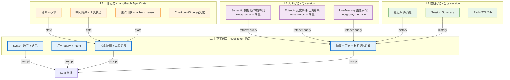
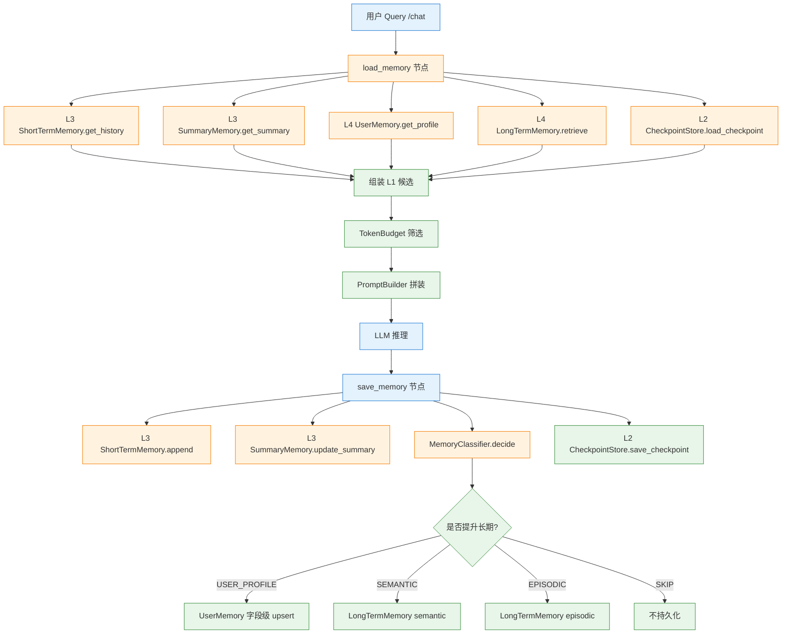
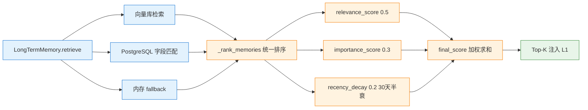

# Memory 设计

> 本主题文件存放在 `technical_deep_dive/主题/`，允许题目与其他主题重复。

## 结合项目的详细说明

项目的 Memory 设计先把"知识"和"记忆"分开。RAG 知识库面向企业文档、API、FAQ、制度等外部知识，回答的是"资料里有什么"；Memory 面向用户、会话和 Agent 执行过程，回答的是"这个用户之前明确表达过什么、当前任务推进到哪一步、哪些偏好和事实会影响后续回答"。两条链路最后都会进入上下文窗口，但来源、生命周期、权限边界和检索策略不同。

更适合面试表达的分层是四层，而不是把 Summary、Checkpoint、Semantic、Episodic 都摊平成独立层。四层是系统抽象；Summary 是短期记忆里的压缩形态，Checkpoint 是工作记忆的持久化方式，Semantic/Episodic 是长期记忆里的内部类型。

| 层级 | 名称 | 存什么 | 项目里的实现 | 作用 |
|---|---|---|---|---|
| L1 | 上下文窗口 Context Window | 模型当前能直接看到的 prompt、系统指令、用户问题、历史消息、检索片段、工具结果和记忆片段 | `ContextManager` / PromptBuilder 组装；`MemoryManager.load_memory_context` 返回 `context_window` 候选内容 | 控制"这一轮模型实际看见什么"，受 token budget 约束 |
| L2 | 工作记忆 Working Memory | 当前任务执行过程中的临时状态，例如计划、步骤、中间结果、工具调用结果、重试状态 | LangGraph `AgentState`；`CheckpointStore` 用 Redis/PG 保存可恢复状态 | 保证多节点工作流能接着执行，不等同于聊天历史 |
| L3 | 短期记忆 Short-term Memory | 当前会话内的多轮对话历史和会话摘要 | `ShortTermMemory` 保存最近消息；`SummaryMemory` 在历史超预算时生成会话摘要 | 保证同一 session 连续性，解决"刚才说的那个" |
| L4 | 长期记忆 Long-term Memory | 跨会话持久保存的用户偏好、项目背景、历史经验、外部知识和关系 | `UserMemory` + `LongTermMemory(memory_type=semantic/episodic)` + RAG 知识库/向量库/可选 Neo4j | 解决"第 50 次对话还记得第 3 次偏好"和外部知识召回 |

长期记忆内部再分两类：

| 类型 | 记什么 | 示例 | 检索/注入方式 |
|---|---|---|---|
| 情节记忆 Episodic Memory | 过去发生过什么，是带时间、会话、任务上下文的历史事件 | 用户上次问过 LangGraph；用户做过鸿蒙 RAG 项目；某次任务的执行结果；某次排障结论 | 按当前 query 触发检索，通常 Top-K 注入上下文窗口 |
| 语义记忆 Semantic Memory | 稳定知识、偏好、画像、规则和长期事实 | 用户偏好中文回答；项目技术栈是 LangGraph + Milvus + Redis；领域知识；业务规则 | 高置信内容可 Pin 到上下文窗口，或作为用户画像/规则长期可见 |

这四层的关键边界是"是否当前可见、是否任务临时态、是否只属于当前会话、是否跨会话长期有效"。上下文窗口不是存储层，它是最终给模型看的结果；工作记忆不是用户记忆，它主要服务 LangGraph 执行；短期记忆可以用 Redis 24 小时 TTL，但摘要如果要支持刷新恢复、审计和跨设备连续，就需要 PostgreSQL canonical copy；长期记忆才需要持久化、去重、权限控制、删除和检索排序。

UserMemory 默认不应该直接放 Neo4j。用户画像是字段型事实，例如 `preferred_language`、`answer_style`、`primary_stack`，最适合 PostgreSQL/JSONB 做字段级 upsert、权限控制、审计和删除。Neo4j 适合长期记忆里的关系子层，例如"用户 A 负责项目 P，项目 P 依赖服务 S，服务 S 属于团队 T"。所以可以说：用户画像放 PG，复杂关系放 Neo4j，二者都属于长期记忆。

### 怎么判断记忆类型

MemoryManager 在 `save_memory_context` 阶段先把用户消息写入短期记忆，然后调用 `MemoryClassifier` 做规则分类。分类器不会改变四层架构，它只是决定一条消息是否还要从短期记忆"提升"到长期记忆，以及提升成长期记忆里的哪种内部类型。

| 事件类型 | 属于哪一层 | 判定规则 | 当前代码落点 |
|---|---|---|---|
| 当前 prompt、检索片段、工具结果 | L1 上下文窗口 | 本轮推理需要直接可见，受 token budget 控制 | `context_window` / `ContextManager` |
| 计划、步骤、中间结果、工具调用状态 | L2 工作记忆 | 工作流执行中产生，只服务当前任务 | LangGraph `AgentState` + `CheckpointStore` |
| 当前问题、上一轮回答、最近多轮对话 | L3 短期记忆 | 默认写入当前 session | `ShortTermMemory.add_message` |
| 会话阶段性摘要 | L3 短期记忆 | 会话轮数/token 超阈值 | `SummaryMemory.update_summary` |
| 用户画像字段 | L4 长期记忆 | 显式长期偏好，score >= 3 | `MemoryTarget.USER_PROFILE`，生产可字段级 upsert |
| 语义记忆 Semantic | L4 长期记忆 | 稳定知识、偏好、画像、业务规则、长期事实，需要后续可靠可见 | `LongTermMemory.store_entry(memory_type="semantic")` |
| 情节记忆 Episodic | L4 长期记忆 | 过去发生过什么，例如历史问题、任务结果、项目经历，score >= 4 | `LongTermMemory.store_entry(memory_type="episodic")` |
| 敏感/一次性低价值信息 | 不进长期记忆 | token、password、验证码、临时信息 | `MemoryTarget.SKIP` 阻止持久化 |

当前代码里有具体规则模块：`src/enterprise_agentic_rag/memory/memory_classifier.py`。核心接口是：

```python
from enterprise_agentic_rag.memory.memory_classifier import decide_memory_target

choices = decide_memory_target(
    "以后请都用中文回答，我主要做 Python 后端和 RAG 项目。",
    session_token_count=1200,
    session_turn_count=3,
)

# 结果包含：
# SHORT_TERM: 先保留在当前会话短期记忆
# USER_PROFILE: 这是显式长期偏好/画像字段
# SEMANTIC: 偏好/技术栈/规则提升为长期语义记忆
# EPISODIC: 过去做过什么、问过什么，作为长期情节记忆检索
```

### 第 50 次对话如何记得第 3 次偏好

写入阶段，第 3 次对话结束时，如果用户明确说"以后回答都用中文"或"我主要做 Python 后端"，它首先作为当前会话消息进入 L3 短期记忆；随后 MemoryClassifier 判断这是稳定偏好，把它提升到 L4 长期记忆中的语义记忆 `semantic` 类型，同时生产环境可以更新 UserMemory 画像字段。如果用户是在一次任务中完成了"鸿蒙 RAG 项目方案设计"，这件"发生过的事"则更适合写成情节记忆 `episodic`。

检索阶段，第 50 次对话开始时，`load_memory_context(session_id, user_id, query)` 会读取长期记忆，把语义记忆中的稳定偏好和规则作为高优先级候选放入 L1 上下文窗口；如果用户明确引用历史事件，例如"你还记得我第 3 次说过的那个问题吗"，再触发 L4 长期记忆中的情节记忆 `episodic` 检索，把当时的历史片段按需换入上下文窗口。这样不是每次靠向量检索碰运气，而是让稳定偏好以语义记忆长期可用，让历史事件以情节记忆按需召回。

长期记忆检索后还要做融合排序。当前代码在 `LongTermMemory.retrieve()` 里统一调用 `_rank_memories()`，不管结果来自向量库、PostgreSQL 还是内存 fallback，都会计算：

```text
final_score = relevance_score * 0.5
            + importance_score * 0.3
            + recency_decay_score * 0.2
```

`relevance_score` 优先使用向量检索返回的相似度分数；没有向量分数时，用 query 和 memory content 的关键词重叠做轻量兜底。`importance_score` 来自写入时的规则打分归一化。`recency_decay_score` 使用 30 天时间衰减，越新的记忆分数越高，但只占 20%，避免"新但无关"的记忆压过"旧但高度相关"的偏好或项目事实。

### 中间件位置

Memory 在项目里是 LangGraph 工作流前后的中间件。请求进入后先执行 `load_memory`：按 `session_id/user_id` 读取短期记忆、摘要、用户画像和长期记忆候选，组装出 L1 上下文窗口候选和 L2 工作记忆状态。回答结束前执行 `save_memory`：写短期消息、更新摘要、分类并写长期记忆、保存 checkpoint。

```text
/chat
  -> load_memory
      -> L3 ShortTermMemory.get_history(session_id)
      -> L3 SummaryMemory.get_summary(session_id)
      -> L4 UserMemory.get_profile(user_id)
      -> L4 LongTermMemory.retrieve(user_id, query)
      -> L2 CheckpointStore.load_checkpoint(session_id)
      -> assemble L1 context_window candidates
  -> intent / retrieve / generate / verify
  -> save_memory
      -> L3 ShortTermMemory.append(user, assistant)
      -> L3 SummaryMemory.update_summary(...)
      -> MemoryClassifier.decide(user_message)
      -> L4 LongTermMemory.store_entry(memory_type=semantic|episodic)
      -> L2 CheckpointStore.save_checkpoint(...)
```

面试时可以这样收束：这个项目的 Memory 不是"把聊天记录存起来"，而是四层上下文管理系统。L1 决定模型当前看见什么，L2 保存任务执行状态，L3 保证当前会话连续，L4 保存跨会话偏好、项目背景、历史经验和外部知识；Semantic/Episodic、Summary、Checkpoint 都是四层架构里的实现细分，而不是额外独立层。

### 流程图

#### 1. 4 层记忆分层总览



#### 2. load_memory + save_memory 中间件位置



#### 3. 长期记忆融合排序



### 易误会点（10 条）

**易误会点 1：4 层记忆 ≠ Summary/Checkpoint/Semantic/Episodic**

四层是**系统抽象**；Summary 是短期记忆里的压缩形态；Checkpoint 是工作记忆的持久化方式；Semantic/Episodic 是长期记忆里的**内部类型**。面试时不能把 6 个概念都摊平成独立层。

**易误会点 2：上下文窗口不是存储层**

它只是**最终给模型看的结果**，受 TokenBudget 约束，不持久化任何数据。

**易误会点 3：工作记忆 ≠ 用户记忆**

工作记忆（AgentState + CheckpointStore）服务 LangGraph 执行，不是用户偏好。用户的偏好要落到 UserMemory 字段。

**易误会点 4：短期记忆 ≠ 全部用 Redis 24h TTL**

如果摘要要支持刷新恢复、审计和跨设备连续，**需要 PostgreSQL canonical copy**。Redis 只是快取。

**易误会点 5：UserMemory 默认放 PostgreSQL，不要直接放 Neo4j**

用户画像是字段型事实（`preferred_language`, `answer_style`, `primary_stack`），适合 PG/JSONB 做字段级 upsert + 权限控制 + 审计 + 删除。Neo4j 适合长期记忆里的**关系子层**（"用户 A 负责项目 P，项目 P 依赖服务 S"）。

**易误会点 6：融合排序有 3 个维度，不止 1 个**

```python
final_score = relevance_score * 0.5
            + importance_score * 0.3
            + recency_decay_score * 0.2
```

| 维度 | 权重 | 含义 |
|------|------|------|
| relevance_score | 0.5 | 向量相似度 / 关键词重叠 |
| importance_score | 0.3 | 写入时的规则打分 |
| recency_decay | 0.2 | 30 天半衰期 |

**易误会点 7：长期记忆 ≠ 全部提升**

不是每条消息都提升到长期。`MemoryClassifier` 规则：
- score >= 4 → episodic
- score >= 3 → semantic / user_profile
- 敏感/一次性 → SKIP（不进长期）

**易误会点 8：情节记忆不每次都检索**

只当 query **显式引用**历史事件时触发（"你还记得我第 3 次说过的..."）。平时只注入 semantic 偏好。

**易误会点 9：记忆的权限边界**

| 层 | 权限 |
|---|------|
| L1 | 全部（模型可见）|
| L2 | 单 session（checkpoint）|
| L3 | 单 user_id（Redis）|
| L4 | 单 user_id（PG），**不跨用户** |

**易误会点 10：第 50 次对话记得第 3 次偏好 = 语义记忆**

不是情节记忆（情节是"发生过什么"），是**语义记忆**（"稳定偏好"）。语义以**高置信候选**长期可见；情节**按需检索**注入。

### 常见追问 10 条

**追问 ①：长期记忆检索失败怎么办？**
- 降级为短期记忆 only
- 不让 LLM 假装"我记得"
- Prompt 注入"如不记得请直接说"

**追问 ②：跨用户共享记忆吗？**
- ❌ **不共享**（数据隔离）
- 只有**业务规则类**（如"统一用中文回答"）可配置为全局

**追问 ③：用户删除数据怎么办？**
- UserMemory 字段级 delete（GDPR/个保法）
- LongTermMemory 软删 + 30 天后硬删
- 短期记忆立即清空 Redis

**追问 ④：记忆和 RAG 怎么协同？**
- RAG 答"资料里有什么"（企业知识库）
- Memory 答"用户之前说过什么"
- 两者独立检索 → 融合 → 一起注入 L1

**追问 ⑤：摘要的触发条件？**
- session_turn_count > N
- session_token_count > 阈值
- 定时（每 30 分钟）

**追问 ⑥：摘要和原文矛盾怎么办？**
- 摘要优先级**低于**原文（原文是 ground truth）
- Verifier 检查答案是否引用了最新原文
- 不一致时触发澄清

**追问 ⑦：4 层都在 Redis 吗？**
- L2 Checkpoint 可选 Redis
- L3 短期记忆 Redis
- L4 长期记忆 PostgreSQL
- L1 内存（不持久化）

**追问 ⑧：为什么 UserMemory 字段级？**
- 字段级 upsert 不影响其他字段
- 字段级删除满足 GDPR
- 字段级审计（哪个字段何时改的）

**追问 ⑨：记忆冲突如何解决？**
- 时间新的优先（除非是"稳定偏好"）
- 用户当前明确表达优先于历史
- 显式标记冲突 → 触发澄清

**追问 ⑩：Memory 容量怎么估算？**
- 短期：每 session 1MB（1000 消息）
- 长期：每用户 10MB（5 年）
- PG: 100 万用户 ≈ 10GB
- 需定期清理 + 归档到冷存储

## 匹配到的题目（16 道）

### 1. Long Context 模型（如 Gemini 1.5 的 1M token）在实际使用中效果怎么样？ [来源:01_RAG核心链路.md | 重要性:A]

**结合项目回答评分：** 10/10（匹配置信度 92/100）

**结合项目的回答：**

结合项目回答：上下文管理由 ContextManager、TokenBudget、CitationManager 和 PromptBuilder 完成。Token 预算按优先级分配：用户问题最高，其次是检索文档、工具结果、会话摘要和历史消息；Prompt 组装时优先放高分、高置信来源，并给每个 Chunk 明确编号和边界。

**完美答案：**

我测试过 Gemini 1.5 Pro 的长上下文能力，坦白说感觉是"能用但还没到理想状态"。做 Needle-in-a-Haystack 测试（在长文档中藏一个事实然后问相关问题），在 128K 以内准确率很高，接近 100%；到了 500K 以上准确率开始下降；到了 1M 附近，如果"needle"是非常具体的事实（如一个数字或日期），模型有时找不到或者找到后没有正确运用。另外延迟是很大的实际阻碍——塞满 1M token 的 Prefill 可能需要几十秒甚至更长，对在线服务来说基本不可用。还有一个隐性问题是成本——每次请求消耗 1M token 的输入，API 费用很高。所以我的结论是：Long Context 适合离线或准离线的长文档分析任务（半天跑一次的报告分析、文档审查），但不适合做实时 RAG 的替代方案。它不是 RAG 的"接班人"，更像是 RAG 在特定场景下的"合作伙伴"——RAG 做粗筛，Long Context 做深度分析。

---

---

### 2. Query Rewrite 在多轮对话中具体怎么做？需要把全部历史都传给 LLM 吗？ [来源:01_RAG核心链路.md | 重要性:A]

**结合项目回答评分：** 10/10（匹配置信度 93/100）

**结合项目的回答：**

结合项目回答：在线检索是 Agentic Hybrid RAG。Deep Intent/检索路由判断问题类型后，调用 Milvus 向量检索、Elasticsearch BM25/IK 中文分词检索和可选 GraphRAG；结果用 RRF 融合，再进入 Rerank 和上下文构建。检索失败有降级链：Graph 失败不影响向量+关键词，Milvus 不可用可退到 ES/内存关键词兜底。

**完美答案：**

多轮对话的 Query Rewrite 核心任务是"消解依赖"——把当前问题中依赖前文的指代、省略补全，输出一个独立的、自包含的检索 query。实现上我会把历史对话传给 LLM，但不是全部传。一般只传最近 3 到 5 轮就够了，太早的历史和当前问题通常已经关系不大，而且传太多历史会增加 token 消耗和延迟。Prompt 设计上我会明确告诉 LLM 两个任务：首先判断当前问题是否需要上下文才能理解（如果本身就是独立问题，比如"什么是 RAG"，就直接返回不用改）；如果需要，把指代消解掉（"它"→具体名词，"上次那个"→从历史中找到对应的实体）。另外我还会让 LLM 同时输出一个"改写后的检索 query"，这个 query 是专门面向搜索引擎风格的——去掉口语化、补充关键词、用更规范的表达。这样用户看到的对话上下文还是自然的，但检索用的是优化后的 query。这个 Rewrite 调用我一般用很快的小模型（比如 GPT-4o-mini 或本地部署的 7B 模型），保证延迟可控。

---

---

### 3. Rewrite模型是你做的，具体输入输出是什么？你们是把 rewrite放在检索前还是后？训练数据是人工构造的吗？ [来源:01_RAG核心链路.md | 重要性:A]

**结合项目回答评分：** 10/10（匹配置信度 96/100）

**结合项目的回答：**

结合项目回答：在线检索是 Agentic Hybrid RAG。Deep Intent/检索路由判断问题类型后，调用 Milvus 向量检索、Elasticsearch BM25/IK 中文分词检索和可选 GraphRAG；结果用 RRF 融合，再进入 Rerank 和上下文构建。检索失败有降级链：Graph 失败不影响向量+关键词，Milvus 不可用可退到 ES/内存关键词兜底。

**完美答案：**

**1) Rewrite模型的输入**

输入由两部分组成：当前用户query（可能包含指代词、省略、口语化表达、专业术语简写等）+ 对话历史（最近N轮对话，通常N=3~5）。对话历史的作用是为指代消解和上下文补全提供信息。例如：
- 用户第1轮："什么是Transformer的自注意力机制？"
- 用户第2轮："它的计算复杂度是多少？" 
→ Rewrite模型需要根据第1轮的历史，将第2轮的"它"消解为"自注意力机制"，输出改写query："自注意力机制的计算复杂度是多少"

输入格式通常为：`[历史轮次] ... [当前query] 请改写为独立完整的检索查询`，或者将对话中所有轮次的query拼接后用特殊分隔符标记。

**2) Rewrite模型的输出**

输出是一个独立完整、可以直接用于检索的query字符串。改写目标包括：
- 指代消解：将"它""这个""上面那个"替换为具体实体
- 上下文补全：将省略的主语/宾语/条件补全
- 术语归一化：将口语化表达转为知识库中使用的正式术语（如"退钱"→"退款申请流程"）
- 复合问题拆分（可选）：将一个复杂多意图query拆分为多个子query
- 生成等价问法（可选）：输出多个不同表述的query增强召回覆盖率

注意：Rewrite必须保持用户原意不变。如果模型不确定如何改写，输出原始query作为兜底。

**3) Rewrite放在检索前还是检索后**

放在检索前（pre-retrieval rewrite）。这是标准做法，原因很直接：如果用户原始query有指代不明或术语不规范的问题，直接用原query检索效果会很差。Rewrite在检索前将query"修正"为检索友好的形式，显著提升召回质量。

典型的检索流程：用户原始query → Rewrite模型改写 → 得到改写query → 将原始query和改写query（可多个）并行发送到检索系统 → 各路检索结果RRF融合去重 → 进入Rerank精排。保留原始query并行检索是安全兜底——万一Rewrite改坏了（改变了用户意图），原始query的结果仍然可用。

**4) 训练数据构造**

三层来源：

第一层——人工标注。这是质量最高但成本最高的方式。从线上历史对话日志中抽取多轮对话片段，人工为最后一轮query标注"理想的独立检索query"。标注规范要明确指代消解、术语归一化、不改变原意等标准。通常需要500~1000条高质量标注数据做种子。

第二层——LLM辅助生成。用强模型（如GPT-4/DeepSeek）批量生成训练数据。给LLM多轮对话上下文，要求它输出改写后的query，相当于用大模型"蒸馏"出训练数据。一个Prompt可以同时生成多种改写风格（简洁版、详细版、术语归一化版），大幅降低标注成本。关键是随后做人工抽检保证质量。

第三层——线上反馈数据。将Rewrite模型上线后，记录哪些改写后的query带来了好的检索结果（高Rerank分数、用户点赞），哪些改写得不好（用户追问、负反馈）。将这些正负样本加入训练集持续迭代。

训练方式：如果用量不大的话用Prompt+强模型即可（零训练成本但推理延迟高），如果QPS高则用标注数据微调一个小模型（如Qwen2-1.5B）做专用Rewrite模型，推理快且成本低。

---

---

### 4. 为什么压缩前 70%？最开始的几轮对话明确需求不是很重要吗？ [来源:01_RAG核心链路.md | 重要性:S]

**结合项目回答评分：** 10/10（匹配置信度 95/100）

**结合项目的回答：**

结合项目回答：这题可以落到项目的工程化闭环：FastAPI + LangGraph + RAG + 工具 + 记忆 + 评估闭环；关键能力都有可观测和降级路径；面试时映射到 Milvus/ES 混合检索、Provider 抽象、TokenBudget、Verifier、Data Flywheel 等项目实现。

**完美答案：**

**理解这道题的核心：** 面试官在问"你压缩了70%，那多轮对话前期用户描述的需求信息不是丢了吗？"这实际上暴露了一个关键区分——压缩的70%到底是什么内容。

**压缩的是检索结果，不是对话历史：**

上下文压缩的目标是检索返回的Chunk内容，而不是用户的对话历史。这两者在RAG的Prompt组装中是两条独立的通道：

通道一——对话历史：包含用户的原始问题和之前几轮对话的完整内容。这条通道不参与压缩。它的作用是为LLM提供完整的对话背景，让模型理解"用户在问什么"。通常保留最近N轮（3~5轮）的完整对话，确保前后文连贯。对话历史的长短通过轮数N来控制，而不是通过压缩。

通道二——检索结果：从知识库中检索到的相关Chunk内容。这条通道参与压缩。因为检索到的Chunk通常很长且包含大量与当前query非直接相关的句子，不压缩直接注入会浪费大量token。

**为什么对话历史不需要像Chunk一样压缩：**

对话历史本身已经通过Query Rewrite机制间接保留。多轮对话中，Rewrite模型会把前面几轮的关键信息（实体、约束条件、上下文）融入到改写后的当前query中。比如第1轮问"帮我查一下合同A的付款条款"，第2轮问"那合同B呢"——Rewrite会把"那合同B呢"改写为"合同B的付款条款"，前一轮的"付款条款"语义已经被继承到改写后的query中，不需要把第1轮的全部历史原文再注入Prompt。

同时，保留最近几轮原始对话作为上下文背景仍然是必要的——模型需要知道用户在聊什么话题、前面已经解决了什么问题、当前处于对话的哪个阶段。但这个量通常很小（几轮对话不过几百tokens），远小于检索Chunk的量（几轮检索5个Chunk就是1500+ tokens）。

**70%的压缩率怎么来的：**

在典型场景下，Rerank后的5个Chunk平均每个有400 tokens，总计2000 tokens。经过关键句抽取（每个Chunk保留2~3个与query直接相关的句子），压缩后约600~700 tokens，节省约65%~70%。这个70%是针对Chunk的，对话历史和系统Prompt不在压缩范围内。总体Prompt的节约比例大约是30%~50%，取决于对话历史长度和Chunk数量的比例。

---

---

### 5. Agent无状态化怎么设计？会话状态如何外置到Redis？ [来源:02_Agent核心原理.md | 重要性:A]

**结合项目回答评分：** 10/10（匹配置信度 100/100）

**结合项目的回答：**

结合项目回答：项目采用 80% Workflow + 20% Agent 的混合架构。LangGraph StateGraph 定义 16 个节点和条件边，保证主流程可控；Router/Deep Intent、Knowledge Agent、Tool Agent、Verifier Agent 在关键节点做动态决策。这样既能避免纯 Agent 的不可控和死循环，又保留了根据中间结果选择检索策略、工具调用、答案校验和失败恢复的灵活性。

**完美答案：**

```python
   # 请求进来时从Redis恢复会话
   session = redis.hgetall(f"agent:session:{session_id}")
   messages = json.loads(session.get('messages', '[]'))
   context = json.loads(session.get('context', '{}'))

   # Agent执行后将状态写回Redis
   redis.hset(f"agent:session:{session_id}", mapping={
       'messages': json.dumps(messages),
       'context': json.dumps(context),
       'updated_at': datetime.now().isoformat()
   })
   redis.expire(f"agent:session:{session_id}", 1800)
   ```
   **优势任意Agent实例挂了，下一个实例从Redis恢复继续——用户无感知。关键：Redis需哨兵/集群保证高可用，否则Redis挂了全系统不可用。

---

---

### 6. Agent记忆系统怎么设计？ [来源:02_Agent核心原理.md | 重要性:A]

**结合项目回答评分：** 10/10（匹配置信度 100/100）

**结合项目的回答：**

结合项目回答：项目的记忆系统按四层设计。第一层是上下文窗口，由 ContextManager/PromptBuilder/TokenBudget 组装模型当前能看到的 prompt、历史消息、检索片段、工具结果和记忆片段；第二层是工作记忆，用 LangGraph AgentState 和 CheckpointStore 保存计划、步骤、中间结果、工具调用状态和重试状态；第三层是短期记忆，用 ShortTermMemory 保存当前会话最近消息，并用 SummaryMemory 压缩长会话；第四层是长期记忆，用 UserMemory、LongTermMemory、RAG 知识库和可选 Neo4j 保存跨会话偏好、项目背景、历史经验、外部知识和关系。长期记忆内部再分情节记忆和语义记忆：情节记忆记过去发生过什么，语义记忆记稳定知识、偏好和业务规则。

**完美答案：**

**四层记忆/上下文架构：**

| 层 | 存什么 | 项目实现 | 例子 |
|---|---|---|---|
| 上下文窗口 | 模型当前能直接看到的 prompt、历史消息、检索片段、工具结果、记忆片段 | ContextManager / PromptBuilder / TokenBudget | 本轮问题、最近消息、Top-K 文档、工具返回结果 |
| 工作记忆 | 当前任务执行过程中的临时状态：计划、步骤、中间结果、工具调用状态、重试状态 | LangGraph AgentState + CheckpointStore | retrieve 已执行、verify 第 1 次失败、下一步 regenerate |
| 短期记忆 | 当前会话内的多轮对话历史和会话摘要 | ShortTermMemory(Redis/PG) + SummaryMemory | 最近 N 轮对话、当前 session 的阶段性摘要 |
| 长期记忆 | 跨会话持久保存的用户偏好、项目背景、历史经验、外部知识和关系 | UserMemory + LongTermMemory + RAG 知识库 + 可选 Neo4j | 用户偏好中文回答、项目技术栈、上次做过鸿蒙 RAG 项目 |

长期记忆内部再分两类：情节记忆记"过去发生过什么"，例如用户上次问过 LangGraph、做过鸿蒙 RAG 项目、某次任务的结果；语义记忆记"稳定知识和偏好"，例如用户偏好中文回答、项目技术栈、领域知识、业务规则。

写入不是所有内容都长期保存：当前消息默认进入短期记忆；会话变长后用 SummaryMemory 压缩；只有稳定偏好、长期事实或有复用价值的历史事件，才通过 MemoryClassifier 提升到长期记忆。读取时先组装上下文窗口，再按 query 检索长期记忆，并用相关性、重要性、时间衰减做融合排序，避免无关历史污染 Prompt。

---

---

### 7. LangGraph 的状态图概念具体怎么用？ [来源:02_Agent核心原理.md | 重要性:A]

**结合项目回答评分：** 10/10（匹配置信度 93/100）

**结合项目的回答：**

结合项目回答：项目采用 80% Workflow + 20% Agent 的混合架构。LangGraph StateGraph 定义 16 个节点和条件边，保证主流程可控；Router/Deep Intent、Knowledge Agent、Tool Agent、Verifier Agent 在关键节点做动态决策。这样既能避免纯 Agent 的不可控和死循环，又保留了根据中间结果选择检索策略、工具调用、答案校验和失败恢复的灵活性。

**完美答案：**

用 LangGraph 的核心工作是定义 State（状态图的状态对象）、Nodes（节点函数）和 Edges（连接节点的边）。State 是一个 TypedDict 或 Pydantic 模型，定义了整个流程中会用到和传递的数据。比如一个问答 Agent 的 State 包含 messages（对话历史）、documents（检索到的文档）、final_answer（最终回答）等字段。Nodes 就是普通的 Python 函数，接收 State 作为输入，返回更新 State 的字典。比如 retrieve_node 负责根据用户问题检索文档，把结果放进 documents 字段；answer_node 负责基于文档生成最终回答，写入 final_answer。Edges 有三种类型：普通边（固定流转，A 之后一定到 B）、条件边（根据节点输出决定去哪里，比如调用 add_conditional_edges，传入一个根据 State 内容返回下一个节点名的函数）、以及工具边（ToolNode 自动处理工具的调用和结果注入）。你把节点和边组合成一个 StateGraph，然后用 compile() 编译成可执行的 app，每次调用 app.invoke(initial_state) 就会按图执行。开发体验上，我觉得最重要的是先画好状态流转的草图再写代码——状态图的核心设计应该在白板上完成而不是在代码中摸索。

---

---

### 8. LangGraph、CrewAI、AutoGen 等 Agent 框架对比 [来源:02_Agent核心原理.md | 重要性:A]

**结合项目回答评分：** 10/10（匹配置信度 100/100）

**结合项目的回答：**

结合项目回答：项目采用 80% Workflow + 20% Agent 的混合架构。LangGraph StateGraph 定义 16 个节点和条件边，保证主流程可控；Router/Deep Intent、Knowledge Agent、Tool Agent、Verifier Agent 在关键节点做动态决策。这样既能避免纯 Agent 的不可控和死循环，又保留了根据中间结果选择检索策略、工具调用、答案校验和失败恢复的灵活性。

**完美答案：**

LangGraph 是 LangChain 生态下的状态图框架，通过定义节点和边来构建 Agent 工作流，支持条件分支、循环、持久化状态，适合需要精细控制 Agent 流程的场景。CrewAI 主打多智能体协作，通过定义 Agent 角色和任务来组织多 Agent 团队，API 简单易上手。AutoGen（微软）专注于多 Agent 对话，Agent 之间通过消息传递协作，适合研究和原型探索。选择标准主要看：需不需要精细的流程控制（LangGraph）、重点是不是多 Agent 协作（CrewAI）、还是做研究原型（AutoGen）。

---

---

### 9. 你的项目中利用LangGraph来编排多工具调用链路。与纯Prompt工程方法相比，这种框架带来了哪些核心优势？ [来源:02_Agent核心原理.md | 重要性:A]

**结合项目回答评分：** 10/10（匹配置信度 100/100）

**结合项目的回答：**

结合项目回答：项目采用 80% Workflow + 20% Agent 的混合架构。LangGraph StateGraph 定义 16 个节点和条件边，保证主流程可控；Router/Deep Intent、Knowledge Agent、Tool Agent、Verifier Agent 在关键节点做动态决策。这样既能避免纯 Agent 的不可控和死循环，又保留了根据中间结果选择检索策略、工具调用、答案校验和失败恢复的灵活性。

**完美答案：**

**核心结论：** LangGraph 等编排框架的核心优势不是"更智能"，而是"更可控"。纯 Prompt 方法只能通过自然语言建议 LLM 的行为——"请先检索再回答"、"如果检索结果不足请重新搜索"——但 LLM 可能忽略这些建议。框架通过状态图将 Agent 的执行路径硬约束为开发者预定义的拓扑结构，LLM 只能在这个结构内做决策。

**具体对比：**

| 维度 | 纯 Prompt 工程 | LangGraph 等编排框架 |
|------|---------------|---------------------|
| 流程控制 | 软约束（建议式），LLM 可忽略 | 硬约束（图结构），LLM 在节点内决策 |
| 分支逻辑 | 依赖 LLM 理解 Prompt 中的条件 | 用条件边在代码层面实现，确定性强 |
| 步骤跳过 | LLM 可能"偷懒"跳过必要步骤 | 节点必须执行才能沿边前进 |
| 循环控制 | 靠 Prompt 约束，易无限循环 | 最大步数和重复检测在框架层实现 |
| 状态管理 | 依赖上下文窗口内文本传递 | 显式 State 对象，跨节点持久化 |
| 可调试性 | 只能看最终输出和中间文本 | 每个节点的输入输出可独立检查 |
| Human-in-the-Loop | 只能在 Prompt 中"请求确认" | 框架层支持在任意节点暂停等待 |

**三个核心优势详解：**

1. **确定性保障。** 比如一个 RAG 场景中，"检索→判断→回答或重检索"这个循环，纯 Prompt 可能让 LLM 跳过"判断"直接回答。LangGraph 的状态图保证了"判断"节点必须执行，且根据判断结果决定走"回答"边还是"重检索"边。

2. **错误隔离。** 框架能区分"LLM 推理失败"和"工具执行失败"——前者可以在框架层重试或降级，后者可以在工具执行节点做异常处理。纯 Prompt 很难做这种细粒度的错误分类处理。

3. **生产可观测性。** 状态图的每个节点天然是 tracing 的锚点——可以看到请求在每个节点花了多少时间、LLM 的决策是什么、状态如何变化。这在排查线上问题时比在纯 Prompt 的文本流中找线索高效得多。

**但也必须说明局限：** 如果你的场景简单（1-2 个工具调用、不需要复杂分支），直接用 Prompt + 原生 SDK 写循环更轻量。框架的价值在复杂度超过一定阈值后才体现——"用不用框架"和"用哪个框架"是两个独立的问题。

---

---

### 10. 你说你们构建了车载Agent平台Agent链路是怎么调度的多轮对话怎么做状态维护？ [来源:02_Agent核心原理.md | 重要性:S]

**结合项目回答评分：** 10/10（匹配置信度 100/100）

**结合项目的回答：**

结合项目回答：项目采用 80% Workflow + 20% Agent 的混合架构。LangGraph StateGraph 定义 16 个节点和条件边，保证主流程可控；Router/Deep Intent、Knowledge Agent、Tool Agent、Verifier Agent 在关键节点做动态决策。这样既能避免纯 Agent 的不可控和死循环，又保留了根据中间结果选择检索策略、工具调用、答案校验和失败恢复的灵活性。

**完美答案：**

车载 Agent 的链路调度重点是"分级 + 优先级 + 安全"。简单高频意图直接路由到技能处理器，不需要复杂 Agent 推理。需要多步操作的才进入 ReAct 循环。优先级上安全级任务可以抢占一切，交互级和资讯级按队列处理。

多轮对话状态维护不用 LLM 隐形记忆，而是维护一个结构化的 DialogueState 对象——意图、已确认槽位、待填槽位、澄清次数、上下文摘要都在这个对象里。每轮对话后更新状态，待填槽位为空就执行，否则继续追问。上下文管理是按"最近保留+历史压缩"的方式，控制在有限 token 内。

---

---

### 11. 在记忆系统中，意图识别 承担什么职责？ [来源:02_Agent核心原理.md | 重要性:A]

**结合项目回答评分：** 7/10（匹配置信度 66/100）

**结合项目的回答：**

结合项目回答：记忆系统按四层设计：上下文窗口负责本轮模型可见的 prompt、历史消息、工具结果和记忆片段；工作记忆用 LangGraph State/Checkpoint 保存计划、步骤、中间结果和重试状态；短期记忆用 Redis/PG 保存当前会话历史，并用 SummaryMemory 压缩长会话；长期记忆用 UserMemory、LongTermMemory、RAG 知识库和可选图数据库保存跨会话偏好、项目背景、历史经验和外部知识。其中长期记忆再分情节记忆和语义记忆：情节记忆记过去发生过什么，语义记忆记稳定知识、偏好和业务规则。

**完美答案：**

建议讲四层：上下文窗口保存模型当前能直接看到的 prompt、历史消息和工具结果；工作记忆保存当前任务的计划、步骤、中间结果和工具状态，通常体现为 LangGraph State；短期记忆保存当前会话历史和会话摘要；长期记忆保存跨会话偏好、项目背景、历史经验和外部知识。长期记忆内部再分情节记忆和语义记忆：情节记忆记过去发生过什么，语义记忆记稳定知识、偏好和业务规则。写入要有触发条件，读取要做相关性、重要性和时间衰减过滤。面试时补一句：不是记得越多越好，记忆注入会增加 token 成本和污染风险。

---

---

### 12. 多Agent协同如何保证异步任务执行稳定性？ [来源:02_Agent核心原理.md | 重要性:S]

**结合项目回答评分：** 7/10（匹配置信度 68/100）

**结合项目的回答：**

结合项目回答：项目采用 80% Workflow + 20% Agent 的混合架构。LangGraph StateGraph 定义 16 个节点和条件边，保证主流程可控；Router/Deep Intent、Knowledge Agent、Tool Agent、Verifier Agent 在关键节点做动态决策。这样既能避免纯 Agent 的不可控和死循环，又保留了根据中间结果选择检索策略、工具调用、答案校验和失败恢复的灵活性。

**完美答案：**

四件套：①幂等性设计（相同任务重复执行结果一致）②超时+重试机制（3次+指数退避）③任务状态持久化（Redis/DB记录pending→running→done/failed）④死信队列（失败任务进入DLQ，人工排查后重新消费）。

---

---

### 13. 跨境汇款场景下Agent超时/失败如何应对并保证资金安全？ [来源:02_Agent核心原理.md | 重要性:S]

**结合项目回答评分：** 7/10（匹配置信度 66/100）

**结合项目的回答：**

结合项目回答：项目采用 80% Workflow + 20% Agent 的混合架构。LangGraph StateGraph 定义 16 个节点和条件边，保证主流程可控；Router/Deep Intent、Knowledge Agent、Tool Agent、Verifier Agent 在关键节点做动态决策。这样既能避免纯 Agent 的不可控和死循环，又保留了根据中间结果选择检索策略、工具调用、答案校验和失败恢复的灵活性。

**完美答案：**

**四层安全保障①**幂等性Token每次请求带唯一idempotency_key，重复请求不重复扣款 ②**两阶段提交先预授权→确认收款方信息正确→再正式扣款 ③**超时自动回滚任一环节超时→触发SAGA补偿事务→撤销已完成步骤 ④**人工兜底异常状态转人工审核，确保每一笔资金操作有据可查。

---

---

### 14. 长期记忆和短期记忆是什么？怎么设置 [来源:02_Agent核心原理.md | 重要性:A]

**结合项目回答评分：** 7/10（匹配置信度 70/100）

**结合项目的回答：**

结合项目回答：记忆系统按四层设计：上下文窗口负责本轮模型可见的 prompt、历史消息、工具结果和记忆片段；工作记忆用 LangGraph State/Checkpoint 保存计划、步骤、中间结果和重试状态；短期记忆用 Redis/PG 保存当前会话历史，并用 SummaryMemory 压缩长会话；长期记忆用 UserMemory、LongTermMemory、RAG 知识库和可选图数据库保存跨会话偏好、项目背景、历史经验和外部知识。其中长期记忆再分情节记忆和语义记忆：情节记忆记过去发生过什么，语义记忆记稳定知识、偏好和业务规则。

**完美答案：**

建议讲四层：上下文窗口保存模型当前能直接看到的 prompt、历史消息和工具结果；工作记忆保存当前任务的计划、步骤、中间结果和工具状态，通常体现为 LangGraph State；短期记忆保存当前会话历史和会话摘要；长期记忆保存跨会话偏好、项目背景、历史经验和外部知识。长期记忆内部再分情节记忆和语义记忆：情节记忆记过去发生过什么，语义记忆记稳定知识、偏好和业务规则。写入要有触发条件，读取要做相关性、重要性和时间衰减过滤。面试时补一句：不是记得越多越好，记忆注入会增加 token 成本和污染风险。

---

---

### 15. 长期记忆的检索和 RAG 的检索有什么区别？ [来源:02_Agent核心原理.md | 重要性:A]

**结合项目回答评分：** 10/10（匹配置信度 100/100）

**结合项目的回答：**

结合项目回答：在线检索是 Agentic Hybrid RAG。Deep Intent/检索路由判断问题类型后，调用 Milvus 向量检索、Elasticsearch BM25/IK 中文分词检索和可选 GraphRAG；结果用 RRF 融合，再进入 Rerank 和上下文构建。检索失败有降级链：Graph 失败不影响向量+关键词，Milvus 不可用可退到 ES/内存关键词兜底。

**完美答案：**

表面都是"语义检索→注入上下文"，但有几个关键差别。第一是检索对象不同——RAG 检索的是相对静态的知识文档（产品手册、公司政策、技术文档），内容通常稳定、结构化程度低；长期记忆检索的是用户和 Agent 的动态交互历史（偏好、决策、经验），内容随对话不断增长、通常高度个人化。第二是时效性权重不同——RAG 中一篇文档三年前写的和昨天写的，很多时候对查询来说效用差不多；但长期记忆中，用户三个月前的偏好今天可能已经变了，时效性衰减非常重要。第三是相关性判断不同——RAG 主要靠语义相似度，query 和文档内容越近越相关；长期记忆还要考虑"用户身份"（这个记忆是不是当前用户的）和"上下文适配"（这个记忆在当前任务场景中是否相关，而不仅仅是语义相似）。第四是更新机制——RAG 文档通常是一次写入很少修改，长期记忆需要持续更新、覆盖、甚至遗忘。总体来说，长期记忆的检索更接近"个性化推荐"而不仅是"语义搜索"。

---

---

### 16. 会话状态和上下文应该怎么管理？多轮对话的 Context 怎么维护？ [来源:03_大模型应用工程化.md | 重要性:A]

**结合项目回答评分：** 10/10（匹配置信度 100/100）

**结合项目的回答：**

结合项目回答：上下文管理由 ContextManager、TokenBudget、CitationManager 和 PromptBuilder 完成。Token 预算按优先级分配：用户问题最高，其次是检索文档、工具结果、会话摘要和历史消息；Prompt 组装时优先放高分、高置信来源，并给每个 Chunk 明确编号和边界。

**完美答案：**

会话状态的**核心挑战是把"有限的 context window"用好**。多轮对话的 context 管理通常包括：存储完整对话历史（Redis/数据库）、每次请求时截取最近 N 轮或按 token 上限裁剪、维护 system prompt + 关键信息的 "固定区" + 动态历史的 "滑动区"。高级方案还会做摘要压缩、重要信息提取和 RAG 检索。

---

---

[返回主题索引](README.md) | [返回总目录](../../TECHNICAL_DEEP_DIVE.md)
