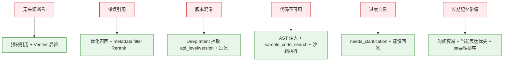
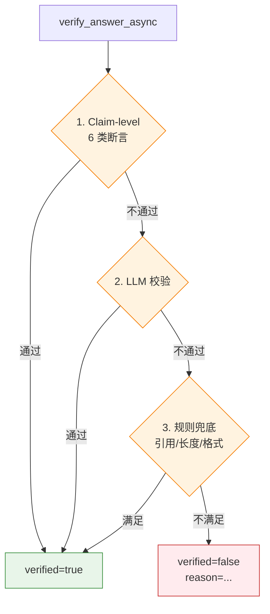

# 幻觉治理

> 本主题文件存放在 `technical_deep_dive/主题/`，允许题目与其他主题重复。

## 结合项目的详细说明

项目把幻觉治理拆成生成前、生成中、生成后三个阶段，而不是指望模型"自觉不编"。幻觉的根因通常不是单一 Prompt 问题，而是检索证据不足、上下文噪声过多、模型过度补全、工具结果未验证、引用缺失或评估闭环不足。因此治理也必须覆盖 RAG、Context、Prompt、Verifier 和 Data Flywheel。

生成前的重点是提高上下文质量。项目通过 BGE-M3 向量检索、Elasticsearch BM25/IK 关键词检索、可选 GraphRAG、RRF 融合和 Rerank 精排，提高正确证据进入上下文窗口的概率。ContextManager 再用 TokenBudget 控制证据密度，避免无关 Chunk 挤占空间。没有正确上下文时，再强 Prompt 也只能降低幻觉概率，不能从根上解决。

生成中的重点是约束模型行为。Prompt 明确要求"基于给定证据回答""不能确认就说明不确定""必须带引用""不要把多个来源混成一个结论"。不同意图使用不同回答结构：error_diagnosis 要列出排查步骤和证据，migration 要给 before/after，code_generation 要说明代码适用条件。结构化输出能减少模型随意发挥空间。

生成后的重点是验证。Verifier Agent 检查答案是否引用了证据、是否存在无来源断言、是否与工具结果冲突、格式是否满足要求、是否需要人工兜底。对于低置信答案，系统可以 regenerate、降级为谨慎回答、要求澄清，或进入 human_fallback。Verifier 不是为了让模型"再想一遍"，而是把事实一致性和引用完整性变成可检查的工程步骤。

幻觉治理也离不开意图识别。不同意图的风险不同：概念问答主要担心解释编造；API 用法担心参数/版本错误；迁移问题担心旧 API 和新 API 混用；错误诊断担心没有日志就给确定结论；代码生成担心生成不可运行代码。Deep Intent 的 risk_level、difficulty、required_context、missing_context 会影响回答风格和是否需要澄清。

工具结果和 RAG 证据要有边界。工具调用结果是动态事实，RAG 文档是相对静态知识，长期记忆是个性化历史。它们都可能进入上下文窗口，但可信度和时效性不同。比如用户长期偏好中文回答属于语义记忆，可以稳定注入；用户上次遇到某个错误属于情节记忆，只能作为参考，不能替代当前日志。

评估闭环是长期治理。项目用离线 eval dataset 评估 faithfulness、answer relevancy、context recall 和 intent accuracy；线上收集失败样本、用户反馈、trace 和 verifier failure，进入 Data Flywheel。失败样本会被归因：检索漏召回、rerank 排错、Prompt 约束不足、模型编造、工具失败、意图误判。不同归因对应不同修复策略。

面试时可以说：幻觉治理不是单点 Prompt，而是"高质量证据进入上下文 + 生成规则约束 + 答案后验验证 + 失败样本闭环"。RAG 降低幻觉的前提是检索质量和上下文工程到位，否则 RAG 也可能把错误证据注入模型，形成更自信的幻觉。


### 具体设计和追问点

幻觉治理可以按错误类型定位：如果答案没有引用，优先查 Prompt 和 Verifier；如果引用了错误文档，查检索和 rerank；如果引用正确但结论错，查生成 Prompt 和模型能力；如果工具结果被误读，查工具摘要和上下文边界；如果用户历史带偏，查长期记忆注入策略。这样能把"模型胡说"拆成可修复的工程问题。

| 失败类型 | 常见原因 | 修复方向 |
|---|---|---|
| 无来源断言 | Prompt 约束弱、Verifier 缺失 | 强制引用、后验校验 |
| 错误引用 | 检索噪声、rerank 排错 | 优化召回、metadata filter、rerank |
| 版本混淆 | 缺少版本实体/过滤 | Deep Intent 抽取 api_level/version |
| 代码不可用 | 示例缺上下文、模型补全 | sample_code_search、代码校验 |
| 过度自信 | 没有 missing_context 机制 | needs_clarification / 谨慎回答 |

项目对"无法回答"的处理也很重要。没有证据时不应该编造，而是说明目前检索不到可靠来源，并给出可继续定位的信息；错误诊断缺日志时先给通用排查路径，同时列出需要的日志、版本、复现步骤。这样用户体验比简单拒答更好，也比硬编更安全。

长期记忆也可能制造幻觉。情节记忆是历史事件，不代表当前仍然成立；语义记忆是稳定偏好和规则，但也可能过期。项目通过时间衰减、重要性评分和当前用户表达优先级控制记忆注入，避免"上次的事实"污染"这次的问题"。


### 流程图

#### 1. 3 阶段幻觉治理（生成前/中/后）

```mermaid
graph TB
    Q[用户 Query] --> S1[生成前<br/>提高证据质量]
    S1 --> S1A[BGE-M3 向量 + ES 关键词 + GraphRAG]
    S1 --> S1B[RRF k=60 融合]
    S1 --> S1C[Cross-Encoder Rerank]
    S1 --> S1D[ContextManager TokenBudget]
    S1D --> S2[生成中<br/>约束模型行为]

    S2 --> S2A[Prompt: 基于证据回答]
    S2 --> S2B[Prompt: 不确定时说不知道]
    S2 --> S2C[Prompt: 必须带引用 [1][2]]
    S2 --> S2D[结构化输出: 解释/诊断/迁移/代码]

    S2D --> S3[生成后<br/>Verifier 校验]
    S3 --> S3A[Claim-level 6 类断言校验]
    S3 --> S3B[ConflictDetector 检查]
    S3 --> S3C[规则: 引用/长度/格式]

    S3A & S3B & S3C --> S4{通过?}
    S4 -->|是| F[finalize_answer]
    S4 -->|否 + 可恢复| R[重建上下文重生成]
    S4 -->|否 + 耗尽| H[human_fallback]

    classDef pre fill:#E3F2FD,stroke:#1976D2
    classDef mid fill:#FFF3E0,stroke:#F57C00
    classDef post fill:#E8F5E9,stroke:#388E3C
    classDef fb fill:#FFEBEE,stroke:#C62828
    class S1A,S1B,S1C,S1D pre
    class S2A,S2B,S2C,S2D mid
    class S3A,S3B,S3C post
    class F,R,H fb
```

#### 2. 6 类失败类型 → 修复策略



#### 3. Verifier 3 级校验（Claim → LLM → 规则）



### 易误会点（10 条）

**易误会点 1：幻觉治理 ≠ 加一句"请不要编造"**

靠**生成前/中/后 3 阶段**协同，不是一句话。

**易误会点 2：RAG 降低幻觉的前提是检索质量**

如果 RAG 把**错误证据**注入上下文 → 模型更自信地编。**错的 RAG 比没有 RAG 更糟**。

**易误会点 3：引用 [1][2] 是给人看的**

是给**模型 + Verifier + 用户**三方看的。LLM 看到后自己决定是否引用，Verifier 校验是否引用。

**易误会点 4：过度自信 ≠ 有把握**

| 现象 | 实际 | 处理 |
|------|------|------|
| LLM 自信地编 | 没 evidence | 强制引用 + 校验 |
| LLM 不自信 | 真没把握 | needs_clarification |
| LLM 中等自信 | 证据不足 | 谨慎回答 + missing_context |

**易误会点 5：长期记忆是幻觉源之一**

情节记忆（过去事件）**不代表当前成立**。语义记忆（稳定偏好）也**可能过期**。需时间衰减 + 当前表达优先。

**易误会点 6：Verifier 不是"再想一遍"**

是把**事实一致性和引用完整性**变成可检查的工程步骤（Claim-level + LLM + 规则 三级）。

**易误会点 7：评估闭环是长期治理**

`Eval Gate` + `Data Flywheel` + `OnlineFeedback` 三者结合，不是"评估完就完事"。

**易误会点 8：归因比修复更重要**

如果不知道是检索错 / rerank 错 / Prompt 错 / 模型错 / 工具错，**修哪里都是猜**。项目有 `auto-failure-deposit` 自动归因。

**易误会点 9：缺日志 = 不可诊断**

错误诊断场景**没日志就给确定结论** = 强行编。项目要"先给通用排查路径 + 列出需要的日志"。

**易误会点 10：版本混淆是高频问题**

API 12 vs API 9、Stage vs FA 模型，新旧 API 混用是高发幻觉源。Deep Intent 抽 `api_level`/`version` 字段。

### 常见追问 10 条

**追问 ①：怎么定位幻觉是哪个环节出问题？**
- 无来源断言 → Prompt + Verifier
- 错误引用 → 检索 + Rerank
- 引用对但结论错 → 生成 Prompt + 模型
- 工具结果误读 → 工具摘要
- 历史带偏 → 长期记忆

**追问 ②：Faithfulness 和 Answer Relevancy 怎么测？**
- Faithfulness：答案断言是否都被证据支持
- Answer Relevancy：答案是否答到 query
- RAGAS 框架 + Eval Gate

**追问 ③：Claim-level 校验的 6 类断言是什么？**
- factual：事实型
- code：代码型
- api：API 用法型
- version：版本型
- comparison：对比型
- 其他

**追问 ④：幻觉率怎么降到 < 15%？**
- RAG 召回率 > 90%
- Eval Gate 22 条全过
- Claim-level 全过
- 生产监控 hallucination_rate_max = 0.15

**追问 ⑤：生成前证据质量不足怎么办？**
- rewrite_query 改写
- HyDE 假设文档嵌入
- 扩大 Top-K
- 补同义词

**追问 ⑥：生成的代码不可用怎么办？**
- 沙箱执行验证
- 执行失败 → 重新生成
- 失败 2 次 → 带风险提示结束

**追问 ⑦：模型拒绝回答怎么办？**
- 太严的 Prompt → 放宽
- 缺证据 → 触发检索
- 触发 human_fallback

**追问 ⑧：如何平衡"基于证据"和"用户想要常识补充"？**
- 默认基于证据
- 标记"以下为常识补充，非文档内容"
- 不混入证据段

**追问 ⑨：失败 case 怎么沉淀？**
- `auto-failure-deposit` 自动写入候选池
- 每周抽样人工标注
- 进入下一轮评估集

**追问 ⑩：幻觉治理效果怎么量化？**
- 评估集 faithfulness 分数
- 线上 hallucination_rate 监控
- 用户 thumbs down 率
human_fallback
  ↓
失败样本进入 Data Flywheel
```

## 匹配到的题目（21 道）

### 1. Agent 评估体系包含哪些核心维度？如何量化衡量Planning能力与Hallucination Rate )？ [来源:01_RAG核心链路.md | 重要性:S]

**结合项目回答评分：** 10/10（匹配置信度 100/100）

**结合项目的回答：**

结合项目回答：项目采用 80% Workflow + 20% Agent 的混合架构。LangGraph StateGraph 定义 16 个节点和条件边，保证主流程可控；Router/Deep Intent、Knowledge Agent、Tool Agent、Verifier Agent 在关键节点做动态决策。这样既能避免纯 Agent 的不可控和死循环，又保留了根据中间结果选择检索策略、工具调用、答案校验和失败恢复的灵活性。

**完美答案：**

Agent评估比单纯的RAG评估复杂得多，因为Agent涉及多步推理、工具调用、动态决策，失败可能在任何中间环节发生。

**核心评估维度：**

维度一：任务完成率（Task Success Rate）。最顶层的指标——Agent最终是否达成了用户的目标。对于有确定答案的任务（如"查一下合同A的签署日期"），对比实际输出与标准答案是否一致。对于开放式任务（如"帮我写一份项目总结"），用人机评估判断是否满足需求。任务完成率是所有评估的基础——Plan再好、工具用得再对，最终没完成任务就是失败。

维度二：Planning能力。评估Agent分解任务、规划执行步骤的能力：
- 步骤合理性：分解的子任务是否覆盖了原始任务的所有必要方面，是否存在多余或遗漏的步骤
- 工具选择正确性：每一步选择的工具是否是最合适的（如该用搜索的时候有没有用搜索、该用计算器的时候有没有用计算器）
- 执行顺序最优性：子任务的执行顺序是否高效（如先做过滤再搜索vs先搜索再过滤）
- 错误恢复能力：中途出错后是否能识别问题并调整策略，而不是重复无效操作或直接放弃

维度三：Tool Use准确性。Agent调用工具的质量：
- 调用格式正确率：输出是否符合工具要求的JSON Schema/函数签名
- 参数准确率：工具参数值是否合理（如检索query是否有意义、文件路径是否正确）
- 结果利用能力：获取工具返回后是否正确理解并利用结果推进任务

维度四：安全性。包括幻觉率、有害输出检测、权限越界检测等。

**Planning能力的量化衡量：**

- 步骤效率比 = 最优步骤数 / 实际执行步骤数。最优步骤数由人工标注（或专家Agent标注）确定，比值越接近1说明Planning越高效
- 工具调用成功率 = 成功执行的工具调用次数 / 总工具调用次数
- 任务拆解覆盖率 = 覆盖的必需要素 / 所有必需要素（需人工标注每个任务的必需要素列表）
- Replan触发准确率 = Agent在遇到错误时正确触发重新规划的次数 / 应该触发重新规划的次数

**Hallucination Rate的量化衡量：**

与RAG场景类似但更复杂——Agent的幻觉可能出现在中间推理步骤、工具调用的参数、以及最终回答中。衡量方法：
- 声明拆解：将Agent的最终输出和关键中间步骤拆解为独立的factual claims
- 证据溯源：对每个claim，在Agent的上下文（检索结果、工具返回、前置推理）中查找支撑证据
- 幻觉判定：找不到证据支撑的claim标记为幻觉
- Hallucination Rate = 幻觉声明数 / 总声明数

Agent幻觉的难点在于：有时Agent的推理链中某一步是"合理推断"，严格说是幻觉但逻辑上是合理的。需要定义评判标准（严格匹配 vs 合理推断），不同场景容忍度不同。

**评估的实施方式：**

离线Benchmark评估：构建覆盖不同任务类型（信息查询、推理分析、多步操作）的测试集，每个案例标注标准答案、预期步骤、关键中间状态。自动化运行Agent后在Benchmark上统计各维度指标。

在线监控：采样线上流量，异步评估任务完成率、工具调用成功率、用户行为信号（任务中断率、追问率、满意度评分）。

Human-in-the-loop抽检：每周人工抽检20~50条Agent执行全过程（含中间步骤），做详细质量审计。

---

---

### 2. 为什么用了 RAG 之后模型仍然可能产生幻觉？怎么缓解？ [来源:01_RAG核心链路.md | 重要性:S]

**结合项目回答评分：** 10/10（匹配置信度 100/100）

**结合项目的回答：**

结合项目回答：幻觉治理靠检索约束、引用、校验和评估闭环。PromptBuilder 要求基于上下文回答，CitationManager 生成来源引用；Verifier Agent 检查答案是否有依据、引用是否存在，不通过就 regenerate 或 fallback；线上 bad case 进入 Data Flywheel，反向优化切分、检索、Prompt 和知识库覆盖。

**完美答案：**

RAG 降低了幻觉概率但没有消除。原因有几个：检索没有召回正确文档（检索失败），检索到了正确文档但模型没有正确使用（生成端问题），或者检索到的文档本身就有错误或过时。缓解手段包括提升检索质量（提高 Recall）、优化 Prompt 设计（引导模型忠于上下文）、加 Rerank 提升精排质量、在 Prompt 中明确要求模型说"不知道"、以及对输出做事后验证。

---

---

### 3. 什么场景必须从RAG升级到GraphRAG？决策标准是什么？ [来源:01_RAG核心链路.md | 重要性:A]

**结合项目回答评分：** 10/10（匹配置信度 100/100）

**结合项目的回答：**

结合项目回答：GraphRAG 是混合检索的一路增强信号。传统 RAG 负责快速找语义相关 Chunk，GraphRAG 负责实体关系、多跳依赖和全局结构理解；Neo4j 或图检索失败是非致命的，RetrievalRouter 会降级到 hybrid_only 或 keyword_vector_only。

**完美答案：**

从传统RAG升级到GraphRAG不是技术升级，而是业务需求驱动的架构演进。关键是要有一个清晰的决策框架，而不是"觉得GraphRAG很酷就上"。

**决策标准一：多跳推理的需求量**

核心问题是——你的系统中有多大比例的用户query需要跨越多个文档/实体进行推理才能回答？传统RAG是"一跳"检索（一次向量检索返回Top-K Chunk），对于"A公司和B公司的合作关系"、"这个药物通过什么通路作用于那个靶点"、"这份合同引用了哪些法规、法规的最新版本是什么"这类需要串联多个实体的问题力不从心。

量化标准：分析线上用户query，标注出需要多跳推理的比例。如果多跳query占比<10%，成本收益不支持GraphRAG；如果占比10%~20%，可以先尝试多跳检索（Agent迭代检索）补丁方案；如果占比>20%且是核心业务场景（如金融分析、法律检索、医药研究），GraphRAG的图遍历能力才有投入价值。

**决策标准二：全局理解的需求**

传统RAG只能看到检索到的几个Chunk，视角是局部的。GraphRAG通过Community检测和摘要，能提供"整个知识库的主题分布"、"某领域的全貌总结"等宏观视角。如果你的用户经常问"公司所有产品线的共同技术路线是什么"、"这个行业链的整体格局如何"，全局理解是刚需；如果用户主要问"产品A的价格是多少"、"怎么配置VPN"，局部Chunk足够。

**决策标准三：实体关系是否为知识核心组织形式**

有些领域的知识天然是图状的——法律（法条之间的引用和继承关系）、医药（药物-靶点-通路-疾病的关系网络）、金融（公司-供应链-投资-竞争的关联网络）、学术（论文之间的引用关系链）。在这些领域，用向量检索去匹配实体间的间接关系，效果远不如在图谱上直接做图遍历+路径推理。如果实体关系信息在你的知识库中密度很低（如FAQ类知识库），GraphRAG的ROI很低。

**渐进式升级路径：**

不是0到1的跳跃，而是渐进式演进：
1. 先上传统RAG（向量+BM25+Rerank），快速产出价值
2. 收集线上bad case，重点分析哪些case是因为"单次检索无法覆盖跨文档关联"导致的失败
3. 评估这类case的占比和业务影响
4. 如果占比>20%且影响核心业务指标，启动GraphRAG PoC——选取一个子领域的文档先建图验证效果
5. PoC验证有效后逐步扩大覆盖范围

这种方式避免了"花三个月建全量知识图谱，上线发现80%的query根本用不到"的尴尬。

---

---

### 4. 什么场景需要GraphRAG？ [来源:01_RAG核心链路.md | 重要性:A]

**结合项目回答评分：** 10/10（匹配置信度 100/100）

**结合项目的回答：**

结合项目回答：GraphRAG 是混合检索的一路增强信号。传统 RAG 负责快速找语义相关 Chunk，GraphRAG 负责实体关系、多跳依赖和全局结构理解；Neo4j 或图检索失败是非致命的，RetrievalRouter 会降级到 hybrid_only 或 keyword_vector_only。

**完美答案：**

GraphRAG不是替代传统RAG的通用方案，而是针对特定场景的增强方案。判断一个场景是否需要GraphRAG，核心看三个信号：

**信号一：知识的结构是图谱状的**

如果知识库中的核心信息以实体和关系的形式组织，单纯的文本Chunk检索天然会丢失关系信息。典型场景：法律领域的法规引用链（法规A引用法规B、B引用C，形成关系链，查询"某条款的完整法律依据链"需要图遍历）；医药领域（药物-靶点-通路-疾病-副作用之间的多重关系，查询"某药物的作用机制和潜在风险"需要遍历关系网络）。

**信号二：用户的query是"关系型"而非"事实型"的**

如果大多数query是"XX是什么"、"XX怎么配置"，传统RAG足够。但如果出现了大量"XX和YY之间有什么关系"、"谁影响了谁"、"哪些因素共同导致了XX"这类关系型查询，GraphRAG的图遍历能力就变得必要。

**信号三：需要全局视角而非局部片段**

传统RAG给的是"与query最相关的几个Chunk"，是一个局部答案。但有些问题需要一个宏观的回答——"公司过去三年的整体发展脉络是什么"、"这个领域的研究热点演进趋势如何"。这类问题需要的不是最相关的几个片段，而是对大量文档的全局性总结和归纳。GraphRAG通过Community Detection（社区检测）将相关实体聚类，为每个社区生成摘要，提供了这种"俯瞰"能力。

**具体领域适用性：**

企业知识管理：适合。企业内跨部门文档中隐含的组织关系、项目依赖、人员关联等信息，GraphRAG能挖掘出来。

法律合规：非常适合。法条之间的引用链、判例之间的参照关系是天生的图结构。

医药研发：非常适合。靶点-通路-疾病-药物的关系网络是医药知识的核心组织方式。

金融投研：适合。公司关联、供应链网络、投资关系等都是图结构。

通用客服FAQ：不需要。FAQ是独立的问题-答案对，几乎不存在跨文档关系推理需求。

技术文档问答：部分需要。大部分技术问题单文档可答，少部分跨模块对比分析才需要图。

---

---

### 5. 什么是大模型的幻觉，如何减轻幻觉问题 [来源:01_RAG核心链路.md | 重要性:S]

**结合项目回答评分：** 10/10（匹配置信度 98/100）

**结合项目的回答：**

结合项目回答：幻觉治理靠检索约束、引用、校验和评估闭环。PromptBuilder 要求基于上下文回答，CitationManager 生成来源引用；Verifier Agent 检查答案是否有依据、引用是否存在，不通过就 regenerate 或 fallback；线上 bad case 进入 Data Flywheel，反向优化切分、检索、Prompt 和知识库覆盖。

**完美答案：**

**幻觉的定义和分类：**

大模型幻觉（Hallucination）指模型生成的内容与客观事实不符、缺乏依据、或与提供的上下文矛盾。分为三类：事实性幻觉——模型编造了不存在的实体、事件、数据（如"2025年某公司营收为XX亿"但实际没有）；忠实性幻觉——模型虽然给出了上下文但输出与上下文不一致（如上下文写"A>B"但回答"B>A"）；逻辑性幻觉——推理链中存在逻辑断裂但表面上看起来很合理。

**幻觉的根本原因：**

训练数据层面——预训练数据中存在错误信息、过时信息或偏见，模型学到了这些。模型架构层面——Transformer的生成本质上是概率采样而非事实核查，Softmax输出的是"最可能的下一个token"而非"最正确的下一个token"。解码策略层面——温度采样和top-p带来的随机性使得同一问题可能得到不同答案。RLHF层面——过度优化让模型倾向于"总是给答案"而非"不知道时拒绝"，因为训练中拒绝回答的样本往往获得较低的奖励。

**减轻方案：**

第一道防线：RAG注入外部知识。检索真实、最新的文档作为生成依据，将模型从"凭记忆编造"转为"基于材料回答"。这是目前最有效的方式，但前提是检索质量要到位。

第二道防线：Prompt工程设计。明确指令"仅基于上下文回答"、"信息不足时回答无法确认"、"引用原文证据"；结构化输出要求"先摘录原文→再给出答案"。

第三道防线：上下文优化。压缩噪声、排序优化（高分在前避免Lost in Middle）、控制总量（宁精勿杂）。

第四道防线：输出验证。LLM-as-Judge自检+关键事实正则匹配验证。

第五道防线：微调行为模式。通过SFT训练模型"基于上下文回答"、"不知道时说不知道"的行为习惯，降低模型依赖参数知识编造答案的倾向。

---

---

### 6. 你在项目中怎么衡量幻觉率？有没有自动化的评测方法？ [来源:01_RAG核心链路.md | 重要性:A]

**结合项目回答评分：** 6/10（匹配置信度 60/100）

**结合项目的回答：**

结合项目回答：幻觉治理靠检索约束、引用、校验和评估闭环。PromptBuilder 要求基于上下文回答，CitationManager 生成来源引用；Verifier Agent 检查答案是否有依据、引用是否存在，不通过就 regenerate 或 fallback；线上 bad case 进入 Data Flywheel，反向优化切分、检索、Prompt 和知识库覆盖。

**完美答案：**

我主要用 LLM-as-Judge 做自动化评测。具体做法是采样一批线上回答，用 GPT-4 或 DeepSeek 这类强模型做"事实核查"——把回答拆成独立的声明（claim），对每个声明检查是否能在检索到的上下文中找到依据。如果一个回答中的声明有超过 20% 找不到依据，就标记为幻觉。然后统计幻觉回答占总样本的比例作为幻觉率指标。为了验证 LLM 评判的准确性，我会先在小样本（50-100 条）上做人工标注，计算 LLM 评判和人工评判的一致性（Cohen's Kappa > 0.7 就认为可靠）。另外我还设了"拒绝回答率"作为辅助指标——模型正确说"不知道"的次数除以"该说不知道的总次数"，这个指标反映了模型在"信息不足时克制不编造"的能力。这套评测体系虽然不能覆盖所有幻觉类型，但能持续监控系统的可靠性趋势。

---

---

### 7. 你在项目中用了什么评测工具？RAGAS 的具体使用体验如何？ [来源:01_RAG核心链路.md | 重要性:A]

**结合项目回答评分：** 10/10（匹配置信度 100/100）

**结合项目的回答：**

结合项目回答：评估体系分离线和在线两条线。离线用固定 eval dataset 跑 intent accuracy、context recall、faithfulness、answer relevancy 等指标；在线收集用户反馈、失败样本和 trace，异步进入 Data Flywheel。改动上线前跑 Eval Gate 防回归。

**完美答案：**

我主要用 RAGAS 框架做自动化评测。它的优点是开箱即用——定义好了 Faithfulness、Answer Relevancy、Context Precision、Context Recall 四个核心指标，每个指标都有对应的评估 Prompt，调用方式也很简洁，传 query、answer、contexts 就能跑出一组分数。而且它支持指定评测 LLM（可以用自己的模型而不依赖 OpenAI）。但使用中的几个痛点也很明显。一是速度慢——每条评测要调用 LLM 多次（Faithfulness 要逐个声明核查，一个回答可能拆出 5 条声明就是 5 次调用），批量评测几百条要花不少时间和 API 费用。二是评测结果不够稳定，同一批数据跑两次可能分数波动 3-5 个百分点。三是某些评测 Prompt 是为英文优化的，中文场景需要自己调整评测标准。总体来说是很好的起点，但生产环境我会在 RAGAS 基础上封装一层自己的评测逻辑，补充业务特有的检查项（如格式合规、敏感词过滤）。

---

---

### 8. 多模态场景怎么评估：如何检查"图文一致性／不编造信息"？优先加哪些自动化检查？ [来源:01_RAG核心链路.md | 重要性:A]

**结合项目回答评分：** 6/10（匹配置信度 55/100）

**结合项目的回答：**

结合项目回答：这题可以落到项目的工程化闭环：FastAPI + LangGraph + RAG + 工具 + 记忆 + 评估闭环；关键能力都有可观测和降级路径；面试时映射到 Milvus/ES 混合检索、Provider 抽象、TokenBudget、Verifier、Data Flywheel 等项目实现。

**完美答案：**

**图文一致性的三个评估层次：**

层次一：描述级一致性。检查模型从图片中"看到了什么"的描述是否准确。方法：用另一个VLM（不同的模型或同一模型的不同Prompt）作为"审核员"，给它原始图片+第一个模型生成的图片描述，让其逐条判断"描述中的每个声称是否在图片中得到印证"。如果能拿到图片的Ground Truth标注（如人工标注的商品属性），则直接比对描述是否与Ground Truth一致。

层次二：引用级一致性。检查模型回答中声称"根据图片，XX为YY"是否真实。方法：将回答中所有关于图片的事实性声称提取出来（如"图中商品的颜色是红色"、"图中显示有3个按钮"），用VLM对每一条在原始图片中做针对性验证——给VLM图片+单条声称问"图片中是否确实如此？"。

层次三：推理级一致性。检查模型基于图片信息做出的推理是否合理。这一层最难自动化——模型说"这款产品适合户外运动"（基于图片中产品的设计风格推断），这种主观推断的准确性很难用自动化方式验证。目前主要靠人工抽检。

**优先加的自动化检查：**

优先级1：VLM交叉验证（低成本高频）。每次生成后，异步调用第二个VLM（或用第一个VLM的严格模式Prompt）对生成内容做事实核查。核查维度包括：描述中提到的物体是否在图片中出现、数量是否一致、颜色是否准确、文字OCR内容是否与原文一致。这是覆盖最广的自动化检查，适合全量或高比例采样。

优先级2：精确属性正则匹配。对于可以精确比对的信息（颜色值、尺寸数字、价格、数量、材质名称），用正则表达式从回答中提取，再从图片的属性数据库/OCR结果中做字符串级别的精确匹配。比如回答中说"尺寸为30×20×15cm"，正则提取三个数字后与OCR结果比对。这类检查精确度最高、误报率最低。

优先级3：置信度阈值。让VLM在输出时附带每个事实性声称的置信度。如果模型对"图片中存在XX"的置信度低于阈值，自动标记该部分回答为"待审核"，不直接展示给用户或展示时带上警告标识。

优先级4：跨模态一致性检查。如果同一场景下既有图片描述也有文本信息（如商品图+商品标题），检查两者的描述是否一致。图片描述说"红色"但标题说"酒红色"→标记为潜在不一致。

**自动化的边界和人工补充：**

自动化检查能覆盖的是"可精确比对的信息"（颜色、数量、文字OCR内容）和"相对客观的描述"（物体是否存在、结构是否准确）。无法覆盖的是"主观判断"（风格评价、氛围描述、适用场景推理）和"隐含信息"（图片中没有明确展示但可以被合理推断的内容）。这类边界case需要人工抽检补充——每周抽检50~100条线上样本做完整的人工图文一致性审核，将发现的问题反馈到自动化规则和模型优化。

---

---

### 9. 大模型幻觉产生的原因和分层解决方案？ [来源:01_RAG核心链路.md | 重要性:S]

**结合项目回答评分：** 8/10（匹配置信度 80/100）

**结合项目的回答：**

结合项目回答：幻觉治理靠检索约束、引用、校验和评估闭环。PromptBuilder 要求基于上下文回答，CitationManager 生成来源引用；Verifier Agent 检查答案是否有依据、引用是否存在，不通过就 regenerate 或 fallback；线上 bad case 进入 Data Flywheel，反向优化切分、检索、Prompt 和知识库覆盖。

**完美答案：**

原因四层：训练数据有误+模型架构(Softmax本质是编不是查)+解码随机性+RLHF过度讨好。解决五层：RAG注入真实知识→Prompt约束→规则校验→LLM Judge评估→人工审核闭环。

---

---

### 10. 大模型幻觉（Hallucination）解决方案：如何缓解模型幻觉问题，稳定输出？ [来源:01_RAG核心链路.md | 重要性:S]

**结合项目回答评分：** 10/10（匹配置信度 100/100）

**结合项目的回答：**

结合项目回答：幻觉治理靠检索约束、引用、校验和评估闭环。PromptBuilder 要求基于上下文回答，CitationManager 生成来源引用；Verifier Agent 检查答案是否有依据、引用是否存在，不通过就 regenerate 或 fallback；线上 bad case 进入 Data Flywheel，反向优化切分、检索、Prompt 和知识库覆盖。

**完美答案：**

RAG系统下的幻觉治理不是一个技术点，而是一个分层防御体系。

**第一层：检索质量保障（源头治理）**

幻觉最常见根源是检索没召回正确文档——模型基于不相关的上下文或自身参数知识编造答案。从根本上降低幻觉的前提是检索质量到位。具体手段：优化Chunk策略确保信息完整性、选对Embedding模型确保语义匹配精度、Hybrid Search互补精确匹配和语义匹配、Rerank精排保证Top结果高相关、Query Rewrite消除指代和术语问题。检索端的Recall@5如果没有做到85%+，生成端的幻觉治理就是舍本逐末。

**第二层：生成约束（Prompt层）**

即使检索到了正确信息，模型也可能忽略上下文而基于自身参数知识回答。Prompt层面的关键约束包括：
- 明确指令："请仅基于以下参考资料回答。如果参考资料中没有相关信息，请明确回答'根据现有资料，我无法回答此问题'"
- 先引用再回答：要求模型在回答中标注每条信息的来源编号，引用原文关键句，这强迫模型"对齐"到上下文
- 禁止推断："请不要做超出原文内容的推断或猜测。如果原文没有明确说明，请不要补充"
- 自我检查：在回答末尾要求模型自检"以上回答中的所有事实是否都能在参考资料中找到依据？"

**第三层：上下文优化（信噪比治理）**

上下文太长、噪声太多会加剧Lost in Middle效应和误导风险。手段：关键句压缩去掉不相关句子（每个Chunk只保留与query最相关的2~3句）、按Rerank分数排序（最高分放开头/结尾，避免埋在中间）、控制上下文总量（简单查询3个Chunk，复杂查询最多8个）、设置Rerank分数阈值（低于阈值的Chunk直接丢弃）。

**第四层：事后验证（自动化评估）**

生成答案后做自动化校验，作为上线前的最后一道防线：
- Faithfulness检查：用LLM-as-Judge将回答拆为独立声明，逐条检查是否在检索到的上下文中找到依据。任一声明无依据→标记为潜在幻觉
- 关键事实二次校验：对涉及数字、日期、金额、人名等关键事实，从原文中做字符串级别的精确匹配验证
- 一致性检查：同一问题在不同上下文下多次查询，回答是否一致

**第五层：知识库质量治理（数据层）**

如果知识库本身有错误、过时或自相矛盾的信息，模型"忠实引用"反而产生幻觉。治理手段：文档入库前做质量审核（自动+人工）、定期检查文档时效性（标注过期时间）、冲突检测（同一实体在多个文档中有矛盾信息时报警）。

**稳定输出的额外保障：**

- 拒绝回答机制：Faithfulness检查不过关时，不回传可能错误的答案，改为"无法确认"的标准化回复
- Fallback策略：Retrieval失败或生成置信度低时，降级为精确搜索或人工转接
- 输出格式约束：用JSON Schema或正则约束输出格式，防止格式漂移引发下游解析错误

---

---

### 11. 如何处理问题输入不标准的情况？混合检索的权重怎么配置？ [来源:01_RAG核心链路.md | 重要性:S]

**结合项目回答评分：** 10/10（匹配置信度 100/100）

**结合项目的回答：**

结合项目回答：在线检索是 Agentic Hybrid RAG。Deep Intent/检索路由判断问题类型后，调用 Milvus 向量检索、Elasticsearch BM25/IK 中文分词检索和可选 GraphRAG；结果用 RRF 融合，再进入 Rerank 和上下文构建。检索失败有降级链：Graph 失败不影响向量+关键词，Milvus 不可用可退到 ES/内存关键词兜底。

**完美答案：**

按链路回答：文档解析、chunk、embedding、入库、query rewrite、hybrid search、rerank、上下文组装、生成与引用。核心判断是先保证召回正确文档，再优化 rerank 和生成；排查 bad case 时记录 query、检索结果、分数、最终 prompt 和答案，用 Recall@K、MRR、NDCG 与 faithfulness 做量化。

---

---

### 12. 如何平衡块的大小与信息完整性？GraphRAG适用于解决哪些传统RAG难以处理的问题场景？ [来源:01_RAG核心链路.md | 重要性:A]

**结合项目回答评分：** 10/10（匹配置信度 100/100）

**结合项目的回答：**

结合项目回答：GraphRAG 是混合检索的一路增强信号。传统 RAG 负责快速找语义相关 Chunk，GraphRAG 负责实体关系、多跳依赖和全局结构理解；Neo4j 或图检索失败是非致命的，RetrievalRouter 会降级到 hybrid_only 或 keyword_vector_only。

**完美答案：**

**第一部分：Chunk大小与信息完整性的平衡**

Chunk大小是一个经典的trade-off——Chunk太小（如128 tokens），Embedding编码精度高、检索精准但单个Chunk可能缺乏完整的上下文信息（一个句子"该指标上升了15%"缺了主语和时间，单独看不懂）；Chunk太大（如1024 tokens），上下文完整但Embedding变模糊（一个Chunk包含了多个主题的混杂信息）、检索精度下降。

平衡策略不是找一个"最优大小"，而是用Parent-Child分层解决根本矛盾：检索时用小Chunk（如256 token的子片段），确保检索精度——每个小Chunk主题单一、Embedding区分度高；返回给LLM时用包含该小Chunk的Parent Chunk（如整个段落或章节），确保上下文完整。这样在同一套系统中，检索和生成各取所需——检索要精准用小的，生成要完整用大的。

其他补充策略：语义切分保证每个Chunk主题完整（在语义转折点断开，避免混入无关信息）、Overlap在边界处保留10%~20%重叠防止关键信息被切断、多粒度索引让系统根据query复杂度动态选择Chunk粒度（简单query小Chunk、复杂query大Chunk）。

**第二部分：GraphRAG解决的传统RAG难以处理的问题**

传统RAG本质上是"文档片段匹配"——把query向量和Chunk向量做相似度检索，拿最匹配的几个片段给LLM回答。这种"片段级"检索在以下三类问题上力不从心：

问题一：跨文档多跳推理。传统RAG一次检索只能拿到"和query最像的片段"，但如果答案需要串联多个文档中的信息——比如"合同A引用的法规B的最新修订版是什么"——这需要先从合同A中找到引用的法规B、再从法规库中找到B的最新版本，两次检索之间存在依赖关系。传统RAG的"一跳"无法处理这种链式推理。GraphRAG通过知识图谱的实体-关系-实体路径遍历，天然支持多跳——在图谱上从"合同A"节点沿"引用"边走到"法规B"节点，再沿"版本"边走到"最新修订版"节点。

问题二：全局性总结和分析。传统RAG能告诉你"搜索返回的结果中有什么"，但无法告诉你"整个知识库的整体情况是怎样的"。比如问"公司所有产品的共同技术特点是什么"，传统RAG最多召回8个Chunk、每个讲一个产品、LLM从这8个片段中勉强归纳；但如果有100个产品，这8个Chunk的采样根本无法代表全局。GraphRAG通过Community Detection将实体聚类、为每个社区生成摘要，提供了"俯瞰"整张图的宏观视角。

问题三：实体密集型知识的精确关联。法律、医药、金融等领域的知识以实体和关系为核心——法条之间的引用、药物和靶点的作用、公司和供应商之间的交易。传统RAG的向量相似度在这种场景下像是"用模糊匹配找精准关系"，效果不稳定。GraphRAG用图结构精确存储和查询这些关系，从"这段文字像不像你的问题"升级为"这个实体和那个实体有没有直接边"。

**面试总结：** Chunk大小不要盲调，用Parent-Child分层从根本上解耦检索精度和上下文完整性的矛盾。GraphRAG上不上的判断标准是query类型——如果关系推理型query占比显著且影响核心业务，值得投入；否则先把传统RAG做好。

---

---

### 13. 如何构建评估体系来验证一个RAG系统是否真正Work？ [来源:01_RAG核心链路.md | 重要性:A]

**结合项目回答评分：** 10/10（匹配置信度 100/100）

**结合项目的回答：**

结合项目回答：这题可以落到项目的工程化闭环：FastAPI + LangGraph + RAG + 工具 + 记忆 + 评估闭环；关键能力都有可观测和降级路径；面试时映射到 Milvus/ES 混合检索、Provider 抽象、TokenBudget、Verifier、Data Flywheel 等项目实现。

**完美答案：**

按链路回答：文档解析、chunk、embedding、入库、query rewrite、hybrid search、rerank、上下文组装、生成与引用。核心判断是先保证召回正确文档，再优化 rerank 和生成；排查 bad case 时记录 query、检索结果、分数、最终 prompt 和答案，用 Recall@K、MRR、NDCG 与 faithfulness 做量化。

---

---

### 14. 微调能不能彻底解决幻觉问题？ [来源:01_RAG核心链路.md | 重要性:A]

**结合项目回答评分：** 8/10（匹配置信度 80/100）

**结合项目的回答：**

结合项目回答：幻觉治理靠检索约束、引用、校验和评估闭环。PromptBuilder 要求基于上下文回答，CitationManager 生成来源引用；Verifier Agent 检查答案是否有依据、引用是否存在，不通过就 regenerate 或 fallback；线上 bad case 进入 Data Flywheel，反向优化切分、检索、Prompt 和知识库覆盖。

**完美答案：**

不能，微调可以降低但不能根除幻觉。原因在于幻觉的根源是多方面的。微调能解决的部分是"模型习惯"——通过训练让模型养成"基于上下文回答"的行为模式、学会在信息不足时说不知道，而不是习惯性地编造。但这解决不了检索端的问题——如果检索没有召回正确文档，微调再好的模型也拿不到正确信息，即使它诚实地说"不知道"，用户体验也不好。也解决不了知识库本身的问题——如果知识库文档有错误或过时了，模型忠实地引用了错误信息，这本质上是数据质量问题。还解决不了模型能力上限的问题——对于一些需要深度推理的问题，即使给了正确上下文，模型可能也推不出来正确答案而走偏。所以微调是缓解幻觉的重要手段，但必须和检索优化、数据质量治理、Prompt 设计综合使用。

---

---

### 15. 我们知道sft的时候尽量不要注入知识给模型，因为只希望sft可以提升模型的指令遵循的能力，注入知识的话，可能会导致后面使用的时候模型容易出现幻觉，那我们怎么确保自己选择的这1w条数据没注入知识给模型呢？ [来源:01_RAG核心链路.md | 重要性:S]

**结合项目回答评分：** 6/10（匹配置信度 58/100）

**结合项目的回答：**

结合项目回答：安全边界是多层防护。TenantMiddleware 做租户识别和权限隔离；ToolPolicy 按 safe/sensitive/dangerous 给工具分级；Executor 执行前做参数和权限校验；RAG 文档进入上下文前标记为非指令内容以防间接注入；Verifier 和输出层再做引用、安全与不确定性检查。越权或不确定请求会拒答或转人工。

**完美答案：**

SFT的核心目标是教会模型行为模式——如何遵循指令、用什么格式输出、什么时候拒绝回答、如何引用来源。如果在SFT阶段大量注入事实知识，模型会把知识"背"进参数，在后续使用中可能直接调用参数知识而非检索结果来回答，增加了幻觉风险。

**检测方法：**

方法一：知识隔离测试。选择一批模型在预训练阶段不可能学到的事实（如公司内部操作流程、虚构实体信息），填充到SFT样本的答案中。训练后问模型这些问题——如果模型能正确回答，说明SFT注入了知识。理想情况下SFT后模型应该回答"我不知道"或依赖RAG检索结果。

方法二：知识溯源检查。对每条SFT数据样本，检查答案中的事实性信息是否必须"知道某个具体事实"才能生成。知识注入型（应剔除）的例子：Q:"2024年公司Q3的营收是多少？" A:"2024年Q3营收为5.2亿元"——要求模型知道具体数字。行为模式型（应保留）的例子：Q:"根据以下参考资料回答用户问题。参考资料：[报告内容]。用户问题：Q3营收？" A:"根据参考资料显示，Q3营收为5.2亿元"——答案来自参考资料而非参数知识。

方法三：格式vs内容分离检查。判断答案是否可以替换为模板（如"根据[来源]显示，[答案]"、"无法回答，因为[原因]"）——这些是行为模板，不包含特定知识。

**过滤策略：** 去重与预训练数据重合的样本；优先选行为类数据（格式转换、指令遵循、拒绝回答、来源引用、多轮对话管理）；将知识型数据改造为RAG型数据（在Prompt中加入"参考资料"字段）；后训练验证——用一组需要特定知识但不在SFT数据中的问题测试，如果SFT后模型在"没有上下文"的情况下回答正确率显著上升，说明知识泄露了。

---

---

### 16. 评测体系你是怎么搭建的？评测指标都有哪些 [来源:01_RAG核心链路.md | 重要性:S]

**结合项目回答评分：** 10/10（匹配置信度 100/100）

**结合项目的回答：**

结合项目回答：评估体系分离线和在线两条线。离线用固定 eval dataset 跑 intent accuracy、context recall、faithfulness、answer relevancy 等指标；在线收集用户反馈、失败样本和 trace，异步进入 Data Flywheel。改动上线前跑 Eval Gate 防回归。

**完美答案：**

评测体系的搭建核心是回答三个问题：测什么、怎么测、测完怎么用。

**第一层：评测集构建**

Gold Set（金标评测集）是一切评测的基础。从业务日志中抽样200~500条典型query（覆盖不同问题类型：事实查询、推理查询、对比查询、否定查询等+不同query表述方式），每条标注正确答案文档ID列表和参考答案。标注来源：线上真实query+用户行为信号（点击、点赞）+LLM基于文档自动生成QA对后人工审核。另外单独维护一个bad case回归测试集——每次优化后必须验证历史bad case是否好转或至少未退化。

**第二层：自动化评测Pipeline**

每次代码变更或策略调整后，自动在评测集上跑：
- 检索端指标：Recall@K（K=5/10/20，正确文档有没有被找到）、Precision@K（Top结果中相关文档占比）、MRR（第一个正确答案的排名倒数均值）、NDCG@K（带排序位置的指标）
- 生成端指标（via RAGAS + LLM-as-Judge）：Faithfulness（回答中的事实性声明在上下文中是否有依据）、Answer Relevancy（回答是否切题）、Context Recall（必要信息是否被检索覆盖）
- 系统指标：端到端延迟（P50/P95/P99）、Query Per Second、Token消耗

评测自动化需要集成到CI/CD中或做成定时任务，每次跑完生成对比报告（基线vs当前版本）。

**第三层：监控告警**

在线侧：采样线上回答（5%~10%流量），异步评估Faithfulness和Relevancy，设定阈值（如Faithfulness低于80%报警）。监控关键指标的趋势变化而非绝对值——Faithfulness从85%连续滑落到75%比绝对值75%更需要关注。用户行为信号（点赞/踩比、复制率、追问率）作为辅助指标。

离线侧：每周全量跑一次评测集，输出各项指标的周趋势报告。对严重退化指标（如Recall@5下降>5%）自动触发排查流程。

**闭环迭代：** 评测的结果不是终点而是起点。低质量样本沉淀为bad case，人工分析根因（属于chunk切分问题、Embedding问题、检索策略问题还是生成问题），按根因分类统计，优先修影响面最大的类别。修复后验证→上线→收集新bad case，形成"发现问题→定位根因→修复→验证→发现新问题"的持续优化循环。

---

---

### 17. 请阐述RAG的核心原理，并说明如何通过 RAG 缓解大模型的幻觉问题。 [来源:01_RAG核心链路.md | 重要性:S]

**结合项目回答评分：** 10/10（匹配置信度 100/100）

**结合项目的回答：**

结合项目回答：RAG 全流程分离线和在线两段。离线侧是文档解析、清洗、Chunk、BGE-M3 Embedding、Milvus/ES/MinIO 入库；在线侧由 Deep Intent 判断问题类型，Query Rewrite 补全术语，Milvus 向量检索和 ES BM25/IK 检索并行召回，RRF 融合后可选 Rerank，再由 TokenBudget/PromptBuilder 组装上下文，Knowledge Agent 生成，Verifier Agent 校验事实和引用，最后保存 trace、metrics 和反馈。

**完美答案：**

按链路回答：文档解析、chunk、embedding、入库、query rewrite、hybrid search、rerank、上下文组装、生成与引用。核心判断是先保证召回正确文档，再优化 rerank 和生成；排查 bad case 时记录 query、检索结果、分数、最终 prompt 和答案，用 Recall@K、MRR、NDCG 与 faithfulness 做量化。

---

---

### 18. 大模型的工具调用怎么实现 [来源:02_Agent核心原理.md | 重要性:S]

**结合项目回答评分：** 10/10（匹配置信度 98/100）

**结合项目的回答：**

结合项目回答：工具调用由 ToolRegistry、ToolAgent、ToolExecutor 和 PolicyEngine 分层完成。LLM 或规则先决定工具名和参数，Executor 执行前做 schema 校验、权限检查和安全分级，敏感工具需要确认，危险工具拒绝或沙箱隔离。工具失败不会无限循环，LangGraph 节点有重试上限，失败后进入 RecoveryManager 的重试、降级或人工兜底。

**完美答案：**

按四步回答：定义工具 schema，模型选择工具并生成 JSON 参数，应用层校验并执行工具，将 observation 返回模型生成最终答案。工程重点是参数校验、权限控制、超时重试、错误反馈和工具动态筛选。复杂任务可用 ReAct 多轮调用；独立查询可用 parallel tool calling 降低延迟。

---

---

### 19. 如果 LLM 的输出校验失败了，重试时 Prompt 怎么设计效果最好？ [来源:02_Agent核心原理.md | 重要性:S]

**结合项目回答评分：** 8/10（匹配置信度 81/100）

**结合项目的回答：**

结合项目回答：Prompt 由 PromptBuilder 按 Agent 角色组装：Router Prompt 负责意图分类，Knowledge Prompt 约束基于证据回答，Verifier Prompt 负责事实和引用校验。Prompt 迭代依赖评测集和 bad case，版本变更要记录原因、目标指标和回归结果。

**完美答案：**

重试 Prompt 的设计有几个关键原则。第一是"给出明确的错误信息"——不要只说"格式不对，请重试"，而要具体指出哪里不对，比如"缺少 name 字段"或"age 字段的值不是整数"。让模型知道错在哪里才能有效修正。第二是"带着原始错误信息加上期望的正确格式"——重试消息的典型格式是："你的上一次输出 JSON 解析失败，错误信息：Expected string but got number at field 'age'。请确保输出严格符合以下格式：{schema}。不要输出任何 JSON 之外的文本。"第三是"单次只修复一个错误"——如果检测到多个问题，第一次重试只指出最严重的一个，这样模型的修复注意力更集中。第四是"提供正确的部分作为参考"——如果 LLM 的输出中大部分字段都是对的、只有一两个字段异常，可以在重试时反馈"以下字段是正确的：{正确部分}，请保持并修复异常字段"。我的实践中，这么做比笼统要求重试效果提升很明显，第一次重试的成功率通常能从 50% 左右提到 80% 以上。如果还是失败，第二次重试我会换一种思路——用 Temperature=0 重新生成，消除随机性带来的格式波动。

---

---

### 20. 能不能讲一下你对function call的理解 [来源:02_Agent核心原理.md | 重要性:S]

**结合项目回答评分：** 10/10（匹配置信度 97/100）

**结合项目的回答：**

结合项目回答：工具调用由 ToolRegistry、ToolAgent、ToolExecutor 和 PolicyEngine 分层完成。LLM 或规则先决定工具名和参数，Executor 执行前做 schema 校验、权限检查和安全分级，敏感工具需要确认，危险工具拒绝或沙箱隔离。工具失败不会无限循环，LangGraph 节点有重试上限，失败后进入 RecoveryManager 的重试、降级或人工兜底。

**完美答案：**

按四步回答：定义工具 schema，模型选择工具并生成 JSON 参数，应用层校验并执行工具，将 observation 返回模型生成最终答案。工程重点是参数校验、权限控制、超时重试、错误反馈和工具动态筛选。复杂任务可用 ReAct 多轮调用；独立查询可用 parallel tool calling 降低延迟。

---

---

### 21. 针对多个工具的调用链路，你的调度策略是如何设计的 [来源:02_Agent核心原理.md | 重要性:A]

**结合项目回答评分：** 10/10（匹配置信度 96/100）

**结合项目的回答：**

结合项目回答：工具调用由 ToolRegistry、ToolAgent、ToolExecutor 和 PolicyEngine 分层完成。LLM 或规则先决定工具名和参数，Executor 执行前做 schema 校验、权限检查和安全分级，敏感工具需要确认，危险工具拒绝或沙箱隔离。工具失败不会无限循环，LangGraph 节点有重试上限，失败后进入 RecoveryManager 的重试、降级或人工兜底。

**完美答案：**

按四步回答：定义工具 schema，模型选择工具并生成 JSON 参数，应用层校验并执行工具，将 observation 返回模型生成最终答案。工程重点是参数校验、权限控制、超时重试、错误反馈和工具动态筛选。复杂任务可用 ReAct 多轮调用；独立查询可用 parallel tool calling 降低延迟。

---

---

[返回主题索引](README.md) | [返回总目录](../../TECHNICAL_DEEP_DIVE.md)
