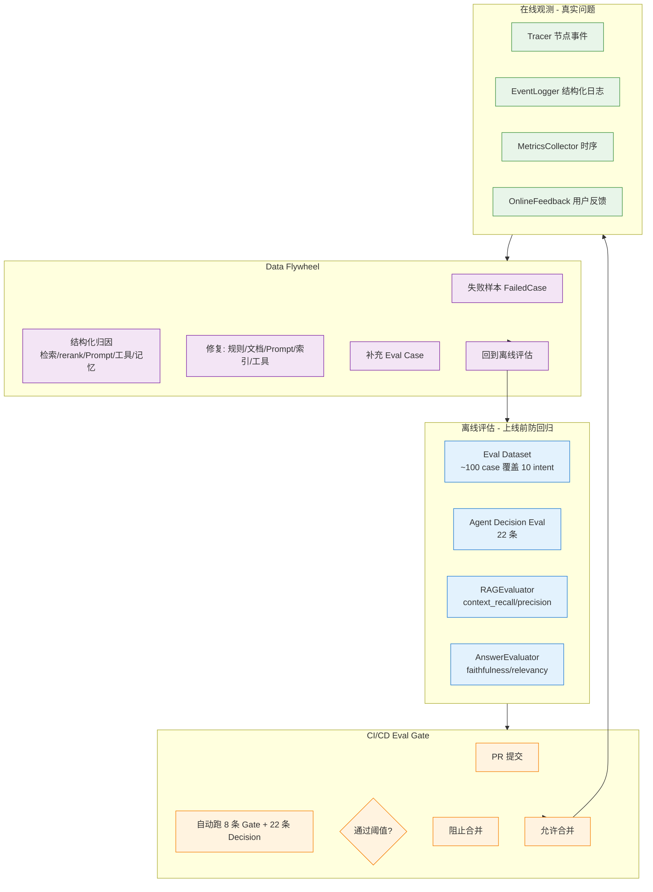
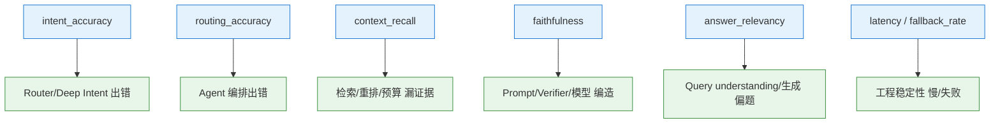
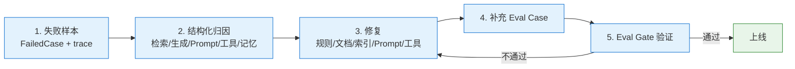

# 评估与数据飞轮

> 本主题文件存放在 `technical_deep_dive/主题/`，允许题目与其他主题重复。

## 结合项目的详细说明

项目的评估体系分离线评估、在线观测和数据飞轮三部分。原因是 RAG/Agent 系统的质量不是单一"答案对不对"，而是链路上多个环节共同决定：意图识别是否正确、路由是否正确、检索是否召回证据、上下文是否装配合理、生成是否忠实、工具是否安全、最终用户是否满意。

离线评估用于上线前防回归。项目有固定 eval dataset，覆盖 concept_qa、api_usage、code_generation、error_diagnosis、migration、compatibility、project_debug、best_practice、architecture、learning_guidance 等意图。每个 case 不只看答案文本，还看 expected_intent、expected_sources、answer_keywords、verified、retrieval_mode 等。这样可以定位是意图错、检索错、生成错，还是验证错。

Agent Decision Eval 专门评估路由能力。它检查 deep intent 后的 expected_next_node 和 expected_retrieval_mode，比如 error_diagnosis 应该走 call_tools/error_first，migration 和 compatibility 更偏 graph_first，code_generation 更偏 code_first。这个评估很重要，因为 Agent 的第一步路由错了，后面检索和生成再努力也很难补回来。

RAG 质量评估关注 context recall、precision、rerank 效果和 citation faithfulness。context recall 看正确证据有没有被召回，precision 看注入上下文的噪声比例，faithfulness 看答案是否真的基于证据。项目的 Eval Gate 会在关键改动前后跑这些指标，避免修改 chunking、rerank、Prompt 或 provider 后质量退化。

在线观测用于发现真实用户问题。线上记录 trace_id、session_id、intent、retrieval docs、tool calls、latency、verifier result、fallback reason 和用户反馈。离线评估集永远覆盖不了全部真实问题，所以线上 bad case 是数据飞轮的主要来源。失败样本会进入 FailedCaseModel，带上 payload 和 reason，方便后续归因。

数据飞轮的关键不是"收集更多数据"，而是结构化归因。一个失败答案可能来自：意图误判、query rewrite 错、向量漏召回、关键词没命中、图谱缺边、rerank 排错、上下文超预算丢证据、Prompt 约束不足、工具失败、模型幻觉。每类问题对应不同改进动作：补规则、补文档、改 chunk、调权重、补 eval case、优化 Prompt、修工具、增加 guardrail。

评估还要区分短期指标和长期指标。短期看 pass rate、intent accuracy、faithfulness、latency、fallback rate；长期看用户满意度、重复追问率、人工接管率、失败样本复发率和数据集覆盖率。尤其是 Agent 系统，单次回答看似正确，但如果工具调用过多、延迟过高、成本过高，也不是好系统。

Memory 也要评估。四层记忆系统里，上下文窗口是否注入了正确记忆、工作记忆是否保留任务状态、短期记忆是否压缩得当、长期记忆是否把稳定偏好提升为语义记忆、是否把历史事件保存为情节记忆，都可以通过测试 case 验证。记忆不是越多越好，评估要关注污染率和误注入率。

面试时可以收束：评估与数据飞轮的价值是把"感觉效果不错"变成可量化、可回归、可迭代的工程过程。没有 Eval Gate，RAG/Agent 改动很容易局部变好、整体变差；没有线上数据飞轮，离线集会越来越脱离真实用户问题。


### 具体设计和追问点

如果面试官问"评估集怎么构造"，可以说项目按意图和链路节点分层构造。每个 intent 至少覆盖简单 case、复杂 case、多意图 case 和边界 case；每个 case 标注 expected_intent、expected_sources、expected_route、expected_retrieval_mode、答案关键词和是否需要工具。这样不仅能评估最终答案，还能定位失败节点。

| 指标 | 看什么 | 用来定位 |
|---|---|---|
| intent_accuracy | 意图是否识别正确 | Router/Deep Intent |
| routing_accuracy | 下一节点是否正确 | Agent 编排 |
| context_recall | 正确证据是否进入上下文 | 检索/重排/预算 |
| faithfulness | 答案是否忠实证据 | Prompt/Verifier/模型 |
| answer_relevancy | 是否回答用户问题 | Query understanding/生成 |
| latency/fallback | 是否可上线 | 工程稳定性 |

数据飞轮要避免"只收集差评"。线上失败样本包括 verifier failure、检索低置信、用户追问、人工接管、工具失败、超时、fallback、低评分。每个失败样本都要带 trace，方便复盘它经过了哪些节点。没有 trace 的反馈很难转化成改进。

改进动作要闭环：失败样本进入数据集，标注原因，修复规则/文档/Prompt/工具/索引，再进入 Eval Gate 验证。通过后才上线。这样数据飞轮不是口号，而是"线上问题 -> 标注归因 -> 修复 -> 回归测试 -> 监控复发"的循环。


### 流程图

#### 1. 评估体系 3 部分（离线 / 在线 / 飞轮）



#### 2. 6 大评估指标 → 失败节点定位



#### 3. 数据飞轮 5 步闭环



### 易误会点（10 条）

**易误会点 1：评估 ≠ 单一指标**

RAG/Agent 质量是**6 大指标**的组合：intent_accuracy、routing_accuracy、context_recall、faithfulness、answer_relevancy、latency/fallback。

**易误会点 2：评估集不是越多越好**

22 条 Agent 决策 + 8 条 Eval Gate **足够**。多了 CI 慢 + 引入相关性。

**易误会点 3：Eval Gate 阻断 ≠ 全量评估**

Eval Gate 是**门禁级**（关键 case），**全量评估**在 nightly / weekly 跑。

**易误会点 4：数据飞轮 ≠ 收集差评**

飞轮是 **失败 → 归因 → 修复 → 回归** 闭环，不是"收集"就完事。

**易误会点 5：失败归因比修复重要**

如果不知道是**检索错 / rerank 错 / Prompt 错 / 模型错 / 工具错**，修哪里都是猜。

**易误会点 6：短指标 vs 长指标**

| 短期 | 长期 |
|------|------|
| pass rate | 用户满意度 |
| intent accuracy | 重复追问率 |
| faithfulness | 人工接管率 |
| latency | 失败样本复发率 |
| fallback rate | 数据集覆盖率 |

**易误会点 7：Memory 也要评估**

4 层记忆：上下文注入正确性、工作记忆状态保留、短期压缩合理性、长期分类准确性。**关注污染率 + 误注入率**。

**易误会点 8：成功 ≠ 单次指标好**

Agent 系统单次回答正确，但**工具调用过多、延迟过高、成本过高**也不是好系统。

**易误会点 9：线上反馈 ≠ thumbs up/down**

包括 verifier failure、低置信、追问、人工接管、工具失败、超时、fallback、低评分。

**易误会点 10：失败样本必须带 trace**

没 trace 的反馈很难复盘。trace 包含：intent、retrieved_docs、tool_calls、verifier_result、fallback_reason。

### 常见追问 10 条

**追问 ①：评估集怎么构造？**
- 按 intent 分层（10 intent 各覆盖）
- 按链路节点（检索/重排/生成/校验/工具）
- 简单 + 复杂 + 多意图 + 边界 case
- 标注 expected_intent/sources/route/mode/keywords

**追问 ②：Eval Gate 在 CI 哪个阶段？**
- PR 提交 → 跑 8 条 Gate + 22 条 Decision
- 不通过 → 阻止合并
- 不替代完整 nightly 评估

**追问 ③：Faithfulness 怎么测？**
- 答案断言是否都被证据支持
- 答案是否引用了 [1][2] 编号
- 是否有"无来源断言"
- RAGAS 框架 + Claim-level 校验

**追问 ④：怎么发现线上退化？**
- 实时指标监控（p95 latency、error rate、fallback rate）
- A/B 测试对比指标
- 抽样审核 trace

**追问 ⑤：RAGAS 是什么？**
- 评估框架，提供 faithfulness / answer_relevancy / context_recall / context_precision 4 个核心指标
- LLM-as-Judge 评估
- 项目集成在 `evals/rag_eval.py`

**追问 ⑥：LLM-as-Judge 怎么避免打分偏差？**
- 多次评估取平均
- 多个 LLM 投票
- 显式打分标准（rubric）
- 人工抽检对齐

**追问 ⑦：怎么保证评估集不过时？**
- 每月补充 5-10 条新 case
- 季度 review 老 case
- 跟踪线上高频问题

**追问 ⑧：幻觉率怎么量化？**
- Faithfulness < 0.85 视为幻觉
- 自动统计
- 实时告警

**追问 ⑨：失败样本怎么归类？**
- 检索错：context_recall < 0.7
- rerank 错：top1 错误
- Prompt 错：faithfulness 异常
- 工具错：tool_errors 出现
- 记忆错：用户反馈与历史不符

**追问 ⑩：评估效果不达预期怎么办？**
- 看错误样本归因
- 拆解到具体节点
- 局部修复 + 回归测试
- 必要时重新设计

## 匹配到的题目（42 道）

### 1. Agent生产事故如何排查？ [来源:01_RAG核心链路.md | 重要性:A]

**结合项目回答评分：** 10/10（匹配置信度 100/100）

**结合项目的回答：**

结合项目回答：项目采用 80% Workflow + 20% Agent 的混合架构。LangGraph StateGraph 定义 16 个节点和条件边，保证主流程可控；Router/Deep Intent、Knowledge Agent、Tool Agent、Verifier Agent 在关键节点做动态决策。这样既能避免纯 Agent 的不可控和死循环，又保留了根据中间结果选择检索策略、工具调用、答案校验和失败恢复的灵活性。

**完美答案：**

**排障金字塔```
   L1 用户报告：用户反馈"Agent不回复了/回复很慢/回复错误"
   → L2 链路追踪：分布式Trace ID串联全链路（API网关→Agent服务→LLM→工具调用→返回）
   → L3 定位根因：
       - API超时？→检查LLM provider状态/token限制/网络延迟
       - 字符编码？→Emoji/特殊字符导致JSON解析失败→加异常捕获+fallback
       - 死循环？→ReAct步数监控>20步报警→强制终止并返回现有结果
       - 工具异常？→工具返回状态码/报错日志→定位工具侧问题
   → L4 修复+回归测试：修复后在staging环境回归后再上线
   ```

   **关键工具链OpenTelemetry(分布式Trace)+Prometheus(指标)+ELK(日志)+Grafana(看板)。

---

---

### 2. LLM-as-Judge 的评分和人工评分一致性有多高？怎么提高？ [来源:01_RAG核心链路.md | 重要性:A]

**结合项目回答评分：** 8/10（匹配置信度 74/100）

**结合项目的回答：**

结合项目回答：评估体系分离线和在线两条线。离线用固定 eval dataset 跑 intent accuracy、context recall、faithfulness、answer relevancy 等指标；在线收集用户反馈、失败样本和 trace，异步进入 Data Flywheel。改动上线前跑 Eval Gate 防回归。

**完美答案：**

在条件合适的情况下一致性可以达到 0.7-0.85 的 Cohen's Kappa，勉强可用但远非完美。Faithfulness 这类"事实核查"型指标一致性较高，因为判断"这句话有没有上下文依据"相对客观，LLM 和人的分歧主要在一些边界 case（比如"上下文暗示了但没有明说"算不算有依据）。Answer Relevancy 和 Completeness 这类偏主观的指标一致性就差一些，不同人的判断差异本身就大，LLM 的评判也容易波动。提高一致性有几个方法：一是评测标准要极度具体，不要给 LLM 模糊的指令（"判断回答好不好"），而要拆成多个判断题（"回答是否覆盖了用户问题的每个子问题？逐项检查"）；二是用 Few-shot 给 LLM 几个标注好的范例，让 LLM 模仿标注风格；三是用多个 LLM 并行评判取多数票（ensemble），降低单一模型的偏差；四是定期把 LLM 评判和人工评判不一致的 case 拿出来 review，迭代优化评测 Prompt。

---

---

### 3. Long Context 常见思路有哪些？在业务里如何做"能看长文本但不太贵"的折中（摘要／分段／滑窗等）? [来源:01_RAG核心链路.md | 重要性:A]

**结合项目回答评分：** 8/10（匹配置信度 74/100）

**结合项目的回答：**

结合项目回答：上下文管理由 ContextManager、TokenBudget、CitationManager 和 PromptBuilder 完成。Token 预算按优先级分配：用户问题最高，其次是检索文档、工具结果、会话摘要和历史消息；Prompt 组装时优先放高分、高置信来源，并给每个 Chunk 明确编号和边界。

**完美答案：**

回答时按"定义/目标 -> 核心机制 -> 工程落地 -> 指标与风险"展开。先给结论，再说明为什么这样设计，最后结合项目补充延迟、成本、稳定性、评测和安全边界。

---

---

### 4. RAG从文档入库到回答的完整链路？ [来源:01_RAG核心链路.md | 重要性:S]

**结合项目回答评分：** 10/10（匹配置信度 100/100）

**结合项目的回答：**

结合项目回答：离线索引链路是文档加载/解析 → 清洗预处理 → Chunk 切分 → BGE-M3 向量化 → MinIO 保存原文 → Milvus 写向量 → Elasticsearch 写关键词索引。每个 Chunk 携带 source、section、doc_type、更新时间等元数据。更新策略是实时增量 + 定时重建兜底；索引异常时检索链路还能从 hybrid 降级到 keyword/vector only。

**完美答案：**

```
   离线：原始文档→格式解析(PDF/Word/MD)→清洗(去噪/格式统一)→Chunking→Embedding→向量库+ES双写
   在线：用户Query→意图识别→Query改写→并行向量检索(BM25)+关键词检索(ES)→RRF融合Top-50→Cross-Encoder Rerank→Top-5→拼Prompt→LLM生成→引用标注→SSE流式返回
   ```
   每个环节都有监控埋点和降级方案。例如Rerank超时→跳过直接用向量排序结果兜底。

---

---

### 5. RAG系统如何评估？检索和生成分别用什么指标？ [来源:01_RAG核心链路.md | 重要性:A]

**结合项目回答评分：** 10/10（匹配置信度 100/100）

**结合项目的回答：**

结合项目回答：在线检索是 Agentic Hybrid RAG。Deep Intent/检索路由判断问题类型后，调用 Milvus 向量检索、Elasticsearch BM25/IK 中文分词检索和可选 GraphRAG；结果用 RRF 融合，再进入 Rerank 和上下文构建。检索失败有降级链：Graph 失败不影响向量+关键词，Milvus 不可用可退到 ES/内存关键词兜底。

**完美答案：**

**检索阶段Recall@K（有没有漏掉）、Precision@K（结果中有多少相关的）、MRR（第一个正确答案的排名）、NDCG@K（带排序质量）。

   **生成阶段（RAGAS框架）Faithfulness（基于上下文的忠实度，防幻觉）、Answer Relevancy（答案切题度）、Context Recall（必要信息是否被召回）。

---

---

### 6. Rewrite模型是你做的，具体输入输出是什么？你们是把 rewrite放在检索前还是后？训练数据是人工构造的吗？ [来源:01_RAG核心链路.md | 重要性:A]

**结合项目回答评分：** 10/10（匹配置信度 96/100）

**结合项目的回答：**

结合项目回答：在线检索是 Agentic Hybrid RAG。Deep Intent/检索路由判断问题类型后，调用 Milvus 向量检索、Elasticsearch BM25/IK 中文分词检索和可选 GraphRAG；结果用 RRF 融合，再进入 Rerank 和上下文构建。检索失败有降级链：Graph 失败不影响向量+关键词，Milvus 不可用可退到 ES/内存关键词兜底。

**完美答案：**

**1) Rewrite模型的输入**

输入由两部分组成：当前用户query（可能包含指代词、省略、口语化表达、专业术语简写等）+ 对话历史（最近N轮对话，通常N=3~5）。对话历史的作用是为指代消解和上下文补全提供信息。例如：
- 用户第1轮："什么是Transformer的自注意力机制？"
- 用户第2轮："它的计算复杂度是多少？" 
→ Rewrite模型需要根据第1轮的历史，将第2轮的"它"消解为"自注意力机制"，输出改写query："自注意力机制的计算复杂度是多少"

输入格式通常为：`[历史轮次] ... [当前query] 请改写为独立完整的检索查询`，或者将对话中所有轮次的query拼接后用特殊分隔符标记。

**2) Rewrite模型的输出**

输出是一个独立完整、可以直接用于检索的query字符串。改写目标包括：
- 指代消解：将"它""这个""上面那个"替换为具体实体
- 上下文补全：将省略的主语/宾语/条件补全
- 术语归一化：将口语化表达转为知识库中使用的正式术语（如"退钱"→"退款申请流程"）
- 复合问题拆分（可选）：将一个复杂多意图query拆分为多个子query
- 生成等价问法（可选）：输出多个不同表述的query增强召回覆盖率

注意：Rewrite必须保持用户原意不变。如果模型不确定如何改写，输出原始query作为兜底。

**3) Rewrite放在检索前还是检索后**

放在检索前（pre-retrieval rewrite）。这是标准做法，原因很直接：如果用户原始query有指代不明或术语不规范的问题，直接用原query检索效果会很差。Rewrite在检索前将query"修正"为检索友好的形式，显著提升召回质量。

典型的检索流程：用户原始query → Rewrite模型改写 → 得到改写query → 将原始query和改写query（可多个）并行发送到检索系统 → 各路检索结果RRF融合去重 → 进入Rerank精排。保留原始query并行检索是安全兜底——万一Rewrite改坏了（改变了用户意图），原始query的结果仍然可用。

**4) 训练数据构造**

三层来源：

第一层——人工标注。这是质量最高但成本最高的方式。从线上历史对话日志中抽取多轮对话片段，人工为最后一轮query标注"理想的独立检索query"。标注规范要明确指代消解、术语归一化、不改变原意等标准。通常需要500~1000条高质量标注数据做种子。

第二层——LLM辅助生成。用强模型（如GPT-4/DeepSeek）批量生成训练数据。给LLM多轮对话上下文，要求它输出改写后的query，相当于用大模型"蒸馏"出训练数据。一个Prompt可以同时生成多种改写风格（简洁版、详细版、术语归一化版），大幅降低标注成本。关键是随后做人工抽检保证质量。

第三层——线上反馈数据。将Rewrite模型上线后，记录哪些改写后的query带来了好的检索结果（高Rerank分数、用户点赞），哪些改写得不好（用户追问、负反馈）。将这些正负样本加入训练集持续迭代。

训练方式：如果用量不大的话用Prompt+强模型即可（零训练成本但推理延迟高），如果QPS高则用标注数据微调一个小模型（如Qwen2-1.5B）做专用Rewrite模型，推理快且成本低。

---

---

### 7. 什么是大模型的幻觉，如何减轻幻觉问题 [来源:01_RAG核心链路.md | 重要性:S]

**结合项目回答评分：** 10/10（匹配置信度 98/100）

**结合项目的回答：**

结合项目回答：幻觉治理靠检索约束、引用、校验和评估闭环。PromptBuilder 要求基于上下文回答，CitationManager 生成来源引用；Verifier Agent 检查答案是否有依据、引用是否存在，不通过就 regenerate 或 fallback；线上 bad case 进入 Data Flywheel，反向优化切分、检索、Prompt 和知识库覆盖。

**完美答案：**

**幻觉的定义和分类：**

大模型幻觉（Hallucination）指模型生成的内容与客观事实不符、缺乏依据、或与提供的上下文矛盾。分为三类：事实性幻觉——模型编造了不存在的实体、事件、数据（如"2025年某公司营收为XX亿"但实际没有）；忠实性幻觉——模型虽然给出了上下文但输出与上下文不一致（如上下文写"A>B"但回答"B>A"）；逻辑性幻觉——推理链中存在逻辑断裂但表面上看起来很合理。

**幻觉的根本原因：**

训练数据层面——预训练数据中存在错误信息、过时信息或偏见，模型学到了这些。模型架构层面——Transformer的生成本质上是概率采样而非事实核查，Softmax输出的是"最可能的下一个token"而非"最正确的下一个token"。解码策略层面——温度采样和top-p带来的随机性使得同一问题可能得到不同答案。RLHF层面——过度优化让模型倾向于"总是给答案"而非"不知道时拒绝"，因为训练中拒绝回答的样本往往获得较低的奖励。

**减轻方案：**

第一道防线：RAG注入外部知识。检索真实、最新的文档作为生成依据，将模型从"凭记忆编造"转为"基于材料回答"。这是目前最有效的方式，但前提是检索质量要到位。

第二道防线：Prompt工程设计。明确指令"仅基于上下文回答"、"信息不足时回答无法确认"、"引用原文证据"；结构化输出要求"先摘录原文→再给出答案"。

第三道防线：上下文优化。压缩噪声、排序优化（高分在前避免Lost in Middle）、控制总量（宁精勿杂）。

第四道防线：输出验证。LLM-as-Judge自检+关键事实正则匹配验证。

第五道防线：微调行为模式。通过SFT训练模型"基于上下文回答"、"不知道时说不知道"的行为习惯，降低模型依赖参数知识编造答案的倾向。

---

---

### 8. 你在项目中怎么衡量幻觉率？有没有自动化的评测方法？ [来源:01_RAG核心链路.md | 重要性:A]

**结合项目回答评分：** 6/10（匹配置信度 60/100）

**结合项目的回答：**

结合项目回答：幻觉治理靠检索约束、引用、校验和评估闭环。PromptBuilder 要求基于上下文回答，CitationManager 生成来源引用；Verifier Agent 检查答案是否有依据、引用是否存在，不通过就 regenerate 或 fallback；线上 bad case 进入 Data Flywheel，反向优化切分、检索、Prompt 和知识库覆盖。

**完美答案：**

我主要用 LLM-as-Judge 做自动化评测。具体做法是采样一批线上回答，用 GPT-4 或 DeepSeek 这类强模型做"事实核查"——把回答拆成独立的声明（claim），对每个声明检查是否能在检索到的上下文中找到依据。如果一个回答中的声明有超过 20% 找不到依据，就标记为幻觉。然后统计幻觉回答占总样本的比例作为幻觉率指标。为了验证 LLM 评判的准确性，我会先在小样本（50-100 条）上做人工标注，计算 LLM 评判和人工评判的一致性（Cohen's Kappa > 0.7 就认为可靠）。另外我还设了"拒绝回答率"作为辅助指标——模型正确说"不知道"的次数除以"该说不知道的总次数"，这个指标反映了模型在"信息不足时克制不编造"的能力。这套评测体系虽然不能覆盖所有幻觉类型，但能持续监控系统的可靠性趋势。

---

---

### 9. 你在项目中用了什么评测工具？RAGAS 的具体使用体验如何？ [来源:01_RAG核心链路.md | 重要性:A]

**结合项目回答评分：** 10/10（匹配置信度 100/100）

**结合项目的回答：**

结合项目回答：评估体系分离线和在线两条线。离线用固定 eval dataset 跑 intent accuracy、context recall、faithfulness、answer relevancy 等指标；在线收集用户反馈、失败样本和 trace，异步进入 Data Flywheel。改动上线前跑 Eval Gate 防回归。

**完美答案：**

我主要用 RAGAS 框架做自动化评测。它的优点是开箱即用——定义好了 Faithfulness、Answer Relevancy、Context Precision、Context Recall 四个核心指标，每个指标都有对应的评估 Prompt，调用方式也很简洁，传 query、answer、contexts 就能跑出一组分数。而且它支持指定评测 LLM（可以用自己的模型而不依赖 OpenAI）。但使用中的几个痛点也很明显。一是速度慢——每条评测要调用 LLM 多次（Faithfulness 要逐个声明核查，一个回答可能拆出 5 条声明就是 5 次调用），批量评测几百条要花不少时间和 API 费用。二是评测结果不够稳定，同一批数据跑两次可能分数波动 3-5 个百分点。三是某些评测 Prompt 是为英文优化的，中文场景需要自己调整评测标准。总体来说是很好的起点，但生产环境我会在 RAGAS 基础上封装一层自己的评测逻辑，补充业务特有的检查项（如格式合规、敏感词过滤）。

---

---

### 10. 你实际项目中 Chunk 大小是怎么确定的？有没有做过对比实验？ [来源:01_RAG核心链路.md | 重要性:A]

**结合项目回答评分：** 10/10（匹配置信度 100/100）

**结合项目的回答：**

结合项目回答：Chunking 是检索质量核心。Markdown/技术文档按标题层级和段落语义切，通用文本用递归切分加 overlap，FAQ/代码类内容按天然结构切。Chunk 写入时带来源、章节路径、页码、文档类型等元数据，后续用于过滤和引用；优化靠 Recall@K、MRR 和 bad case，而不是拍脑袋调 chunk_size。

**完美答案：**

有的，我是通过 A/B 实验确定的。我建了一个小规模评测集，包含大约 100 条典型的用户 query 和对应的人工标注正确答案。然后在同一个 Embedding 模型和向量库上，分别用 256、512、768、1024 token 几种 Chunk 大小跑检索，对比 Recall@10 和 MRR。结果发现 256 太细，长段落的上下文被切断导致 Recall 偏低；1024 太粗，一个 Chunk 里杂糅多个主题导致检索结果不够精准。512 token（约 1500 个中文字符，20% overlap）在我们的文档类型下效果最好。另外要注意，这个结果和文档类型强相关——我们的是技术文档，如果是 FAQ 短问答可能 128 就够了，法律合同可能需要 1024。所以不是测一次就一劳永逸，换了文档类型要重新验证。

---

---

### 11. 分类任务常用的评测指标有哪些 [来源:01_RAG核心链路.md | 重要性:A]

**结合项目回答评分：** 6/10（匹配置信度 55/100）

**结合项目的回答：**

结合项目回答：评估体系分离线和在线两条线。离线用固定 eval dataset 跑 intent accuracy、context recall、faithfulness、answer relevancy 等指标；在线收集用户反馈、失败样本和 trace，异步进入 Data Flywheel。改动上线前跑 Eval Gate 防回归。

**完美答案：**

**基础四件套——从混淆矩阵出发：**

| | 预测为正 | 预测为负 |
|------|---------|---------|
| 实际正类 | TP (True Positive) | FN (False Negative) |
| 实际负类 | FP (False Positive) | TN (True Negative) |

Accuracy = (TP+TN) / (TP+TN+FP+FN)：整体正确率。优点是最直观，缺点是样本极度不均衡时误导性极强（99%负样本+全猜负→Accuracy=99%但毫无意义）。

Precision（精确率）= TP / (TP+FP)：模型说"是"的样本中，有多少真的是。反映"不乱扣帽子"的能力。当你关心"误判为正"的代价时看这个（如垃圾邮件过滤——正常邮件被判为垃圾邮件很糟糕）。

Recall（召回率）= TP / (TP+FN)：所有真实的正样本中，模型找出了多少。反映"不漏掉"的能力。当你关心"漏判为负"的代价时看这个（如疾病筛查——漏掉一个病人代价极高）。

F1 Score = 2 × Precision × Recall / (Precision + Recall)：Precision和Recall的调和平均。两者冲突时（提高Precision通常降低Recall），F1提供一个平衡视角。Fβ中的β控制对Recall的偏重——β>1更看重Recall，β<1更看重Precision。

**进阶指标：**

Confusion Matrix（混淆矩阵）：最基础的诊断工具，可视化各类别的分类情况，帮助发现哪些类别之间容易混淆。

ROC-AUC：衡量模型在不同阈值下区分正负样本的能力。ROC曲线以FPR（误报率=FP/(FP+TN)）为横轴、TPR（召回率=TP/(TP+FN)）为纵轴，AUC是曲线下面积（0.5=随机，1.0=完美）。适合评估概率输出模型的排序能力，但对样本不均衡不太敏感。

PR-AUC：以Recall为横轴、Precision为纵轴。在样本极度不均衡的场景下（正样本占比<5%），PR-AUC比ROC-AUC更能反映模型真实性能。

Macro vs Micro平均：多分类场景下，Macro为先对每个类别分别计算指标再取平均（每个类别等权重，小类别和大类别同等重要），Micro为先汇总所有类别的TP/FP/FN再计算指标（每个样本等权重，大批量类别主导结果）。

**选择建议：** 区分模型能力用Accuracy/F1/ROC-AUC，定位具体问题用Confusion Matrix，样本不均衡用PR-AUC或Macro F1，业务导向选Precision vs Recall取决于"更怕误报还是漏报"。

---

---

### 12. 向量检索的准召率如何保障？你使用的向量数据库之间的差异是什么？ [来源:01_RAG核心链路.md | 重要性:A]

**结合项目回答评分：** 10/10（匹配置信度 100/100）

**结合项目的回答：**

结合项目回答：向量数据库选择 Milvus，是因为项目需要服务化、多集合管理、元数据过滤、多租户扩展。Milvus 存 BGE-M3 向量，配合 HNSW 做 ANN 检索；tenant、文档类型、时间等字段作为 metadata filter。规模上来后可按租户或业务域分 collection/partition。

**完美答案：**

**一、准召率保障的多层策略**

保障向量检索的准召率不能只靠调索引参数，需要从上游到下游分层控制：

第1层——Chunk质量保障。这是最容易被忽视但影响最大的环节。Chunk策略直接影响Embedding质量：Chunk太大导致语义混浊（一篇中混入多个主题，向量变成模糊的平均值），Chunk太小导致信息残缺（关键信息被切断在多个Chunk之间）。保障手段：针对不同文档类型用不同切分策略（语义切分、结构切分、规则切分），加overlap防止边界信息丢失，通过Parent-Child分层兼顾检索精度和上下文完整性。

第2层——Embedding模型选择与调优。模型的能力上限直接决定召回天花板。保障手段：在自有评测集上对比多个候选模型（BGE、GTE、E5等）的Recall@K，取实测最优而非只看MTEB榜单排名；如果通用模型效果不够，在业务数据上微调Embedding（对比学习+业务query-doc对）；考虑Query-Doc不对称问题——训练时query和doc的长度、表述风格差异越大，对Embedding的挑战越大。

第3层——索引参数调优。ANN索引本质上是精度和速度的交易。HNSW的efConstruction和M参数影响构建质量和内存，efSearch影响检索精度和延迟——efSearch越大精度越高但速度越慢。IVF的nlist影响聚类粒度——太小聚类粗糙、太大训练开销大，nprobe影响搜索精度——越大召回率越高但越慢。调优方法：在评测集上对不同参数组合画"Recall vs Latency"曲线，找精度和延迟的最优平衡点。

第4层——融合策略保障。单路向量检索即使参数最优也可能漏掉精确匹配需求。加上BM25关键词检索做互补（Hybrid Search），两路结果通过RRF或加权融合统一排序，再加Cross-Encoder Rerank精排，形成"粗筛→融合→精排"三道保险。

**二、离线评测体系**

核心：构建Gold Set（金标评测集）。从业务日志中抽样100~200条真实query，人工为每条query标注"哪些文档是正确答案"（标注相关文档ID列表）。每次改动（调整Chunk、换模型、改索引参数、加融合策略）后，在金标集上跑：
- Recall@K：Top-K结果中相关文档命中率（K通常取5/10/20），反映"有没有漏掉"
- Precision@K：Top-K结果中相关文档占比，反映"结果中有多少噪声"
- MRR：第一个正确答案的平均排名倒数，反映"最佳答案排得多靠前"

建议建立自动化评测Pipeline，每次代码提交后在金标集上跑全量指标并对比baseline。防止主观感觉误导——"感觉效果变好了"不靠谱，数据对比才可靠。

**三、在线监控体系**

离线评测不能完全代表线上真实表现。在线监控分三层：

用户行为信号：答案点赞/踩、复制率、追问率、对话停留时长——这些行为信号能间接反映召回质量（用户反复追问可能意味着首次回答不满意，根源可能是召回不完整）。

检索质量实时检测：采样线上流量（如每100条采样1条），异步评估RAGAS指标（Faithfulness、Answer Relevancy），设定阈值报警。如果某项指标连续下滑超过阈值（如Faithfulness从85%降到75%），自动触发排查。

异常检测和人工抽检：设定query维度的时间序列监控（Recall@5的趋势变化），检测突发性下降。每周人工抽检20~50条线上回答，做详细质量审计。

---

---

### 13. 大模型幻觉（Hallucination）解决方案：如何缓解模型幻觉问题，稳定输出？ [来源:01_RAG核心链路.md | 重要性:S]

**结合项目回答评分：** 10/10（匹配置信度 100/100）

**结合项目的回答：**

结合项目回答：幻觉治理靠检索约束、引用、校验和评估闭环。PromptBuilder 要求基于上下文回答，CitationManager 生成来源引用；Verifier Agent 检查答案是否有依据、引用是否存在，不通过就 regenerate 或 fallback；线上 bad case 进入 Data Flywheel，反向优化切分、检索、Prompt 和知识库覆盖。

**完美答案：**

RAG系统下的幻觉治理不是一个技术点，而是一个分层防御体系。

**第一层：检索质量保障（源头治理）**

幻觉最常见根源是检索没召回正确文档——模型基于不相关的上下文或自身参数知识编造答案。从根本上降低幻觉的前提是检索质量到位。具体手段：优化Chunk策略确保信息完整性、选对Embedding模型确保语义匹配精度、Hybrid Search互补精确匹配和语义匹配、Rerank精排保证Top结果高相关、Query Rewrite消除指代和术语问题。检索端的Recall@5如果没有做到85%+，生成端的幻觉治理就是舍本逐末。

**第二层：生成约束（Prompt层）**

即使检索到了正确信息，模型也可能忽略上下文而基于自身参数知识回答。Prompt层面的关键约束包括：
- 明确指令："请仅基于以下参考资料回答。如果参考资料中没有相关信息，请明确回答'根据现有资料，我无法回答此问题'"
- 先引用再回答：要求模型在回答中标注每条信息的来源编号，引用原文关键句，这强迫模型"对齐"到上下文
- 禁止推断："请不要做超出原文内容的推断或猜测。如果原文没有明确说明，请不要补充"
- 自我检查：在回答末尾要求模型自检"以上回答中的所有事实是否都能在参考资料中找到依据？"

**第三层：上下文优化（信噪比治理）**

上下文太长、噪声太多会加剧Lost in Middle效应和误导风险。手段：关键句压缩去掉不相关句子（每个Chunk只保留与query最相关的2~3句）、按Rerank分数排序（最高分放开头/结尾，避免埋在中间）、控制上下文总量（简单查询3个Chunk，复杂查询最多8个）、设置Rerank分数阈值（低于阈值的Chunk直接丢弃）。

**第四层：事后验证（自动化评估）**

生成答案后做自动化校验，作为上线前的最后一道防线：
- Faithfulness检查：用LLM-as-Judge将回答拆为独立声明，逐条检查是否在检索到的上下文中找到依据。任一声明无依据→标记为潜在幻觉
- 关键事实二次校验：对涉及数字、日期、金额、人名等关键事实，从原文中做字符串级别的精确匹配验证
- 一致性检查：同一问题在不同上下文下多次查询，回答是否一致

**第五层：知识库质量治理（数据层）**

如果知识库本身有错误、过时或自相矛盾的信息，模型"忠实引用"反而产生幻觉。治理手段：文档入库前做质量审核（自动+人工）、定期检查文档时效性（标注过期时间）、冲突检测（同一实体在多个文档中有矛盾信息时报警）。

**稳定输出的额外保障：**

- 拒绝回答机制：Faithfulness检查不过关时，不回传可能错误的答案，改为"无法确认"的标准化回复
- Fallback策略：Retrieval失败或生成置信度低时，降级为精确搜索或人工转接
- 输出格式约束：用JSON Schema或正则约束输出格式，防止格式漂移引发下游解析错误

---

---

### 14. 如何设计 RAG 的评测指标？ [来源:01_RAG核心链路.md | 重要性:S]

**结合项目回答评分：** 10/10（匹配置信度 100/100）

**结合项目的回答：**

结合项目回答：评估体系分离线和在线两条线。离线用固定 eval dataset 跑 intent accuracy、context recall、faithfulness、answer relevancy 等指标；在线收集用户反馈、失败样本和 trace，异步进入 Data Flywheel。改动上线前跑 Eval Gate 防回归。

**完美答案：**

RAG 的评测需要分别评估检索质量和生成质量。检索端常用 Recall@K、MRR、NDCG 等经典 IR 指标；生成端需要评估回答的准确性（Faithfulness，是否忠实于检索到的上下文）、相关性（Answer Relevancy，回答是否切题）、以及完整性。近年来 RAGAS 框架提出了一套比较完整的评测方案，结合 LLM-as-Judge 做自动化评测已经是行业主流做法。

---

---

### 15. 检索结果的向量匹配指标？Recall@K、MRR、NDCG@K？ [来源:01_RAG核心链路.md | 重要性:A]

**结合项目回答评分：** 8/10（匹配置信度 80/100）

**结合项目的回答：**

结合项目回答：在线检索是 Agentic Hybrid RAG。Deep Intent/检索路由判断问题类型后，调用 Milvus 向量检索、Elasticsearch BM25/IK 中文分词检索和可选 GraphRAG；结果用 RRF 融合，再进入 Rerank 和上下文构建。检索失败有降级链：Graph 失败不影响向量+关键词，Milvus 不可用可退到 ES/内存关键词兜底。

**完美答案：**

| 指标 | 公式 | 含义 | 什么时候关注 |
   |------|------|------|------------|
   | **Recall@K** | 命中相关文档数 / 总相关文档数 | "有没有漏掉？" | 需要全面召回的场景（法律/合规） |
   | **Precision@K** | 命中相关文档数 / K | "结果中有多少相关的？" | 需要精度的场景（客服FAQ） |
   | **MRR** | 1/第一个相关文档的排名 | "第一个正确答案排第几？" | FAQ型问答（只需要一个答案） |
   | **NDCG@K** | 考虑排序位置+相关度分级的归一化得分 | "排序质量如何？" | 需要排序质量的场景（推荐/搜索引擎） |

   **计算示例Top-5 = [D3(相关), D7(相关), D1(不相关), D5(不相关), D2(相关)]，总相关=4 → Recall@5=3/4=75%，Precision@5=3/5=60%，MRR=1/1=1.0。

---

---

### 16. 知识库准确率和召回率怎么评估？有量化数据吗？ [来源:01_RAG核心链路.md | 重要性:A]

**结合项目回答评分：** 10/10（匹配置信度 98/100）

**结合项目的回答：**

结合项目回答：在线检索是 Agentic Hybrid RAG。Deep Intent/检索路由判断问题类型后，调用 Milvus 向量检索、Elasticsearch BM25/IK 中文分词检索和可选 GraphRAG；结果用 RRF 融合，再进入 Rerank 和上下文构建。检索失败有降级链：Graph 失败不影响向量+关键词，Milvus 不可用可退到 ES/内存关键词兜底。

**完美答案：**

建立Golden Set（金标集）：人工标注50-100个query，每个query标注"相关文档ID列表"作为Ground Truth。每次RAG改动后用金标集跑Recall@K——Recall@5从72%→90%的典型提升路径：Chunking调优(+8%) → 混合检索(+6%) → Rerank(+4%)。**关键是先建金标集再调优，否则等于盲调。**

---

---

### 17. 评测体系你是怎么搭建的？评测指标都有哪些 [来源:01_RAG核心链路.md | 重要性:S]

**结合项目回答评分：** 10/10（匹配置信度 100/100）

**结合项目的回答：**

结合项目回答：评估体系分离线和在线两条线。离线用固定 eval dataset 跑 intent accuracy、context recall、faithfulness、answer relevancy 等指标；在线收集用户反馈、失败样本和 trace，异步进入 Data Flywheel。改动上线前跑 Eval Gate 防回归。

**完美答案：**

评测体系的搭建核心是回答三个问题：测什么、怎么测、测完怎么用。

**第一层：评测集构建**

Gold Set（金标评测集）是一切评测的基础。从业务日志中抽样200~500条典型query（覆盖不同问题类型：事实查询、推理查询、对比查询、否定查询等+不同query表述方式），每条标注正确答案文档ID列表和参考答案。标注来源：线上真实query+用户行为信号（点击、点赞）+LLM基于文档自动生成QA对后人工审核。另外单独维护一个bad case回归测试集——每次优化后必须验证历史bad case是否好转或至少未退化。

**第二层：自动化评测Pipeline**

每次代码变更或策略调整后，自动在评测集上跑：
- 检索端指标：Recall@K（K=5/10/20，正确文档有没有被找到）、Precision@K（Top结果中相关文档占比）、MRR（第一个正确答案的排名倒数均值）、NDCG@K（带排序位置的指标）
- 生成端指标（via RAGAS + LLM-as-Judge）：Faithfulness（回答中的事实性声明在上下文中是否有依据）、Answer Relevancy（回答是否切题）、Context Recall（必要信息是否被检索覆盖）
- 系统指标：端到端延迟（P50/P95/P99）、Query Per Second、Token消耗

评测自动化需要集成到CI/CD中或做成定时任务，每次跑完生成对比报告（基线vs当前版本）。

**第三层：监控告警**

在线侧：采样线上回答（5%~10%流量），异步评估Faithfulness和Relevancy，设定阈值（如Faithfulness低于80%报警）。监控关键指标的趋势变化而非绝对值——Faithfulness从85%连续滑落到75%比绝对值75%更需要关注。用户行为信号（点赞/踩比、复制率、追问率）作为辅助指标。

离线侧：每周全量跑一次评测集，输出各项指标的周趋势报告。对严重退化指标（如Recall@5下降>5%）自动触发排查流程。

**闭环迭代：** 评测的结果不是终点而是起点。低质量样本沉淀为bad case，人工分析根因（属于chunk切分问题、Embedding问题、检索策略问题还是生成问题），按根因分类统计，优先修影响面最大的类别。修复后验证→上线→收集新bad case，形成"发现问题→定位根因→修复→验证→发现新问题"的持续优化循环。

---

---

### 18. 评测集需要多大规模才够？怎么平衡标注成本和覆盖度？ [来源:01_RAG核心链路.md | 重要性:S]

**结合项目回答评分：** 7/10（匹配置信度 69/100）

**结合项目的回答：**

结合项目回答：评估体系分离线和在线两条线。离线用固定 eval dataset 跑 intent accuracy、context recall、faithfulness、answer relevancy 等指标；在线收集用户反馈、失败样本和 trace，异步进入 Data Flywheel。改动上线前跑 Eval Gate 防回归。

**完美答案：**

200-500 条是一个比较合理的起点，能给出统计意义上稳定的指标对比。100 条以下评测结果波动太大（比如跑 50 条 Recall 是 83%，多跑 10 条可能就变成 79%），不足以做可靠的决策。重要的是这 200-500 条要保证覆盖多样性——不同问题类型（事实查询、推理查询、对比查询等）、不同 query 长度和表述方式、不同知识库区域（不能只测热门文档，冷门文档也要覆盖）。标注成本控制方面，我会分层处理：200 条核心评测集做人工精细标注（检索端标注我一般自己做，每条 1-3 分钟，200 条大概一天工作量），另外 300 条用 LLM 生成带人工抽检。也可以先把所有线上 query 聚成不同类别，按类别分层抽样，这样每条标注代表的不止是它自己，而是一类问题，覆盖效率更高。

---

---

### 19. 70-2. Agent 评测数据集怎么构建和持续迭代？从零到生产级的建设路径 [来源:02_Agent核心原理.md | 重要性:S]

**结合项目回答评分：** 9/10（匹配置信度 85/100）

**结合项目的回答：**

结合项目回答：项目采用 80% Workflow + 20% Agent 的混合架构。LangGraph StateGraph 定义 16 个节点和条件边，保证主流程可控；Router/Deep Intent、Knowledge Agent、Tool Agent、Verifier Agent 在关键节点做动态决策。这样既能避免纯 Agent 的不可控和死循环，又保留了根据中间结果选择检索策略、工具调用、答案校验和失败恢复的灵活性。

**完美答案：**

评测数据集不是一次性造完就固定不变的，而是要建立"采集→标注→分层→迭代"的持续流水线。从种子集起步（50-100 个典型场景），通过线上日志采样和主动挖掘持续扩充，配合分层管理（核心回归集、场景专项集、压力测试集），形成可迭代的评测基础设施。

---

---

### 20. 70-3. Agent 评测如何集成到 CI/CD 流水线？什么该跑、什么不该跑？ [来源:02_Agent核心原理.md | 重要性:S]

**结合项目回答评分：** 10/10（匹配置信度 100/100）

**结合项目的回答：**

结合项目回答：项目采用 80% Workflow + 20% Agent 的混合架构。LangGraph StateGraph 定义 16 个节点和条件边，保证主流程可控；Router/Deep Intent、Knowledge Agent、Tool Agent、Verifier Agent 在关键节点做动态决策。这样既能避免纯 Agent 的不可控和死循环，又保留了根据中间结果选择检索策略、工具调用、答案校验和失败恢复的灵活性。

**完美答案：**

不是所有评测都适合在 CI 中跑——Agent 的端到端评测耗时长、成本高，全量跑会让 CI 变成瓶颈。关键是分层触发：每次 PR 跑轻量级检查（核心回归集 50 条，10 分钟内完成）；每日定时跑全量回归；发版前跑完整验证。同时要设置评测预算门禁，防止评测本身成为成本黑洞。

---

---

### 21. 70-4. 如何建立"评测→改进→再评测"的闭环？从发现问题到确认修复的完整流程 [来源:02_Agent核心原理.md | 重要性:S]

**结合项目回答评分：** 7/10（匹配置信度 63/100）

**结合项目的回答：**

结合项目回答：评估体系分离线和在线两条线。离线用固定 eval dataset 跑 intent accuracy、context recall、faithfulness、answer relevancy 等指标；在线收集用户反馈、失败样本和 trace，异步进入 Data Flywheel。改动上线前跑 Eval Gate 防回归。

**完美答案：**

评测本身不产生价值，评测驱动的改进才产生价值。完整闭环是：评测发现问题→归因分析→制定方案→回归验证→更新评测集→上线确认。关键原则：每次改进必须有对应的评测 case 锁定；修复确认后加反向 case 防复发；评测集每季度清理过时 case。

---

---

### 22. 70-5. 线上 Agent 质量如何持续监控？怎么区分"偶发波动"和"真实退化"？ [来源:02_Agent核心原理.md | 重要性:A]

**结合项目回答评分：** 9/10（匹配置信度 86/100）

**结合项目的回答：**

结合项目回答：项目采用 80% Workflow + 20% Agent 的混合架构。LangGraph StateGraph 定义 16 个节点和条件边，保证主流程可控；Router/Deep Intent、Knowledge Agent、Tool Agent、Verifier Agent 在关键节点做动态决策。这样既能避免纯 Agent 的不可控和死循环，又保留了根据中间结果选择检索策略、工具调用、答案校验和失败恢复的灵活性。

**完美答案：**

线上监控需要五个维度的质量信号：任务完成率（隐式信号推断）、工具调用成功率、用户显式反馈（点赞/点踩）、隐式行为信号（中途退出等）、LLM-as-Judge 自动抽样评估。区分偶发波动和真实退化用统计过程控制（SPC）——看连续采样点是否持续偏离基线，而不是看单点值。设黄色告警线（连续 3 个点低于均值-1σ）和红色告警线（连续 5 个点低于均值-2σ）。

---

---

### 23. Agent 应该怎么评测？ [来源:02_Agent核心原理.md | 重要性:S]

**结合项目回答评分：** 10/10（匹配置信度 100/100）

**结合项目的回答：**

结合项目回答：项目采用 80% Workflow + 20% Agent 的混合架构。LangGraph StateGraph 定义 16 个节点和条件边，保证主流程可控；Router/Deep Intent、Knowledge Agent、Tool Agent、Verifier Agent 在关键节点做动态决策。这样既能避免纯 Agent 的不可控和死循环，又保留了根据中间结果选择检索策略、工具调用、答案校验和失败恢复的灵活性。

**完美答案：**

Agent 评测比普通 LLM 评测复杂得多，因为需要评估的不只是最终输出的质量，还有决策过程的合理性、工具使用的正确性、以及端到端的任务完成率。核心指标包括任务成功率（task completion rate）、步骤效率（完成任务用了多少步）、工具调用准确率、以及延迟和成本。评测方法包括人工评测、基于 benchmark 的自动评测（如 WebArena、SWE-bench）、以及 LLM-as-Judge。

---

---

### 24. Agent 的 A/B 测试怎么做？和传统 A/B 有什么不同？ [来源:02_Agent核心原理.md | 重要性:A]

**结合项目回答评分：** 10/10（匹配置信度 100/100）

**结合项目的回答：**

结合项目回答：项目采用 80% Workflow + 20% Agent 的混合架构。LangGraph StateGraph 定义 16 个节点和条件边，保证主流程可控；Router/Deep Intent、Knowledge Agent、Tool Agent、Verifier Agent 在关键节点做动态决策。这样既能避免纯 Agent 的不可控和死循环，又保留了根据中间结果选择检索策略、工具调用、答案校验和失败恢复的灵活性。

**完美答案：**

Agent A/B 测试和传统 A/B 测试有两个核心差异。第一是"测量什么"不同。传统 A/B 测点击率、转化率这些比较直接的用户行为指标。Agent A/B 还需要测任务完成率、步骤效率、延迟、用户满意度这些 Agent 特有的指标。而且用户满意度很难直接从点击行为推断——你可能需要采样人工评估。第二是"波动性"不同。传统系统的 A/B 测试中，同一组用户行为相对稳定。Agent 的核心组件是 LLM，即使在相同的参数下，输出也是概率性的——今天和明天的成功率可能因为非确定性的推理路径而波动 5-10 个百分点。所以 Agent A/B 需要更长的观测期和更大的样本量才能获得统计显著性。我的做法是分层 A/B——先在小流量上跑 Agent V2（比如 5%），观测至少一周，重点看任务完成率有没有显著的负向变化（因为改善了某方面可能意外恶化了另一方面），确认没有大问题再逐步放量。

---

---

### 25. Agent 的决策路径你们是怎么做 tracing 和调试的？ [来源:02_Agent核心原理.md | 重要性:A]

**结合项目回答评分：** 10/10（匹配置信度 100/100）

**结合项目的回答：**

结合项目回答：项目采用 80% Workflow + 20% Agent 的混合架构。LangGraph StateGraph 定义 16 个节点和条件边，保证主流程可控；Router/Deep Intent、Knowledge Agent、Tool Agent、Verifier Agent 在关键节点做动态决策。这样既能避免纯 Agent 的不可控和死循环，又保留了根据中间结果选择检索策略、工具调用、答案校验和失败恢复的灵活性。

**完美答案：**

我们做了全链路日志，每次 Agent 请求都记录完整的决策轨迹：用户原始问题 → 每一轮的推理过程和工具选择 → 工具调用的入参和出参 → 是否继续执行还是终止 → 最终回答。本质上是把 Agent 的"思考过程"全部落到了日志里。

调试的时候，我会拿一个 bad case，直接看它的决策链。比如用户问"年假怎么申请"，Agent 第一步选了数据库查询工具而不是文档检索——这就错了，年假申请流程应该是文档里查的。然后我就能定位是工具描述写得不够清晰导致选错了，还是用户 query 本身有问题导致 Agent 误判了意图。

我们还做了一个可视化的 tracing 面板，把决策链画成流程图——每一步显示 Agent 的 reasoning、选了哪个工具、入参是什么、出参是什么。这个面板在我们排查线上问题的时候特别有用，比看纯日志高效得多。技术上用的是 LangSmith 的 tracing 能力，但做了一层封装让日志格式和我们的内部系统对齐。

---

---

### 26. agent和llm的区别 [来源:02_Agent核心原理.md | 重要性:S]

**结合项目回答评分：** 10/10（匹配置信度 100/100）

**结合项目的回答：**

结合项目回答：项目采用 80% Workflow + 20% Agent 的混合架构。LangGraph StateGraph 定义 16 个节点和条件边，保证主流程可控；Router/Deep Intent、Knowledge Agent、Tool Agent、Verifier Agent 在关键节点做动态决策。这样既能避免纯 Agent 的不可控和死循环，又保留了根据中间结果选择检索策略、工具调用、答案校验和失败恢复的灵活性。

**完美答案：**

**结论先行：** LLM 是一个文本输入-输出的基础模型，Agent 则是在 LLM 之上增加了规划能力、工具使用、记忆管理和自主行动循环的智能体系统。LLM 是"大脑"，Agent 是"有手有脚有记忆的人"。

#### 本质区别

LLM（大语言模型）的本质是一个条件概率模型——给定输入文本，预测下一个 token。它的核心能力是文本理解与生成，但有两个根本局限：一是知识截止于训练数据的时间点，无法获取实时信息；二是无法执行任何外部操作（不能搜索、不能调 API、不能操作数据库）。

Agent（智能体）在 LLM 的基础上叠加了四个关键能力模块：

1. **规划能力（Planning）Agent 能将复杂任务分解为子任务，决定先做什么后做什么。这是通过 Prompt（如 ReAct、Plan-and-Execute）引导 LLM 自主拆解步骤实现的。

2. **工具使用（Tool Use）Agent 通过 Function Calling 机制调用外部工具——搜索引擎、数据库、计算器、API 接口等。LLM 只负责生成工具调用意图和参数，实际执行在应用层。

3. **记忆系统（Memory）Agent 的记忆不是模型隐式记住，而是外置的四层上下文管理：上下文窗口、工作记忆、短期记忆和长期记忆。长期记忆再分情节记忆（过去发生过什么）和语义记忆（稳定知识、偏好和规则）。

4. **自主行动循环（Agentic Loop）Agent 不是"一问一答"，而是遵循"感知用户输入 -> 规划子任务 -> 调用工具获取信息 -> 观察结果 -> 判断是否继续 -> 最终回答"的循环，直到任务完成。

#### 工程层面的差异

| 维度 | LLM | Agent |
|------|-----|-------|
| 输入输出 | 文本进，文本出 | 感知-决策-行动-观察循环 |
| 能力边界 | 仅限模型参数内的知识 | 可调用外部工具拓展能力 |
| 架构复杂度 | 单一模型调用 | 需要编排框架、工具接口、记忆管理 |
| 延迟特征 | 确定（单次推理） | 不确定（取决于工具调用次数） |
| 稳定性 | 仅依赖模型质量 | 多步决策的可靠性按乘法递减 |
| 安全边界 | 输入输出过滤 | 需要工具级、参数级、操作级多层权限控制 |

#### 面试加分点

可以补充一个直观的比喻：LLM 像是一位读了全世界上所有书的专家，但他被锁在一个没有窗户和网络的房间里——你问什么他都能基于已有知识回答，但他不能查最新信息、不能验证自己的答案、不能执行任何操作。Agent 是给这位专家配上了手机（搜索工具）、电脑（计算能力）、钥匙（API 访问）和一个记事本（记忆），他能走出房间主动获取信息、调用外部资源、记住上下文，来完成更复杂的任务。

核心要记住的公式：**Agent = LLM + Planning + Tool Use + Memory + Loop**。面试官问这道题通常是在试探你是否理解这一层抽象——不是"Agent 和 LLM 哪个更好"，而是"Agent 解决了 LLM 的哪些局限性"。

---

---

### 27. 你说你们构建了车载Agent平台Agent链路是怎么调度的多轮对话怎么做状态维护？ [来源:02_Agent核心原理.md | 重要性:S]

**结合项目回答评分：** 10/10（匹配置信度 100/100）

**结合项目的回答：**

结合项目回答：项目采用 80% Workflow + 20% Agent 的混合架构。LangGraph StateGraph 定义 16 个节点和条件边，保证主流程可控；Router/Deep Intent、Knowledge Agent、Tool Agent、Verifier Agent 在关键节点做动态决策。这样既能避免纯 Agent 的不可控和死循环，又保留了根据中间结果选择检索策略、工具调用、答案校验和失败恢复的灵活性。

**完美答案：**

车载 Agent 的链路调度重点是"分级 + 优先级 + 安全"。简单高频意图直接路由到技能处理器，不需要复杂 Agent 推理。需要多步操作的才进入 ReAct 循环。优先级上安全级任务可以抢占一切，交互级和资讯级按队列处理。

多轮对话状态维护不用 LLM 隐形记忆，而是维护一个结构化的 DialogueState 对象——意图、已确认槽位、待填槽位、澄清次数、上下文摘要都在这个对象里。每轮对话后更新状态，待填槽位为空就执行，否则继续追问。上下文管理是按"最近保留+历史压缩"的方式，控制在有限 token 内。

---

---

### 28. 在Modular Agent中，多步规划是如何实现的？ [来源:02_Agent核心原理.md | 重要性:S]

**结合项目回答评分：** 10/10（匹配置信度 94/100）

**结合项目的回答：**

结合项目回答：项目采用 80% Workflow + 20% Agent 的混合架构。LangGraph StateGraph 定义 16 个节点和条件边，保证主流程可控；Router/Deep Intent、Knowledge Agent、Tool Agent、Verifier Agent 在关键节点做动态决策。这样既能避免纯 Agent 的不可控和死循环，又保留了根据中间结果选择检索策略、工具调用、答案校验和失败恢复的灵活性。

**完美答案：**

**结论先行：** Modular Agent 的多步规划通过"顶层 Planner + 专项 Executor + 共享记忆"三层架构实现。Planner 负责将复杂任务分解为子任务并动态调度，Executor 模块各自负责一个专门领域的执行，模块间通过共享记忆进行信息交换和状态同步。

#### Modular Agent 的核心架构

Modular Agent（模块化智能体）的思想源于"分而治之"——不依赖单一强大的 LLM 处理所有事情，而是将系统拆分为多个专业模块，每个模块聚焦一个子领域。

**三层架构：**

1. **Planner（规划层）接收用户的高级任务描述，将复杂任务分解为可执行的子任务序列。Planner 的职责不是"执行"，而是"编排"——确定需要哪些模块参与、各模块的调用顺序、模块间的数据依赖关系、以及在什么条件下触发哪些模块。

2. **Executor（执行层）一组专业化的执行模块，每个模块有独立的 system prompt、工具集和知识范围。例如：文档检索模块（只负责从知识库检索、不做推理）、数据分析模块（只负责处理结构化数据和计算）、代码生成模块（只负责写代码）、通信模块（只负责和用户交互）。

3. **Shared Memory（共享记忆层）所有模块可以读写的一个共享状态空间，包含原始任务描述、已完成子任务的结果、当前执行进度、以及跨模块需要传递的中间数据。

#### 多步规划的具体实现

**步骤一：任务分解。** Planner 收到任务后，生成一个执行计划。这个计划不是简单的步骤列表，而是一个有依赖关系的有向无环图（DAG）：
```
任务: "帮我分析上季度销售数据并写一份报告"
├── SubTask-1: 查询数据库获取销售数据 → Executor: 数据库模块
├── SubTask-2: 计算环比增长率 → Executor: 分析模块（依赖 SubTask-1）
├── SubTask-3: 搜索行业基准数据 → Executor: 检索模块（可并行）
├── SubTask-4: 生成对比分析 → Executor: 分析模块（依赖 SubTask-2+3）
└── SubTask-5: 撰写最终报告 → Executor: 生成模块（依赖 SubTask-4）
```

**步骤二：并行调度。** Planner 识别出没有依赖关系的子任务（如上例中的 SubTask-1 和 SubTask-3），并行调度给不同的 Executor 执行，减少端到端延迟。

**步骤三：状态同步与重规划。** 每个 Executor 完成子任务后，将结果写入共享记忆。Planner 持续监控执行进度，如果某个子任务失败或返回的结果不符合预期（比如数据库查询返回空），立即触发重规划——调整后续子任务或替换执行策略。

**步骤四：结果聚合。** 所有子任务完成后，Planner（或专门的聚合模块）从共享记忆中读取所有子任务结果，进行汇总、冲突消解、一致性检查，生成最终输出。

#### 关键技术点

**模块间通信协议。** 每个 Executor 的输入输出需要标准化——统一使用结构化的消息格式（JSON Schema），包含子任务 ID、输入参数、输出结果、执行状态（成功/失败/部分成功）、以及错误信息。标准化格式让 Planner 能程序化地处理 Executor 的返回，而不需要自然语言理解。

---

---

### 29. 怎么监控 Agent 在线上的成功率和失败原因？ [来源:02_Agent核心原理.md | 重要性:S]

**结合项目回答评分：** 9/10（匹配置信度 84/100）

**结合项目的回答：**

结合项目回答：项目采用 80% Workflow + 20% Agent 的混合架构。LangGraph StateGraph 定义 16 个节点和条件边，保证主流程可控；Router/Deep Intent、Knowledge Agent、Tool Agent、Verifier Agent 在关键节点做动态决策。这样既能避免纯 Agent 的不可控和死循环，又保留了根据中间结果选择检索策略、工具调用、答案校验和失败恢复的灵活性。

**完美答案：**

线上监控要覆盖几个维度。任务完成率是最核心的——但"完成"的定义需要有操作性的判断标准。如果是检索问答类任务，可以通过用户行为信号来判断：用户是否在几秒内关闭了对话（可能不满意）、用户是否继续问或抱怨（明显不满意）、用户是否给了正面反馈。如果是操作执行类任务（如创建工单），直接检查操作是否真的执行成功即可。工具调用链的追踪是诊断的关键——记录每一步的 Thought、Action、参数、Observation 是成功还是失败。通过这些日志可以事后分析失败的原因分布（工具选错了还是参数问题还是循环还是过早终止）。成本和延迟监控也不能少——token 消耗、端到端延迟的 P50/P90/P99、工具调用次数分布。异常检测——如果某一类任务的失败率突然飙升，或者某个工具的调用量异常增长（可能被注入攻击），要能自动告警。LangSmith、LangFuse 这类工具能做 tracing，但业务层面的成功判断通常需要定制。

---

---

### 30. 简述大语言模型中的 Prompt Engineering 技巧，如何设计有效的提示词提升模型输出质量？ [来源:02_Agent核心原理.md | 重要性:S]

**结合项目回答评分：** 10/10（匹配置信度 100/100）

**结合项目的回答：**

结合项目回答：Prompt 由 PromptBuilder 按 Agent 角色组装：Router Prompt 负责意图分类，Knowledge Prompt 约束基于证据回答，Verifier Prompt 负责事实和引用校验。Prompt 迭代依赖评测集和 bad case，版本变更要记录原因、目标指标和回归结果。

**完美答案：**

Prompt 相关题要从模板化、变量管理、版本管理和评测闭环回答。不要只说"调提示词"，要说每次改动都有版本号、适用场景、评测集、线上灰度和回滚机制。对长上下文场景，重点是上下文选择、排序、压缩和防注入，而不是堆更多自然语言指令。

---

---

### 31. 讲一下智能体React 和Reflection范式的区别 [来源:02_Agent核心原理.md | 重要性:S]

**结合项目回答评分：** 10/10（匹配置信度 100/100）

**结合项目的回答：**

结合项目回答：项目采用 80% Workflow + 20% Agent 的混合架构。LangGraph StateGraph 定义 16 个节点和条件边，保证主流程可控；Router/Deep Intent、Knowledge Agent、Tool Agent、Verifier Agent 在关键节点做动态决策。这样既能避免纯 Agent 的不可控和死循环，又保留了根据中间结果选择检索策略、工具调用、答案校验和失败恢复的灵活性。

**完美答案：**

**结论先行：** ReAct 是 Thought-Action-Observation 的交替循环，让 Agent 边推理边行动。Reflection 是在 ReAct 完成一次完整执行后增加自我反思阶段——Agent 审视自己的输出质量、识别问题并进行修正。简言之：**Reflection = ReAct + Self-Critique + Refinement**。

#### ReAct 范式

ReAct（Reasoning + Acting）的核心循环是：

```
Thought: 我需要先查一下苹果Q3的营收数据
Action: search("Apple Q3 2024 revenue")
Observation: 苹果Q3营收$94.9B
Thought: 数据拿到了，还需要查微软的做对比
Action: search("Microsoft Q3 2024 revenue")
Observation: 微软Q3营收$65.6B
Thought: 两个数据都有了，可以对比回答
Action: respond("苹果$94.9B vs 微软$65.6B，高出44%")
```

ReAct 每一步根据最新观察动态决策下一步。核心优势是透明和灵活——每一步的推理和行动都可追踪，能根据中间结果实时调整策略。局限是**缺乏自我审视能力**——如果某一步走偏了（比如搜了不相关的信息），ReAct 不会主动意识到偏差，而是基于错误信息继续推进。

#### Reflection 范式的核心创新

Reflection（又名 Self-Refine）在 ReAct 的基础上增加了**自我反思迭代**的能力。它不是一步到位的循环，而是"先做一遍，再审视一遍，再改进"：

**阶段一（执行阶段 = ReAct）：** Agent 按照 ReAct 模式完成一次完整的任务执行，生成初始输出。

**阶段二（反思阶段）：** Agent 被赋予一个"裁判"角色，对自己的初始输出进行多维度评价——回答是否完整？逻辑是否自洽？是否有事实错误？有没有遗漏关键信息？

**阶段三（改进阶段）：** Agent 基于反思结果重新执行或局部修正。
```
第一轮: Agent 生成初始回答 → "苹果营收$94.9B，微软$65.6B"
反思: "这个回答只给了数据但没有分析差距原因，不够深入"
第二轮: Agent 补充搜索市场分析 → 更新回答加入原因分析
反思: "现在回答完整了，可以输出"
```

#### 两种范式的核心对比

| 维度 | ReAct | Reflection |
|------|-------|------------|
| 决策模式 | 线性推进（一步接一步） | 循环迭代（执行-反思-改进） |
| 自我纠错 | 无，依赖推理链自然纠错 | 有显式的自我评价和修正 |
| Token 成本 | 较低（单一推理链） | 较高（需要额外的反思和改进调用） |
| 延迟 | 较低 | 较高（可能需要多轮迭代） |
| 适用场景 | 步骤明确、不需要回溯的任务 | 需要高质量输出的复杂任务，答案有评判标准 |
| 典型框架 | LangChain ReAct Agent | Reflexion（Shinn et al.）、Self-Refine（Madaan et al.） |

#### 适用场景对比

---

---

### 32. Prompt 的 A/B Test 和模型的 A/B Test，在实现上有什么区别？ [来源:03_大模型应用工程化.md | 重要性:A]

**结合项目回答评分：** 10/10（匹配置信度 100/100）

**结合项目的回答：**

结合项目回答：评估体系分离线和在线两条线。离线用固定 eval dataset 跑 intent accuracy、context recall、faithfulness、answer relevancy 等指标；在线收集用户反馈、失败样本和 trace，异步进入 Data Flywheel。改动上线前跑 Eval Gate 防回归。

**完美答案：**

Prompt 的 A/B Test 和模型的 A/B Test 在实现机制、成本和风险上有本质区别。

**一、切换成本不同**

Prompt A/B Test：可以在应用层做，不需要任何基础设施变更。同一个模型，在请求构建阶段根据分流逻辑选择 Prompt 版本 A 或 B（从配置中心或环境变量读取），改动的是一个字符串变量，切换成本极低。从实验到全量上线可以在几分钟内完成——改一个配置项就行。

模型 A/B Test：涉及不同的模型端点、不同的认证凭据、不同的 token 定价、甚至不同的请求参数集。需要同时维护两套模型连接配置，硬件上可能需要额外的 GPU 资源部署新模型。切换成本高，且从实验到全量上线需要更复杂的部署流程。如果新模型不满足要求要回退，也需要重新部署或切换配置。

**二、Prompt AB Test 更低成本更快速**

Prompt 实验的迭代速度远快于模型实验。一个 Prompt 工程师可以在一天内做 3-5 轮"改 Prompt -> 跑评测 -> 看结果"的循环，每次改动成本为零（不需要 GPU、不需要 API 调用配额变更）。

而模型实验的迭代周期长得多——切换模型可能涉及审批、采购、部署等流程，每次实验门槛高。因此 Prompt AB Test 通常作为优先尝试——先看 Prompt 能不能解决，不行再考虑换模型。

**三、模型 AB Test 需要更大样本量吗？不一定**

直觉上 Prompt 改动效果小需要大样本，模型差异大需要小样本。但实际上情况反过来的也有——如果两个模型能力接近（如 GPT-4o 和 Claude 3.5 Sonnet），差异可能需要非常大的样本量才能检测出来。而一个 Prompt 加入了一条关键约束，效果可能提升非常明显。

一般来说，模型 A/B Test 的效应量取决于两个模型能力差距：跨代模型（如 GPT-3.5 vs GPT-4）差异大，小样本够；同代竞争模型（GPT-4o vs Claude 3.5 Sonnet）差异可能很小，需要很大样本。

**四、两者可以正交实验设计**

Prompt 和模型可以同时做 A/B Test，但需要正交设计以避免混淆。比如 2x2 设计：流量分为四组——Prompt A + 模型 A、Prompt A + 模型 B、Prompt B + 模型 A、Prompt B + 模型 B。这样可以分析 Prompt 和模型的主效应以及两者的交互效应。

实际中通常不建议同时改太多变量，因为复杂度和交互效应分析成本高。一般先固定模型改 Prompt，找到最优 Prompt 后再固定 Prompt 比较模型。分步实验比同时实验更容易得出清晰结论。

**五、Prompt 变更的风险更可控**

Prompt 变更如果出了问题，影响范围可控——最坏情况是回答格式不对或内容质量下降，可以通过回滚配置（一键切回旧版本 Prompt）在秒级修复。对用户的影响是"回答变差了"。

模型变更如果出了问题，影响范围可能更大——不同模型的行为模式不同，可能在某些 edge case 上产生意外的不安全输出或严重的幻觉。回退成本也更高——需要重新路由流量到旧模型端点。

因此，Prompt A/B Test 适合在更高比例的流量上做、更快地迭代。模型 A/B Test 应该更谨慎：先用离线评测充分验证，再小流量（1%-5%）灰度，观察足够时间（至少一周）后再逐步放量。

---

---

### 33. 医疗组手那个项目你说做了Prompt模板设计，能不能举几个例子？分类模板和生成式模板在你们场景下分别怎么做的 [来源:03_大模型应用工程化.md | 重要性:A]

**结合项目回答评分：** 10/10（匹配置信度 100/100）

**结合项目的回答：**

结合项目回答：Prompt 由 PromptBuilder 按 Agent 角色组装：Router Prompt 负责意图分类，Knowledge Prompt 约束基于证据回答，Verifier Prompt 负责事实和引用校验。Prompt 迭代依赖评测集和 bad case，版本变更要记录原因、目标指标和回归结果。

**完美答案：**

Prompt 相关题要从模板化、变量管理、版本管理和评测闭环回答。不要只说"调提示词"，要说每次改动都有版本号、适用场景、评测集、线上灰度和回滚机制。对长上下文场景，重点是上下文选择、排序、压缩和防注入，而不是堆更多自然语言指令。

---

---

### 34. 大模型系统评测如何集成到 CI/CD？分层触发与成本控制 [来源:03_大模型应用工程化.md | 重要性:S]

**结合项目回答评分：** 8/10（匹配置信度 77/100）

**结合项目的回答：**

结合项目回答：评估体系分离线和在线两条线。离线用固定 eval dataset 跑 intent accuracy、context recall、faithfulness、answer relevancy 等指标；在线收集用户反馈、失败样本和 trace，异步进入 Data Flywheel。改动上线前跑 Eval Gate 防回归。

**完美答案：**

大模型评测的核心矛盾是"评测贵"而"CI 要快"。必须分层触发：Pre-commit Hook 做静态检查；PR 轻量级检查只跑核心 case（50 条，<$3）；每日全量回归生成趋势报告；发版前做完整验证。同时设评测预算门禁防止成本失控。

---

---

### 35. 大模型评测集如何从零构建并持续迭代？ [来源:03_大模型应用工程化.md | 重要性:S]

**结合项目回答评分：** 8/10（匹配置信度 78/100）

**结合项目的回答：**

结合项目回答：评估体系分离线和在线两条线。离线用固定 eval dataset 跑 intent accuracy、context recall、faithfulness、answer relevancy 等指标；在线收集用户反馈、失败样本和 trace，异步进入 Data Flywheel。改动上线前跑 Eval Gate 防回归。

**完美答案：**

评测集建设分四阶段：种子集快速建基线（50-100 条）→线上日志采样扩 bad case→主动挖掘补覆盖盲区→对抗性扩充防假修复。分层管理：核心回归集保持稳定保可比性，场景专项集按需跑，压力测试集发版前跑，bad case 快照滚动更新。

---

---

### 36. 如果发现一个 Prompt 修改在评测集上提升了 5%，但线上 A/B Test 效果不显著，什么原因？ [来源:03_大模型应用工程化.md | 重要性:A]

**结合项目回答评分：** 10/10（匹配置信度 100/100）

**结合项目的回答：**

结合项目回答：评估体系分离线和在线两条线。离线用固定 eval dataset 跑 intent accuracy、context recall、faithfulness、answer relevancy 等指标；在线收集用户反馈、失败样本和 trace，异步进入 Data Flywheel。改动上线前跑 Eval Gate 防回归。

**完美答案：**

这是一个非常典型且容易被忽视的问题。评测集上看到提升但线上 AB Test 效果不显著，通常有以下原因。

**一、评测集不代表线上真实分布**

最根本也最常见的原因。你的评测集可能是从某个时间段的日志中采样构造的，但线上用户的真实 query 分布是在持续变化的——新用户有新问法、热点事件产生新类型的问题、产品功能更新改变了用户行为模式。

评测集可能过度代表了某些类型的 query（比如构造评测集时主要关注了"难 case"），而这些类型恰好是新 Prompt 擅长的，所以在评测集上看起来提升明显。但到了线上，这类 query 只占真实流量的 20%，其他 80% 的 query 上新 Prompt 并没有明显改进，效果被"稀释"了。

**二、评测集可能存在泄漏或过拟合**

如果评测集已经用了很久，之前做 Prompt 优化时已经反复在这个集合上测试和迭代，那当前的 Prompt 可能已经"过拟合"到了这个评测集上——它擅长答这个集合里的问题，但不代表泛化能力提升了。

更严重的可能是数据泄漏——评测集中的某些 case 和训练数据有重叠，或者评测集 case 的特征已经被之前的 Prompt 迭代"学习"了。这种过拟合在评测集上表现为提升，但到了线上真实的、没见过的问题上就露馅了。

**三、线上用户行为模式与评测假设不同**

评测集中的 query 通常是干净、完整、有明确意图的。但线上用户的真实输入包含大量噪音——打字错误、多语言混用、不完整的问题、口语化表达、上下文依赖的省略。

评测环境中的评估标准（准确性、流畅度）可能和用户真实的满意度标准不完全一致。用户可能更在意"回答有没有理解我的真实意图"而不是"回答是否完全正确"。新 Prompt 可能在评测指标上更好但在用户的实际感知中不明显。

**四、线上噪声淹没了信号**

线上环境存在离线没有的随机噪声——网络延迟波动、不同用户对同一回答的主观偏好差异、用户当天心情等。这些噪声会叠加到评估指标上，使得本来就不大的效果信号更难被检测到。

如果线上实验的流量不够大，效果信号可能被噪声完全淹没。5% 的评测集提升转化为线上指标（如点赞率）可能只有 1-2 个百分点的差异，需要足够大的样本量才能检测到统计显著性。

**五、需要补充线上真实 case 到评测集**

解决以上问题的核心手段是持续更新评测集：

- 定期从线上日志回补新 case——每周从生产日志中抽样 50-100 条真实 query 加入评测集
- 特别关注"线上表现差但评测集上表现好"的 case——这些 case 揭示了评测集的覆盖盲区
- 关注线上用户反馈为负面的 case——这些是评测集中最需要补充的
- 淘汰评测集中不再有代表性的旧 case，保持评测集与线上分布的一致性

**六、后续排查步骤**

1. 检查评测集的 query 分布和线上 query 分布是否一致（通过 Embedding 聚类对比）
2. 在评测集中分层分析——哪些类型的 query 提升了？这些类型在线上流量中占比多少？
3. 增加线上流量配比——如果怀疑是样本量不足导致不显著，加大实验组流量
4. 跑更长时间——可能新奇效应过后效果才会显现，或者用户需要适应新版本的输出风格
5. 补充线上 bad case 到评测集，重新评估 Prompt 是否真的有效提升

最重要的是：评测集上的提升是"必要条件"但不是"充分条件"。评测集过关说明值得上线做 AB Test，但最终决策要看线上用户的真实反馈。

---

---

### 37. 线上大模型质量如何持续监控和告警？区分波动与退化 [来源:03_大模型应用工程化.md | 重要性:A]

**结合项目回答评分：** 6/10（匹配置信度 55/100）

**结合项目的回答：**

结合项目回答：可观测性覆盖事件、Trace 和指标三层。每个 LangGraph 节点记录输入输出、耗时、路由决策、工具调用、检索结果和错误；Tracer 串起一次请求的完整链路；MetricsCollector 暴露指标到 Prometheus/Grafana。

**完美答案：**

线上监控和离线评测分工明确——离线保开发质量，线上保运行质量。五个监控维度：用户显式反馈、隐式行为信号、系统层指标、LLM-as-Judge 自动抽样、业务指标。用统计过程控制（SPC）区分正常波动和真实退化——看连续采样点的偏离趋势而非单点值。设两级告警：黄色线关注、红色线紧急排查。

---

---

### 38. 评测结果如何驱动系统改进？完整闭环流程 [来源:03_大模型应用工程化.md | 重要性:A]

**结合项目回答评分：** 7/10（匹配置信度 66/100）

**结合项目的回答：**

结合项目回答：评估体系分离线和在线两条线。离线用固定 eval dataset 跑 intent accuracy、context recall、faithfulness、answer relevancy 等指标；在线收集用户反馈、失败样本和 trace，异步进入 Data Flywheel。改动上线前跑 Eval Gate 防回归。

**完美答案：**

评测驱动改进的完整闭环：评测发现问题 → 三级归因定位（类型→环节→根因）→ 实施修复 → 回归验证 → 评测集更新锁定（加正向 case + 对抗变体）→ 线上监控确认。关键原则：每次修复必须有评测 case 锁定；修复确认后加对抗性变体防假修复；评测集每季度清理过时 case。

---

---

### 39. 你的评测集有多大？怎么保证它有代表性？ [来源:04_项目面试与场景题.md | 重要性:S]

**结合项目回答评分：** 8/10（匹配置信度 74/100）

**结合项目的回答：**

结合项目回答：评估体系分离线和在线两条线。离线用固定 eval dataset 跑 intent accuracy、context recall、faithfulness、answer relevancy 等指标；在线收集用户反馈、失败样本和 trace，异步进入 Data Flywheel。改动上线前跑 Eval Gate 防回归。

**完美答案：**

我们的评测集大约有 300 条，来源是线上真实用户提问的去敏数据。这个量级对于规模化评估已经够用了——太少统计显著性不够，太多人工标注成本太高。

保证代表性我主要做了几件事。第一是按业务场景分层抽样——我们的问题分为制度查询、流程指引、数据指标查询、FAQ 和开放式提问五大类，每类按线上真实流量的比例抽取，保证评测集的问题分布和线上一致。第二是加入已知的 bad case——线上被用户点踩的那些问题全部纳入评测集，确保不会在优化中遗漏这些已经暴露的问题。第三是加入故意设计的边界 case——比如否定性问题、多意图复合问题、知识库不覆盖的问题（考察系统是否会说"不知道"）。

评测集不是一次建好就不变了——线上用户提问模式会变化，所以每两个月从线上补充新的抽样数据，同时剔除那些知识库已经不覆盖的过时 case。评测集的质量决定了你评估结论的可靠性，这个投入不能省。

---

---

### 40. 用户反馈答非所问，你怎么定位是检索问题还是生成问题？ [来源:04_项目面试与场景题.md | 重要性:S]

**结合项目回答评分：** 10/10（匹配置信度 100/100）

**结合项目的回答：**

结合项目回答：在线检索是 Agentic Hybrid RAG。Deep Intent/检索路由判断问题类型后，调用 Milvus 向量检索、Elasticsearch BM25/IK 中文分词检索和可选 GraphRAG；结果用 RRF 融合，再进入 Rerank 和上下文构建。检索失败有降级链：Graph 失败不影响向量+关键词，Milvus 不可用可退到 ES/内存关键词兜底。

**完美答案：**

答非所问"的归因方法和前面第 5 题一样——**先看上下文**。把这次请求的完整 Prompt 打印出来：如果检索到的 Chunk 和用户问题就不相关，那是检索问题；如果 Chunk 相关但模型没有基于 Chunk 正确回答，那是生成问题。具体做法是建一个 bad case 分析表，对每个"答非所问"的 case 标注是"检索不相关"还是"检索相关但生成错误"，统计比例后做针对性优化。

---

---

### 41. Agent部署运维指标有哪些？ [来源:05_大模型基础.md | 重要性:A]

**结合项目回答评分：** 10/10（匹配置信度 98/100）

**结合项目的回答：**

结合项目回答：项目采用 80% Workflow + 20% Agent 的混合架构。LangGraph StateGraph 定义 16 个节点和条件边，保证主流程可控；Router/Deep Intent、Knowledge Agent、Tool Agent、Verifier Agent 在关键节点做动态决策。这样既能避免纯 Agent 的不可控和死循环，又保留了根据中间结果选择检索策略、工具调用、答案校验和失败恢复的灵活性。

**完美答案：**

| 维度 | 指标 | 目标值 |
   |------|------|--------|
   | **可用性** | 服务可用率、P99延迟、错误率 | 99.9% uptime, P99<5s, 错误率<1% |
   | **响应时间** | 端到端延迟、首Token时间(TTFT) | TTFT<1s, 端到端<10s |
   | **成本** | 每对话平均Token消耗、LLM API费用 | 根据模型不同，$0.001-0.05/对话 |
   | **质量** | Faithfulness评分、用户满意度、人工抽检正确率 | Faithfulness>0.85 |
   | **吞吐** | 并发数、QPS | 取决于部署资源 |

---

---

### 42. 讲实习中的部署优化 [来源:05_大模型基础.md | 重要性:A]

**结合项目回答评分：** 7/10（匹配置信度 71/100）

**结合项目的回答：**

结合项目回答：系统按六层架构部署：FastAPI 接入、LangGraph 编排、RAG/Agent 能力层、LLM Provider 层、Milvus/ES/Redis/PostgreSQL/MinIO/Neo4j 数据层，以及 Prometheus/Grafana/OTel 可观测层。高并发重点是无状态 API 水平扩展、检索并行、缓存、索引分片、Provider 降级和 Eval Gate 防回归。

**完美答案：**

**1) 部署优化的几个层次（由浅入深）```
Level 1 — 应用层优化（最容易，收益大）
  - 输入压缩：Prompt裁剪、历史对话摘要、关键句提取
  - 输出缓存：相同/相似query命中缓存直接返回（语义缓存）
  - 请求超时+降级：主模型超时→切换到备用小模型
  - 并发控制：限流、排队、优先级调度

Level 2 — 框架层优化（中等难度，需要理解推理框架）
  - 推理框架选择：vLLM vs TGI vs TensorRT-LLM
  - PagedAttention + Continuous Batching
  - Prefix Caching：相同前缀复用KV Cache
  - 投机解码(Speculative Decoding)：小模型快速草稿+大模型验证

Level 3 — 算子/系统层优化（最难，需要CUDA/系统知识）
  - FlashAttention：IO-aware的attention实现，减少HBM读写
  - Kernel Fusion：将多个CUDA kernel合并为一个
  - 量化：AWQ/GPTQ (INT4), FP8推理
  - Tensor Parallelism：多卡张量并行

面试策略：从Level 1开始讲你亲手做过的，Level 2展示你了解，Level 3诚实说在学
```

**2) RAG场景的延迟优化（项目实践）```
RAG链路延迟拆解（典型场景）：
  Query Embedding:    ~20ms
  向量检索(ANN):      ~10ms
  关键词检索(BM25):   ~5ms
  融合排序:           ~5ms
  重排(Reranker):     ~50ms（最耗时）
  上下文拼接:         ~2ms
  LLM生成首Token:     ~500-1000ms（最大头）

优化措施：
  ① 缓存：热点query的检索结果缓存（命中率通常30-50%）
  ② 并行：向量检索和关键词检索并行执行
  ③ 精简：重排后只保留Top-3/5文档片段（而不是Top-10）
  ④ 压缩：上下文关键句提取，减少输入token 20-40%
  ⑤ 分层模型：简单问题用小模型，复杂问题用大模型
```

**3) 显存规划与管理```
GPU显存分配（以24GB A10部署Qwen2.5-7B为例）：
  模型权重(FP16)：    ~14GB
  KV Cache预留：      ~6GB（支持batch=8, seq_len=2048）
  框架开销：          ~2GB（CUDA context、中间激活等）
  总计：              ~22GB — 接近上限

优化手段：
  - 量化到INT4(AWQ)：权重从14GB→约4GB，空出10GB给更大batch或更长的序列
  - 限制max_model_len：如果业务场景不需要8192 tokens，限制到4096可节省一半KV Cache
  - gpu_memory_utilization：vLLM默认0.9，适当降低到0.85留buffer
```

**4) 灰度发布与监控```
发布流程：
  5% 流量 → 观察30分钟 → 关键指标无异常
  30% 流量 → 观察2小时 → 稳定
  100% 流量 → 持续监控24小时

---

---

[返回主题索引](README.md) | [返回总目录](../../TECHNICAL_DEEP_DIVE.md)
