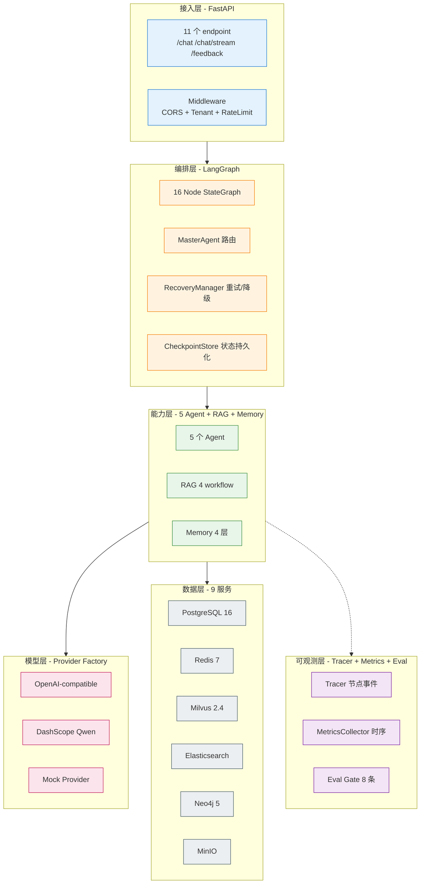
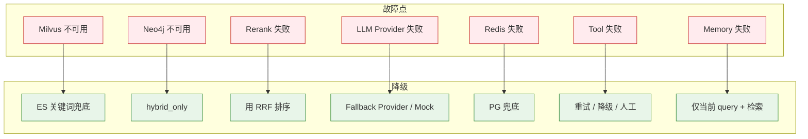
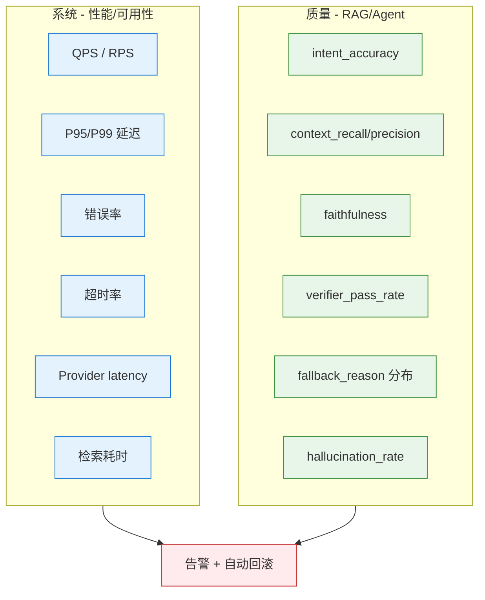

# 工程化与稳定性

> 本主题文件存放在 `technical_deep_dive/主题/`，允许题目与其他主题重复。

## 结合项目的详细说明

项目的工程化目标是让 RAG/Agent 系统从 demo 变成可运行、可观测、可扩展、可恢复、可评估的服务。核心不是把 Milvus、Redis、PostgreSQL、Elasticsearch、Neo4j 都接上，而是每个组件都有清晰职责、降级路径和监控指标。系统部署可以分为接入层、编排层、能力层、模型层、数据层和可观测层。

接入层用 FastAPI 承接请求，注入 tenant_id、user_id、session_id、trace_id 等上下文。企业场景必须做租户隔离和权限控制，不能只依赖前端传参。API 层尽量无状态，状态外置到 Redis/PostgreSQL/CheckpointStore，这样服务可以水平扩展，实例挂掉后不会丢失会话和任务状态。

编排层用 LangGraph。StateGraph 固定主流程，条件边控制路由，RecoveryManager 处理失败，CheckpointStore 保存任务状态。这样每个请求都可以追踪到经历了哪些节点、每个节点耗时多少、失败在哪里、是否重试或降级。相比自由 Agent 循环，LangGraph 更适合生产排障和稳定性控制。

能力层包括 RAG、Deep Intent、Tool Agent、Verifier、Memory、ContextManager。每个能力都有单独测试和降级策略：检索失败可降级到关键词；GraphRAG 失败不影响 hybrid retrieval；工具失败可重试或人工兜底；Verifier 失败不会直接阻断服务，但会降低置信或触发谨慎回答；Memory 失败不应导致主问答不可用。

模型层通过 Provider 抽象屏蔽 OpenAI-compatible/vLLM/Ollama、DashScope 和 MockProvider。这样可以根据环境选择模型，也可以在真实 provider 不可用时降级。成本和延迟优化靠模型路由、缓存、Top-K 控制、Prompt token budget、并行检索和超时策略。不是所有节点都要调用最强模型，意图识别和格式修复可以优先走规则或小模型。

数据层包括 PostgreSQL、Redis、Milvus、Elasticsearch、MinIO、Neo4j。PostgreSQL 保存 canonical 数据，如用户、会话摘要、消息、长期记忆、日志；Redis 做短期缓存、会话窗口和 checkpoint；Milvus 做向量检索；Elasticsearch 做关键词检索；Neo4j 做实体关系和多跳；MinIO 做对象存储。每个数据源都要明确是否是主存、缓存还是增强信号，否则故障时不知道怎么降级。

可观测性覆盖日志、trace、metrics 和 eval。Tracer 记录 LangGraph 节点事件，Prometheus/Grafana 监控 QPS、延迟、错误率、检索耗时、provider latency、fallback rate、verifier failure。Eval Gate 用固定数据集防止质量回归。工程化稳定性不仅是服务不宕机，也包括答案质量不无声退化。

高并发下的关键是并行、缓存和限流。检索可以向量、关键词、图谱并行；Provider 调用设置超时和熔断；热点 query 可以语义缓存；长上下文要控制 Top-K 和 token；工具调用要有限流和队列；写入日志、反馈和长期记忆可以异步化。对用户来说，宁可返回谨慎的降级答案，也不要无限等待。

面试时可以强调：这个项目的稳定性不是某个组件"高可用"，而是链路级韧性。每个节点都要回答三个问题：失败怎么办、如何观测、如何评估是否变差。只有这三点都具备，RAG/Agent 才算工程化落地。


### 具体设计和追问点

稳定性设计可以从"链路降级矩阵"讲。RAG 检索失败不等于整个系统失败，向量库失败可退关键词，图谱失败可退 hybrid，rerank 失败可用 RRF 原始排序，LLM 失败可切 provider，工具失败可重试或人工兜底，Memory 失败可只用当前 query 和检索证据回答。每个节点都要有失败出口。

| 故障点 | 降级策略 | 用户体验 |
|---|---|---|
| Milvus 不可用 | ES/BM25 + 内存关键词兜底 | 召回可能变窄，但服务可用 |
| Neo4j 不可用 | hybrid_only | 多跳能力下降 |
| Rerank 失败 | 使用 RRF 排序 | 精排下降 |
| LLM provider 失败 | fallback provider / Mock | 质量或能力下降 |
| Redis 失败 | PG message/session 兜底 | 短期性能下降 |
| Tool 失败 | 重试/降级/人工 | 动态能力下降 |

可观测要覆盖质量和系统两类指标。系统指标包括 QPS、P95/P99、错误率、超时率、provider latency、检索耗时；质量指标包括 intent accuracy、context recall、faithfulness、verifier pass rate、fallback reason 分布。只监控 CPU/内存是不够的，因为 RAG/Agent 最大风险是质量无声退化。

工程化还包括配置管理。检索 Top-K、RRF 参数、rerank 开关、provider、Prompt version、工具风险等级、token budget 都应该可配置和可回滚。生产系统最怕把这些写死在代码里，导致线上调优必须发版。


### 流程图

#### 1. 6 层工程化部署架构



#### 2. 7 节点故障降级矩阵



#### 3. 可观测 2 类指标（系统 + 质量）



### 易误会点（10 条）

**易误会点 1：稳定性 ≠ 某个组件高可用**

是**链路级韧性**——每个节点都要回答：失败怎么办、如何观测、如何评估。

**易误会点 2：只监控 CPU/内存不够**

RAG/Agent 最大风险是**质量无声退化**。必须同时监控**质量指标**（faithfulness、context_recall、verifier pass rate）。

**易误会点 3：故障降级 ≠ 自由决策**

降级路径是**预先定义**的，不是动态决策。避免"降级失败再降级"的连锁反应。

**易误会点 4：Provider Factory ≠ 多 LLM 自动切换**

是**降级链**（按顺序试），不是**负载均衡**（按权重分）。

**易误会点 5：可观测 ≠ 日志**

| 维度 | 日志 | 可观测 |
|------|------|--------|
| 目的 | 记录事件 | 理解系统行为 |
| 形态 | 文本行 | 结构化事件 + 指标 + 链路 |
| 告警 | 不擅长 | 核心能力 |

**易误会点 6：Tracing 不是 OpenTelemetry 的专属**

项目默认**不启用 OTel**，用自研 JSONL + Prometheus。OTel 是可选导出器，**不是默认实现**。

**易误会点 7：高并发下不是"加机器就完事"**

需要：
- 检索并行（多路 + gather）
- 缓存（语义缓存）
- 限流（租户级）
- 异步化（写日志、长期记忆）

**易误会点 8：State 不外置 = 水平扩展失败**

API 层必须无状态，状态外置到 Redis/PG/Checkpoint。**否则挂一台丢一片**。

**易误会点 9：可配置 ≠ 配置中心**

项目的可配置：
- 检索 Top-K
- RRF 参数
- rerank 开关
- provider
- Prompt version
- 工具 tier
- token budget

**但不是 Nacos/Apollo 等配置中心**，是 .env + 环境变量。

**易误会点 10：Harness 自动回滚 ≠ 立即回滚**

```
指标超阈值 → 告警 → 等待 5min（确认非抖动）→ 触发回滚
```

阈值校准有 3 个置信级别（low/medium/high）。

### 常见追问 10 条

**追问 ①：链路降级怎么做？**
- 每个节点定义 fallback_type
- 5 级降级链预先定义
- RecoveryManager 决策
- 不允许运行时动态判断

**追问 ②：可观测 3 大支柱是什么？**
- Tracer（链路）
- Metrics（时序）
- Logger（日志）
- + Eval（评估）

**追问 ③：怎么监控质量退化？**
- 实时指标：faithfulness、verifier_pass_rate
- 抽样审核 trace
- A/B 测试对比

**追问 ④：告警阈值怎么设？**
- 业务 SLA 倒推
- 历史 + 容忍带
- 自动校准（ThresholdCalibrator）
- 3 个置信级别

**追问 ⑤：LangGraph checkpoint vs 业务状态？**
- LangGraph Checkpoint：节点状态恢复
- 业务状态：PostgreSQL 持久化
- 两者独立，都需要

**追问 ⑥：9 个服务都跑吗？**
- 必选：PG / Redis
- 强烈推荐：Milvus / ES
- 可选：Neo4j / MinIO / OTel / Prometheus / Grafana

**追问 ⑦：Harness 是什么？**
- AI 交付工程体系
- 5 子系统：离线评估 / 在线反馈 / 自动回滚 / 失败沉淀 / Eval Gate
- 不是"加 GitHub Actions"

**追问 ⑧：怎么验证降级真的工作？**
- 故障注入演练
- 杀掉 Milvus → 看是否降级到 ES
- 杀 LLM → 看 fallback provider
- 杀 Rerank → 看是否用 RRF 截断

**追问 ⑨：性能瓶颈怎么定位？**
- p95 latency 高 → Tracer 看慢节点
- error rate 高 → 找异常节点
- fallback 高 → 找单点故障

**追问 ⑩：state 持久化和 checkpoint 区别？**
- Checkpoint：LangGraph 自动存，**任务执行中间态**
- State persistence：业务层存，**跨请求的状态**
- 两者解耦，不冲突

## 匹配到的题目（65 道）

### 1. Agent 评估体系包含哪些核心维度？如何量化衡量Planning能力与Hallucination Rate )？ [来源:01_RAG核心链路.md | 重要性:S]

**结合项目回答评分：** 10/10（匹配置信度 100/100）

**结合项目的回答：**

结合项目回答：项目采用 80% Workflow + 20% Agent 的混合架构。LangGraph StateGraph 定义 16 个节点和条件边，保证主流程可控；Router/Deep Intent、Knowledge Agent、Tool Agent、Verifier Agent 在关键节点做动态决策。这样既能避免纯 Agent 的不可控和死循环，又保留了根据中间结果选择检索策略、工具调用、答案校验和失败恢复的灵活性。

**完美答案：**

Agent评估比单纯的RAG评估复杂得多，因为Agent涉及多步推理、工具调用、动态决策，失败可能在任何中间环节发生。

**核心评估维度：**

维度一：任务完成率（Task Success Rate）。最顶层的指标——Agent最终是否达成了用户的目标。对于有确定答案的任务（如"查一下合同A的签署日期"），对比实际输出与标准答案是否一致。对于开放式任务（如"帮我写一份项目总结"），用人机评估判断是否满足需求。任务完成率是所有评估的基础——Plan再好、工具用得再对，最终没完成任务就是失败。

维度二：Planning能力。评估Agent分解任务、规划执行步骤的能力：
- 步骤合理性：分解的子任务是否覆盖了原始任务的所有必要方面，是否存在多余或遗漏的步骤
- 工具选择正确性：每一步选择的工具是否是最合适的（如该用搜索的时候有没有用搜索、该用计算器的时候有没有用计算器）
- 执行顺序最优性：子任务的执行顺序是否高效（如先做过滤再搜索vs先搜索再过滤）
- 错误恢复能力：中途出错后是否能识别问题并调整策略，而不是重复无效操作或直接放弃

维度三：Tool Use准确性。Agent调用工具的质量：
- 调用格式正确率：输出是否符合工具要求的JSON Schema/函数签名
- 参数准确率：工具参数值是否合理（如检索query是否有意义、文件路径是否正确）
- 结果利用能力：获取工具返回后是否正确理解并利用结果推进任务

维度四：安全性。包括幻觉率、有害输出检测、权限越界检测等。

**Planning能力的量化衡量：**

- 步骤效率比 = 最优步骤数 / 实际执行步骤数。最优步骤数由人工标注（或专家Agent标注）确定，比值越接近1说明Planning越高效
- 工具调用成功率 = 成功执行的工具调用次数 / 总工具调用次数
- 任务拆解覆盖率 = 覆盖的必需要素 / 所有必需要素（需人工标注每个任务的必需要素列表）
- Replan触发准确率 = Agent在遇到错误时正确触发重新规划的次数 / 应该触发重新规划的次数

**Hallucination Rate的量化衡量：**

与RAG场景类似但更复杂——Agent的幻觉可能出现在中间推理步骤、工具调用的参数、以及最终回答中。衡量方法：
- 声明拆解：将Agent的最终输出和关键中间步骤拆解为独立的factual claims
- 证据溯源：对每个claim，在Agent的上下文（检索结果、工具返回、前置推理）中查找支撑证据
- 幻觉判定：找不到证据支撑的claim标记为幻觉
- Hallucination Rate = 幻觉声明数 / 总声明数

Agent幻觉的难点在于：有时Agent的推理链中某一步是"合理推断"，严格说是幻觉但逻辑上是合理的。需要定义评判标准（严格匹配 vs 合理推断），不同场景容忍度不同。

**评估的实施方式：**

离线Benchmark评估：构建覆盖不同任务类型（信息查询、推理分析、多步操作）的测试集，每个案例标注标准答案、预期步骤、关键中间状态。自动化运行Agent后在Benchmark上统计各维度指标。

在线监控：采样线上流量，异步评估任务完成率、工具调用成功率、用户行为信号（任务中断率、追问率、满意度评分）。

Human-in-the-loop抽检：每周人工抽检20~50条Agent执行全过程（含中间步骤），做详细质量审计。

---

---

### 2. Agent生产事故如何排查？ [来源:01_RAG核心链路.md | 重要性:A]

**结合项目回答评分：** 10/10（匹配置信度 100/100）

**结合项目的回答：**

结合项目回答：项目采用 80% Workflow + 20% Agent 的混合架构。LangGraph StateGraph 定义 16 个节点和条件边，保证主流程可控；Router/Deep Intent、Knowledge Agent、Tool Agent、Verifier Agent 在关键节点做动态决策。这样既能避免纯 Agent 的不可控和死循环，又保留了根据中间结果选择检索策略、工具调用、答案校验和失败恢复的灵活性。

**完美答案：**

**排障金字塔
```text
   L1 用户报告：用户反馈"Agent不回复了/回复很慢/回复错误"
   → L2 链路追踪：分布式Trace ID串联全链路（API网关→Agent服务→LLM→工具调用→返回）
   → L3 定位根因：
       - API超时？→检查LLM provider状态/token限制/网络延迟
       - 字符编码？→Emoji/特殊字符导致JSON解析失败→加异常捕获+fallback
       - 死循环？→ReAct步数监控>20步报警→强制终止并返回现有结果
       - 工具异常？→工具返回状态码/报错日志→定位工具侧问题
   → L4 修复+回归测试：修复后在staging环境回归后再上线
   ```

   **关键工具链OpenTelemetry(分布式Trace)+Prometheus(指标)+ELK(日志)+Grafana(看板)。

---

---

### 3. Claude Code / Cursor 上下文压缩怎么实现？ [来源:01_RAG核心链路.md | 重要性:A]

**结合项目回答评分：** 10/10（匹配置信度 100/100）

**结合项目的回答：**

结合项目回答：上下文管理由 ContextManager、TokenBudget、CitationManager 和 PromptBuilder 完成。Token 预算按优先级分配：用户问题最高，其次是检索文档、工具结果、会话摘要和历史消息；Prompt 组装时优先放高分、高置信来源，并给每个 Chunk 明确编号和边界。

**完美答案：**

**核心问题项目有1000个文件，LLM上下文窗口只有200K tokens，不可能全塞进去。

   **解决方案——分层压缩```
   L1 项目结构摘要（永远保留）：目录树 + 关键模块描述（~500 tokens）
   L2 当前任务相关文件（全量）：正在编辑的文件全文 + 依赖链文件关键段（~50K tokens）
   L3 历史对话摘要（压缩）：每5轮对话LLM压缩成结构化摘要（~2K tokens）
   L4 代码变更摘要（增量注入）：变更历史摘要（~1K tokens）
   ```

   **渐进式披露Agent先看L1决定找什么→需要具体文件时再去L2检索→不再需要的从上下文移除。关键不是"塞得越多越好"，而是"只在需要时才加载"。

   **面试话术"上下文压缩的精髓是'分层缓存+按需加载'——不是压缩算法本身，而是决定'什么时候加载什么'的策略。这跟RAG的检索思想是一致的：不要把整个知识库塞进Prompt，检索最相关的注入。"

---

---

### 4. Embedding 召回优化策略：如何提高召回效果和模型效率？ [来源:01_RAG核心链路.md | 重要性:A]

**结合项目回答评分：** 10/10（匹配置信度 100/100）

**结合项目的回答：**

结合项目回答：Embedding 层使用 BGE-M3，理由是中英双语、1024 维表达能力、dense/sparse/ColBERT 多表示能力和本地部署成本可控。工程上封装为 EmbeddingProvider，模型不可用时降级到 Mock/RandomEmbeddingProvider；召回优化还依赖 BM25 精确匹配、Milvus 语义召回和 RRF 融合。

**完美答案：**

Embedding召回优化从两个维度展开——召回效果（能不能找到正确答案）和模型效率（多快、多省钱）。

**召回效果提升：**

第一层是模型层优化。选型上优先选业务领域匹配的模型（中文选BGE/GTE，中英混合选bge-m3/E5），在自有评测集上跑Recall@K对比。如果通用模型效果不够，考虑在业务数据上微调Embedding模型——用对比学习（InfoNCE Loss）+ 业务相关的正负样本对（query-relevant_doc），通常2000~5000条高质量对就能看到明显效果。微调关键是Hard Negative Mining——找那些"看起来相关但实际不相关"的迷惑性负样本。

第二层是索引层优化。Chunk策略直接影响Embedding质量——Chunk太大主题混杂导致向量模糊，太小上下文不全导致语义丢失。Hybrid Search（向量+BM25）互补覆盖精确匹配和语义匹配。元数据过滤在检索时下推（tenant_id、文档类型、时间范围），减少无关向量参与计算。

第三层是查询层优化。Query Rewrite把用户口语化/多轮对话中的残缺query改写为独立完整的检索query。HyDE（Hypothetical Document Embedding）先生成一个假设答案再拿假设答案去检索，有时比直接用query检索效果好。多路并行检索——原始query+改写query+HyDE生成的假设答案，三路结果RRF融合。

**模型效率提升：**

量化：FP16→INT8量化，显存和推理延迟大幅降低，精度损失通常<1%。通过ONNX Runtime或TensorRT做推理加速。知识蒸馏：用大Embedding模型当teacher训练小模型，小模型推理快但精度接近大模型。缓存热门query的embedding向量，避免重复推理。批量处理：离线建索引时batch推理最大化GPU利用率，在线服务控制batch size平衡延迟和吞吐。

**典型优化路径：** baseline（通用模型+基本Chunk）→换领域适配模型→微调Embedding→加混合检索→加Query Rewrite→加Rerank。每一步都在评测集上验证Recall@5变化，用数据驱动决策。

---

---

### 5. GraphRAG和传统RAG的区别？什么场景用GraphRAG？ [来源:01_RAG核心链路.md | 重要性:A]

**结合项目回答评分：** 10/10（匹配置信度 100/100）

**结合项目的回答：**

结合项目回答：GraphRAG 是混合检索的一路增强信号。传统 RAG 负责快速找语义相关 Chunk，GraphRAG 负责实体关系、多跳依赖和全局结构理解；Neo4j 或图检索失败是非致命的，RetrievalRouter 会降级到 hybrid_only 或 keyword_vector_only。

**完美答案：**

| 维度 | 传统RAG | GraphRAG |
   |------|---------|----------|
   | 知识组织 | 独立向量Chunk | 向量Chunk + 知识图谱（实体+关系） |
   | 检索方式 | Query→向量ANN→Top-K Chunk | Query→实体识别→图遍历找邻居+向量检索Chunk |
   | 多跳推理 | 弱（Chunk间无关） | 强（沿着关系路径推理） |
   | 全局理解 | 弱（只能看检索到的片段） | 强（Community摘要支持总结） |
   | 构建成本 | 低 | 高（需LLM提取实体关系→建图） |

   **GraphRAG适用场景判断标准```
   是否需要多跳推理？
     ├─"A公司和B公司在供应链上的关系" → 图遍历实体间关系 → GraphRAG
     ├─"X药物治疗Y病的副作用机制" → 实体关联多步推理 → GraphRAG
     └─"RAG的定义是什么" → 单文档片段够 → 传统RAG
   是否需要全局总结？
     ├─"整个财报的核心趋势是什么" → 需要Community摘要 → GraphRAG
     └─"财报第3页说了什么" → 特定片段 → 传统RAG
   ```

   **面试话术"GraphRAG不是替代传统RAG，而是互补——80%的FAQ用传统RAG（快+便宜），20%的复杂分析问题走GraphRAG（多跳推理+全局理解）。实际项目中先传统RAG快速上线，再逐步引入GraphRAG覆盖复杂case。"

---

---

### 6. Long Context 模型（如 Gemini 1.5 的 1M token）在实际使用中效果怎么样？ [来源:01_RAG核心链路.md | 重要性:A]

**结合项目回答评分：** 10/10（匹配置信度 92/100）

**结合项目的回答：**

结合项目回答：上下文管理由 ContextManager、TokenBudget、CitationManager 和 PromptBuilder 完成。Token 预算按优先级分配：用户问题最高，其次是检索文档、工具结果、会话摘要和历史消息；Prompt 组装时优先放高分、高置信来源，并给每个 Chunk 明确编号和边界。

**完美答案：**

我测试过 Gemini 1.5 Pro 的长上下文能力，坦白说感觉是"能用但还没到理想状态"。做 Needle-in-a-Haystack 测试（在长文档中藏一个事实然后问相关问题），在 128K 以内准确率很高，接近 100%；到了 500K 以上准确率开始下降；到了 1M 附近，如果"needle"是非常具体的事实（如一个数字或日期），模型有时找不到或者找到后没有正确运用。另外延迟是很大的实际阻碍——塞满 1M token 的 Prefill 可能需要几十秒甚至更长，对在线服务来说基本不可用。还有一个隐性问题是成本——每次请求消耗 1M token 的输入，API 费用很高。所以我的结论是：Long Context 适合离线或准离线的长文档分析任务（半天跑一次的报告分析、文档审查），但不适合做实时 RAG 的替代方案。它不是 RAG 的"接班人"，更像是 RAG 在特定场景下的"合作伙伴"——RAG 做粗筛，Long Context 做深度分析。

---

---

### 7. RAG从文档入库到回答的完整链路？ [来源:01_RAG核心链路.md | 重要性:S]

**结合项目回答评分：** 10/10（匹配置信度 100/100）

**结合项目的回答：**

结合项目回答：离线索引链路是文档加载/解析 → 清洗预处理 → Chunk 切分 → BGE-M3 向量化 → MinIO 保存原文 → Milvus 写向量 → Elasticsearch 写关键词索引。每个 Chunk 携带 source、section、doc_type、更新时间等元数据。更新策略是实时增量 + 定时重建兜底；索引异常时检索链路还能从 hybrid 降级到 keyword/vector only。

**完美答案：**
```
   离线：原始文档→格式解析(PDF/Word/MD)→清洗(去噪/格式统一)→Chunking→Embedding→向量库+ES双写
   在线：用户Query→意图识别→Query改写→并行向量检索(BM25)+关键词检索(ES)→RRF融合Top-50→Cross-Encoder Rerank→Top-5→拼Prompt→LLM生成→引用标注→SSE流式返回
   ```
   每个环节都有监控埋点和降级方案。例如Rerank超时→跳过直接用向量排序结果兜底。

---

---

### 8. RAG延迟优化方案：从Embedding到生成的每个阶段如何降延迟？ [来源:01_RAG核心链路.md | 重要性:A]

**结合项目回答评分：** 10/10（匹配置信度 100/100）

**结合项目的回答：**

结合项目回答：Embedding 层使用 BGE-M3，理由是中英双语、1024 维表达能力、dense/sparse/ColBERT 多表示能力和本地部署成本可控。工程上封装为 EmbeddingProvider，模型不可用时降级到 Mock/RandomEmbeddingProvider；召回优化还依赖 BM25 精确匹配、Milvus 语义召回和 RRF 融合。

**完美答案：**

| 阶段 | 原始延迟 | 优化手段 | 优化后 |
   |------|---------|---------|--------|
   | Query Embedding | 50ms | ONNX Runtime + FP16→INT8量化 | 15ms |
   | BM25检索 | 10ms | ES优化索引分片 | 5ms |
   | 向量检索(HNSW) | 20ms | ef参数调优+减少候选数 | 8ms |
   | Rerank | 100ms | Cross-Encoder(qwen3-reranker-0.6b via Ollama)+批量推理(batch_size=20) | 30ms |
   | LLM首Token | 500ms | Prompt Caching + 量化推理 | 200ms |
   | LLM生成(200t) | 2000ms | 流式SSE(边生成边展示) | 感知延迟→200ms |
   | **总计** | **~2680ms** | | **感知~500ms** |

   **关键认知用户感知延迟≠实际总延迟。SSE流式输出让用户看到首token就开始消费内容，心理上接受了等待。

---

---

### 9. RAG项目中有没有参与大模型微调？微调全链路？ [来源:01_RAG核心链路.md | 重要性:S]

**结合项目回答评分：** 8/10（匹配置信度 76/100）

**结合项目的回答：**

结合项目回答：这题可以落到项目的工程化闭环：FastAPI + LangGraph + RAG + 工具 + 记忆 + 评估闭环；关键能力都有可观测和降级路径；面试时映射到 Milvus/ES 混合检索、Provider 抽象、TokenBudget、Verifier、Data Flywheel 等项目实现。

**完美答案：**

微调全链路：数据构建→LoRA训练→评估→量化部署。面试要诚实——没做过就说没做过，但说清楚原理和你理解的全链路各阶段关键技术。

---

---

### 10. 了解上下文压缩机制吗？ [来源:01_RAG核心链路.md | 重要性:A]

**结合项目回答评分：** 10/10（匹配置信度 100/100）

**结合项目的回答：**

结合项目回答：上下文管理由 ContextManager、TokenBudget、CitationManager 和 PromptBuilder 完成。Token 预算按优先级分配：用户问题最高，其次是检索文档、工具结果、会话摘要和历史消息；Prompt 组装时优先放高分、高置信来源，并给每个 Chunk 明确编号和边界。

**完美答案：**

**为什么需要上下文压缩：**

Rerank解决了"20个候选Chunk中选哪些喂给LLM"的问题，但选了5个Chunk直接拼接仍然存在问题。首先，每个Chunk通常有300~512 tokens，5个Chunk就是1500~2560 tokens，其中大量句子与当前query并非直接相关——一个Chunk可能前半段讲"产品概述"（相关），后半段讲"历史版本"（不相关），全部塞进去浪费token。其次，无关内容成为噪声，稀释了关键信息的注意力（Lost in Middle效应加剧）。第三，大块文本拼接导致LLM难以精确回溯"这段信息来自哪个具体位置"，降低了引用的可解释性。

**三种主流压缩方式：**

方式一：关键句抽取（Sentence-level Filtering）。核心思路是把压缩粒度从Chunk级降到句子级。对Rerank后的Top-K Chunk中的每个句子，用轻量级相关性打分（基于query关键词命中、或者用轻量Cross-Encoder给每个句子打分），每个Chunk只保留得分最高的2~3个关键句。保留的句子拼接时加上`[文档1]`来源标记。优点是实现简单、可解释性强、token节省通常50%~70%；缺点是关键词打分的规则较粗糙，复杂语义下可能漏掉重要句子。

方式二：摘要压缩（Summarization-based Compression）。用轻量LLM（如Qwen2-1.5B或API小模型）对每个Chunk做单行摘要，只保留与原始query最相关的一个要点。摘要后的结果比关键句更精炼，但多了一次LLM调用（增加延迟和成本）。适合对token成本极其敏感或上下文窗口很紧张的场景。

方式三：结构化压缩（Structured Compression）。将多条检索结果按"来源+编号+要点"的格式重新组织。例如：将3个Chunk压缩为`[来源1-合同管理规范] 第3.2条: 报销上限5000元；[来源2-财务制度] 第5.1条: 需部门经理审批`。这种格式LLM非常熟悉（类似结构化文档的摘要），信息密度极高。

**压缩效果的量化和权衡：**

一个典型benchmark：5个Chunk原始拼接2560 tokens→关键句抽取压缩后~800 tokens（节省69%），生成质量在大部分场景下不降反升（因为噪声少了），延迟相近（少了token但多了压缩步骤）。不是所有场景都适合压缩——对于简单事实查询（答案就在某一个Chunk的第一句话），压缩可能过度导致信息丢失。最佳实践是：根据query复杂度动态决定是否压缩以及压缩程度。

---

---

### 11. 什么场景必须从RAG升级到GraphRAG？决策标准是什么？ [来源:01_RAG核心链路.md | 重要性:A]

**结合项目回答评分：** 10/10（匹配置信度 100/100）

**结合项目的回答：**

结合项目回答：GraphRAG 是混合检索的一路增强信号。传统 RAG 负责快速找语义相关 Chunk，GraphRAG 负责实体关系、多跳依赖和全局结构理解；Neo4j 或图检索失败是非致命的，RetrievalRouter 会降级到 hybrid_only 或 keyword_vector_only。

**完美答案：**

从传统RAG升级到GraphRAG不是技术升级，而是业务需求驱动的架构演进。关键是要有一个清晰的决策框架，而不是"觉得GraphRAG很酷就上"。

**决策标准一：多跳推理的需求量**

核心问题是——你的系统中有多大比例的用户query需要跨越多个文档/实体进行推理才能回答？传统RAG是"一跳"检索（一次向量检索返回Top-K Chunk），对于"A公司和B公司的合作关系"、"这个药物通过什么通路作用于那个靶点"、"这份合同引用了哪些法规、法规的最新版本是什么"这类需要串联多个实体的问题力不从心。

量化标准：分析线上用户query，标注出需要多跳推理的比例。如果多跳query占比<10%，成本收益不支持GraphRAG；如果占比10%~20%，可以先尝试多跳检索（Agent迭代检索）补丁方案；如果占比>20%且是核心业务场景（如金融分析、法律检索、医药研究），GraphRAG的图遍历能力才有投入价值。

**决策标准二：全局理解的需求**

传统RAG只能看到检索到的几个Chunk，视角是局部的。GraphRAG通过Community检测和摘要，能提供"整个知识库的主题分布"、"某领域的全貌总结"等宏观视角。如果你的用户经常问"公司所有产品线的共同技术路线是什么"、"这个行业链的整体格局如何"，全局理解是刚需；如果用户主要问"产品A的价格是多少"、"怎么配置VPN"，局部Chunk足够。

**决策标准三：实体关系是否为知识核心组织形式**

有些领域的知识天然是图状的——法律（法条之间的引用和继承关系）、医药（药物-靶点-通路-疾病的关系网络）、金融（公司-供应链-投资-竞争的关联网络）、学术（论文之间的引用关系链）。在这些领域，用向量检索去匹配实体间的间接关系，效果远不如在图谱上直接做图遍历+路径推理。如果实体关系信息在你的知识库中密度很低（如FAQ类知识库），GraphRAG的ROI很低。

**渐进式升级路径：**

不是0到1的跳跃，而是渐进式演进：
1. 先上传统RAG（向量+BM25+Rerank），快速产出价值
2. 收集线上bad case，重点分析哪些case是因为"单次检索无法覆盖跨文档关联"导致的失败
3. 评估这类case的占比和业务影响
4. 如果占比>20%且影响核心业务指标，启动GraphRAG PoC——选取一个子领域的文档先建图验证效果
5. PoC验证有效后逐步扩大覆盖范围

这种方式避免了"花三个月建全量知识图谱，上线发现80%的query根本用不到"的尴尬。

---

---

### 12. 什么场景需要GraphRAG？ [来源:01_RAG核心链路.md | 重要性:A]

**结合项目回答评分：** 10/10（匹配置信度 100/100）

**结合项目的回答：**

结合项目回答：GraphRAG 是混合检索的一路增强信号。传统 RAG 负责快速找语义相关 Chunk，GraphRAG 负责实体关系、多跳依赖和全局结构理解；Neo4j 或图检索失败是非致命的，RetrievalRouter 会降级到 hybrid_only 或 keyword_vector_only。

**完美答案：**

GraphRAG不是替代传统RAG的通用方案，而是针对特定场景的增强方案。判断一个场景是否需要GraphRAG，核心看三个信号：

**信号一：知识的结构是图谱状的**

如果知识库中的核心信息以实体和关系的形式组织，单纯的文本Chunk检索天然会丢失关系信息。典型场景：法律领域的法规引用链（法规A引用法规B、B引用C，形成关系链，查询"某条款的完整法律依据链"需要图遍历）；医药领域（药物-靶点-通路-疾病-副作用之间的多重关系，查询"某药物的作用机制和潜在风险"需要遍历关系网络）。

**信号二：用户的query是"关系型"而非"事实型"的**

如果大多数query是"XX是什么"、"XX怎么配置"，传统RAG足够。但如果出现了大量"XX和YY之间有什么关系"、"谁影响了谁"、"哪些因素共同导致了XX"这类关系型查询，GraphRAG的图遍历能力就变得必要。

**信号三：需要全局视角而非局部片段**

传统RAG给的是"与query最相关的几个Chunk"，是一个局部答案。但有些问题需要一个宏观的回答——"公司过去三年的整体发展脉络是什么"、"这个领域的研究热点演进趋势如何"。这类问题需要的不是最相关的几个片段，而是对大量文档的全局性总结和归纳。GraphRAG通过Community Detection（社区检测）将相关实体聚类，为每个社区生成摘要，提供了这种"俯瞰"能力。

**具体领域适用性：**

企业知识管理：适合。企业内跨部门文档中隐含的组织关系、项目依赖、人员关联等信息，GraphRAG能挖掘出来。

法律合规：非常适合。法条之间的引用链、判例之间的参照关系是天生的图结构。

医药研发：非常适合。靶点-通路-疾病-药物的关系网络是医药知识的核心组织方式。

金融投研：适合。公司关联、供应链网络、投资关系等都是图结构。

通用客服FAQ：不需要。FAQ是独立的问题-答案对，几乎不存在跨文档关系推理需求。

技术文档问答：部分需要。大部分技术问题单文档可答，少部分跨模块对比分析才需要图。

---

---

### 13. 向量数据库选型与索引调优 [来源:01_RAG核心链路.md | 重要性:A]

**结合项目回答评分：** 10/10（匹配置信度 94/100）

**结合项目的回答：**

结合项目回答：向量数据库选择 Milvus，是因为项目需要服务化、多集合管理、元数据过滤、多租户扩展。Milvus 存 BGE-M3 向量，配合 HNSW 做 ANN 检索；tenant、文档类型、时间等字段作为 metadata filter。规模上来后可按租户或业务域分 collection/partition。

**完美答案：**

向量数据库的选择主要看数据规模、部署方式（云托管 vs 自建）、是否需要混合检索、以及团队已有的技术栈。Milvus 适合自建且数据量大的场景，支持丰富的索引类型和分布式部署；Pinecone 是全托管云服务，开箱即用但数据出境和成本可能是问题；Elasticsearch 8.x 之后原生支持向量检索，如果团队已经有 ES，加上向量能力做混合检索是最低成本的方案。小规模场景也可以考虑 Chroma、Qdrant 这类轻量方案。

---

---

### 14. 多模态RAG（图片+文本）怎么做混合检索？ [来源:01_RAG核心链路.md | 重要性:S]

**结合项目回答评分：** 10/10（匹配置信度 100/100）

**结合项目的回答：**

结合项目回答：在线检索是 Agentic Hybrid RAG。Deep Intent/检索路由判断问题类型后，调用 Milvus 向量检索、Elasticsearch BM25/IK 中文分词检索和可选 GraphRAG；结果用 RRF 融合，再进入 Rerank 和上下文构建。检索失败有降级链：Graph 失败不影响向量+关键词，Milvus 不可用可退到 ES/内存关键词兜底。

**完美答案：**

**三种方案| 方案 | 做法 | 优点 | 缺点 | 适用 |
   |------|------|------|------|------|
   | OCR文本提取 | 图片→OCR提取文字→统一进文本RAG Pipeline | 简单、兼容现有RAG | 丢失视觉信息（图表布局、照片内容） | 扫描件、表格 |
   | 多模态Embedding | 文本用Text Embedding + 图片用CLIP/AltCLIP Embedding → 统一向量空间 | 保留视觉语义 | 向量空间对齐是难点 | 图文混合检索 |
   | 双通道融合 | 文本走文本RAG + 图片走CLIP检索 → 双路结果融合 | 灵活性最高 | 工程复杂度高 | 生产级系统 |

   **生产方案（双通道融合）```python
   # 文本检索 + 图片检索 → RRF融合
   text_results = text_rag.search(query, top_k=20)    # 文本通道
   image_results = clip_rag.search(query, top_k=10)   # 图片通道（query文本用CLIP Text Encoder）
   merged = rrf_fusion(text_results, image_results, k=60)

   # LLM生成时注入图文上下文
   context = ""
   for r in merged:
       if r.type == 'text':
           context += r.content + "\n"
       elif r.type == 'image':
           context += f"[图片描述: {r.caption}]"  # 或直接传多模态LLM（如GPT-4V）
   ```

   **面试话术"生产环境我最常用的是'双通道融合'——文本走标准RAG，图片用CLIP做向量检索（图片和文本映射到同一个768维空间），两路结果用RRF融合。如果用的是GPT-4V这种多模态LLM，生成阶段可以直接把检索到的图片作为输入。"

---

---

### 15. 多模态场景怎么评估：如何检查"图文一致性／不编造信息"？优先加哪些自动化检查？ [来源:01_RAG核心链路.md | 重要性:A]

**结合项目回答评分：** 6/10（匹配置信度 55/100）

**结合项目的回答：**

结合项目回答：这题可以落到项目的工程化闭环：FastAPI + LangGraph + RAG + 工具 + 记忆 + 评估闭环；关键能力都有可观测和降级路径；面试时映射到 Milvus/ES 混合检索、Provider 抽象、TokenBudget、Verifier、Data Flywheel 等项目实现。

**完美答案：**

**图文一致性的三个评估层次：**

层次一：描述级一致性。检查模型从图片中"看到了什么"的描述是否准确。方法：用另一个VLM（不同的模型或同一模型的不同Prompt）作为"审核员"，给它原始图片+第一个模型生成的图片描述，让其逐条判断"描述中的每个声称是否在图片中得到印证"。如果能拿到图片的Ground Truth标注（如人工标注的商品属性），则直接比对描述是否与Ground Truth一致。

层次二：引用级一致性。检查模型回答中声称"根据图片，XX为YY"是否真实。方法：将回答中所有关于图片的事实性声称提取出来（如"图中商品的颜色是红色"、"图中显示有3个按钮"），用VLM对每一条在原始图片中做针对性验证——给VLM图片+单条声称问"图片中是否确实如此？"。

层次三：推理级一致性。检查模型基于图片信息做出的推理是否合理。这一层最难自动化——模型说"这款产品适合户外运动"（基于图片中产品的设计风格推断），这种主观推断的准确性很难用自动化方式验证。目前主要靠人工抽检。

**优先加的自动化检查：**

优先级1：VLM交叉验证（低成本高频）。每次生成后，异步调用第二个VLM（或用第一个VLM的严格模式Prompt）对生成内容做事实核查。核查维度包括：描述中提到的物体是否在图片中出现、数量是否一致、颜色是否准确、文字OCR内容是否与原文一致。这是覆盖最广的自动化检查，适合全量或高比例采样。

优先级2：精确属性正则匹配。对于可以精确比对的信息（颜色值、尺寸数字、价格、数量、材质名称），用正则表达式从回答中提取，再从图片的属性数据库/OCR结果中做字符串级别的精确匹配。比如回答中说"尺寸为30×20×15cm"，正则提取三个数字后与OCR结果比对。这类检查精确度最高、误报率最低。

优先级3：置信度阈值。让VLM在输出时附带每个事实性声称的置信度。如果模型对"图片中存在XX"的置信度低于阈值，自动标记该部分回答为"待审核"，不直接展示给用户或展示时带上警告标识。

优先级4：跨模态一致性检查。如果同一场景下既有图片描述也有文本信息（如商品图+商品标题），检查两者的描述是否一致。图片描述说"红色"但标题说"酒红色"→标记为潜在不一致。

**自动化的边界和人工补充：**

自动化检查能覆盖的是"可精确比对的信息"（颜色、数量、文字OCR内容）和"相对客观的描述"（物体是否存在、结构是否准确）。无法覆盖的是"主观判断"（风格评价、氛围描述、适用场景推理）和"隐含信息"（图片中没有明确展示但可以被合理推断的内容）。这类边界case需要人工抽检补充——每周抽检50~100条线上样本做完整的人工图文一致性审核，将发现的问题反馈到自动化规则和模型优化。

---

---

### 16. 如何平衡块的大小与信息完整性？GraphRAG适用于解决哪些传统RAG难以处理的问题场景？ [来源:01_RAG核心链路.md | 重要性:A]

**结合项目回答评分：** 10/10（匹配置信度 100/100）

**结合项目的回答：**

结合项目回答：GraphRAG 是混合检索的一路增强信号。传统 RAG 负责快速找语义相关 Chunk，GraphRAG 负责实体关系、多跳依赖和全局结构理解；Neo4j 或图检索失败是非致命的，RetrievalRouter 会降级到 hybrid_only 或 keyword_vector_only。

**完美答案：**

**第一部分：Chunk大小与信息完整性的平衡**

Chunk大小是一个经典的trade-off——Chunk太小（如128 tokens），Embedding编码精度高、检索精准但单个Chunk可能缺乏完整的上下文信息（一个句子"该指标上升了15%"缺了主语和时间，单独看不懂）；Chunk太大（如1024 tokens），上下文完整但Embedding变模糊（一个Chunk包含了多个主题的混杂信息）、检索精度下降。

平衡策略不是找一个"最优大小"，而是用Parent-Child分层解决根本矛盾：检索时用小Chunk（如256 token的子片段），确保检索精度——每个小Chunk主题单一、Embedding区分度高；返回给LLM时用包含该小Chunk的Parent Chunk（如整个段落或章节），确保上下文完整。这样在同一套系统中，检索和生成各取所需——检索要精准用小的，生成要完整用大的。

其他补充策略：语义切分保证每个Chunk主题完整（在语义转折点断开，避免混入无关信息）、Overlap在边界处保留10%~20%重叠防止关键信息被切断、多粒度索引让系统根据query复杂度动态选择Chunk粒度（简单query小Chunk、复杂query大Chunk）。

**第二部分：GraphRAG解决的传统RAG难以处理的问题**

传统RAG本质上是"文档片段匹配"——把query向量和Chunk向量做相似度检索，拿最匹配的几个片段给LLM回答。这种"片段级"检索在以下三类问题上力不从心：

问题一：跨文档多跳推理。传统RAG一次检索只能拿到"和query最像的片段"，但如果答案需要串联多个文档中的信息——比如"合同A引用的法规B的最新修订版是什么"——这需要先从合同A中找到引用的法规B、再从法规库中找到B的最新版本，两次检索之间存在依赖关系。传统RAG的"一跳"无法处理这种链式推理。GraphRAG通过知识图谱的实体-关系-实体路径遍历，天然支持多跳——在图谱上从"合同A"节点沿"引用"边走到"法规B"节点，再沿"版本"边走到"最新修订版"节点。

问题二：全局性总结和分析。传统RAG能告诉你"搜索返回的结果中有什么"，但无法告诉你"整个知识库的整体情况是怎样的"。比如问"公司所有产品的共同技术特点是什么"，传统RAG最多召回8个Chunk、每个讲一个产品、LLM从这8个片段中勉强归纳；但如果有100个产品，这8个Chunk的采样根本无法代表全局。GraphRAG通过Community Detection将实体聚类、为每个社区生成摘要，提供了"俯瞰"整张图的宏观视角。

问题三：实体密集型知识的精确关联。法律、医药、金融等领域的知识以实体和关系为核心——法条之间的引用、药物和靶点的作用、公司和供应商之间的交易。传统RAG的向量相似度在这种场景下像是"用模糊匹配找精准关系"，效果不稳定。GraphRAG用图结构精确存储和查询这些关系，从"这段文字像不像你的问题"升级为"这个实体和那个实体有没有直接边"。

**面试总结：** Chunk大小不要盲调，用Parent-Child分层从根本上解耦检索精度和上下文完整性的矛盾。GraphRAG上不上的判断标准是query类型——如果关系推理型query占比显著且影响核心业务，值得投入；否则先把传统RAG做好。

---

---

### 17. 如果数据量从十万级增长到十亿级，你的向量数据库方案怎么演进？ [来源:01_RAG核心链路.md | 重要性:A]

**结合项目回答评分：** 8/10（匹配置信度 75/100）

**结合项目的回答：**

结合项目回答：向量数据库选择 Milvus，是因为项目需要服务化、多集合管理、元数据过滤、多租户扩展。Milvus 存 BGE-M3 向量，配合 HNSW 做 ANN 检索；tenant、文档类型、时间等字段作为 metadata filter。规模上来后可按租户或业务域分 collection/partition。

**完美答案：**

十万到百万级单节点 HNSW 完全够，内存撑住、延迟在几十毫秒内。到千万级，我会从单节点 HNSW 迁移到分布式部署，按业务维度做水平分片（sharding），每个分片存储一部分数据，查询时并发查所有分片再合并结果。同时引入 IVF+PQ 做索引压缩，减少单节点内存压力。到亿级甚至十亿级，就要做分层架构了。通常引入一个粗粒度筛选层——先用轻量的磁盘索引（如 DiskANN 或 IVF+SQ）快速筛出候选子集，再对候选做精细的 HNSW 或 Cross-Encoder 精排。存储层也可能需要分层，热数据（近期频繁查询的）放内存，冷数据放 SSD 甚至对象存储。这个阶段，选型上 Milvus 的分布式架构（coordinator + data node + index node）会比较合适，它原生支持这些分级策略。

---

---

### 18. 嵌入模型为什么选 BGE？FAISS 索引是如何构建的？ [来源:01_RAG核心链路.md | 重要性:A]

**结合项目回答评分：** 9/10（匹配置信度 83/100）

**结合项目的回答：**

结合项目回答：Embedding 层使用 BGE-M3，理由是中英双语、1024 维表达能力、dense/sparse/ColBERT 多表示能力和本地部署成本可控。工程上封装为 EmbeddingProvider，模型不可用时降级到 Mock/RandomEmbeddingProvider；召回优化还依赖 BM25 精确匹配、Milvus 语义召回和 RRF 融合。

**完美答案：**

**为什么选BGE：**

BGE（BAAI General Embedding）系列在中文Embedding场景下有明显的综合优势。第一，中文检索效果在C-MTEB榜单上长期领先，尤其Retrieval类任务（对RAG最关键的子任务）表现优秀。第二，模型完全开源，支持本地部署，不存在数据出境和私有化部署的合规问题。第三，模型尺寸选择丰富（bge-small/bge-base/bge-large/bge-m3），可根据GPU资源和延迟要求在精度和效率间灵活选择。第四，支持instruction微调（bge-en-icl），可以通过自然语言指令让模型关注特定维度的语义，提升泛化能力。第五，社区活跃、生态成熟，与LangChain/LlamaIndex等框架都有良好集成。

选BGE不选其他方案的具体考量：vs OpenAI Embedding——开源自部署无数据出境风险、无API调用成本；vs GTE系列——两者在中文场景效果接近，BGE社区更大、文档更完善；vs E5系列——E5在英文场景表现更好，中文场景BGE更优。

**FAISS索引构建过程：**

FAISS（Facebook AI Similarity Search）是Meta开源的向量检索库。重要认知：FAISS是库不是数据库——只负责索引构建和相似度搜索，不管持久化存储、分布式、元数据管理，这些需要自己封装。

构建流程分四步：

第一步：选择索引类型。根据数据规模和精度/速度需求选择——精确场景选IndexFlatIP（内积比较，遍历所有向量保证100%召回但速度慢O(N)），速度优先选IndexIVFFlat（K-means聚类+倒排索引，搜索时先找最近聚类中心再在聚类内搜索），速度+内存兼顾选IndexHNSW（层级图搜索，构建时建连接图、搜索时贪心遍历图）。大规模场景还可以结合乘积量化(PQ)做压缩（IndexIVFPQ），用少量内存存大量向量。

第二步：训练索引（只针对需要训练的索引类型）。IVF需要先对全部向量做K-means聚类，确定nlist个聚类中心。这一步的nlist参数很关键——太小聚类粗糙搜索慢、太大训练和内存开销大。通常nlist设为4*sqrt(N)左右。

第三步：添加向量。调用index.add(embeddings)将所有文档的Chunk向量批量加入索引。这一步批量处理效率更高。

第四步：索引持久化和加载。用faiss.write_index(index, "index.faiss")保存到磁盘，在线加载时用faiss.read_index("index.faiss")，避免每次重启重新构建。注意FAISS不存元数据（文档ID、文本内容等），需要另外维护一个映射表（向量ID→Chunk元数据），检索拿到向量ID后再去映射表查询。

在线查询：对query做Embedding编码得到query_vector，调用index.search(query_vector, k)返回top-k结果的距离和向量ID。关键参数是搜索范围——HNSW的efSearch（搜索时遍历的候选节点数），越大精度越高但速度越慢。

**面试时强调的架构要点：** FAISS适合单机场景（百万至千万级向量），数据量更大或需要分布式时考虑Milvus替代。FAISS的索引需要定期重建（新增大量文档后），可以通过增量添加（少量文档直接add）和全量重建（积累一定量后重建索引保证质量）两级策略管理。

---

---

### 19. 我们知道sft的时候尽量不要注入知识给模型，因为只希望sft可以提升模型的指令遵循的能力，注入知识的话，可能会导致后面使用的时候模型容易出现幻觉，那我们怎么确保自己选择的这1w条数据没注入知识给模型呢？ [来源:01_RAG核心链路.md | 重要性:S]

**结合项目回答评分：** 6/10（匹配置信度 58/100）

**结合项目的回答：**

结合项目回答：安全边界是多层防护。TenantMiddleware 做租户识别和权限隔离；ToolPolicy 按 safe/sensitive/dangerous 给工具分级；Executor 执行前做参数和权限校验；RAG 文档进入上下文前标记为非指令内容以防间接注入；Verifier 和输出层再做引用、安全与不确定性检查。越权或不确定请求会拒答或转人工。

**完美答案：**

SFT的核心目标是教会模型行为模式——如何遵循指令、用什么格式输出、什么时候拒绝回答、如何引用来源。如果在SFT阶段大量注入事实知识，模型会把知识"背"进参数，在后续使用中可能直接调用参数知识而非检索结果来回答，增加了幻觉风险。

**检测方法：**

方法一：知识隔离测试。选择一批模型在预训练阶段不可能学到的事实（如公司内部操作流程、虚构实体信息），填充到SFT样本的答案中。训练后问模型这些问题——如果模型能正确回答，说明SFT注入了知识。理想情况下SFT后模型应该回答"我不知道"或依赖RAG检索结果。

方法二：知识溯源检查。对每条SFT数据样本，检查答案中的事实性信息是否必须"知道某个具体事实"才能生成。知识注入型（应剔除）的例子：Q:"2024年公司Q3的营收是多少？" A:"2024年Q3营收为5.2亿元"——要求模型知道具体数字。行为模式型（应保留）的例子：Q:"根据以下参考资料回答用户问题。参考资料：[报告内容]。用户问题：Q3营收？" A:"根据参考资料显示，Q3营收为5.2亿元"——答案来自参考资料而非参数知识。

方法三：格式vs内容分离检查。判断答案是否可以替换为模板（如"根据[来源]显示，[答案]"、"无法回答，因为[原因]"）——这些是行为模板，不包含特定知识。

**过滤策略：** 去重与预训练数据重合的样本；优先选行为类数据（格式转换、指令遵循、拒绝回答、来源引用、多轮对话管理）；将知识型数据改造为RAG型数据（在Prompt中加入"参考资料"字段）；后训练验证——用一组需要特定知识但不在SFT数据中的问题测试，如果SFT后模型在"没有上下文"的情况下回答正确率显著上升，说明知识泄露了。

---

---

### 20. 现在的embedding模型有哪些问题？怎么改进？ [来源:01_RAG核心链路.md | 重要性:A]

**结合项目回答评分：** 10/10（匹配置信度 100/100）

**结合项目的回答：**

结合项目回答：Embedding 层使用 BGE-M3，理由是中英双语、1024 维表达能力、dense/sparse/ColBERT 多表示能力和本地部署成本可控。工程上封装为 EmbeddingProvider，模型不可用时降级到 Mock/RandomEmbeddingProvider；召回优化还依赖 BM25 精确匹配、Milvus 语义召回和 RRF 融合。

**完美答案：**

**问题一：长度衰减问题。** 大多数Embedding模型在512 token以内编码质量很好，但超过512 token后编码精度明显下降。即使模型号称支持8192 token输入，实际在长文本上的检索精度也远不如短文本。原因是训练时大多用短文本对，长文本-长文本的训练数据稀缺。改进方向：训练时混合不同长度的样本，做长度感知的对比学习；工程侧用Parent-Child分层（用小Chunk检索、大Chunk返回），不依赖单个Embedding编码超长文本。

**问题二：精确信息丢失。** Embedding把一段文本压缩成固定维度向量，这个压缩过程天然有损。产品型号、错误码、日期、金额、电话号码这类精确信息在向量编码中容易被"模糊化"——向量检索可能把"E40012"和"E40013"这两个完全不同的错误码当成相似。改进方向：引入Hybrid Search，用BM25/Sparse Embedding做精确关键词匹配，弥补Dense Embedding的精确信息丢失；或者使用多向量模型（如ColBERT）保留token级信息。

**问题三：多语言表现不均衡。** 很多Embedding模型在英文上表现好但在中文上明显差，或者中英混合文本处理不好。原因是训练数据语言分布不均。改进方向：选择多语言专门训练的模型（如bge-m3、multilingual-e5）；在自有数据上做多语言对比学习微调；对中英混合场景，可以用中英分别编码后融合。

**问题四：领域泛化能力差。** MTEB排行榜第一的模型在你的业务数据上可能表现平平。因为通用模型训练数据和你业务文档的领域分布差距大——通用模型可能没见过的的领域术语、缩写和表达方式。改进方向：在业务数据上微调Embedding模型（用对比学习+业务query-doc对）；使用Instructor这类支持instruction的模型，通过自然语言指令引导模型关注特定领域语义。

**问题五：query和document编码不对称。** 训练时query是短文本（一句话），document是长文本（一段/一篇），但在线推理时query编码器独立编码看不到document，document编码器独立编码看不到query，这种"双塔隔离"限制了精度上限。改进方向：用Cross-Encoder做Rerank补精排；使用ColBERT这类late interaction模型保留部分交互能力。

**问题六：无法捕捉否定和条件语义。** 传统的双塔Embedding对"哪个产品不是2024年发布的"这类否定式查询、"如果满足条件A则答案B"这类条件式查询，理解能力很弱。因为向量空间中的相似度是线性的，缺少逻辑推理能力。改进方向：配合Query理解模块（把否定/条件查询转成多步检索）；在下游用LLM做最终判断而不是完全依赖向量排序。

---

---

### 21. 知识库准确率和召回率怎么评估？有量化数据吗？ [来源:01_RAG核心链路.md | 重要性:A]

**结合项目回答评分：** 10/10（匹配置信度 98/100）

**结合项目的回答：**

结合项目回答：在线检索是 Agentic Hybrid RAG。Deep Intent/检索路由判断问题类型后，调用 Milvus 向量检索、Elasticsearch BM25/IK 中文分词检索和可选 GraphRAG；结果用 RRF 融合，再进入 Rerank 和上下文构建。检索失败有降级链：Graph 失败不影响向量+关键词，Milvus 不可用可退到 ES/内存关键词兜底。

**完美答案：**

建立Golden Set（金标集）：人工标注50-100个query，每个query标注"相关文档ID列表"作为Ground Truth。每次RAG改动后用金标集跑Recall@K——Recall@5从72%→90%的典型提升路径：Chunking调优(+8%) → 混合检索(+6%) → Rerank(+4%)。**关键是先建金标集再调优，否则等于盲调。**

---

---

### 22. 评测集需要多大规模才够？怎么平衡标注成本和覆盖度？ [来源:01_RAG核心链路.md | 重要性:S]

**结合项目回答评分：** 7/10（匹配置信度 69/100）

**结合项目的回答：**

结合项目回答：评估体系分离线和在线两条线。离线用固定 eval dataset 跑 intent accuracy、context recall、faithfulness、answer relevancy 等指标；在线收集用户反馈、失败样本和 trace，异步进入 Data Flywheel。改动上线前跑 Eval Gate 防回归。

**完美答案：**

200-500 条是一个比较合理的起点，能给出统计意义上稳定的指标对比。100 条以下评测结果波动太大（比如跑 50 条 Recall 是 83%，多跑 10 条可能就变成 79%），不足以做可靠的决策。重要的是这 200-500 条要保证覆盖多样性——不同问题类型（事实查询、推理查询、对比查询等）、不同 query 长度和表述方式、不同知识库区域（不能只测热门文档，冷门文档也要覆盖）。标注成本控制方面，我会分层处理：200 条核心评测集做人工精细标注（检索端标注我一般自己做，每条 1-3 分钟，200 条大概一天工作量），另外 300 条用 LLM 生成带人工抽检。也可以先把所有线上 query 聚成不同类别，按类别分层抽样，这样每条标注代表的不止是它自己，而是一类问题，覆盖效率更高。

---

---

### 23. 70-2. Agent 评测数据集怎么构建和持续迭代？从零到生产级的建设路径 [来源:02_Agent核心原理.md | 重要性:S]

**结合项目回答评分：** 9/10（匹配置信度 85/100）

**结合项目的回答：**

结合项目回答：项目采用 80% Workflow + 20% Agent 的混合架构。LangGraph StateGraph 定义 16 个节点和条件边，保证主流程可控；Router/Deep Intent、Knowledge Agent、Tool Agent、Verifier Agent 在关键节点做动态决策。这样既能避免纯 Agent 的不可控和死循环，又保留了根据中间结果选择检索策略、工具调用、答案校验和失败恢复的灵活性。

**完美答案：**

评测数据集不是一次性造完就固定不变的，而是要建立"采集→标注→分层→迭代"的持续流水线。从种子集起步（50-100 个典型场景），通过线上日志采样和主动挖掘持续扩充，配合分层管理（核心回归集、场景专项集、压力测试集），形成可迭代的评测基础设施。

---

---

### 24. 70-3. Agent 评测如何集成到 CI/CD 流水线？什么该跑、什么不该跑？ [来源:02_Agent核心原理.md | 重要性:S]

**结合项目回答评分：** 10/10（匹配置信度 100/100）

**结合项目的回答：**

结合项目回答：项目采用 80% Workflow + 20% Agent 的混合架构。LangGraph StateGraph 定义 16 个节点和条件边，保证主流程可控；Router/Deep Intent、Knowledge Agent、Tool Agent、Verifier Agent 在关键节点做动态决策。这样既能避免纯 Agent 的不可控和死循环，又保留了根据中间结果选择检索策略、工具调用、答案校验和失败恢复的灵活性。

**完美答案：**

不是所有评测都适合在 CI 中跑——Agent 的端到端评测耗时长、成本高，全量跑会让 CI 变成瓶颈。关键是分层触发：每次 PR 跑轻量级检查（核心回归集 50 条，10 分钟内完成）；每日定时跑全量回归；发版前跑完整验证。同时要设置评测预算门禁，防止评测本身成为成本黑洞。

---

---

### 25. Agent 做了错误的检索决策怎么办？有没有 fallback 机制？ [来源:02_Agent核心原理.md | 重要性:A]

**结合项目回答评分：** 10/10（匹配置信度 100/100）

**结合项目的回答：**

结合项目回答：项目采用 80% Workflow + 20% Agent 的混合架构。LangGraph StateGraph 定义 16 个节点和条件边，保证主流程可控；Router/Deep Intent、Knowledge Agent、Tool Agent、Verifier Agent 在关键节点做动态决策。这样既能避免纯 Agent 的不可控和死循环，又保留了根据中间结果选择检索策略、工具调用、答案校验和失败恢复的灵活性。

**完美答案：**

必须有。Agent 错误决策最常见的有两种：选错了知识库（该查产品文档的结果去查了 FAQ），或者做了一次没有必要的检索，召回了噪声文档导致生成质量下降。我的分层防护是这样：第一层是决策前的约束——在 Agent 的 system prompt 中明确各知识库的覆盖范围和适用场景，降低选错的概率。第二层是检索后的质量检查——检索回来的文档用 Rerank 模型对原始 query 打分，如果最高分都低于一个阈值（比如 0.3），说明这次检索可能方向不对，触发 fallback。fallback 策略有几种：用原始 query 再做一轮传统 RAG 检索兜底；或者让 Agent 重新思考并选其他知识库；如果连续两次检索质量都不高，就直接告诉用户"未能找到相关信息，请提供更多细节"。第三层是最终回答的自检——生成回答后让同个 LLM 做一轮"这个回答是基于上下文还是我编的"判断，如果发现编造成分太多就降级为"能力范围内的谨慎回答"。

---

---

### 26. Agent 常见失败模式与稳定性治理 [来源:02_Agent核心原理.md | 重要性:S]

**结合项目回答评分：** 10/10（匹配置信度 100/100）

**结合项目的回答：**

结合项目回答：项目采用 80% Workflow + 20% Agent 的混合架构。LangGraph StateGraph 定义 16 个节点和条件边，保证主流程可控；Router/Deep Intent、Knowledge Agent、Tool Agent、Verifier Agent 在关键节点做动态决策。这样既能避免纯 Agent 的不可控和死循环，又保留了根据中间结果选择检索策略、工具调用、答案校验和失败恢复的灵活性。

**完美答案：**

Agent 失败的根源是 LLM 的推理和决策能力不够可靠。常见失败模式包括：工具选择错误（该调 A 调了 B）、参数生成错误（调对了工具但参数不对）、陷入循环（反复执行无效操作）、过早终止（信息还不够就急着给答案）、规划偏差（步骤拆分不合理）、以及错误累积（前面步骤的小错误在后面被放大）。本质上这些都源于 LLM 的判断力有限，而 Agent 把多个判断串联起来，可靠性按乘法递减。

---

---

### 27. Agent 的 A/B 测试怎么做？和传统 A/B 有什么不同？ [来源:02_Agent核心原理.md | 重要性:A]

**结合项目回答评分：** 10/10（匹配置信度 100/100）

**结合项目的回答：**

结合项目回答：项目采用 80% Workflow + 20% Agent 的混合架构。LangGraph StateGraph 定义 16 个节点和条件边，保证主流程可控；Router/Deep Intent、Knowledge Agent、Tool Agent、Verifier Agent 在关键节点做动态决策。这样既能避免纯 Agent 的不可控和死循环，又保留了根据中间结果选择检索策略、工具调用、答案校验和失败恢复的灵活性。

**完美答案：**

Agent A/B 测试和传统 A/B 测试有两个核心差异。第一是"测量什么"不同。传统 A/B 测点击率、转化率这些比较直接的用户行为指标。Agent A/B 还需要测任务完成率、步骤效率、延迟、用户满意度这些 Agent 特有的指标。而且用户满意度很难直接从点击行为推断——你可能需要采样人工评估。第二是"波动性"不同。传统系统的 A/B 测试中，同一组用户行为相对稳定。Agent 的核心组件是 LLM，即使在相同的参数下，输出也是概率性的——今天和明天的成功率可能因为非确定性的推理路径而波动 5-10 个百分点。所以 Agent A/B 需要更长的观测期和更大的样本量才能获得统计显著性。我的做法是分层 A/B——先在小流量上跑 Agent V2（比如 5%），观测至少一周，重点看任务完成率有没有显著的负向变化（因为改善了某方面可能意外恶化了另一方面），确认没有大问题再逐步放量。

---

---

### 28. Agent 的决策路径你们是怎么做 tracing 和调试的？ [来源:02_Agent核心原理.md | 重要性:A]

**结合项目回答评分：** 10/10（匹配置信度 100/100）

**结合项目的回答：**

结合项目回答：项目采用 80% Workflow + 20% Agent 的混合架构。LangGraph StateGraph 定义 16 个节点和条件边，保证主流程可控；Router/Deep Intent、Knowledge Agent、Tool Agent、Verifier Agent 在关键节点做动态决策。这样既能避免纯 Agent 的不可控和死循环，又保留了根据中间结果选择检索策略、工具调用、答案校验和失败恢复的灵活性。

**完美答案：**

我们做了全链路日志，每次 Agent 请求都记录完整的决策轨迹：用户原始问题 → 每一轮的推理过程和工具选择 → 工具调用的入参和出参 → 是否继续执行还是终止 → 最终回答。本质上是把 Agent 的"思考过程"全部落到了日志里。

调试的时候，我会拿一个 bad case，直接看它的决策链。比如用户问"年假怎么申请"，Agent 第一步选了数据库查询工具而不是文档检索——这就错了，年假申请流程应该是文档里查的。然后我就能定位是工具描述写得不够清晰导致选错了，还是用户 query 本身有问题导致 Agent 误判了意图。

我们还做了一个可视化的 tracing 面板，把决策链画成流程图——每一步显示 Agent 的 reasoning、选了哪个工具、入参是什么、出参是什么。这个面板在我们排查线上问题的时候特别有用，比看纯日志高效得多。技术上用的是 LangSmith 的 tracing 能力，但做了一层封装让日志格式和我们的内部系统对齐。

---

---

### 29. Agentic RAG 的延迟怎么控制？用户能接受等多久？ [来源:02_Agent核心原理.md | 重要性:S]

**结合项目回答评分：** 10/10（匹配置信度 100/100）

**结合项目的回答：**

结合项目回答：项目采用 80% Workflow + 20% Agent 的混合架构。LangGraph StateGraph 定义 16 个节点和条件边，保证主流程可控；Router/Deep Intent、Knowledge Agent、Tool Agent、Verifier Agent 在关键节点做动态决策。这样既能避免纯 Agent 的不可控和死循环，又保留了根据中间结果选择检索策略、工具调用、答案校验和失败恢复的灵活性。

**完美答案：**

Agentic RAG 的延迟确实是个挑战，因为多了多次 LLM 调用和工具调用。我的控制策略分几个层面。首先设定硬上限——最大迭代轮数一般设 3 轮，超过就强制输出当前已有的最佳答案。单轮超时也要设（比如一次 LLM 调用 10 秒超时）。其次做请求分流——用户问题进来先做一个快速分类，简单问题（寒暄、常识、单次检索就能回答的）直接走传统 RAG 快捷路径，只有复杂问题才进入 Agent 循环。这个分类可以用一个很快的小模型或者规则做，延迟在 200ms 以内。关于用户接受度，对于客服场景，3-5 秒以内用户基本能接受；如果是企业内部的效率工具，5-10 秒也还可以。关键是做好 streaming 和状态反馈——用户在等的过程中看到"正在查询知识库..."、"正在分析..."这些中间状态，感受会比干等着黑屏好很多。我也会做 P95 延迟监控，如果 P95 超过 8 秒就要排查是否有异常长链。

---

---

### 30. Agent记忆系统怎么设计？ [来源:02_Agent核心原理.md | 重要性:A]

**结合项目回答评分：** 10/10（匹配置信度 100/100）

**结合项目的回答：**

结合项目回答：项目的记忆系统按四层设计。第一层是上下文窗口，由 ContextManager/PromptBuilder/TokenBudget 组装模型当前能看到的 prompt、历史消息、检索片段、工具结果和记忆片段；第二层是工作记忆，用 LangGraph AgentState 和 CheckpointStore 保存计划、步骤、中间结果、工具调用状态和重试状态；第三层是短期记忆，用 ShortTermMemory 保存当前会话最近消息，并用 SummaryMemory 压缩长会话；第四层是长期记忆，用 UserMemory、LongTermMemory、RAG 知识库和可选 Neo4j 保存跨会话偏好、项目背景、历史经验、外部知识和关系。长期记忆内部再分情节记忆和语义记忆：情节记忆记过去发生过什么，语义记忆记稳定知识、偏好和业务规则。

**完美答案：**

**四层记忆/上下文架构：**

| 层 | 存什么 | 项目实现 | 例子 |
|---|---|---|---|
| 上下文窗口 | 模型当前能直接看到的 prompt、历史消息、检索片段、工具结果、记忆片段 | ContextManager / PromptBuilder / TokenBudget | 本轮问题、最近消息、Top-K 文档、工具返回结果 |
| 工作记忆 | 当前任务执行过程中的临时状态：计划、步骤、中间结果、工具调用状态、重试状态 | LangGraph AgentState + CheckpointStore | retrieve 已执行、verify 第 1 次失败、下一步 regenerate |
| 短期记忆 | 当前会话内的多轮对话历史和会话摘要 | ShortTermMemory(Redis/PG) + SummaryMemory | 最近 N 轮对话、当前 session 的阶段性摘要 |
| 长期记忆 | 跨会话持久保存的用户偏好、项目背景、历史经验、外部知识和关系 | UserMemory + LongTermMemory + RAG 知识库 + 可选 Neo4j | 用户偏好中文回答、项目技术栈、上次做过鸿蒙 RAG 项目 |

长期记忆内部再分两类：情节记忆记"过去发生过什么"，例如用户上次问过 LangGraph、做过鸿蒙 RAG 项目、某次任务的结果；语义记忆记"稳定知识和偏好"，例如用户偏好中文回答、项目技术栈、领域知识、业务规则。

写入不是所有内容都长期保存：当前消息默认进入短期记忆；会话变长后用 SummaryMemory 压缩；只有稳定偏好、长期事实或有复用价值的历史事件，才通过 MemoryClassifier 提升到长期记忆。读取时先组装上下文窗口，再按 query 检索长期记忆，并用相关性、重要性、时间衰减做融合排序，避免无关历史污染 Prompt。

---

---

### 31. Multi-Agent 系统的延迟怎么控制？ [来源:02_Agent核心原理.md | 重要性:A]

**结合项目回答评分：** 10/10（匹配置信度 100/100）

**结合项目的回答：**

结合项目回答：项目采用 80% Workflow + 20% Agent 的混合架构。LangGraph StateGraph 定义 16 个节点和条件边，保证主流程可控；Router/Deep Intent、Knowledge Agent、Tool Agent、Verifier Agent 在关键节点做动态决策。这样既能避免纯 Agent 的不可控和死循环，又保留了根据中间结果选择检索策略、工具调用、答案校验和失败恢复的灵活性。

**完美答案：**

Multi-Agent 系统的延迟挑战比单 Agent 大得多——每个 Agent 的调用会增加端到端延迟，串行调用更是加法效应。控制策略主要有几个。第一，最大化并行度——把可以并行的 Agent 调用尽量并行化。比如前面说的评估系统中三个评估 Agent 可以同时运行，这就把串行 3X 变成了 1X（加上汇总时间）。第二，混合模型策略——不是所有 Agent 都需要用最强最慢的模型。简单的任务（如意图分类、简单格式转换）用小模型甚至传统分类器；复杂推理再用大模型。第三，设置超时和早停——比异步调用更关键的是，如果某个 Agent 在预期时间内没有完成，不无限等待，设置合理的超时后就用已有结果做 fallback。第四，流式输出——Orchestrator 可以在收集到部分 Worker 结果时就开始流式输出给用户，而不是等所有 Worker 都完成后一次性输出。这能显著改善用户的感知延迟。第五，对需要深度串行的场景，考虑是否可以降级为单 Agent——有时候一个 Agent 多迭代几次反而比多个 Agent 传一圈更快。

---

---

### 32. Parallel Tool Calling 什么时候有用？有什么限制？ [来源:02_Agent核心原理.md | 重要性:S]

**结合项目回答评分：** 9/10（匹配置信度 86/100）

**结合项目的回答：**

结合项目回答：工具调用由 ToolRegistry、ToolAgent、ToolExecutor 和 PolicyEngine 分层完成。LLM 或规则先决定工具名和参数，Executor 执行前做 schema 校验、权限检查和安全分级，敏感工具需要确认，危险工具拒绝或沙箱隔离。工具失败不会无限循环，LangGraph 节点有重试上限，失败后进入 RecoveryManager 的重试、降级或人工兜底。

**完美答案：**

Parallel Tool Calling 的核心价值是减少延迟——当多个工具调用之间没有依赖关系时，可以同时发起而不是串行等待。典型的例子是"对比北京和上海的天气"——这两个查询完全独立，并行调用比串行快一倍。或者"搜索关于新能源的三个方向"——三个搜索可以并行。限制主要有几个。第一是依赖关系——如果工具 B 的参数依赖工具 A 的返回结果，那就没法并行。第二是 token 消耗——一次生成多个工具调用，每个调用参数都在消耗 token，可能导致响应变慢。第三是准确性——同时生成多个调用时，LLM 有时会"搞混"——把该给工具 A 的参数传给了工具 B。第四是某些 LLM 平台对并行调用数量有限制（比如 OpenAI 早期版本最多并行 10 个）。我的经验是并行调用在信息收集类的场景中最有效（多个独立搜索、多个独立查询），在操作执行类的场景中要谨慎（多个文件写入、多个 API 修改可能有副作用）。

---

---

### 33. SWE-bench 上目前最好的 Agent 成功率是多少？瓶颈在哪？ [来源:02_Agent核心原理.md | 重要性:A]

**结合项目回答评分：** 10/10（匹配置信度 100/100）

**结合项目的回答：**

结合项目回答：项目采用 80% Workflow + 20% Agent 的混合架构。LangGraph StateGraph 定义 16 个节点和条件边，保证主流程可控；Router/Deep Intent、Knowledge Agent、Tool Agent、Verifier Agent 在关键节点做动态决策。这样既能避免纯 Agent 的不可控和死循环，又保留了根据中间结果选择检索策略、工具调用、答案校验和失败恢复的灵活性。

**完美答案：**

截至 2025 年中，SWE-bench Verified（经过验证、去除了有问题的测试用例的版本）上，最好的 Agent 系统成功率大约在 40%-50% 区间。不同团队的系统（Devin、Factory、Amazon Q Developer、OpenHands 等）各有差异，但整体上还没有突破 50% 大关。核心瓶颈我观察有几个。第一是"代码库理解"——SWE-bench 的 issue 往往需要理解跨文件、跨模块的复杂业务逻辑，Agent 需要在几万到几十万行代码中找到正确的位置来修改。第二是"定位准确度"——Agent 经常能找到相关文件，但改错了代码位置或改动了不该动的地方导致测试失败。第三是"隐式知识"——很多 issue 的修复依赖于对代码规范和项目约定（coding convention）的理解，这些在代码中不会显式写出来，Agent 缺乏这部分知识。第四是"多步骤修改的协调"——有的 issue 需要在多处协同修改，Agent 改了 A 处漏了 B 处。总的来说，瓶颈不在于"写代码"本身，而在于"理解应该怎么改、改哪里"。

---

---

### 34. 多Agent协同如何保证异步任务执行稳定性？ [来源:02_Agent核心原理.md | 重要性:S]

**结合项目回答评分：** 7/10（匹配置信度 68/100）

**结合项目的回答：**

结合项目回答：项目采用 80% Workflow + 20% Agent 的混合架构。LangGraph StateGraph 定义 16 个节点和条件边，保证主流程可控；Router/Deep Intent、Knowledge Agent、Tool Agent、Verifier Agent 在关键节点做动态决策。这样既能避免纯 Agent 的不可控和死循环，又保留了根据中间结果选择检索策略、工具调用、答案校验和失败恢复的灵活性。

**完美答案：**

四件套：①幂等性设计（相同任务重复执行结果一致）②超时+重试机制（3次+指数退避）③任务状态持久化（Redis/DB记录pending→running→done/failed）④死信队列（失败任务进入DLQ，人工排查后重新消费）。

---

---

### 35. 多Agent系统如何编排？遇到过死锁吗？ [来源:02_Agent核心原理.md | 重要性:S]

**结合项目回答评分：** 10/10（匹配置信度 100/100）

**结合项目的回答：**

结合项目回答：项目采用 80% Workflow + 20% Agent 的混合架构。LangGraph StateGraph 定义 16 个节点和条件边，保证主流程可控；Router/Deep Intent、Knowledge Agent、Tool Agent、Verifier Agent 在关键节点做动态决策。这样既能避免纯 Agent 的不可控和死循环，又保留了根据中间结果选择检索策略、工具调用、答案校验和失败恢复的灵活性。

**完美答案：**

**三种编排架构- **顺序编排（Pipeline）A完成→B处理→C生成，适合有固定流程的任务（如文档审核：提取→分类→总结）
   - **集中协调（Orchestrator）一个主Agent分配子任务给Worker Agent，收集结果后综合回答。适合多子问题并行
   - **自由协作（Chat）Agent之间直接对话协商，适合探索性任务但容易死锁

   **死锁经典场景Agent A等B的查询结果，B在等A的用户身份确认，两者互相等待。

   **死锁解决方案```
   1. 超时机制：每个子Agent调用设max_timeout(如30s)，超时后返回错误+已有partial结果
   2. 最大轮次限制：全局对话轮次硬上限（如20轮），超过则终止+汇聚已有结果
   3. 依赖链检测：Orchestrator构建子任务DAG，避免循环依赖
   4. 层级降级：Agent-1无响应→Agent-1-backup接手→都失败→人类接管
   ```

   **面试话术"多Agent编排我倾向用Orchestrator模式——一个主Agent做任务规划，Worker并行执行。死锁防御靠三件套：超时+最大轮次+DAG依赖检测。生产环境一定要在Orchestrator层加全局超时保护，防止整个对话无限循环。"

---

---

### 36. Prompt Caching是什么？怎么在项目中使用？ [来源:03_大模型应用工程化.md | 重要性:A]

**结合项目回答评分：** 10/10（匹配置信度 100/100）

**结合项目的回答：**

结合项目回答：Prompt 由 PromptBuilder 按 Agent 角色组装：Router Prompt 负责意图分类，Knowledge Prompt 约束基于证据回答，Verifier Prompt 负责事实和引用校验。Prompt 迭代依赖评测集和 bad case，版本变更要记录原因、目标指标和回归结果。

**完美答案：**

Prompt Caching 是 LLM 服务端提供的一项关键优化能力，可以大幅降低首 Token 延迟和 API 调用成本。

**一、Prompt Caching 原理**

LLM 推理时，Transformer 的自回归解码机制需要为每个 token 计算注意力——每生成一个新 token，都要和之前所有 token 做注意力计算。为了避免重复计算，推理引擎会把已经计算过的 prefix token 的 Key-Value 矩阵缓存下来，这就是 KV Cache。

Prompt Caching 将这个机制从"单次请求内部复用"扩展到"跨请求复用"。如果多个请求共享相同的 Prompt 前缀（比如相同的 System Prompt），服务端可以复用第一次请求计算好的 KV Cache，后续请求不需要重新计算这部分的注意力，直接从缓存中读取。效果是：首 Token 延迟降低 50%+，且这部分被缓存的 token 按更低的单价计费（通常是正常价格的 10%-25%）。

**二、适用场景**

最典型的场景是：System Prompt 固定 + 知识库 Chunk 固定 + 对话历史复用。

在 RAG 系统中，System Prompt（角色定义、回答规范）是固定的，被检索到的知识库 Chunk 在同一个 session 内也被多个轮次复用。将固定内容放在 Prompt 前面、变动内容（用户最新 query）放在后面，固定部分就可以被缓存命中。

另一个场景是多轮对话——同一个 session 的对话历史在每一轮都会被完整携带（或者做摘要后携带），这部分历史也是可以缓存的。

**三、Anthropic 的 Prompt Caching 使用方式**

Anthropic 的 API 提供了显式的缓存标记机制。在构造 messages 时，对需要缓存的内容块设置 cache_control: {"type": "ephemeral"} 标记。API 收到请求后，会为被标记的内容计算并缓存 KV Cache。

使用要点：
- 缓存的内容必须是连续的 prefix（不能中间跳过一段再缓存）
- 缓存标记最多设置几个（如 4 个），对应不同的缓存断点
- 缓存有生命周期（通常 5 分钟到 1 小时不等），过期后自动失效
- 被缓存的 token 计费方式不同：写入缓存按原价，缓存命中按折扣价（约 10%）
- 最适合缓存的是 System Prompt 和工具定义——它们在整个会话中完全不变

OpenAI 也提供了类似的自动 Prompt Caching 机制（不需要手动标记，API 自动检测重复前缀并缓存），计费逻辑类似。

**四、缓存命中率优化策略**

把稳定内容放前面。Prompt 的构造顺序决定了哪些内容可以被缓存。原则是：最稳定的内容放最前面（System Prompt、工具定义），次稳定的放中间（知识库 Chunk、Few-shot 示例），最不稳定的放最后（用户 Query、对话历史的最新几轮）。

避免在缓存内容前插入动态变量。比如不要在 System Prompt 前面加一个动态的时间戳或 request_id——这会让整个 Prompt 的 hash 每次都不同，缓存完全无法命中。如果必须在 Prompt 中包含动态信息，把它放在最后。

---

---

### 37. Prompt 日志很长、数据量很大，存储成本怎么控制？ [来源:03_大模型应用工程化.md | 重要性:A]

**结合项目回答评分：** 10/10（匹配置信度 100/100）

**结合项目的回答：**

结合项目回答：可观测性覆盖事件、Trace 和指标三层。每个 LangGraph 节点记录输入输出、耗时、路由决策、工具调用、检索结果和错误；Tracer 串起一次请求的完整链路；MetricsCollector 暴露指标到 Prometheus/Grafana。

**完美答案：**

这确实是实际生产中的大痛点。一个 RAG 场景的 Prompt 动不动几千上万 token，如果是纯文本存 Elasticsearch，存储成本涨得非常快。

第一个策略是分层存储。最近的日志（比如 7 天内）存热存储（ES/ClickHouse），用于实时排查和 dashboards；超过 7 天的迁移到冷存储（S3/对象存储，用 Parquet 格式压缩），查询成本高但存储成本低。需要时按 trace_id 加载冷数据。Parquet 对文本的列式压缩效果很好，同样的 Prompt 日志用 Parquet 存储体积能降到原来的 1/5 到 1/10。

第二个策略是采样。不是所有请求都需要完整记录 Prompt 和 Response。正常请求可以只记录元数据（trace_id、session_id、token 数、延迟等），完整 Prompt 和 Response 只在出错、用户点了踩、或者 Guardrails 拦截时才详细记录。或者按比例采样，保留完整记录的比例做离线分析用。

第三个策略是结构化存储。不要把所有内容存成一个长文本，而是把 Prompt 拆成组成部分（system prompt、用户消息、RAG 结果、对话历史）分别存储，这样同样内容（比如 system prompt 在多个请求中完全相同）可以引用而不是重复存储。Prompt Caching 的命中统计也可以和日志结合，减少冗余。

第四个策略是设置保留周期。根据业务需求定一个合理的数据保留时间，比如 debug 数据保留 30 天，聚合指标保留更久。大模型日志的边际排查价值随时间衰减很快——两周前的 Prompt 问题你基本不会再排查了。

---

---

### 38. Prompt 模板、版本管理与系统化迭代 [来源:03_大模型应用工程化.md | 重要性:A]

**结合项目回答评分：** 10/10（匹配置信度 100/100）

**结合项目的回答：**

结合项目回答：Prompt 由 PromptBuilder 按 Agent 角色组装：Router Prompt 负责意图分类，Knowledge Prompt 约束基于证据回答，Verifier Prompt 负责事实和引用校验。Prompt 迭代依赖评测集和 bad case，版本变更要记录原因、目标指标和回归结果。

**完美答案：**

Prompt 迭代最常见的问题是"凭感觉改"——改了之后感觉更好了，但没有量化验证，也没有记录改了什么、为什么改、效果如何。系统化的 Prompt 迭代需要：有评测集（能快速验证改动效果）、有版本记录（每次改动都有记录，方便回滚）、有对比分析（新旧版本的差异对比）、以及有结构化的迭代流程（先分析失败案例，再假设原因，再改 Prompt，再验证）。规模大的系统还需要 Prompt 管理平台来支持多人协作和多环境部署。

---

---

### 39. Prompt 的 A/B Test 和模型的 A/B Test，在实现上有什么区别？ [来源:03_大模型应用工程化.md | 重要性:A]

**结合项目回答评分：** 10/10（匹配置信度 100/100）

**结合项目的回答：**

结合项目回答：评估体系分离线和在线两条线。离线用固定 eval dataset 跑 intent accuracy、context recall、faithfulness、answer relevancy 等指标；在线收集用户反馈、失败样本和 trace，异步进入 Data Flywheel。改动上线前跑 Eval Gate 防回归。

**完美答案：**

Prompt 的 A/B Test 和模型的 A/B Test 在实现机制、成本和风险上有本质区别。

**一、切换成本不同**

Prompt A/B Test：可以在应用层做，不需要任何基础设施变更。同一个模型，在请求构建阶段根据分流逻辑选择 Prompt 版本 A 或 B（从配置中心或环境变量读取），改动的是一个字符串变量，切换成本极低。从实验到全量上线可以在几分钟内完成——改一个配置项就行。

模型 A/B Test：涉及不同的模型端点、不同的认证凭据、不同的 token 定价、甚至不同的请求参数集。需要同时维护两套模型连接配置，硬件上可能需要额外的 GPU 资源部署新模型。切换成本高，且从实验到全量上线需要更复杂的部署流程。如果新模型不满足要求要回退，也需要重新部署或切换配置。

**二、Prompt AB Test 更低成本更快速**

Prompt 实验的迭代速度远快于模型实验。一个 Prompt 工程师可以在一天内做 3-5 轮"改 Prompt -> 跑评测 -> 看结果"的循环，每次改动成本为零（不需要 GPU、不需要 API 调用配额变更）。

而模型实验的迭代周期长得多——切换模型可能涉及审批、采购、部署等流程，每次实验门槛高。因此 Prompt AB Test 通常作为优先尝试——先看 Prompt 能不能解决，不行再考虑换模型。

**三、模型 AB Test 需要更大样本量吗？不一定**

直觉上 Prompt 改动效果小需要大样本，模型差异大需要小样本。但实际上情况反过来的也有——如果两个模型能力接近（如 GPT-4o 和 Claude 3.5 Sonnet），差异可能需要非常大的样本量才能检测出来。而一个 Prompt 加入了一条关键约束，效果可能提升非常明显。

一般来说，模型 A/B Test 的效应量取决于两个模型能力差距：跨代模型（如 GPT-3.5 vs GPT-4）差异大，小样本够；同代竞争模型（GPT-4o vs Claude 3.5 Sonnet）差异可能很小，需要很大样本。

**四、两者可以正交实验设计**

Prompt 和模型可以同时做 A/B Test，但需要正交设计以避免混淆。比如 2x2 设计：流量分为四组——Prompt A + 模型 A、Prompt A + 模型 B、Prompt B + 模型 A、Prompt B + 模型 B。这样可以分析 Prompt 和模型的主效应以及两者的交互效应。

实际中通常不建议同时改太多变量，因为复杂度和交互效应分析成本高。一般先固定模型改 Prompt，找到最优 Prompt 后再固定 Prompt 比较模型。分步实验比同时实验更容易得出清晰结论。

**五、Prompt 变更的风险更可控**

Prompt 变更如果出了问题，影响范围可控——最坏情况是回答格式不对或内容质量下降，可以通过回滚配置（一键切回旧版本 Prompt）在秒级修复。对用户的影响是"回答变差了"。

模型变更如果出了问题，影响范围可能更大——不同模型的行为模式不同，可能在某些 edge case 上产生意外的不安全输出或严重的幻觉。回退成本也更高——需要重新路由流量到旧模型端点。

因此，Prompt A/B Test 适合在更高比例的流量上做、更快地迭代。模型 A/B Test 应该更谨慎：先用离线评测充分验证，再小流量（1%-5%）灰度，观察足够时间（至少一周）后再逐步放量。

---

---

### 40. SSE 和 HTTP/2 Server Push 有什么区别？ [来源:03_大模型应用工程化.md | 重要性:A]

**结合项目回答评分：** 10/10（匹配置信度 100/100）

**结合项目的回答：**

结合项目回答：前后端交互以 FastAPI REST/SSE 为主，聊天回答适合 SSE：服务端持续推送 token/事件，浏览器实现简单，断线可重连；WebSocket 更适合双向实时协作或多人状态同步。工程上要记录 trace、处理客户端断开，并在最终事件返回引用、指标和错误状态。

**完美答案：**

SSE 和 HTTP/2 Server Push 虽然都涉及"服务端推送数据"，但机制和适用场景完全不同，它们解决的是两个不同层面的问题。

**一、SSE 基于 HTTP/1.1 长连接**

SSE（Server-Sent Events）是基于 HTTP/1.1 的应用层协议。它使用标准 HTTP 连接，利用长连接（Connection: keep-alive）特性，在单个 HTTP 响应中持续发送事件流。客户端发起一个普通的 HTTP GET 请求，服务端不关闭连接，而是持续不断地通过这个连接推送数据块。

SSE 是单向数据流——数据只能从服务端流向客户端。客户端如果需要向服务端发消息（比如"停止生成"），需要另外发一个 HTTP 请求，不能通过同一个 SSE 连接发送。

SSE 依赖 HTTP/1.1 的持久连接特性，但完全不依赖 HTTP/2。在 HTTP/2 环境下 SSE 也可以运行，只是底层连接被 HTTP/2 的多路复用机制管理，应用层的 SSE 协议不变。

**二、HTTP/2 Server Push 是资源预加载优化**

HTTP/2 Server Push 是 HTTP/2 传输层的一个特性，目的是优化网页加载速度。当浏览器请求一个 HTML 页面时，服务器在返回 HTML 的同时，主动把该页面依赖的 CSS、JS、图片等静态资源也"推送"给浏览器。浏览器把这些资源缓存起来，后续解析 HTML 发现需要这些资源时直接从缓存中取，省去了网络请求的往返时间。

Server Push 推送的内容是静态的、预先存在的资源文件，不是动态实时生成的数据。推送的资源必须在请求之前就已经完整存在。

**三、两者机制完全不同**

SSE 是单向数据流——服务端持续推送动态生成的事件数据，客户端只接收。数据是逐步产生逐步推送的（如 LLM 逐 token 生成）。

HTTP/2 Server Push 是资源预加载——服务端在响应主请求时附带推送关联的静态资源，数据是预先存在的完整资源。它和请求-响应模式绑定，不是独立的持续推送通道。

SSE 的连接生命周期可以很长（分钟到小时级），Server Push 只在处理初始请求的短暂时间窗口内推送关联资源。

SSE 由客户端通过 EventSource API 主动接收和处理，开发者完全掌控数据处理逻辑。Server Push 对开发者几乎透明——浏览器自动接收并缓存，开发者无法直接在 JavaScript 中"监听"到被推送的资源。

**四、实际用途不同**

SSE 适合：LLM 流式输出、实时消息通知、股票行情推送、日志流、进度更新——特征是数据动态生成、持续推送、客户端需要逐条处理。

HTTP/2 Server Push 适合：网页性能优化——推送 CSS、JS、字体、首屏图片等关键资源，减少关键渲染路径的往返次数。

在大模型流式输出场景中，只能用 SSE（或 WebSocket），绝对不能也不应该用 Server Push。Server Push 根本没有能力推送实时逐 token 生成的动态内容。如果在 HTTP/2 环境下做流式输出，也是把 SSE 协议跑在 HTTP/2 连接上，利用 HTTP/2 的多路复用能力（多个 SSE 流可以共享一个 TCP 连接），而不是用 Server Push 机制。

---

---

### 41. Streaming 输出的工程实现有哪些注意事项（SSE、WebSocket、断流重连）？ [来源:03_大模型应用工程化.md | 重要性:S]

**结合项目回答评分：** 10/10（匹配置信度 100/100）

**结合项目的回答：**

结合项目回答：前后端交互以 FastAPI REST/SSE 为主，聊天回答适合 SSE：服务端持续推送 token/事件，浏览器实现简单，断线可重连；WebSocket 更适合双向实时协作或多人状态同步。工程上要记录 trace、处理客户端断开，并在最终事件返回引用、指标和错误状态。

**完美答案：**

大模型的流式输出通常用 SSE（Server-Sent Events）或 WebSocket 实现。SSE 更简单（单向推送、基于 HTTP），适合大多数对话场景；WebSocket 是双向通信，适合需要实时交互的复杂场景。核心注意事项包括：断流重连、token 拼接、错误中途处理、以及中间代理（Nginx、CDN）的超时配置。

---

---

### 42. WebSocket 和 SSE 的区别？各自适用场景？ [来源:03_大模型应用工程化.md | 重要性:S]

**结合项目回答评分：** 10/10（匹配置信度 100/100）

**结合项目的回答：**

结合项目回答：前后端交互以 FastAPI REST/SSE 为主，聊天回答适合 SSE：服务端持续推送 token/事件，浏览器实现简单，断线可重连；WebSocket 更适合双向实时协作或多人状态同步。工程上要记录 trace、处理客户端断开，并在最终事件返回引用、指标和错误状态。

**完美答案：**

| 维度 | WebSocket | SSE |
   |------|-----------|-----|
   | 通信方向 | 全双工（双向） | 单向（服务端→客户端） |
   | 协议 | ws://（独立协议，HTTP升级而来） | 标准HTTP协议 |
   | 断线重连 | 需手动实现 | 浏览器内置自动重连 |
   | 适用 | 实时聊天、在线协作 | LLM流式生成、消息推送 |

   **选择Agent对话（用户发消息+Agent回复）→WebSocket；RAG流式生成（只推送给用户）→SSE更简单。

---

---

### 43. 不同 Provider 的 tool calling 格式差异具体有哪些？怎么做统一抽象？ [来源:03_大模型应用工程化.md | 重要性:S]

**结合项目回答评分：** 10/10（匹配置信度 100/100）

**结合项目的回答：**

结合项目回答：工具调用由 ToolRegistry、ToolAgent、ToolExecutor 和 PolicyEngine 分层完成。LLM 或规则先决定工具名和参数，Executor 执行前做 schema 校验、权限检查和安全分级，敏感工具需要确认，危险工具拒绝或沙箱隔离。工具失败不会无限循环，LangGraph 节点有重试上限，失败后进入 RecoveryManager 的重试、降级或人工兜底。

**完美答案：**

不同 Provider 在 tool calling 上的差异可以说是统一接入层最头疼的部分，因为它们的设计理念就不同。

首先是工具定义格式的差异。OpenAI 用 function 类型，Anthropic 用 tool_use content block，Google 又用 function_declarations。即便是字段名也各不相同——OpenAI 用 parameters 定义参数 schema，Anthropic 用 input_schema。这意味着同一个工具定义在三个 Provider 的请求里要翻译成三种格式。

其次是工具调用响应的格式差异。OpenAI 返回的是 tool_calls 数组，放在 delta 里（流式）或 message 里（非流式），而 Anthropic 把 tool_use 作为一个特殊的 content block 类型直接放在 content 数组中。流式场景下格式又不一样——OpenAI 在流式模式下 tool call 的 name、arguments 是分多个 delta 逐步传的，需要客户端自行拼接。Anthropic 则是 tool_use 块作为完整结构推送。

做统一抽象的话，内部协议可以设计成一种"标准化工具调用格式"——定义统一的 ToolDefinition 和 ToolCall 结构，每个 Adapter 负责把自己 Provider 的格式映射到标准格式上。对于不兼容的情况（比如某些模型根本不支持 tool calling），可以在 Model Registry 中标记该模型不支持 tool calling，业务层提前知道并做降级处理。关键是在 Adapter 层完成所有转换，别让业务层知道你用了哪个 Provider。

---

---

### 44. 你实际项目中每月成本大概多少？做过哪些优化？ [来源:03_大模型应用工程化.md | 重要性:A]

**结合项目回答评分：** 10/10（匹配置信度 100/100）

**结合项目的回答：**

结合项目回答：模型层通过 Provider 抽象屏蔽 OpenAI-compatible/vLLM/Ollama、DashScope 和 MockProvider 的差异，ProviderFactory 根据环境变量选择并支持真实模型失败后降级到 Mock。成本和延迟优化靠规则优先 Router、检索 Top-K 截断、TokenBudget、缓存、Provider fallback 和分层模型调用。

**完美答案：**

我们项目初期全部调用 GPT-4o API，每天约 5 万次请求，每月 API 费用大约在 1.5 万到 2 万美元这个量级。后来逐步做了几轮优化。

第一轮是裁剪上下文——之前不管什么问题都塞 10 个 Chunk 进 Prompt，后来改成只放 Rerank 分数 Top-3 到 Top-5 的 Chunk，输入 token 直接砍了一半，效果基本没下降，成本降到 1 万左右。

第二轮是加了语义缓存——高频问题命中缓存直接返回，节省了约 30% 的 LLM 调用量，成本降到 7000。

第三轮是做了模型路由——在系统入口处用分类器分流，约 70% 的简单请求走 GPT-4o-mini，30% 的复杂请求走 GPT-4o。这一轮效果最大，成本从 7000 降到了 3500 左右。

最终每月 API 费用稳定在 3000 到 4000 美元，是初始成本的 20%。全程我们没有牺牲回答质量——每次优化都在评测集上验证过。

---

---

### 45. 大模型系统评测如何集成到 CI/CD？分层触发与成本控制 [来源:03_大模型应用工程化.md | 重要性:S]

**结合项目回答评分：** 8/10（匹配置信度 77/100）

**结合项目的回答：**

结合项目回答：评估体系分离线和在线两条线。离线用固定 eval dataset 跑 intent accuracy、context recall、faithfulness、answer relevancy 等指标；在线收集用户反馈、失败样本和 trace，异步进入 Data Flywheel。改动上线前跑 Eval Gate 防回归。

**完美答案：**

大模型评测的核心矛盾是"评测贵"而"CI 要快"。必须分层触发：Pre-commit Hook 做静态检查；PR 轻量级检查只跑核心 case（50 条，<$3）；每日全量回归生成趋势报告；发版前做完整验证。同时设评测预算门禁防止成本失控。

---

---

### 46. 如何设计一个 LLM Gateway Router（模型路由、fallback、负载均衡）？ [来源:03_大模型应用工程化.md | 重要性:A]

**结合项目回答评分：** 10/10（匹配置信度 100/100）

**结合项目的回答：**

结合项目回答：模型层通过 Provider 抽象屏蔽 OpenAI-compatible/vLLM/Ollama、DashScope 和 MockProvider 的差异，ProviderFactory 根据环境变量选择并支持真实模型失败后降级到 Mock。成本和延迟优化靠规则优先 Router、检索 Top-K 截断、TokenBudget、缓存、Provider fallback 和分层模型调用。

**完美答案：**

LLM Gateway 是大模型应用和多个模型 Provider 之间的中间层，核心功能是统一接口、智能路由、fallback 容灾和负载均衡。路由策略可以基于任务类型、成本、延迟、模型能力等维度。一个好的 Gateway 能让业务层无感知地切换模型、自动处理故障、并优化整体成本。

---

---

### 47. 如果推理 worker 挂了，正在处理的任务怎么保证不丢？ [来源:03_大模型应用工程化.md | 重要性:A]

**结合项目回答评分：** 6/10（匹配置信度 55/100）

**结合项目的回答：**

结合项目回答：模型层通过 Provider 抽象屏蔽 OpenAI-compatible/vLLM/Ollama、DashScope 和 MockProvider 的差异，ProviderFactory 根据环境变量选择并支持真实模型失败后降级到 Mock。成本和延迟优化靠规则优先 Router、检索 Top-K 截断、TokenBudget、缓存、Provider fallback 和分层模型调用。

**完美答案：**

问题的核心是"消息确认"机制。在消息队列中，worker 消费一个任务时，这个任务不会立即从队列中删除——而是进入"处理中"状态。只有 worker 显式发送 ACK（确认）后，队列才删除该任务。如果 worker 挂掉了，没有发 ACK，队列会超时后把这个任务重新投递给另一个 worker。这是消息队列（RabbitMQ、Redis Stream 等）的基本能力。

但大模型推理有个特殊问题：推理任务可能已经跑了一大半、消耗了不少 token，worker 才挂掉。如果重新投递，之前消耗的 token 就浪费了。所以不太适合做太"重"的单任务，更好的做法是任务拆小——把一个大的推理任务拆成多个小步骤（比如先切分文档、再逐段推理），每个小步骤是独立的队列消息，失败只重做当前步骤。

另一个问题是幂等性。既然任务可能被重复投递，执行逻辑要做成幂等的。比如任务里包含一个 idempotency_key，结果存储时用这个 key 做 upsert，这样即使同一个任务被执行了两次，最终结果也是正确的。

监控层面，要记录每个任务的投递次数。如果发现某些任务被反复投递、反复失败，说明有问题需要人工排查，而不是在队列里无限重试。设置一个最大重试次数，超过了就移到"死信队列"，然后发告警。

---

---

### 48. 如果要支持自建的 vLLM 模型，Adapter 需要额外处理什么？ [来源:03_大模型应用工程化.md | 重要性:A]

**结合项目回答评分：** 8/10（匹配置信度 79/100）

**结合项目的回答：**

结合项目回答：模型层通过 Provider 抽象屏蔽 OpenAI-compatible/vLLM/Ollama、DashScope 和 MockProvider 的差异，ProviderFactory 根据环境变量选择并支持真实模型失败后降级到 Mock。成本和延迟优化靠规则优先 Router、检索 Top-K 截断、TokenBudget、缓存、Provider fallback 和分层模型调用。

**完美答案：**

自建 vLLM 在 Adapter 层面和在外部 API 的处理有几个重要区别。

第一个是 vLLM 内置的请求排队。调用外部 API 时请求排队完全在 Gateway 层做。而 vLLM 内部有 continuous batching 机制和请求队列，所以 Adapter 要处理的不是"单个请求送入模型"，而是"把请求放入 vLLM 的队列并持续等待"。响应时间可能比外部 API 更不可预测——因为 batch 里的其他请求会影响你的延迟。

第二个是 tokenizer 统一。vLLM 部署的可能是 Qwen、ChatGLM、Yi 等国产模型，tokenizer 各异。对于外部 API、token 统计靠 API 返回的 usage 字段。对于自建模型，Adapter 或 Gateway 层需要用对应模型的 tokenizer 自行计算 token 数。可以预加载 tokenizer 到内存中，token 计数是 CPU 密集的计算，基本不影响延迟。

第三个是限流和容量管理。外部 API 有明确的 rate limit 错误码（429），自建 vLLM 没有。Adapter 要通过指标监控来判断 vLLM 服务的承载能力——当前 running/pending 请求数、队列长度、GPU 利用率等，来决定是继续分发请求还是触发限流回退。

第四个是模型参数的适配。不同自建模型支持的采样参数不一样——temperature、top_p、top_k、repetition_penalty 等。Adapter 需要根据模型的能力矩阵知道哪些参数有效哪些会被忽略，在发送请求前做参数裁剪。

总体来说，自建 vLLM 的 Adapter 要比外部 API 的 Adapter 做更多的工作——不仅要处理格式转换，还要做容量感知、token 统计和参数适配。这确实是统一接入层中相对复杂的部分。

---

---

### 49. 模型路由的分类器怎么训练？准确率要到多少才划算？ [来源:03_大模型应用工程化.md | 重要性:A]

**结合项目回答评分：** 6/10（匹配置信度 55/100）

**结合项目的回答：**

结合项目回答：模型层通过 Provider 抽象屏蔽 OpenAI-compatible/vLLM/Ollama、DashScope 和 MockProvider 的差异，ProviderFactory 根据环境变量选择并支持真实模型失败后降级到 Mock。成本和延迟优化靠规则优先 Router、检索 Top-K 截断、TokenBudget、缓存、Provider fallback 和分层模型调用。

**完美答案：**

训练数据构造是核心。做法是准备一批请求，同时让强模型（如 GPT-4o）和弱模型（如 GPT-4o-mini）都回答，然后评估两者答案的质量差异。如果 mini 的回答质量达到和 4o 同一水平，这个样本就标注为"简单"。如果 mini 回答明显差很多，就标注为"复杂"。这样收集 3000 到 5000 个带标签的样本，用这个数据集训练分类器。

分类器模型不需要很大，我用的是 BERT-base 级别的小模型，输入是用户的 query 文本（加上一些结构化特征比如长度、是否包含特殊术语），输出是二分类——简单还是复杂。推理延迟不到 10ms，对用户体验几乎没有影响。

关于准确率要到多少才划算，这取决于成本差异和误分代价。我们的场景是 GPT-4o 比 mini 贵约 10 倍，简单请求约占 70%。简单算一下：如果路由准确率 90%，约 7% 的复杂请求会被误分到 mini（效果差）、约 3% 的简单请求会被误分到 4o（多花钱）。算下来能节省约 55% 的成本。我的经验是路由准确率做到 85% 以上就划算，做到 90% 以上效果就很好了。但要注意把误分到弱模型的惩罚权重设高——宁肯多花点钱把复杂请求分到大模型，也不要为了省钱牺牲效果底线。

---

---

### 50. 语义缓存怎么设计？相似度阈值怎么定？ [来源:03_大模型应用工程化.md | 重要性:A]

**结合项目回答评分：** 8/10（匹配置信度 72/100）

**结合项目的回答：**

结合项目回答：模型层通过 Provider 抽象屏蔽 OpenAI-compatible/vLLM/Ollama、DashScope 和 MockProvider 的差异，ProviderFactory 根据环境变量选择并支持真实模型失败后降级到 Mock。成本和延迟优化靠规则优先 Router、检索 Top-K 截断、TokenBudget、缓存、Provider fallback 和分层模型调用。

**完美答案：**

语义缓存（Semantic Cache）是对传统精确匹配缓存的升级——它不要求用户查询与缓存查询完全相同，而是通过语义相似度来判断是否可以复用已有答案。

**一、语义缓存的核心思想**

传统缓存的 key 是精确字符串匹配，只有"怎么退货"等于"怎么退货"才算命中。但用户实际会用不同问法问同一个问题——"怎么退货"、"退货流程是什么"、"如何申请退款"、"想要退货怎么办"。字符串匹配完全无法处理这些同义改写。

语义缓存的思路是：将查询文本做 Embedding 向量化，用向量相似度（cosine similarity）来判断新查询是否和缓存中的某个查询"意思差不多"。如果相似度足够高，说明用户在问同一个问题，可以直接返回缓存的答案，省掉一次完整的 RAG + LLM 调用。

**二、使用 Embedding 相似度判断是否可以复用缓存**

具体实现流程：
1. 用户查询到来，先做 Embedding 得到查询向量
2. 在 Redis（Redis Stack 支持向量索引）中做 KNN 搜索，找到与查询向量最相似的 Top-1 缓存向量
3. 计算 cosine similarity
4. 判断是否命中缓存阈值

Redis 中存储的结构：key 是缓存条目的唯一 ID（如 cache:emb:query_hash），value 包括 query_embedding（向量）、query_text（原始查询）、answer_text（缓存答案）、metadata（创建时间、来源等）。

为了加速检索，在 Redis 中创建向量索引（Flat 或 HNSW 索引），可以快速在百万级缓存条目中找到最相似的。

**三、阈值设置经验**

阈值的设置是一个精确度和召回率的权衡。经验参考值：

sim > 0.95：高置信区间。两个查询几乎完全同义，可以安心返回缓存答案。这个阈值下误命中极低，但同时命中率也相对低——只对非常接近的问法有效。

0.85 < sim <= 0.95：中等置信区间。两个查询语义相似但不完全一样，可以返回缓存答案但降低用户的信任度标注——在返回时加上"以下为相似问题的参考回答"，让用户知道这不是针对他的精确问法生成的。

sim <= 0.85：低置信。不走缓存，执行完整的 RAG Pipeline 生成新答案，生成完成后异步把新查询和新答案写入缓存。

如何确定具体阈值？建议用标注数据验证。准备 50-100 对 (原始查询, 变体查询) 并人工标注"是否可以复用原文答案"。调节阈值，看在哪个值下 Precision（命中且确实可以复用的比例）达到可接受的水平。实践中 0.92 是一个比较平衡的选择——兼顾了命中率和准确率。

**四、缓存失效策略**

语义缓存的最大风险是"知识过时"——知识库更新了，缓存的旧答案可能不再正确。失效策略需要考虑：

被动失效：缓存条目设置 TTL（如 1 小时或 1 天），过期自动删除。这是最简单的方案，适合知识库更新不频繁的场景。

主动失效：当知识库有更新时（文档增删改），主动识别可能受影响的缓存条目并清除。可以维护一个"文档 ID -> 缓存条目 ID"的映射关系，文档更新时清除关联的缓存。实现复杂度较高但更可靠。

分级 TTL：对高频核心知识（如产品政策）设置短 TTL 确保时效性，对低频长尾知识（如历史文档）设置长 TTL 提高命中率。

缓存预热：系统启动时或知识库更新后，提前对高频查询跑一遍完整流程并写入缓存，后续用户在第一时间就能命中缓存。

---

---

### 51. 高并发下RAG检索如何保证P99延迟<50ms？ [来源:03_大模型应用工程化.md | 重要性:A]

**结合项目回答评分：** 10/10（匹配置信度 98/100）

**结合项目的回答：**

结合项目回答：在线检索是 Agentic Hybrid RAG。Deep Intent/检索路由判断问题类型后，调用 Milvus 向量检索、Elasticsearch BM25/IK 中文分词检索和可选 GraphRAG；结果用 RRF 融合，再进入 Rerank 和上下文构建。检索失败有降级链：Graph 失败不影响向量+关键词，Milvus 不可用可退到 ES/内存关键词兜底。

**完美答案：**

高并发下 RAG 检索保证 P99 延迟 <50ms 是一个硬工程指标，需要在多个层面做优化。

**一、多级缓存体系**

第一级：本地 Caffeine 缓存。把高频热点 FAQ 的查询-结果对预加载到服务本地内存（Caffeine/Guava Cache），命中时直接从内存返回，延迟 <1ms。适用于"最近最少使用"淘汰策略，缓存大小根据内存预算设定。冷启动时需要从 Redis 或数据库中预热。

第二级：Redis 语义缓存。查询先做 Embedding 向量化，然后在 Redis 中做向量相似度检索（Redis Stack 支持 KNN 向量查询）。如果相似度 > 0.95（几乎一样的问法），直接返回缓存的答案，延迟 <5ms。如果 0.85-0.95 之间（同义改写），返回缓存答案并标注"以下为相似问题参考"。

第三级：Embedding 热点缓存。对于高频查询词，将其 Embedding 向量也缓存起来，避免每次查询都调 Embedding 服务。这是容易被忽略但效果显著的优化——Embedding 调用本身可能占 10-20ms。

**二、向量检索并行化**

向量检索的延迟主要来自 ANN 索引的搜索过程。优化手段：

分片并发检索：将向量库按分片（Shard）部署，每个分片存储不同子集的向量。查询时向所有分片并发发请求，每个分片返回各自 Top-K 结果，然后合并排序取全局 Top-K。并发检索的总延迟 = 最慢分片的延迟，远小于单独用一个大索引的延迟。

关键词检索（BM25）与向量检索并行：在 ES 上做 BM25 检索和 Milvus 上做向量检索同时发出，两边结果都拿到后再做 RRF 融合。串行的话是 向量延迟 + ES延迟，并行的话是 max(向量延迟, ES延迟)。

**三、索引优化**

HNSW 参数调优是向量检索性能的关键。HNSW 有两个核心参数：M（每个节点的最大连接数）和 ef_construction（构建时的搜索深度）。

M 越大，检索精度越高但内存占用越大、检索越慢。适当降低 M 可以减少每次检索的计算量。ef（检索时的搜索深度）对延迟影响最大——ef 越大精度越高但越慢。在 P99 延迟敏感的场景下，适当降低 ef 值牺牲极少量的召回率（通常 <1%）换取延迟的大幅下降。这需要压测找到精度和延迟的最优平衡点。

**四、预计算**

对高频查询预计算搜索结果。通过分析查询日志，识别 Top-N 高频查询（可能覆盖 30-50% 的流量），在非高峰期提前跑一遍这些查询的完整检索流程，把结果写入缓存。线上请求命中预计算缓存时直接返回，完全跳过检索阶段。

**五、Rerank 降级**

如果整体检索+重排的延迟超过 50ms 阈值，跳过 Rerank 步骤，直接用向量检索的排序结果作为最终结果。虽然质量略有损失，但保证了延迟目标的达成。降级时要记录日志，后续分析和优化。

**六、压测验证**

用真实 query 分布做压测，找到 P99 延迟的拐点——在什么并发数下延迟开始指数上升。如果 P99 >50ms，优先定位是哪个阶段拖后腿（向量检索、关键词检索、融合排序、还是重排），然后针对性地优化那个阶段。

---

---

### 52. 企业级 RAG 知识库系统设计 [来源:04_项目面试与场景题.md | 重要性:S]

**结合项目回答评分：** 10/10（匹配置信度 100/100）

**结合项目的回答：**

结合项目回答：系统按六层架构部署：FastAPI 接入、LangGraph 编排、RAG/Agent 能力层、LLM Provider 层、Milvus/ES/Redis/PostgreSQL/MinIO/Neo4j 数据层，以及 Prometheus/Grafana/OTel 可观测层。高并发重点是无状态 API 水平扩展、检索并行、缓存、索引分片、Provider 降级和 Eval Gate 防回归。

**完美答案：**

核心挑战：多租户隔离 + 海量文档 + 高并发 + 高可用。

   **架构分层- **接入层FastAPI+K8s无状态水平扩展，JWT多租户鉴权，令牌桶每租户1000QPS限流
   - **检索层Milvus读写分离(Read Replica×3 + Write Node×1)，ES同样部署。多租户按tenant_id哈希分片到不同Collection
   - **缓存层L1本地Caffeine(P99<1ms) → L2 Redis集群(GPT-Cache语义缓存,P99<5ms) → L3 Milvus(P99<50ms)。预估缓存命中30-40%
   - **存储层冷热分离——高频租户SSD Collection，低频HDD
   - **数据层Kafka异步入库(上传→Kafka→Consumer Embedding→Milvus)，高峰期不丢数据

---

---

### 53. 如果要把你的系统从单模型切换到多模型路由架构，你会怎么设计？ [来源:04_项目面试与场景题.md | 重要性:A]

**结合项目回答评分：** 9/10（匹配置信度 85/100）

**结合项目的回答：**

结合项目回答：模型层通过 Provider 抽象屏蔽 OpenAI-compatible/vLLM/Ollama、DashScope 和 MockProvider 的差异，ProviderFactory 根据环境变量选择并支持真实模型失败后降级到 Mock。成本和延迟优化靠规则优先 Router、检索 Top-K 截断、TokenBudget、缓存、Provider fallback 和分层模型调用。

**完美答案：**

多模型路由架构的核心是一个 Router——**根据请求的特征（难度、类型、成本约束等）把请求分发到不同的模型**。设计要点包括：路由策略（基于规则、基于分类器还是基于 LLM）、模型池的选择和管理、统一的接口抽象（不同模型的 API 差异要在网关层屏蔽）、fallback 机制（主模型失败时自动切换到备用模型）、以及效果和成本的监控。

---

---

### 54. 成本高时你一般有哪些优化思路？ [来源:04_项目面试与场景题.md | 重要性:A]

**结合项目回答评分：** 10/10（匹配置信度 100/100）

**结合项目的回答：**

结合项目回答：模型层通过 Provider 抽象屏蔽 OpenAI-compatible/vLLM/Ollama、DashScope 和 MockProvider 的差异，ProviderFactory 根据环境变量选择并支持真实模型失败后降级到 Mock。成本和延迟优化靠规则优先 Router、检索 Top-K 截断、TokenBudget、缓存、Provider fallback 和分层模型调用。

**完美答案：**

大模型应用的成本主要来自 GPU 推理（自建）或 API 调用费用（商用），核心优化思路是"减少 token 消耗"和"降低单 token 成本"。具体手段包括：裁剪 Prompt 减少输入 token、控制输出长度、用 Prompt Caching 减少重复计算、用更小/更便宜的模型处理简单任务（模型路由）、缓存高频查询的结果、以及自建部署替代 API 调用（取决于请求量）。

---

---

### 55. 有对大模型做剪枝量化吗?最终线上方案是什么?部署用的什么卡? [来源:04_项目面试与场景题.md | 重要性:A]

**结合项目回答评分：** 6/10（匹配置信度 55/100）

**结合项目的回答：**

结合项目回答：系统按六层架构部署：FastAPI 接入、LangGraph 编排、RAG/Agent 能力层、LLM Provider 层、Milvus/ES/Redis/PostgreSQL/MinIO/Neo4j 数据层，以及 Prometheus/Grafana/OTel 可观测层。高并发重点是无状态 API 水平扩展、检索并行、缓存、索引分片、Provider 降级和 Eval Gate 防回归。

**完美答案：**

这道题考察的是模型压缩和部署的实际经验，需要从量化方法、剪枝方法、最终方案选择三个层面来回答。

**1. 量化的主流方法**

目前大模型量化主要有三条技术路线：

- **GPTQ**（Post-Training Quantization）：基于 OBQ（Optimal Brain Quantization）的思想，对模型权重进行逐层量化。核心做法是按列逐层处理，每量化一列权重后，用 Hessian 矩阵计算剩余权重的更新补偿，以最小化量化引入的输出误差。GPTQ 的优势是：只需少量校准数据（128 条样本即可）、量化速度相对快、支持 INT4/INT8。适用于对精度要求高、可以承受一定量化耗时的场景。

- **AWQ**（Activation-aware Weight Quantization）：核心创新是"激活感知"——不是所有权重通道对输出同等重要。AWQ 分析激活值中的"显著通道"（salient channels），对这些通道对应的权重使用更大的缩放因子（per-channel scaling），从而在量化中保护重要信息。相比 GPTQ，AWQ 通常能在 INT4 下保持更好的精度，且量化速度更快，是目前工业界使用最广泛的 LLM 量化方法之一。

- **bitsandbytes QLoRA 量化采用 NF4（Normal Float 4）数据类型，这是一种针对正态分布数据优化的 4-bit 格式。结合双重量化（Double Quantization）——量化缩因子本身也被量化——进一步节省显存。QLoRA 的核心思路是让量化后的模型保持可微调状态，通过 LoRA 低秩适配器在量化基座上进行训练。主要用于微调场景而非纯推理部署。

**2. 剪枝方法**

- **结构化剪枝以整个组件为单位剪枝——去掉整个 Attention Head、整个 FFN 层中的神经元组、甚至整个 Transformer Layer。优点是剪枝后模型的稀疏性对硬件友好，实际推理速度能提升。缺点是精度损失较大，需要后续微调恢复。

- **非结构化剪枝对权重矩阵中的单个元素做稀疏化（强制某些权重为 0）。可以保持较高精度的稀疏率（50% 甚至更高），但产生的稀疏矩阵格式不规整，在通用 GPU 上难以获得实际加速，需要专门的稀疏计算硬件。大模型领域主要还是用量化手段，剪枝（尤其是非结构化剪枝）的应用相对较少。

**3. 最终线上方案的选择考量**

方案选择取决于三个约束条件——延迟要求、可用显存、精度要求。典型的选择路径：如果显存充足（>80GB），直接用 BF16/FP16 + vLLM 部署，零精度损失。如果显存紧张，优先用 AWQ INT4 量化（精度损失 < 1%），再加 FP8 KV Cache。如果极致压显存，可以尝试 GPTQ INT4 + QLoRA 微调组合。

**4. 部署用卡选择**

- **A10 (24GB)适合 7B-13B 参数的 INT4 量化模型推理。成本低（云上约 $1-2/h），适合小规模或测试环境。24GB 显存跑 8B 的 INT4 模型 + KV Cache 基本够用，但不支持大 batch。

- **A100 (40GB/80GB)工业界部署主力。40GB 版本可跑 7B-13B INT4/FP16 模型，80GB 版本可跑 70B INT4 模型。计算能力强（312 TFLOPS FP16），适合需要高吞吐的线上场景。成本约 $3-5/h。

---

---

### 56. 线上延迟高时你通常怎么优化？ [来源:04_项目面试与场景题.md | 重要性:A]

**结合项目回答评分：** 10/10（匹配置信度 100/100）

**结合项目的回答：**

结合项目回答：模型层通过 Provider 抽象屏蔽 OpenAI-compatible/vLLM/Ollama、DashScope 和 MockProvider 的差异，ProviderFactory 根据环境变量选择并支持真实模型失败后降级到 Mock。成本和延迟优化靠规则优先 Router、检索 Top-K 截断、TokenBudget、缓存、Provider fallback 和分层模型调用。

**完美答案：**

线上延迟优化要先定位瓶颈在哪个环节——**是 Prefill 太慢（Prompt 太长）、Decode 太慢（模型太大或带宽不够）、检索太慢（向量库或 Rerank 耗时高）、还是系统层面的问题（排队、网络 IO、CPU 预处理）**。然后对症下药：Prompt 太长可以裁剪上下文或用 Prompt Caching；Decode 慢可以量化模型或换更小的模型；检索慢可以优化索引或减少 Rerank 候选集；系统层面可以优化调度、加缓存、做异步处理。

---

---

### 57. 设计一个亿级用户的RAG知识库系统 [来源:04_项目面试与场景题.md | 重要性:S]

**结合项目回答评分：** 10/10（匹配置信度 100/100）

**结合项目的回答：**

结合项目回答：系统按六层架构部署：FastAPI 接入、LangGraph 编排、RAG/Agent 能力层、LLM Provider 层、Milvus/ES/Redis/PostgreSQL/MinIO/Neo4j 数据层，以及 Prometheus/Grafana/OTel 可观测层。高并发重点是无状态 API 水平扩展、检索并行、缓存、索引分片、Provider 降级和 Eval Gate 防回归。

**完美答案：**

核心挑战：多租户隔离 + 海量文档 + 高并发 + 高可用。

   **架构分层- **接入层FastAPI+K8s无状态水平扩展，JWT多租户鉴权，令牌桶每租户1000QPS限流
   - **检索层Milvus读写分离(Read Replica×3 + Write Node×1)，ES同样部署。多租户按tenant_id哈希分片到不同Collection
   - **缓存层L1本地Caffeine(P99<1ms) → L2 Redis集群(GPT-Cache语义缓存,P99<5ms) → L3 Milvus(P99<50ms)。预估缓存命中30-40%
   - **存储层冷热分离——高频租户SSD Collection，低频HDD
   - **数据层Kafka异步入库(上传→Kafka→Consumer Embedding→Milvus)，高峰期不丢数据

---

---

### 58. (我提到了大模型推理慢)说一下推理慢的原因 [来源:05_大模型基础.md | 重要性:A]

**结合项目回答评分：** 9/10（匹配置信度 85/100）

**结合项目的回答：**

结合项目回答：这题可以落到项目的工程化闭环：FastAPI + LangGraph + RAG + 工具 + 记忆 + 评估闭环；关键能力都有可观测和降级路径；面试时映射到 Milvus/ES 混合检索、Provider 抽象、TokenBudget、Verifier、Data Flywheel 等项目实现。

**完美答案：**

**1) 自回归解码的串行瓶颈：每步都要等上一步完成```
Decoder-Only模型的推理过程（以生成10个token为例）：
  Step 1: 输入prompt → prefill(并行处理整个prompt) → 生成 token_1
  Step 2: 输入prompt+token_1 → 计算 → 生成 token_2（必须等Step1完成）
  Step 3: 输入prompt+token_1+token_2 → 计算 → 生成 token_3
  ...
  Step 10: 生成 token_10

问题：10个step之间严格串行 → 无法利用GPU的并行能力
     每步的计算量相对GPU而言很小 → GPU利用率低（通常<30%）
     这就是"计算受限"变成"延迟受限"的核心原因
     
指标拆解：
  TTFT (Time To First Token) = 处理prompt的时间（prefill阶段）
  TPOT (Time Per Output Token) = 每个新token的生成时间（decode阶段）
  总延迟 = TTFT + 生成token数 × TPOT
```

**2) KV Cache随序列增长导致显存和IO压力```
KV Cache大小计算：
  以LLaMA-7B为例（h=4096, n_layers=32, n_kv_heads=32, d_head=128, FP16）：
  每层的KV Cache = 2 × seq_len × n_kv_heads × d_head × 2字节
                 = 2 × seq_len × 32 × 128 × 2 = seq_len × 16KB
  
  当seq_len=2048时：每层KV Cache = 32MB，32层 = 1GB
  当seq_len=8192时：每层KV Cache = 128MB，32层 = 4GB
  当batch=8且seq_len=8192时：KV Cache = 4GB × 8 = 32GB！
  
瓶颈分析：
  decode阶段每步都要读取整个KV Cache做attention计算
  KV Cache越大 → 显存带宽成为瓶颈 → TPOT增加
  这就是为什么长序列推理特别慢的根本原因
```

**3) Attention的O(n²)计算复杂度```
标准Attention: softmax(QK^T/√d_k)V
  QK^T: [batch, heads, n, d_k] × [batch, heads, d_k, n] = O(n²d_k)
  当n=8192, d_k=128时：QK^T的计算量 = 8192×8192×128 ≈ 8.6G FLOPs（仅一个头一层）

与FFN对比：
  FFN: O(n · d_model · d_ff) = O(n)  ← 线性增长
  Attention: O(n²)                     ← 平方增长
  
当n=8192时：Attention计算量可能超过FFN（取决于d_model大小）
当n=32768时：Attention计算量远超FFN，成为绝对瓶颈
```

---

---

### 59. Agent部署运维指标有哪些？ [来源:05_大模型基础.md | 重要性:A]

**结合项目回答评分：** 10/10（匹配置信度 98/100）

**结合项目的回答：**

结合项目回答：项目采用 80% Workflow + 20% Agent 的混合架构。LangGraph StateGraph 定义 16 个节点和条件边，保证主流程可控；Router/Deep Intent、Knowledge Agent、Tool Agent、Verifier Agent 在关键节点做动态决策。这样既能避免纯 Agent 的不可控和死循环，又保留了根据中间结果选择检索策略、工具调用、答案校验和失败恢复的灵活性。

**完美答案：**

| 维度 | 指标 | 目标值 |
   |------|------|--------|
   | **可用性** | 服务可用率、P99延迟、错误率 | 99.9% uptime, P99<5s, 错误率<1% |
   | **响应时间** | 端到端延迟、首Token时间(TTFT) | TTFT<1s, 端到端<10s |
   | **成本** | 每对话平均Token消耗、LLM API费用 | 根据模型不同，$0.001-0.05/对话 |
   | **质量** | Faithfulness评分、用户满意度、人工抽检正确率 | Faithfulness>0.85 |
   | **吞吐** | 并发数、QPS | 取决于部署资源 |

---

---

### 60. 大模型推理加速：vLLM部署、KV Cache优化 [来源:05_大模型基础.md | 重要性:A]

**结合项目回答评分：** 6/10（匹配置信度 61/100）

**结合项目的回答：**

结合项目回答：模型层通过 Provider 抽象屏蔽 OpenAI-compatible/vLLM/Ollama、DashScope 和 MockProvider 的差异，ProviderFactory 根据环境变量选择并支持真实模型失败后降级到 Mock。成本和延迟优化靠规则优先 Router、检索 Top-K 截断、TokenBudget、缓存、Provider fallback 和分层模型调用。

**完美答案：**

vLLM核心：PagedAttention（KV Cache按Page切分→按需分配→显存利用率>90%）+ Continuous Batching（请求动态加入/退出batch，不等最慢的那个）。KV Cache优化：MLA压缩（DeepSeek方案，压缩93%）+ 窗口注意力(只保留最近N个token的KV，老token丢弃)。

---

---

### 61. 微调全链路是什么？数据→训练→评估→部署各阶段做了什么？ [来源:05_大模型基础.md | 重要性:S]

**结合项目回答评分：** 6/10（匹配置信度 55/100）

**结合项目的回答：**

结合项目回答：系统按六层架构部署：FastAPI 接入、LangGraph 编排、RAG/Agent 能力层、LLM Provider 层、Milvus/ES/Redis/PostgreSQL/MinIO/Neo4j 数据层，以及 Prometheus/Grafana/OTel 可观测层。高并发重点是无状态 API 水平扩展、检索并行、缓存、索引分片、Provider 降级和 Eval Gate 防回归。

**完美答案：**

**四阶段流水线```
   阶段1 — 数据构建（耗时最长，占60%工作量）
     Step 1: 采集原始数据（对话日志+人工撰写+公开数据集）
     Step 2: 清洗去重（MinHash LSH去重、脱敏处理、质量过滤）
     Step 3: 格式标准化（Instruction-Response对，Alpaca格式）
     Step 4: 质量把控（LLM打分>4分+人工抽检10%+多样性检查）
     数据量经验：SFT 1-10万条，太少欠拟合，太多收益递减

   阶段2 — 训练（LoRA为主流）
     基座模型选择(Qwen2.5/Llama3) + LoRA参数(r=16, alpha=32)
     + 学习率(2e-4) + epoch(3-5) + 验证集监控loss是否收敛

   阶段3 — 评估（多维评估）
     - 自动评估：BLEU/ROUGE(基础) + GPT-4 Judge打分
     - 人工评估：100个样本，3人交叉标注，评估流畅度/准确性/安全性
     - 对抗测试：构造边界case和挑战样本

   阶段4 — 部署
     - 模型量化(GPTQ/AWQ, FP16→INT4, 显存降至1/4)
     - vLLM/TGI推理框架部署
     - 灰度发布(5%→30%→100%)，监控P50/P99延迟和生成质量
     - A/B对比：新模型vs旧模型，持续7天看bad case率
   ```

   **例子从一个客服对话系统日志中提取5000条高质量问答→清洗去重后3800条→格式化为Instruction-Response对→Qwen2.5-7B LoRA微调(r=16)，3 epoch，loss从3.2降到1.8→在200条测试集上BLEU从21%升到34%→量化部署到单卡A10。

---

---

### 62. 模型部署方案：本地部署 vs API调用的权衡？ [来源:05_大模型基础.md | 重要性:A]

**结合项目回答评分：** 7/10（匹配置信度 70/100）

**结合项目的回答：**

结合项目回答：工具调用由 ToolRegistry、ToolAgent、ToolExecutor 和 PolicyEngine 分层完成。LLM 或规则先决定工具名和参数，Executor 执行前做 schema 校验、权限检查和安全分级，敏感工具需要确认，危险工具拒绝或沙箱隔离。工具失败不会无限循环，LangGraph 节点有重试上限，失败后进入 RecoveryManager 的重试、降级或人工兜底。

**完美答案：**

| 维度 | 本地部署(vLLM/TGI) | API调用(OpenAI/Claude) |
   |------|-------------------|----------------------|
   | 成本 | 一次性硬件+持续运维，用量大更划算 | 按token付费，用量小更划算 |
   | 延迟 | 可优化到<100ms | 受网络影响，通常200-500ms |
   | 数据安全 | 数据不出域 | 数据发第三方 |
   | 模型更新 | 需自行跟进新模型 | 自动获得最新模型 |
   | 适用 | 数据敏感+高并发+稳定需求 | PoC阶段+需求多变+小团队 |

---

---

### 63. 讲实习中的部署优化 [来源:05_大模型基础.md | 重要性:A]

**结合项目回答评分：** 7/10（匹配置信度 71/100）

**结合项目的回答：**

结合项目回答：系统按六层架构部署：FastAPI 接入、LangGraph 编排、RAG/Agent 能力层、LLM Provider 层、Milvus/ES/Redis/PostgreSQL/MinIO/Neo4j 数据层，以及 Prometheus/Grafana/OTel 可观测层。高并发重点是无状态 API 水平扩展、检索并行、缓存、索引分片、Provider 降级和 Eval Gate 防回归。

**完美答案：**

**1) 部署优化的几个层次（由浅入深）```
Level 1 — 应用层优化（最容易，收益大）
  - 输入压缩：Prompt裁剪、历史对话摘要、关键句提取
  - 输出缓存：相同/相似query命中缓存直接返回（语义缓存）
  - 请求超时+降级：主模型超时→切换到备用小模型
  - 并发控制：限流、排队、优先级调度

Level 2 — 框架层优化（中等难度，需要理解推理框架）
  - 推理框架选择：vLLM vs TGI vs TensorRT-LLM
  - PagedAttention + Continuous Batching
  - Prefix Caching：相同前缀复用KV Cache
  - 投机解码(Speculative Decoding)：小模型快速草稿+大模型验证

Level 3 — 算子/系统层优化（最难，需要CUDA/系统知识）
  - FlashAttention：IO-aware的attention实现，减少HBM读写
  - Kernel Fusion：将多个CUDA kernel合并为一个
  - 量化：AWQ/GPTQ (INT4), FP8推理
  - Tensor Parallelism：多卡张量并行

面试策略：从Level 1开始讲你亲手做过的，Level 2展示你了解，Level 3诚实说在学
```

**2) RAG场景的延迟优化（项目实践）```
RAG链路延迟拆解（典型场景）：
  Query Embedding:    ~20ms
  向量检索(ANN):      ~10ms
  关键词检索(BM25):   ~5ms
  融合排序:           ~5ms
  重排(Reranker):     ~50ms（最耗时）
  上下文拼接:         ~2ms
  LLM生成首Token:     ~500-1000ms（最大头）

优化措施：
  ① 缓存：热点query的检索结果缓存（命中率通常30-50%）
  ② 并行：向量检索和关键词检索并行执行
  ③ 精简：重排后只保留Top-3/5文档片段（而不是Top-10）
  ④ 压缩：上下文关键句提取，减少输入token 20-40%
  ⑤ 分层模型：简单问题用小模型，复杂问题用大模型
```

**3) 显存规划与管理```
GPU显存分配（以24GB A10部署Qwen2.5-7B为例）：
  模型权重(FP16)：    ~14GB
  KV Cache预留：      ~6GB（支持batch=8, seq_len=2048）
  框架开销：          ~2GB（CUDA context、中间激活等）
  总计：              ~22GB — 接近上限

优化手段：
  - 量化到INT4(AWQ)：权重从14GB→约4GB，空出10GB给更大batch或更长的序列
  - 限制max_model_len：如果业务场景不需要8192 tokens，限制到4096可节省一半KV Cache
  - gpu_memory_utilization：vLLM默认0.9，适当降低到0.85留buffer
```

**4) 灰度发布与监控```
发布流程：
  5% 流量 → 观察30分钟 → 关键指标无异常
  30% 流量 → 观察2小时 → 稳定
  100% 流量 → 持续监控24小时

---

---

### 64. ReAct、Tree-of-Thought、Self-Consistency 等推理增强方法的原理与对比 [来源:06_提示工程.md | 重要性:S]

**结合项目回答评分：** 10/10（匹配置信度 100/100）

**结合项目的回答：**

结合项目回答：项目采用 80% Workflow + 20% Agent 的混合架构。LangGraph StateGraph 定义 16 个节点和条件边，保证主流程可控；Router/Deep Intent、Knowledge Agent、Tool Agent、Verifier Agent 在关键节点做动态决策。这样既能避免纯 Agent 的不可控和死循环，又保留了根据中间结果选择检索策略、工具调用、答案校验和失败恢复的灵活性。

**完美答案：**

这些方法都是在解决同一个问题：如何让模型在复杂任务上"想得更好"。ReAct 把推理（Thought）和行动（Action）交织在一起，让模型能利用外部工具；Tree-of-Thought 把推理从线性链扩展成树状搜索，探索多条推理路径后剪枝选最优；Self-Consistency 是多次采样取多数投票，属于推理链的集成学习。三者的复杂度和成本递增，适用场景不同。

---

---

### 65. 结构化输出（JSONXML）怎么通过 Prompt 保证稳定性？ [来源:06_提示工程.md | 重要性:A]

**结合项目回答评分：** 10/10（匹配置信度 100/100）

**结合项目的回答：**

结合项目回答：工具调用由 ToolRegistry、ToolAgent、ToolExecutor 和 PolicyEngine 分层完成。LLM 或规则先决定工具名和参数，Executor 执行前做 schema 校验、权限检查和安全分级，敏感工具需要确认，危险工具拒绝或沙箱隔离。工具失败不会无限循环，LangGraph 节点有重试上限，失败后进入 RecoveryManager 的重试、降级或人工兜底。

**完美答案：**

结构化输出的稳定性是 LLM 工程化落地的常见难点——**模型可能漏字段、加多余字段、格式错误、或者在某些输入下输出解析失败**。保证稳定性的方法从低到高有四层：Prompt 里明确规定格式（给 schema 或示例）、要求模型先确认再输出、用支持结构化输出的 API（如 OpenAI 的 JSON Mode / Structured Outputs）、以及在应用层做解析容错和重试逻辑。工程上这四层最好都做，而不是只依赖其中一层。

---

---

[返回主题索引](README.md) | [返回总目录](../../TECHNICAL_DEEP_DIVE.md)
