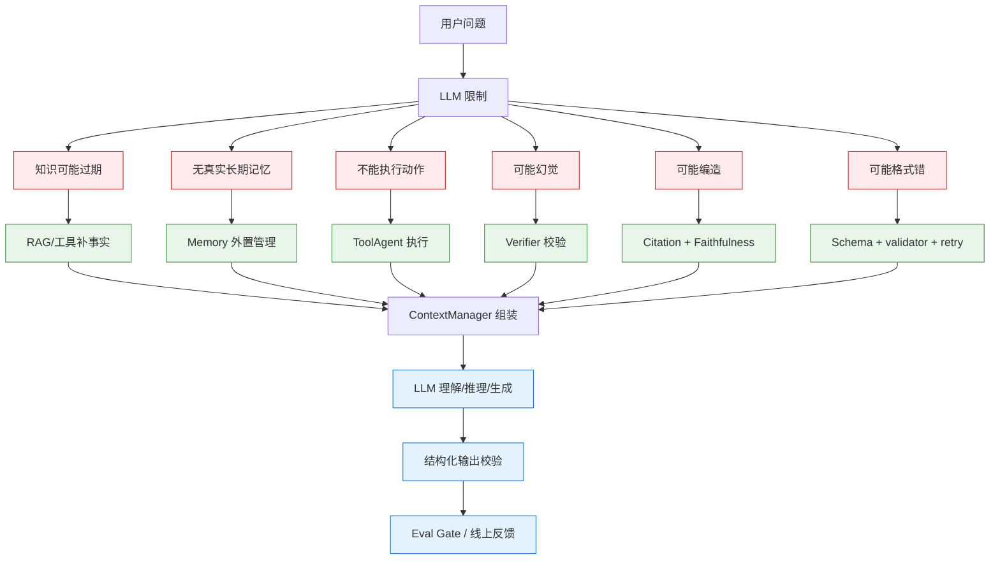
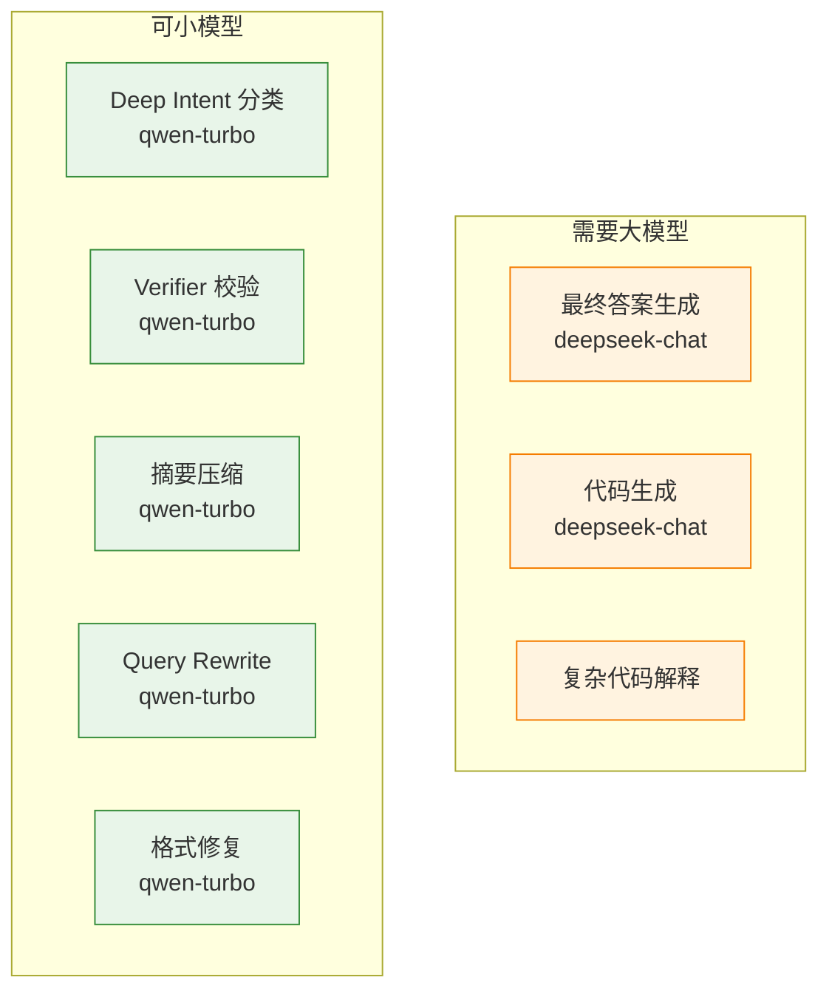
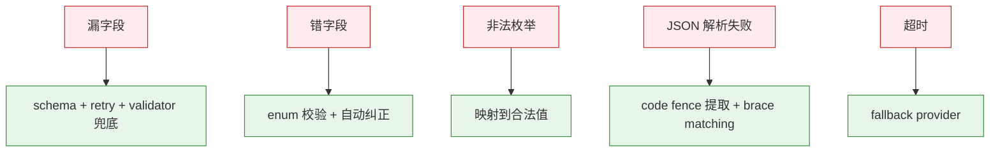

# 大模型基础

> 本主题文件存放在 `technical_deep_dive/主题/`，允许题目与其他主题重复。

## 结合项目的详细说明

这个主题里的大模型基础不是纯理论，而是项目里如何把 LLM 当成一个可控组件使用。LLM 的能力是语言理解、生成、推理和结构化输出，但它本身没有实时知识、没有可靠记忆、不能天然调用工具，也不保证事实正确。因此项目用 RAG 补知识，用 Agent 编排行动，用 Memory 管理上下文，用 Verifier 检查输出，用 Eval Gate 衡量质量。

LLM 在项目里主要承担几类任务：生成最终答案、辅助 Deep Intent 分类、Query Rewrite、代码生成、摘要压缩、Verifier 判断和失败重试中的改写。不同任务对模型要求不同。最终答案需要较强推理和表达；意图识别更需要稳定结构化输出；摘要压缩需要保留关键信息；格式修复可以用较小模型。工程上不应该所有节点都用最大模型，否则成本和延迟会失控。

Provider 抽象是模型工程化的基础。项目通过 ProviderFactory 屏蔽 OpenAI-compatible/vLLM/Ollama、DashScope 和 MockProvider 的差异。这样本地开发、CI 测试和生产环境可以使用不同 provider；真实模型失败时可以 fallback；MockProvider 则保证测试不依赖外部模型。面试时可以强调：模型调用要抽象成接口，不能把某个厂商 SDK 写死在业务逻辑里。

结构化输出是 LLM 落地的关键问题。Deep Intent 要输出 primary_intent、secondary_intents、entities、constraints、retrieval_plan、answer_style、confidence 等字段；Tool Agent 要输出工具名和参数；Verifier 要输出是否通过和失败原因。项目用 schema、validator、JSON parse retry 和 fallback 处理模型漏字段、错字段和非法枚举。LLM 输出永远要校验后才能进入业务状态。

幻觉问题来自模型的概率生成本质。模型会根据上下文补全最可能文本，而不是天然查证事实。项目用 RAG 把外部证据注入上下文，用 Prompt 要求引用证据，用 Verifier 检查无来源断言，用 Eval Gate 监控 faithfulness。这里的关键认知是：LLM 不应该被当作知识库，而应该被当作基于上下文进行推理和表达的生成器。

上下文窗口也是大模型基础的一部分。长上下文模型不是 RAG 的替代品，因为长上下文成本高、延迟高、注意力在超长输入中会下降，而且不能自动保证取到正确信息。项目仍然用 Hybrid RAG 做证据筛选，再由 ContextManager 控制进入窗口的内容。长上下文适合作为补充，而不是把所有文档都塞进去。

Memory 不能理解为模型真的"记住了"。项目的记忆是外置四层上下文管理：上下文窗口、工作记忆、短期记忆、长期记忆。长期记忆再分情节记忆和语义记忆。LLM 每轮只能看到上下文窗口里的内容，其他记忆必须由系统检索、筛选、压缩后注入。这个解释能回答"模型有没有长期记忆""为什么 Redis/PG/向量库还需要存在"等问题。

大模型基础还包括温度、解码、成本和延迟。意图识别、校验、结构化输出通常用低温度，保证稳定；创意生成才提高温度。生成长度要限制，避免 token 成本失控。高并发场景要做模型路由、缓存、批处理或流式输出。模型越强不代表系统越好，合适的模型放在合适节点才是工程能力。

面试时可以收束：这个项目把 LLM 放在 RAG/Agent 工程体系里使用，而不是让 LLM 单独解决所有问题。LLM 负责理解和生成，RAG 负责事实来源，工具负责外部行动，Memory 负责上下文连续，Verifier 负责质量闸门，Eval 负责持续改进。


### 具体设计和追问点

大模型基础题很容易被问到"LLM、RAG、Agent 的区别"。可以回答：LLM 是语言模型，负责理解和生成；RAG 是给 LLM 注入外部证据的方法；Agent 是在 LLM 之上增加规划、工具、记忆和行动循环的系统。项目里三者都有，但职责不同，不能混为一谈。

| 能力 | LLM 自身 | 项目怎么补足 |
|---|---|---|
| 实时知识 | 没有或不可靠 | RAG/工具检索 |
| 长期记忆 | 不具备真实持久记忆 | 四层 Memory 外置管理 |
| 工具执行 | 不能执行 | ToolAgent + ToolExecutor |
| 事实校验 | 不可靠 | Verifier + citation |
| 稳定结构化输出 | 可能失败 | schema + validator + retry |
| 质量回归检测 | 无 | Eval Gate |

如果问"为什么模型知道很多还要 RAG"，答案是：模型参数知识不可更新、不可审计、可能过期，而且无法保证引用来源。企业场景需要最新文档、内部知识、权限隔离和可追溯来源，所以必须 RAG。LLM 的优势是理解和表达，事实来源应该交给检索和工具。

如果问"长上下文能不能替代 RAG"，答案是不能完全替代。长上下文能减少部分检索需求，但成本、延迟、注意力衰减和权限隔离问题仍然存在。项目更合理的做法是先用 RAG/工具筛选高质量上下文，再让模型在有限窗口内推理，而不是把所有材料一股脑塞进去。


### 流程图

#### 1. LLM 在项目中的角色定位（不是 LLM 解决一切）



#### 2. 不同任务用不同模型



#### 3. 5 类失败模式与处理



### 易误会点（10 条）

**易误会点 1：LLM ≠ Agent**

LLM 是**语言模型**，Agent 是在 LLM 之上增加**规划、工具、记忆、行动循环**的系统。LLM 自身没有"主动性"。

**易误会点 2：LLM ≠ RAG**

LLM 是**理解+生成**的引擎；RAG 是**给 LLM 注入外部证据**的方法。**RAG 不替代 LLM**。

**易误会点 3：所有节点用最大模型 = 浪费**

不同任务对模型要求不同：
- 答案生成 → 大模型
- Deep Intent → 小模型（结构化）
- Verifier → 小模型（稳定）
- 摘要 → 小模型（保留信息）

**易误会点 4：LLM 输出永远要校验**

不能信任 LLM 输出直接进业务状态。要：
- schema 校验
- enum 校验
- validator 兜底
- JSON parse retry

**易误会点 5：幻觉是概率生成本质**

模型是"基于上下文补全最可能文本"，**不是查证事实**。需要 RAG + Prompt + Verifier 协同。

**易误会点 6：长上下文 ≠ RAG 替代品**

长上下文问题：
- 成本高（按 token 计费）
- 延迟高（Prefill 几十秒）
- 注意力衰减（"Lost in the Middle"）
- 权限隔离难

**易误会点 7：LLM 没有"真记忆"**

模型只是基于当前 Prompt 推理。**Memory 必须外置**（Redis/PG/向量库）。

**易误会点 8：温度不是越高越好**

| 温度 | 适用 |
|------|------|
| 0.0 | 意图识别、校验、结构化输出、摘要 |
| 0.3 | 答案生成（需要表达力）|
| 0.7+ | 创意生成 |

**易误会点 9：Mock Provider 不是"测试专用"**

可用于：单元测试 / CI 评估 / 零依赖开发 / Provider 降级。

**易误会点 10：模型越强 ≠ 系统越好**

"合适的模型放在合适节点" 才是工程能力。**强模型成本高、慢**，不是所有节点都要。

### 常见追问 10 条

**追问 ①：LLM / RAG / Agent 区别？**
- LLM：语言模型
- RAG：给 LLM 注入外部证据
- Agent：LLM + 规划 + 工具 + 记忆 + 行动循环

**追问 ②：为什么模型知道很多还要 RAG？**
- 参数知识**不可更新、不可审计、可能过期**
- **无法引用来源**
- 企业需要**最新文档 + 内部知识 + 权限隔离 + 可追溯**

**追问 ③：长上下文能否替代 RAG？**
- **不能完全替代**
- 长上下文能减少部分检索需求
- 但成本、延迟、注意力衰减、权限隔离问题仍在
- 项目用 RAG 优先 + 长上下文补充

**追问 ④：结构化输出怎么保证？**
- Few-shot + 显式字段 + schema
- JSON parse retry（3 次）
- validator 兜底（非法 enum 自动纠正）

**追问 ⑤：幻觉怎么治？**
- RAG 补事实
- Prompt 强制引用
- Verifier 校验
- Eval Gate 监控

**追问 ⑥：Temperature 怎么选？**
- 0.0：结构化输出、校验
- 0.3：答案生成
- 0.7+：创意（项目不用）

**追问 ⑦：Token 怎么算成本？**
- 答案生成占 60-80%
- Deep Intent 占 5-10%
- Verifier 占 5-10%
- 摘要占 3-5%

**追问 ⑧：为什么选 deepseek-chat？**
- 中文好
- 性价比高
- OpenAI-compatible 协议
- 易于降级

**追问 ⑨：怎么选 embedding 模型？**
- 项目用 BGE-M3（本地、中文好、768 维）
- 替代：OpenAI text-embedding-3
- 选型：MTEB 榜单 + 内部验证

**追问 ⑩：微调 vs Prompt？**
- 微调：成本高、需训练数据
- Prompt：成本低、即时改
- 项目用 Prompt（业务变化快）

## 匹配到的题目（24 道）

### 1. Agent 评估体系包含哪些核心维度？如何量化衡量Planning能力与Hallucination Rate )？ [来源:01_RAG核心链路.md | 重要性:S]

**结合项目回答评分：** 10/10（匹配置信度 100/100）

**结合项目的回答：**

结合项目回答：项目采用 80% Workflow + 20% Agent 的混合架构。LangGraph StateGraph 定义 16 个节点和条件边，保证主流程可控；Router/Deep Intent、Knowledge Agent、Tool Agent、Verifier Agent 在关键节点做动态决策。这样既能避免纯 Agent 的不可控和死循环，又保留了根据中间结果选择检索策略、工具调用、答案校验和失败恢复的灵活性。

**完美答案：**

Agent评估比单纯的RAG评估复杂得多，因为Agent涉及多步推理、工具调用、动态决策，失败可能在任何中间环节发生。

**核心评估维度：**

维度一：任务完成率（Task Success Rate）。最顶层的指标——Agent最终是否达成了用户的目标。对于有确定答案的任务（如"查一下合同A的签署日期"），对比实际输出与标准答案是否一致。对于开放式任务（如"帮我写一份项目总结"），用人机评估判断是否满足需求。任务完成率是所有评估的基础——Plan再好、工具用得再对，最终没完成任务就是失败。

维度二：Planning能力。评估Agent分解任务、规划执行步骤的能力：
- 步骤合理性：分解的子任务是否覆盖了原始任务的所有必要方面，是否存在多余或遗漏的步骤
- 工具选择正确性：每一步选择的工具是否是最合适的（如该用搜索的时候有没有用搜索、该用计算器的时候有没有用计算器）
- 执行顺序最优性：子任务的执行顺序是否高效（如先做过滤再搜索vs先搜索再过滤）
- 错误恢复能力：中途出错后是否能识别问题并调整策略，而不是重复无效操作或直接放弃

维度三：Tool Use准确性。Agent调用工具的质量：
- 调用格式正确率：输出是否符合工具要求的JSON Schema/函数签名
- 参数准确率：工具参数值是否合理（如检索query是否有意义、文件路径是否正确）
- 结果利用能力：获取工具返回后是否正确理解并利用结果推进任务

维度四：安全性。包括幻觉率、有害输出检测、权限越界检测等。

**Planning能力的量化衡量：**

- 步骤效率比 = 最优步骤数 / 实际执行步骤数。最优步骤数由人工标注（或专家Agent标注）确定，比值越接近1说明Planning越高效
- 工具调用成功率 = 成功执行的工具调用次数 / 总工具调用次数
- 任务拆解覆盖率 = 覆盖的必需要素 / 所有必需要素（需人工标注每个任务的必需要素列表）
- Replan触发准确率 = Agent在遇到错误时正确触发重新规划的次数 / 应该触发重新规划的次数

**Hallucination Rate的量化衡量：**

与RAG场景类似但更复杂——Agent的幻觉可能出现在中间推理步骤、工具调用的参数、以及最终回答中。衡量方法：
- 声明拆解：将Agent的最终输出和关键中间步骤拆解为独立的factual claims
- 证据溯源：对每个claim，在Agent的上下文（检索结果、工具返回、前置推理）中查找支撑证据
- 幻觉判定：找不到证据支撑的claim标记为幻觉
- Hallucination Rate = 幻觉声明数 / 总声明数

Agent幻觉的难点在于：有时Agent的推理链中某一步是"合理推断"，严格说是幻觉但逻辑上是合理的。需要定义评判标准（严格匹配 vs 合理推断），不同场景容忍度不同。

**评估的实施方式：**

离线Benchmark评估：构建覆盖不同任务类型（信息查询、推理分析、多步操作）的测试集，每个案例标注标准答案、预期步骤、关键中间状态。自动化运行Agent后在Benchmark上统计各维度指标。

在线监控：采样线上流量，异步评估任务完成率、工具调用成功率、用户行为信号（任务中断率、追问率、满意度评分）。

Human-in-the-loop抽检：每周人工抽检20~50条Agent执行全过程（含中间步骤），做详细质量审计。

---

---

### 2. Bi-Encoder 和 Cross-Encoder 在模型结构上具体有什么区别？ [来源:01_RAG核心链路.md | 重要性:S]

**结合项目回答评分：** 8/10（匹配置信度 73/100）

**结合项目的回答：**

结合项目回答：在线检索是 Agentic Hybrid RAG。Deep Intent/检索路由判断问题类型后，调用 Milvus 向量检索、Elasticsearch BM25/IK 中文分词检索和可选 GraphRAG；结果用 RRF 融合，再进入 Rerank 和上下文构建。检索失败有降级链：Graph 失败不影响向量+关键词，Milvus 不可用可退到 ES/内存关键词兜底。

**完美答案：**

Bi-Encoder 是两个独立的编码器（或同一个编码器用两次），query 和 document 各自独立过一遍 Transformer，各自输出一个向量，然后用余弦相似度或内积来计算两者的相关性。关键特征是 query 和 document 在编码时互不可见——它们之间没有 token 级别的 attention 交互。相当于两个人各写一份自我介绍，然后比对自己的介绍。好处是 document 的向量可以离线预计算，在线只需编码 query 一次并做 ANN 搜索，速度快。Cross-Encoder 把 query 和 document 拼成一个序列 [CLS] query [SEP] document [SEP] 送进一个 Transformer，所有 token 之间做 full attention，最后取 [CLS] 位置的输出过一个线性层打一个相关性分数。因为 query 和 document 每个 token 都互相关注过，精度远高于 Bi-Encoder。代价是每次打分都必须把 query-doc pair 完整过一遍模型，不能预计算，速度慢。这就是为什么只能用在 Rerank 阶段兜底——候选集小的时候才用得起。

---

---

### 3. Embedding 召回优化策略：如何提高召回效果和模型效率？ [来源:01_RAG核心链路.md | 重要性:A]

**结合项目回答评分：** 10/10（匹配置信度 100/100）

**结合项目的回答：**

结合项目回答：Embedding 层使用 BGE-M3，理由是中英双语、1024 维表达能力、dense/sparse/ColBERT 多表示能力和本地部署成本可控。工程上封装为 EmbeddingProvider，模型不可用时降级到 Mock/RandomEmbeddingProvider；召回优化还依赖 BM25 精确匹配、Milvus 语义召回和 RRF 融合。

**完美答案：**

Embedding召回优化从两个维度展开——召回效果（能不能找到正确答案）和模型效率（多快、多省钱）。

**召回效果提升：**

第一层是模型层优化。选型上优先选业务领域匹配的模型（中文选BGE/GTE，中英混合选bge-m3/E5），在自有评测集上跑Recall@K对比。如果通用模型效果不够，考虑在业务数据上微调Embedding模型——用对比学习（InfoNCE Loss）+ 业务相关的正负样本对（query-relevant_doc），通常2000~5000条高质量对就能看到明显效果。微调关键是Hard Negative Mining——找那些"看起来相关但实际不相关"的迷惑性负样本。

第二层是索引层优化。Chunk策略直接影响Embedding质量——Chunk太大主题混杂导致向量模糊，太小上下文不全导致语义丢失。Hybrid Search（向量+BM25）互补覆盖精确匹配和语义匹配。元数据过滤在检索时下推（tenant_id、文档类型、时间范围），减少无关向量参与计算。

第三层是查询层优化。Query Rewrite把用户口语化/多轮对话中的残缺query改写为独立完整的检索query。HyDE（Hypothetical Document Embedding）先生成一个假设答案再拿假设答案去检索，有时比直接用query检索效果好。多路并行检索——原始query+改写query+HyDE生成的假设答案，三路结果RRF融合。

**模型效率提升：**

量化：FP16→INT8量化，显存和推理延迟大幅降低，精度损失通常<1%。通过ONNX Runtime或TensorRT做推理加速。知识蒸馏：用大Embedding模型当teacher训练小模型，小模型推理快但精度接近大模型。缓存热门query的embedding向量，避免重复推理。批量处理：离线建索引时batch推理最大化GPU利用率，在线服务控制batch size平衡延迟和吞吐。

**典型优化路径：** baseline（通用模型+基本Chunk）→换领域适配模型→微调Embedding→加混合检索→加Query Rewrite→加Rerank。每一步都在评测集上验证Recall@5变化，用数据驱动决策。

---

---

### 4. Position Embedding深度继续问、RoPE原理推导 [来源:01_RAG核心链路.md | 重要性:A]

**结合项目回答评分：** 7/10（匹配置信度 63/100）

**结合项目的回答：**

结合项目回答：Embedding 层使用 BGE-M3，理由是中英双语、1024 维表达能力、dense/sparse/ColBERT 多表示能力和本地部署成本可控。工程上封装为 EmbeddingProvider，模型不可用时降级到 Mock/RandomEmbeddingProvider；召回优化还依赖 BM25 精确匹配、Milvus 语义召回和 RRF 融合。

**完美答案：**

**1) 为什么需要位置编码**

Transformer的自注意力机制本身是并行计算的——所有token同时参与attention，这使得模型天然无法区分"我爱吃苹果"和"苹果爱吃我"中"苹果"的语义差异。位置信息的缺失意味着模型看到的只是词袋（bag of tokens），不理解顺序。位置编码（Position Encoding）就是为了给每个位置的token注入位置信息，让模型知道token的排列顺序。

**2) 绝对位置编码**

最早Transformer论文使用的是Sinusoidal位置编码——对每个位置pos和维度i，用正弦/余弦函数生成位置向量然后与token embedding相加。公式为PE(pos,2i)=sin(pos/10000^(2i/d))、PE(pos,2i+1)=cos(pos/10000^(2i/d))。优点是无需训练参数、能外推到训练未见的长度（理论上）、编码的值在[-1,1]范围稳定。但缺点也明显：绝对位置编码下，位置m和n之间的"关系"不直接体现在位置编码中，模型需要自己学习从绝对位置隐式推导相对关系；且外推长度有限，实际训练未见的远距离位置效果衰减。

Learned Positional Embedding则是为每个位置学习一个向量，简单直接，但无法外推——训练时最多见过512个位置，推理时到513就完全未知了。

**3) RoPE原理（Rotary Position Embedding）**

RoPE的核心思想是：与其给每个位置一个绝对位置编码，不如直接在attention计算中注入相对位置信息。具体做法是通过一个旋转矩阵R(m)来旋转第m个位置的query向量q_m和第n个位置的key向量k_n，使得attention分数q_m^T·k_n自然编码了相对位置关系(m-n)。

具体来说，RoPE将d维向量按二维子空间配对成d/2对，对每一对(q_{m,2i}, q_{m,2i+1})应用2D旋转矩阵——这个旋转的角度与位置m成正比，不同维度对的旋转频率不同（高频维度对位置敏感，低频维度对位置迟钝）。经过旋转后，q_m^T·k_n的计算结果只依赖于(m-n)，即相对位置，而非绝对位置m和n。

**4) 关键公式推导**

旋转矩阵R(m)的形式：对于位置m，第i对元素（维度2i和2i+1）上的旋转矩阵为：
```
R_i(m) = [[cos(m·θ_i), -sin(m·θ_i)],
          [sin(m·θ_i),  cos(m·θ_i)]]
其中 θ_i = 10000^(-2i/d)，即频率递减
```
整个d维空间上，R(m)是一个由d/2个2×2旋转块组成的块对角矩阵。

RoPE的核心性质来自旋转矩阵的正交性：R(m)^T · R(n) = R(n-m)。这意味：
```
(R(m)·q_m)^T · (R(n)·k_n) = q_m^T · R(m)^T · R(n) · k_n
                          = q_m^T · R(n-m) · k_n
```
所以attention分数只依赖相对位置(n-m)，自然地编码了"位置n与位置m相距多远"的信息。

---

---

### 5. RAG项目中有没有参与大模型微调？微调全链路？ [来源:01_RAG核心链路.md | 重要性:S]

**结合项目回答评分：** 8/10（匹配置信度 76/100）

**结合项目的回答：**

结合项目回答：这题可以落到项目的工程化闭环：FastAPI + LangGraph + RAG + 工具 + 记忆 + 评估闭环；关键能力都有可观测和降级路径；面试时映射到 Milvus/ES 混合检索、Provider 抽象、TokenBudget、Verifier、Data Flywheel 等项目实现。

**完美答案：**

微调全链路：数据构建→LoRA训练→评估→量化部署。面试要诚实——没做过就说没做过，但说清楚原理和你理解的全链路各阶段关键技术。

---

---

### 6. Rewrite模型是你做的，具体输入输出是什么？你们是把 rewrite放在检索前还是后？训练数据是人工构造的吗？ [来源:01_RAG核心链路.md | 重要性:A]

**结合项目回答评分：** 10/10（匹配置信度 96/100）

**结合项目的回答：**

结合项目回答：在线检索是 Agentic Hybrid RAG。Deep Intent/检索路由判断问题类型后，调用 Milvus 向量检索、Elasticsearch BM25/IK 中文分词检索和可选 GraphRAG；结果用 RRF 融合，再进入 Rerank 和上下文构建。检索失败有降级链：Graph 失败不影响向量+关键词，Milvus 不可用可退到 ES/内存关键词兜底。

**完美答案：**

**1) Rewrite模型的输入**

输入由两部分组成：当前用户query（可能包含指代词、省略、口语化表达、专业术语简写等）+ 对话历史（最近N轮对话，通常N=3~5）。对话历史的作用是为指代消解和上下文补全提供信息。例如：
- 用户第1轮："什么是Transformer的自注意力机制？"
- 用户第2轮："它的计算复杂度是多少？" 
→ Rewrite模型需要根据第1轮的历史，将第2轮的"它"消解为"自注意力机制"，输出改写query："自注意力机制的计算复杂度是多少"

输入格式通常为：`[历史轮次] ... [当前query] 请改写为独立完整的检索查询`，或者将对话中所有轮次的query拼接后用特殊分隔符标记。

**2) Rewrite模型的输出**

输出是一个独立完整、可以直接用于检索的query字符串。改写目标包括：
- 指代消解：将"它""这个""上面那个"替换为具体实体
- 上下文补全：将省略的主语/宾语/条件补全
- 术语归一化：将口语化表达转为知识库中使用的正式术语（如"退钱"→"退款申请流程"）
- 复合问题拆分（可选）：将一个复杂多意图query拆分为多个子query
- 生成等价问法（可选）：输出多个不同表述的query增强召回覆盖率

注意：Rewrite必须保持用户原意不变。如果模型不确定如何改写，输出原始query作为兜底。

**3) Rewrite放在检索前还是检索后**

放在检索前（pre-retrieval rewrite）。这是标准做法，原因很直接：如果用户原始query有指代不明或术语不规范的问题，直接用原query检索效果会很差。Rewrite在检索前将query"修正"为检索友好的形式，显著提升召回质量。

典型的检索流程：用户原始query → Rewrite模型改写 → 得到改写query → 将原始query和改写query（可多个）并行发送到检索系统 → 各路检索结果RRF融合去重 → 进入Rerank精排。保留原始query并行检索是安全兜底——万一Rewrite改坏了（改变了用户意图），原始query的结果仍然可用。

**4) 训练数据构造**

三层来源：

第一层——人工标注。这是质量最高但成本最高的方式。从线上历史对话日志中抽取多轮对话片段，人工为最后一轮query标注"理想的独立检索query"。标注规范要明确指代消解、术语归一化、不改变原意等标准。通常需要500~1000条高质量标注数据做种子。

第二层——LLM辅助生成。用强模型（如GPT-4/DeepSeek）批量生成训练数据。给LLM多轮对话上下文，要求它输出改写后的query，相当于用大模型"蒸馏"出训练数据。一个Prompt可以同时生成多种改写风格（简洁版、详细版、术语归一化版），大幅降低标注成本。关键是随后做人工抽检保证质量。

第三层——线上反馈数据。将Rewrite模型上线后，记录哪些改写后的query带来了好的检索结果（高Rerank分数、用户点赞），哪些改写得不好（用户追问、负反馈）。将这些正负样本加入训练集持续迭代。

训练方式：如果用量不大的话用Prompt+强模型即可（零训练成本但推理延迟高），如果QPS高则用标注数据微调一个小模型（如Qwen2-1.5B）做专用Rewrite模型，推理快且成本低。

---

---

### 7. 什么是大模型的幻觉，如何减轻幻觉问题 [来源:01_RAG核心链路.md | 重要性:S]

**结合项目回答评分：** 10/10（匹配置信度 98/100）

**结合项目的回答：**

结合项目回答：幻觉治理靠检索约束、引用、校验和评估闭环。PromptBuilder 要求基于上下文回答，CitationManager 生成来源引用；Verifier Agent 检查答案是否有依据、引用是否存在，不通过就 regenerate 或 fallback；线上 bad case 进入 Data Flywheel，反向优化切分、检索、Prompt 和知识库覆盖。

**完美答案：**

**幻觉的定义和分类：**

大模型幻觉（Hallucination）指模型生成的内容与客观事实不符、缺乏依据、或与提供的上下文矛盾。分为三类：事实性幻觉——模型编造了不存在的实体、事件、数据（如"2025年某公司营收为XX亿"但实际没有）；忠实性幻觉——模型虽然给出了上下文但输出与上下文不一致（如上下文写"A>B"但回答"B>A"）；逻辑性幻觉——推理链中存在逻辑断裂但表面上看起来很合理。

**幻觉的根本原因：**

训练数据层面——预训练数据中存在错误信息、过时信息或偏见，模型学到了这些。模型架构层面——Transformer的生成本质上是概率采样而非事实核查，Softmax输出的是"最可能的下一个token"而非"最正确的下一个token"。解码策略层面——温度采样和top-p带来的随机性使得同一问题可能得到不同答案。RLHF层面——过度优化让模型倾向于"总是给答案"而非"不知道时拒绝"，因为训练中拒绝回答的样本往往获得较低的奖励。

**减轻方案：**

第一道防线：RAG注入外部知识。检索真实、最新的文档作为生成依据，将模型从"凭记忆编造"转为"基于材料回答"。这是目前最有效的方式，但前提是检索质量要到位。

第二道防线：Prompt工程设计。明确指令"仅基于上下文回答"、"信息不足时回答无法确认"、"引用原文证据"；结构化输出要求"先摘录原文→再给出答案"。

第三道防线：上下文优化。压缩噪声、排序优化（高分在前避免Lost in Middle）、控制总量（宁精勿杂）。

第四道防线：输出验证。LLM-as-Judge自检+关键事实正则匹配验证。

第五道防线：微调行为模式。通过SFT训练模型"基于上下文回答"、"不知道时说不知道"的行为习惯，降低模型依赖参数知识编造答案的倾向。

---

---

### 8. 你实际项目中是怎么决定用 RAG 还是 Fine-tuning 的？有没有做过对比实验？ [来源:01_RAG核心链路.md | 重要性:S]

**结合项目回答评分：** 10/10（匹配置信度 100/100）

**结合项目的回答：**

结合项目回答：这题可以落到项目的工程化闭环：FastAPI + LangGraph + RAG + 工具 + 记忆 + 评估闭环；关键能力都有可观测和降级路径；面试时映射到 Milvus/ES 混合检索、Provider 抽象、TokenBudget、Verifier、Data Flywheel 等项目实现。

**完美答案：**

有做过对比。我们当时在内部 IT 支持问答系统上做了一个对照实验：A 组用的 GPT-4 做 RAG（知识库约 5000 篇文档），B 组用 Qwen2-7B 在同样的 5000 篇文档上做 LoRA 微调。结果很有意思——RAG 组在"精确查信息"类问题（比如"VPN 怎么配置"、"报销额度是多少"）上表现显著更好，准确率大概 87% vs 微调组的 72%，因为这类问题的答案就是原始文档里的某一段，检索比"背下来"可靠得多。但微调组在"规范化输出"方面更好——它天然就会按固定的格式和口径回答，而 RAG 组有时格式会漂移。另外微调组在推理延迟上有优势（不需要检索环节）。最终我们的结论是：对于 IT 支持这类知识频繁更新的场景，RAG 是主线；但对于一些固定的"回答规范"（比如必须用什么格式输出、什么场景不能回答什么），通过微调强化行为模式效果更好。所以最终方案是 RAG 做知识提供，微调做行为约束，两者互补。

---

---

### 9. 向量模型怎么微调？ [来源:01_RAG核心链路.md | 重要性:A]

**结合项目回答评分：** 10/10（匹配置信度 97/100）

**结合项目的回答：**

结合项目回答：Embedding 层使用 BGE-M3，理由是中英双语、1024 维表达能力、dense/sparse/ColBERT 多表示能力和本地部署成本可控。工程上封装为 EmbeddingProvider，模型不可用时降级到 Mock/RandomEmbeddingProvider；召回优化还依赖 BM25 精确匹配、Milvus 语义召回和 RRF 融合。

**完美答案：**

**核心用对比学习（Contrastive Learning）损失——InfoNCE Loss。
   ```
   正样本对(query, relevant_doc)：Embedding相似度应高
   负样本对(query, irrelevant_doc)：Embedding相似度应低

   L = -log[exp(sim(q,d+)/τ) / Σ exp(sim(q,di)/τ)]
   τ是温度参数(通常0.05-0.1)，越小越关注困难负样本
   ```

   **关键技巧①In-Batch Negatives（同一batch中其他样本的doc作为负样本，免费获取大量负样本）②Hard Negative Mining（专门挑和正样本相似但不相关的"迷惑性负样本"）③数据构建最重要——微调数据质量决定了向量模型的天花板。

---

---

### 10. 大模型幻觉产生的原因和分层解决方案？ [来源:01_RAG核心链路.md | 重要性:S]

**结合项目回答评分：** 8/10（匹配置信度 80/100）

**结合项目的回答：**

结合项目回答：幻觉治理靠检索约束、引用、校验和评估闭环。PromptBuilder 要求基于上下文回答，CitationManager 生成来源引用；Verifier Agent 检查答案是否有依据、引用是否存在，不通过就 regenerate 或 fallback；线上 bad case 进入 Data Flywheel，反向优化切分、检索、Prompt 和知识库覆盖。

**完美答案：**

原因四层：训练数据有误+模型架构(Softmax本质是编不是查)+解码随机性+RLHF过度讨好。解决五层：RAG注入真实知识→Prompt约束→规则校验→LLM Judge评估→人工审核闭环。

---

---

### 11. 嵌入模型为什么选 BGE？FAISS 索引是如何构建的？ [来源:01_RAG核心链路.md | 重要性:A]

**结合项目回答评分：** 9/10（匹配置信度 83/100）

**结合项目的回答：**

结合项目回答：Embedding 层使用 BGE-M3，理由是中英双语、1024 维表达能力、dense/sparse/ColBERT 多表示能力和本地部署成本可控。工程上封装为 EmbeddingProvider，模型不可用时降级到 Mock/RandomEmbeddingProvider；召回优化还依赖 BM25 精确匹配、Milvus 语义召回和 RRF 融合。

**完美答案：**

**为什么选BGE：**

BGE（BAAI General Embedding）系列在中文Embedding场景下有明显的综合优势。第一，中文检索效果在C-MTEB榜单上长期领先，尤其Retrieval类任务（对RAG最关键的子任务）表现优秀。第二，模型完全开源，支持本地部署，不存在数据出境和私有化部署的合规问题。第三，模型尺寸选择丰富（bge-small/bge-base/bge-large/bge-m3），可根据GPU资源和延迟要求在精度和效率间灵活选择。第四，支持instruction微调（bge-en-icl），可以通过自然语言指令让模型关注特定维度的语义，提升泛化能力。第五，社区活跃、生态成熟，与LangChain/LlamaIndex等框架都有良好集成。

选BGE不选其他方案的具体考量：vs OpenAI Embedding——开源自部署无数据出境风险、无API调用成本；vs GTE系列——两者在中文场景效果接近，BGE社区更大、文档更完善；vs E5系列——E5在英文场景表现更好，中文场景BGE更优。

**FAISS索引构建过程：**

FAISS（Facebook AI Similarity Search）是Meta开源的向量检索库。重要认知：FAISS是库不是数据库——只负责索引构建和相似度搜索，不管持久化存储、分布式、元数据管理，这些需要自己封装。

构建流程分四步：

第一步：选择索引类型。根据数据规模和精度/速度需求选择——精确场景选IndexFlatIP（内积比较，遍历所有向量保证100%召回但速度慢O(N)），速度优先选IndexIVFFlat（K-means聚类+倒排索引，搜索时先找最近聚类中心再在聚类内搜索），速度+内存兼顾选IndexHNSW（层级图搜索，构建时建连接图、搜索时贪心遍历图）。大规模场景还可以结合乘积量化(PQ)做压缩（IndexIVFPQ），用少量内存存大量向量。

第二步：训练索引（只针对需要训练的索引类型）。IVF需要先对全部向量做K-means聚类，确定nlist个聚类中心。这一步的nlist参数很关键——太小聚类粗糙搜索慢、太大训练和内存开销大。通常nlist设为4*sqrt(N)左右。

第三步：添加向量。调用index.add(embeddings)将所有文档的Chunk向量批量加入索引。这一步批量处理效率更高。

第四步：索引持久化和加载。用faiss.write_index(index, "index.faiss")保存到磁盘，在线加载时用faiss.read_index("index.faiss")，避免每次重启重新构建。注意FAISS不存元数据（文档ID、文本内容等），需要另外维护一个映射表（向量ID→Chunk元数据），检索拿到向量ID后再去映射表查询。

在线查询：对query做Embedding编码得到query_vector，调用index.search(query_vector, k)返回top-k结果的距离和向量ID。关键参数是搜索范围——HNSW的efSearch（搜索时遍历的候选节点数），越大精度越高但速度越慢。

**面试时强调的架构要点：** FAISS适合单机场景（百万至千万级向量），数据量更大或需要分布式时考虑Milvus替代。FAISS的索引需要定期重建（新增大量文档后），可以通过增量添加（少量文档直接add）和全量重建（积累一定量后重建索引保证质量）两级策略管理。

---

---

### 12. 我们知道sft的时候尽量不要注入知识给模型，因为只希望sft可以提升模型的指令遵循的能力，注入知识的话，可能会导致后面使用的时候模型容易出现幻觉，那我们怎么确保自己选择的这1w条数据没注入知识给模型呢？ [来源:01_RAG核心链路.md | 重要性:S]

**结合项目回答评分：** 6/10（匹配置信度 58/100）

**结合项目的回答：**

结合项目回答：安全边界是多层防护。TenantMiddleware 做租户识别和权限隔离；ToolPolicy 按 safe/sensitive/dangerous 给工具分级；Executor 执行前做参数和权限校验；RAG 文档进入上下文前标记为非指令内容以防间接注入；Verifier 和输出层再做引用、安全与不确定性检查。越权或不确定请求会拒答或转人工。

**完美答案：**

SFT的核心目标是教会模型行为模式——如何遵循指令、用什么格式输出、什么时候拒绝回答、如何引用来源。如果在SFT阶段大量注入事实知识，模型会把知识"背"进参数，在后续使用中可能直接调用参数知识而非检索结果来回答，增加了幻觉风险。

**检测方法：**

方法一：知识隔离测试。选择一批模型在预训练阶段不可能学到的事实（如公司内部操作流程、虚构实体信息），填充到SFT样本的答案中。训练后问模型这些问题——如果模型能正确回答，说明SFT注入了知识。理想情况下SFT后模型应该回答"我不知道"或依赖RAG检索结果。

方法二：知识溯源检查。对每条SFT数据样本，检查答案中的事实性信息是否必须"知道某个具体事实"才能生成。知识注入型（应剔除）的例子：Q:"2024年公司Q3的营收是多少？" A:"2024年Q3营收为5.2亿元"——要求模型知道具体数字。行为模式型（应保留）的例子：Q:"根据以下参考资料回答用户问题。参考资料：[报告内容]。用户问题：Q3营收？" A:"根据参考资料显示，Q3营收为5.2亿元"——答案来自参考资料而非参数知识。

方法三：格式vs内容分离检查。判断答案是否可以替换为模板（如"根据[来源]显示，[答案]"、"无法回答，因为[原因]"）——这些是行为模板，不包含特定知识。

**过滤策略：** 去重与预训练数据重合的样本；优先选行为类数据（格式转换、指令遵循、拒绝回答、来源引用、多轮对话管理）；将知识型数据改造为RAG型数据（在Prompt中加入"参考资料"字段）；后训练验证——用一组需要特定知识但不在SFT数据中的问题测试，如果SFT后模型在"没有上下文"的情况下回答正确率显著上升，说明知识泄露了。

---

---

### 13. 现在的embedding模型有哪些问题？怎么改进？ [来源:01_RAG核心链路.md | 重要性:A]

**结合项目回答评分：** 10/10（匹配置信度 100/100）

**结合项目的回答：**

结合项目回答：Embedding 层使用 BGE-M3，理由是中英双语、1024 维表达能力、dense/sparse/ColBERT 多表示能力和本地部署成本可控。工程上封装为 EmbeddingProvider，模型不可用时降级到 Mock/RandomEmbeddingProvider；召回优化还依赖 BM25 精确匹配、Milvus 语义召回和 RRF 融合。

**完美答案：**

**问题一：长度衰减问题。** 大多数Embedding模型在512 token以内编码质量很好，但超过512 token后编码精度明显下降。即使模型号称支持8192 token输入，实际在长文本上的检索精度也远不如短文本。原因是训练时大多用短文本对，长文本-长文本的训练数据稀缺。改进方向：训练时混合不同长度的样本，做长度感知的对比学习；工程侧用Parent-Child分层（用小Chunk检索、大Chunk返回），不依赖单个Embedding编码超长文本。

**问题二：精确信息丢失。** Embedding把一段文本压缩成固定维度向量，这个压缩过程天然有损。产品型号、错误码、日期、金额、电话号码这类精确信息在向量编码中容易被"模糊化"——向量检索可能把"E40012"和"E40013"这两个完全不同的错误码当成相似。改进方向：引入Hybrid Search，用BM25/Sparse Embedding做精确关键词匹配，弥补Dense Embedding的精确信息丢失；或者使用多向量模型（如ColBERT）保留token级信息。

**问题三：多语言表现不均衡。** 很多Embedding模型在英文上表现好但在中文上明显差，或者中英混合文本处理不好。原因是训练数据语言分布不均。改进方向：选择多语言专门训练的模型（如bge-m3、multilingual-e5）；在自有数据上做多语言对比学习微调；对中英混合场景，可以用中英分别编码后融合。

**问题四：领域泛化能力差。** MTEB排行榜第一的模型在你的业务数据上可能表现平平。因为通用模型训练数据和你业务文档的领域分布差距大——通用模型可能没见过的的领域术语、缩写和表达方式。改进方向：在业务数据上微调Embedding模型（用对比学习+业务query-doc对）；使用Instructor这类支持instruction的模型，通过自然语言指令引导模型关注特定领域语义。

**问题五：query和document编码不对称。** 训练时query是短文本（一句话），document是长文本（一段/一篇），但在线推理时query编码器独立编码看不到document，document编码器独立编码看不到query，这种"双塔隔离"限制了精度上限。改进方向：用Cross-Encoder做Rerank补精排；使用ColBERT这类late interaction模型保留部分交互能力。

**问题六：无法捕捉否定和条件语义。** 传统的双塔Embedding对"哪个产品不是2024年发布的"这类否定式查询、"如果满足条件A则答案B"这类条件式查询，理解能力很弱。因为向量空间中的相似度是线性的，缺少逻辑推理能力。改进方向：配合Query理解模块（把否定/条件查询转成多步检索）；在下游用LLM做最终判断而不是完全依赖向量排序。

---

---

### 14. 知识库准确率和召回率怎么评估？有量化数据吗？ [来源:01_RAG核心链路.md | 重要性:A]

**结合项目回答评分：** 10/10（匹配置信度 98/100）

**结合项目的回答：**

结合项目回答：在线检索是 Agentic Hybrid RAG。Deep Intent/检索路由判断问题类型后，调用 Milvus 向量检索、Elasticsearch BM25/IK 中文分词检索和可选 GraphRAG；结果用 RRF 融合，再进入 Rerank 和上下文构建。检索失败有降级链：Graph 失败不影响向量+关键词，Milvus 不可用可退到 ES/内存关键词兜底。

**完美答案：**

建立Golden Set（金标集）：人工标注50-100个query，每个query标注"相关文档ID列表"作为Ground Truth。每次RAG改动后用金标集跑Recall@K——Recall@5从72%→90%的典型提升路径：Chunking调优(+8%) → 混合检索(+6%) → Rerank(+4%)。**关键是先建金标集再调优，否则等于盲调。**

---

---

### 15. Agent记忆系统怎么设计？ [来源:02_Agent核心原理.md | 重要性:A]

**结合项目回答评分：** 10/10（匹配置信度 100/100）

**结合项目的回答：**

结合项目回答：项目的记忆系统按四层设计。第一层是上下文窗口，由 ContextManager/PromptBuilder/TokenBudget 组装模型当前能看到的 prompt、历史消息、检索片段、工具结果和记忆片段；第二层是工作记忆，用 LangGraph AgentState 和 CheckpointStore 保存计划、步骤、中间结果、工具调用状态和重试状态；第三层是短期记忆，用 ShortTermMemory 保存当前会话最近消息，并用 SummaryMemory 压缩长会话；第四层是长期记忆，用 UserMemory、LongTermMemory、RAG 知识库和可选 Neo4j 保存跨会话偏好、项目背景、历史经验、外部知识和关系。长期记忆内部再分情节记忆和语义记忆：情节记忆记过去发生过什么，语义记忆记稳定知识、偏好和业务规则。

**完美答案：**

**四层记忆/上下文架构：**

| 层 | 存什么 | 项目实现 | 例子 |
|---|---|---|---|
| 上下文窗口 | 模型当前能直接看到的 prompt、历史消息、检索片段、工具结果、记忆片段 | ContextManager / PromptBuilder / TokenBudget | 本轮问题、最近消息、Top-K 文档、工具返回结果 |
| 工作记忆 | 当前任务执行过程中的临时状态：计划、步骤、中间结果、工具调用状态、重试状态 | LangGraph AgentState + CheckpointStore | retrieve 已执行、verify 第 1 次失败、下一步 regenerate |
| 短期记忆 | 当前会话内的多轮对话历史和会话摘要 | ShortTermMemory(Redis/PG) + SummaryMemory | 最近 N 轮对话、当前 session 的阶段性摘要 |
| 长期记忆 | 跨会话持久保存的用户偏好、项目背景、历史经验、外部知识和关系 | UserMemory + LongTermMemory + RAG 知识库 + 可选 Neo4j | 用户偏好中文回答、项目技术栈、上次做过鸿蒙 RAG 项目 |

长期记忆内部再分两类：情节记忆记"过去发生过什么"，例如用户上次问过 LangGraph、做过鸿蒙 RAG 项目、某次任务的结果；语义记忆记"稳定知识和偏好"，例如用户偏好中文回答、项目技术栈、领域知识、业务规则。

写入不是所有内容都长期保存：当前消息默认进入短期记忆；会话变长后用 SummaryMemory 压缩；只有稳定偏好、长期事实或有复用价值的历史事件，才通过 MemoryClassifier 提升到长期记忆。读取时先组装上下文窗口，再按 query 检索长期记忆，并用相关性、重要性、时间衰减做融合排序，避免无关历史污染 Prompt。

---

---

### 16. Prompt Caching是什么？怎么在项目中使用？ [来源:03_大模型应用工程化.md | 重要性:A]

**结合项目回答评分：** 10/10（匹配置信度 100/100）

**结合项目的回答：**

结合项目回答：Prompt 由 PromptBuilder 按 Agent 角色组装：Router Prompt 负责意图分类，Knowledge Prompt 约束基于证据回答，Verifier Prompt 负责事实和引用校验。Prompt 迭代依赖评测集和 bad case，版本变更要记录原因、目标指标和回归结果。

**完美答案：**

Prompt Caching 是 LLM 服务端提供的一项关键优化能力，可以大幅降低首 Token 延迟和 API 调用成本。

**一、Prompt Caching 原理**

LLM 推理时，Transformer 的自回归解码机制需要为每个 token 计算注意力——每生成一个新 token，都要和之前所有 token 做注意力计算。为了避免重复计算，推理引擎会把已经计算过的 prefix token 的 Key-Value 矩阵缓存下来，这就是 KV Cache。

Prompt Caching 将这个机制从"单次请求内部复用"扩展到"跨请求复用"。如果多个请求共享相同的 Prompt 前缀（比如相同的 System Prompt），服务端可以复用第一次请求计算好的 KV Cache，后续请求不需要重新计算这部分的注意力，直接从缓存中读取。效果是：首 Token 延迟降低 50%+，且这部分被缓存的 token 按更低的单价计费（通常是正常价格的 10%-25%）。

**二、适用场景**

最典型的场景是：System Prompt 固定 + 知识库 Chunk 固定 + 对话历史复用。

在 RAG 系统中，System Prompt（角色定义、回答规范）是固定的，被检索到的知识库 Chunk 在同一个 session 内也被多个轮次复用。将固定内容放在 Prompt 前面、变动内容（用户最新 query）放在后面，固定部分就可以被缓存命中。

另一个场景是多轮对话——同一个 session 的对话历史在每一轮都会被完整携带（或者做摘要后携带），这部分历史也是可以缓存的。

**三、Anthropic 的 Prompt Caching 使用方式**

Anthropic 的 API 提供了显式的缓存标记机制。在构造 messages 时，对需要缓存的内容块设置 cache_control: {"type": "ephemeral"} 标记。API 收到请求后，会为被标记的内容计算并缓存 KV Cache。

使用要点：
- 缓存的内容必须是连续的 prefix（不能中间跳过一段再缓存）
- 缓存标记最多设置几个（如 4 个），对应不同的缓存断点
- 缓存有生命周期（通常 5 分钟到 1 小时不等），过期后自动失效
- 被缓存的 token 计费方式不同：写入缓存按原价，缓存命中按折扣价（约 10%）
- 最适合缓存的是 System Prompt 和工具定义——它们在整个会话中完全不变

OpenAI 也提供了类似的自动 Prompt Caching 机制（不需要手动标记，API 自动检测重复前缀并缓存），计费逻辑类似。

**四、缓存命中率优化策略**

把稳定内容放前面。Prompt 的构造顺序决定了哪些内容可以被缓存。原则是：最稳定的内容放最前面（System Prompt、工具定义），次稳定的放中间（知识库 Chunk、Few-shot 示例），最不稳定的放最后（用户 Query、对话历史的最新几轮）。

避免在缓存内容前插入动态变量。比如不要在 System Prompt 前面加一个动态的时间戳或 request_id——这会让整个 Prompt 的 hash 每次都不同，缓存完全无法命中。如果必须在 Prompt 中包含动态信息，把它放在最后。

---

---

### 17. Prompt 模板、版本管理与系统化迭代 [来源:03_大模型应用工程化.md | 重要性:A]

**结合项目回答评分：** 10/10（匹配置信度 100/100）

**结合项目的回答：**

结合项目回答：Prompt 由 PromptBuilder 按 Agent 角色组装：Router Prompt 负责意图分类，Knowledge Prompt 约束基于证据回答，Verifier Prompt 负责事实和引用校验。Prompt 迭代依赖评测集和 bad case，版本变更要记录原因、目标指标和回归结果。

**完美答案：**

Prompt 迭代最常见的问题是"凭感觉改"——改了之后感觉更好了，但没有量化验证，也没有记录改了什么、为什么改、效果如何。系统化的 Prompt 迭代需要：有评测集（能快速验证改动效果）、有版本记录（每次改动都有记录，方便回滚）、有对比分析（新旧版本的差异对比）、以及有结构化的迭代流程（先分析失败案例，再假设原因，再改 Prompt，再验证）。规模大的系统还需要 Prompt 管理平台来支持多人协作和多环境部署。

---

---

### 18. 如果要支持自建的 vLLM 模型，Adapter 需要额外处理什么？ [来源:03_大模型应用工程化.md | 重要性:A]

**结合项目回答评分：** 8/10（匹配置信度 79/100）

**结合项目的回答：**

结合项目回答：模型层通过 Provider 抽象屏蔽 OpenAI-compatible/vLLM/Ollama、DashScope 和 MockProvider 的差异，ProviderFactory 根据环境变量选择并支持真实模型失败后降级到 Mock。成本和延迟优化靠规则优先 Router、检索 Top-K 截断、TokenBudget、缓存、Provider fallback 和分层模型调用。

**完美答案：**

自建 vLLM 在 Adapter 层面和在外部 API 的处理有几个重要区别。

第一个是 vLLM 内置的请求排队。调用外部 API 时请求排队完全在 Gateway 层做。而 vLLM 内部有 continuous batching 机制和请求队列，所以 Adapter 要处理的不是"单个请求送入模型"，而是"把请求放入 vLLM 的队列并持续等待"。响应时间可能比外部 API 更不可预测——因为 batch 里的其他请求会影响你的延迟。

第二个是 tokenizer 统一。vLLM 部署的可能是 Qwen、ChatGLM、Yi 等国产模型，tokenizer 各异。对于外部 API、token 统计靠 API 返回的 usage 字段。对于自建模型，Adapter 或 Gateway 层需要用对应模型的 tokenizer 自行计算 token 数。可以预加载 tokenizer 到内存中，token 计数是 CPU 密集的计算，基本不影响延迟。

第三个是限流和容量管理。外部 API 有明确的 rate limit 错误码（429），自建 vLLM 没有。Adapter 要通过指标监控来判断 vLLM 服务的承载能力——当前 running/pending 请求数、队列长度、GPU 利用率等，来决定是继续分发请求还是触发限流回退。

第四个是模型参数的适配。不同自建模型支持的采样参数不一样——temperature、top_p、top_k、repetition_penalty 等。Adapter 需要根据模型的能力矩阵知道哪些参数有效哪些会被忽略，在发送请求前做参数裁剪。

总体来说，自建 vLLM 的 Adapter 要比外部 API 的 Adapter 做更多的工作——不仅要处理格式转换，还要做容量感知、token 统计和参数适配。这确实是统一接入层中相对复杂的部分。

---

---

### 19. 模型路由的分类器怎么训练？准确率要到多少才划算？ [来源:03_大模型应用工程化.md | 重要性:A]

**结合项目回答评分：** 6/10（匹配置信度 55/100）

**结合项目的回答：**

结合项目回答：模型层通过 Provider 抽象屏蔽 OpenAI-compatible/vLLM/Ollama、DashScope 和 MockProvider 的差异，ProviderFactory 根据环境变量选择并支持真实模型失败后降级到 Mock。成本和延迟优化靠规则优先 Router、检索 Top-K 截断、TokenBudget、缓存、Provider fallback 和分层模型调用。

**完美答案：**

训练数据构造是核心。做法是准备一批请求，同时让强模型（如 GPT-4o）和弱模型（如 GPT-4o-mini）都回答，然后评估两者答案的质量差异。如果 mini 的回答质量达到和 4o 同一水平，这个样本就标注为"简单"。如果 mini 回答明显差很多，就标注为"复杂"。这样收集 3000 到 5000 个带标签的样本，用这个数据集训练分类器。

分类器模型不需要很大，我用的是 BERT-base 级别的小模型，输入是用户的 query 文本（加上一些结构化特征比如长度、是否包含特殊术语），输出是二分类——简单还是复杂。推理延迟不到 10ms，对用户体验几乎没有影响。

关于准确率要到多少才划算，这取决于成本差异和误分代价。我们的场景是 GPT-4o 比 mini 贵约 10 倍，简单请求约占 70%。简单算一下：如果路由准确率 90%，约 7% 的复杂请求会被误分到 mini（效果差）、约 3% 的简单请求会被误分到 4o（多花钱）。算下来能节省约 55% 的成本。我的经验是路由准确率做到 85% 以上就划算，做到 90% 以上效果就很好了。但要注意把误分到弱模型的惩罚权重设高——宁肯多花点钱把复杂请求分到大模型，也不要为了省钱牺牲效果底线。

---

---

### 20. 有对大模型做剪枝量化吗?最终线上方案是什么?部署用的什么卡? [来源:04_项目面试与场景题.md | 重要性:A]

**结合项目回答评分：** 6/10（匹配置信度 55/100）

**结合项目的回答：**

结合项目回答：系统按六层架构部署：FastAPI 接入、LangGraph 编排、RAG/Agent 能力层、LLM Provider 层、Milvus/ES/Redis/PostgreSQL/MinIO/Neo4j 数据层，以及 Prometheus/Grafana/OTel 可观测层。高并发重点是无状态 API 水平扩展、检索并行、缓存、索引分片、Provider 降级和 Eval Gate 防回归。

**完美答案：**

这道题考察的是模型压缩和部署的实际经验，需要从量化方法、剪枝方法、最终方案选择三个层面来回答。

**1. 量化的主流方法**

目前大模型量化主要有三条技术路线：

- **GPTQ**（Post-Training Quantization）：基于 OBQ（Optimal Brain Quantization）的思想，对模型权重进行逐层量化。核心做法是按列逐层处理，每量化一列权重后，用 Hessian 矩阵计算剩余权重的更新补偿，以最小化量化引入的输出误差。GPTQ 的优势是：只需少量校准数据（128 条样本即可）、量化速度相对快、支持 INT4/INT8。适用于对精度要求高、可以承受一定量化耗时的场景。

- **AWQ**（Activation-aware Weight Quantization）：核心创新是"激活感知"——不是所有权重通道对输出同等重要。AWQ 分析激活值中的"显著通道"（salient channels），对这些通道对应的权重使用更大的缩放因子（per-channel scaling），从而在量化中保护重要信息。相比 GPTQ，AWQ 通常能在 INT4 下保持更好的精度，且量化速度更快，是目前工业界使用最广泛的 LLM 量化方法之一。

- **bitsandbytes QLoRA 量化采用 NF4（Normal Float 4）数据类型，这是一种针对正态分布数据优化的 4-bit 格式。结合双重量化（Double Quantization）——量化缩因子本身也被量化——进一步节省显存。QLoRA 的核心思路是让量化后的模型保持可微调状态，通过 LoRA 低秩适配器在量化基座上进行训练。主要用于微调场景而非纯推理部署。

**2. 剪枝方法**

- **结构化剪枝以整个组件为单位剪枝——去掉整个 Attention Head、整个 FFN 层中的神经元组、甚至整个 Transformer Layer。优点是剪枝后模型的稀疏性对硬件友好，实际推理速度能提升。缺点是精度损失较大，需要后续微调恢复。

- **非结构化剪枝对权重矩阵中的单个元素做稀疏化（强制某些权重为 0）。可以保持较高精度的稀疏率（50% 甚至更高），但产生的稀疏矩阵格式不规整，在通用 GPU 上难以获得实际加速，需要专门的稀疏计算硬件。大模型领域主要还是用量化手段，剪枝（尤其是非结构化剪枝）的应用相对较少。

**3. 最终线上方案的选择考量**

方案选择取决于三个约束条件——延迟要求、可用显存、精度要求。典型的选择路径：如果显存充足（>80GB），直接用 BF16/FP16 + vLLM 部署，零精度损失。如果显存紧张，优先用 AWQ INT4 量化（精度损失 < 1%），再加 FP8 KV Cache。如果极致压显存，可以尝试 GPTQ INT4 + QLoRA 微调组合。

**4. 部署用卡选择**

- **A10 (24GB)适合 7B-13B 参数的 INT4 量化模型推理。成本低（云上约 $1-2/h），适合小规模或测试环境。24GB 显存跑 8B 的 INT4 模型 + KV Cache 基本够用，但不支持大 batch。

- **A100 (40GB/80GB)工业界部署主力。40GB 版本可跑 7B-13B INT4/FP16 模型，80GB 版本可跑 70B INT4 模型。计算能力强（312 TFLOPS FP16），适合需要高吞吐的线上场景。成本约 $3-5/h。

---

---

### 21. (我提到了大模型推理慢)说一下推理慢的原因 [来源:05_大模型基础.md | 重要性:A]

**结合项目回答评分：** 9/10（匹配置信度 85/100）

**结合项目的回答：**

结合项目回答：这题可以落到项目的工程化闭环：FastAPI + LangGraph + RAG + 工具 + 记忆 + 评估闭环；关键能力都有可观测和降级路径；面试时映射到 Milvus/ES 混合检索、Provider 抽象、TokenBudget、Verifier、Data Flywheel 等项目实现。

**完美答案：**

**1) 自回归解码的串行瓶颈：每步都要等上一步完成```
Decoder-Only模型的推理过程（以生成10个token为例）：
  Step 1: 输入prompt → prefill(并行处理整个prompt) → 生成 token_1
  Step 2: 输入prompt+token_1 → 计算 → 生成 token_2（必须等Step1完成）
  Step 3: 输入prompt+token_1+token_2 → 计算 → 生成 token_3
  ...
  Step 10: 生成 token_10

问题：10个step之间严格串行 → 无法利用GPU的并行能力
     每步的计算量相对GPU而言很小 → GPU利用率低（通常<30%）
     这就是"计算受限"变成"延迟受限"的核心原因
     
指标拆解：
  TTFT (Time To First Token) = 处理prompt的时间（prefill阶段）
  TPOT (Time Per Output Token) = 每个新token的生成时间（decode阶段）
  总延迟 = TTFT + 生成token数 × TPOT
```

**2) KV Cache随序列增长导致显存和IO压力```
KV Cache大小计算：
  以LLaMA-7B为例（h=4096, n_layers=32, n_kv_heads=32, d_head=128, FP16）：
  每层的KV Cache = 2 × seq_len × n_kv_heads × d_head × 2字节
                 = 2 × seq_len × 32 × 128 × 2 = seq_len × 16KB
  
  当seq_len=2048时：每层KV Cache = 32MB，32层 = 1GB
  当seq_len=8192时：每层KV Cache = 128MB，32层 = 4GB
  当batch=8且seq_len=8192时：KV Cache = 4GB × 8 = 32GB！
  
瓶颈分析：
  decode阶段每步都要读取整个KV Cache做attention计算
  KV Cache越大 → 显存带宽成为瓶颈 → TPOT增加
  这就是为什么长序列推理特别慢的根本原因
```

**3) Attention的O(n²)计算复杂度```
标准Attention: softmax(QK^T/√d_k)V
  QK^T: [batch, heads, n, d_k] × [batch, heads, d_k, n] = O(n²d_k)
  当n=8192, d_k=128时：QK^T的计算量 = 8192×8192×128 ≈ 8.6G FLOPs（仅一个头一层）

与FFN对比：
  FFN: O(n · d_model · d_ff) = O(n)  ← 线性增长
  Attention: O(n²)                     ← 平方增长
  
当n=8192时：Attention计算量可能超过FFN（取决于d_model大小）
当n=32768时：Attention计算量远超FFN，成为绝对瓶颈
```

---

---

### 22. 大模型推理加速：vLLM部署、KV Cache优化 [来源:05_大模型基础.md | 重要性:A]

**结合项目回答评分：** 6/10（匹配置信度 61/100）

**结合项目的回答：**

结合项目回答：模型层通过 Provider 抽象屏蔽 OpenAI-compatible/vLLM/Ollama、DashScope 和 MockProvider 的差异，ProviderFactory 根据环境变量选择并支持真实模型失败后降级到 Mock。成本和延迟优化靠规则优先 Router、检索 Top-K 截断、TokenBudget、缓存、Provider fallback 和分层模型调用。

**完美答案：**

vLLM核心：PagedAttention（KV Cache按Page切分→按需分配→显存利用率>90%）+ Continuous Batching（请求动态加入/退出batch，不等最慢的那个）。KV Cache优化：MLA压缩（DeepSeek方案，压缩93%）+ 窗口注意力(只保留最近N个token的KV，老token丢弃)。

---

---

### 23. 微调全链路是什么？数据→训练→评估→部署各阶段做了什么？ [来源:05_大模型基础.md | 重要性:S]

**结合项目回答评分：** 6/10（匹配置信度 55/100）

**结合项目的回答：**

结合项目回答：系统按六层架构部署：FastAPI 接入、LangGraph 编排、RAG/Agent 能力层、LLM Provider 层、Milvus/ES/Redis/PostgreSQL/MinIO/Neo4j 数据层，以及 Prometheus/Grafana/OTel 可观测层。高并发重点是无状态 API 水平扩展、检索并行、缓存、索引分片、Provider 降级和 Eval Gate 防回归。

**完美答案：**

**四阶段流水线```
   阶段1 — 数据构建（耗时最长，占60%工作量）
     Step 1: 采集原始数据（对话日志+人工撰写+公开数据集）
     Step 2: 清洗去重（MinHash LSH去重、脱敏处理、质量过滤）
     Step 3: 格式标准化（Instruction-Response对，Alpaca格式）
     Step 4: 质量把控（LLM打分>4分+人工抽检10%+多样性检查）
     数据量经验：SFT 1-10万条，太少欠拟合，太多收益递减

   阶段2 — 训练（LoRA为主流）
     基座模型选择(Qwen2.5/Llama3) + LoRA参数(r=16, alpha=32)
     + 学习率(2e-4) + epoch(3-5) + 验证集监控loss是否收敛

   阶段3 — 评估（多维评估）
     - 自动评估：BLEU/ROUGE(基础) + GPT-4 Judge打分
     - 人工评估：100个样本，3人交叉标注，评估流畅度/准确性/安全性
     - 对抗测试：构造边界case和挑战样本

   阶段4 — 部署
     - 模型量化(GPTQ/AWQ, FP16→INT4, 显存降至1/4)
     - vLLM/TGI推理框架部署
     - 灰度发布(5%→30%→100%)，监控P50/P99延迟和生成质量
     - A/B对比：新模型vs旧模型，持续7天看bad case率
   ```

   **例子从一个客服对话系统日志中提取5000条高质量问答→清洗去重后3800条→格式化为Instruction-Response对→Qwen2.5-7B LoRA微调(r=16)，3 epoch，loss从3.2降到1.8→在200条测试集上BLEU从21%升到34%→量化部署到单卡A10。

---

---

### 24. 讲实习中的部署优化 [来源:05_大模型基础.md | 重要性:A]

**结合项目回答评分：** 7/10（匹配置信度 71/100）

**结合项目的回答：**

结合项目回答：系统按六层架构部署：FastAPI 接入、LangGraph 编排、RAG/Agent 能力层、LLM Provider 层、Milvus/ES/Redis/PostgreSQL/MinIO/Neo4j 数据层，以及 Prometheus/Grafana/OTel 可观测层。高并发重点是无状态 API 水平扩展、检索并行、缓存、索引分片、Provider 降级和 Eval Gate 防回归。

**完美答案：**

**1) 部署优化的几个层次（由浅入深）```
Level 1 — 应用层优化（最容易，收益大）
  - 输入压缩：Prompt裁剪、历史对话摘要、关键句提取
  - 输出缓存：相同/相似query命中缓存直接返回（语义缓存）
  - 请求超时+降级：主模型超时→切换到备用小模型
  - 并发控制：限流、排队、优先级调度

Level 2 — 框架层优化（中等难度，需要理解推理框架）
  - 推理框架选择：vLLM vs TGI vs TensorRT-LLM
  - PagedAttention + Continuous Batching
  - Prefix Caching：相同前缀复用KV Cache
  - 投机解码(Speculative Decoding)：小模型快速草稿+大模型验证

Level 3 — 算子/系统层优化（最难，需要CUDA/系统知识）
  - FlashAttention：IO-aware的attention实现，减少HBM读写
  - Kernel Fusion：将多个CUDA kernel合并为一个
  - 量化：AWQ/GPTQ (INT4), FP8推理
  - Tensor Parallelism：多卡张量并行

面试策略：从Level 1开始讲你亲手做过的，Level 2展示你了解，Level 3诚实说在学
```

**2) RAG场景的延迟优化（项目实践）```
RAG链路延迟拆解（典型场景）：
  Query Embedding:    ~20ms
  向量检索(ANN):      ~10ms
  关键词检索(BM25):   ~5ms
  融合排序:           ~5ms
  重排(Reranker):     ~50ms（最耗时）
  上下文拼接:         ~2ms
  LLM生成首Token:     ~500-1000ms（最大头）

优化措施：
  ① 缓存：热点query的检索结果缓存（命中率通常30-50%）
  ② 并行：向量检索和关键词检索并行执行
  ③ 精简：重排后只保留Top-3/5文档片段（而不是Top-10）
  ④ 压缩：上下文关键句提取，减少输入token 20-40%
  ⑤ 分层模型：简单问题用小模型，复杂问题用大模型
```

**3) 显存规划与管理```
GPU显存分配（以24GB A10部署Qwen2.5-7B为例）：
  模型权重(FP16)：    ~14GB
  KV Cache预留：      ~6GB（支持batch=8, seq_len=2048）
  框架开销：          ~2GB（CUDA context、中间激活等）
  总计：              ~22GB — 接近上限

优化手段：
  - 量化到INT4(AWQ)：权重从14GB→约4GB，空出10GB给更大batch或更长的序列
  - 限制max_model_len：如果业务场景不需要8192 tokens，限制到4096可节省一半KV Cache
  - gpu_memory_utilization：vLLM默认0.9，适当降低到0.85留buffer
```

**4) 灰度发布与监控```
发布流程：
  5% 流量 → 观察30分钟 → 关键指标无异常
  30% 流量 → 观察2小时 → 稳定
  100% 流量 → 持续监控24小时

---

---

[返回主题索引](README.md) | [返回总目录](../../TECHNICAL_DEEP_DIVE.md)
