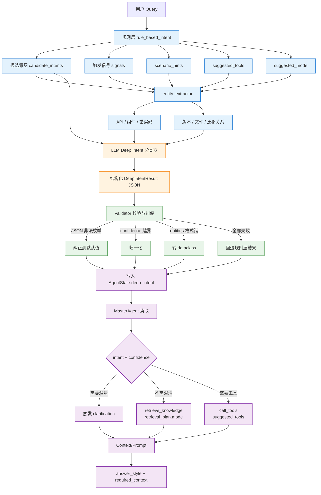
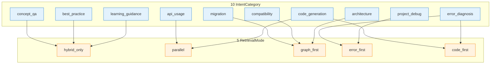
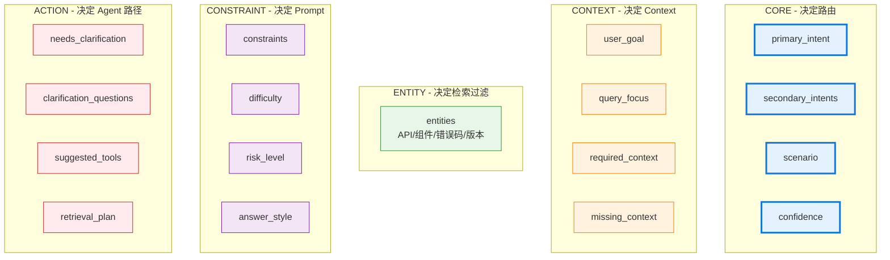

# 意图识别

> 本主题文件存放在 `technical_deep_dive/主题/`，允许题目与其他主题重复。

## 结合项目的详细说明

项目里的意图识别不是简单分类标签，而是 Agentic RAG 的路由中枢。它决定后续走哪种检索模式、是否调用工具、需要哪些上下文、答案用什么结构、是否要澄清、风险等级多高。换句话说，意图识别错了，后面的 RAG、工具、Prompt、Verifier 都可能沿着错误方向优化。

项目实现的是 Deep Intent，而不是只输出一个 intent 字符串。最终结构是 `DeepIntentResult`，包含 `primary_intent`、`secondary_intents`、`scenario`、`user_goal`、`query_focus`、`required_context`、`missing_context`、`entities`、`constraints`、`difficulty`、`risk_level`、`needs_clarification`、`suggested_tools`、`retrieval_plan`、`answer_style` 和 `confidence`。这让意图识别从"分类器"变成"执行计划生成器"。

这些字段的含义如下：

| 字段 | 含义 | 项目里怎么用 |
|---|---|---|
| `primary_intent` | 主意图，表示用户最核心的目标 | 决定主路由，例如走普通检索、错误诊断、代码生成还是迁移方案 |
| `secondary_intents` | 次意图，表示同一个问题里附带的其他目标 | 辅助检索和答案结构，比如主意图是 `project_debug`，次意图包含 `migration`、`compatibility` |
| `scenario` | 具体场景标签，比 intent 更细 | 标记白屏、崩溃、权限错误、路由迁移、FA 到 Stage 等场景 |
| `user_goal` | 用户真正想完成的结果 | 帮助生成答案时对齐目标，例如"修复白屏"而不是只解释白屏概念 |
| `query_focus` | 当前问题的关注点 | 用于 Query Rewrite、检索 query 和答案聚焦，避免回答发散 |
| `required_context` | 回答必须依赖的上下文 | 指导 ContextManager 必须优先放入哪些证据，比如 API 文档、错误码说明、迁移指南 |
| `missing_context` | 当前缺失但影响回答质量的信息 | 决定是否提示用户补充，比如缺少 API Level、日志、复现步骤、代码片段 |
| `entities` | 从 query 里抽取的实体 | 包含 API、组件、错误码、版本、文件名、迁移 from/to，用于检索过滤和工具参数 |
| `constraints` | 回答约束 | 例如是否需要代码示例、是否需要 before/after、是否需要 checklist、是否优先官方文档 |
| `difficulty` | 问题难度 | 影响是否使用更强模型、更大检索范围、更严格校验 |
| `risk_level` | 风险等级 | 决定是否需要谨慎回答、工具权限校验、人工兜底或更严格 Verifier |
| `needs_clarification` | 是否必须追问澄清 | 如果缺少关键上下文且无法可靠回答，就触发澄清问题 |
| `clarification_questions` | 需要问用户的澄清问题 | 让系统追问具体信息，而不是泛泛说"请补充更多信息" |
| `suggested_tools` | 建议工具列表 | 缩小 ToolAgent 候选工具范围，例如错误库、工单查询、版本兼容检查 |
| `retrieval_plan` | 检索计划 | 决定 `hybrid_only`、`graph_first`、`error_first`、`code_first`、`parallel` 等模式 |
| `answer_style` | 答案风格 | 决定 Prompt 模板，例如直接回答、代码解释、诊断步骤、迁移计划、学习路径 |
| `confidence` | 意图识别置信度 | 低置信时可扩大检索、保留多意图、触发澄清或走保守降级 |

可以用一个例子理解这些字段。用户问："API 12 上 Router 迁移 Navigation 后页面白屏怎么排查？"主意图可能是 `project_debug`，次意图包含 `migration`、`compatibility`、`error_diagnosis`；`scenario` 是 `white_screen` 和 `router_to_navigation`；`entities` 会抽取 `API 12`、`Router`、`Navigation`；`required_context` 包括迁移文档、API 12 兼容说明、白屏排障知识；`missing_context` 可能是页面代码、日志和复现步骤；`retrieval_plan` 可能选择 `error_first` 或 `graph_first`；`answer_style` 应该是 `diagnosis_steps`。

### 流程图

#### 1. Deep Intent 3 层架构（规则 → LLM → Validator）



#### 2. 10 IntentCategory → 5 RetrievalMode 映射



#### 3. DeepIntentResult 17 字段详解



#### 4. 置信度 7 分量 + 阈值动作

```mermaid
graph TB
    A[置信度 7 分量] --> S1[intent_signal_strength<br/>0.0-0.3]
    A --> S2[entity_coverage<br/>0.0-0.2]
    A --> S3[scenario_certainty<br/>0.0-0.15]
    A --> S4[llm_rule_alignment<br/>0.0-0.15]
    A --> S5[query_clarity<br/>0.0-0.1]
    A --> S6[tool_coverage<br/>0.0-0.1]
    A --> S7[llm_response_quality_bonus<br/>0.0-0.05]

    S1 + S2 + S3 + S4 + S5 + S6 + S7 --> C[final confidence 0.0-1.0]
    C -->|< 0.2 + needs_clarification| H1[human_fallback]
    C -->|< 0.5| H2[保守检索 hybrid_only]
    C -->|≥ 0.7| H3[激进检索 code_first/graph_first]

    classDef score fill:#E3F2FD,stroke:#1976D2
    classDef final fill:#E8F5E9,stroke:#388E3C
    classDef action fill:#FFF3E0,stroke:#F57C00
    class S1,S2,S3,S4,S5,S6,S7 score
    class C final
    class H1,H2,H3 action
```

### 易误会点（10 条）

**易误会点 1：意图识别 ≠ 简单分类**

是 **"执行计划生成器"**：输出 17 字段，驱动 RAG、Tool、Prompt、Verifier 后续行为。

**易误会点 2：Deep Intent ≠ 单标签分类**

输出 **primary + secondary_intents**（多意图），不是单标签。

**易误会点 3：规则层 ≠ 替代 LLM**

规则层负责**抓确定信号**（错误码、API 名、版本），LLM 负责**语义裁决 + 结构化补全**。

**易误会点 4：LLM-first 不是说 LLM 一定成功**

LLM 失败 → **回退规则层结果**。规则层是**兜底**。

**易误会点 5：IntentCategory 10 个 ≠ RetrievalMode 5 个**

10 个意图**多对一**映射到 5 个检索模式（详见 03-Agent §4.2.1）。

**易误会点 6：retrieval_plan 不是 hard-coded**

是**意图驱动的动态检索**。同一 query 不同意图 → 不同 mode。

**易误会点 7：needs_clarification ≠ 总是触发**

只有**缺关键上下文**且**无法可靠回答**才触发。否则体验差。

**易误会点 8：suggested_tools ≠ 强制调用**

只是**缩小 ToolAgent 候选**，**最终执行仍由 PolicyEngine 控制**。

**易误会点 9：实体抽取影响检索过滤**

没抽取 → 检索可能"宽召回"；抽到 `API 12` → 检索可加 metadata filter。

**易误会点 10：意图识别评估 = Agent 决策评估**

22 条 Agent Decision Eval 同时测：
- intent_accuracy（意图对）
- routing_accuracy（下一节点对）
- mode_accuracy（检索模式对）

### 常见追问 10 条

**追问 ①：Deep Intent 和普通意图分类区别？**
- 输出：17 字段 vs 1 个标签
- 决策：执行计划 vs 路由
- 评估：Agent 决策 vs 分类准确率

**追问 ②：多意图怎么处理？**
- primary_intent 选**最核心**的目标
- secondary_intents 列其他目标
- retrieval_plan 可选 `parallel`（多路并行）
- Prompt 包含所有意图的处理

**追问 ③：意图识别如何影响 RAG 检索？**
- primary_intent → retrieval_plan.mode
- entities → metadata filter
- scenario_hints → 召回权重
- required_context → 必检字段

**追问 ④：规则分类和 LLM 分类怎么结合？**
- 规则先抓确定信号
- LLM 在候选集上做主次裁决
- Validator 兜底
- LLM 失败回退规则

**追问 ⑤：意图识别如何评估？**
- 22 条 Agent Decision Eval
- 三个指标：intent_accuracy、routing_accuracy、mode_accuracy
- CI Eval Gate 阻断

**追问 ⑥：什么时候需要澄清？**
- 关键实体缺失（如 API Level）
- 用户表达歧义（"它""上次那个"）
- confidence < 0.2 + needs_clarification=True

**追问 ⑦：意图识别失败怎么办？**
- 默认 fallback 到 `concept_qa`
- 触发 conservative 检索
- 答案带 disclaimer

**追问 ⑧：Deep Intent 怎么支持新业务？**
- 加 IntentCategory 枚举值
- 加 rules.py 触发信号
- 加 llm_classifier.py Prompt
- 重跑 22 条评估

**追问 ⑨：意图识别延迟多少？**
- 规则层 < 10ms
- LLM 层 200-500ms
- 总计 < 600ms（含 LLM 调用）

**追问 ⑩：意图识别是训练的吗？**
- ❌ **不训练**（项目不微调）
- 规则用 `rule_based_intent` 函数
- LLM 用 few-shot + 严格 schema
- 评估集每月补充

项目支持的 primary intents 包括：

| 意图 | 典型问题 | 后续策略 |
|---|---|---|
| concept_qa | "Stage 模型是什么" | hybrid_only 检索，直接解释 |
| api_usage | "@ohos.net.http 怎么发送 POST" | code_first / API 文档 + 示例 |
| code_generation | "写一个 ArkTS 网络请求示例" | sample_code_search + 代码生成结构 |
| error_diagnosis | "permission denied 怎么排查" | error_first + 工具/错误库 |
| migration | "Router 到 Navigation 怎么迁移" | graph_first + 迁移指南 |
| compatibility | "API Level 12 支持吗" | graph_first + version filter |
| project_debug | "项目启动白屏怎么办" | error_first + 工具 + 排查步骤 |
| best_practice | "大型应用如何模块化" | hybrid_only + 最佳实践 |
| architecture | "Ability 和 Activity 有什么不同" | graph_first / 结构化对比 |
| learning_guidance | "Android 开发者怎么学鸿蒙" | learning_path 答案风格 |

实现上分三层：规则识别、LLM 深意图分类、schema 校验与纠偏。规则层由 `rule_based_intent(query)` 完成，速度快、可解释，负责从关键词和模式中提取候选意图、触发信号、场景提示、建议工具和建议检索模式。比如"报错/异常/permission denied"触发 error_diagnosis，"迁移/升级/替换/废弃 API"触发 migration，"API Level/HarmonyOS NEXT"触发 compatibility，"写一个/生成/示例代码"触发 code_generation。

前面加规则层，不是为了替代 LLM，而是为了让意图识别更稳、更快、更便宜、更可控。直接让每个请求先走 LLM，会多一次模型调用，高并发下延迟和成本都明显增加；而错误码、API Level、`@ohos.xxx`、`deprecated`、`白屏`、`permission denied` 这类强信号，本来就更适合用规则稳定识别。规则层先把确定信号抓出来，LLM 就不是从零猜测，而是在候选意图和触发信号基础上做主次裁决和结构化补全。

这也是一条降级链路。LLM 调用失败、JSON 解析失败或输出非法枚举时，系统可以回退到规则结果；如果没有规则层，意图识别失败后通常只能默认 `concept_qa`，后续检索和工具路由就容易整体跑偏。规则层还方便排障和调参：线上 bad case 可以直接看到 `candidate_intents`、`signals`、`scenario_hints`、`suggested_tools` 和 `suggested_mode`，从而判断是规则漏召回、LLM 裁决错，还是路由策略错。

可以把两阶段理解成：

```text
规则层：快速抓确定信号，生成候选意图、场景提示、建议工具和检索模式
LLM 层：处理隐含目标、多意图主次关系、缺失上下文、answer_style
Validator：校验 JSON、修正非法枚举、失败时回退规则结果
```

面试时可以这样解释：不是不信任 LLM，而是不把确定性、低成本、可解释的工作交给 LLM。规则层负责抓强信号和兜底，LLM 负责语义裁决和结构化补全，这样比纯 LLM 更稳定、成本更低，也更容易排查。

规则层不是最终答案，因为真实问题经常多意图。比如"API 12 上 Router 迁移 Navigation 后页面白屏怎么排查"同时包含 compatibility、migration、project_debug、error_diagnosis。规则层会把候选意图和信号交给 LLM 分类器，LLM 根据系统 Prompt 输出结构化 JSON，补充 user_goal、required_context、missing_context、entities、constraints 和 answer_style。

LLM 分类器也不能裸用。项目要求只输出 JSON，并对允许枚举做限制：intent、retrieval_mode、answer_style、risk_level、tools 都必须来自白名单。输出后进入 `validate_deep_intent`，非法 primary_intent 会纠正成默认值，非法 retrieval_mode 会回退，confidence 会归一化，entities/constraints 会转成 dataclass。LLM 调用失败或 JSON 解析失败时，系统回退到 rule-based result，保证路由链路不中断。

实体抽取是意图识别的关键补充。`DeepIntentEntities` 里保存 APIs、components、errors、api_levels、versions、files、migration_from、migration_to。比如 query 中出现 `@ohos.net.http`、`API 12`、`Router`、`Navigation`、`permission denied`，这些实体会影响检索过滤、工具选择和答案结构。没有实体抽取，系统只能知道"这是迁移问题"，但不知道"从什么迁移到什么"。

retrieval_plan 是 Deep Intent 对 RAG 的直接控制面。`hybrid_only` 适合普通概念和最佳实践；`graph_first` 适合迁移、兼容、架构关系；`error_first` 适合错误诊断和项目调试；`code_first` 适合 API 用法和代码生成；`parallel` 适合多意图或不确定场景。这样 RAG 不是固定策略，而是由意图驱动的动态检索。

意图识别还影响工具调用。`suggested_tools` 会缩小 ToolAgent 的候选集合，例如 error_diagnosis_search、ticket_search、version_compatibility_check、sample_code_search、code_review。这样做能降低工具误选概率，也能减少 LLM 在大量工具之间盲选的成本。最终工具执行仍由 PolicyEngine 和 ToolExecutor 做权限与参数校验。

意图识别和 Memory 也有关。当前 query 的 intent 会写入短期会话消息，帮助多轮对话理解；长期记忆检索时，intent 会影响选择语义记忆还是情节记忆。比如用户问"你还记得上次 LangGraph 的问题吗"，这更像情节记忆检索；用户问"以后回答风格是什么"，这更像语义记忆/用户画像。

评估方面，项目有 Agent Decision Eval，测试每个 query 的 expected_intent、expected_next_node 和 expected_retrieval_mode。指标包括 intent_accuracy、routing_accuracy、mode_accuracy。比如 error_diagnosis 应该走 call_tools + error_first，migration 应该走 retrieve_knowledge + graph_first，code_generation 应该走 retrieve_knowledge + code_first。这个评估能防止改规则或 Prompt 后路由质量退化。

面试时可以这样收束：项目的意图识别不是"给问题贴标签"，而是把自然语言请求转换成可执行计划。它输出意图、实体、缺失上下文、检索策略、工具建议、风险和答案风格，驱动 RAG、Agent、Tool、Prompt 和 Verifier 的后续行为。

## 匹配到的题目（8 道）

### 1. 在记忆系统中，意图识别承担什么职责？ [来源:02_Agent核心原理.md | 重要性:A]

**结合项目回答评分：** 10/10（匹配置信度 95/100）

**结合项目的回答：**

结合项目回答：意图识别在记忆系统里负责判断当前问题需要哪类上下文。普通追问主要读取短期记忆和会话摘要；引用历史事件时检索长期情节记忆；涉及稳定偏好、技术栈、业务规则时读取长期语义记忆；如果是任务执行中的中间状态，则从 LangGraph State/Checkpoint 读取工作记忆。它不是直接决定"记不记"，而是影响读哪层记忆、写入时是否提升到长期记忆，以及进入上下文窗口的优先级。

**完美答案：**

意图识别在记忆系统中承担"上下文路由器"的职责。它先判断用户是在延续当前会话、引用历史事件、表达长期偏好，还是要求执行某个任务。延续当前会话时优先使用短期记忆；引用"上次/之前/第几次"时检索情节记忆；表达"以后都/我偏好/我的技术栈"时写入或读取语义记忆；任务执行状态则进入工作记忆。这样可以避免把所有记忆都塞进 Prompt，也避免该记住的长期偏好丢失。

---

### 2. Deep Intent 和普通意图分类有什么区别？ [来源:项目扩展题 | 重要性:A]

**结合项目回答评分：** 10/10（匹配置信度 96/100）

**结合项目的回答：**

结合项目回答：普通意图分类只输出一个 label，而项目的 Deep Intent 输出结构化执行计划，包括 primary/secondary intents、scenario、entities、constraints、missing_context、suggested_tools、retrieval_plan、answer_style、risk_level 和 confidence。这个结果会驱动 RetrievalRouter、ToolAgent、PromptBuilder 和 Verifier。

**完美答案：**

普通意图分类解决"这是什么类型的问题"，Deep Intent 解决"这个问题后续应该怎么处理"。除了 primary_intent，它还要识别实体、版本、错误码、迁移关系、缺失上下文、是否需要代码示例、是否需要澄清、该走哪种检索模式、该调用哪些工具、答案应该用什么结构。Deep Intent 更像一个轻量 Planner，是 Agentic RAG 的入口控制面。

---

### 3. 多意图问题怎么处理？ [来源:项目扩展题 | 重要性:A]

**结合项目回答评分：** 10/10（匹配置信度 94/100）

**结合项目的回答：**

结合项目回答：项目允许 primary_intent + secondary_intents。规则层先产生候选意图，LLM 层再结合场景决定主次。比如"API 12 上 Router 迁移 Navigation 后白屏怎么排查"可以 primary=project_debug，secondary=[migration, compatibility, error_diagnosis]，retrieval_plan 选择 error_first 或 graph_first，并在 required_context 中要求版本、日志和迁移文档。

**完美答案：**

多意图不能简单取第一个关键词。应该先识别所有候选意图，再根据用户目标决定主意图：用户要"修问题"，project_debug/error_diagnosis 优先；用户要"怎么迁移"，migration 优先；用户要"能不能用"，compatibility 优先。secondary_intents 用来补充检索策略和答案结构。工程上要保留多意图，而不是硬压成单标签。

---

### 4. 意图识别结果如何影响 RAG 检索？ [来源:项目扩展题 | 重要性:A]

**结合项目回答评分：** 10/10（匹配置信度 98/100）

**结合项目的回答：**

结合项目回答：Deep Intent 会输出 retrieval_plan。concept_qa/best_practice 多走 hybrid_only；migration/compatibility/architecture 更偏 graph_first；error_diagnosis/project_debug 走 error_first；api_usage/code_generation 走 code_first。它还会把 entities 和 filters 传给检索器，例如 API Level、组件名、错误码、迁移 from/to。

**完美答案：**

意图识别决定检索"查哪里、怎么查、用什么过滤"。概念问题需要语义+关键词文档；错误问题要优先错误库、日志、工单；迁移问题要查迁移指南和图谱关系；代码问题要查 API 文档和 sample code。没有意图识别，所有问题都用同一个 Top-K 检索，很容易召回看似相关但不适合当前任务的文档。

---

### 5. 规则分类和 LLM 分类怎么结合？ [来源:项目扩展题 | 重要性:A]

**结合项目回答评分：** 10/10（匹配置信度 95/100）

**结合项目的回答：**

结合项目回答：规则层先用关键词和模式做快速候选，输出 candidate_intents、signals、scenario_hints、suggested_tools 和 suggested_mode；LLM 层把规则结果和实体作为提示，生成完整 DeepIntentResult；最后 validator 校验枚举、字段和置信度。LLM 失败时回退到规则结果。

**完美答案：**

规则分类快、稳定、可解释，适合识别错误码、API 名、版本号、迁移关键词等强信号；LLM 分类擅长处理隐含目标、多意图和上下文语义。两者结合的方式是规则先召回候选，LLM 做裁决和补全，validator 做安全纠偏。这样比纯规则更灵活，比纯 LLM 更稳定。

---

### 6. 意图识别如何评估？ [来源:项目扩展题 | 重要性:A]

**结合项目回答评分：** 10/10（匹配置信度 93/100）

**结合项目的回答：**

结合项目回答：项目用 Agent Decision Eval 评估 expected_intent、expected_next_node 和 expected_retrieval_mode。指标包括 intent_accuracy、routing_accuracy、mode_accuracy。测试集覆盖 concept_qa、api_usage、code_generation、error_diagnosis、migration、compatibility、project_debug、best_practice、architecture、learning_guidance 和多意图边界 case。

**完美答案：**

意图识别不能只看分类准确率，还要看它对后续行为是否正确。一个 case 至少要标注 expected_intent、expected_route、expected_retrieval_mode、是否需要工具、是否需要代码、是否需要澄清。线上还要看误路由率、用户追问率、fallback rate 和 bad case 归因。因为意图错的真正损失，是后续检索和工具都走错。

---

### 7. 什么时候需要澄清，什么时候直接回答？ [来源:项目扩展题 | 重要性:B]

**结合项目回答评分：** 9/10（匹配置信度 90/100）

**结合项目的回答：**

结合项目回答：Deep Intent 输出 needs_clarification、missing_context 和 clarification_questions。项目原则是不轻易追问：能给通用答案时先回答，同时列出缺失上下文；只有没有关键上下文无法定位问题时才追问，例如只说"白屏了"但没有版本、页面、日志、复现条件。

**完美答案：**

澄清的标准是"缺失信息是否阻断下一步"。如果缺失信息只影响答案精度，可以先给通用方案并说明需要哪些信息进一步定位；如果缺失信息会导致方向完全不确定，比如错误诊断没有任何日志、迁移不知道 from/to、兼容问题没有版本，就需要澄清。过度追问会损害体验，完全不追问会制造幻觉。

---

### 8. 意图识别和工具选择是什么关系？ [来源:项目扩展题 | 重要性:A]

**结合项目回答评分：** 10/10（匹配置信度 92/100）

**结合项目的回答：**

结合项目回答：Deep Intent 的 suggested_tools 会缩小 ToolAgent 候选集合。error_diagnosis 可建议 error_diagnosis_search/ticket_search，compatibility 可建议 version_compatibility_check，code_generation 可建议 sample_code_search/code_review。最终执行前仍由 ToolRegistry、PolicyEngine 和 ToolExecutor 做 schema、权限和风险校验。

**完美答案：**

意图识别负责判断"可能需要哪些工具"，工具选择负责在候选工具中决定"具体调用哪个、参数是什么"。前者降低搜索空间，后者完成结构化调用。两者都不能替代权限控制：即使意图识别建议了某个工具，执行层仍要校验用户权限、租户边界、参数 schema 和风险等级。
